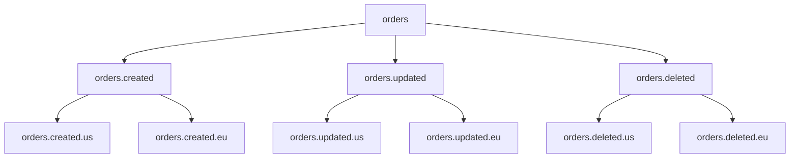
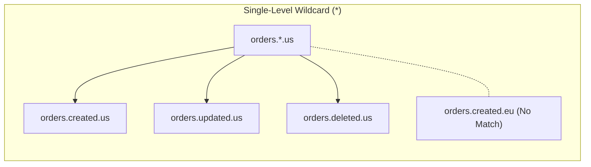
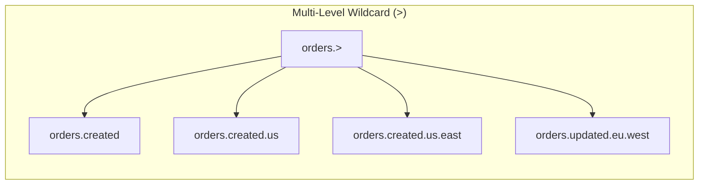
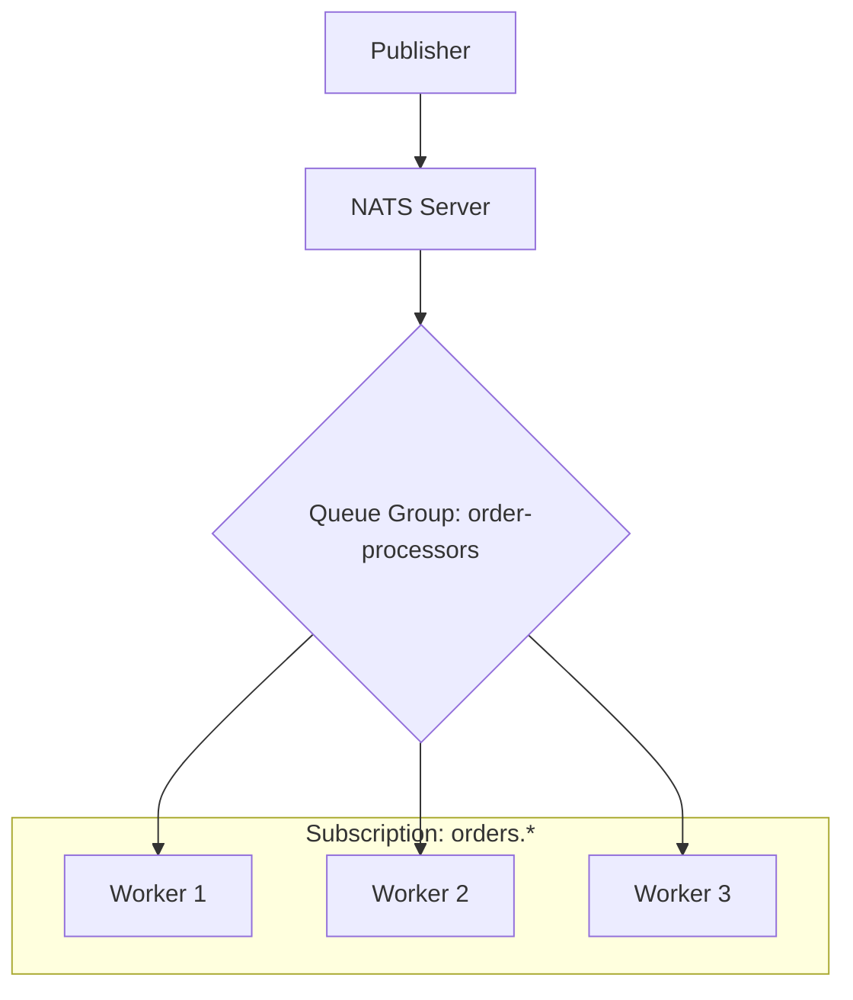
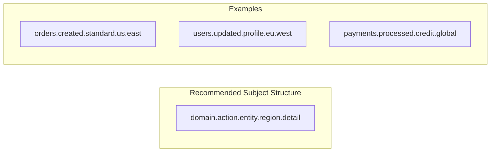

# How to Implement Wildcard Subscriptions in NATS

Author: [nawazdhandala](https://github.com/nawazdhandala)

Tags: NATS, Messaging, Microservices, Pub/Sub, Event-Driven

Description: Learn how to implement wildcard subscriptions in NATS messaging system. Covers single-level and multi-level wildcards, practical patterns for event routing, and best practices for building scalable event-driven architectures.

---

NATS provides a powerful publish-subscribe messaging system that enables microservices to communicate efficiently. Wildcard subscriptions allow subscribers to receive messages from multiple subjects using pattern matching, making it easier to build flexible and scalable event-driven architectures. Understanding wildcards is essential for designing effective message routing strategies in distributed systems.

## Understanding NATS Subject Hierarchy

NATS uses a dot-separated subject naming convention that creates a natural hierarchy. Subjects follow a tree-like structure where each segment represents a level in the hierarchy.



## Two Types of Wildcards

NATS supports two wildcard tokens for flexible subscription patterns:

| Wildcard | Symbol | Matches | Example |
|----------|--------|---------|---------|
| Single-level | `*` | Exactly one token | `orders.*.us` matches `orders.created.us` |
| Multi-level | `>` | One or more tokens | `orders.>` matches `orders.created.us.east` |





## Setting Up NATS

Install NATS server using Docker for local development.

```bash
# Start NATS server with JetStream enabled for persistence
docker run -d --name nats-server -p 4222:4222 -p 8222:8222 nats:latest -js -m 8222

# Verify server is running
curl http://localhost:8222/varz
```

Install the NATS client library for Node.js.

```bash
npm install nats
```

## Basic Connection Setup

Establish a connection to the NATS server with proper error handling and reconnection logic.

```javascript
// connection.js
const { connect } = require('nats');

async function createNATSConnection() {
  // Connect to NATS server with reconnection settings
  const nc = await connect({
    servers: process.env.NATS_URL || 'nats://localhost:4222',
    // Reconnection settings for production resilience
    reconnect: true,
    maxReconnectAttempts: -1,  // Unlimited reconnection attempts
    reconnectTimeWait: 2000,   // Wait 2 seconds between attempts
    // Connection name helps identify clients in monitoring
    name: 'my-service',
  });

  console.log(`Connected to NATS: ${nc.getServer()}`);

  // Handle connection events for monitoring
  (async () => {
    for await (const status of nc.status()) {
      console.log(`NATS status: ${status.type} - ${JSON.stringify(status.data)}`);
    }
  })();

  return nc;
}

module.exports = { createNATSConnection };
```

## Single-Level Wildcard (*)

The asterisk wildcard matches exactly one token at a specific position in the subject hierarchy. Use it when you need to subscribe to all variations of a specific segment while keeping other segments fixed.

```javascript
// single-wildcard-subscriber.js
const { createNATSConnection } = require('./connection');
const { StringCodec } = require('nats');

async function subscribeSingleWildcard() {
  const nc = await createNATSConnection();
  const sc = StringCodec();

  // Subscribe to all order events for the US region
  // Matches: orders.created.us, orders.updated.us, orders.deleted.us
  // Does NOT match: orders.created.eu, orders.created.us.east
  const subscription = nc.subscribe('orders.*.us');

  console.log('Subscribed to orders.*.us');

  // Process incoming messages
  for await (const msg of subscription) {
    const data = JSON.parse(sc.decode(msg.data));

    // Extract event type from subject (orders.CREATED.us -> created)
    const eventType = msg.subject.split('.')[1];

    console.log(`[${eventType.toUpperCase()}] Order in US:`, {
      subject: msg.subject,
      orderId: data.orderId,
      amount: data.amount,
    });

    // Route to appropriate handler based on event type
    switch (eventType) {
      case 'created':
        await handleOrderCreated(data);
        break;
      case 'updated':
        await handleOrderUpdated(data);
        break;
      case 'deleted':
        await handleOrderDeleted(data);
        break;
    }
  }
}

async function handleOrderCreated(data) {
  console.log('Processing new order:', data.orderId);
  // Add order processing logic here
}

async function handleOrderUpdated(data) {
  console.log('Processing order update:', data.orderId);
  // Add update logic here
}

async function handleOrderDeleted(data) {
  console.log('Processing order deletion:', data.orderId);
  // Add deletion logic here
}

subscribeSingleWildcard().catch(console.error);
```

## Multi-Level Wildcard (>)

The greater-than wildcard matches one or more tokens at the end of a subject. Place it at the end of your subscription pattern to capture all messages within a subject hierarchy.

```javascript
// multi-wildcard-subscriber.js
const { createNATSConnection } = require('./connection');
const { StringCodec } = require('nats');

async function subscribeMultiWildcard() {
  const nc = await createNATSConnection();
  const sc = StringCodec();

  // Subscribe to ALL order events across all regions and sub-categories
  // Matches: orders.created, orders.updated.us, orders.created.eu.west
  // Matches any depth: orders.a.b.c.d.e
  const subscription = nc.subscribe('orders.>');

  console.log('Subscribed to orders.> (all order events)');

  for await (const msg of subscription) {
    const data = JSON.parse(sc.decode(msg.data));

    // Parse subject segments to understand the event context
    const segments = msg.subject.split('.');
    const eventType = segments[1];              // created, updated, deleted
    const region = segments[2] || 'global';     // us, eu, or undefined
    const subRegion = segments[3] || null;      // east, west, or undefined

    console.log('Order event received:', {
      subject: msg.subject,
      eventType,
      region,
      subRegion,
      orderId: data.orderId,
    });

    // Fan out to region-specific processors
    await routeToRegionalProcessor(region, eventType, data);
  }
}

async function routeToRegionalProcessor(region, eventType, data) {
  console.log(`Routing ${eventType} event to ${region} processor`);
  // Add regional routing logic here
}

subscribeMultiWildcard().catch(console.error);
```

## Publishing Messages

Publishers send messages to specific subjects. Subscribers with matching wildcard patterns receive these messages.

```javascript
// publisher.js
const { createNATSConnection } = require('./connection');
const { StringCodec } = require('nats');

async function publishOrderEvents() {
  const nc = await createNATSConnection();
  const sc = StringCodec();

  // Helper function to publish order events
  function publishOrder(subject, data) {
    const payload = JSON.stringify({
      ...data,
      timestamp: new Date().toISOString(),
    });
    nc.publish(subject, sc.encode(payload));
    console.log(`Published to ${subject}:`, data);
  }

  // Publish various order events to different subjects
  // All these will be received by 'orders.>' subscriber
  publishOrder('orders.created.us', {
    orderId: 'ORD-001',
    amount: 150.00,
    currency: 'USD',
  });

  publishOrder('orders.created.eu', {
    orderId: 'ORD-002',
    amount: 200.00,
    currency: 'EUR',
  });

  publishOrder('orders.updated.us', {
    orderId: 'ORD-001',
    amount: 175.00,
    status: 'confirmed',
  });

  publishOrder('orders.deleted.eu.west', {
    orderId: 'ORD-003',
    reason: 'cancelled',
  });

  // Flush to ensure all messages are sent before closing
  await nc.flush();
  await nc.close();
}

publishOrderEvents().catch(console.error);
```

## Advanced Pattern: Event Aggregator

Create an event aggregator that collects events from multiple services using wildcards and forwards them to a central logging or analytics system.

```javascript
// event-aggregator.js
const { createNATSConnection } = require('./connection');
const { StringCodec } = require('nats');

class EventAggregator {
  constructor(nc) {
    this.nc = nc;
    this.sc = StringCodec();
    this.subscriptions = [];
    this.eventBuffer = [];
    this.flushInterval = null;
  }

  // Subscribe to multiple service event streams using wildcards
  async subscribeToServices(servicePatterns) {
    for (const pattern of servicePatterns) {
      const sub = this.nc.subscribe(pattern);
      this.subscriptions.push(sub);

      // Process events from each subscription
      this.processSubscription(sub, pattern);
    }

    // Periodically flush aggregated events
    this.flushInterval = setInterval(() => this.flushEvents(), 5000);
  }

  async processSubscription(subscription, pattern) {
    console.log(`Aggregating events from: ${pattern}`);

    for await (const msg of subscription) {
      const data = JSON.parse(this.sc.decode(msg.data));

      // Extract service name from subject (service.event.details)
      const service = msg.subject.split('.')[0];

      // Add metadata and buffer the event
      this.eventBuffer.push({
        service,
        subject: msg.subject,
        data,
        receivedAt: new Date().toISOString(),
      });

      // Flush immediately if buffer is large
      if (this.eventBuffer.length >= 100) {
        await this.flushEvents();
      }
    }
  }

  async flushEvents() {
    if (this.eventBuffer.length === 0) return;

    const events = this.eventBuffer.splice(0, this.eventBuffer.length);
    console.log(`Flushing ${events.length} aggregated events`);

    // Send aggregated events to analytics or logging service
    // In production, send to Elasticsearch, ClickHouse, or similar
    await this.sendToAnalytics(events);
  }

  async sendToAnalytics(events) {
    // Publish aggregated events to a central topic
    const payload = JSON.stringify({ events, count: events.length });
    this.nc.publish('analytics.events.batch', this.sc.encode(payload));
  }

  async shutdown() {
    clearInterval(this.flushInterval);
    await this.flushEvents();
    for (const sub of this.subscriptions) {
      sub.unsubscribe();
    }
  }
}

async function main() {
  const nc = await createNATSConnection();
  const aggregator = new EventAggregator(nc);

  // Subscribe to all events from multiple services using wildcards
  await aggregator.subscribeToServices([
    'orders.>',      // All order events
    'users.>',       // All user events
    'payments.>',    // All payment events
    'inventory.>',   // All inventory events
  ]);

  // Handle graceful shutdown
  process.on('SIGTERM', async () => {
    console.log('Shutting down aggregator...');
    await aggregator.shutdown();
    await nc.close();
  });
}

main().catch(console.error);
```

## Queue Groups with Wildcards

Combine wildcards with queue groups for load-balanced message processing across multiple service instances.



```javascript
// queue-worker.js
const { createNATSConnection } = require('./connection');
const { StringCodec } = require('nats');

async function startQueueWorker(workerId) {
  const nc = await createNATSConnection();
  const sc = StringCodec();

  // Subscribe with queue group for load balancing
  // Multiple workers can subscribe to the same pattern with the same queue name
  // NATS ensures each message is delivered to only ONE worker in the group
  const subscription = nc.subscribe('orders.*', {
    queue: 'order-processors',  // Queue group name
  });

  console.log(`Worker ${workerId} subscribed to orders.* (queue: order-processors)`);

  let processedCount = 0;

  for await (const msg of subscription) {
    const data = JSON.parse(sc.decode(msg.data));
    processedCount++;

    console.log(`Worker ${workerId} processing message #${processedCount}:`, {
      subject: msg.subject,
      orderId: data.orderId,
    });

    // Simulate processing time
    await new Promise(resolve => setTimeout(resolve, 100));

    console.log(`Worker ${workerId} completed processing order ${data.orderId}`);
  }
}

// Start multiple workers for demonstration
// In production, these would be separate processes or containers
const workerId = process.env.WORKER_ID || '1';
startQueueWorker(workerId).catch(console.error);
```

## Subject Naming Best Practices

Follow a consistent naming convention for subjects to make wildcards more effective.



```javascript
// subject-conventions.js

// Define subject builders for consistent naming
const SubjectBuilder = {
  // Build order subjects: orders.<action>.<type>.<region>
  order: (action, type, region) => {
    const parts = ['orders', action];
    if (type) parts.push(type);
    if (region) parts.push(region);
    return parts.join('.');
  },

  // Build user subjects: users.<action>.<attribute>
  user: (action, attribute) => {
    const parts = ['users', action];
    if (attribute) parts.push(attribute);
    return parts.join('.');
  },

  // Build notification subjects: notifications.<channel>.<priority>.<userId>
  notification: (channel, priority, userId) => {
    return `notifications.${channel}.${priority}.${userId}`;
  },
};

// Subject pattern constants for subscribers
const SubjectPatterns = {
  // All order events
  ALL_ORDERS: 'orders.>',

  // All created events across domains
  ALL_CREATED: '*.created.>',

  // All US region events for any domain
  ALL_US_EVENTS: '*.*.*.us',

  // All high priority notifications
  HIGH_PRIORITY_NOTIFICATIONS: 'notifications.*.high.>',
};

// Examples of usage
console.log(SubjectBuilder.order('created', 'premium', 'us'));
// Output: orders.created.premium.us

console.log(SubjectBuilder.notification('email', 'high', 'user-123'));
// Output: notifications.email.high.user-123

module.exports = { SubjectBuilder, SubjectPatterns };
```

## Monitoring Subscriptions

Track active subscriptions and message flow for debugging and performance monitoring.

```javascript
// subscription-monitor.js
const { createNATSConnection } = require('./connection');
const { StringCodec } = require('nats');

class SubscriptionMonitor {
  constructor(nc) {
    this.nc = nc;
    this.sc = StringCodec();
    this.stats = new Map();
  }

  // Create a monitored subscription that tracks message counts
  subscribe(pattern, options = {}) {
    const sub = this.nc.subscribe(pattern, options);

    // Initialize stats for the pattern
    this.stats.set(pattern, {
      messageCount: 0,
      lastMessage: null,
      errors: 0,
      startTime: new Date(),
    });

    // Wrap the subscription to track stats
    return this.wrapSubscription(sub, pattern);
  }

  async *wrapSubscription(subscription, pattern) {
    const stats = this.stats.get(pattern);

    for await (const msg of subscription) {
      stats.messageCount++;
      stats.lastMessage = new Date();

      try {
        yield msg;
      } catch (error) {
        stats.errors++;
        console.error(`Error processing message on ${pattern}:`, error);
      }
    }
  }

  // Get statistics for all subscriptions
  getStats() {
    const result = {};

    for (const [pattern, stats] of this.stats) {
      const uptime = (new Date() - stats.startTime) / 1000;
      result[pattern] = {
        ...stats,
        messagesPerSecond: (stats.messageCount / uptime).toFixed(2),
        uptime: `${uptime.toFixed(0)}s`,
      };
    }

    return result;
  }

  // Publish stats periodically
  startStatsPublisher(intervalMs = 10000) {
    setInterval(() => {
      const stats = this.getStats();
      const payload = JSON.stringify(stats);
      this.nc.publish('monitoring.subscriptions', this.sc.encode(payload));
      console.log('Subscription stats:', stats);
    }, intervalMs);
  }
}

async function main() {
  const nc = await createNATSConnection();
  const monitor = new SubscriptionMonitor(nc);

  // Create monitored subscriptions
  const orderSub = monitor.subscribe('orders.>');
  const userSub = monitor.subscribe('users.*');

  // Start publishing stats
  monitor.startStatsPublisher(5000);

  // Process messages
  (async () => {
    for await (const msg of orderSub) {
      console.log('Order event:', msg.subject);
    }
  })();

  (async () => {
    for await (const msg of userSub) {
      console.log('User event:', msg.subject);
    }
  })();
}

main().catch(console.error);
```

## Error Handling and Retry Logic

Implement robust error handling for wildcard subscriptions with dead letter queues.

```javascript
// resilient-subscriber.js
const { createNATSConnection } = require('./connection');
const { StringCodec } = require('nats');

class ResilientSubscriber {
  constructor(nc, options = {}) {
    this.nc = nc;
    this.sc = StringCodec();
    this.maxRetries = options.maxRetries || 3;
    this.retryDelay = options.retryDelay || 1000;
    this.deadLetterSubject = options.deadLetterSubject || 'dead-letter';
  }

  async subscribe(pattern, handler) {
    const subscription = this.nc.subscribe(pattern);
    console.log(`Resilient subscriber started for: ${pattern}`);

    for await (const msg of subscription) {
      await this.processWithRetry(msg, handler);
    }
  }

  async processWithRetry(msg, handler) {
    let lastError = null;

    for (let attempt = 1; attempt <= this.maxRetries; attempt++) {
      try {
        const data = JSON.parse(this.sc.decode(msg.data));
        await handler(data, msg.subject);
        return; // Success - exit retry loop
      } catch (error) {
        lastError = error;
        console.error(`Attempt ${attempt}/${this.maxRetries} failed for ${msg.subject}:`, error.message);

        if (attempt < this.maxRetries) {
          // Exponential backoff
          const delay = this.retryDelay * Math.pow(2, attempt - 1);
          await new Promise(resolve => setTimeout(resolve, delay));
        }
      }
    }

    // All retries exhausted - send to dead letter queue
    await this.sendToDeadLetter(msg, lastError);
  }

  async sendToDeadLetter(originalMsg, error) {
    const deadLetterPayload = {
      originalSubject: originalMsg.subject,
      originalData: this.sc.decode(originalMsg.data),
      error: error.message,
      failedAt: new Date().toISOString(),
      retryCount: this.maxRetries,
    };

    this.nc.publish(
      this.deadLetterSubject,
      this.sc.encode(JSON.stringify(deadLetterPayload))
    );

    console.error(`Message sent to dead letter queue: ${originalMsg.subject}`);
  }
}

async function main() {
  const nc = await createNATSConnection();

  const subscriber = new ResilientSubscriber(nc, {
    maxRetries: 3,
    retryDelay: 1000,
    deadLetterSubject: 'orders.dead-letter',
  });

  // Handler that might fail
  const orderHandler = async (data, subject) => {
    console.log(`Processing order from ${subject}:`, data.orderId);

    // Simulate occasional failures
    if (Math.random() < 0.3) {
      throw new Error('Temporary processing failure');
    }

    console.log(`Successfully processed order ${data.orderId}`);
  };

  await subscriber.subscribe('orders.>', orderHandler);
}

main().catch(console.error);
```

## JetStream with Wildcards

Use JetStream for persistent messaging with wildcard subscriptions to ensure no messages are lost.

```javascript
// jetstream-wildcard.js
const { createNATSConnection } = require('./connection');
const { StringCodec, AckPolicy, DeliverPolicy } = require('nats');

async function setupJetStreamWithWildcards() {
  const nc = await createNATSConnection();
  const js = nc.jetstream();
  const jsm = await nc.jetstreamManager();
  const sc = StringCodec();

  // Create a stream that captures all order events using wildcards
  try {
    await jsm.streams.add({
      name: 'ORDERS',
      subjects: ['orders.>'],  // Capture all order-related subjects
      retention: 'limits',
      max_msgs: 100000,
      max_bytes: 1024 * 1024 * 100, // 100MB
      max_age: 7 * 24 * 60 * 60 * 1000000000, // 7 days in nanoseconds
    });
    console.log('Stream ORDERS created');
  } catch (error) {
    if (error.message.includes('already')) {
      console.log('Stream ORDERS already exists');
    } else {
      throw error;
    }
  }

  // Create a durable consumer with wildcard filter
  const consumer = await js.consumers.get('ORDERS', 'order-processor');

  // If consumer does not exist, create it
  if (!consumer) {
    await jsm.consumers.add('ORDERS', {
      durable_name: 'order-processor',
      ack_policy: AckPolicy.Explicit,
      deliver_policy: DeliverPolicy.All,
      filter_subject: 'orders.created.>',  // Only process created events
    });
  }

  // Consume messages with explicit acknowledgment
  const messages = await js.consume('ORDERS', 'order-processor');

  console.log('Consuming from JetStream with wildcard filter');

  for await (const msg of messages) {
    const data = JSON.parse(sc.decode(msg.data));

    console.log('JetStream message received:', {
      subject: msg.subject,
      seq: msg.seq,
      data,
    });

    try {
      // Process the message
      await processOrder(data);
      // Acknowledge successful processing
      msg.ack();
    } catch (error) {
      console.error('Processing failed:', error);
      // Negative acknowledgment - message will be redelivered
      msg.nak();
    }
  }
}

async function processOrder(data) {
  console.log('Processing order:', data.orderId);
  // Add order processing logic
}

setupJetStreamWithWildcards().catch(console.error);
```

## Testing Wildcard Subscriptions

Create comprehensive tests for wildcard subscription logic.

```javascript
// wildcard-tests.js
const { connect, StringCodec } = require('nats');

async function runWildcardTests() {
  const nc = await connect({ servers: 'nats://localhost:4222' });
  const sc = StringCodec();

  const results = [];

  // Test helper function
  async function testPattern(pattern, subjects, shouldMatch) {
    const received = [];
    const sub = nc.subscribe(pattern, { max: subjects.length });

    // Start collecting messages
    const collector = (async () => {
      for await (const msg of sub) {
        received.push(msg.subject);
      }
    })();

    // Publish test messages
    for (const subject of subjects) {
      nc.publish(subject, sc.encode('test'));
    }

    // Wait for messages
    await nc.flush();
    await new Promise(resolve => setTimeout(resolve, 100));
    sub.unsubscribe();

    // Verify results
    const passed = shouldMatch.every(s => received.includes(s)) &&
                   received.length === shouldMatch.length;

    results.push({
      pattern,
      subjects,
      expected: shouldMatch,
      received,
      passed,
    });
  }

  // Test single-level wildcard
  await testPattern(
    'orders.*.us',
    ['orders.created.us', 'orders.updated.us', 'orders.created.eu'],
    ['orders.created.us', 'orders.updated.us']
  );

  // Test multi-level wildcard
  await testPattern(
    'orders.>',
    ['orders.created', 'orders.created.us', 'orders.created.us.east', 'users.created'],
    ['orders.created', 'orders.created.us', 'orders.created.us.east']
  );

  // Test combined wildcards
  await testPattern(
    '*.created.*',
    ['orders.created.us', 'users.created.eu', 'orders.updated.us'],
    ['orders.created.us', 'users.created.eu']
  );

  // Print results
  console.log('\n=== Wildcard Subscription Test Results ===\n');

  for (const result of results) {
    const status = result.passed ? 'PASS' : 'FAIL';
    console.log(`[${status}] Pattern: ${result.pattern}`);
    console.log(`  Subjects: ${result.subjects.join(', ')}`);
    console.log(`  Expected: ${result.expected.join(', ')}`);
    console.log(`  Received: ${result.received.join(', ')}\n`);
  }

  await nc.close();

  const allPassed = results.every(r => r.passed);
  console.log(allPassed ? 'All tests passed!' : 'Some tests failed!');
  process.exit(allPassed ? 0 : 1);
}

runWildcardTests().catch(console.error);
```

## Common Patterns Summary

| Pattern | Use Case | Example |
|---------|----------|---------|
| `service.*` | All events from one service | `orders.*` for all order events |
| `*.action` | Same action across services | `*.created` for all creation events |
| `service.>` | Full hierarchy capture | `orders.>` for all order subjects |
| `*.*.region` | Region-specific events | `*.*.us` for US events |
| `service.action.*` | Action variants | `orders.created.*` for all created types |

## Summary

Wildcard subscriptions in NATS provide flexible message routing for building scalable event-driven architectures. Key takeaways include:

- Single-level wildcards (`*`) match exactly one token at a specific position
- Multi-level wildcards (`>`) match one or more tokens at the end of subjects
- Queue groups combined with wildcards enable load-balanced processing
- JetStream adds persistence and replay capabilities to wildcard subscriptions
- Consistent subject naming conventions maximize the effectiveness of wildcards

Design your subject hierarchy carefully, use appropriate wildcard patterns for your use case, and combine with queue groups for horizontal scaling. NATS wildcards enable building flexible messaging architectures that can evolve with your application needs.
