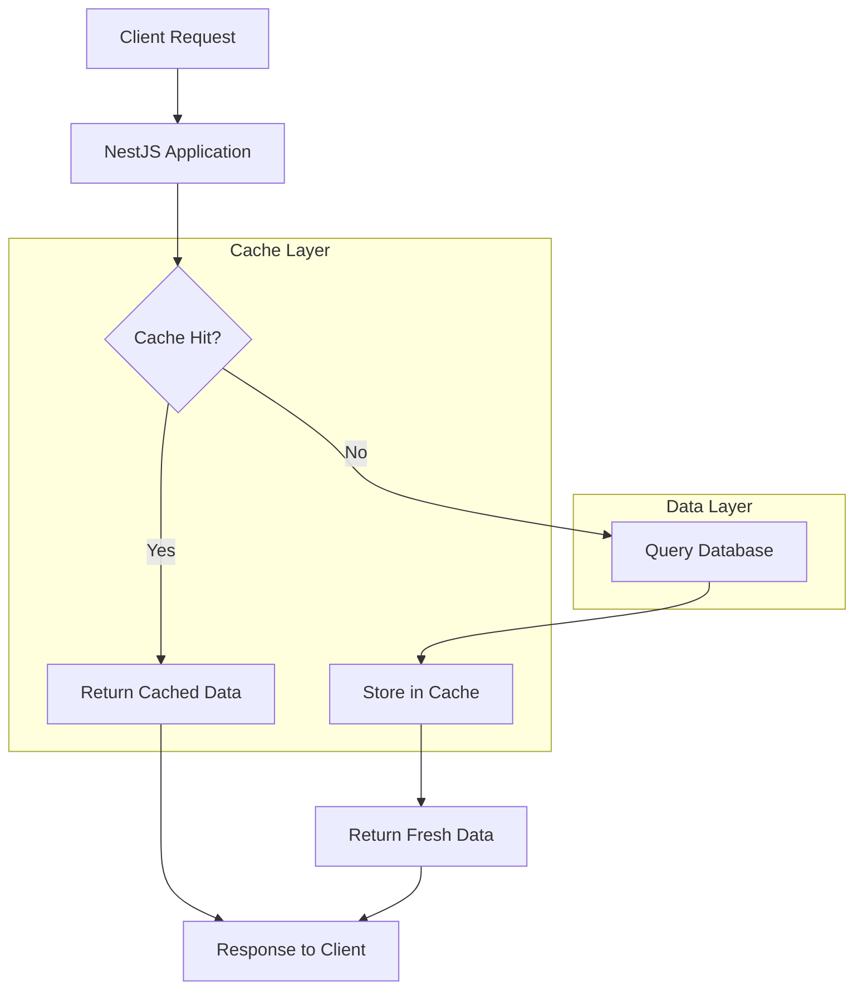
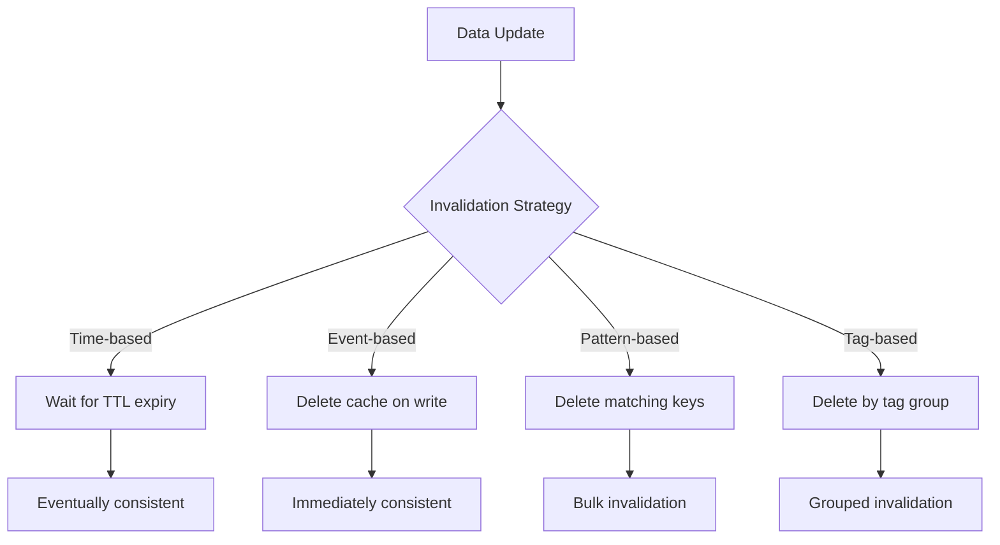
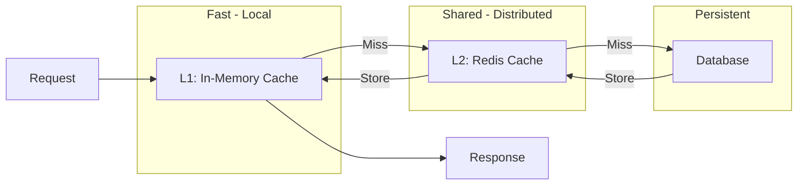

# How to Implement Caching in NestJS

Author: [nawazdhandala](https://www.github.com/nawazdhandala)

Tags: NestJS, Caching, Redis, Node.js

Description: A comprehensive guide to implementing caching in NestJS applications. Learn about in-memory caching, Redis integration, cache invalidation strategies, and best practices for building high-performance APIs with proper caching patterns.

---

Caching is one of the most effective ways to improve application performance. By storing frequently accessed data in memory, you reduce database queries, lower response times, and decrease server load. NestJS provides built-in caching support that integrates seamlessly with Redis and other cache stores. This guide covers everything from basic setup to advanced caching patterns for production applications.

## Why Caching Matters

Before diving into implementation, let us understand why caching is critical for modern applications:

| Benefit | Impact |
|---------|--------|
| Reduced latency | Cache reads are 10-100x faster than database queries |
| Lower database load | Fewer queries mean less strain on your database |
| Improved scalability | Serve more users with the same infrastructure |
| Cost savings | Less compute and database resources needed |
| Better user experience | Faster responses lead to happier users |

A well-implemented caching strategy can transform an application that struggles under load into one that handles traffic spikes gracefully.

## Caching Architecture Overview

Understanding where caching fits in your application architecture helps you make better decisions about what to cache and for how long.



## Setting Up Basic Caching

NestJS provides the `@nestjs/cache-manager` package for caching. Start by installing the required dependencies.

The cache-manager package provides a unified API for different cache stores. You can start with in-memory caching and switch to Redis later without changing your application code.

```bash
npm install @nestjs/cache-manager cache-manager
```

Now register the cache module in your application. This configuration sets up an in-memory cache with a default TTL (time-to-live) of 5 seconds.

```typescript
// app.module.ts
import { Module } from '@nestjs/common';
import { CacheModule } from '@nestjs/cache-manager';
import { AppController } from './app.controller';
import { AppService } from './app.service';

@Module({
  imports: [
    // Register the cache module globally so it is available throughout the app
    CacheModule.register({
      isGlobal: true,    // Makes the cache available in all modules
      ttl: 5000,         // Default cache duration in milliseconds
      max: 100,          // Maximum number of items in cache
    }),
  ],
  controllers: [AppController],
  providers: [AppService],
})
export class AppModule {}
```

## Using the Cache in Services

Inject the cache manager into your services to store and retrieve data. The cache manager provides simple get and set methods that work with any serializable data.

```typescript
// users/users.service.ts
import { Injectable, Inject } from '@nestjs/common';
import { CACHE_MANAGER } from '@nestjs/cache-manager';
import { Cache } from 'cache-manager';

@Injectable()
export class UsersService {
  constructor(
    @Inject(CACHE_MANAGER) private cacheManager: Cache,
  ) {}

  async getUserById(id: string): Promise<User> {
    // Build a unique cache key for this user
    const cacheKey = `user:${id}`;

    // Check if the user is already in the cache
    const cachedUser = await this.cacheManager.get<User>(cacheKey);

    if (cachedUser) {
      console.log(`Cache hit for user ${id}`);
      return cachedUser;
    }

    console.log(`Cache miss for user ${id}, fetching from database`);

    // Fetch from database when not in cache
    const user = await this.userRepository.findOne({ where: { id } });

    if (user) {
      // Store in cache for future requests
      // TTL of 60000ms means the cache entry expires after 1 minute
      await this.cacheManager.set(cacheKey, user, 60000);
    }

    return user;
  }

  async updateUser(id: string, updateData: UpdateUserDto): Promise<User> {
    // Update the database
    const updatedUser = await this.userRepository.save({ id, ...updateData });

    // Invalidate the cache so stale data is not served
    // This is critical for data consistency
    await this.cacheManager.del(`user:${id}`);

    return updatedUser;
  }
}
```

## Automatic Caching with Interceptors

NestJS provides a `CacheInterceptor` that automatically caches GET endpoint responses. This is useful for endpoints that return the same data for all users.

```typescript
// products/products.controller.ts
import { Controller, Get, UseInterceptors } from '@nestjs/common';
import { CacheInterceptor, CacheTTL, CacheKey } from '@nestjs/cache-manager';
import { ProductsService } from './products.service';

@Controller('products')
// Apply caching to all GET routes in this controller
@UseInterceptors(CacheInterceptor)
export class ProductsController {
  constructor(private productsService: ProductsService) {}

  // This endpoint will be cached automatically
  // The cache key is generated from the URL by default
  @Get()
  async findAll() {
    return this.productsService.findAll();
  }

  // Override the default TTL for this specific endpoint
  // This endpoint changes less frequently, so cache it longer
  @Get('categories')
  @CacheTTL(300000) // Cache for 5 minutes
  async getCategories() {
    return this.productsService.getCategories();
  }

  // Set a custom cache key when the auto-generated key is not suitable
  @Get('featured')
  @CacheKey('featured-products')
  @CacheTTL(60000) // Cache for 1 minute
  async getFeatured() {
    return this.productsService.getFeatured();
  }
}
```

## Setting Up Redis for Production

In-memory caching works for development and single-server deployments. For production environments with multiple server instances, you need a distributed cache like Redis. Redis ensures all your application instances share the same cache.

Install the Redis adapter for cache-manager.

```bash
npm install cache-manager-redis-yet redis
```

Configure the cache module to use Redis. This setup supports both local development and production environments.

```typescript
// app.module.ts
import { Module } from '@nestjs/common';
import { CacheModule } from '@nestjs/cache-manager';
import { ConfigModule, ConfigService } from '@nestjs/config';
import { redisStore } from 'cache-manager-redis-yet';

@Module({
  imports: [
    ConfigModule.forRoot({
      isGlobal: true,
    }),
    // Use async registration to access configuration values
    CacheModule.registerAsync({
      isGlobal: true,
      imports: [ConfigModule],
      inject: [ConfigService],
      useFactory: async (configService: ConfigService) => {
        // Check if Redis is configured, otherwise fall back to in-memory
        const redisHost = configService.get<string>('REDIS_HOST');

        if (redisHost) {
          // Production configuration with Redis
          const store = await redisStore({
            socket: {
              host: redisHost,
              port: configService.get<number>('REDIS_PORT', 6379),
            },
            password: configService.get<string>('REDIS_PASSWORD'),
            ttl: 60000, // Default TTL in milliseconds
          });

          return {
            store,
            ttl: 60000,
          };
        }

        // Development fallback to in-memory cache
        return {
          ttl: 60000,
          max: 100,
        };
      },
    }),
  ],
})
export class AppModule {}
```

## Cache Invalidation Strategies

Cache invalidation is one of the hardest problems in computer science. Here are proven strategies for keeping your cache consistent with your database.



### Time-Based Invalidation

The simplest approach is letting cache entries expire naturally. Set appropriate TTL values based on how frequently your data changes.

```typescript
// Different TTL values for different data types
const CACHE_TTL = {
  // Static content that rarely changes
  CATEGORIES: 24 * 60 * 60 * 1000,  // 24 hours

  // Semi-static content
  PRODUCT_DETAILS: 60 * 60 * 1000,   // 1 hour

  // Frequently changing data
  INVENTORY: 5 * 60 * 1000,          // 5 minutes

  // User-specific data
  USER_PROFILE: 15 * 60 * 1000,      // 15 minutes

  // Real-time data
  STOCK_PRICES: 10 * 1000,           // 10 seconds
};
```

### Event-Based Invalidation

Delete cache entries when the underlying data changes. This ensures users always see fresh data after updates.

```typescript
// orders/orders.service.ts
import { Injectable, Inject } from '@nestjs/common';
import { CACHE_MANAGER } from '@nestjs/cache-manager';
import { Cache } from 'cache-manager';
import { EventEmitter2 } from '@nestjs/event-emitter';

@Injectable()
export class OrdersService {
  constructor(
    @Inject(CACHE_MANAGER) private cacheManager: Cache,
    private eventEmitter: EventEmitter2,
  ) {}

  async createOrder(userId: string, orderData: CreateOrderDto): Promise<Order> {
    const order = await this.orderRepository.save({
      userId,
      ...orderData,
    });

    // Emit an event that other services can listen to
    // This decouples the caching logic from the business logic
    this.eventEmitter.emit('order.created', { userId, orderId: order.id });

    return order;
  }

  async getOrdersByUser(userId: string): Promise<Order[]> {
    const cacheKey = `orders:user:${userId}`;

    const cached = await this.cacheManager.get<Order[]>(cacheKey);
    if (cached) {
      return cached;
    }

    const orders = await this.orderRepository.find({ where: { userId } });
    await this.cacheManager.set(cacheKey, orders, 300000);

    return orders;
  }
}

// orders/orders.listener.ts
import { Injectable } from '@nestjs/common';
import { OnEvent } from '@nestjs/event-emitter';
import { Inject } from '@nestjs/common';
import { CACHE_MANAGER } from '@nestjs/cache-manager';
import { Cache } from 'cache-manager';

@Injectable()
export class OrdersCacheListener {
  constructor(
    @Inject(CACHE_MANAGER) private cacheManager: Cache,
  ) {}

  // Listen for order events and invalidate relevant caches
  @OnEvent('order.created')
  async handleOrderCreated(payload: { userId: string; orderId: string }) {
    // Invalidate the user's order list cache
    await this.cacheManager.del(`orders:user:${payload.userId}`);

    // Also invalidate any aggregate caches
    await this.cacheManager.del('orders:stats:total');
  }

  @OnEvent('order.updated')
  async handleOrderUpdated(payload: { userId: string; orderId: string }) {
    await this.cacheManager.del(`orders:user:${payload.userId}`);
    await this.cacheManager.del(`order:${payload.orderId}`);
  }
}
```

### Pattern-Based Invalidation with Redis

Redis supports pattern matching for bulk cache invalidation. This is useful when you need to clear multiple related cache entries at once.

```typescript
// cache/cache-utils.service.ts
import { Injectable } from '@nestjs/common';
import { createClient, RedisClientType } from 'redis';
import { ConfigService } from '@nestjs/config';

@Injectable()
export class CacheUtilsService {
  private redisClient: RedisClientType;

  constructor(private configService: ConfigService) {
    this.initializeRedisClient();
  }

  private async initializeRedisClient() {
    // Create a separate Redis client for pattern-based operations
    // The cache-manager client does not expose these directly
    this.redisClient = createClient({
      socket: {
        host: this.configService.get('REDIS_HOST'),
        port: this.configService.get('REDIS_PORT', 6379),
      },
      password: this.configService.get('REDIS_PASSWORD'),
    });

    await this.redisClient.connect();
  }

  // Delete all cache entries matching a pattern
  // WARNING: Use sparingly in production as SCAN can be slow on large datasets
  async deleteByPattern(pattern: string): Promise<number> {
    let cursor = 0;
    let deletedCount = 0;

    do {
      // SCAN is preferred over KEYS because it does not block the server
      const result = await this.redisClient.scan(cursor, {
        MATCH: pattern,
        COUNT: 100,
      });

      cursor = result.cursor;
      const keys = result.keys;

      if (keys.length > 0) {
        await this.redisClient.del(keys);
        deletedCount += keys.length;
      }
    } while (cursor !== 0);

    return deletedCount;
  }

  // Invalidate all product-related caches
  async invalidateProductCaches(productId: string): Promise<void> {
    await this.deleteByPattern(`product:${productId}:*`);
    await this.deleteByPattern(`products:list:*`);
    await this.deleteByPattern(`products:featured`);
  }

  // Invalidate all caches for a specific user
  async invalidateUserCaches(userId: string): Promise<void> {
    await this.deleteByPattern(`user:${userId}:*`);
    await this.deleteByPattern(`orders:user:${userId}`);
  }
}
```

## Building a Custom Cache Service

For complex caching requirements, create a dedicated cache service that encapsulates your caching logic and provides a clean API for the rest of your application.

```typescript
// cache/cache.service.ts
import { Injectable, Inject, Logger } from '@nestjs/common';
import { CACHE_MANAGER } from '@nestjs/cache-manager';
import { Cache } from 'cache-manager';

// Generic interface for cache operations
interface CacheOptions {
  ttl?: number;       // Time to live in milliseconds
  tags?: string[];    // Tags for grouped invalidation
}

@Injectable()
export class CacheService {
  private readonly logger = new Logger(CacheService.name);

  // Track tags for grouped invalidation
  private tagRegistry: Map<string, Set<string>> = new Map();

  constructor(
    @Inject(CACHE_MANAGER) private cacheManager: Cache,
  ) {}

  // Get a value from cache, or execute the factory function and cache the result
  async getOrSet<T>(
    key: string,
    factory: () => Promise<T>,
    options: CacheOptions = {},
  ): Promise<T> {
    const { ttl = 60000, tags = [] } = options;

    // Try to get from cache first
    const cached = await this.cacheManager.get<T>(key);

    if (cached !== undefined && cached !== null) {
      this.logger.debug(`Cache hit: ${key}`);
      return cached;
    }

    this.logger.debug(`Cache miss: ${key}`);

    // Execute the factory function to get fresh data
    const value = await factory();

    // Store in cache
    await this.cacheManager.set(key, value, ttl);

    // Register tags for this key
    this.registerTags(key, tags);

    return value;
  }

  // Set a value in cache with optional tags
  async set<T>(key: string, value: T, options: CacheOptions = {}): Promise<void> {
    const { ttl = 60000, tags = [] } = options;

    await this.cacheManager.set(key, value, ttl);
    this.registerTags(key, tags);
  }

  // Get a value from cache
  async get<T>(key: string): Promise<T | undefined> {
    return this.cacheManager.get<T>(key);
  }

  // Delete a specific key
  async delete(key: string): Promise<void> {
    await this.cacheManager.del(key);
    this.unregisterKey(key);
  }

  // Delete all keys associated with a tag
  async deleteByTag(tag: string): Promise<number> {
    const keys = this.tagRegistry.get(tag);

    if (!keys || keys.size === 0) {
      return 0;
    }

    const keysArray = Array.from(keys);

    // Delete all keys in parallel
    await Promise.all(keysArray.map(key => this.cacheManager.del(key)));

    // Clean up tag registry
    this.tagRegistry.delete(tag);

    this.logger.debug(`Invalidated ${keysArray.length} keys with tag: ${tag}`);

    return keysArray.length;
  }

  // Register tags for a cache key
  private registerTags(key: string, tags: string[]): void {
    for (const tag of tags) {
      if (!this.tagRegistry.has(tag)) {
        this.tagRegistry.set(tag, new Set());
      }
      this.tagRegistry.get(tag).add(key);
    }
  }

  // Remove a key from all tag registrations
  private unregisterKey(key: string): void {
    for (const [, keys] of this.tagRegistry) {
      keys.delete(key);
    }
  }

  // Clear all caches and reset tag registry
  async reset(): Promise<void> {
    await this.cacheManager.reset();
    this.tagRegistry.clear();
    this.logger.warn('Cache reset - all entries cleared');
  }
}
```

Now use this cache service in your application code.

```typescript
// products/products.service.ts
import { Injectable } from '@nestjs/common';
import { CacheService } from '../cache/cache.service';

@Injectable()
export class ProductsService {
  constructor(
    private cacheService: CacheService,
    private productRepository: ProductRepository,
  ) {}

  async getProduct(id: string): Promise<Product> {
    // Use getOrSet for clean cache-aside pattern
    return this.cacheService.getOrSet(
      `product:${id}`,
      () => this.productRepository.findOne({ where: { id } }),
      {
        ttl: 3600000, // 1 hour
        tags: ['products', `product:${id}`],
      },
    );
  }

  async getProductsByCategory(categoryId: string): Promise<Product[]> {
    return this.cacheService.getOrSet(
      `products:category:${categoryId}`,
      () => this.productRepository.find({ where: { categoryId } }),
      {
        ttl: 1800000, // 30 minutes
        tags: ['products', `category:${categoryId}`],
      },
    );
  }

  async updateProduct(id: string, data: UpdateProductDto): Promise<Product> {
    const product = await this.productRepository.save({ id, ...data });

    // Invalidate all caches tagged with this product
    await this.cacheService.deleteByTag(`product:${id}`);

    // Also invalidate the products list caches
    await this.cacheService.deleteByTag('products');

    return product;
  }
}
```

## Implementing Multi-Layer Caching

For high-performance applications, implement multiple cache layers. A local in-memory cache handles the most frequent requests, while Redis handles the rest.



```typescript
// cache/multi-layer-cache.service.ts
import { Injectable, Inject, Logger } from '@nestjs/common';
import { CACHE_MANAGER } from '@nestjs/cache-manager';
import { Cache } from 'cache-manager';

interface CacheLayer {
  name: string;
  get: <T>(key: string) => Promise<T | undefined>;
  set: <T>(key: string, value: T, ttl: number) => Promise<void>;
  del: (key: string) => Promise<void>;
}

@Injectable()
export class MultiLayerCacheService {
  private readonly logger = new Logger(MultiLayerCacheService.name);

  // L1: In-memory cache for ultra-fast access
  private memoryCache: Map<string, { value: any; expiry: number }> = new Map();
  private readonly memoryCacheMaxSize = 1000;

  constructor(
    // L2: Redis cache injected via cache-manager
    @Inject(CACHE_MANAGER) private redisCache: Cache,
  ) {
    // Clean up expired entries periodically
    setInterval(() => this.cleanupMemoryCache(), 60000);
  }

  // Get from cache, checking L1 first, then L2
  async get<T>(key: string): Promise<T | undefined> {
    // Check L1 (memory) first
    const memoryEntry = this.memoryCache.get(key);
    if (memoryEntry && memoryEntry.expiry > Date.now()) {
      this.logger.debug(`L1 cache hit: ${key}`);
      return memoryEntry.value as T;
    }

    // Check L2 (Redis)
    const redisValue = await this.redisCache.get<T>(key);
    if (redisValue !== undefined && redisValue !== null) {
      this.logger.debug(`L2 cache hit: ${key}`);

      // Promote to L1 for faster access next time
      this.setMemory(key, redisValue, 30000); // 30 second L1 TTL

      return redisValue;
    }

    this.logger.debug(`Cache miss: ${key}`);
    return undefined;
  }

  // Set in both cache layers
  async set<T>(key: string, value: T, ttl: number): Promise<void> {
    // Set in L1 with shorter TTL
    const l1Ttl = Math.min(ttl, 30000); // Max 30 seconds in L1
    this.setMemory(key, value, l1Ttl);

    // Set in L2 with full TTL
    await this.redisCache.set(key, value, ttl);
  }

  // Delete from both cache layers
  async del(key: string): Promise<void> {
    this.memoryCache.delete(key);
    await this.redisCache.del(key);
  }

  // Get or set pattern with multi-layer support
  async getOrSet<T>(
    key: string,
    factory: () => Promise<T>,
    ttl: number = 60000,
  ): Promise<T> {
    // Try to get from cache
    const cached = await this.get<T>(key);
    if (cached !== undefined) {
      return cached;
    }

    // Execute factory and cache the result
    const value = await factory();
    await this.set(key, value, ttl);

    return value;
  }

  // Set value in memory cache
  private setMemory<T>(key: string, value: T, ttl: number): void {
    // Evict oldest entries if cache is full
    if (this.memoryCache.size >= this.memoryCacheMaxSize) {
      const oldestKey = this.memoryCache.keys().next().value;
      this.memoryCache.delete(oldestKey);
    }

    this.memoryCache.set(key, {
      value,
      expiry: Date.now() + ttl,
    });
  }

  // Remove expired entries from memory cache
  private cleanupMemoryCache(): void {
    const now = Date.now();
    let cleaned = 0;

    for (const [key, entry] of this.memoryCache) {
      if (entry.expiry <= now) {
        this.memoryCache.delete(key);
        cleaned++;
      }
    }

    if (cleaned > 0) {
      this.logger.debug(`Cleaned ${cleaned} expired entries from L1 cache`);
    }
  }

  // Get cache statistics for monitoring
  getStats(): { l1Size: number; l1MaxSize: number } {
    return {
      l1Size: this.memoryCache.size,
      l1MaxSize: this.memoryCacheMaxSize,
    };
  }
}
```

## Caching Best Practices

Following these best practices will help you avoid common caching pitfalls and build reliable systems.

### 1. Use Consistent Key Naming

Establish a clear naming convention for cache keys across your application.

```typescript
// cache/cache-keys.ts
// Centralize cache key generation to ensure consistency

export const CacheKeys = {
  // User-related keys
  user: (id: string) => `user:${id}`,
  userProfile: (id: string) => `user:${id}:profile`,
  userPreferences: (id: string) => `user:${id}:preferences`,

  // Product-related keys
  product: (id: string) => `product:${id}`,
  productsByCategory: (categoryId: string) => `products:category:${categoryId}`,
  featuredProducts: () => 'products:featured',

  // Order-related keys
  order: (id: string) => `order:${id}`,
  ordersByUser: (userId: string) => `orders:user:${userId}`,

  // Session and auth keys
  session: (sessionId: string) => `session:${sessionId}`,
  rateLimiter: (ip: string, endpoint: string) => `ratelimit:${ip}:${endpoint}`,
};
```

### 2. Handle Cache Failures Gracefully

Cache failures should not break your application. Always fall back to the data source.

```typescript
// Wrap cache operations in try-catch to handle Redis failures
async getUserWithFallback(id: string): Promise<User> {
  try {
    const cached = await this.cacheManager.get<User>(CacheKeys.user(id));
    if (cached) {
      return cached;
    }
  } catch (error) {
    // Log the error but continue to database
    this.logger.warn(`Cache read failed: ${error.message}`);
  }

  // Always fall back to database
  const user = await this.userRepository.findOne({ where: { id } });

  // Try to cache the result, but do not fail if caching fails
  try {
    if (user) {
      await this.cacheManager.set(CacheKeys.user(id), user, 60000);
    }
  } catch (error) {
    this.logger.warn(`Cache write failed: ${error.message}`);
  }

  return user;
}
```

### 3. Implement Cache Warming

For critical data, warm the cache at application startup instead of waiting for the first request.

```typescript
// cache/cache-warmer.service.ts
import { Injectable, OnModuleInit, Logger } from '@nestjs/common';
import { CacheService } from './cache.service';

@Injectable()
export class CacheWarmerService implements OnModuleInit {
  private readonly logger = new Logger(CacheWarmerService.name);

  constructor(
    private cacheService: CacheService,
    private productRepository: ProductRepository,
    private categoryRepository: CategoryRepository,
  ) {}

  // This runs when the module initializes
  async onModuleInit() {
    this.logger.log('Starting cache warm-up...');

    try {
      await Promise.all([
        this.warmCategories(),
        this.warmFeaturedProducts(),
        this.warmPopularProducts(),
      ]);

      this.logger.log('Cache warm-up completed successfully');
    } catch (error) {
      // Cache warming failure should not prevent app startup
      this.logger.error(`Cache warm-up failed: ${error.message}`);
    }
  }

  private async warmCategories(): Promise<void> {
    const categories = await this.categoryRepository.find();

    await this.cacheService.set('categories:all', categories, {
      ttl: 24 * 60 * 60 * 1000, // 24 hours
      tags: ['categories'],
    });

    this.logger.debug(`Warmed ${categories.length} categories`);
  }

  private async warmFeaturedProducts(): Promise<void> {
    const featured = await this.productRepository.find({
      where: { isFeatured: true },
      take: 20,
    });

    await this.cacheService.set('products:featured', featured, {
      ttl: 60 * 60 * 1000, // 1 hour
      tags: ['products'],
    });

    this.logger.debug(`Warmed ${featured.length} featured products`);
  }

  private async warmPopularProducts(): Promise<void> {
    const popular = await this.productRepository.find({
      order: { viewCount: 'DESC' },
      take: 50,
    });

    await this.cacheService.set('products:popular', popular, {
      ttl: 30 * 60 * 1000, // 30 minutes
      tags: ['products'],
    });

    this.logger.debug(`Warmed ${popular.length} popular products`);
  }
}
```

### 4. Monitor Cache Performance

Track cache hit rates and performance to optimize your caching strategy.

```typescript
// cache/cache-metrics.service.ts
import { Injectable } from '@nestjs/common';

interface CacheMetrics {
  hits: number;
  misses: number;
  errors: number;
  avgLatencyMs: number;
}

@Injectable()
export class CacheMetricsService {
  private metrics: Map<string, CacheMetrics> = new Map();
  private latencies: number[] = [];

  recordHit(operation: string, latencyMs: number): void {
    this.getOrCreateMetric(operation).hits++;
    this.latencies.push(latencyMs);
  }

  recordMiss(operation: string, latencyMs: number): void {
    this.getOrCreateMetric(operation).misses++;
    this.latencies.push(latencyMs);
  }

  recordError(operation: string): void {
    this.getOrCreateMetric(operation).errors++;
  }

  getMetrics(): Record<string, CacheMetrics & { hitRate: number }> {
    const result: Record<string, CacheMetrics & { hitRate: number }> = {};

    for (const [operation, metrics] of this.metrics) {
      const total = metrics.hits + metrics.misses;
      result[operation] = {
        ...metrics,
        hitRate: total > 0 ? metrics.hits / total : 0,
        avgLatencyMs: this.calculateAvgLatency(),
      };
    }

    return result;
  }

  private getOrCreateMetric(operation: string): CacheMetrics {
    if (!this.metrics.has(operation)) {
      this.metrics.set(operation, {
        hits: 0,
        misses: 0,
        errors: 0,
        avgLatencyMs: 0,
      });
    }
    return this.metrics.get(operation);
  }

  private calculateAvgLatency(): number {
    if (this.latencies.length === 0) return 0;
    const sum = this.latencies.reduce((a, b) => a + b, 0);
    return sum / this.latencies.length;
  }

  // Reset metrics periodically or on demand
  reset(): void {
    this.metrics.clear();
    this.latencies = [];
  }
}
```

### 5. Prevent Cache Stampede

Cache stampede occurs when many requests simultaneously try to regenerate an expired cache entry. Use locking to prevent this.

```typescript
// cache/cache-lock.service.ts
import { Injectable, Inject } from '@nestjs/common';
import { CACHE_MANAGER } from '@nestjs/cache-manager';
import { Cache } from 'cache-manager';

@Injectable()
export class CacheLockService {
  constructor(
    @Inject(CACHE_MANAGER) private cacheManager: Cache,
  ) {}

  // Get or set with lock to prevent cache stampede
  async getOrSetWithLock<T>(
    key: string,
    factory: () => Promise<T>,
    ttl: number = 60000,
    lockTimeout: number = 5000,
  ): Promise<T> {
    // Try to get from cache first
    const cached = await this.cacheManager.get<T>(key);
    if (cached !== undefined && cached !== null) {
      return cached;
    }

    // Try to acquire lock
    const lockKey = `lock:${key}`;
    const lockAcquired = await this.acquireLock(lockKey, lockTimeout);

    if (!lockAcquired) {
      // Another process is regenerating the cache
      // Wait a bit and try to get the cached value again
      await this.sleep(100);
      const retryValue = await this.cacheManager.get<T>(key);
      if (retryValue !== undefined && retryValue !== null) {
        return retryValue;
      }
      // If still no value, proceed without lock (fallback)
    }

    try {
      // Double-check after acquiring lock
      const doubleCheck = await this.cacheManager.get<T>(key);
      if (doubleCheck !== undefined && doubleCheck !== null) {
        return doubleCheck;
      }

      // Generate new value
      const value = await factory();
      await this.cacheManager.set(key, value, ttl);

      return value;
    } finally {
      // Release lock
      if (lockAcquired) {
        await this.releaseLock(lockKey);
      }
    }
  }

  private async acquireLock(lockKey: string, timeout: number): Promise<boolean> {
    // Use set-if-not-exists pattern for atomic lock acquisition
    const lockValue = Date.now().toString();
    const existing = await this.cacheManager.get(lockKey);

    if (existing) {
      return false;
    }

    await this.cacheManager.set(lockKey, lockValue, timeout);
    return true;
  }

  private async releaseLock(lockKey: string): Promise<void> {
    await this.cacheManager.del(lockKey);
  }

  private sleep(ms: number): Promise<void> {
    return new Promise(resolve => setTimeout(resolve, ms));
  }
}
```

## Testing Cached Services

Write tests that verify your caching logic works correctly, including cache hits, misses, and invalidation.

```typescript
// products/products.service.spec.ts
import { Test, TestingModule } from '@nestjs/testing';
import { CACHE_MANAGER } from '@nestjs/cache-manager';
import { ProductsService } from './products.service';
import { Cache } from 'cache-manager';

describe('ProductsService', () => {
  let service: ProductsService;
  let cacheManager: jest.Mocked<Cache>;
  let productRepository: jest.Mocked<any>;

  beforeEach(async () => {
    const module: TestingModule = await Test.createTestingModule({
      providers: [
        ProductsService,
        {
          provide: CACHE_MANAGER,
          useValue: {
            get: jest.fn(),
            set: jest.fn(),
            del: jest.fn(),
          },
        },
        {
          provide: 'ProductRepository',
          useValue: {
            findOne: jest.fn(),
            find: jest.fn(),
            save: jest.fn(),
          },
        },
      ],
    }).compile();

    service = module.get<ProductsService>(ProductsService);
    cacheManager = module.get(CACHE_MANAGER);
    productRepository = module.get('ProductRepository');
  });

  describe('getProduct', () => {
    const productId = 'prod-123';
    const mockProduct = { id: productId, name: 'Test Product', price: 99 };

    it('should return cached product on cache hit', async () => {
      // Arrange: Set up cache to return the product
      cacheManager.get.mockResolvedValue(mockProduct);

      // Act
      const result = await service.getProduct(productId);

      // Assert: Should return cached value without hitting database
      expect(result).toEqual(mockProduct);
      expect(cacheManager.get).toHaveBeenCalledWith(`product:${productId}`);
      expect(productRepository.findOne).not.toHaveBeenCalled();
    });

    it('should fetch from database and cache on cache miss', async () => {
      // Arrange: Cache returns null (miss)
      cacheManager.get.mockResolvedValue(null);
      productRepository.findOne.mockResolvedValue(mockProduct);

      // Act
      const result = await service.getProduct(productId);

      // Assert: Should fetch from database and cache result
      expect(result).toEqual(mockProduct);
      expect(productRepository.findOne).toHaveBeenCalled();
      expect(cacheManager.set).toHaveBeenCalledWith(
        `product:${productId}`,
        mockProduct,
        expect.any(Number),
      );
    });

    it('should invalidate cache on product update', async () => {
      // Arrange
      const updateData = { name: 'Updated Product' };
      productRepository.save.mockResolvedValue({ ...mockProduct, ...updateData });

      // Act
      await service.updateProduct(productId, updateData);

      // Assert: Cache should be invalidated
      expect(cacheManager.del).toHaveBeenCalledWith(`product:${productId}`);
    });
  });
});
```

## Summary

Implementing caching in NestJS involves several key decisions and patterns:

| Aspect | Recommendation |
|--------|----------------|
| Cache Store | In-memory for development, Redis for production |
| TTL Strategy | Match TTL to data change frequency |
| Invalidation | Use event-based invalidation for consistency |
| Key Naming | Establish clear conventions across the team |
| Error Handling | Always fall back to data source on cache failure |
| Monitoring | Track hit rates and latency for optimization |

Start with simple caching patterns and add complexity as needed. The cache-aside pattern with Redis covers most use cases. Add multi-layer caching and cache warming only when performance requirements demand it.

Remember that caching adds complexity to your system. Every cached value needs an invalidation strategy. When in doubt, start with shorter TTLs and increase them based on real-world usage patterns. Monitor your cache hit rates and adjust your strategy based on actual data rather than assumptions.

With these patterns and practices, you can build NestJS applications that handle significant traffic while maintaining low latency and consistent data.
