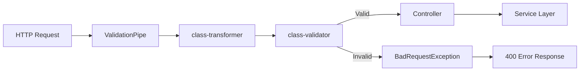
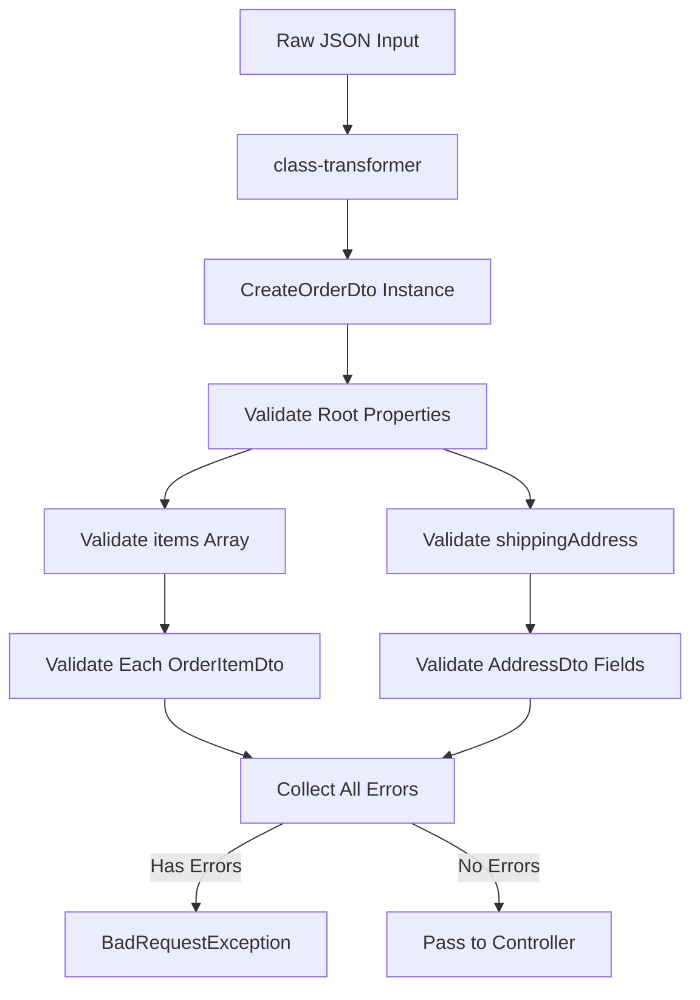
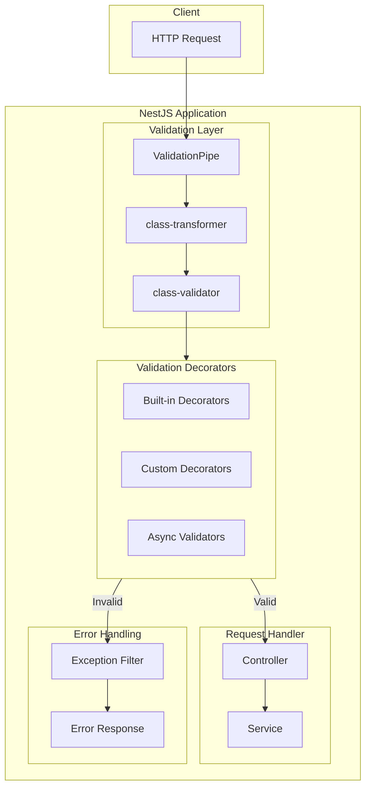

# How to Add Validation with class-validator in NestJS

Author: [nawazdhandala](https://www.github.com/nawazdhandala)

Tags: NestJS, Node.js, Validation, class-validator, TypeScript, DTO, Backend, API

Description: Learn how to implement robust input validation in NestJS using class-validator. This comprehensive guide covers decorators, custom validators, nested object validation, conditional validation, and production-ready patterns.

---

> Data validation is your first line of defense against bugs and security vulnerabilities. NestJS combined with class-validator provides a declarative, type-safe approach to validating incoming requests before they reach your business logic.

In modern API development, validating user input is critical. class-validator brings decorator-based validation to TypeScript, and NestJS integrates it seamlessly through its ValidationPipe. This guide walks you through everything from basic setup to advanced validation patterns.

---

## How Validation Works in NestJS



When a request arrives, NestJS processes it through the ValidationPipe. The pipe uses class-transformer to convert plain JSON objects into class instances, then class-validator checks those instances against the decorators you have defined. Invalid data triggers an automatic BadRequestException with detailed error messages.

---

## Setting Up class-validator

First, install the required packages in your NestJS project.

```bash
# Install class-validator and class-transformer
npm install class-validator class-transformer
```

Next, enable the ValidationPipe globally in your application bootstrap file.

```typescript
// main.ts
import { NestFactory } from '@nestjs/core';
import { ValidationPipe } from '@nestjs/common';
import { AppModule } from './app.module';

async function bootstrap() {
  const app = await NestFactory.create(AppModule);

  // Enable global validation with recommended settings
  app.useGlobalPipes(
    new ValidationPipe({
      // Strip properties that are not in the DTO
      whitelist: true,
      // Throw an error if non-whitelisted properties are present
      forbidNonWhitelisted: true,
      // Automatically transform payloads to DTO instances
      transform: true,
      // Enable implicit type conversion for query parameters
      transformOptions: {
        enableImplicitConversion: true,
      },
    }),
  );

  await app.listen(3000);
}
bootstrap();
```

The `whitelist` option removes any properties not defined in your DTO, preventing attackers from injecting unexpected fields. Setting `forbidNonWhitelisted` to true makes the application reject requests containing unknown properties entirely.

---

## Basic Validation Decorators

class-validator provides dozens of built-in decorators for common validation scenarios. Here is a DTO demonstrating the most frequently used ones.

```typescript
// dto/create-user.dto.ts
import {
  IsString,
  IsEmail,
  IsNotEmpty,
  MinLength,
  MaxLength,
  IsOptional,
  IsInt,
  Min,
  Max,
  IsBoolean,
  IsUrl,
  Matches,
} from 'class-validator';

export class CreateUserDto {
  // Validates that the value is a non-empty string
  @IsString()
  @IsNotEmpty({ message: 'First name is required' })
  @MinLength(2, { message: 'First name must be at least 2 characters' })
  @MaxLength(50, { message: 'First name cannot exceed 50 characters' })
  firstName: string;

  // Validates that the value is a non-empty string
  @IsString()
  @IsNotEmpty({ message: 'Last name is required' })
  @MinLength(2, { message: 'Last name must be at least 2 characters' })
  @MaxLength(50, { message: 'Last name cannot exceed 50 characters' })
  lastName: string;

  // Validates proper email format using RFC 5322 standard
  @IsEmail({}, { message: 'Please provide a valid email address' })
  email: string;

  // Validates password with custom regex pattern for strength requirements
  @IsString()
  @MinLength(8, { message: 'Password must be at least 8 characters' })
  @Matches(/^(?=.*[a-z])(?=.*[A-Z])(?=.*\d)(?=.*[@$!%*?&])[A-Za-z\d@$!%*?&]/, {
    message:
      'Password must contain uppercase, lowercase, number, and special character',
  })
  password: string;

  // Optional field that validates as integer within range if provided
  @IsOptional()
  @IsInt({ message: 'Age must be a whole number' })
  @Min(18, { message: 'Must be at least 18 years old' })
  @Max(120, { message: 'Age cannot exceed 120' })
  age?: number;

  // Optional URL validation for profile picture
  @IsOptional()
  @IsUrl({}, { message: 'Profile picture must be a valid URL' })
  profilePicture?: string;

  // Optional boolean for newsletter subscription
  @IsOptional()
  @IsBoolean({ message: 'Newsletter preference must be true or false' })
  subscribeNewsletter?: boolean;
}
```

Each decorator can accept an options object with a custom `message` property. Custom messages make error responses more user-friendly and help frontend developers understand exactly what went wrong.

---

## Using DTOs in Controllers

Apply your validated DTOs to controller methods using the `@Body()` decorator.

```typescript
// users.controller.ts
import { Controller, Post, Body, Get, Param, ParseUUIDPipe } from '@nestjs/common';
import { UsersService } from './users.service';
import { CreateUserDto } from './dto/create-user.dto';

@Controller('users')
export class UsersController {
  constructor(private readonly usersService: UsersService) {}

  // The ValidationPipe automatically validates the request body against CreateUserDto
  @Post()
  async create(@Body() createUserDto: CreateUserDto) {
    // At this point, createUserDto is guaranteed to be valid
    // All properties have been validated and transformed
    return this.usersService.create(createUserDto);
  }

  // Combine class-validator DTOs with built-in pipes for route parameters
  @Get(':id')
  async findOne(@Param('id', new ParseUUIDPipe({ version: '4' })) id: string) {
    return this.usersService.findOne(id);
  }
}
```

When validation fails, NestJS automatically returns a 400 Bad Request response with detailed error information.

---

## Validating Nested Objects

Real-world APIs often deal with complex nested data structures. Use the `@ValidateNested()` decorator along with `@Type()` from class-transformer to validate nested objects.

```typescript
// dto/create-order.dto.ts
import {
  IsString,
  IsNotEmpty,
  IsNumber,
  IsPositive,
  IsArray,
  ValidateNested,
  ArrayMinSize,
  ArrayMaxSize,
  Min,
} from 'class-validator';
import { Type } from 'class-transformer';

// Define the nested DTO for individual order items
export class OrderItemDto {
  // Product identifier must be a non-empty string
  @IsString()
  @IsNotEmpty({ message: 'Product ID is required for each item' })
  productId: string;

  // Quantity must be a positive integer of at least 1
  @IsNumber()
  @IsPositive({ message: 'Quantity must be positive' })
  @Min(1, { message: 'Minimum quantity is 1' })
  quantity: number;

  // Unit price must be a positive number
  @IsNumber({ maxDecimalPlaces: 2 }, { message: 'Price must have at most 2 decimal places' })
  @IsPositive({ message: 'Price must be positive' })
  unitPrice: number;
}

// Define the nested DTO for shipping address
export class AddressDto {
  @IsString()
  @IsNotEmpty()
  street: string;

  @IsString()
  @IsNotEmpty()
  city: string;

  @IsString()
  @IsNotEmpty()
  state: string;

  @IsString()
  @IsNotEmpty()
  postalCode: string;

  @IsString()
  @IsNotEmpty()
  country: string;
}

// Main order DTO with nested validation
export class CreateOrderDto {
  // Customer ID for the order
  @IsString()
  @IsNotEmpty({ message: 'Customer ID is required' })
  customerId: string;

  // Array of order items with validation on each element
  // Type decorator tells class-transformer how to instantiate nested objects
  @IsArray()
  @ValidateNested({ each: true })
  @ArrayMinSize(1, { message: 'Order must contain at least one item' })
  @ArrayMaxSize(50, { message: 'Order cannot exceed 50 items' })
  @Type(() => OrderItemDto)
  items: OrderItemDto[];

  // Nested shipping address object
  @ValidateNested()
  @Type(() => AddressDto)
  shippingAddress: AddressDto;

  // Optional billing address - if not provided, uses shipping address
  @IsOptional()
  @ValidateNested()
  @Type(() => AddressDto)
  billingAddress?: AddressDto;
}
```

The `@Type()` decorator is essential for nested validation. Without it, class-transformer will not know how to convert plain objects into class instances, and the validation decorators on nested classes will not run.

---

## Validation Flow for Nested Objects



---

## Conditional Validation

Sometimes fields should only be required based on other field values. class-validator provides several ways to implement conditional validation.

```typescript
// dto/payment.dto.ts
import {
  IsString,
  IsNotEmpty,
  IsOptional,
  IsEnum,
  ValidateIf,
  IsCreditCard,
  Matches,
  Length,
} from 'class-validator';

export enum PaymentMethod {
  CREDIT_CARD = 'credit_card',
  BANK_TRANSFER = 'bank_transfer',
  PAYPAL = 'paypal',
}

export class PaymentDto {
  // Payment method determines which other fields are required
  @IsEnum(PaymentMethod, {
    message: 'Payment method must be credit_card, bank_transfer, or paypal',
  })
  paymentMethod: PaymentMethod;

  // Credit card number is only validated when payment method is credit card
  // ValidateIf decorator conditionally applies validation based on a predicate
  @ValidateIf((obj) => obj.paymentMethod === PaymentMethod.CREDIT_CARD)
  @IsCreditCard({ message: 'Invalid credit card number' })
  cardNumber?: string;

  // CVV is only required for credit card payments
  @ValidateIf((obj) => obj.paymentMethod === PaymentMethod.CREDIT_CARD)
  @IsString()
  @Length(3, 4, { message: 'CVV must be 3 or 4 digits' })
  @Matches(/^\d+$/, { message: 'CVV must contain only numbers' })
  cvv?: string;

  // Expiry date only required for credit card payments
  @ValidateIf((obj) => obj.paymentMethod === PaymentMethod.CREDIT_CARD)
  @IsString()
  @Matches(/^(0[1-9]|1[0-2])\/\d{2}$/, {
    message: 'Expiry date must be in MM/YY format',
  })
  expiryDate?: string;

  // Bank account number only required for bank transfers
  @ValidateIf((obj) => obj.paymentMethod === PaymentMethod.BANK_TRANSFER)
  @IsString()
  @IsNotEmpty({ message: 'Bank account number is required for bank transfers' })
  bankAccountNumber?: string;

  // Routing number only required for bank transfers
  @ValidateIf((obj) => obj.paymentMethod === PaymentMethod.BANK_TRANSFER)
  @IsString()
  @Length(9, 9, { message: 'Routing number must be exactly 9 digits' })
  @Matches(/^\d+$/, { message: 'Routing number must contain only numbers' })
  routingNumber?: string;

  // PayPal email only required for PayPal payments
  @ValidateIf((obj) => obj.paymentMethod === PaymentMethod.PAYPAL)
  @IsEmail({}, { message: 'Valid PayPal email is required' })
  paypalEmail?: string;
}
```

The `@ValidateIf()` decorator accepts a function that receives the object being validated. Return `true` to apply the validation decorators below it, or `false` to skip them.

---

## Custom Validation Decorators

When built-in decorators do not cover your requirements, create custom validators. This keeps your validation logic reusable and your DTOs clean.

```typescript
// validators/is-strong-password.validator.ts
import {
  registerDecorator,
  ValidationOptions,
  ValidationArguments,
} from 'class-validator';

// Custom decorator for validating password strength with configurable rules
export function IsStrongPassword(
  options?: {
    minLength?: number;
    requireUppercase?: boolean;
    requireLowercase?: boolean;
    requireNumbers?: boolean;
    requireSpecialChars?: boolean;
  },
  validationOptions?: ValidationOptions,
) {
  // Set default options if not provided
  const opts = {
    minLength: options?.minLength ?? 8,
    requireUppercase: options?.requireUppercase ?? true,
    requireLowercase: options?.requireLowercase ?? true,
    requireNumbers: options?.requireNumbers ?? true,
    requireSpecialChars: options?.requireSpecialChars ?? true,
  };

  return function (object: Object, propertyName: string) {
    registerDecorator({
      name: 'isStrongPassword',
      target: object.constructor,
      propertyName: propertyName,
      options: validationOptions,
      constraints: [opts],
      validator: {
        validate(value: any, args: ValidationArguments) {
          if (typeof value !== 'string') return false;

          const [options] = args.constraints;
          const errors: string[] = [];

          if (value.length < options.minLength) {
            errors.push(`at least ${options.minLength} characters`);
          }
          if (options.requireUppercase && !/[A-Z]/.test(value)) {
            errors.push('an uppercase letter');
          }
          if (options.requireLowercase && !/[a-z]/.test(value)) {
            errors.push('a lowercase letter');
          }
          if (options.requireNumbers && !/\d/.test(value)) {
            errors.push('a number');
          }
          if (options.requireSpecialChars && !/[!@#$%^&*(),.?":{}|<>]/.test(value)) {
            errors.push('a special character');
          }

          // Store errors for use in default message
          (args.object as any).__passwordErrors = errors;

          return errors.length === 0;
        },
        defaultMessage(args: ValidationArguments) {
          const errors = (args.object as any).__passwordErrors || [];
          if (errors.length === 0) return 'Invalid password';
          return `Password must contain ${errors.join(', ')}`;
        },
      },
    });
  };
}

// Usage in a DTO
// dto/register.dto.ts
import { IsEmail, IsString, IsNotEmpty } from 'class-validator';
import { IsStrongPassword } from '../validators/is-strong-password.validator';

export class RegisterDto {
  @IsEmail()
  email: string;

  @IsString()
  @IsNotEmpty()
  username: string;

  // Use custom decorator with specific requirements
  @IsStrongPassword({
    minLength: 10,
    requireUppercase: true,
    requireLowercase: true,
    requireNumbers: true,
    requireSpecialChars: true,
  })
  password: string;
}
```

---

## Async Custom Validators

For validation that requires database lookups or external API calls, create async validators using class-validator's `ValidatorConstraint`.

```typescript
// validators/is-unique-email.validator.ts
import {
  ValidatorConstraint,
  ValidatorConstraintInterface,
  ValidationArguments,
  registerDecorator,
  ValidationOptions,
} from 'class-validator';
import { Injectable } from '@nestjs/common';
import { UsersService } from '../users/users.service';

// Injectable constraint allows dependency injection
@ValidatorConstraint({ name: 'isUniqueEmail', async: true })
@Injectable()
export class IsUniqueEmailConstraint implements ValidatorConstraintInterface {
  constructor(private readonly usersService: UsersService) {}

  // Async validate method checks database for existing email
  async validate(email: string, args: ValidationArguments): Promise<boolean> {
    if (!email) return false;

    const existingUser = await this.usersService.findByEmail(email);
    // Return true if email does NOT exist (is unique)
    return !existingUser;
  }

  defaultMessage(args: ValidationArguments): string {
    return 'Email address is already registered';
  }
}

// Decorator factory function for clean usage in DTOs
export function IsUniqueEmail(validationOptions?: ValidationOptions) {
  return function (object: Object, propertyName: string) {
    registerDecorator({
      target: object.constructor,
      propertyName: propertyName,
      options: validationOptions,
      constraints: [],
      validator: IsUniqueEmailConstraint,
    });
  };
}

// Register the constraint as a provider in your module
// users.module.ts
import { Module } from '@nestjs/common';
import { UsersService } from './users.service';
import { UsersController } from './users.controller';
import { IsUniqueEmailConstraint } from '../validators/is-unique-email.validator';

@Module({
  controllers: [UsersController],
  providers: [
    UsersService,
    // Register the constraint so NestJS can inject dependencies
    IsUniqueEmailConstraint,
  ],
  exports: [UsersService],
})
export class UsersModule {}
```

For async validators to work with dependency injection, you must also configure the ValidationPipe to use the NestJS container.

```typescript
// main.ts
import { NestFactory } from '@nestjs/core';
import { ValidationPipe } from '@nestjs/common';
import { useContainer } from 'class-validator';
import { AppModule } from './app.module';

async function bootstrap() {
  const app = await NestFactory.create(AppModule);

  // Enable class-validator to use NestJS dependency injection container
  // This allows validators to inject services like UsersService
  useContainer(app.select(AppModule), { fallbackOnErrors: true });

  app.useGlobalPipes(
    new ValidationPipe({
      whitelist: true,
      forbidNonWhitelisted: true,
      transform: true,
    }),
  );

  await app.listen(3000);
}
bootstrap();
```

---

## Validation Groups

Validation groups let you apply different validation rules for different scenarios, such as create versus update operations.

```typescript
// dto/user.dto.ts
import {
  IsString,
  IsNotEmpty,
  IsEmail,
  IsOptional,
  MinLength,
  IsUUID,
} from 'class-validator';

// Define group constants for type safety
export const CREATE_USER = 'create';
export const UPDATE_USER = 'update';

export class UserDto {
  // ID is required only for updates, not creates
  @IsUUID('4', { groups: [UPDATE_USER], message: 'Invalid user ID format' })
  @IsNotEmpty({ groups: [UPDATE_USER] })
  id?: string;

  // Email is required for both create and update
  @IsEmail({}, { groups: [CREATE_USER, UPDATE_USER] })
  @IsNotEmpty({ groups: [CREATE_USER] })
  @IsOptional({ groups: [UPDATE_USER] })
  email?: string;

  // Password is required only for create
  @IsString({ groups: [CREATE_USER] })
  @MinLength(8, { groups: [CREATE_USER] })
  @IsNotEmpty({ groups: [CREATE_USER] })
  password?: string;

  // Name can be updated
  @IsString({ groups: [CREATE_USER, UPDATE_USER] })
  @IsNotEmpty({ groups: [CREATE_USER] })
  @IsOptional({ groups: [UPDATE_USER] })
  name?: string;
}
```

Apply specific groups in your controller methods.

```typescript
// users.controller.ts
import { Controller, Post, Put, Body, Param, UsePipes, ValidationPipe } from '@nestjs/common';
import { UserDto, CREATE_USER, UPDATE_USER } from './dto/user.dto';
import { UsersService } from './users.service';

@Controller('users')
export class UsersController {
  constructor(private readonly usersService: UsersService) {}

  // Apply validation with CREATE_USER group
  @Post()
  @UsePipes(new ValidationPipe({ groups: [CREATE_USER], whitelist: true }))
  async create(@Body() userDto: UserDto) {
    return this.usersService.create(userDto);
  }

  // Apply validation with UPDATE_USER group
  @Put(':id')
  @UsePipes(new ValidationPipe({ groups: [UPDATE_USER], whitelist: true }))
  async update(@Param('id') id: string, @Body() userDto: UserDto) {
    return this.usersService.update(id, userDto);
  }
}
```

---

## Array Validation Patterns

Validating arrays requires special attention to ensure both the array itself and its elements meet your requirements.

```typescript
// dto/bulk-operation.dto.ts
import {
  IsArray,
  IsString,
  IsNotEmpty,
  IsUUID,
  ArrayMinSize,
  ArrayMaxSize,
  ArrayUnique,
  ValidateNested,
  IsEnum,
} from 'class-validator';
import { Type } from 'class-transformer';

export enum BulkAction {
  DELETE = 'delete',
  ARCHIVE = 'archive',
  RESTORE = 'restore',
}

// DTO for items in the bulk operation
export class BulkItemDto {
  @IsUUID('4')
  id: string;

  @IsEnum(BulkAction)
  action: BulkAction;
}

export class BulkOperationDto {
  // Simple array of UUIDs with uniqueness constraint
  // ArrayUnique ensures no duplicate values
  @IsArray({ message: 'IDs must be provided as an array' })
  @ArrayMinSize(1, { message: 'At least one ID is required' })
  @ArrayMaxSize(100, { message: 'Cannot process more than 100 items at once' })
  @ArrayUnique({ message: 'Duplicate IDs are not allowed' })
  @IsUUID('4', { each: true, message: 'Each ID must be a valid UUID v4' })
  ids: string[];
}

export class BulkActionsDto {
  // Array of complex objects with per-item validation
  @IsArray()
  @ValidateNested({ each: true })
  @ArrayMinSize(1)
  @ArrayMaxSize(100)
  @Type(() => BulkItemDto)
  items: BulkItemDto[];
}

export class TagsDto {
  // Array of strings with transformation and validation
  // The each: true option applies the decorator to each array element
  @IsArray()
  @IsString({ each: true, message: 'Each tag must be a string' })
  @IsNotEmpty({ each: true, message: 'Tags cannot be empty strings' })
  @ArrayMaxSize(10, { message: 'Maximum 10 tags allowed' })
  tags: string[];
}
```

The `{ each: true }` option is key for array validation. It applies the decorator to each element in the array rather than the array itself.

---

## Query Parameter Validation

Validate query parameters for list endpoints with pagination and filtering.

```typescript
// dto/pagination.dto.ts
import { IsOptional, IsInt, Min, Max, IsString, IsEnum, IsIn } from 'class-validator';
import { Type } from 'class-transformer';

export enum SortOrder {
  ASC = 'asc',
  DESC = 'desc',
}

export class PaginationDto {
  // Page number with default of 1
  // Type decorator converts string query param to number
  @IsOptional()
  @Type(() => Number)
  @IsInt({ message: 'Page must be an integer' })
  @Min(1, { message: 'Page must be at least 1' })
  page?: number = 1;

  // Items per page with reasonable limits
  @IsOptional()
  @Type(() => Number)
  @IsInt({ message: 'Limit must be an integer' })
  @Min(1, { message: 'Limit must be at least 1' })
  @Max(100, { message: 'Limit cannot exceed 100' })
  limit?: number = 20;

  // Optional search query
  @IsOptional()
  @IsString()
  search?: string;

  // Sort field - restrict to allowed values for security
  @IsOptional()
  @IsString()
  @IsIn(['createdAt', 'updatedAt', 'name', 'email'], {
    message: 'Sort field must be one of: createdAt, updatedAt, name, email',
  })
  sortBy?: string = 'createdAt';

  // Sort direction
  @IsOptional()
  @IsEnum(SortOrder, { message: 'Sort order must be asc or desc' })
  sortOrder?: SortOrder = SortOrder.DESC;
}

// Usage in controller
// users.controller.ts
import { Controller, Get, Query } from '@nestjs/common';
import { PaginationDto } from './dto/pagination.dto';

@Controller('users')
export class UsersController {
  @Get()
  async findAll(@Query() paginationDto: PaginationDto) {
    // paginationDto has validated and transformed values with defaults
    const { page, limit, search, sortBy, sortOrder } = paginationDto;
    return this.usersService.findAll({ page, limit, search, sortBy, sortOrder });
  }
}
```

---

## Error Response Customization

Customize how validation errors are formatted in API responses.

```typescript
// filters/validation-exception.filter.ts
import {
  ExceptionFilter,
  Catch,
  ArgumentsHost,
  BadRequestException,
} from '@nestjs/common';
import { Response } from 'express';

interface ValidationError {
  field: string;
  message: string;
  value?: any;
}

@Catch(BadRequestException)
export class ValidationExceptionFilter implements ExceptionFilter {
  catch(exception: BadRequestException, host: ArgumentsHost) {
    const ctx = host.switchToHttp();
    const response = ctx.getResponse<Response>();
    const status = exception.getStatus();
    const exceptionResponse = exception.getResponse() as any;

    // Format validation errors into a cleaner structure
    let errors: ValidationError[] = [];

    if (Array.isArray(exceptionResponse.message)) {
      // class-validator returns an array of error messages
      errors = this.formatValidationErrors(exceptionResponse.message);
    } else if (typeof exceptionResponse.message === 'string') {
      errors = [{ field: 'unknown', message: exceptionResponse.message }];
    }

    response.status(status).json({
      statusCode: status,
      error: 'Validation Failed',
      timestamp: new Date().toISOString(),
      errors: errors,
    });
  }

  private formatValidationErrors(messages: string[]): ValidationError[] {
    // Parse class-validator error messages to extract field names
    // Default format: "property constraint message"
    return messages.map((message) => {
      // Try to extract field name from message
      const match = message.match(/^(\w+)\s/);
      return {
        field: match ? match[1] : 'unknown',
        message: message,
      };
    });
  }
}

// Register the filter globally
// main.ts
import { NestFactory } from '@nestjs/core';
import { ValidationPipe } from '@nestjs/common';
import { ValidationExceptionFilter } from './filters/validation-exception.filter';
import { AppModule } from './app.module';

async function bootstrap() {
  const app = await NestFactory.create(AppModule);

  app.useGlobalPipes(
    new ValidationPipe({
      whitelist: true,
      forbidNonWhitelisted: true,
      transform: true,
    }),
  );

  // Apply custom exception filter for formatted error responses
  app.useGlobalFilters(new ValidationExceptionFilter());

  await app.listen(3000);
}
bootstrap();
```

---

## Validation Architecture Overview



---

## Common Validation Patterns Reference

Here is a quick reference for frequently needed validation patterns.

```typescript
// common-validations.dto.ts
import {
  IsString,
  IsNumber,
  IsBoolean,
  IsDate,
  IsEmail,
  IsUrl,
  IsUUID,
  IsIP,
  IsJSON,
  IsCreditCard,
  IsPhoneNumber,
  IsCurrency,
  IsHexColor,
  IsPostalCode,
  IsISO8601,
  IsLatitude,
  IsLongitude,
  Contains,
  NotContains,
  IsAlpha,
  IsAlphanumeric,
  Equals,
  NotEquals,
  IsDivisibleBy,
  IsPositive,
  IsNegative,
  ArrayContains,
  ArrayNotContains,
} from 'class-validator';
import { Type } from 'class-transformer';

export class CommonValidationsDto {
  // String that must contain a substring
  @Contains('admin', { message: 'Role must contain admin' })
  adminRole: string;

  // String that must not contain certain text
  @NotContains('password', { message: 'Description cannot contain password' })
  description: string;

  // Only alphabetic characters
  @IsAlpha('en-US', { message: 'Name must contain only letters' })
  firstName: string;

  // Alphanumeric characters only
  @IsAlphanumeric('en-US', { message: 'Username must be alphanumeric' })
  username: string;

  // Exact value match
  @Equals('accepted', { message: 'Terms must be accepted' })
  termsStatus: string;

  // Value must not equal
  @NotEquals('root', { message: 'Username cannot be root' })
  systemUser: string;

  // Number divisibility
  @IsDivisibleBy(5, { message: 'Quantity must be in multiples of 5' })
  bulkQuantity: number;

  // Positive number
  @IsPositive({ message: 'Price must be positive' })
  price: number;

  // ISO 8601 date string
  @IsISO8601({}, { message: 'Date must be in ISO 8601 format' })
  eventDate: string;

  // Geographic coordinates
  @IsLatitude({ message: 'Invalid latitude' })
  lat: number;

  @IsLongitude({ message: 'Invalid longitude' })
  lng: number;

  // IP address validation
  @IsIP('4', { message: 'Must be a valid IPv4 address' })
  ipAddress: string;

  // Phone number with region
  @IsPhoneNumber('US', { message: 'Must be a valid US phone number' })
  phone: string;

  // Hex color code
  @IsHexColor({ message: 'Must be a valid hex color' })
  themeColor: string;

  // Credit card validation
  @IsCreditCard({ message: 'Invalid credit card number' })
  cardNumber: string;

  // JSON string validation
  @IsJSON({ message: 'Must be valid JSON' })
  metadata: string;

  // Array must contain specific values
  @ArrayContains(['admin'], { message: 'Roles must include admin' })
  roles: string[];

  // Array must not contain specific values
  @ArrayNotContains(['guest'], { message: 'Roles cannot include guest' })
  restrictedRoles: string[];
}
```

---

## Best Practices

Follow these guidelines for maintainable and secure validation.

**1. Always use DTOs for request validation.** Never validate directly in controllers.

**2. Enable whitelist and forbidNonWhitelisted.** This prevents mass assignment vulnerabilities.

```typescript
// Secure configuration
new ValidationPipe({
  whitelist: true,
  forbidNonWhitelisted: true,
})
```

**3. Provide custom error messages.** Generic messages confuse users and make debugging harder.

```typescript
// Good: Specific message
@MinLength(8, { message: 'Password must be at least 8 characters' })

// Bad: Default message
@MinLength(8)
```

**4. Validate at the edges.** Apply validation to all entry points: REST endpoints, GraphQL resolvers, WebSocket handlers, and message queue consumers.

**5. Use transformation carefully.** Enable `transform: true` but be aware it modifies incoming data.

**6. Test your validators.** Write unit tests for custom validators and integration tests for DTOs.

```typescript
// validator.spec.ts
import { validate } from 'class-validator';
import { CreateUserDto } from './create-user.dto';

describe('CreateUserDto', () => {
  it('should fail with invalid email', async () => {
    const dto = new CreateUserDto();
    dto.email = 'invalid-email';
    dto.password = 'ValidPass123!';

    const errors = await validate(dto);
    expect(errors.length).toBeGreaterThan(0);
    expect(errors[0].property).toBe('email');
  });
});
```

**7. Keep validators focused.** Each custom validator should check one thing well.

**8. Document validation rules.** Use Swagger decorators alongside validation decorators for API documentation.

---

## Conclusion

class-validator transforms NestJS input validation from a tedious chore into a declarative, maintainable system. Key takeaways:

- **Decorator-based validation** keeps your code clean and type-safe
- **Nested validation** handles complex data structures elegantly
- **Custom validators** extend the library for domain-specific rules
- **Async validators** enable database and external service checks
- **Validation groups** support different rules for different operations

Start with the built-in decorators for common cases, then create custom validators as your requirements grow. The initial setup investment pays dividends in code quality, security, and developer experience.

---

*Building NestJS APIs? [OneUptime](https://oneuptime.com) provides comprehensive monitoring to catch validation errors, track API performance, and alert you when issues arise in production.*
