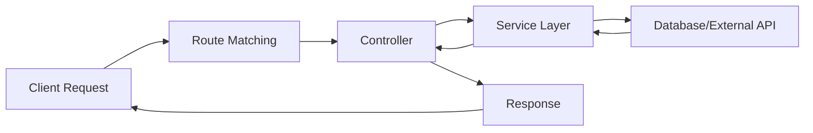

# How to Implement Controllers and Routes in NestJS

Author: [nawazdhandala](https://www.github.com/nawazdhandala)

Tags: Node.js, NestJS, Controllers, Routing, TypeScript

Description: Learn how to build REST APIs in NestJS using controllers and routes, including parameter handling, request validation, and route organization best practices.

---

NestJS is a progressive Node.js framework that brings structure and scalability to server-side applications. At its core, controllers handle incoming HTTP requests and return responses to clients. Understanding how to properly implement controllers and routes is fundamental to building clean, maintainable APIs.

## Understanding Controllers in NestJS

Controllers are responsible for handling specific requests. Each controller typically handles a set of related routes. The `@Controller()` decorator associates a class with a base route path.



## Setting Up Your First Controller

### Basic Controller Structure

The following example shows a basic controller that handles user-related routes. The `@Controller('users')` decorator sets the base path for all routes in this controller.

```typescript
// src/users/users.controller.ts
import { Controller, Get, Post, Body, Param, Put, Delete, HttpCode, HttpStatus } from '@nestjs/common';

// The @Controller decorator defines the base route path for this controller
// All routes in this controller will be prefixed with '/users'
@Controller('users')
export class UsersController {

  // GET /users - Returns all users
  // The @Get() decorator without arguments matches the base path
  @Get()
  findAll() {
    return { message: 'Returns all users' };
  }

  // GET /users/:id - Returns a single user by ID
  // The @Param('id') decorator extracts the 'id' parameter from the URL
  @Get(':id')
  findOne(@Param('id') id: string) {
    return { message: `Returns user with ID: ${id}` };
  }

  // POST /users - Creates a new user
  // The @Body() decorator extracts the request body
  @Post()
  @HttpCode(HttpStatus.CREATED)
  create(@Body() createUserDto: any) {
    return { message: 'User created', data: createUserDto };
  }

  // PUT /users/:id - Updates an existing user
  @Put(':id')
  update(@Param('id') id: string, @Body() updateUserDto: any) {
    return { message: `User ${id} updated`, data: updateUserDto };
  }

  // DELETE /users/:id - Removes a user
  @Delete(':id')
  @HttpCode(HttpStatus.NO_CONTENT)
  remove(@Param('id') id: string) {
    return;
  }
}
```

### Registering the Controller in a Module

Controllers must be registered in a module before they can handle requests. This connects the controller to the NestJS dependency injection system.

```typescript
// src/users/users.module.ts
import { Module } from '@nestjs/common';
import { UsersController } from './users.controller';
import { UsersService } from './users.service';

@Module({
  controllers: [UsersController],
  providers: [UsersService],
})
export class UsersModule {}
```

## Route Parameters and Query Strings

### Path Parameters

Path parameters let you capture values from the URL path. Use the `@Param()` decorator to extract them.

```typescript
// src/products/products.controller.ts
import { Controller, Get, Param, ParseIntPipe, ParseUUIDPipe } from '@nestjs/common';

@Controller('products')
export class ProductsController {

  // GET /products/123 - Using ParseIntPipe to validate and transform the ID to a number
  // ParseIntPipe throws a 400 Bad Request if the ID is not a valid integer
  @Get(':id')
  findOne(@Param('id', ParseIntPipe) id: number) {
    // id is now a number, not a string
    return { id, type: typeof id };
  }

  // GET /products/category/electronics - Nested route parameters
  @Get('category/:categoryName')
  findByCategory(@Param('categoryName') categoryName: string) {
    return { category: categoryName };
  }

  // GET /products/550e8400-e29b-41d4-a716-446655440000 - UUID validation
  // ParseUUIDPipe validates that the parameter is a valid UUID
  @Get('uuid/:productId')
  findByUuid(@Param('productId', ParseUUIDPipe) productId: string) {
    return { productId };
  }

  // Multiple parameters in a single route
  // GET /products/store/123/item/456
  @Get('store/:storeId/item/:itemId')
  findStoreItem(
    @Param('storeId', ParseIntPipe) storeId: number,
    @Param('itemId', ParseIntPipe) itemId: number,
  ) {
    return { storeId, itemId };
  }
}
```

### Query Parameters

Query parameters are extracted using the `@Query()` decorator. They're typically used for filtering, pagination, and sorting.

```typescript
// src/articles/articles.controller.ts
import { Controller, Get, Query, DefaultValuePipe, ParseIntPipe, ParseBoolPipe } from '@nestjs/common';

@Controller('articles')
export class ArticlesController {

  // GET /articles?page=1&limit=10&published=true
  // DefaultValuePipe provides fallback values when parameters are not provided
  @Get()
  findAll(
    @Query('page', new DefaultValuePipe(1), ParseIntPipe) page: number,
    @Query('limit', new DefaultValuePipe(10), ParseIntPipe) limit: number,
    @Query('published', new DefaultValuePipe(true), ParseBoolPipe) published: boolean,
  ) {
    return {
      page,
      limit,
      published,
      message: `Fetching page ${page} with ${limit} items, published: ${published}`,
    };
  }

  // GET /articles/search?q=nestjs&tags=typescript,nodejs
  // Handling multiple query parameters including arrays
  @Get('search')
  search(
    @Query('q') searchQuery: string,
    @Query('tags') tags: string,
  ) {
    // Split tags string into array
    const tagArray = tags ? tags.split(',') : [];
    return {
      query: searchQuery,
      tags: tagArray,
    };
  }
}
```

## Request Body and DTOs

Data Transfer Objects (DTOs) define the shape of data for requests and responses. Combined with class-validator, they provide powerful validation.

### Installing Validation Dependencies

```bash
npm install class-validator class-transformer
```

### Enabling Global Validation

Enable the validation pipe globally in your main.ts file. This ensures all incoming requests are validated against their DTOs.

```typescript
// src/main.ts
import { NestFactory } from '@nestjs/core';
import { ValidationPipe } from '@nestjs/common';
import { AppModule } from './app.module';

async function bootstrap() {
  const app = await NestFactory.create(AppModule);

  // Enable global validation pipe
  // whitelist: true strips properties that don't have decorators
  // forbidNonWhitelisted: true throws an error if unknown properties are sent
  // transform: true automatically transforms payloads to DTO instances
  app.useGlobalPipes(new ValidationPipe({
    whitelist: true,
    forbidNonWhitelisted: true,
    transform: true,
  }));

  await app.listen(3000);
}
bootstrap();
```

### Creating DTOs with Validation

DTOs with class-validator decorators provide automatic request validation. Invalid requests receive a 400 Bad Request response with detailed error messages.

```typescript
// src/users/dto/create-user.dto.ts
import { IsString, IsEmail, IsNotEmpty, MinLength, MaxLength, IsOptional, IsEnum, ValidateNested, IsArray } from 'class-validator';
import { Type } from 'class-transformer';

// Enum for user roles
export enum UserRole {
  ADMIN = 'admin',
  USER = 'user',
  MODERATOR = 'moderator',
}

// Nested DTO for address validation
export class AddressDto {
  @IsString()
  @IsNotEmpty()
  street: string;

  @IsString()
  @IsNotEmpty()
  city: string;

  @IsString()
  @IsOptional()
  zipCode?: string;
}

export class CreateUserDto {
  @IsString()
  @IsNotEmpty({ message: 'Username is required' })
  @MinLength(3, { message: 'Username must be at least 3 characters' })
  @MaxLength(20, { message: 'Username cannot exceed 20 characters' })
  username: string;

  @IsEmail({}, { message: 'Please provide a valid email address' })
  email: string;

  @IsString()
  @MinLength(8, { message: 'Password must be at least 8 characters' })
  password: string;

  @IsEnum(UserRole)
  @IsOptional()
  role?: UserRole = UserRole.USER;

  // Validate nested objects
  @ValidateNested()
  @Type(() => AddressDto)
  @IsOptional()
  address?: AddressDto;

  // Validate arrays of strings
  @IsArray()
  @IsString({ each: true })
  @IsOptional()
  tags?: string[];
}
```

### Update DTO with Partial Validation

For update operations, use PartialType to make all fields optional while keeping validation rules.

```typescript
// src/users/dto/update-user.dto.ts
import { PartialType } from '@nestjs/mapped-types';
import { CreateUserDto } from './create-user.dto';

// PartialType makes all properties from CreateUserDto optional
// Validation rules still apply to provided fields
export class UpdateUserDto extends PartialType(CreateUserDto) {}
```

### Using DTOs in Controllers

```typescript
// src/users/users.controller.ts
import { Controller, Get, Post, Put, Body, Param, ParseIntPipe } from '@nestjs/common';
import { CreateUserDto } from './dto/create-user.dto';
import { UpdateUserDto } from './dto/update-user.dto';
import { UsersService } from './users.service';

@Controller('users')
export class UsersController {
  constructor(private readonly usersService: UsersService) {}

  // POST /users - The body is automatically validated against CreateUserDto
  // Invalid requests receive a 400 response with validation errors
  @Post()
  create(@Body() createUserDto: CreateUserDto) {
    return this.usersService.create(createUserDto);
  }

  // PUT /users/:id - Partial updates with UpdateUserDto
  @Put(':id')
  update(
    @Param('id', ParseIntPipe) id: number,
    @Body() updateUserDto: UpdateUserDto,
  ) {
    return this.usersService.update(id, updateUserDto);
  }
}
```

## Route Prefixes and Versioning

### Global Route Prefix

Set a global prefix for all routes in your application. This is useful for API versioning or namespacing.

```typescript
// src/main.ts
import { NestFactory } from '@nestjs/core';
import { AppModule } from './app.module';

async function bootstrap() {
  const app = await NestFactory.create(AppModule);

  // All routes will now be prefixed with /api
  // Example: /users becomes /api/users
  app.setGlobalPrefix('api');

  await app.listen(3000);
}
bootstrap();
```

### URI Versioning

NestJS supports multiple versioning strategies. URI versioning adds the version to the URL path.

```typescript
// src/main.ts
import { NestFactory } from '@nestjs/core';
import { VersioningType } from '@nestjs/common';
import { AppModule } from './app.module';

async function bootstrap() {
  const app = await NestFactory.create(AppModule);

  // Enable URI versioning
  // Routes become /v1/users, /v2/users, etc.
  app.enableVersioning({
    type: VersioningType.URI,
    defaultVersion: '1',
  });

  await app.listen(3000);
}
bootstrap();
```

### Versioned Controllers

Apply versions at the controller or route level to maintain multiple API versions simultaneously.

```typescript
// src/users/users-v1.controller.ts
import { Controller, Get, Version } from '@nestjs/common';

// Version 1 controller - responds to /v1/users
@Controller('users')
@Version('1')
export class UsersV1Controller {
  @Get()
  findAll() {
    return { version: 'v1', users: [] };
  }
}

// src/users/users-v2.controller.ts
import { Controller, Get, Version } from '@nestjs/common';

// Version 2 controller - responds to /v2/users
// Can have different response format or features
@Controller('users')
@Version('2')
export class UsersV2Controller {
  @Get()
  findAll() {
    return {
      version: 'v2',
      data: {
        users: [],
        pagination: { page: 1, total: 0 },
      },
    };
  }
}
```

## Advanced Routing Patterns

### Sub-Resource Routes

Model hierarchical relationships with nested routes. This pattern is common for parent-child relationships.

```typescript
// src/posts/comments.controller.ts
import { Controller, Get, Post, Body, Param, ParseIntPipe } from '@nestjs/common';

// Handles routes under /posts/:postId/comments
@Controller('posts/:postId/comments')
export class CommentsController {

  // GET /posts/123/comments - Get all comments for a post
  @Get()
  findAll(@Param('postId', ParseIntPipe) postId: number) {
    return { postId, comments: [] };
  }

  // GET /posts/123/comments/456 - Get a specific comment
  @Get(':commentId')
  findOne(
    @Param('postId', ParseIntPipe) postId: number,
    @Param('commentId', ParseIntPipe) commentId: number,
  ) {
    return { postId, commentId };
  }

  // POST /posts/123/comments - Create a comment on a post
  @Post()
  create(
    @Param('postId', ParseIntPipe) postId: number,
    @Body() createCommentDto: any,
  ) {
    return { postId, comment: createCommentDto };
  }
}
```

### Wildcard Routes

Wildcard routes match any path segment. Useful for catch-all handlers or proxying requests.

```typescript
// src/proxy/proxy.controller.ts
import { Controller, All, Param, Req } from '@nestjs/common';
import { Request } from 'express';

@Controller('proxy')
export class ProxyController {

  // Matches any HTTP method and any path after /proxy/
  // Example: GET /proxy/any/path/here matches with path = 'any/path/here'
  @All('*path')
  handleProxy(@Param('path') path: string, @Req() request: Request) {
    return {
      method: request.method,
      path: path,
      headers: request.headers,
    };
  }
}
```

### Route Ordering

Route order matters in NestJS. More specific routes should be defined before generic ones to avoid conflicts.

```typescript
// src/users/users.controller.ts
import { Controller, Get, Param } from '@nestjs/common';

@Controller('users')
export class UsersController {

  // Specific route MUST come before the parameterized route
  // Otherwise /users/me would be interpreted as /users/:id with id='me'
  @Get('me')
  getCurrentUser() {
    return { user: 'current user' };
  }

  @Get('profile')
  getProfile() {
    return { profile: 'user profile' };
  }

  // Generic parameterized route comes last
  @Get(':id')
  findOne(@Param('id') id: string) {
    return { userId: id };
  }
}
```

## Response Handling

### Custom Response Status Codes

Control HTTP status codes for different scenarios using decorators or response objects.

```typescript
// src/items/items.controller.ts
import { Controller, Get, Post, Delete, Body, Param, HttpCode, HttpStatus, Res } from '@nestjs/common';
import { Response } from 'express';

@Controller('items')
export class ItemsController {

  // Returns 201 Created by default for POST requests
  @Post()
  create(@Body() createItemDto: any) {
    return { id: 1, ...createItemDto };
  }

  // Custom status code: 202 Accepted for async operations
  @Post('async')
  @HttpCode(HttpStatus.ACCEPTED)
  createAsync(@Body() createItemDto: any) {
    return { message: 'Item creation queued', jobId: 'abc123' };
  }

  // 204 No Content for delete operations
  @Delete(':id')
  @HttpCode(HttpStatus.NO_CONTENT)
  remove(@Param('id') id: string) {
    // No return value needed for 204
  }

  // Using Express Response for full control
  // Note: Using @Res() bypasses NestJS response handling
  @Get('download/:id')
  download(@Param('id') id: string, @Res() res: Response) {
    res.setHeader('Content-Type', 'application/octet-stream');
    res.setHeader('Content-Disposition', `attachment; filename="${id}.txt"`);
    res.send('File content here');
  }
}
```

### Response Headers

Add custom headers to responses using the `@Header()` decorator or response object.

```typescript
// src/files/files.controller.ts
import { Controller, Get, Header, StreamableFile } from '@nestjs/common';
import { createReadStream } from 'fs';
import { join } from 'path';

@Controller('files')
export class FilesController {

  // Add custom headers with the @Header decorator
  @Get('report')
  @Header('Content-Type', 'application/pdf')
  @Header('Content-Disposition', 'attachment; filename="report.pdf"')
  getReport() {
    const file = createReadStream(join(process.cwd(), 'report.pdf'));
    return new StreamableFile(file);
  }

  // Cache control headers
  @Get('cached')
  @Header('Cache-Control', 'max-age=3600')
  getCachedData() {
    return { data: 'This response can be cached for 1 hour' };
  }
}
```

## Request Object Access

Access the full request object when you need headers, cookies, or other request details.

```typescript
// src/auth/auth.controller.ts
import { Controller, Get, Post, Req, Headers, Ip, HostParam } from '@nestjs/common';
import { Request } from 'express';

@Controller('auth')
export class AuthController {

  // Access the full Express request object
  @Get('info')
  getRequestInfo(@Req() request: Request) {
    return {
      method: request.method,
      url: request.url,
      headers: request.headers,
      query: request.query,
      ip: request.ip,
    };
  }

  // Extract specific headers
  @Post('login')
  login(
    @Headers('authorization') authHeader: string,
    @Headers('user-agent') userAgent: string,
  ) {
    return { authHeader, userAgent };
  }

  // Get client IP address
  @Get('ip')
  getClientIp(@Ip() ip: string) {
    return { clientIp: ip };
  }
}
```

## Putting It All Together

Here's a complete example of a well-structured controller with services, DTOs, and proper error handling.

```typescript
// src/tasks/dto/create-task.dto.ts
import { IsString, IsNotEmpty, IsEnum, IsOptional, IsDateString } from 'class-validator';

export enum TaskStatus {
  PENDING = 'pending',
  IN_PROGRESS = 'in_progress',
  COMPLETED = 'completed',
}

export class CreateTaskDto {
  @IsString()
  @IsNotEmpty()
  title: string;

  @IsString()
  @IsOptional()
  description?: string;

  @IsEnum(TaskStatus)
  @IsOptional()
  status?: TaskStatus = TaskStatus.PENDING;

  @IsDateString()
  @IsOptional()
  dueDate?: string;
}
```

```typescript
// src/tasks/tasks.service.ts
import { Injectable, NotFoundException } from '@nestjs/common';
import { CreateTaskDto } from './dto/create-task.dto';

export interface Task {
  id: number;
  title: string;
  description?: string;
  status: string;
  dueDate?: string;
  createdAt: Date;
}

@Injectable()
export class TasksService {
  private tasks: Task[] = [];
  private idCounter = 1;

  findAll(): Task[] {
    return this.tasks;
  }

  findOne(id: number): Task {
    const task = this.tasks.find(t => t.id === id);
    if (!task) {
      throw new NotFoundException(`Task with ID ${id} not found`);
    }
    return task;
  }

  create(createTaskDto: CreateTaskDto): Task {
    const task: Task = {
      id: this.idCounter++,
      ...createTaskDto,
      status: createTaskDto.status || 'pending',
      createdAt: new Date(),
    };
    this.tasks.push(task);
    return task;
  }

  update(id: number, updateTaskDto: Partial<CreateTaskDto>): Task {
    const task = this.findOne(id);
    Object.assign(task, updateTaskDto);
    return task;
  }

  remove(id: number): void {
    const index = this.tasks.findIndex(t => t.id === id);
    if (index === -1) {
      throw new NotFoundException(`Task with ID ${id} not found`);
    }
    this.tasks.splice(index, 1);
  }
}
```

```typescript
// src/tasks/tasks.controller.ts
import {
  Controller, Get, Post, Put, Delete,
  Body, Param, Query, ParseIntPipe,
  HttpCode, HttpStatus, DefaultValuePipe, ParseBoolPipe
} from '@nestjs/common';
import { TasksService, Task } from './tasks.service';
import { CreateTaskDto, TaskStatus } from './dto/create-task.dto';

@Controller('tasks')
export class TasksController {
  constructor(private readonly tasksService: TasksService) {}

  // GET /tasks?completed=true&page=1&limit=10
  @Get()
  findAll(
    @Query('completed', new DefaultValuePipe(false), ParseBoolPipe) completed: boolean,
    @Query('page', new DefaultValuePipe(1), ParseIntPipe) page: number,
    @Query('limit', new DefaultValuePipe(10), ParseIntPipe) limit: number,
  ): { data: Task[]; meta: { page: number; limit: number } } {
    let tasks = this.tasksService.findAll();

    // Filter by completion status
    if (completed) {
      tasks = tasks.filter(t => t.status === TaskStatus.COMPLETED);
    }

    // Apply pagination
    const startIndex = (page - 1) * limit;
    const paginatedTasks = tasks.slice(startIndex, startIndex + limit);

    return {
      data: paginatedTasks,
      meta: { page, limit },
    };
  }

  // GET /tasks/123
  @Get(':id')
  findOne(@Param('id', ParseIntPipe) id: number): Task {
    return this.tasksService.findOne(id);
  }

  // POST /tasks
  @Post()
  @HttpCode(HttpStatus.CREATED)
  create(@Body() createTaskDto: CreateTaskDto): Task {
    return this.tasksService.create(createTaskDto);
  }

  // PUT /tasks/123
  @Put(':id')
  update(
    @Param('id', ParseIntPipe) id: number,
    @Body() updateTaskDto: Partial<CreateTaskDto>,
  ): Task {
    return this.tasksService.update(id, updateTaskDto);
  }

  // DELETE /tasks/123
  @Delete(':id')
  @HttpCode(HttpStatus.NO_CONTENT)
  remove(@Param('id', ParseIntPipe) id: number): void {
    this.tasksService.remove(id);
  }
}
```

## Route Summary

| HTTP Method | Route Pattern | Description | Decorator |
|------------|---------------|-------------|-----------|
| GET | /resources | List all resources | `@Get()` |
| GET | /resources/:id | Get single resource | `@Get(':id')` |
| POST | /resources | Create new resource | `@Post()` |
| PUT | /resources/:id | Update entire resource | `@Put(':id')` |
| PATCH | /resources/:id | Partial update | `@Patch(':id')` |
| DELETE | /resources/:id | Remove resource | `@Delete(':id')` |
| ALL | /proxy/* | Match all methods/paths | `@All('*')` |

## Best Practices

1. **Keep controllers thin** - Move business logic to services
2. **Use DTOs for validation** - Never trust client input
3. **Apply proper HTTP status codes** - 201 for creation, 204 for deletion
4. **Order routes carefully** - Specific routes before parameterized ones
5. **Use pipes for transformation** - ParseIntPipe, ParseUUIDPipe for type safety
6. **Version your API** - Plan for backward compatibility
7. **Document your routes** - Consider using Swagger/OpenAPI

NestJS controllers provide a clean, decorator-based approach to building REST APIs. Combined with TypeScript's type safety and the framework's dependency injection, you can build maintainable and scalable backend applications.

---

*Need to monitor your NestJS applications? [OneUptime](https://oneuptime.com) provides comprehensive observability for your APIs, including request tracing, error tracking, and performance monitoring. Set up alerts and status pages to keep your users informed and your services reliable.*
