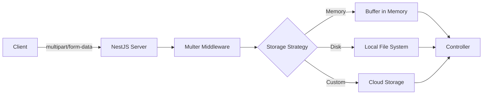
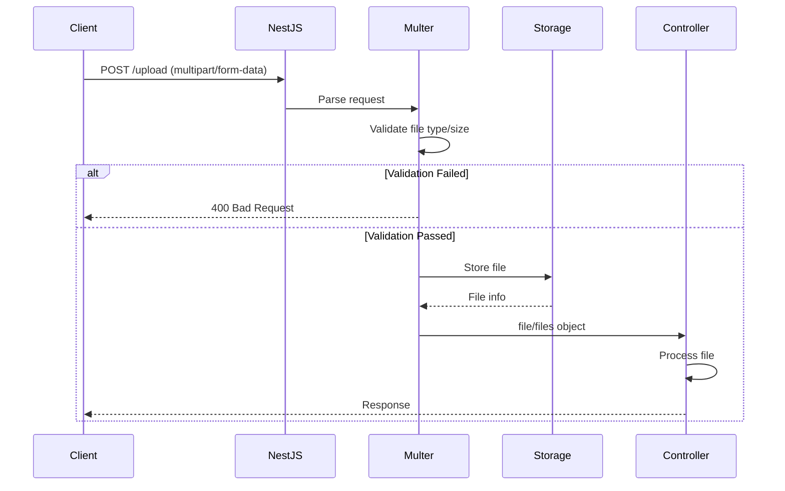
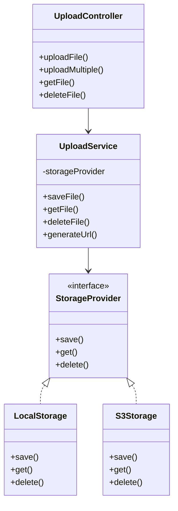

# How to Handle File Uploads in NestJS

Author: [nawazdhandala](https://www.github.com/nawazdhandala)

Tags: NestJS, Node.js, File Upload, Multer, TypeScript, API

Description: A comprehensive guide to handling file uploads in NestJS using Multer, including single and multiple file uploads, validation, storage strategies, and production best practices.

---

File uploads are a common requirement in web applications. Whether you are building a profile picture uploader, document management system, or media sharing platform, NestJS provides excellent tools for handling file uploads efficiently. This guide covers everything from basic uploads to advanced production patterns.

## How File Uploads Work in NestJS

NestJS uses Multer under the hood for handling multipart/form-data, which is the standard format for file uploads. Multer is a battle-tested middleware that processes incoming files and makes them available in your request handlers.



## Setting Up File Upload Dependencies

First, install the required packages for file uploads in NestJS.

```bash
# Install Multer types for TypeScript support
npm install @nestjs/platform-express
npm install -D @types/multer
```

## Basic Single File Upload

The simplest way to handle file uploads is using the `@UseInterceptors` decorator with `FileInterceptor`. This captures a single file from the specified form field.

```typescript
// upload.controller.ts
import {
  Controller,
  Post,
  UseInterceptors,
  UploadedFile,
  BadRequestException,
} from '@nestjs/common';
import { FileInterceptor } from '@nestjs/platform-express';
import { Express } from 'express';

@Controller('upload')
export class UploadController {
  // FileInterceptor takes the field name from the form data
  // The file will be available via @UploadedFile decorator
  @Post('single')
  @UseInterceptors(FileInterceptor('file'))
  uploadSingle(@UploadedFile() file: Express.Multer.File) {
    // Check if file was provided
    if (!file) {
      throw new BadRequestException('No file uploaded');
    }

    return {
      originalName: file.originalname,
      mimeType: file.mimetype,
      size: file.size,
      // When using memory storage, file.buffer contains the file data
      // When using disk storage, file.path contains the file path
    };
  }
}
```

## Multiple File Uploads

NestJS supports multiple file upload scenarios through different interceptors.

### Multiple Files from Single Field

Use `FilesInterceptor` when accepting multiple files from a single form field.

```typescript
// upload.controller.ts
import {
  Controller,
  Post,
  UseInterceptors,
  UploadedFiles,
} from '@nestjs/common';
import { FilesInterceptor } from '@nestjs/platform-express';

@Controller('upload')
export class UploadController {
  // FilesInterceptor accepts field name and optional max count
  // maxCount defaults to infinity if not specified
  @Post('multiple')
  @UseInterceptors(FilesInterceptor('files', 10))
  uploadMultiple(@UploadedFiles() files: Express.Multer.File[]) {
    return {
      count: files.length,
      files: files.map((file) => ({
        originalName: file.originalname,
        mimeType: file.mimetype,
        size: file.size,
      })),
    };
  }
}
```

### Multiple Files from Different Fields

Use `FileFieldsInterceptor` when accepting files from multiple form fields with different names.

```typescript
// upload.controller.ts
import {
  Controller,
  Post,
  UseInterceptors,
  UploadedFiles,
} from '@nestjs/common';
import { FileFieldsInterceptor } from '@nestjs/platform-express';

@Controller('upload')
export class UploadController {
  // FileFieldsInterceptor accepts an array of field configurations
  // Each field can have its own maxCount limit
  @Post('fields')
  @UseInterceptors(
    FileFieldsInterceptor([
      { name: 'avatar', maxCount: 1 },
      { name: 'documents', maxCount: 5 },
    ]),
  )
  uploadFields(
    @UploadedFiles()
    files: {
      avatar?: Express.Multer.File[];
      documents?: Express.Multer.File[];
    },
  ) {
    return {
      avatar: files.avatar?.[0]?.originalname,
      documents: files.documents?.map((f) => f.originalname),
    };
  }
}
```

### Any Files from Any Fields

Use `AnyFilesInterceptor` when you need to accept any files regardless of field name.

```typescript
// upload.controller.ts
import {
  Controller,
  Post,
  UseInterceptors,
  UploadedFiles,
} from '@nestjs/common';
import { AnyFilesInterceptor } from '@nestjs/platform-express';

@Controller('upload')
export class UploadController {
  // AnyFilesInterceptor captures all files from all fields
  // Useful for dynamic forms where field names are not known
  @Post('any')
  @UseInterceptors(AnyFilesInterceptor())
  uploadAny(@UploadedFiles() files: Express.Multer.File[]) {
    return {
      count: files.length,
      fields: [...new Set(files.map((f) => f.fieldname))],
    };
  }
}
```

## File Upload Flow Diagram



## Configuring Storage Options

Multer supports two built-in storage engines: memory and disk. You can also create custom storage engines for cloud providers.

### Memory Storage

Memory storage keeps files in memory as Buffer objects. This is useful for small files or when you need to process files before storing them elsewhere.

```typescript
// upload.module.ts
import { Module } from '@nestjs/common';
import { MulterModule } from '@nestjs/platform-express';
import { memoryStorage } from 'multer';
import { UploadController } from './upload.controller';

@Module({
  imports: [
    MulterModule.register({
      // Memory storage keeps files in buffer
      // Warning: Large files can exhaust server memory
      storage: memoryStorage(),
      limits: {
        fileSize: 5 * 1024 * 1024, // 5MB limit
      },
    }),
  ],
  controllers: [UploadController],
})
export class UploadModule {}
```

### Disk Storage

Disk storage writes files directly to the file system. This is better for larger files and reduces memory pressure.

```typescript
// upload.module.ts
import { Module } from '@nestjs/common';
import { MulterModule } from '@nestjs/platform-express';
import { diskStorage } from 'multer';
import { extname, join } from 'path';
import { v4 as uuidv4 } from 'uuid';
import { UploadController } from './upload.controller';

@Module({
  imports: [
    MulterModule.register({
      storage: diskStorage({
        // Destination can be a string or function
        // Using a function allows dynamic destination selection
        destination: (req, file, callback) => {
          const uploadPath = join(__dirname, '..', '..', 'uploads');
          callback(null, uploadPath);
        },
        // Generate unique filenames to prevent collisions
        // Preserve original extension for proper file handling
        filename: (req, file, callback) => {
          const uniqueName = uuidv4();
          const extension = extname(file.originalname);
          callback(null, `${uniqueName}${extension}`);
        },
      }),
      limits: {
        fileSize: 50 * 1024 * 1024, // 50MB limit
      },
    }),
  ],
  controllers: [UploadController],
})
export class UploadModule {}
```

## File Validation

Validating uploaded files is critical for security and data integrity. NestJS provides the `ParseFilePipe` for declarative validation.

### Basic File Validation with ParseFilePipe

```typescript
// upload.controller.ts
import {
  Controller,
  Post,
  UseInterceptors,
  UploadedFile,
  ParseFilePipe,
  MaxFileSizeValidator,
  FileTypeValidator,
} from '@nestjs/common';
import { FileInterceptor } from '@nestjs/platform-express';

@Controller('upload')
export class UploadController {
  @Post('validated')
  @UseInterceptors(FileInterceptor('file'))
  uploadValidated(
    @UploadedFile(
      // ParseFilePipe runs validators in sequence
      // All validators must pass for the upload to succeed
      new ParseFilePipe({
        validators: [
          // MaxFileSizeValidator checks file size in bytes
          new MaxFileSizeValidator({ maxSize: 5 * 1024 * 1024 }), // 5MB
          // FileTypeValidator uses regex to match MIME type
          new FileTypeValidator({ fileType: /^image\/(jpeg|png|gif)$/ }),
        ],
      }),
    )
    file: Express.Multer.File,
  ) {
    return {
      message: 'File uploaded successfully',
      filename: file.originalname,
    };
  }
}
```

### Custom File Validator

Create custom validators for complex validation logic like checking file signatures (magic bytes) or dimensions.

```typescript
// validators/file-signature.validator.ts
import { FileValidator } from '@nestjs/common';

// File signatures (magic bytes) for common file types
const FILE_SIGNATURES: Record<string, Buffer> = {
  'image/jpeg': Buffer.from([0xff, 0xd8, 0xff]),
  'image/png': Buffer.from([0x89, 0x50, 0x4e, 0x47]),
  'image/gif': Buffer.from([0x47, 0x49, 0x46]),
  'application/pdf': Buffer.from([0x25, 0x50, 0x44, 0x46]),
};

export interface FileSignatureValidatorOptions {
  allowedTypes: string[];
}

export class FileSignatureValidator extends FileValidator<FileSignatureValidatorOptions> {
  constructor(options: FileSignatureValidatorOptions) {
    super(options);
  }

  // isValid receives the file object and returns boolean
  // For async validation, you can return a Promise<boolean>
  isValid(file?: Express.Multer.File): boolean {
    if (!file || !file.buffer) {
      return false;
    }

    // Check if file signature matches any allowed type
    for (const allowedType of this.validationOptions.allowedTypes) {
      const signature = FILE_SIGNATURES[allowedType];
      if (signature) {
        const fileHeader = file.buffer.slice(0, signature.length);
        if (fileHeader.equals(signature)) {
          return true;
        }
      }
    }

    return false;
  }

  // buildErrorMessage provides the error message when validation fails
  buildErrorMessage(): string {
    const types = this.validationOptions.allowedTypes.join(', ');
    return `File signature does not match allowed types: ${types}`;
  }
}
```

```typescript
// upload.controller.ts
import {
  Controller,
  Post,
  UseInterceptors,
  UploadedFile,
  ParseFilePipe,
} from '@nestjs/common';
import { FileInterceptor } from '@nestjs/platform-express';
import { memoryStorage } from 'multer';
import { FileSignatureValidator } from './validators/file-signature.validator';

@Controller('upload')
export class UploadController {
  // Use memory storage when you need to access file.buffer
  // for signature validation
  @Post('secure')
  @UseInterceptors(
    FileInterceptor('file', {
      storage: memoryStorage(),
    }),
  )
  uploadSecure(
    @UploadedFile(
      new ParseFilePipe({
        validators: [
          new FileSignatureValidator({
            allowedTypes: ['image/jpeg', 'image/png', 'application/pdf'],
          }),
        ],
      }),
    )
    file: Express.Multer.File,
  ) {
    return {
      message: 'File signature verified',
      filename: file.originalname,
    };
  }
}
```

## Upload Service Architecture

For production applications, extract file handling logic into a dedicated service.



### Storage Provider Interface

Define an interface that all storage providers must implement. This enables easy switching between local and cloud storage.

```typescript
// storage/storage.interface.ts
export interface StorageProvider {
  // Save file and return unique identifier
  save(
    file: Express.Multer.File,
    options?: SaveOptions,
  ): Promise<SaveResult>;

  // Retrieve file by identifier
  get(identifier: string): Promise<Buffer>;

  // Delete file by identifier
  delete(identifier: string): Promise<void>;

  // Generate public or signed URL
  getUrl(identifier: string, expiresIn?: number): Promise<string>;
}

export interface SaveOptions {
  folder?: string;
  filename?: string;
  contentType?: string;
  metadata?: Record<string, string>;
}

export interface SaveResult {
  identifier: string;
  url: string;
  size: number;
  mimeType: string;
}
```

### Local Storage Implementation

```typescript
// storage/local.storage.ts
import { Injectable } from '@nestjs/common';
import { StorageProvider, SaveOptions, SaveResult } from './storage.interface';
import { promises as fs } from 'fs';
import { join, extname } from 'path';
import { v4 as uuidv4 } from 'uuid';
import { ConfigService } from '@nestjs/config';

@Injectable()
export class LocalStorage implements StorageProvider {
  private readonly uploadDir: string;
  private readonly baseUrl: string;

  constructor(private config: ConfigService) {
    this.uploadDir = config.get('UPLOAD_DIR', './uploads');
    this.baseUrl = config.get('BASE_URL', 'http://localhost:3000');
  }

  async save(
    file: Express.Multer.File,
    options?: SaveOptions,
  ): Promise<SaveResult> {
    // Generate unique filename with original extension
    const extension = extname(file.originalname);
    const filename = options?.filename || `${uuidv4()}${extension}`;
    const folder = options?.folder || 'files';

    // Ensure directory exists
    const dirPath = join(this.uploadDir, folder);
    await fs.mkdir(dirPath, { recursive: true });

    // Write file to disk
    const filePath = join(dirPath, filename);
    await fs.writeFile(filePath, file.buffer);

    // Return standardized result
    const identifier = `${folder}/${filename}`;
    return {
      identifier,
      url: `${this.baseUrl}/uploads/${identifier}`,
      size: file.size,
      mimeType: file.mimetype,
    };
  }

  async get(identifier: string): Promise<Buffer> {
    const filePath = join(this.uploadDir, identifier);
    return fs.readFile(filePath);
  }

  async delete(identifier: string): Promise<void> {
    const filePath = join(this.uploadDir, identifier);
    await fs.unlink(filePath);
  }

  async getUrl(identifier: string): Promise<string> {
    return `${this.baseUrl}/uploads/${identifier}`;
  }
}
```

### AWS S3 Storage Implementation

```typescript
// storage/s3.storage.ts
import { Injectable } from '@nestjs/common';
import { StorageProvider, SaveOptions, SaveResult } from './storage.interface';
import {
  S3Client,
  PutObjectCommand,
  GetObjectCommand,
  DeleteObjectCommand,
} from '@aws-sdk/client-s3';
import { getSignedUrl } from '@aws-sdk/s3-request-presigner';
import { ConfigService } from '@nestjs/config';
import { v4 as uuidv4 } from 'uuid';
import { extname } from 'path';

@Injectable()
export class S3Storage implements StorageProvider {
  private readonly s3: S3Client;
  private readonly bucket: string;
  private readonly region: string;

  constructor(private config: ConfigService) {
    this.region = config.get('AWS_REGION', 'us-east-1');
    this.bucket = config.get('AWS_S3_BUCKET');

    this.s3 = new S3Client({
      region: this.region,
      credentials: {
        accessKeyId: config.get('AWS_ACCESS_KEY_ID'),
        secretAccessKey: config.get('AWS_SECRET_ACCESS_KEY'),
      },
    });
  }

  async save(
    file: Express.Multer.File,
    options?: SaveOptions,
  ): Promise<SaveResult> {
    // Generate unique key with folder structure
    const extension = extname(file.originalname);
    const filename = options?.filename || `${uuidv4()}${extension}`;
    const folder = options?.folder || 'uploads';
    const key = `${folder}/${filename}`;

    // Upload to S3
    await this.s3.send(
      new PutObjectCommand({
        Bucket: this.bucket,
        Key: key,
        Body: file.buffer,
        ContentType: options?.contentType || file.mimetype,
        Metadata: options?.metadata,
      }),
    );

    return {
      identifier: key,
      url: `https://${this.bucket}.s3.${this.region}.amazonaws.com/${key}`,
      size: file.size,
      mimeType: file.mimetype,
    };
  }

  async get(identifier: string): Promise<Buffer> {
    const response = await this.s3.send(
      new GetObjectCommand({
        Bucket: this.bucket,
        Key: identifier,
      }),
    );

    // Convert stream to buffer
    const chunks: Uint8Array[] = [];
    for await (const chunk of response.Body as any) {
      chunks.push(chunk);
    }
    return Buffer.concat(chunks);
  }

  async delete(identifier: string): Promise<void> {
    await this.s3.send(
      new DeleteObjectCommand({
        Bucket: this.bucket,
        Key: identifier,
      }),
    );
  }

  async getUrl(identifier: string, expiresIn = 3600): Promise<string> {
    // Generate presigned URL for private files
    const command = new GetObjectCommand({
      Bucket: this.bucket,
      Key: identifier,
    });

    return getSignedUrl(this.s3, command, { expiresIn });
  }
}
```

### Upload Service

The upload service provides a clean interface for controllers and handles business logic.

```typescript
// upload/upload.service.ts
import { Injectable, Inject, NotFoundException } from '@nestjs/common';
import { StorageProvider } from '../storage/storage.interface';

@Injectable()
export class UploadService {
  constructor(
    @Inject('STORAGE_PROVIDER')
    private readonly storage: StorageProvider,
  ) {}

  // Save file with automatic folder organization by date
  async saveFile(
    file: Express.Multer.File,
    folder?: string,
  ): Promise<{
    id: string;
    url: string;
    size: number;
    mimeType: string;
  }> {
    // Organize files by date for easier management
    const date = new Date();
    const dateFolder = `${date.getFullYear()}/${String(date.getMonth() + 1).padStart(2, '0')}`;
    const targetFolder = folder ? `${folder}/${dateFolder}` : dateFolder;

    const result = await this.storage.save(file, { folder: targetFolder });

    return {
      id: result.identifier,
      url: result.url,
      size: result.size,
      mimeType: result.mimeType,
    };
  }

  // Save multiple files in parallel
  async saveFiles(
    files: Express.Multer.File[],
    folder?: string,
  ): Promise<Array<{ id: string; url: string; size: number; mimeType: string }>> {
    return Promise.all(files.map((file) => this.saveFile(file, folder)));
  }

  // Get file buffer for download
  async getFile(identifier: string): Promise<Buffer> {
    try {
      return await this.storage.get(identifier);
    } catch (error) {
      throw new NotFoundException('File not found');
    }
  }

  // Delete file
  async deleteFile(identifier: string): Promise<void> {
    try {
      await this.storage.delete(identifier);
    } catch (error) {
      throw new NotFoundException('File not found');
    }
  }

  // Get file URL (presigned for private storage)
  async getFileUrl(identifier: string, expiresIn?: number): Promise<string> {
    return this.storage.getUrl(identifier, expiresIn);
  }
}
```

### Upload Module with Dynamic Storage Provider

```typescript
// upload/upload.module.ts
import { Module, DynamicModule } from '@nestjs/common';
import { ConfigModule, ConfigService } from '@nestjs/config';
import { MulterModule } from '@nestjs/platform-express';
import { memoryStorage } from 'multer';
import { UploadController } from './upload.controller';
import { UploadService } from './upload.service';
import { LocalStorage } from '../storage/local.storage';
import { S3Storage } from '../storage/s3.storage';

@Module({})
export class UploadModule {
  // Use forRoot pattern to configure storage provider at module level
  static forRoot(storageType: 'local' | 's3' = 'local'): DynamicModule {
    const storageProvider = {
      provide: 'STORAGE_PROVIDER',
      useClass: storageType === 's3' ? S3Storage : LocalStorage,
    };

    return {
      module: UploadModule,
      imports: [
        ConfigModule,
        MulterModule.register({
          storage: memoryStorage(),
          limits: {
            fileSize: 50 * 1024 * 1024, // 50MB
            files: 10,
          },
        }),
      ],
      controllers: [UploadController],
      providers: [UploadService, storageProvider],
      exports: [UploadService],
    };
  }

  // Use forRootAsync for configuration from environment
  static forRootAsync(): DynamicModule {
    return {
      module: UploadModule,
      imports: [ConfigModule, MulterModule.register({ storage: memoryStorage() })],
      controllers: [UploadController],
      providers: [
        UploadService,
        {
          provide: 'STORAGE_PROVIDER',
          useFactory: (config: ConfigService) => {
            const storageType = config.get('STORAGE_TYPE', 'local');
            if (storageType === 's3') {
              return new S3Storage(config);
            }
            return new LocalStorage(config);
          },
          inject: [ConfigService],
        },
      ],
      exports: [UploadService],
    };
  }
}
```

## Streaming Large Files

For large file uploads, avoid loading the entire file into memory by using streams.

```typescript
// upload/stream-upload.controller.ts
import {
  Controller,
  Post,
  Req,
  Res,
  Headers,
  BadRequestException,
} from '@nestjs/common';
import { Request, Response } from 'express';
import * as Busboy from 'busboy';
import { createWriteStream } from 'fs';
import { join } from 'path';
import { v4 as uuidv4 } from 'uuid';
import { pipeline } from 'stream/promises';

@Controller('upload')
export class StreamUploadController {
  // Handle large file uploads with streaming
  // This approach never loads the entire file into memory
  @Post('stream')
  async uploadStream(
    @Req() req: Request,
    @Res() res: Response,
    @Headers('content-type') contentType: string,
  ) {
    // Validate content type
    if (!contentType?.includes('multipart/form-data')) {
      throw new BadRequestException('Expected multipart/form-data');
    }

    const busboy = Busboy({
      headers: req.headers,
      limits: {
        fileSize: 500 * 1024 * 1024, // 500MB
        files: 1,
      },
    });

    const uploadPromise = new Promise<{ filename: string; size: number }>(
      (resolve, reject) => {
        let uploadedFile: { filename: string; size: number } | null = null;

        busboy.on('file', async (fieldname, file, info) => {
          const { filename, mimeType } = info;
          const uniqueName = `${uuidv4()}-${filename}`;
          const savePath = join(process.cwd(), 'uploads', uniqueName);

          const writeStream = createWriteStream(savePath);
          let size = 0;

          file.on('data', (chunk) => {
            size += chunk.length;
          });

          try {
            await pipeline(file, writeStream);
            uploadedFile = { filename: uniqueName, size };
          } catch (error) {
            reject(error);
          }
        });

        busboy.on('finish', () => {
          if (uploadedFile) {
            resolve(uploadedFile);
          } else {
            reject(new Error('No file uploaded'));
          }
        });

        busboy.on('error', reject);
      },
    );

    req.pipe(busboy);

    try {
      const result = await uploadPromise;
      res.json({
        message: 'File uploaded successfully',
        ...result,
      });
    } catch (error) {
      res.status(500).json({ error: error.message });
    }
  }
}
```

## Image Processing with Sharp

Process uploaded images for thumbnails, resizing, or format conversion.

```typescript
// upload/image.service.ts
import { Injectable } from '@nestjs/common';
import * as sharp from 'sharp';

export interface ProcessedImage {
  buffer: Buffer;
  width: number;
  height: number;
  format: string;
}

@Injectable()
export class ImageService {
  // Resize image to fit within dimensions while maintaining aspect ratio
  async resize(
    buffer: Buffer,
    width: number,
    height: number,
  ): Promise<ProcessedImage> {
    const image = sharp(buffer).resize(width, height, {
      fit: 'inside',
      withoutEnlargement: true,
    });

    const metadata = await image.metadata();
    const outputBuffer = await image.toBuffer();

    return {
      buffer: outputBuffer,
      width: metadata.width || width,
      height: metadata.height || height,
      format: metadata.format || 'jpeg',
    };
  }

  // Create thumbnail with square crop
  async createThumbnail(buffer: Buffer, size = 200): Promise<ProcessedImage> {
    const image = sharp(buffer)
      .resize(size, size, {
        fit: 'cover',
        position: 'center',
      })
      .jpeg({ quality: 80 });

    const outputBuffer = await image.toBuffer();

    return {
      buffer: outputBuffer,
      width: size,
      height: size,
      format: 'jpeg',
    };
  }

  // Convert to WebP for better compression
  async convertToWebP(buffer: Buffer, quality = 80): Promise<ProcessedImage> {
    const image = sharp(buffer).webp({ quality });

    const metadata = await image.metadata();
    const outputBuffer = await image.toBuffer();

    return {
      buffer: outputBuffer,
      width: metadata.width || 0,
      height: metadata.height || 0,
      format: 'webp',
    };
  }

  // Generate multiple sizes for responsive images
  async generateResponsiveSizes(
    buffer: Buffer,
    sizes = [320, 640, 1280, 1920],
  ): Promise<Map<number, ProcessedImage>> {
    const results = new Map<number, ProcessedImage>();

    await Promise.all(
      sizes.map(async (size) => {
        const processed = await this.resize(buffer, size, size);
        results.set(size, processed);
      }),
    );

    return results;
  }
}
```

```typescript
// upload/upload.controller.ts
import {
  Controller,
  Post,
  UseInterceptors,
  UploadedFile,
  ParseFilePipe,
  FileTypeValidator,
  Inject,
} from '@nestjs/common';
import { FileInterceptor } from '@nestjs/platform-express';
import { memoryStorage } from 'multer';
import { ImageService } from './image.service';
import { UploadService } from './upload.service';

@Controller('upload')
export class UploadController {
  constructor(
    private readonly imageService: ImageService,
    private readonly uploadService: UploadService,
  ) {}

  // Upload image and generate multiple sizes
  @Post('image')
  @UseInterceptors(
    FileInterceptor('image', {
      storage: memoryStorage(),
      limits: { fileSize: 10 * 1024 * 1024 }, // 10MB
    }),
  )
  async uploadImage(
    @UploadedFile(
      new ParseFilePipe({
        validators: [
          new FileTypeValidator({ fileType: /^image\/(jpeg|png|webp)$/ }),
        ],
      }),
    )
    file: Express.Multer.File,
  ) {
    // Create thumbnail
    const thumbnail = await this.imageService.createThumbnail(
      file.buffer,
      200,
    );

    // Convert to WebP for main image
    const webp = await this.imageService.convertToWebP(file.buffer);

    // Save both versions
    const [originalResult, thumbnailResult] = await Promise.all([
      this.uploadService.saveFile(
        { ...file, buffer: webp.buffer, mimetype: 'image/webp' } as any,
        'images',
      ),
      this.uploadService.saveFile(
        {
          ...file,
          buffer: thumbnail.buffer,
          mimetype: 'image/jpeg',
          originalname: `thumb-${file.originalname}`,
        } as any,
        'thumbnails',
      ),
    ]);

    return {
      original: originalResult,
      thumbnail: thumbnailResult,
    };
  }
}
```

## File Download Endpoint

Serve uploaded files with proper headers and streaming.

```typescript
// upload/download.controller.ts
import {
  Controller,
  Get,
  Param,
  Res,
  NotFoundException,
  StreamableFile,
  Header,
} from '@nestjs/common';
import { Response } from 'express';
import { createReadStream, existsSync, statSync } from 'fs';
import { join, basename } from 'path';
import { lookup } from 'mime-types';

@Controller('files')
export class DownloadController {
  private readonly uploadDir = join(process.cwd(), 'uploads');

  // Stream file download with proper headers
  @Get(':filename')
  downloadFile(
    @Param('filename') filename: string,
    @Res({ passthrough: true }) res: Response,
  ): StreamableFile {
    // Sanitize filename to prevent path traversal
    const sanitizedFilename = basename(filename);
    const filePath = join(this.uploadDir, sanitizedFilename);

    // Check if file exists
    if (!existsSync(filePath)) {
      throw new NotFoundException('File not found');
    }

    // Get file stats and mime type
    const stats = statSync(filePath);
    const mimeType = lookup(filePath) || 'application/octet-stream';

    // Set response headers
    res.set({
      'Content-Type': mimeType,
      'Content-Length': stats.size,
      'Content-Disposition': `attachment; filename="${sanitizedFilename}"`,
      'Cache-Control': 'public, max-age=31536000',
    });

    // Create read stream and return
    const stream = createReadStream(filePath);
    return new StreamableFile(stream);
  }

  // Inline file viewing (for images, PDFs)
  @Get('view/:filename')
  viewFile(
    @Param('filename') filename: string,
    @Res({ passthrough: true }) res: Response,
  ): StreamableFile {
    const sanitizedFilename = basename(filename);
    const filePath = join(this.uploadDir, sanitizedFilename);

    if (!existsSync(filePath)) {
      throw new NotFoundException('File not found');
    }

    const stats = statSync(filePath);
    const mimeType = lookup(filePath) || 'application/octet-stream';

    // Use inline disposition for browser viewing
    res.set({
      'Content-Type': mimeType,
      'Content-Length': stats.size,
      'Content-Disposition': `inline; filename="${sanitizedFilename}"`,
    });

    const stream = createReadStream(filePath);
    return new StreamableFile(stream);
  }
}
```

## Error Handling for File Uploads

Create a comprehensive error handling strategy for upload failures.

```typescript
// filters/multer-exception.filter.ts
import {
  ExceptionFilter,
  Catch,
  ArgumentsHost,
  HttpStatus,
} from '@nestjs/common';
import { MulterError } from 'multer';
import { Response } from 'express';

@Catch(MulterError)
export class MulterExceptionFilter implements ExceptionFilter {
  catch(exception: MulterError, host: ArgumentsHost) {
    const ctx = host.switchToHttp();
    const response = ctx.getResponse<Response>();

    // Map Multer error codes to HTTP responses
    const errorMap: Record<
      string,
      { status: number; message: string }
    > = {
      LIMIT_FILE_SIZE: {
        status: HttpStatus.PAYLOAD_TOO_LARGE,
        message: 'File size exceeds the maximum allowed limit',
      },
      LIMIT_FILE_COUNT: {
        status: HttpStatus.BAD_REQUEST,
        message: 'Too many files uploaded',
      },
      LIMIT_FIELD_KEY: {
        status: HttpStatus.BAD_REQUEST,
        message: 'Field name is too long',
      },
      LIMIT_FIELD_VALUE: {
        status: HttpStatus.BAD_REQUEST,
        message: 'Field value is too long',
      },
      LIMIT_FIELD_COUNT: {
        status: HttpStatus.BAD_REQUEST,
        message: 'Too many fields in request',
      },
      LIMIT_UNEXPECTED_FILE: {
        status: HttpStatus.BAD_REQUEST,
        message: 'Unexpected file field',
      },
      LIMIT_PART_COUNT: {
        status: HttpStatus.BAD_REQUEST,
        message: 'Too many parts in request',
      },
    };

    const error = errorMap[exception.code] || {
      status: HttpStatus.BAD_REQUEST,
      message: exception.message,
    };

    response.status(error.status).json({
      success: false,
      error: {
        code: exception.code,
        message: error.message,
        field: exception.field,
      },
    });
  }
}
```

```typescript
// main.ts
import { NestFactory } from '@nestjs/core';
import { AppModule } from './app.module';
import { MulterExceptionFilter } from './filters/multer-exception.filter';

async function bootstrap() {
  const app = await NestFactory.create(AppModule);

  // Apply Multer exception filter globally
  app.useGlobalFilters(new MulterExceptionFilter());

  await app.listen(3000);
}
bootstrap();
```

## Security Best Practices

Follow these security practices to protect your application from upload vulnerabilities.

| Threat | Mitigation |
|--------|------------|
| Path Traversal | Sanitize filenames, never use user input in paths |
| File Type Spoofing | Validate magic bytes, not just MIME type |
| Denial of Service | Set file size limits, rate limit uploads |
| Malware Upload | Scan files with antivirus, store outside webroot |
| Storage Exhaustion | Implement quotas, monitor disk usage |

### Comprehensive Security Configuration

```typescript
// upload/secure-upload.module.ts
import { Module } from '@nestjs/common';
import { MulterModule } from '@nestjs/platform-express';
import { memoryStorage } from 'multer';
import { extname } from 'path';

// Allowed file extensions whitelist
const ALLOWED_EXTENSIONS = ['.jpg', '.jpeg', '.png', '.gif', '.pdf', '.doc', '.docx'];

// Allowed MIME types whitelist
const ALLOWED_MIMETYPES = [
  'image/jpeg',
  'image/png',
  'image/gif',
  'application/pdf',
  'application/msword',
  'application/vnd.openxmlformats-officedocument.wordprocessingml.document',
];

@Module({
  imports: [
    MulterModule.register({
      storage: memoryStorage(),
      limits: {
        fileSize: 10 * 1024 * 1024, // 10MB max
        files: 5, // Max 5 files per request
        fields: 10, // Max 10 non-file fields
        fieldSize: 1024, // Max field value size 1KB
      },
      fileFilter: (req, file, callback) => {
        // Check extension
        const ext = extname(file.originalname).toLowerCase();
        if (!ALLOWED_EXTENSIONS.includes(ext)) {
          return callback(
            new Error(`File extension ${ext} is not allowed`),
            false,
          );
        }

        // Check MIME type
        if (!ALLOWED_MIMETYPES.includes(file.mimetype)) {
          return callback(
            new Error(`MIME type ${file.mimetype} is not allowed`),
            false,
          );
        }

        callback(null, true);
      },
    }),
  ],
})
export class SecureUploadModule {}
```

## Testing File Uploads

Write comprehensive tests for your upload endpoints.

```typescript
// upload/upload.controller.spec.ts
import { Test, TestingModule } from '@nestjs/testing';
import { INestApplication } from '@nestjs/common';
import * as request from 'supertest';
import { join } from 'path';
import { readFileSync } from 'fs';
import { UploadModule } from './upload.module';

describe('UploadController', () => {
  let app: INestApplication;

  beforeAll(async () => {
    const moduleFixture: TestingModule = await Test.createTestingModule({
      imports: [UploadModule.forRoot('local')],
    }).compile();

    app = moduleFixture.createNestApplication();
    await app.init();
  });

  afterAll(async () => {
    await app.close();
  });

  describe('POST /upload/single', () => {
    it('should upload a single file', async () => {
      const response = await request(app.getHttpServer())
        .post('/upload/single')
        .attach('file', Buffer.from('test content'), 'test.txt')
        .expect(201);

      expect(response.body).toHaveProperty('originalName', 'test.txt');
      expect(response.body).toHaveProperty('size');
    });

    it('should reject files exceeding size limit', async () => {
      // Create a buffer larger than the limit
      const largeBuffer = Buffer.alloc(60 * 1024 * 1024); // 60MB

      await request(app.getHttpServer())
        .post('/upload/single')
        .attach('file', largeBuffer, 'large.bin')
        .expect(413);
    });

    it('should reject invalid file types', async () => {
      await request(app.getHttpServer())
        .post('/upload/validated')
        .attach('file', Buffer.from('test'), 'test.exe')
        .expect(400);
    });
  });

  describe('POST /upload/multiple', () => {
    it('should upload multiple files', async () => {
      const response = await request(app.getHttpServer())
        .post('/upload/multiple')
        .attach('files', Buffer.from('file 1'), 'file1.txt')
        .attach('files', Buffer.from('file 2'), 'file2.txt')
        .expect(201);

      expect(response.body.count).toBe(2);
      expect(response.body.files).toHaveLength(2);
    });
  });
});
```

## Summary

| Pattern | Use Case | Memory Impact |
|---------|----------|---------------|
| FileInterceptor | Single file upload | Depends on storage |
| FilesInterceptor | Multiple files from one field | Depends on storage |
| FileFieldsInterceptor | Files from multiple fields | Depends on storage |
| Memory Storage | Small files, processing needed | High |
| Disk Storage | Large files, direct save | Low |
| Streaming (Busboy) | Very large files | Minimal |

File uploads in NestJS are powerful and flexible. By choosing the right storage strategy, implementing proper validation, and following security best practices, you can build robust file upload features that scale with your application. Always validate both file type and content, set appropriate size limits, and consider using cloud storage for production deployments.
