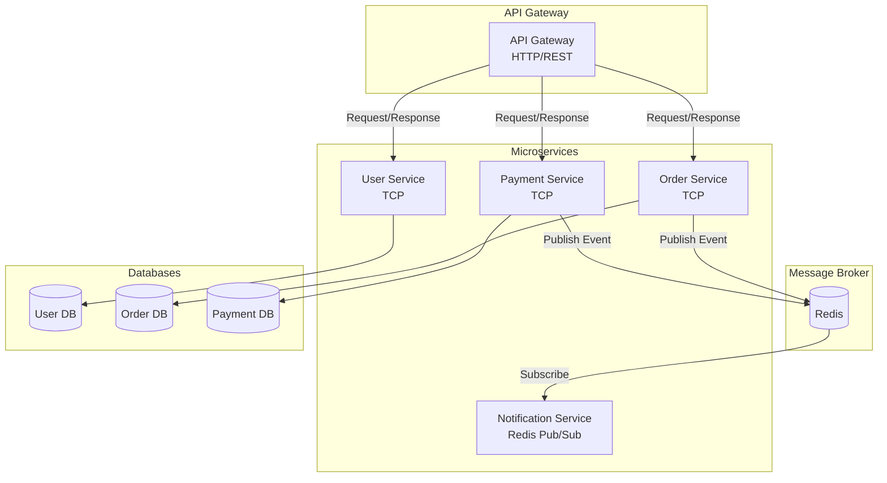
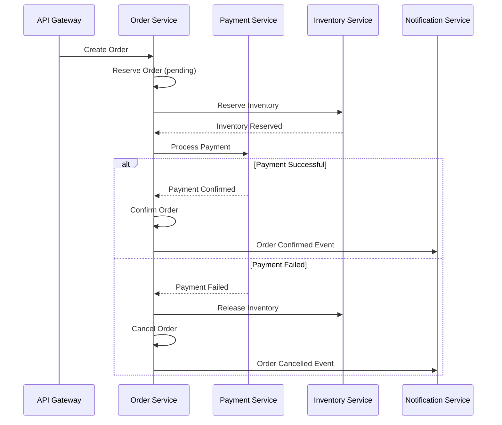

# How to Implement Microservices with NestJS

Author: [nawazdhandala](https://github.com/nawazdhandala)

Tags: NestJS, Node.js, Microservices, Architecture, TypeScript, Backend, Distributed Systems

Description: A comprehensive guide to building scalable microservices with NestJS, covering transport layers, message patterns, service communication, and production best practices.

---

Microservices architecture has become the standard approach for building scalable, maintainable applications. NestJS provides first-class support for building microservices with its modular architecture, dependency injection, and built-in transport layer abstractions. This guide walks you through implementing a complete microservices system with NestJS.

## Why NestJS for Microservices?

NestJS offers several advantages for microservices development:

- **Transport Layer Abstraction**: Switch between TCP, Redis, RabbitMQ, Kafka, gRPC, and MQTT without changing business logic
- **Decorator-Based Patterns**: Clean message and event handlers using decorators
- **Dependency Injection**: Loosely coupled services that are easy to test
- **TypeScript First**: Full type safety across service boundaries
- **Hybrid Applications**: Run HTTP endpoints and microservice listeners in the same application

## Microservices Architecture Overview

Before diving into code, let us understand the architecture we will build:



## Setting Up a NestJS Microservice

### Installation

First, install the NestJS microservices package along with any transport-specific packages you need.

```bash
npm install @nestjs/microservices
npm install @nestjs/platform-express
npm install ioredis           # For Redis transport
npm install kafkajs           # For Kafka transport
npm install amqplib amqp-connection-manager  # For RabbitMQ transport
```

### Creating the User Service

Let us start with a simple user service that handles user-related operations. This service will use TCP as its transport layer.

Create the main bootstrap file that configures the microservice listener. The `Transport.TCP` option tells NestJS to use TCP sockets for communication.

```typescript
// user-service/src/main.ts
import { NestFactory } from '@nestjs/core';
import { Transport, MicroserviceOptions } from '@nestjs/microservices';
import { AppModule } from './app.module';

async function bootstrap() {
  // Create a microservice instance instead of an HTTP server
  const app = await NestFactory.createMicroservice<MicroserviceOptions>(
    AppModule,
    {
      transport: Transport.TCP,
      options: {
        host: process.env.USER_SERVICE_HOST || '0.0.0.0',
        port: parseInt(process.env.USER_SERVICE_PORT, 10) || 3001,
      },
    },
  );

  // Start listening for incoming messages
  await app.listen();
  console.log('User Service is listening on port 3001');
}
bootstrap();
```

### Defining Message Patterns

NestJS microservices use two communication patterns: request-response and event-based. The `@MessagePattern` decorator handles request-response while `@EventPattern` handles events.

Create a controller that handles incoming messages. Each message pattern acts like a route in a traditional REST API.

```typescript
// user-service/src/users/users.controller.ts
import { Controller } from '@nestjs/common';
import { MessagePattern, Payload, EventPattern } from '@nestjs/microservices';
import { UsersService } from './users.service';
import { CreateUserDto } from './dto/create-user.dto';

@Controller()
export class UsersController {
  constructor(private readonly usersService: UsersService) {}

  // Request-response pattern: client sends request, expects response
  @MessagePattern({ cmd: 'create_user' })
  async createUser(@Payload() createUserDto: CreateUserDto) {
    return this.usersService.create(createUserDto);
  }

  // Request-response pattern for fetching a single user
  @MessagePattern({ cmd: 'get_user' })
  async getUser(@Payload() data: { id: string }) {
    const user = await this.usersService.findOne(data.id);
    if (!user) {
      return { error: 'User not found', statusCode: 404 };
    }
    return user;
  }

  // Request-response pattern for fetching all users
  @MessagePattern({ cmd: 'get_users' })
  async getUsers(@Payload() data: { page?: number; limit?: number }) {
    return this.usersService.findAll(data.page, data.limit);
  }

  // Event pattern: no response expected, fire-and-forget
  @EventPattern('user_logged_in')
  async handleUserLogin(@Payload() data: { userId: string; timestamp: Date }) {
    await this.usersService.updateLastLogin(data.userId, data.timestamp);
  }
}
```

### Implementing the Service Layer

The service layer contains the business logic and data access code. Keep it transport-agnostic so the same service can work with different transports.

```typescript
// user-service/src/users/users.service.ts
import { Injectable, Logger } from '@nestjs/common';
import { CreateUserDto } from './dto/create-user.dto';
import { User } from './entities/user.entity';

@Injectable()
export class UsersService {
  private readonly logger = new Logger(UsersService.name);
  private users: Map<string, User> = new Map();

  async create(createUserDto: CreateUserDto): Promise<User> {
    const user: User = {
      id: this.generateId(),
      ...createUserDto,
      createdAt: new Date(),
      updatedAt: new Date(),
    };

    this.users.set(user.id, user);
    this.logger.log(`Created user: ${user.id}`);

    return user;
  }

  async findOne(id: string): Promise<User | null> {
    return this.users.get(id) || null;
  }

  async findAll(page = 1, limit = 10): Promise<{ users: User[]; total: number }> {
    const allUsers = Array.from(this.users.values());
    const start = (page - 1) * limit;
    const users = allUsers.slice(start, start + limit);

    return {
      users,
      total: allUsers.length,
    };
  }

  async updateLastLogin(userId: string, timestamp: Date): Promise<void> {
    const user = this.users.get(userId);
    if (user) {
      user.lastLoginAt = timestamp;
      user.updatedAt = new Date();
      this.logger.log(`Updated last login for user: ${userId}`);
    }
  }

  private generateId(): string {
    return `user_${Date.now()}_${Math.random().toString(36).substr(2, 9)}`;
  }
}
```

## Building the API Gateway

The API Gateway is the entry point for client requests. It exposes HTTP endpoints and communicates with microservices internally.

### Gateway Module Configuration

Register client proxies for each microservice you need to communicate with. The `ClientsModule` manages connections to other services.

```typescript
// api-gateway/src/app.module.ts
import { Module } from '@nestjs/common';
import { ClientsModule, Transport } from '@nestjs/microservices';
import { UsersController } from './users/users.controller';
import { OrdersController } from './orders/orders.controller';

@Module({
  imports: [
    // Register microservice clients
    ClientsModule.register([
      {
        name: 'USER_SERVICE',
        transport: Transport.TCP,
        options: {
          host: process.env.USER_SERVICE_HOST || 'localhost',
          port: parseInt(process.env.USER_SERVICE_PORT, 10) || 3001,
        },
      },
      {
        name: 'ORDER_SERVICE',
        transport: Transport.TCP,
        options: {
          host: process.env.ORDER_SERVICE_HOST || 'localhost',
          port: parseInt(process.env.ORDER_SERVICE_PORT, 10) || 3002,
        },
      },
      {
        name: 'PAYMENT_SERVICE',
        transport: Transport.TCP,
        options: {
          host: process.env.PAYMENT_SERVICE_HOST || 'localhost',
          port: parseInt(process.env.PAYMENT_SERVICE_PORT, 10) || 3003,
        },
      },
    ]),
  ],
  controllers: [UsersController, OrdersController],
})
export class AppModule {}
```

### API Gateway Controllers

Create HTTP controllers that proxy requests to microservices. The `ClientProxy` handles serialization and network communication.

```typescript
// api-gateway/src/users/users.controller.ts
import {
  Controller,
  Get,
  Post,
  Body,
  Param,
  Inject,
  HttpException,
  HttpStatus,
  Query,
} from '@nestjs/common';
import { ClientProxy } from '@nestjs/microservices';
import { firstValueFrom, timeout, catchError } from 'rxjs';
import { CreateUserDto } from './dto/create-user.dto';

@Controller('users')
export class UsersController {
  constructor(
    @Inject('USER_SERVICE') private readonly userClient: ClientProxy,
  ) {}

  @Post()
  async createUser(@Body() createUserDto: CreateUserDto) {
    try {
      // Send message pattern and wait for response
      const result = await firstValueFrom(
        this.userClient.send({ cmd: 'create_user' }, createUserDto).pipe(
          // Set timeout to avoid hanging requests
          timeout(5000),
          // Handle errors from the microservice
          catchError((error) => {
            throw new HttpException(
              error.message || 'User service unavailable',
              HttpStatus.SERVICE_UNAVAILABLE,
            );
          }),
        ),
      );

      return result;
    } catch (error) {
      if (error instanceof HttpException) {
        throw error;
      }
      throw new HttpException(
        'Failed to create user',
        HttpStatus.INTERNAL_SERVER_ERROR,
      );
    }
  }

  @Get(':id')
  async getUser(@Param('id') id: string) {
    const result = await firstValueFrom(
      this.userClient.send({ cmd: 'get_user' }, { id }).pipe(
        timeout(5000),
        catchError((error) => {
          throw new HttpException(
            error.message || 'User service unavailable',
            HttpStatus.SERVICE_UNAVAILABLE,
          );
        }),
      ),
    );

    // Handle not found response from microservice
    if (result.error) {
      throw new HttpException(result.error, result.statusCode);
    }

    return result;
  }

  @Get()
  async getUsers(
    @Query('page') page?: string,
    @Query('limit') limit?: string,
  ) {
    return firstValueFrom(
      this.userClient
        .send(
          { cmd: 'get_users' },
          {
            page: page ? parseInt(page, 10) : 1,
            limit: limit ? parseInt(limit, 10) : 10,
          },
        )
        .pipe(timeout(5000)),
    );
  }
}
```

## Using Redis for Event-Driven Communication

For event-driven patterns where you need pub/sub capabilities, Redis is an excellent choice. It allows services to publish events that multiple subscribers can consume.

### Redis Transport Configuration

Configure a service to use Redis as its transport layer. This is ideal for the notification service that needs to react to events from multiple sources.

```typescript
// notification-service/src/main.ts
import { NestFactory } from '@nestjs/core';
import { Transport, MicroserviceOptions } from '@nestjs/microservices';
import { AppModule } from './app.module';

async function bootstrap() {
  const app = await NestFactory.createMicroservice<MicroserviceOptions>(
    AppModule,
    {
      transport: Transport.REDIS,
      options: {
        host: process.env.REDIS_HOST || 'localhost',
        port: parseInt(process.env.REDIS_PORT, 10) || 6379,
        password: process.env.REDIS_PASSWORD,
        // Retry strategy for connection failures
        retryAttempts: 5,
        retryDelay: 3000,
      },
    },
  );

  await app.listen();
  console.log('Notification Service is listening');
}
bootstrap();
```

### Event Handlers

Create handlers that respond to events published by other services.

```typescript
// notification-service/src/notifications/notifications.controller.ts
import { Controller, Logger } from '@nestjs/common';
import { EventPattern, Payload } from '@nestjs/microservices';
import { NotificationsService } from './notifications.service';

interface OrderCreatedEvent {
  orderId: string;
  userId: string;
  totalAmount: number;
  items: Array<{ productId: string; quantity: number }>;
}

interface PaymentCompletedEvent {
  paymentId: string;
  orderId: string;
  userId: string;
  amount: number;
}

@Controller()
export class NotificationsController {
  private readonly logger = new Logger(NotificationsController.name);

  constructor(private readonly notificationsService: NotificationsService) {}

  // Subscribe to order creation events
  @EventPattern('order_created')
  async handleOrderCreated(@Payload() data: OrderCreatedEvent) {
    this.logger.log(`Received order_created event: ${data.orderId}`);

    await this.notificationsService.sendOrderConfirmation({
      userId: data.userId,
      orderId: data.orderId,
      totalAmount: data.totalAmount,
    });
  }

  // Subscribe to payment completion events
  @EventPattern('payment_completed')
  async handlePaymentCompleted(@Payload() data: PaymentCompletedEvent) {
    this.logger.log(`Received payment_completed event: ${data.paymentId}`);

    await this.notificationsService.sendPaymentReceipt({
      userId: data.userId,
      paymentId: data.paymentId,
      amount: data.amount,
    });
  }

  // Subscribe to payment failure events
  @EventPattern('payment_failed')
  async handlePaymentFailed(
    @Payload() data: { orderId: string; userId: string; reason: string },
  ) {
    this.logger.warn(`Payment failed for order: ${data.orderId}`);

    await this.notificationsService.sendPaymentFailureNotice({
      userId: data.userId,
      orderId: data.orderId,
      reason: data.reason,
    });
  }
}
```

### Publishing Events

Configure a service to publish events to Redis. The order service publishes events when orders are created.

```typescript
// order-service/src/app.module.ts
import { Module } from '@nestjs/common';
import { ClientsModule, Transport } from '@nestjs/microservices';
import { OrdersController } from './orders/orders.controller';
import { OrdersService } from './orders/orders.service';

@Module({
  imports: [
    // Redis client for publishing events
    ClientsModule.register([
      {
        name: 'EVENTS_SERVICE',
        transport: Transport.REDIS,
        options: {
          host: process.env.REDIS_HOST || 'localhost',
          port: parseInt(process.env.REDIS_PORT, 10) || 6379,
          password: process.env.REDIS_PASSWORD,
        },
      },
      // TCP client for synchronous calls to other services
      {
        name: 'USER_SERVICE',
        transport: Transport.TCP,
        options: {
          host: process.env.USER_SERVICE_HOST || 'localhost',
          port: parseInt(process.env.USER_SERVICE_PORT, 10) || 3001,
        },
      },
    ]),
  ],
  controllers: [OrdersController],
  providers: [OrdersService],
})
export class AppModule {}
```

### Order Service Implementation

The order service demonstrates both request-response patterns (receiving orders) and event patterns (publishing order events).

```typescript
// order-service/src/orders/orders.service.ts
import { Injectable, Inject, Logger } from '@nestjs/common';
import { ClientProxy } from '@nestjs/microservices';
import { firstValueFrom, timeout } from 'rxjs';

interface CreateOrderDto {
  userId: string;
  items: Array<{ productId: string; quantity: number; price: number }>;
}

interface Order {
  id: string;
  userId: string;
  items: Array<{ productId: string; quantity: number; price: number }>;
  totalAmount: number;
  status: 'pending' | 'confirmed' | 'shipped' | 'delivered' | 'cancelled';
  createdAt: Date;
}

@Injectable()
export class OrdersService {
  private readonly logger = new Logger(OrdersService.name);
  private orders: Map<string, Order> = new Map();

  constructor(
    @Inject('EVENTS_SERVICE') private readonly eventsClient: ClientProxy,
    @Inject('USER_SERVICE') private readonly userClient: ClientProxy,
  ) {}

  async create(createOrderDto: CreateOrderDto): Promise<Order> {
    // Verify user exists before creating order
    const user = await firstValueFrom(
      this.userClient
        .send({ cmd: 'get_user' }, { id: createOrderDto.userId })
        .pipe(timeout(5000)),
    );

    if (user.error) {
      throw new Error(`User not found: ${createOrderDto.userId}`);
    }

    // Calculate total amount
    const totalAmount = createOrderDto.items.reduce(
      (sum, item) => sum + item.price * item.quantity,
      0,
    );

    // Create the order
    const order: Order = {
      id: this.generateId(),
      userId: createOrderDto.userId,
      items: createOrderDto.items,
      totalAmount,
      status: 'pending',
      createdAt: new Date(),
    };

    this.orders.set(order.id, order);
    this.logger.log(`Created order: ${order.id}`);

    // Emit event for other services (notification, analytics, etc.)
    this.eventsClient.emit('order_created', {
      orderId: order.id,
      userId: order.userId,
      totalAmount: order.totalAmount,
      items: order.items,
    });

    return order;
  }

  async findOne(id: string): Promise<Order | null> {
    return this.orders.get(id) || null;
  }

  async updateStatus(
    id: string,
    status: Order['status'],
  ): Promise<Order | null> {
    const order = this.orders.get(id);
    if (!order) {
      return null;
    }

    order.status = status;

    // Emit status change event
    this.eventsClient.emit('order_status_changed', {
      orderId: order.id,
      userId: order.userId,
      newStatus: status,
      previousStatus: order.status,
    });

    return order;
  }

  private generateId(): string {
    return `order_${Date.now()}_${Math.random().toString(36).substr(2, 9)}`;
  }
}
```

## Implementing Saga Patterns for Distributed Transactions

In microservices, traditional database transactions do not work across services. The Saga pattern coordinates distributed transactions through a series of local transactions with compensating actions.



### Saga Orchestrator

Implement a saga orchestrator that coordinates the distributed transaction.

```typescript
// order-service/src/sagas/create-order.saga.ts
import { Injectable, Inject, Logger } from '@nestjs/common';
import { ClientProxy } from '@nestjs/microservices';
import { firstValueFrom, timeout, catchError, of } from 'rxjs';

interface CreateOrderSagaData {
  userId: string;
  items: Array<{ productId: string; quantity: number; price: number }>;
}

interface SagaStep {
  name: string;
  execute: () => Promise<any>;
  compensate: () => Promise<void>;
}

@Injectable()
export class CreateOrderSaga {
  private readonly logger = new Logger(CreateOrderSaga.name);
  private completedSteps: SagaStep[] = [];

  constructor(
    @Inject('INVENTORY_SERVICE') private readonly inventoryClient: ClientProxy,
    @Inject('PAYMENT_SERVICE') private readonly paymentClient: ClientProxy,
    @Inject('EVENTS_SERVICE') private readonly eventsClient: ClientProxy,
  ) {}

  async execute(data: CreateOrderSagaData): Promise<{ orderId: string }> {
    const orderId = this.generateOrderId();
    this.completedSteps = [];

    try {
      // Step 1: Reserve inventory
      await this.executeStep({
        name: 'reserve_inventory',
        execute: async () => {
          this.logger.log(`Reserving inventory for order: ${orderId}`);
          return firstValueFrom(
            this.inventoryClient
              .send(
                { cmd: 'reserve_inventory' },
                { orderId, items: data.items },
              )
              .pipe(timeout(10000)),
          );
        },
        compensate: async () => {
          this.logger.log(`Releasing inventory for order: ${orderId}`);
          await firstValueFrom(
            this.inventoryClient
              .send({ cmd: 'release_inventory' }, { orderId })
              .pipe(
                timeout(10000),
                catchError((err) => {
                  this.logger.error(
                    `Failed to release inventory: ${err.message}`,
                  );
                  return of(null);
                }),
              ),
          );
        },
      });

      // Step 2: Process payment
      const totalAmount = data.items.reduce(
        (sum, item) => sum + item.price * item.quantity,
        0,
      );

      await this.executeStep({
        name: 'process_payment',
        execute: async () => {
          this.logger.log(`Processing payment for order: ${orderId}`);
          return firstValueFrom(
            this.paymentClient
              .send(
                { cmd: 'process_payment' },
                {
                  orderId,
                  userId: data.userId,
                  amount: totalAmount,
                },
              )
              .pipe(timeout(30000)),
          );
        },
        compensate: async () => {
          this.logger.log(`Refunding payment for order: ${orderId}`);
          await firstValueFrom(
            this.paymentClient
              .send({ cmd: 'refund_payment' }, { orderId })
              .pipe(
                timeout(30000),
                catchError((err) => {
                  this.logger.error(`Failed to refund payment: ${err.message}`);
                  return of(null);
                }),
              ),
          );
        },
      });

      // All steps completed successfully
      this.eventsClient.emit('order_completed', {
        orderId,
        userId: data.userId,
        totalAmount,
      });

      return { orderId };
    } catch (error) {
      this.logger.error(`Saga failed: ${error.message}`);
      await this.rollback();

      this.eventsClient.emit('order_failed', {
        orderId,
        userId: data.userId,
        reason: error.message,
      });

      throw error;
    }
  }

  private async executeStep(step: SagaStep): Promise<void> {
    await step.execute();
    this.completedSteps.push(step);
  }

  private async rollback(): Promise<void> {
    this.logger.log('Rolling back saga...');

    // Execute compensating actions in reverse order
    for (const step of this.completedSteps.reverse()) {
      try {
        this.logger.log(`Compensating step: ${step.name}`);
        await step.compensate();
      } catch (error) {
        this.logger.error(
          `Compensation failed for ${step.name}: ${error.message}`,
        );
        // Log for manual intervention but continue with other compensations
      }
    }
  }

  private generateOrderId(): string {
    return `order_${Date.now()}_${Math.random().toString(36).substr(2, 9)}`;
  }
}
```

## Health Checks and Service Discovery

Implement health checks so your services can be monitored and discovered by orchestration systems like Kubernetes.

```typescript
// user-service/src/health/health.controller.ts
import { Controller } from '@nestjs/common';
import { MessagePattern } from '@nestjs/microservices';
import {
  HealthCheck,
  HealthCheckService,
  MemoryHealthIndicator,
  DiskHealthIndicator,
} from '@nestjs/terminus';

@Controller()
export class HealthController {
  constructor(
    private health: HealthCheckService,
    private memory: MemoryHealthIndicator,
    private disk: DiskHealthIndicator,
  ) {}

  // Health check endpoint for microservice transport
  @MessagePattern({ cmd: 'health' })
  @HealthCheck()
  async check() {
    return this.health.check([
      // Check heap memory usage (fail if exceeds 150MB)
      () => this.memory.checkHeap('memory_heap', 150 * 1024 * 1024),
      // Check RSS memory (fail if exceeds 300MB)
      () => this.memory.checkRSS('memory_rss', 300 * 1024 * 1024),
      // Check disk space (fail if less than 10% free)
      () =>
        this.disk.checkStorage('disk', {
          path: '/',
          thresholdPercent: 0.1,
        }),
    ]);
  }
}
```

### Service Registry Pattern

For more complex deployments, implement a service registry that tracks available service instances.

```typescript
// service-registry/src/registry.service.ts
import { Injectable, Logger } from '@nestjs/common';

interface ServiceInstance {
  id: string;
  name: string;
  host: string;
  port: number;
  metadata?: Record<string, string>;
  lastHeartbeat: Date;
}

@Injectable()
export class RegistryService {
  private readonly logger = new Logger(RegistryService.name);
  private services: Map<string, ServiceInstance[]> = new Map();
  private readonly heartbeatTimeout = 30000; // 30 seconds

  register(instance: Omit<ServiceInstance, 'lastHeartbeat'>): void {
    const instances = this.services.get(instance.name) || [];
    const existingIndex = instances.findIndex((i) => i.id === instance.id);

    const registeredInstance: ServiceInstance = {
      ...instance,
      lastHeartbeat: new Date(),
    };

    if (existingIndex >= 0) {
      instances[existingIndex] = registeredInstance;
    } else {
      instances.push(registeredInstance);
    }

    this.services.set(instance.name, instances);
    this.logger.log(`Registered service: ${instance.name} (${instance.id})`);
  }

  deregister(serviceName: string, instanceId: string): void {
    const instances = this.services.get(serviceName) || [];
    const filtered = instances.filter((i) => i.id !== instanceId);
    this.services.set(serviceName, filtered);
    this.logger.log(`Deregistered service: ${serviceName} (${instanceId})`);
  }

  heartbeat(serviceName: string, instanceId: string): void {
    const instances = this.services.get(serviceName) || [];
    const instance = instances.find((i) => i.id === instanceId);

    if (instance) {
      instance.lastHeartbeat = new Date();
    }
  }

  discover(serviceName: string): ServiceInstance[] {
    const instances = this.services.get(serviceName) || [];
    const now = Date.now();

    // Filter out stale instances
    return instances.filter(
      (i) => now - i.lastHeartbeat.getTime() < this.heartbeatTimeout,
    );
  }

  // Round-robin load balancing
  getNextInstance(serviceName: string): ServiceInstance | null {
    const instances = this.discover(serviceName);
    if (instances.length === 0) {
      return null;
    }

    // Simple round-robin using timestamp modulo
    const index = Date.now() % instances.length;
    return instances[index];
  }
}
```

## Error Handling and Resilience

Build resilience into your microservices with proper error handling, retries, and circuit breakers.

### Exception Filters for Microservices

Create exception filters that handle errors appropriately for microservice transports.

```typescript
// shared/filters/rpc-exception.filter.ts
import { Catch, RpcExceptionFilter, ArgumentsHost, Logger } from '@nestjs/common';
import { RpcException } from '@nestjs/microservices';
import { Observable, throwError } from 'rxjs';

@Catch()
export class AllExceptionsFilter implements RpcExceptionFilter<RpcException> {
  private readonly logger = new Logger(AllExceptionsFilter.name);

  catch(exception: any, host: ArgumentsHost): Observable<any> {
    const ctx = host.switchToRpc();
    const data = ctx.getData();

    // Log the error with context
    this.logger.error(
      `Exception caught: ${exception.message}`,
      exception.stack,
      { data },
    );

    // Format error response
    const errorResponse = {
      error: true,
      message: exception.message || 'Internal service error',
      code: exception.code || 'INTERNAL_ERROR',
      timestamp: new Date().toISOString(),
    };

    return throwError(() => errorResponse);
  }
}
```

### Retry and Circuit Breaker

Implement retry logic with exponential backoff and circuit breaker patterns.

```typescript
// shared/utils/resilience.ts
import { Observable, throwError, timer } from 'rxjs';
import { retryWhen, mergeMap, finalize } from 'rxjs/operators';

interface RetryConfig {
  maxRetries: number;
  initialDelay: number;
  maxDelay: number;
  backoffMultiplier: number;
}

// Retry with exponential backoff
export function retryWithBackoff<T>(config: RetryConfig) {
  let retryCount = 0;

  return (source: Observable<T>): Observable<T> => {
    return source.pipe(
      retryWhen((errors) =>
        errors.pipe(
          mergeMap((error) => {
            retryCount++;

            if (retryCount > config.maxRetries) {
              return throwError(() => error);
            }

            // Calculate delay with exponential backoff
            const delay = Math.min(
              config.initialDelay *
                Math.pow(config.backoffMultiplier, retryCount - 1),
              config.maxDelay,
            );

            console.log(
              `Retry attempt ${retryCount} after ${delay}ms`,
            );

            return timer(delay);
          }),
        ),
      ),
      finalize(() => {
        retryCount = 0;
      }),
    );
  };
}

// Simple circuit breaker implementation
export class CircuitBreaker {
  private failures = 0;
  private lastFailureTime: number | null = null;
  private state: 'closed' | 'open' | 'half-open' = 'closed';

  constructor(
    private readonly threshold: number = 5,
    private readonly timeout: number = 60000,
  ) {}

  async execute<T>(fn: () => Promise<T>): Promise<T> {
    if (this.state === 'open') {
      if (Date.now() - (this.lastFailureTime || 0) > this.timeout) {
        this.state = 'half-open';
      } else {
        throw new Error('Circuit breaker is open');
      }
    }

    try {
      const result = await fn();
      this.onSuccess();
      return result;
    } catch (error) {
      this.onFailure();
      throw error;
    }
  }

  private onSuccess(): void {
    this.failures = 0;
    this.state = 'closed';
  }

  private onFailure(): void {
    this.failures++;
    this.lastFailureTime = Date.now();

    if (this.failures >= this.threshold) {
      this.state = 'open';
    }
  }

  getState(): string {
    return this.state;
  }
}
```

## Testing Microservices

Testing microservices requires both unit tests and integration tests that verify service communication.

### Unit Testing Controllers

Test message pattern handlers in isolation.

```typescript
// user-service/src/users/users.controller.spec.ts
import { Test, TestingModule } from '@nestjs/testing';
import { UsersController } from './users.controller';
import { UsersService } from './users.service';

describe('UsersController', () => {
  let controller: UsersController;
  let service: UsersService;

  const mockUsersService = {
    create: jest.fn(),
    findOne: jest.fn(),
    findAll: jest.fn(),
    updateLastLogin: jest.fn(),
  };

  beforeEach(async () => {
    const module: TestingModule = await Test.createTestingModule({
      controllers: [UsersController],
      providers: [
        {
          provide: UsersService,
          useValue: mockUsersService,
        },
      ],
    }).compile();

    controller = module.get<UsersController>(UsersController);
    service = module.get<UsersService>(UsersService);
  });

  afterEach(() => {
    jest.clearAllMocks();
  });

  describe('createUser', () => {
    it('should create a user', async () => {
      const createUserDto = { email: 'test@example.com', name: 'Test User' };
      const expectedUser = {
        id: 'user_123',
        ...createUserDto,
        createdAt: new Date(),
      };

      mockUsersService.create.mockResolvedValue(expectedUser);

      const result = await controller.createUser(createUserDto);

      expect(service.create).toHaveBeenCalledWith(createUserDto);
      expect(result).toEqual(expectedUser);
    });
  });

  describe('getUser', () => {
    it('should return a user when found', async () => {
      const user = { id: 'user_123', email: 'test@example.com' };
      mockUsersService.findOne.mockResolvedValue(user);

      const result = await controller.getUser({ id: 'user_123' });

      expect(result).toEqual(user);
    });

    it('should return error when user not found', async () => {
      mockUsersService.findOne.mockResolvedValue(null);

      const result = await controller.getUser({ id: 'nonexistent' });

      expect(result).toEqual({ error: 'User not found', statusCode: 404 });
    });
  });
});
```

### Integration Testing with Test Server

Test actual microservice communication using NestJS test utilities.

```typescript
// test/integration/user-service.e2e-spec.ts
import { Test, TestingModule } from '@nestjs/testing';
import { INestMicroservice } from '@nestjs/common';
import { Transport, ClientProxy, ClientsModule } from '@nestjs/microservices';
import { firstValueFrom, timeout } from 'rxjs';
import { AppModule } from '../../src/app.module';

describe('UserService (e2e)', () => {
  let app: INestMicroservice;
  let client: ClientProxy;

  beforeAll(async () => {
    // Create the microservice
    const moduleFixture: TestingModule = await Test.createTestingModule({
      imports: [AppModule],
    }).compile();

    app = moduleFixture.createNestMicroservice({
      transport: Transport.TCP,
      options: { host: 'localhost', port: 3099 },
    });

    await app.listen();

    // Create a client to test against
    const clientModule: TestingModule = await Test.createTestingModule({
      imports: [
        ClientsModule.register([
          {
            name: 'TEST_CLIENT',
            transport: Transport.TCP,
            options: { host: 'localhost', port: 3099 },
          },
        ]),
      ],
    }).compile();

    client = clientModule.get('TEST_CLIENT');
    await client.connect();
  });

  afterAll(async () => {
    await client.close();
    await app.close();
  });

  describe('create_user', () => {
    it('should create and return a user', async () => {
      const createUserDto = {
        email: 'integration@test.com',
        name: 'Integration Test',
      };

      const result = await firstValueFrom(
        client.send({ cmd: 'create_user' }, createUserDto).pipe(timeout(5000)),
      );

      expect(result).toHaveProperty('id');
      expect(result.email).toBe(createUserDto.email);
      expect(result.name).toBe(createUserDto.name);
    });
  });

  describe('get_user', () => {
    it('should return user when found', async () => {
      // First create a user
      const created = await firstValueFrom(
        client
          .send(
            { cmd: 'create_user' },
            { email: 'find@test.com', name: 'Find Test' },
          )
          .pipe(timeout(5000)),
      );

      // Then fetch it
      const result = await firstValueFrom(
        client.send({ cmd: 'get_user' }, { id: created.id }).pipe(timeout(5000)),
      );

      expect(result.id).toBe(created.id);
      expect(result.email).toBe('find@test.com');
    });
  });
});
```

## Deployment with Docker and Kubernetes

Deploy your microservices using Docker containers orchestrated by Kubernetes.

### Dockerfile for NestJS Microservice

Create an optimized multi-stage Dockerfile for production deployments.

```dockerfile
# Build stage
FROM node:20-alpine AS builder

WORKDIR /app

# Copy package files
COPY package*.json ./

# Install all dependencies (including dev)
RUN npm ci

# Copy source code
COPY . .

# Build the application
RUN npm run build

# Production stage
FROM node:20-alpine AS production

WORKDIR /app

# Copy package files
COPY package*.json ./

# Install production dependencies only
RUN npm ci --only=production && npm cache clean --force

# Copy built application from builder stage
COPY --from=builder /app/dist ./dist

# Create non-root user for security
RUN addgroup -g 1001 -S nodejs && \
    adduser -S nestjs -u 1001

USER nestjs

# Expose service port
EXPOSE 3001

# Health check
HEALTHCHECK --interval=30s --timeout=3s --start-period=5s --retries=3 \
  CMD node -e "require('http').get('http://localhost:3001/health', (r) => process.exit(r.statusCode === 200 ? 0 : 1))"

CMD ["node", "dist/main.js"]
```

### Kubernetes Deployment

Deploy your microservices with proper resource limits, health checks, and scaling policies.

```yaml
# kubernetes/user-service.yaml
apiVersion: apps/v1
kind: Deployment
metadata:
  name: user-service
  labels:
    app: user-service
spec:
  replicas: 3
  selector:
    matchLabels:
      app: user-service
  template:
    metadata:
      labels:
        app: user-service
    spec:
      containers:
        - name: user-service
          image: your-registry/user-service:latest
          ports:
            - containerPort: 3001
          env:
            - name: USER_SERVICE_HOST
              value: "0.0.0.0"
            - name: USER_SERVICE_PORT
              value: "3001"
            - name: NODE_ENV
              value: "production"
          resources:
            requests:
              memory: "128Mi"
              cpu: "100m"
            limits:
              memory: "256Mi"
              cpu: "500m"
          livenessProbe:
            tcpSocket:
              port: 3001
            initialDelaySeconds: 15
            periodSeconds: 10
          readinessProbe:
            tcpSocket:
              port: 3001
            initialDelaySeconds: 5
            periodSeconds: 5
---
apiVersion: v1
kind: Service
metadata:
  name: user-service
spec:
  selector:
    app: user-service
  ports:
    - port: 3001
      targetPort: 3001
  type: ClusterIP
---
apiVersion: autoscaling/v2
kind: HorizontalPodAutoscaler
metadata:
  name: user-service-hpa
spec:
  scaleTargetRef:
    apiVersion: apps/v1
    kind: Deployment
    name: user-service
  minReplicas: 2
  maxReplicas: 10
  metrics:
    - type: Resource
      resource:
        name: cpu
        target:
          type: Utilization
          averageUtilization: 70
```

## Best Practices Summary

Here are the key best practices for NestJS microservices:

| Practice | Description |
|----------|-------------|
| **Transport Abstraction** | Use NestJS transport layer to switch between TCP, Redis, Kafka without code changes |
| **Idempotent Handlers** | Design message handlers to be safely retried |
| **Saga Pattern** | Use sagas for distributed transactions with compensating actions |
| **Health Checks** | Implement health endpoints for orchestration systems |
| **Circuit Breakers** | Protect services from cascading failures |
| **Structured Logging** | Include correlation IDs for distributed tracing |
| **Event Sourcing** | Consider event sourcing for audit trails and debugging |
| **API Gateway** | Use a gateway to handle authentication and routing |
| **Contract Testing** | Test service contracts to prevent breaking changes |
| **Resource Limits** | Set memory and CPU limits in Kubernetes |

## Conclusion

NestJS provides a robust foundation for building microservices in Node.js. Its transport layer abstraction allows you to start with simple TCP communication and evolve to message brokers like Redis or Kafka as your system grows. The decorator-based approach keeps code clean and maintainable, while TypeScript ensures type safety across service boundaries.

Key takeaways:

1. **Start Simple**: Begin with TCP transport and add complexity as needed
2. **Design for Failure**: Implement retries, circuit breakers, and saga patterns
3. **Monitor Everything**: Add health checks, metrics, and distributed tracing
4. **Test Thoroughly**: Write unit tests and integration tests for service communication
5. **Deploy Carefully**: Use Kubernetes for orchestration with proper resource management

With these patterns and practices, you can build scalable, resilient microservices that handle real-world production workloads.
