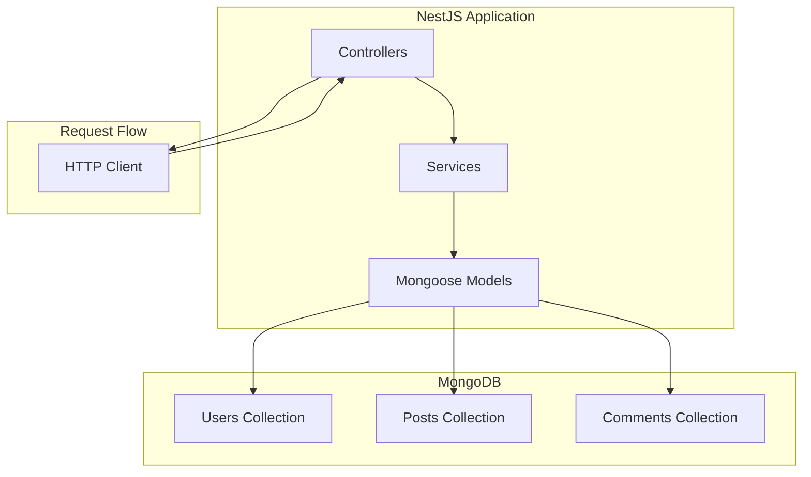
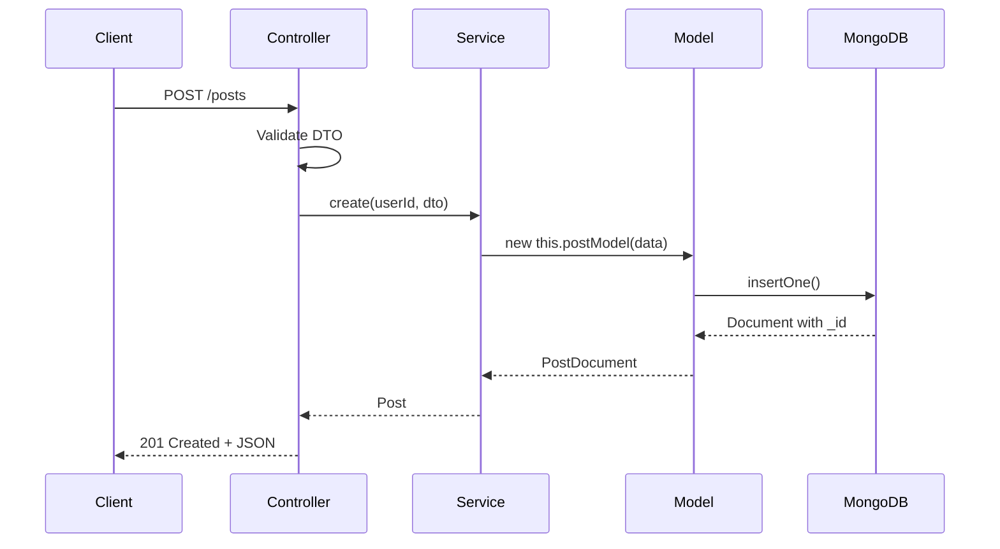

# How to Use MongoDB with NestJS

Author: [nawazdhandala](https://github.com/nawazdhandala)

Tags: NestJS, MongoDB, Database, Node.js

Description: A comprehensive guide to integrating MongoDB with NestJS using Mongoose, covering schemas, services, validation, aggregation pipelines, and production best practices.

---

MongoDB and NestJS make a powerful combination for building scalable Node.js applications. MongoDB's flexible document model pairs nicely with NestJS's modular architecture and dependency injection system. This guide walks you through everything from basic setup to advanced patterns you will use in production.

## Why MongoDB with NestJS?

Before diving into code, here is why this combination works well:

- **Schema flexibility**: MongoDB documents can evolve without rigid migrations
- **Native JavaScript/TypeScript support**: Documents map naturally to objects
- **Scalability**: MongoDB handles horizontal scaling through sharding
- **Rich query language**: Powerful aggregation pipelines for complex data operations
- **NestJS integration**: First-class Mongoose support with decorators

## Architecture Overview

Here is how the components fit together in a typical NestJS MongoDB application:



## Installation and Setup

Start by installing the required packages. NestJS provides official Mongoose integration through `@nestjs/mongoose`.

```bash
npm install @nestjs/mongoose mongoose
```

For TypeScript support with better type definitions, also install the types:

```bash
npm install -D @types/mongoose
```

### Basic Configuration

Configure MongoDB in your root module. The `forRoot` method establishes the database connection that gets shared across your application.

```typescript
// app.module.ts
import { Module } from '@nestjs/common';
import { MongooseModule } from '@nestjs/mongoose';

@Module({
  imports: [
    // Basic connection - suitable for development
    MongooseModule.forRoot('mongodb://localhost:27017/myapp'),
  ],
})
export class AppModule {}
```

### Production Configuration

For production applications, use environment variables and connection options for reliability.

```typescript
// app.module.ts
import { Module } from '@nestjs/common';
import { ConfigModule, ConfigService } from '@nestjs/config';
import { MongooseModule } from '@nestjs/mongoose';

@Module({
  imports: [
    ConfigModule.forRoot({ isGlobal: true }),
    MongooseModule.forRootAsync({
      inject: [ConfigService],
      useFactory: (config: ConfigService) => ({
        uri: config.get<string>('MONGODB_URI'),
        // Connection pool settings
        maxPoolSize: 10,
        minPoolSize: 5,
        // Timeouts
        serverSelectionTimeoutMS: 5000,
        socketTimeoutMS: 45000,
        // Write concern for data durability
        writeConcern: {
          w: 'majority',
          j: true,
        },
        // Read preference for replica sets
        readPreference: 'primaryPreferred',
        // Retry failed operations
        retryWrites: true,
        retryReads: true,
      }),
    }),
  ],
})
export class AppModule {}
```

### Connection Events

Monitor connection health by listening to Mongoose connection events:

```typescript
// database.module.ts
import { Module, OnModuleInit, Logger } from '@nestjs/common';
import { InjectConnection } from '@nestjs/mongoose';
import { Connection } from 'mongoose';

@Module({})
export class DatabaseModule implements OnModuleInit {
  private readonly logger = new Logger(DatabaseModule.name);

  constructor(@InjectConnection() private connection: Connection) {}

  onModuleInit() {
    this.connection.on('connected', () => {
      this.logger.log('MongoDB connected successfully');
    });

    this.connection.on('error', (error) => {
      this.logger.error('MongoDB connection error:', error);
    });

    this.connection.on('disconnected', () => {
      this.logger.warn('MongoDB disconnected');
    });

    // Graceful shutdown
    process.on('SIGINT', async () => {
      await this.connection.close();
      this.logger.log('MongoDB connection closed due to app termination');
      process.exit(0);
    });
  }
}
```

## Defining Schemas

Mongoose schemas define the structure of your documents. NestJS provides decorators that make schema definitions clean and type-safe.

### Basic Schema Definition

```typescript
// schemas/user.schema.ts
import { Prop, Schema, SchemaFactory } from '@nestjs/mongoose';
import { Document, Types } from 'mongoose';

// Combine the schema class with Mongoose Document for type safety
export type UserDocument = User & Document;

@Schema({
  // Collection name (defaults to lowercase plural of class name)
  collection: 'users',
  // Automatically add createdAt and updatedAt fields
  timestamps: true,
  // Include virtuals when converting to JSON
  toJSON: { virtuals: true },
  toObject: { virtuals: true },
})
export class User {
  // MongoDB ObjectId is automatically added as _id
  _id: Types.ObjectId;

  @Prop({ required: true, trim: true, maxlength: 100 })
  name: string;

  @Prop({
    required: true,
    unique: true,
    lowercase: true,
    trim: true,
    match: /^[\w-\.]+@([\w-]+\.)+[\w-]{2,4}$/,
  })
  email: string;

  @Prop({ required: true, select: false, minlength: 8 })
  password: string;

  @Prop({ default: true })
  isActive: boolean;

  @Prop({ type: [String], default: ['user'] })
  roles: string[];

  @Prop({ type: Object, default: {} })
  preferences: Record<string, any>;

  // Timestamps are added automatically when timestamps: true
  createdAt: Date;
  updatedAt: Date;
}

// Create the schema from the class
export const UserSchema = SchemaFactory.createForClass(User);

// Add indexes after schema creation
UserSchema.index({ email: 1 }, { unique: true });
UserSchema.index({ createdAt: -1 });
UserSchema.index({ name: 'text', email: 'text' }); // Text search index
```

### Schema with References

MongoDB supports document references for relationships between collections:

```typescript
// schemas/post.schema.ts
import { Prop, Schema, SchemaFactory } from '@nestjs/mongoose';
import { Document, Types } from 'mongoose';
import { User } from './user.schema';

export type PostDocument = Post & Document;

@Schema({ timestamps: true })
export class Post {
  _id: Types.ObjectId;

  @Prop({ required: true, trim: true, maxlength: 200 })
  title: string;

  @Prop({ required: true })
  content: string;

  @Prop({ default: false })
  published: boolean;

  @Prop({ type: [String], default: [] })
  tags: string[];

  // Reference to User collection
  @Prop({ type: Types.ObjectId, ref: 'User', required: true })
  author: Types.ObjectId | User;

  // Embedded document for metadata
  @Prop({
    type: {
      views: { type: Number, default: 0 },
      likes: { type: Number, default: 0 },
      shares: { type: Number, default: 0 },
    },
    default: { views: 0, likes: 0, shares: 0 },
  })
  stats: {
    views: number;
    likes: number;
    shares: number;
  };

  createdAt: Date;
  updatedAt: Date;
}

export const PostSchema = SchemaFactory.createForClass(Post);

// Compound index for efficient queries
PostSchema.index({ author: 1, published: 1 });
PostSchema.index({ tags: 1 });
PostSchema.index({ createdAt: -1 });
```

### Embedded Documents

For data that belongs together, use embedded documents instead of references:

```typescript
// schemas/order.schema.ts
import { Prop, Schema, SchemaFactory } from '@nestjs/mongoose';
import { Document, Types } from 'mongoose';

// Embedded schema for order items
@Schema({ _id: false })
export class OrderItem {
  @Prop({ required: true })
  productId: string;

  @Prop({ required: true })
  name: string;

  @Prop({ required: true, min: 0 })
  price: number;

  @Prop({ required: true, min: 1 })
  quantity: number;
}

// Embedded schema for shipping address
@Schema({ _id: false })
export class Address {
  @Prop({ required: true })
  street: string;

  @Prop({ required: true })
  city: string;

  @Prop({ required: true })
  state: string;

  @Prop({ required: true })
  zipCode: string;

  @Prop({ required: true })
  country: string;
}

export type OrderDocument = Order & Document;

@Schema({ timestamps: true })
export class Order {
  _id: Types.ObjectId;

  @Prop({ type: Types.ObjectId, ref: 'User', required: true })
  customer: Types.ObjectId;

  // Array of embedded documents
  @Prop({ type: [OrderItem], required: true })
  items: OrderItem[];

  // Single embedded document
  @Prop({ type: Address, required: true })
  shippingAddress: Address;

  @Prop({
    type: String,
    enum: ['pending', 'processing', 'shipped', 'delivered', 'cancelled'],
    default: 'pending',
  })
  status: string;

  @Prop({ required: true, min: 0 })
  total: number;

  createdAt: Date;
  updatedAt: Date;
}

export const OrderSchema = SchemaFactory.createForClass(Order);
```

## Creating Services

Services contain your business logic and database operations. Inject the Mongoose model to interact with your collections.

### Basic CRUD Service

```typescript
// users/users.service.ts
import {
  Injectable,
  NotFoundException,
  ConflictException,
} from '@nestjs/common';
import { InjectModel } from '@nestjs/mongoose';
import { Model } from 'mongoose';
import * as bcrypt from 'bcrypt';
import { User, UserDocument } from './schemas/user.schema';
import { CreateUserDto, UpdateUserDto } from './dto';

@Injectable()
export class UsersService {
  constructor(
    @InjectModel(User.name) private userModel: Model<UserDocument>,
  ) {}

  async create(createUserDto: CreateUserDto): Promise<User> {
    // Check if email already exists
    const existingUser = await this.userModel.findOne({
      email: createUserDto.email,
    });
    if (existingUser) {
      throw new ConflictException('Email already registered');
    }

    // Hash password before saving
    const hashedPassword = await bcrypt.hash(createUserDto.password, 10);

    const user = new this.userModel({
      ...createUserDto,
      password: hashedPassword,
    });

    return user.save();
  }

  async findAll(page = 1, limit = 10): Promise<User[]> {
    const skip = (page - 1) * limit;

    return this.userModel
      .find({ isActive: true })
      .select('-password')
      .skip(skip)
      .limit(limit)
      .sort({ createdAt: -1 })
      .exec();
  }

  async findOne(id: string): Promise<User> {
    const user = await this.userModel
      .findById(id)
      .select('-password')
      .exec();

    if (!user) {
      throw new NotFoundException(`User with ID ${id} not found`);
    }

    return user;
  }

  async findByEmail(email: string): Promise<UserDocument | null> {
    return this.userModel
      .findOne({ email })
      .select('+password') // Include password for authentication
      .exec();
  }

  async update(id: string, updateUserDto: UpdateUserDto): Promise<User> {
    // If password is being updated, hash it
    if (updateUserDto.password) {
      updateUserDto.password = await bcrypt.hash(updateUserDto.password, 10);
    }

    const user = await this.userModel
      .findByIdAndUpdate(id, updateUserDto, { new: true, runValidators: true })
      .select('-password')
      .exec();

    if (!user) {
      throw new NotFoundException(`User with ID ${id} not found`);
    }

    return user;
  }

  async remove(id: string): Promise<void> {
    const result = await this.userModel.deleteOne({ _id: id }).exec();

    if (result.deletedCount === 0) {
      throw new NotFoundException(`User with ID ${id} not found`);
    }
  }

  async softDelete(id: string): Promise<User> {
    const user = await this.userModel
      .findByIdAndUpdate(id, { isActive: false }, { new: true })
      .exec();

    if (!user) {
      throw new NotFoundException(`User with ID ${id} not found`);
    }

    return user;
  }
}
```

### Service with Relationships

Handle document references and population:

```typescript
// posts/posts.service.ts
import { Injectable, NotFoundException } from '@nestjs/common';
import { InjectModel } from '@nestjs/mongoose';
import { Model, Types } from 'mongoose';
import { Post, PostDocument } from './schemas/post.schema';
import { CreatePostDto, UpdatePostDto, PostQueryDto } from './dto';

@Injectable()
export class PostsService {
  constructor(
    @InjectModel(Post.name) private postModel: Model<PostDocument>,
  ) {}

  async create(authorId: string, createPostDto: CreatePostDto): Promise<Post> {
    const post = new this.postModel({
      ...createPostDto,
      author: new Types.ObjectId(authorId),
    });

    return post.save();
  }

  async findAll(query: PostQueryDto): Promise<{ posts: Post[]; total: number }> {
    const { page = 1, limit = 10, tag, published, search } = query;
    const skip = (page - 1) * limit;

    // Build filter object dynamically
    const filter: any = {};

    if (published !== undefined) {
      filter.published = published;
    }

    if (tag) {
      filter.tags = tag;
    }

    if (search) {
      filter.$text = { $search: search };
    }

    const [posts, total] = await Promise.all([
      this.postModel
        .find(filter)
        .populate('author', 'name email') // Populate author with specific fields
        .skip(skip)
        .limit(limit)
        .sort({ createdAt: -1 })
        .exec(),
      this.postModel.countDocuments(filter).exec(),
    ]);

    return { posts, total };
  }

  async findOne(id: string): Promise<Post> {
    const post = await this.postModel
      .findById(id)
      .populate('author', 'name email')
      .exec();

    if (!post) {
      throw new NotFoundException(`Post with ID ${id} not found`);
    }

    return post;
  }

  async findByAuthor(authorId: string): Promise<Post[]> {
    return this.postModel
      .find({ author: new Types.ObjectId(authorId) })
      .sort({ createdAt: -1 })
      .exec();
  }

  async update(id: string, updatePostDto: UpdatePostDto): Promise<Post> {
    const post = await this.postModel
      .findByIdAndUpdate(id, updatePostDto, { new: true, runValidators: true })
      .populate('author', 'name email')
      .exec();

    if (!post) {
      throw new NotFoundException(`Post with ID ${id} not found`);
    }

    return post;
  }

  async incrementViews(id: string): Promise<void> {
    await this.postModel
      .findByIdAndUpdate(id, { $inc: { 'stats.views': 1 } })
      .exec();
  }

  async addTag(id: string, tag: string): Promise<Post> {
    const post = await this.postModel
      .findByIdAndUpdate(
        id,
        { $addToSet: { tags: tag } }, // Prevents duplicates
        { new: true },
      )
      .exec();

    if (!post) {
      throw new NotFoundException(`Post with ID ${id} not found`);
    }

    return post;
  }

  async removeTag(id: string, tag: string): Promise<Post> {
    const post = await this.postModel
      .findByIdAndUpdate(id, { $pull: { tags: tag } }, { new: true })
      .exec();

    if (!post) {
      throw new NotFoundException(`Post with ID ${id} not found`);
    }

    return post;
  }

  async remove(id: string): Promise<void> {
    const result = await this.postModel.deleteOne({ _id: id }).exec();

    if (result.deletedCount === 0) {
      throw new NotFoundException(`Post with ID ${id} not found`);
    }
  }
}
```

## Module Setup

Register schemas in feature modules using `forFeature`:

```typescript
// users/users.module.ts
import { Module } from '@nestjs/common';
import { MongooseModule } from '@nestjs/mongoose';
import { User, UserSchema } from './schemas/user.schema';
import { UsersService } from './users.service';
import { UsersController } from './users.controller';

@Module({
  imports: [
    MongooseModule.forFeature([
      { name: User.name, schema: UserSchema },
    ]),
  ],
  providers: [UsersService],
  controllers: [UsersController],
  exports: [UsersService],
})
export class UsersModule {}
```

```typescript
// posts/posts.module.ts
import { Module } from '@nestjs/common';
import { MongooseModule } from '@nestjs/mongoose';
import { Post, PostSchema } from './schemas/post.schema';
import { PostsService } from './posts.service';
import { PostsController } from './posts.controller';

@Module({
  imports: [
    MongooseModule.forFeature([
      { name: Post.name, schema: PostSchema },
    ]),
  ],
  providers: [PostsService],
  controllers: [PostsController],
  exports: [PostsService],
})
export class PostsModule {}
```

## Aggregation Pipelines

MongoDB aggregation pipelines enable complex data transformations and analytics. Here is how to use them effectively:

```typescript
// analytics/analytics.service.ts
import { Injectable } from '@nestjs/common';
import { InjectModel } from '@nestjs/mongoose';
import { Model, PipelineStage } from 'mongoose';
import { Post, PostDocument } from '../posts/schemas/post.schema';
import { Order, OrderDocument } from '../orders/schemas/order.schema';

@Injectable()
export class AnalyticsService {
  constructor(
    @InjectModel(Post.name) private postModel: Model<PostDocument>,
    @InjectModel(Order.name) private orderModel: Model<OrderDocument>,
  ) {}

  // Get posts grouped by author with statistics
  async getPostStatsByAuthor(): Promise<any[]> {
    const pipeline: PipelineStage[] = [
      // Filter only published posts
      { $match: { published: true } },
      // Group by author
      {
        $group: {
          _id: '$author',
          totalPosts: { $sum: 1 },
          totalViews: { $sum: '$stats.views' },
          totalLikes: { $sum: '$stats.likes' },
          avgViews: { $avg: '$stats.views' },
          tags: { $push: '$tags' },
        },
      },
      // Flatten nested tags arrays
      {
        $addFields: {
          allTags: {
            $reduce: {
              input: '$tags',
              initialValue: [],
              in: { $setUnion: ['$$value', '$$this'] },
            },
          },
        },
      },
      // Populate author information
      {
        $lookup: {
          from: 'users',
          localField: '_id',
          foreignField: '_id',
          as: 'author',
        },
      },
      // Unwind author array to object
      { $unwind: '$author' },
      // Project final shape
      {
        $project: {
          _id: 0,
          authorId: '$_id',
          authorName: '$author.name',
          authorEmail: '$author.email',
          totalPosts: 1,
          totalViews: 1,
          totalLikes: 1,
          avgViews: { $round: ['$avgViews', 2] },
          uniqueTags: { $size: '$allTags' },
        },
      },
      // Sort by total views descending
      { $sort: { totalViews: -1 } },
    ];

    return this.postModel.aggregate(pipeline).exec();
  }

  // Get monthly revenue report
  async getMonthlyRevenue(year: number): Promise<any[]> {
    const pipeline: PipelineStage[] = [
      // Filter by year and exclude cancelled orders
      {
        $match: {
          createdAt: {
            $gte: new Date(`${year}-01-01`),
            $lt: new Date(`${year + 1}-01-01`),
          },
          status: { $ne: 'cancelled' },
        },
      },
      // Group by month
      {
        $group: {
          _id: { $month: '$createdAt' },
          totalOrders: { $sum: 1 },
          totalRevenue: { $sum: '$total' },
          avgOrderValue: { $avg: '$total' },
          itemsSold: { $sum: { $size: '$items' } },
        },
      },
      // Add month name for readability
      {
        $addFields: {
          month: {
            $arrayElemAt: [
              [
                '',
                'January',
                'February',
                'March',
                'April',
                'May',
                'June',
                'July',
                'August',
                'September',
                'October',
                'November',
                'December',
              ],
              '$_id',
            ],
          },
        },
      },
      // Project and format
      {
        $project: {
          _id: 0,
          monthNumber: '$_id',
          month: 1,
          totalOrders: 1,
          totalRevenue: { $round: ['$totalRevenue', 2] },
          avgOrderValue: { $round: ['$avgOrderValue', 2] },
          itemsSold: 1,
        },
      },
      { $sort: { monthNumber: 1 } },
    ];

    return this.orderModel.aggregate(pipeline).exec();
  }

  // Get top selling products
  async getTopProducts(limit = 10): Promise<any[]> {
    const pipeline: PipelineStage[] = [
      // Only delivered orders
      { $match: { status: 'delivered' } },
      // Unwind items array
      { $unwind: '$items' },
      // Group by product
      {
        $group: {
          _id: '$items.productId',
          productName: { $first: '$items.name' },
          totalQuantity: { $sum: '$items.quantity' },
          totalRevenue: {
            $sum: { $multiply: ['$items.price', '$items.quantity'] },
          },
          orderCount: { $sum: 1 },
        },
      },
      // Sort by quantity sold
      { $sort: { totalQuantity: -1 } },
      { $limit: limit },
      // Format output
      {
        $project: {
          _id: 0,
          productId: '$_id',
          productName: 1,
          totalQuantity: 1,
          totalRevenue: { $round: ['$totalRevenue', 2] },
          orderCount: 1,
        },
      },
    ];

    return this.orderModel.aggregate(pipeline).exec();
  }
}
```

## Data Flow Visualization

Here is how data flows through a typical request in a NestJS MongoDB application:



## Validation with DTOs

Use class-validator with DTOs for request validation:

```typescript
// dto/create-user.dto.ts
import {
  IsEmail,
  IsString,
  MinLength,
  MaxLength,
  IsOptional,
  IsArray,
  IsEnum,
} from 'class-validator';

export class CreateUserDto {
  @IsString()
  @MinLength(2)
  @MaxLength(100)
  name: string;

  @IsEmail()
  email: string;

  @IsString()
  @MinLength(8)
  @MaxLength(128)
  password: string;

  @IsOptional()
  @IsArray()
  @IsEnum(['user', 'admin', 'moderator'], { each: true })
  roles?: string[];
}
```

```typescript
// dto/update-user.dto.ts
import { PartialType } from '@nestjs/mapped-types';
import { CreateUserDto } from './create-user.dto';

export class UpdateUserDto extends PartialType(CreateUserDto) {}
```

```typescript
// dto/post-query.dto.ts
import { IsOptional, IsBoolean, IsString, IsInt, Min, Max } from 'class-validator';
import { Transform, Type } from 'class-transformer';

export class PostQueryDto {
  @IsOptional()
  @Type(() => Number)
  @IsInt()
  @Min(1)
  page?: number = 1;

  @IsOptional()
  @Type(() => Number)
  @IsInt()
  @Min(1)
  @Max(100)
  limit?: number = 10;

  @IsOptional()
  @IsString()
  tag?: string;

  @IsOptional()
  @Transform(({ value }) => value === 'true')
  @IsBoolean()
  published?: boolean;

  @IsOptional()
  @IsString()
  search?: string;
}
```

## Transactions

MongoDB supports multi-document transactions for operations that must succeed or fail together:

```typescript
// orders/orders.service.ts
import { Injectable, BadRequestException } from '@nestjs/common';
import { InjectModel, InjectConnection } from '@nestjs/mongoose';
import { Model, Connection, Types } from 'mongoose';
import { Order, OrderDocument } from './schemas/order.schema';
import { Product, ProductDocument } from '../products/schemas/product.schema';
import { CreateOrderDto } from './dto/create-order.dto';

@Injectable()
export class OrdersService {
  constructor(
    @InjectModel(Order.name) private orderModel: Model<OrderDocument>,
    @InjectModel(Product.name) private productModel: Model<ProductDocument>,
    @InjectConnection() private connection: Connection,
  ) {}

  async createOrder(
    customerId: string,
    createOrderDto: CreateOrderDto,
  ): Promise<Order> {
    // Start a session for the transaction
    const session = await this.connection.startSession();

    try {
      let order: Order;

      await session.withTransaction(async () => {
        // Validate and update product inventory
        for (const item of createOrderDto.items) {
          const product = await this.productModel
            .findById(item.productId)
            .session(session);

          if (!product) {
            throw new BadRequestException(
              `Product ${item.productId} not found`,
            );
          }

          if (product.stock < item.quantity) {
            throw new BadRequestException(
              `Insufficient stock for ${product.name}`,
            );
          }

          // Decrement stock
          await this.productModel
            .findByIdAndUpdate(
              item.productId,
              { $inc: { stock: -item.quantity } },
              { session },
            )
            .exec();
        }

        // Calculate total
        const total = createOrderDto.items.reduce(
          (sum, item) => sum + item.price * item.quantity,
          0,
        );

        // Create the order
        const [createdOrder] = await this.orderModel.create(
          [
            {
              customer: new Types.ObjectId(customerId),
              items: createOrderDto.items,
              shippingAddress: createOrderDto.shippingAddress,
              total,
              status: 'pending',
            },
          ],
          { session },
        );

        order = createdOrder;
      });

      return order;
    } finally {
      await session.endSession();
    }
  }

  async cancelOrder(orderId: string): Promise<Order> {
    const session = await this.connection.startSession();

    try {
      let order: Order;

      await session.withTransaction(async () => {
        // Find the order
        order = await this.orderModel.findById(orderId).session(session);

        if (!order) {
          throw new BadRequestException('Order not found');
        }

        if (order.status === 'cancelled') {
          throw new BadRequestException('Order already cancelled');
        }

        if (['shipped', 'delivered'].includes(order.status)) {
          throw new BadRequestException('Cannot cancel shipped/delivered order');
        }

        // Restore inventory
        for (const item of order.items) {
          await this.productModel
            .findByIdAndUpdate(
              item.productId,
              { $inc: { stock: item.quantity } },
              { session },
            )
            .exec();
        }

        // Update order status
        order = await this.orderModel
          .findByIdAndUpdate(
            orderId,
            { status: 'cancelled' },
            { new: true, session },
          )
          .exec();
      });

      return order;
    } finally {
      await session.endSession();
    }
  }
}
```

## Middleware and Hooks

Add custom logic that runs before or after document operations:

```typescript
// schemas/user.schema.ts
import { Prop, Schema, SchemaFactory } from '@nestjs/mongoose';
import * as bcrypt from 'bcrypt';

@Schema({ timestamps: true })
export class User {
  @Prop({ required: true })
  email: string;

  @Prop({ required: true })
  password: string;

  @Prop()
  passwordChangedAt: Date;
}

export const UserSchema = SchemaFactory.createForClass(User);

// Pre-save middleware to hash password
UserSchema.pre('save', async function (next) {
  // Only hash if password is modified
  if (!this.isModified('password')) {
    return next();
  }

  this.password = await bcrypt.hash(this.password, 10);
  this.passwordChangedAt = new Date();
  next();
});

// Instance method to compare passwords
UserSchema.methods.comparePassword = async function (
  candidatePassword: string,
): Promise<boolean> {
  return bcrypt.compare(candidatePassword, this.password);
};

// Static method to find active users
UserSchema.statics.findActive = function () {
  return this.find({ isActive: true });
};

// Virtual for full name
UserSchema.virtual('displayName').get(function () {
  return `${this.firstName} ${this.lastName}`;
});
```

## Indexing Strategies

Proper indexing is critical for MongoDB performance:

```typescript
// schemas/post.schema.ts
import { Prop, Schema, SchemaFactory } from '@nestjs/mongoose';

@Schema({ timestamps: true })
export class Post {
  @Prop({ required: true })
  title: string;

  @Prop({ required: true })
  content: string;

  @Prop({ type: Types.ObjectId, ref: 'User', required: true })
  author: Types.ObjectId;

  @Prop({ default: false })
  published: boolean;

  @Prop({ type: [String], default: [] })
  tags: string[];
}

export const PostSchema = SchemaFactory.createForClass(Post);

// Single field indexes
PostSchema.index({ author: 1 });
PostSchema.index({ createdAt: -1 });

// Compound index for common queries
PostSchema.index({ author: 1, published: 1, createdAt: -1 });

// Text index for search
PostSchema.index({ title: 'text', content: 'text' });

// TTL index for auto-expiring documents (e.g., sessions)
// PostSchema.index({ expiresAt: 1 }, { expireAfterSeconds: 0 });

// Partial index for filtered queries
PostSchema.index(
  { tags: 1 },
  { partialFilterExpression: { published: true } },
);
```

## Best Practices

### 1. Connection Management

```typescript
// Always configure connection pools for production
MongooseModule.forRoot(uri, {
  maxPoolSize: 10,         // Maximum connections in pool
  minPoolSize: 5,          // Minimum connections maintained
  maxIdleTimeMS: 30000,    // Close idle connections after 30s
  serverSelectionTimeoutMS: 5000,
});
```

### 2. Error Handling

```typescript
// Create a filter to handle MongoDB errors consistently
import { Catch, ExceptionFilter, ArgumentsHost } from '@nestjs/common';
import { MongoError } from 'mongodb';

@Catch(MongoError)
export class MongoExceptionFilter implements ExceptionFilter {
  catch(exception: MongoError, host: ArgumentsHost) {
    const ctx = host.switchToHttp();
    const response = ctx.getResponse();

    let status = 500;
    let message = 'Database error';

    // Handle duplicate key error
    if (exception.code === 11000) {
      status = 409;
      message = 'Duplicate entry';
    }

    response.status(status).json({
      statusCode: status,
      message,
      error: process.env.NODE_ENV === 'development' ? exception.message : undefined,
    });
  }
}
```

### 3. Lean Queries for Read Operations

```typescript
// Use lean() for read-only queries to skip Mongoose document overhead
async findAll(): Promise<User[]> {
  return this.userModel
    .find({ isActive: true })
    .select('-password')
    .lean()  // Returns plain objects, not Mongoose documents
    .exec();
}
```

### 4. Bulk Operations

```typescript
// Use bulk operations for batch updates
async bulkUpdateStatus(userIds: string[], status: boolean): Promise<void> {
  await this.userModel.bulkWrite(
    userIds.map((id) => ({
      updateOne: {
        filter: { _id: new Types.ObjectId(id) },
        update: { $set: { isActive: status } },
      },
    })),
  );
}
```

### 5. Query Timeouts

```typescript
// Set timeouts on long-running queries
const results = await this.postModel
  .find({ published: true })
  .maxTimeMS(5000)  // Timeout after 5 seconds
  .exec();
```

## Testing

Write unit tests for your services with mocked models:

```typescript
// users.service.spec.ts
import { Test, TestingModule } from '@nestjs/testing';
import { getModelToken } from '@nestjs/mongoose';
import { Model } from 'mongoose';
import { UsersService } from './users.service';
import { User, UserDocument } from './schemas/user.schema';

describe('UsersService', () => {
  let service: UsersService;
  let model: Model<UserDocument>;

  const mockUser = {
    _id: '507f1f77bcf86cd799439011',
    name: 'Test User',
    email: 'test@example.com',
    isActive: true,
  };

  const mockUserModel = {
    new: jest.fn().mockResolvedValue(mockUser),
    constructor: jest.fn().mockResolvedValue(mockUser),
    find: jest.fn(),
    findOne: jest.fn(),
    findById: jest.fn(),
    findByIdAndUpdate: jest.fn(),
    deleteOne: jest.fn(),
    create: jest.fn(),
    exec: jest.fn(),
  };

  beforeEach(async () => {
    const module: TestingModule = await Test.createTestingModule({
      providers: [
        UsersService,
        {
          provide: getModelToken(User.name),
          useValue: mockUserModel,
        },
      ],
    }).compile();

    service = module.get<UsersService>(UsersService);
    model = module.get<Model<UserDocument>>(getModelToken(User.name));
  });

  it('should find all active users', async () => {
    jest.spyOn(model, 'find').mockReturnValue({
      select: jest.fn().mockReturnThis(),
      skip: jest.fn().mockReturnThis(),
      limit: jest.fn().mockReturnThis(),
      sort: jest.fn().mockReturnThis(),
      exec: jest.fn().mockResolvedValue([mockUser]),
    } as any);

    const users = await service.findAll();
    expect(users).toEqual([mockUser]);
    expect(model.find).toHaveBeenCalledWith({ isActive: true });
  });
});
```

## Summary

| Concept | Key Points |
|---------|------------|
| **Schemas** | Use decorators, define indexes, add hooks for lifecycle events |
| **Services** | Inject models, handle errors, use lean() for read operations |
| **Relationships** | Use `@Prop({ ref: 'Model' })` with `populate()` for references |
| **Aggregations** | Build pipelines for complex queries and analytics |
| **Transactions** | Use sessions for multi-document operations |
| **Performance** | Create proper indexes, use connection pools, set query timeouts |

MongoDB with NestJS gives you a flexible and powerful stack for building modern applications. The decorator-based schema definitions feel natural in TypeScript, and NestJS's dependency injection makes your code testable and maintainable. Start with simple CRUD operations, then gradually add aggregation pipelines and transactions as your application grows in complexity.
