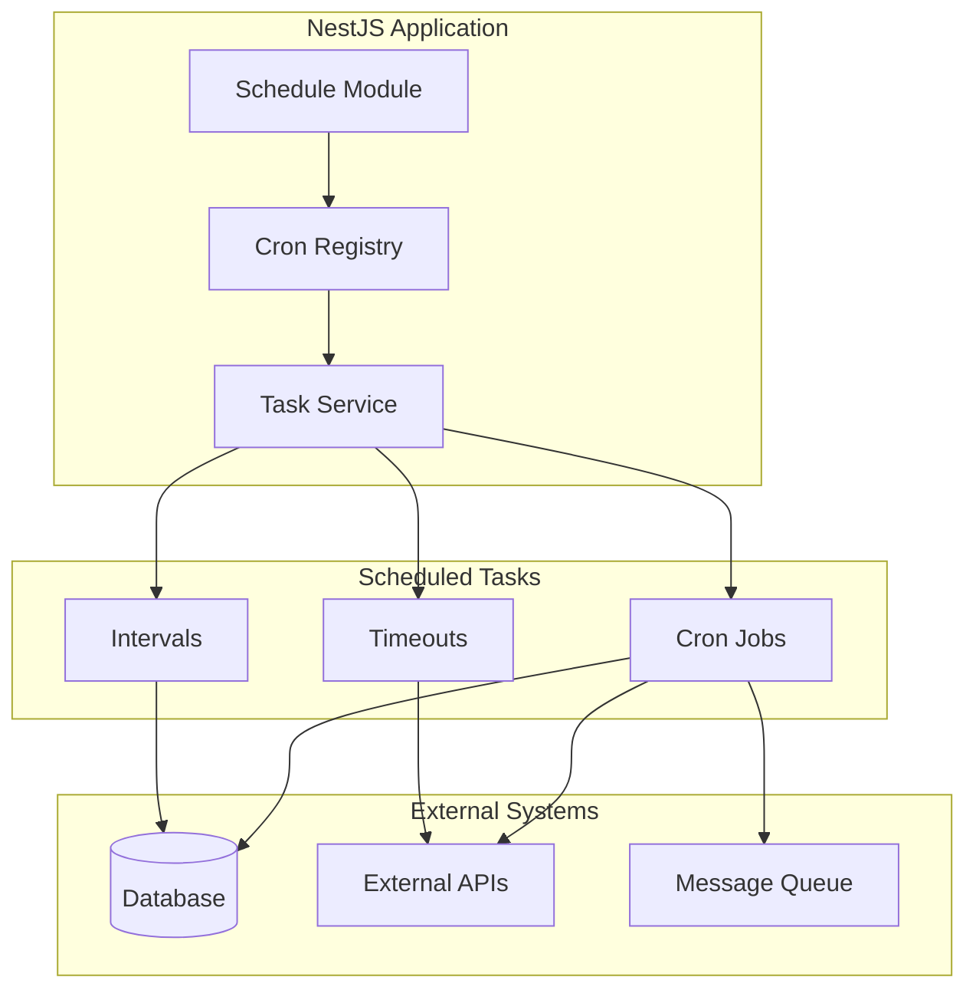
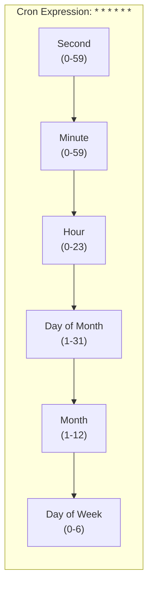

# How to Implement Task Scheduling in NestJS

Author: [nawazdhandala](https://github.com/nawazdhandala)

Tags: NestJS, Task Scheduling, Cron Jobs, Node.js, TypeScript, Backend, Automation

Description: Learn how to implement task scheduling in NestJS applications using the built-in scheduler module. This guide covers cron jobs, intervals, timeouts, dynamic scheduling, and production best practices.

---

Task scheduling is essential for running background operations like sending emails, cleaning up data, generating reports, or synchronizing with external services. NestJS provides a powerful scheduling module built on top of the popular `node-cron` library that integrates seamlessly with the NestJS ecosystem.

## Architecture Overview

The following diagram shows how task scheduling fits into a NestJS application architecture:



## Installation

Install the required packages for task scheduling in NestJS.

```bash
npm install @nestjs/schedule
npm install --save-dev @types/cron
```

## Basic Setup

Import and configure the ScheduleModule in your application's root module. This enables the scheduling decorators throughout your application.

```typescript
// app.module.ts
import { Module } from '@nestjs/common';
import { ScheduleModule } from '@nestjs/schedule';
import { TasksModule } from './tasks/tasks.module';

@Module({
  imports: [
    // Initialize the scheduling module - this is required for any scheduled tasks
    ScheduleModule.forRoot(),
    TasksModule,
  ],
})
export class AppModule {}
```

## Cron Jobs

Cron jobs run at specific times or intervals defined by cron expressions. NestJS provides the `@Cron()` decorator to define these scheduled tasks.

### Understanding Cron Expressions

The cron expression format follows the standard pattern with six fields:



### Creating a Basic Cron Job

Create a service with scheduled tasks using the `@Cron()` decorator. The decorator accepts a cron expression that determines when the task runs.

```typescript
// tasks/tasks.service.ts
import { Injectable, Logger } from '@nestjs/common';
import { Cron, CronExpression } from '@nestjs/schedule';

@Injectable()
export class TasksService {
  private readonly logger = new Logger(TasksService.name);

  // Run every day at midnight (00:00:00)
  // The CronExpression enum provides common patterns for readability
  @Cron(CronExpression.EVERY_DAY_AT_MIDNIGHT)
  handleDailyCleanup() {
    this.logger.log('Running daily cleanup task');
    // Cleanup logic here
  }

  // Run every hour at minute 0
  @Cron(CronExpression.EVERY_HOUR)
  handleHourlyReport() {
    this.logger.log('Generating hourly report');
    // Report generation logic here
  }

  // Custom cron expression: Run at 9:30 AM every Monday through Friday
  // Format: second minute hour day-of-month month day-of-week
  @Cron('0 30 9 * * 1-5')
  handleWeekdayMorningTask() {
    this.logger.log('Running weekday morning task');
    // Task logic here
  }
}
```

### Common Cron Expressions

NestJS provides built-in expressions for frequently used schedules through the `CronExpression` enum.

```typescript
import { Cron, CronExpression } from '@nestjs/schedule';

@Injectable()
export class TasksService {
  // Every 5 seconds - useful for near-real-time processing
  @Cron(CronExpression.EVERY_5_SECONDS)
  handleFrequentTask() {}

  // Every 30 minutes - good for moderate frequency tasks
  @Cron(CronExpression.EVERY_30_MINUTES)
  handleModerateTask() {}

  // First day of every month at midnight - ideal for monthly reports
  @Cron(CronExpression.EVERY_1ST_DAY_OF_MONTH_AT_MIDNIGHT)
  handleMonthlyTask() {}

  // Custom: Every weekday at 6 PM - for end-of-business-day tasks
  @Cron('0 0 18 * * 1-5', {
    name: 'weekday-evening-task',
    timeZone: 'America/New_York',
  })
  handleWeekdayEvening() {}
}
```

## Intervals

Intervals run tasks repeatedly at fixed time intervals. They are simpler than cron jobs and useful for tasks that need to run at regular intervals regardless of the clock time.

```typescript
import { Injectable, Logger } from '@nestjs/common';
import { Interval } from '@nestjs/schedule';

@Injectable()
export class HealthCheckService {
  private readonly logger = new Logger(HealthCheckService.name);

  // Run every 30 seconds (30000 milliseconds)
  // Intervals start immediately when the application boots
  @Interval(30000)
  async checkExternalServices() {
    this.logger.log('Checking external service health');

    try {
      // Check database connection
      await this.checkDatabase();

      // Check external API availability
      await this.checkExternalApi();

      this.logger.log('All services healthy');
    } catch (error) {
      this.logger.error('Service health check failed', error.stack);
    }
  }

  // Named interval for easier management and debugging
  @Interval('cache-refresh', 60000)
  async refreshCache() {
    this.logger.log('Refreshing application cache');
    // Cache refresh logic
  }

  private async checkDatabase(): Promise<void> {
    // Database health check implementation
  }

  private async checkExternalApi(): Promise<void> {
    // External API health check implementation
  }
}
```

## Timeouts

Timeouts run a task once after a specified delay. They are useful for delayed one-time operations that should execute after the application starts.

```typescript
import { Injectable, Logger } from '@nestjs/common';
import { Timeout } from '@nestjs/schedule';

@Injectable()
export class StartupService {
  private readonly logger = new Logger(StartupService.name);

  // Run once, 5 seconds after application startup
  // Useful for initialization tasks that should not block app startup
  @Timeout(5000)
  async handleStartupTask() {
    this.logger.log('Running delayed startup initialization');

    // Warm up caches
    await this.warmUpCaches();

    // Load configuration from external source
    await this.loadExternalConfig();

    this.logger.log('Startup initialization complete');
  }

  // Named timeout for identification in logs and debugging
  @Timeout('database-warmup', 10000)
  async warmUpDatabase() {
    this.logger.log('Warming up database connections');
    // Pre-establish database connections
  }

  private async warmUpCaches(): Promise<void> {
    // Cache warming implementation
  }

  private async loadExternalConfig(): Promise<void> {
    // External configuration loading
  }
}
```

## Dynamic Task Scheduling

Sometimes you need to create, modify, or delete scheduled tasks at runtime. NestJS provides the `SchedulerRegistry` for dynamic task management.

```typescript
import { Injectable, Logger } from '@nestjs/common';
import { SchedulerRegistry } from '@nestjs/schedule';
import { CronJob } from 'cron';

@Injectable()
export class DynamicTaskService {
  private readonly logger = new Logger(DynamicTaskService.name);

  constructor(private schedulerRegistry: SchedulerRegistry) {}

  // Add a new cron job dynamically at runtime
  // This is useful when task schedules are stored in a database or configured by users
  addCronJob(name: string, cronExpression: string, callback: () => void) {
    const job = new CronJob(cronExpression, () => {
      this.logger.log(`Executing dynamic cron job: ${name}`);
      callback();
    });

    this.schedulerRegistry.addCronJob(name, job);
    job.start();

    this.logger.log(`Dynamic cron job "${name}" added with expression: ${cronExpression}`);
  }

  // Remove a cron job by name
  deleteCronJob(name: string) {
    this.schedulerRegistry.deleteCronJob(name);
    this.logger.log(`Cron job "${name}" deleted`);
  }

  // Get all registered cron jobs for monitoring or debugging
  getCronJobs(): Map<string, CronJob> {
    return this.schedulerRegistry.getCronJobs();
  }

  // Pause a specific cron job without deleting it
  stopCronJob(name: string) {
    const job = this.schedulerRegistry.getCronJob(name);
    job.stop();
    this.logger.log(`Cron job "${name}" stopped`);
  }

  // Resume a paused cron job
  startCronJob(name: string) {
    const job = this.schedulerRegistry.getCronJob(name);
    job.start();
    this.logger.log(`Cron job "${name}" started`);
  }

  // Add a dynamic interval
  addInterval(name: string, milliseconds: number, callback: () => void) {
    const intervalId = setInterval(() => {
      this.logger.log(`Executing dynamic interval: ${name}`);
      callback();
    }, milliseconds);

    this.schedulerRegistry.addInterval(name, intervalId);
    this.logger.log(`Dynamic interval "${name}" added with ${milliseconds}ms period`);
  }

  // Remove a dynamic interval
  deleteInterval(name: string) {
    this.schedulerRegistry.deleteInterval(name);
    this.logger.log(`Interval "${name}" deleted`);
  }

  // Add a dynamic timeout
  addTimeout(name: string, milliseconds: number, callback: () => void) {
    const timeoutId = setTimeout(() => {
      this.logger.log(`Executing dynamic timeout: ${name}`);
      callback();
    }, milliseconds);

    this.schedulerRegistry.addTimeout(name, timeoutId);
    this.logger.log(`Dynamic timeout "${name}" added with ${milliseconds}ms delay`);
  }

  // Remove a dynamic timeout before it executes
  deleteTimeout(name: string) {
    this.schedulerRegistry.deleteTimeout(name);
    this.logger.log(`Timeout "${name}" deleted`);
  }
}
```

### Using Dynamic Scheduling from a Controller

Expose dynamic scheduling capabilities through an API for administrative control.

```typescript
// tasks/tasks.controller.ts
import { Controller, Post, Delete, Get, Body, Param } from '@nestjs/common';
import { DynamicTaskService } from './dynamic-task.service';

class CreateTaskDto {
  name: string;
  cronExpression: string;
  taskType: string;
}

@Controller('tasks')
export class TasksController {
  constructor(private readonly dynamicTaskService: DynamicTaskService) {}

  @Post()
  createTask(@Body() createTaskDto: CreateTaskDto) {
    // In a real application, you would map taskType to actual task logic
    this.dynamicTaskService.addCronJob(
      createTaskDto.name,
      createTaskDto.cronExpression,
      () => console.log(`Executing task: ${createTaskDto.name}`),
    );

    return { message: `Task ${createTaskDto.name} created` };
  }

  @Delete(':name')
  deleteTask(@Param('name') name: string) {
    this.dynamicTaskService.deleteCronJob(name);
    return { message: `Task ${name} deleted` };
  }

  @Get()
  listTasks() {
    const jobs = this.dynamicTaskService.getCronJobs();
    const taskList = [];

    jobs.forEach((job, name) => {
      taskList.push({
        name,
        running: job.running,
        nextDate: job.nextDate()?.toISO(),
      });
    });

    return taskList;
  }
}
```

## Handling Async Tasks

Many scheduled tasks involve asynchronous operations. Ensure proper error handling and logging for async tasks.

```typescript
import { Injectable, Logger } from '@nestjs/common';
import { Cron, CronExpression } from '@nestjs/schedule';

@Injectable()
export class AsyncTaskService {
  private readonly logger = new Logger(AsyncTaskService.name);
  private isRunning = false;

  // Async task with proper error handling and mutex to prevent overlapping executions
  @Cron(CronExpression.EVERY_MINUTE)
  async handleAsyncTask() {
    // Prevent overlapping executions if the previous run is still in progress
    if (this.isRunning) {
      this.logger.warn('Previous task execution still in progress, skipping');
      return;
    }

    this.isRunning = true;
    const startTime = Date.now();

    try {
      this.logger.log('Starting async task');

      // Simulate async operations
      await this.fetchDataFromExternalApi();
      await this.processData();
      await this.saveResults();

      const duration = Date.now() - startTime;
      this.logger.log(`Async task completed in ${duration}ms`);
    } catch (error) {
      this.logger.error('Async task failed', error.stack);

      // Optionally send alert or notification
      await this.notifyOnFailure(error);
    } finally {
      this.isRunning = false;
    }
  }

  private async fetchDataFromExternalApi(): Promise<void> {
    // External API call implementation
  }

  private async processData(): Promise<void> {
    // Data processing implementation
  }

  private async saveResults(): Promise<void> {
    // Save results to database
  }

  private async notifyOnFailure(error: Error): Promise<void> {
    // Send notification about task failure
  }
}
```

## Task Scheduling with Database-Driven Configuration

Store task configurations in a database for flexible runtime management.

```typescript
// entities/scheduled-task.entity.ts
import { Entity, Column, PrimaryGeneratedColumn } from 'typeorm';

@Entity('scheduled_tasks')
export class ScheduledTask {
  @PrimaryGeneratedColumn('uuid')
  id: string;

  @Column()
  name: string;

  @Column()
  cronExpression: string;

  @Column()
  taskType: string;

  @Column({ default: true })
  isActive: boolean;

  @Column({ type: 'jsonb', nullable: true })
  metadata: Record<string, any>;

  @Column({ type: 'timestamp', nullable: true })
  lastRun: Date;

  @Column({ type: 'timestamp', nullable: true })
  nextRun: Date;
}
```

```typescript
// tasks/database-task.service.ts
import { Injectable, OnModuleInit, Logger } from '@nestjs/common';
import { InjectRepository } from '@nestjs/typeorm';
import { Repository } from 'typeorm';
import { SchedulerRegistry } from '@nestjs/schedule';
import { CronJob } from 'cron';
import { ScheduledTask } from '../entities/scheduled-task.entity';

@Injectable()
export class DatabaseTaskService implements OnModuleInit {
  private readonly logger = new Logger(DatabaseTaskService.name);

  constructor(
    @InjectRepository(ScheduledTask)
    private taskRepository: Repository<ScheduledTask>,
    private schedulerRegistry: SchedulerRegistry,
  ) {}

  // Load all active tasks from database when module initializes
  async onModuleInit() {
    await this.loadTasksFromDatabase();
  }

  private async loadTasksFromDatabase() {
    const tasks = await this.taskRepository.find({ where: { isActive: true } });

    for (const task of tasks) {
      this.registerTask(task);
    }

    this.logger.log(`Loaded ${tasks.length} scheduled tasks from database`);
  }

  private registerTask(task: ScheduledTask) {
    const job = new CronJob(task.cronExpression, async () => {
      await this.executeTask(task);
    });

    this.schedulerRegistry.addCronJob(task.name, job);
    job.start();

    this.logger.log(`Registered task: ${task.name} with schedule: ${task.cronExpression}`);
  }

  private async executeTask(task: ScheduledTask) {
    this.logger.log(`Executing task: ${task.name}`);

    try {
      // Route to appropriate handler based on task type
      switch (task.taskType) {
        case 'EMAIL_REPORT':
          await this.sendEmailReport(task.metadata);
          break;
        case 'DATA_CLEANUP':
          await this.cleanupData(task.metadata);
          break;
        case 'SYNC_EXTERNAL':
          await this.syncExternalData(task.metadata);
          break;
        default:
          this.logger.warn(`Unknown task type: ${task.taskType}`);
      }

      // Update last run timestamp
      await this.taskRepository.update(task.id, { lastRun: new Date() });
    } catch (error) {
      this.logger.error(`Task ${task.name} failed: ${error.message}`);
    }
  }

  // Methods to create, update, and delete tasks at runtime
  async createTask(taskData: Partial<ScheduledTask>): Promise<ScheduledTask> {
    const task = this.taskRepository.create(taskData);
    await this.taskRepository.save(task);

    if (task.isActive) {
      this.registerTask(task);
    }

    return task;
  }

  async updateTask(id: string, updates: Partial<ScheduledTask>): Promise<void> {
    const task = await this.taskRepository.findOneBy({ id });

    if (!task) {
      throw new Error('Task not found');
    }

    // Remove existing job if it exists
    try {
      this.schedulerRegistry.deleteCronJob(task.name);
    } catch (e) {
      // Job might not exist
    }

    // Update in database
    await this.taskRepository.update(id, updates);

    // Re-register if active
    const updatedTask = await this.taskRepository.findOneBy({ id });
    if (updatedTask.isActive) {
      this.registerTask(updatedTask);
    }
  }

  async deleteTask(id: string): Promise<void> {
    const task = await this.taskRepository.findOneBy({ id });

    if (task) {
      try {
        this.schedulerRegistry.deleteCronJob(task.name);
      } catch (e) {
        // Job might not exist
      }

      await this.taskRepository.delete(id);
    }
  }

  private async sendEmailReport(metadata: Record<string, any>): Promise<void> {
    // Email report implementation
  }

  private async cleanupData(metadata: Record<string, any>): Promise<void> {
    // Data cleanup implementation
  }

  private async syncExternalData(metadata: Record<string, any>): Promise<void> {
    // External data sync implementation
  }
}
```

## Distributed Task Scheduling

When running multiple instances of your application, you need to ensure tasks run only once across all instances. Use a distributed lock mechanism.

```typescript
import { Injectable, Logger } from '@nestjs/common';
import { Cron, CronExpression } from '@nestjs/schedule';
import { InjectRedis } from '@nestjs-modules/ioredis';
import Redis from 'ioredis';

@Injectable()
export class DistributedTaskService {
  private readonly logger = new Logger(DistributedTaskService.name);
  private readonly lockPrefix = 'task-lock:';
  private readonly lockTtl = 60; // Lock expires after 60 seconds

  constructor(@InjectRedis() private readonly redis: Redis) {}

  @Cron(CronExpression.EVERY_MINUTE)
  async handleDistributedTask() {
    const taskName = 'distributed-cleanup';
    const lockKey = `${this.lockPrefix}${taskName}`;

    // Try to acquire lock using Redis SET with NX (only set if not exists)
    const lockAcquired = await this.redis.set(
      lockKey,
      process.pid.toString(),
      'EX',
      this.lockTtl,
      'NX',
    );

    if (!lockAcquired) {
      this.logger.debug(`Task ${taskName} is already running on another instance`);
      return;
    }

    try {
      this.logger.log(`Acquired lock for ${taskName}, executing task`);
      await this.performCleanup();
    } finally {
      // Release the lock after task completion
      await this.redis.del(lockKey);
      this.logger.log(`Released lock for ${taskName}`);
    }
  }

  // Generic method for running distributed tasks
  async runWithLock<T>(
    taskName: string,
    ttlSeconds: number,
    task: () => Promise<T>,
  ): Promise<T | null> {
    const lockKey = `${this.lockPrefix}${taskName}`;

    const lockAcquired = await this.redis.set(
      lockKey,
      process.pid.toString(),
      'EX',
      ttlSeconds,
      'NX',
    );

    if (!lockAcquired) {
      return null;
    }

    try {
      return await task();
    } finally {
      await this.redis.del(lockKey);
    }
  }

  private async performCleanup(): Promise<void> {
    // Cleanup logic that should only run on one instance
  }
}
```

## Testing Scheduled Tasks

Write unit tests for your scheduled tasks to ensure they work correctly.

```typescript
// tasks/tasks.service.spec.ts
import { Test, TestingModule } from '@nestjs/testing';
import { TasksService } from './tasks.service';
import { SchedulerRegistry } from '@nestjs/schedule';

describe('TasksService', () => {
  let service: TasksService;
  let schedulerRegistry: SchedulerRegistry;

  beforeEach(async () => {
    const module: TestingModule = await Test.createTestingModule({
      providers: [
        TasksService,
        {
          provide: SchedulerRegistry,
          useValue: {
            addCronJob: jest.fn(),
            deleteCronJob: jest.fn(),
            getCronJobs: jest.fn().mockReturnValue(new Map()),
          },
        },
      ],
    }).compile();

    service = module.get<TasksService>(TasksService);
    schedulerRegistry = module.get<SchedulerRegistry>(SchedulerRegistry);
  });

  it('should be defined', () => {
    expect(service).toBeDefined();
  });

  describe('handleDailyCleanup', () => {
    it('should execute cleanup logic without errors', async () => {
      // Mock any dependencies
      const logSpy = jest.spyOn(service['logger'], 'log');

      // Execute the task
      service.handleDailyCleanup();

      // Verify the task ran
      expect(logSpy).toHaveBeenCalledWith('Running daily cleanup task');
    });
  });

  describe('handleAsyncTask', () => {
    it('should handle errors gracefully', async () => {
      // Mock a failure
      jest.spyOn(service as any, 'fetchDataFromExternalApi')
        .mockRejectedValue(new Error('API Error'));

      const errorSpy = jest.spyOn(service['logger'], 'error');

      await service.handleAsyncTask();

      expect(errorSpy).toHaveBeenCalled();
    });

    it('should prevent overlapping executions', async () => {
      // Set the running flag
      (service as any).isRunning = true;

      const warnSpy = jest.spyOn(service['logger'], 'warn');

      await service.handleAsyncTask();

      expect(warnSpy).toHaveBeenCalledWith(
        'Previous task execution still in progress, skipping',
      );
    });
  });
});
```

## Production Best Practices

### Task Monitoring and Observability

Track task execution metrics for production monitoring.

```typescript
import { Injectable, Logger } from '@nestjs/common';
import { Cron, CronExpression } from '@nestjs/schedule';
import { InjectMetric } from '@willsoto/nestjs-prometheus';
import { Counter, Histogram } from 'prom-client';

@Injectable()
export class MonitoredTaskService {
  private readonly logger = new Logger(MonitoredTaskService.name);

  constructor(
    @InjectMetric('task_executions_total')
    private readonly taskExecutions: Counter<string>,
    @InjectMetric('task_duration_seconds')
    private readonly taskDuration: Histogram<string>,
  ) {}

  @Cron(CronExpression.EVERY_HOUR)
  async handleMonitoredTask() {
    const taskName = 'hourly_report';
    const endTimer = this.taskDuration.startTimer({ task: taskName });

    try {
      await this.generateReport();

      this.taskExecutions.inc({ task: taskName, status: 'success' });
      this.logger.log(`Task ${taskName} completed successfully`);
    } catch (error) {
      this.taskExecutions.inc({ task: taskName, status: 'failure' });
      this.logger.error(`Task ${taskName} failed: ${error.message}`);
      throw error;
    } finally {
      endTimer();
    }
  }

  private async generateReport(): Promise<void> {
    // Report generation logic
  }
}
```

### Graceful Shutdown

Ensure tasks complete properly during application shutdown.

```typescript
import { Injectable, OnModuleDestroy, Logger } from '@nestjs/common';
import { SchedulerRegistry } from '@nestjs/schedule';

@Injectable()
export class TaskShutdownService implements OnModuleDestroy {
  private readonly logger = new Logger(TaskShutdownService.name);
  private runningTasks = new Set<string>();

  constructor(private schedulerRegistry: SchedulerRegistry) {}

  // Track when a task starts
  startTask(taskName: string) {
    this.runningTasks.add(taskName);
  }

  // Track when a task completes
  endTask(taskName: string) {
    this.runningTasks.delete(taskName);
  }

  async onModuleDestroy() {
    this.logger.log('Shutting down scheduled tasks...');

    // Stop all cron jobs from starting new executions
    const cronJobs = this.schedulerRegistry.getCronJobs();
    cronJobs.forEach((job, name) => {
      job.stop();
      this.logger.log(`Stopped cron job: ${name}`);
    });

    // Wait for running tasks to complete (with timeout)
    const maxWait = 30000; // 30 seconds
    const startWait = Date.now();

    while (this.runningTasks.size > 0 && Date.now() - startWait < maxWait) {
      this.logger.log(`Waiting for ${this.runningTasks.size} tasks to complete...`);
      await new Promise((resolve) => setTimeout(resolve, 1000));
    }

    if (this.runningTasks.size > 0) {
      this.logger.warn(
        `Shutdown timeout reached. ${this.runningTasks.size} tasks still running.`,
      );
    } else {
      this.logger.log('All scheduled tasks completed gracefully');
    }
  }
}
```

## Summary

| Feature | Decorator/Method | Use Case |
|---------|------------------|----------|
| **Cron Jobs** | `@Cron()` | Time-based scheduling (daily, hourly, specific times) |
| **Intervals** | `@Interval()` | Fixed-interval recurring tasks |
| **Timeouts** | `@Timeout()` | One-time delayed execution |
| **Dynamic Tasks** | `SchedulerRegistry` | Runtime task management |
| **Distributed Locking** | Redis/Database locks | Multi-instance deployments |

Task scheduling in NestJS provides a robust foundation for background job processing. Whether you need simple cron jobs or complex distributed task management, the scheduling module offers the flexibility to handle various use cases while maintaining clean, testable code.

---

Monitoring your scheduled tasks is critical for ensuring they run reliably in production. **[OneUptime](https://oneuptime.com)** provides comprehensive monitoring for your NestJS applications, including cron job monitoring, alerting when tasks fail, and detailed execution metrics. Set up heartbeat monitors to track your scheduled tasks and get notified immediately when something goes wrong. Start monitoring your task scheduling today with OneUptime's free tier.
