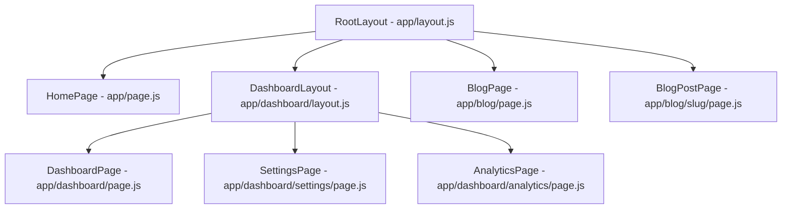

# How to Use Next.js App Router

Author: [nawazdhandala](https://www.github.com/nawazdhandala)

Tags: Next.js, React, App Router, SSR, JavaScript

Description: A practical guide to building modern web applications with the Next.js App Router, covering file-based routing, layouts, server components, and data fetching patterns.

---

> The App Router is the new standard for building Next.js applications. It brings React Server Components, nested layouts, and a more intuitive file-based routing system. If you're starting a new project or migrating from the Pages Router, this guide will get you up to speed.

The App Router was introduced in Next.js 13 and became stable in version 13.4. It represents a fundamental shift in how we build React applications, moving much of the rendering to the server by default.

---

## App Router vs Pages Router

| Feature | App Router | Pages Router |
|---------|-----------|--------------|
| **Routing** | Folder-based with `page.js` | File-based with `pages/` |
| **Default Rendering** | Server Components | Client Components |
| **Layouts** | Nested, preserved on navigation | Per-page, remount on navigation |
| **Data Fetching** | `async/await` in components | `getServerSideProps`, `getStaticProps` |
| **Loading States** | Built-in with `loading.js` | Manual implementation |
| **Error Handling** | Built-in with `error.js` | Custom `_error.js` |

---

## Project Structure

The App Router lives in the `app` directory. Here's a typical project structure:

```
my-app/
  app/
    layout.js        # Root layout (required)
    page.js          # Home page (/)
    globals.css      # Global styles
    dashboard/
      layout.js      # Dashboard layout
      page.js        # Dashboard page (/dashboard)
      settings/
        page.js      # Settings page (/dashboard/settings)
    blog/
      page.js        # Blog index (/blog)
      [slug]/
        page.js      # Dynamic blog post (/blog/my-post)
    api/
      users/
        route.js     # API route (/api/users)
```

The routing is straightforward - folders become URL segments, and `page.js` files make those segments accessible.

---

## Creating Your First Route

Every route needs a `page.js` (or `page.tsx` for TypeScript) file. This is the component that renders when someone visits that URL.

The root layout wraps all pages and must include the `html` and `body` tags:

```jsx
// app/layout.js
// Root layout - required for every Next.js app
// This wraps all pages and persists across navigation

export const metadata = {
  title: 'My App',
  description: 'Built with Next.js App Router',
};

export default function RootLayout({ children }) {
  return (
    <html lang="en">
      <body>
        {/* Navigation, providers, etc. go here */}
        <nav>
          <a href="/">Home</a>
          <a href="/dashboard">Dashboard</a>
        </nav>
        <main>{children}</main>
      </body>
    </html>
  );
}
```

The home page is a simple Server Component by default:

```jsx
// app/page.js
// Home page - renders at the root URL (/)
// This is a Server Component by default

export default function HomePage() {
  return (
    <div>
      <h1>Welcome to My App</h1>
      <p>This page is rendered on the server.</p>
    </div>
  );
}
```

---

## Nested Routes and Layouts

One of the best features of the App Router is nested layouts. Each folder can have its own layout that wraps its children.

```jsx
// app/dashboard/layout.js
// Dashboard layout - wraps all pages under /dashboard
// This layout persists when navigating between dashboard pages

export default function DashboardLayout({ children }) {
  return (
    <div className="dashboard">
      <aside className="sidebar">
        <nav>
          <a href="/dashboard">Overview</a>
          <a href="/dashboard/analytics">Analytics</a>
          <a href="/dashboard/settings">Settings</a>
        </nav>
      </aside>
      <section className="content">
        {children}
      </section>
    </div>
  );
}
```

```jsx
// app/dashboard/page.js
// Dashboard home page - renders at /dashboard

export default function DashboardPage() {
  return (
    <div>
      <h1>Dashboard Overview</h1>
      <p>Welcome back!</p>
    </div>
  );
}
```

```jsx
// app/dashboard/settings/page.js
// Settings page - renders at /dashboard/settings
// Inherits the dashboard layout automatically

export default function SettingsPage() {
  return (
    <div>
      <h1>Settings</h1>
      <form>
        <label>
          Email notifications
          <input type="checkbox" name="notifications" />
        </label>
      </form>
    </div>
  );
}
```

When you navigate from `/dashboard` to `/dashboard/settings`, the sidebar layout stays mounted. Only the content area updates. This is a big improvement over the Pages Router.

---

## Route Flow

Here's how the routing hierarchy works:



---

## Dynamic Routes

Use square brackets to create dynamic route segments. The parameter is passed to your component.

```jsx
// app/blog/[slug]/page.js
// Dynamic route - matches /blog/any-slug
// The slug parameter comes from the URL

export default function BlogPost({ params }) {
  // params.slug contains the URL segment
  return (
    <article>
      <h1>Blog Post: {params.slug}</h1>
    </article>
  );
}
```

For catch-all routes that match multiple segments, use `[...slug]`:

```jsx
// app/docs/[...slug]/page.js
// Catch-all route - matches /docs/a, /docs/a/b, /docs/a/b/c, etc.
// params.slug is an array of segments

export default function DocsPage({ params }) {
  // /docs/api/auth/tokens -> params.slug = ['api', 'auth', 'tokens']
  const path = params.slug.join('/');

  return (
    <div>
      <h1>Documentation: {path}</h1>
    </div>
  );
}
```

---

## Server Components vs Client Components

By default, all components in the App Router are Server Components. They run on the server and send HTML to the client.

Server Components are great for data fetching and they can be async:

```jsx
// app/users/page.js
// Server Component - fetches data on the server
// No need for useEffect or loading states here

async function getUsers() {
  const res = await fetch('https://api.example.com/users', {
    // Cache for 1 hour
    next: { revalidate: 3600 }
  });
  return res.json();
}

export default async function UsersPage() {
  // This runs on the server - the fetch never hits the client
  const users = await getUsers();

  return (
    <div>
      <h1>Users</h1>
      <ul>
        {users.map(user => (
          <li key={user.id}>{user.name}</li>
        ))}
      </ul>
    </div>
  );
}
```

When you need interactivity (state, effects, event handlers), add the `'use client'` directive:

```jsx
// app/components/Counter.js
// Client Component - runs in the browser
// Required for useState, useEffect, onClick, etc.
'use client';

import { useState } from 'react';

export default function Counter() {
  const [count, setCount] = useState(0);

  return (
    <div>
      <p>Count: {count}</p>
      <button onClick={() => setCount(count + 1)}>
        Increment
      </button>
    </div>
  );
}
```

You can mix Server and Client Components. Import Client Components into Server Components:

```jsx
// app/dashboard/page.js
// Server Component that includes a Client Component

import Counter from '../components/Counter';

async function getStats() {
  const res = await fetch('https://api.example.com/stats');
  return res.json();
}

export default async function DashboardPage() {
  const stats = await getStats();

  return (
    <div>
      <h1>Dashboard</h1>
      <p>Total users: {stats.userCount}</p>

      {/* Client Component for interactivity */}
      <Counter />
    </div>
  );
}
```

---

## Data Fetching Patterns

The App Router simplifies data fetching. You can fetch data directly in Server Components.

Fetch data in page components:

```jsx
// app/products/page.js
// Fetching data at the page level
// Next.js automatically deduplicates identical requests

async function getProducts() {
  const res = await fetch('https://api.example.com/products', {
    cache: 'force-cache' // Default - cache indefinitely
  });

  if (!res.ok) {
    throw new Error('Failed to fetch products');
  }

  return res.json();
}

export default async function ProductsPage() {
  const products = await getProducts();

  return (
    <div>
      <h1>Products</h1>
      <div className="grid">
        {products.map(product => (
          <div key={product.id} className="card">
            <h2>{product.name}</h2>
            <p>${product.price}</p>
          </div>
        ))}
      </div>
    </div>
  );
}
```

Different caching strategies give you control over freshness:

```jsx
// app/lib/data.js
// Different caching strategies for different data types

// Static data - cached forever (good for rarely changing content)
export async function getCategories() {
  const res = await fetch('https://api.example.com/categories', {
    cache: 'force-cache'
  });
  return res.json();
}

// Revalidate every hour (good for semi-static content)
export async function getFeaturedProducts() {
  const res = await fetch('https://api.example.com/featured', {
    next: { revalidate: 3600 }
  });
  return res.json();
}

// Always fresh (good for user-specific or real-time data)
export async function getUserProfile(userId) {
  const res = await fetch(`https://api.example.com/users/${userId}`, {
    cache: 'no-store'
  });
  return res.json();
}

// Tag-based revalidation (good for on-demand updates)
export async function getProduct(id) {
  const res = await fetch(`https://api.example.com/products/${id}`, {
    next: { tags: ['products', `product-${id}`] }
  });
  return res.json();
}
```

---

## Loading and Error States

The App Router has built-in support for loading and error states through special files.

The loading UI shows while page content is fetching:

```jsx
// app/dashboard/loading.js
// Loading UI - shown while the page is loading
// This creates an automatic Suspense boundary

export default function DashboardLoading() {
  return (
    <div className="loading">
      <div className="spinner"></div>
      <p>Loading dashboard...</p>
    </div>
  );
}
```

Error boundaries catch errors and display a fallback:

```jsx
// app/dashboard/error.js
// Error boundary - catches errors in the dashboard route
// Must be a Client Component
'use client';

export default function DashboardError({ error, reset }) {
  return (
    <div className="error">
      <h2>Something went wrong!</h2>
      <p>{error.message}</p>
      <button onClick={() => reset()}>
        Try again
      </button>
    </div>
  );
}
```

For 404 pages, use `not-found.js`:

```jsx
// app/blog/[slug]/not-found.js
// Not found UI - shown when notFound() is called

export default function BlogNotFound() {
  return (
    <div>
      <h2>Post Not Found</h2>
      <p>The blog post you're looking for doesn't exist.</p>
      <a href="/blog">Back to Blog</a>
    </div>
  );
}
```

```jsx
// app/blog/[slug]/page.js
// Triggering the not-found page

import { notFound } from 'next/navigation';

async function getPost(slug) {
  const res = await fetch(`https://api.example.com/posts/${slug}`);
  if (!res.ok) return null;
  return res.json();
}

export default async function BlogPost({ params }) {
  const post = await getPost(params.slug);

  // This triggers the not-found.js UI
  if (!post) {
    notFound();
  }

  return (
    <article>
      <h1>{post.title}</h1>
      <div dangerouslySetInnerHTML={{ __html: post.content }} />
    </article>
  );
}
```

---

## Route Handlers (API Routes)

Create API endpoints using `route.js` files. These replace the old `pages/api` pattern.

```jsx
// app/api/users/route.js
// API route handlers - replaces pages/api
// Export functions for each HTTP method you want to handle

import { NextResponse } from 'next/server';

// In-memory store for demo - use a real database in production
let users = [
  { id: 1, name: 'Alice', email: 'alice@example.com' },
  { id: 2, name: 'Bob', email: 'bob@example.com' },
];

// GET /api/users - list all users
export async function GET(request) {
  // Access query params if needed
  const { searchParams } = new URL(request.url);
  const limit = searchParams.get('limit');

  const result = limit ? users.slice(0, parseInt(limit)) : users;

  return NextResponse.json(result);
}

// POST /api/users - create a new user
export async function POST(request) {
  const body = await request.json();

  // Validate input
  if (!body.name || !body.email) {
    return NextResponse.json(
      { error: 'Name and email are required' },
      { status: 400 }
    );
  }

  const newUser = {
    id: users.length + 1,
    name: body.name,
    email: body.email,
  };

  users.push(newUser);

  return NextResponse.json(newUser, { status: 201 });
}
```

For dynamic API routes with parameters:

```jsx
// app/api/users/[id]/route.js
// Dynamic API route - matches /api/users/1, /api/users/2, etc.

import { NextResponse } from 'next/server';

// GET /api/users/:id - get a single user
export async function GET(request, { params }) {
  const id = parseInt(params.id);

  // Fetch from database
  const user = await getUserById(id);

  if (!user) {
    return NextResponse.json(
      { error: 'User not found' },
      { status: 404 }
    );
  }

  return NextResponse.json(user);
}

// PUT /api/users/:id - update a user
export async function PUT(request, { params }) {
  const id = parseInt(params.id);
  const body = await request.json();

  const updated = await updateUser(id, body);

  if (!updated) {
    return NextResponse.json(
      { error: 'User not found' },
      { status: 404 }
    );
  }

  return NextResponse.json(updated);
}

// DELETE /api/users/:id - delete a user
export async function DELETE(request, { params }) {
  const id = parseInt(params.id);

  const deleted = await deleteUser(id);

  if (!deleted) {
    return NextResponse.json(
      { error: 'User not found' },
      { status: 404 }
    );
  }

  return NextResponse.json({ success: true });
}
```

---

## Metadata and SEO

Define metadata for each page using the `metadata` export or `generateMetadata` function.

Static metadata for simple pages:

```jsx
// app/about/page.js
// Static metadata - use when values are known at build time

export const metadata = {
  title: 'About Us',
  description: 'Learn more about our company and team.',
  openGraph: {
    title: 'About Us',
    description: 'Learn more about our company and team.',
    images: ['/images/about-og.jpg'],
  },
};

export default function AboutPage() {
  return (
    <div>
      <h1>About Us</h1>
      <p>We build great software.</p>
    </div>
  );
}
```

Dynamic metadata for pages with data:

```jsx
// app/blog/[slug]/page.js
// Dynamic metadata - generated based on the page content

export async function generateMetadata({ params }) {
  const post = await getPost(params.slug);

  if (!post) {
    return {
      title: 'Post Not Found',
    };
  }

  return {
    title: post.title,
    description: post.excerpt,
    openGraph: {
      title: post.title,
      description: post.excerpt,
      images: [post.coverImage],
      type: 'article',
      publishedTime: post.publishedAt,
      authors: [post.author.name],
    },
    twitter: {
      card: 'summary_large_image',
      title: post.title,
      description: post.excerpt,
      images: [post.coverImage],
    },
  };
}

export default async function BlogPost({ params }) {
  const post = await getPost(params.slug);
  // ... render post
}
```

---

## Server Actions

Server Actions let you run server-side code directly from Client Components. They're great for form submissions.

```jsx
// app/contact/page.js
// Server Actions for form handling
// No need for separate API routes

async function submitContact(formData) {
  'use server';

  const name = formData.get('name');
  const email = formData.get('email');
  const message = formData.get('message');

  // Validate
  if (!name || !email || !message) {
    return { error: 'All fields are required' };
  }

  // Save to database
  await db.contacts.create({
    data: { name, email, message }
  });

  // Send notification
  await sendEmail({
    to: 'team@example.com',
    subject: 'New contact form submission',
    body: `From: ${name} (${email})\n\n${message}`
  });

  return { success: true };
}

export default function ContactPage() {
  return (
    <div>
      <h1>Contact Us</h1>
      <form action={submitContact}>
        <div>
          <label htmlFor="name">Name</label>
          <input type="text" id="name" name="name" required />
        </div>
        <div>
          <label htmlFor="email">Email</label>
          <input type="email" id="email" name="email" required />
        </div>
        <div>
          <label htmlFor="message">Message</label>
          <textarea id="message" name="message" required></textarea>
        </div>
        <button type="submit">Send Message</button>
      </form>
    </div>
  );
}
```

For more complex forms with loading states:

```jsx
// app/components/ContactForm.js
// Client Component with Server Action
'use client';

import { useFormStatus, useFormState } from 'react-dom';
import { submitContact } from '../actions';

function SubmitButton() {
  const { pending } = useFormStatus();

  return (
    <button type="submit" disabled={pending}>
      {pending ? 'Sending...' : 'Send Message'}
    </button>
  );
}

export default function ContactForm() {
  const [state, formAction] = useFormState(submitContact, null);

  return (
    <form action={formAction}>
      {state?.error && (
        <div className="error">{state.error}</div>
      )}
      {state?.success && (
        <div className="success">Message sent successfully!</div>
      )}

      <input type="text" name="name" placeholder="Name" required />
      <input type="email" name="email" placeholder="Email" required />
      <textarea name="message" placeholder="Message" required></textarea>

      <SubmitButton />
    </form>
  );
}
```

---

## Middleware

Middleware runs before every request. Use it for authentication, redirects, or request modification.

```jsx
// middleware.js (in the root of your project)
// Middleware runs before every request
// Great for auth, redirects, and request modification

import { NextResponse } from 'next/server';

export function middleware(request) {
  const { pathname } = request.nextUrl;

  // Check for auth token
  const token = request.cookies.get('auth-token');

  // Protect dashboard routes
  if (pathname.startsWith('/dashboard')) {
    if (!token) {
      // Redirect to login
      const loginUrl = new URL('/login', request.url);
      loginUrl.searchParams.set('from', pathname);
      return NextResponse.redirect(loginUrl);
    }
  }

  // Redirect logged-in users away from login page
  if (pathname === '/login' && token) {
    return NextResponse.redirect(new URL('/dashboard', request.url));
  }

  // Add custom headers
  const response = NextResponse.next();
  response.headers.set('x-request-id', crypto.randomUUID());

  return response;
}

// Configure which paths middleware runs on
export const config = {
  matcher: [
    // Match all paths except static files and api routes
    '/((?!_next/static|_next/image|favicon.ico|api).*)',
  ],
};
```

---

## Parallel and Intercepting Routes

These advanced features enable complex UI patterns like modals and split views.

Parallel routes render multiple pages simultaneously:

```
app/
  @modal/
    (.)photo/[id]/
      page.js       # Intercepts /photo/[id] and renders in modal
  @sidebar/
    default.js      # Default sidebar content
    page.js         # Sidebar for dashboard
  layout.js         # Layout receives both slots
  page.js           # Main content
```

```jsx
// app/layout.js
// Layout with parallel routes (slots)

export default function Layout({ children, modal, sidebar }) {
  return (
    <div className="app">
      <aside>{sidebar}</aside>
      <main>{children}</main>
      {modal}
    </div>
  );
}
```

Intercepting routes show content in a different context (like a modal) while preserving the ability to navigate directly to the page:

```jsx
// app/@modal/(.)photo/[id]/page.js
// Intercepts /photo/[id] and shows it in a modal
// (.) means intercept from the same level

export default function PhotoModal({ params }) {
  return (
    <div className="modal-overlay">
      <div className="modal">
        
        <a href="/">Close</a>
      </div>
    </div>
  );
}
```

---

## Common Patterns

### Shared Components Across Routes

```jsx
// app/components/Header.js
// Shared header component

import Link from 'next/link';

export default function Header() {
  return (
    <header>
      <nav>
        <Link href="/">Home</Link>
        <Link href="/dashboard">Dashboard</Link>
        <Link href="/blog">Blog</Link>
      </nav>
    </header>
  );
}
```

### Authentication Context

```jsx
// app/providers.js
// Client-side providers wrapper
'use client';

import { SessionProvider } from 'next-auth/react';

export default function Providers({ children }) {
  return (
    <SessionProvider>
      {children}
    </SessionProvider>
  );
}
```

```jsx
// app/layout.js
// Wrap the app with providers

import Providers from './providers';

export default function RootLayout({ children }) {
  return (
    <html lang="en">
      <body>
        <Providers>
          {children}
        </Providers>
      </body>
    </html>
  );
}
```

---

## Migration Tips

If you're moving from the Pages Router:

1. **Start with new features** - Use App Router for new pages, keep existing pages in `pages/`
2. **Move layouts first** - Convert `_app.js` to `app/layout.js`
3. **Update data fetching** - Replace `getServerSideProps` with async Server Components
4. **Convert pages gradually** - Move one route at a time from `pages/` to `app/`
5. **Test thoroughly** - The rendering model is different, so test edge cases

---

## Conclusion

The Next.js App Router is a significant step forward for React development. Key takeaways:

- **Server Components by default** reduce client-side JavaScript
- **Nested layouts** persist across navigation for better UX
- **Built-in loading and error states** simplify common patterns
- **Simplified data fetching** with async components
- **Server Actions** eliminate boilerplate for form handling

The learning curve is worth it. Once you get comfortable with the new mental model, you'll find yourself writing less code and building faster applications.

---

*Building a Next.js application? [OneUptime](https://oneuptime.com) helps you monitor your frontend performance, track Core Web Vitals, and get alerted when your app goes down.*

