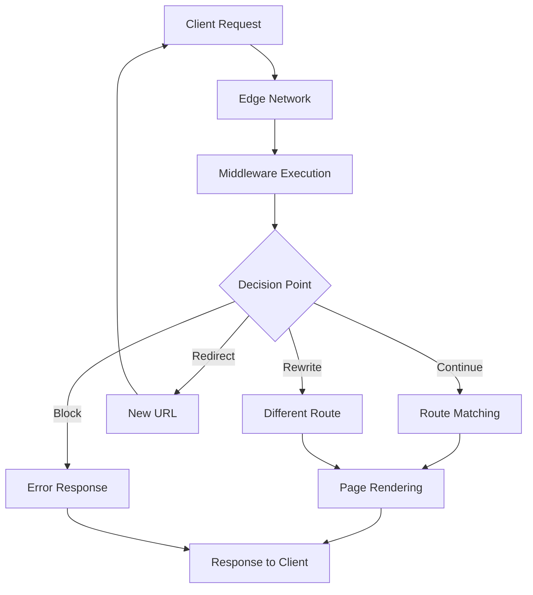
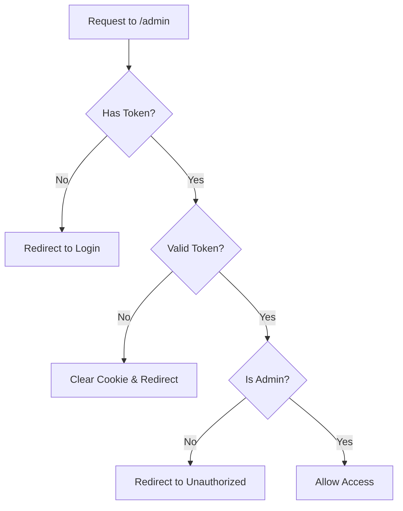
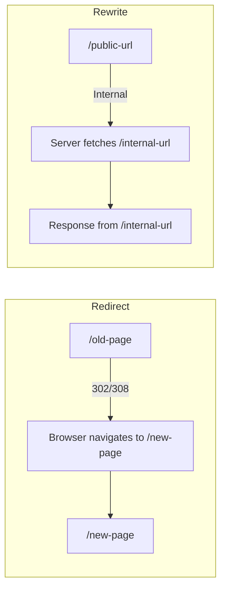
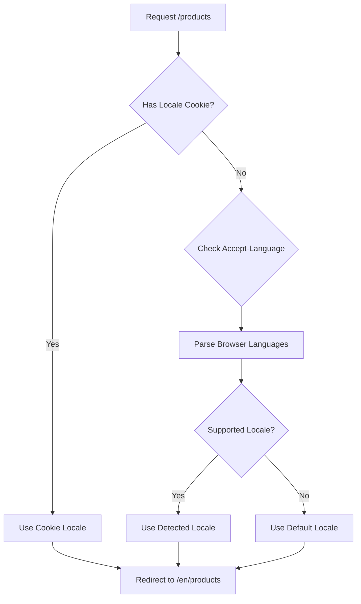

# How to Use Next.js Middleware

Author: [nawazdhandala](https://github.com/nawazdhandala)

Tags: Next.js, Middleware, React, Edge

Description: A comprehensive guide to using Next.js middleware for authentication, authorization, request modification, and edge computing with practical examples and best practices.

---

Next.js middleware is a powerful feature that allows you to run code before a request is completed. Running at the edge, middleware intercepts incoming requests and enables you to modify responses, redirect users, rewrite URLs, and add headers. This guide explores practical ways to use middleware effectively in your Next.js applications.

## Understanding Next.js Middleware

Middleware in Next.js executes before cached content and route matching. This makes it ideal for tasks that need to happen at the request level, such as authentication checks, logging, A/B testing, and geolocation-based routing.

### How Middleware Fits in the Request Lifecycle



## Creating Your First Middleware

Middleware is defined in a `middleware.ts` (or `middleware.js`) file at the root of your project, or inside the `src` directory if you use that structure.

The following code creates a basic middleware that logs every request and allows it to proceed to the intended route.

```typescript
// middleware.ts - Place this file at the root of your project
import { NextResponse } from 'next/server';
import type { NextRequest } from 'next/server';

// This function runs for every matched request
export function middleware(request: NextRequest) {
  // Log the request method and URL path for debugging
  const { pathname } = request.nextUrl;
  console.log(`Incoming request: ${request.method} ${pathname}`);

  // Return NextResponse.next() to continue to the route handler
  return NextResponse.next();
}

// Configure which paths should trigger this middleware
export const config = {
  // This pattern matches all routes except static files and images
  matcher: ['/((?!_next/static|_next/image|favicon.ico).*)'],
};
```

## The Matcher Configuration

The `matcher` configuration determines which routes trigger your middleware. Understanding matcher patterns helps you optimize performance by avoiding unnecessary middleware execution.

### Common Matcher Patterns

This code demonstrates several matcher patterns you can use depending on your application needs.

```typescript
// middleware.ts

// Pattern 1: Match a single path
export const config = {
  matcher: '/dashboard',
};

// Pattern 2: Match a path and all its children using :path*
export const config = {
  matcher: '/dashboard/:path*',
};

// Pattern 3: Match multiple specific paths
export const config = {
  matcher: ['/dashboard/:path*', '/admin/:path*', '/api/:path*'],
};

// Pattern 4: Exclude specific paths using negative lookahead regex
export const config = {
  matcher: [
    // Match everything except static files, images, and public assets
    '/((?!_next/static|_next/image|favicon.ico|public|assets).*)',
  ],
};

// Pattern 5: Match specific file extensions or API routes
export const config = {
  matcher: [
    '/api/:path*',
    '/((?!.*\\.).*)', // Exclude paths with file extensions
  ],
};
```

### Conditional Matching Inside Middleware

Sometimes you need more granular control than the matcher provides. You can add conditional logic inside the middleware function.

```typescript
// middleware.ts
import { NextResponse } from 'next/server';
import type { NextRequest } from 'next/server';

export function middleware(request: NextRequest) {
  const { pathname } = request.nextUrl;

  // Skip middleware for health check endpoints
  if (pathname === '/health' || pathname === '/ready') {
    return NextResponse.next();
  }

  // Skip middleware for webhook endpoints
  if (pathname.startsWith('/webhooks/')) {
    return NextResponse.next();
  }

  // Apply authentication logic for everything else
  return handleAuthentication(request);
}

function handleAuthentication(request: NextRequest) {
  const token = request.cookies.get('session')?.value;

  if (!token) {
    return NextResponse.redirect(new URL('/login', request.url));
  }

  return NextResponse.next();
}

export const config = {
  matcher: ['/((?!_next/static|_next/image|favicon.ico).*)'],
};
```

## Authentication and Authorization

One of the most common uses for middleware is protecting routes based on user authentication status.

### Basic Authentication Check

This middleware checks for an authentication token and redirects unauthenticated users to the login page.

```typescript
// middleware.ts
import { NextResponse } from 'next/server';
import type { NextRequest } from 'next/server';

// Define which routes require authentication
const protectedRoutes = ['/dashboard', '/profile', '/settings', '/orders'];

// Define routes that should redirect authenticated users (like login page)
const authRoutes = ['/login', '/register', '/forgot-password'];

export function middleware(request: NextRequest) {
  const { pathname } = request.nextUrl;

  // Get the authentication token from cookies
  const token = request.cookies.get('auth-token')?.value;
  const isAuthenticated = !!token;

  // Check if the current path is a protected route
  const isProtectedRoute = protectedRoutes.some(
    route => pathname === route || pathname.startsWith(`${route}/`)
  );

  // Check if the current path is an auth route (login, register, etc.)
  const isAuthRoute = authRoutes.some(
    route => pathname === route || pathname.startsWith(`${route}/`)
  );

  // Redirect unauthenticated users away from protected routes
  if (isProtectedRoute && !isAuthenticated) {
    const loginUrl = new URL('/login', request.url);
    // Save the original URL so we can redirect back after login
    loginUrl.searchParams.set('returnTo', pathname);
    return NextResponse.redirect(loginUrl);
  }

  // Redirect authenticated users away from auth routes
  if (isAuthRoute && isAuthenticated) {
    return NextResponse.redirect(new URL('/dashboard', request.url));
  }

  return NextResponse.next();
}

export const config = {
  matcher: ['/((?!_next/static|_next/image|favicon.ico|api).*)'],
};
```

### Role-Based Access Control

For applications with different user roles, middleware can enforce access control based on user permissions.



The following implementation demonstrates role-based access control with JWT verification.

```typescript
// middleware.ts
import { NextResponse } from 'next/server';
import type { NextRequest } from 'next/server';
import { jwtVerify } from 'jose';

// Secret key for JWT verification - should be stored in environment variables
const JWT_SECRET = new TextEncoder().encode(
  process.env.JWT_SECRET || 'your-secret-key-min-32-characters'
);

// Define role-based route permissions
const routePermissions: Record<string, string[]> = {
  '/admin': ['admin'],
  '/moderator': ['admin', 'moderator'],
  '/dashboard': ['admin', 'moderator', 'user'],
};

// Define the structure of your JWT payload
interface TokenPayload {
  userId: string;
  email: string;
  role: string;
  exp: number;
}

// Verify and decode the JWT token
async function verifyToken(token: string): Promise<TokenPayload | null> {
  try {
    const { payload } = await jwtVerify(token, JWT_SECRET);
    return payload as unknown as TokenPayload;
  } catch (error) {
    // Token is invalid or expired
    return null;
  }
}

// Check if a role has permission to access a route
function hasPermission(pathname: string, role: string): boolean {
  // Find the matching route pattern
  for (const [route, allowedRoles] of Object.entries(routePermissions)) {
    if (pathname === route || pathname.startsWith(`${route}/`)) {
      return allowedRoles.includes(role);
    }
  }
  // If no specific permission is defined, allow access
  return true;
}

export async function middleware(request: NextRequest) {
  const { pathname } = request.nextUrl;

  // Get token from cookie or Authorization header
  const cookieToken = request.cookies.get('auth-token')?.value;
  const headerToken = request.headers
    .get('Authorization')
    ?.replace('Bearer ', '');
  const token = cookieToken || headerToken;

  // Check if this route requires authentication
  const requiresAuth = Object.keys(routePermissions).some(
    route => pathname === route || pathname.startsWith(`${route}/`)
  );

  if (!requiresAuth) {
    return NextResponse.next();
  }

  // No token provided
  if (!token) {
    return NextResponse.redirect(new URL('/login', request.url));
  }

  // Verify the token
  const payload = await verifyToken(token);

  if (!payload) {
    // Invalid or expired token - clear the cookie and redirect
    const response = NextResponse.redirect(new URL('/login', request.url));
    response.cookies.delete('auth-token');
    return response;
  }

  // Check role-based permission
  if (!hasPermission(pathname, payload.role)) {
    return NextResponse.redirect(new URL('/unauthorized', request.url));
  }

  // Add user information to request headers for use in API routes or pages
  const requestHeaders = new Headers(request.headers);
  requestHeaders.set('x-user-id', payload.userId);
  requestHeaders.set('x-user-email', payload.email);
  requestHeaders.set('x-user-role', payload.role);

  return NextResponse.next({
    request: {
      headers: requestHeaders,
    },
  });
}

export const config = {
  matcher: ['/admin/:path*', '/moderator/:path*', '/dashboard/:path*'],
};
```

## Request and Response Modification

Middleware allows you to modify both incoming requests and outgoing responses by adding, changing, or removing headers.

### Adding Security Headers

Security headers protect your application from common web vulnerabilities. This middleware adds essential security headers to all responses.

```typescript
// middleware.ts
import { NextResponse } from 'next/server';
import type { NextRequest } from 'next/server';

export function middleware(request: NextRequest) {
  // Create a response that continues to the route
  const response = NextResponse.next();

  // Prevent clickjacking by disallowing iframe embedding
  response.headers.set('X-Frame-Options', 'DENY');

  // Prevent MIME type sniffing
  response.headers.set('X-Content-Type-Options', 'nosniff');

  // Control how much referrer information is sent
  response.headers.set('Referrer-Policy', 'strict-origin-when-cross-origin');

  // Restrict browser features and APIs
  response.headers.set(
    'Permissions-Policy',
    'camera=(), microphone=(), geolocation=(), interest-cohort=()'
  );

  // Enable XSS filtering in older browsers
  response.headers.set('X-XSS-Protection', '1; mode=block');

  // Add a unique request ID for tracing and debugging
  const requestId = crypto.randomUUID();
  response.headers.set('X-Request-Id', requestId);

  return response;
}

export const config = {
  matcher: ['/((?!_next/static|_next/image).*)'],
};
```

### Content Security Policy

For more advanced security, implement a Content Security Policy (CSP) header. This example shows how to build a CSP dynamically.

```typescript
// middleware.ts
import { NextResponse } from 'next/server';
import type { NextRequest } from 'next/server';

// Build the Content Security Policy directives
function buildCSP(): string {
  const directives = {
    'default-src': ["'self'"],
    'script-src': ["'self'", "'unsafe-inline'", "'unsafe-eval'"],
    'style-src': ["'self'", "'unsafe-inline'"],
    'img-src': ["'self'", 'data:', 'https:'],
    'font-src': ["'self'"],
    'connect-src': ["'self'", process.env.API_URL || ''],
    'frame-ancestors': ["'none'"],
    'form-action': ["'self'"],
    'base-uri': ["'self'"],
  };

  return Object.entries(directives)
    .map(([key, values]) => `${key} ${values.join(' ')}`)
    .join('; ');
}

export function middleware(request: NextRequest) {
  const response = NextResponse.next();

  // Add Content Security Policy header
  response.headers.set('Content-Security-Policy', buildCSP());

  return response;
}
```

### Modifying Request Headers

You can add information to request headers that will be available to your pages and API routes.

```typescript
// middleware.ts
import { NextResponse } from 'next/server';
import type { NextRequest } from 'next/server';

export function middleware(request: NextRequest) {
  // Create new headers based on the incoming request
  const requestHeaders = new Headers(request.headers);

  // Add the visitor's country (available on Vercel Edge)
  const country = request.geo?.country || 'Unknown';
  requestHeaders.set('x-visitor-country', country);

  // Add the visitor's city
  const city = request.geo?.city || 'Unknown';
  requestHeaders.set('x-visitor-city', city);

  // Add the client's IP address
  const ip = request.ip || request.headers.get('x-forwarded-for') || 'Unknown';
  requestHeaders.set('x-client-ip', ip);

  // Add a timestamp for request tracking
  requestHeaders.set('x-request-time', new Date().toISOString());

  // Continue to the route with the modified headers
  return NextResponse.next({
    request: {
      headers: requestHeaders,
    },
  });
}
```

## Redirects and Rewrites

Middleware provides powerful capabilities for redirecting users and rewriting URLs without the client knowing.

### Understanding the Difference



**Redirects** change the URL in the browser and send the user to a new location. **Rewrites** serve content from a different route while keeping the original URL visible.

### Implementing Redirects

This example shows common redirect patterns including legacy URL migration and domain normalization.

```typescript
// middleware.ts
import { NextResponse } from 'next/server';
import type { NextRequest } from 'next/server';

// Define redirect mappings for legacy URLs
const redirectMap: Record<string, { destination: string; permanent: boolean }> = {
  '/old-blog': { destination: '/blog', permanent: true },
  '/legacy-docs': { destination: '/documentation', permanent: true },
  '/about-us': { destination: '/about', permanent: true },
  '/contact-us': { destination: '/contact', permanent: false },
};

export function middleware(request: NextRequest) {
  const { pathname, host, protocol } = request.nextUrl;

  // Check for redirect mappings
  const redirect = redirectMap[pathname];
  if (redirect) {
    // Use 308 for permanent redirects (preserves HTTP method)
    // Use 307 for temporary redirects (preserves HTTP method)
    const statusCode = redirect.permanent ? 308 : 307;
    return NextResponse.redirect(
      new URL(redirect.destination, request.url),
      statusCode
    );
  }

  // Redirect www to non-www for domain normalization
  if (host?.startsWith('www.')) {
    const newHost = host.replace('www.', '');
    const newUrl = new URL(request.url);
    newUrl.host = newHost;
    return NextResponse.redirect(newUrl, 308);
  }

  // Force HTTPS in production
  const forwardedProto = request.headers.get('x-forwarded-proto');
  if (forwardedProto === 'http' && process.env.NODE_ENV === 'production') {
    const httpsUrl = new URL(request.url);
    httpsUrl.protocol = 'https:';
    return NextResponse.redirect(httpsUrl, 308);
  }

  return NextResponse.next();
}
```

### Implementing Rewrites

Rewrites are useful for API versioning, multi-tenant applications, and A/B testing.

```typescript
// middleware.ts
import { NextResponse } from 'next/server';
import type { NextRequest } from 'next/server';

export function middleware(request: NextRequest) {
  const { pathname } = request.nextUrl;
  const host = request.headers.get('host') || '';

  // API Versioning: Serve latest version when no version is specified
  // /api/users becomes /api/v2/users internally
  if (pathname.startsWith('/api/') && !pathname.match(/\/api\/v\d+\//)) {
    const newPath = pathname.replace('/api/', '/api/v2/');
    return NextResponse.rewrite(new URL(newPath, request.url));
  }

  // Multi-tenant routing based on subdomain
  // tenant1.example.com/dashboard becomes /tenants/tenant1/dashboard
  const subdomain = host.split('.')[0];
  const isSubdomain = !['www', 'app', 'localhost'].includes(subdomain);

  if (isSubdomain && !pathname.startsWith('/tenants/')) {
    const tenantPath = `/tenants/${subdomain}${pathname}`;
    return NextResponse.rewrite(new URL(tenantPath, request.url));
  }

  // A/B Testing: Show different page versions based on cookie
  const variant = request.cookies.get('experiment-pricing')?.value;
  if (pathname === '/pricing' && variant === 'variant-b') {
    return NextResponse.rewrite(new URL('/pricing-new', request.url));
  }

  return NextResponse.next();
}
```

## Internationalization (i18n)

Middleware is excellent for detecting user locale and routing to the appropriate language version.



This middleware detects the user's preferred language and redirects to the localized version of the page.

```typescript
// middleware.ts
import { NextResponse } from 'next/server';
import type { NextRequest } from 'next/server';

// Supported locales in your application
const locales = ['en', 'es', 'fr', 'de', 'ja', 'zh'];
const defaultLocale = 'en';

// Parse the Accept-Language header to find the best matching locale
function getPreferredLocale(request: NextRequest): string {
  // First check for a locale cookie (user preference)
  const cookieLocale = request.cookies.get('NEXT_LOCALE')?.value;
  if (cookieLocale && locales.includes(cookieLocale)) {
    return cookieLocale;
  }

  // Parse the Accept-Language header
  const acceptLanguage = request.headers.get('Accept-Language');
  if (!acceptLanguage) {
    return defaultLocale;
  }

  // Parse and sort languages by quality value (q parameter)
  const languages = acceptLanguage
    .split(',')
    .map(lang => {
      const [code, qValue] = lang.trim().split(';q=');
      return {
        code: code.split('-')[0].toLowerCase(), // Get the primary language code
        quality: qValue ? parseFloat(qValue) : 1.0,
      };
    })
    .sort((a, b) => b.quality - a.quality);

  // Find the first supported language
  for (const lang of languages) {
    if (locales.includes(lang.code)) {
      return lang.code;
    }
  }

  return defaultLocale;
}

// Check if the pathname already includes a locale prefix
function pathnameHasLocale(pathname: string): boolean {
  return locales.some(
    locale => pathname.startsWith(`/${locale}/`) || pathname === `/${locale}`
  );
}

export function middleware(request: NextRequest) {
  const { pathname, search } = request.nextUrl;

  // Skip locale detection for static files and API routes
  if (
    pathname.startsWith('/_next') ||
    pathname.startsWith('/api') ||
    pathname.includes('.') // Files with extensions
  ) {
    return NextResponse.next();
  }

  // Skip if the pathname already has a locale
  if (pathnameHasLocale(pathname)) {
    return NextResponse.next();
  }

  // Detect the preferred locale
  const locale = getPreferredLocale(request);

  // Build the localized URL
  const localizedPathname = `/${locale}${pathname}`;
  const newUrl = new URL(localizedPathname, request.url);
  newUrl.search = search; // Preserve query parameters

  // Redirect to the localized URL
  const response = NextResponse.redirect(newUrl);

  // Set a cookie to remember the locale preference
  response.cookies.set('NEXT_LOCALE', locale, {
    path: '/',
    maxAge: 60 * 60 * 24 * 365, // 1 year
    sameSite: 'lax',
  });

  return response;
}

export const config = {
  matcher: ['/((?!_next|api|favicon.ico|public).*)'],
};
```

## Rate Limiting

Protect your API endpoints from abuse by implementing rate limiting in middleware.

```typescript
// middleware.ts
import { NextResponse } from 'next/server';
import type { NextRequest } from 'next/server';

// Configuration for rate limiting
const RATE_LIMIT_WINDOW = 60 * 1000; // 1 minute in milliseconds
const MAX_REQUESTS = 100; // Maximum requests per window

// In-memory store for rate limiting (use Redis in production)
const rateLimitStore = new Map<string, { count: number; resetTime: number }>();

// Get a unique identifier for rate limiting (usually IP address)
function getClientIdentifier(request: NextRequest): string {
  // Try to get the real IP address
  const forwardedFor = request.headers.get('x-forwarded-for');
  const realIp = request.headers.get('x-real-ip');
  const ip = forwardedFor?.split(',')[0] || realIp || request.ip || 'unknown';

  // Optionally include the API key if present
  const apiKey = request.headers.get('x-api-key');

  return apiKey ? `api:${apiKey}` : `ip:${ip}`;
}

// Check and update rate limit for a client
function checkRateLimit(identifier: string): {
  allowed: boolean;
  remaining: number;
  resetTime: number;
} {
  const now = Date.now();
  const record = rateLimitStore.get(identifier);

  // Clean up old entries periodically
  if (rateLimitStore.size > 10000) {
    for (const [key, value] of rateLimitStore) {
      if (now > value.resetTime) {
        rateLimitStore.delete(key);
      }
    }
  }

  // No existing record or window has expired
  if (!record || now > record.resetTime) {
    const newRecord = {
      count: 1,
      resetTime: now + RATE_LIMIT_WINDOW,
    };
    rateLimitStore.set(identifier, newRecord);
    return {
      allowed: true,
      remaining: MAX_REQUESTS - 1,
      resetTime: newRecord.resetTime,
    };
  }

  // Check if limit is exceeded
  if (record.count >= MAX_REQUESTS) {
    return {
      allowed: false,
      remaining: 0,
      resetTime: record.resetTime,
    };
  }

  // Increment the counter
  record.count += 1;
  return {
    allowed: true,
    remaining: MAX_REQUESTS - record.count,
    resetTime: record.resetTime,
  };
}

export function middleware(request: NextRequest) {
  // Only apply rate limiting to API routes
  if (!request.nextUrl.pathname.startsWith('/api/')) {
    return NextResponse.next();
  }

  // Skip rate limiting for health check endpoints
  if (request.nextUrl.pathname === '/api/health') {
    return NextResponse.next();
  }

  const identifier = getClientIdentifier(request);
  const { allowed, remaining, resetTime } = checkRateLimit(identifier);

  // Set rate limit headers on the response
  const headers = new Headers();
  headers.set('X-RateLimit-Limit', MAX_REQUESTS.toString());
  headers.set('X-RateLimit-Remaining', remaining.toString());
  headers.set('X-RateLimit-Reset', Math.ceil(resetTime / 1000).toString());

  if (!allowed) {
    // Return 429 Too Many Requests
    return new NextResponse(
      JSON.stringify({
        error: 'Too many requests',
        message: 'Rate limit exceeded. Please try again later.',
        retryAfter: Math.ceil((resetTime - Date.now()) / 1000),
      }),
      {
        status: 429,
        headers: {
          'Content-Type': 'application/json',
          'Retry-After': Math.ceil((resetTime - Date.now()) / 1000).toString(),
          ...Object.fromEntries(headers),
        },
      }
    );
  }

  // Continue with rate limit headers
  const response = NextResponse.next();
  headers.forEach((value, key) => {
    response.headers.set(key, value);
  });

  return response;
}

export const config = {
  matcher: '/api/:path*',
};
```

## A/B Testing and Feature Flags

Middleware can assign users to experiment groups and serve different experiences.

```typescript
// middleware.ts
import { NextResponse } from 'next/server';
import type { NextRequest } from 'next/server';

// Define active experiments and their variants
const experiments: Record<string, { variants: string[]; path: string }> = {
  'new-homepage': {
    variants: ['control', 'variant-a', 'variant-b'],
    path: '/',
  },
  'pricing-redesign': {
    variants: ['control', 'new-pricing'],
    path: '/pricing',
  },
};

// Deterministically assign a variant based on a seed (user ID or random value)
function assignVariant(experimentId: string, seed: string): string {
  const experiment = experiments[experimentId];
  if (!experiment) return 'control';

  // Simple hash function to generate a consistent number from the seed
  let hash = 0;
  for (let i = 0; i < seed.length; i++) {
    const char = seed.charCodeAt(i);
    hash = ((hash << 5) - hash) + char;
    hash = hash & hash; // Convert to 32-bit integer
  }

  // Use the hash to select a variant
  const variantIndex = Math.abs(hash) % experiment.variants.length;
  return experiment.variants[variantIndex];
}

export function middleware(request: NextRequest) {
  const { pathname } = request.nextUrl;

  // Find applicable experiment for this path
  const experimentEntry = Object.entries(experiments).find(
    ([_, config]) => pathname === config.path
  );

  if (!experimentEntry) {
    return NextResponse.next();
  }

  const [experimentId, config] = experimentEntry;
  const cookieName = `experiment-${experimentId}`;

  // Check if user already has an assigned variant
  let variant = request.cookies.get(cookieName)?.value;

  if (!variant || !config.variants.includes(variant)) {
    // Generate a unique seed for this user
    const userId = request.cookies.get('user-id')?.value || crypto.randomUUID();
    variant = assignVariant(experimentId, userId);
  }

  // If not control, rewrite to the variant page
  let response: NextResponse;

  if (variant !== 'control') {
    const variantPath = `${pathname}-${variant}`;
    response = NextResponse.rewrite(new URL(variantPath, request.url));
  } else {
    response = NextResponse.next();
  }

  // Set the variant cookie for consistency
  response.cookies.set(cookieName, variant, {
    path: '/',
    maxAge: 60 * 60 * 24 * 30, // 30 days
    sameSite: 'lax',
  });

  // Add variant to response headers for analytics
  response.headers.set('X-Experiment', experimentId);
  response.headers.set('X-Variant', variant);

  return response;
}
```

## Logging and Monitoring

Middleware is ideal for capturing request-level metrics and logs.

```typescript
// middleware.ts
import { NextResponse } from 'next/server';
import type { NextRequest } from 'next/server';

// Structure for request logs
interface RequestLog {
  timestamp: string;
  requestId: string;
  method: string;
  path: string;
  userAgent: string | null;
  referer: string | null;
  country: string;
  ip: string;
  duration?: number;
}

export function middleware(request: NextRequest) {
  const startTime = Date.now();
  const requestId = crypto.randomUUID();

  // Build the log entry
  const log: RequestLog = {
    timestamp: new Date().toISOString(),
    requestId,
    method: request.method,
    path: request.nextUrl.pathname,
    userAgent: request.headers.get('user-agent'),
    referer: request.headers.get('referer'),
    country: request.geo?.country || 'Unknown',
    ip: request.ip || 'Unknown',
  };

  // Log the request (send to your logging service)
  console.log(JSON.stringify({ type: 'request', ...log }));

  // Create response and add request ID header
  const response = NextResponse.next();
  response.headers.set('X-Request-Id', requestId);

  // Calculate duration (approximate, as middleware cannot measure full response time)
  const duration = Date.now() - startTime;
  response.headers.set('X-Middleware-Duration', `${duration}ms`);

  return response;
}

export const config = {
  matcher: ['/((?!_next/static|_next/image|favicon.ico).*)'],
};
```

## CORS Handling

Implement Cross-Origin Resource Sharing (CORS) in middleware for API routes.

```typescript
// middleware.ts
import { NextResponse } from 'next/server';
import type { NextRequest } from 'next/server';

// Allowed origins for CORS
const allowedOrigins = [
  'https://example.com',
  'https://app.example.com',
  process.env.NODE_ENV === 'development' ? 'http://localhost:3000' : '',
].filter(Boolean);

// Check if origin is allowed
function isOriginAllowed(origin: string | null): boolean {
  if (!origin) return false;
  return allowedOrigins.includes(origin);
}

export function middleware(request: NextRequest) {
  // Only apply CORS to API routes
  if (!request.nextUrl.pathname.startsWith('/api/')) {
    return NextResponse.next();
  }

  const origin = request.headers.get('origin');
  const isAllowed = isOriginAllowed(origin);

  // Handle preflight requests (OPTIONS)
  if (request.method === 'OPTIONS') {
    const response = new NextResponse(null, { status: 204 });

    if (isAllowed) {
      response.headers.set('Access-Control-Allow-Origin', origin!);
    }

    response.headers.set(
      'Access-Control-Allow-Methods',
      'GET, POST, PUT, DELETE, PATCH, OPTIONS'
    );
    response.headers.set(
      'Access-Control-Allow-Headers',
      'Content-Type, Authorization, X-Requested-With'
    );
    response.headers.set('Access-Control-Max-Age', '86400'); // 24 hours
    response.headers.set('Access-Control-Allow-Credentials', 'true');

    return response;
  }

  // Handle actual requests
  const response = NextResponse.next();

  if (isAllowed) {
    response.headers.set('Access-Control-Allow-Origin', origin!);
    response.headers.set('Access-Control-Allow-Credentials', 'true');
  }

  return response;
}

export const config = {
  matcher: '/api/:path*',
};
```

## Complete Production Middleware Example

This comprehensive example combines multiple middleware functions into a production-ready implementation.

```typescript
// middleware.ts
import { NextResponse } from 'next/server';
import type { NextRequest } from 'next/server';

// Configuration
const CONFIG = {
  protectedPaths: ['/dashboard', '/settings', '/admin'],
  publicPaths: ['/', '/login', '/register', '/about', '/pricing'],
  apiRateLimit: 100,
  apiRateLimitWindow: 60000, // 1 minute
  maintenanceMode: process.env.MAINTENANCE_MODE === 'true',
};

// Middleware chain - each function returns NextResponse or null to continue
type MiddlewareFunction = (
  request: NextRequest,
  response: NextResponse
) => NextResponse | null;

// Maintenance mode check
const maintenanceMiddleware: MiddlewareFunction = (request, response) => {
  if (CONFIG.maintenanceMode && !request.nextUrl.pathname.startsWith('/maintenance')) {
    return NextResponse.redirect(new URL('/maintenance', request.url));
  }
  return null;
};

// Security headers middleware
const securityHeadersMiddleware: MiddlewareFunction = (request, response) => {
  response.headers.set('X-Frame-Options', 'DENY');
  response.headers.set('X-Content-Type-Options', 'nosniff');
  response.headers.set('Referrer-Policy', 'strict-origin-when-cross-origin');
  response.headers.set('X-Request-Id', crypto.randomUUID());
  return null;
};

// Authentication middleware
const authMiddleware: MiddlewareFunction = (request, response) => {
  const { pathname } = request.nextUrl;
  const token = request.cookies.get('auth-token')?.value;

  const isProtectedPath = CONFIG.protectedPaths.some(
    path => pathname === path || pathname.startsWith(`${path}/`)
  );

  if (isProtectedPath && !token) {
    const loginUrl = new URL('/login', request.url);
    loginUrl.searchParams.set('returnTo', pathname);
    return NextResponse.redirect(loginUrl);
  }

  return null;
};

// Logging middleware
const loggingMiddleware: MiddlewareFunction = (request, response) => {
  const log = {
    timestamp: new Date().toISOString(),
    method: request.method,
    path: request.nextUrl.pathname,
    country: request.geo?.country || 'Unknown',
  };
  console.log(JSON.stringify(log));
  return null;
};

// Main middleware function
export function middleware(request: NextRequest) {
  const { pathname } = request.nextUrl;

  // Skip middleware for static files
  if (
    pathname.startsWith('/_next') ||
    pathname.includes('.') ||
    pathname.startsWith('/public')
  ) {
    return NextResponse.next();
  }

  // Create base response
  const response = NextResponse.next();

  // Run middleware chain
  const middlewareChain: MiddlewareFunction[] = [
    maintenanceMiddleware,
    securityHeadersMiddleware,
    authMiddleware,
    loggingMiddleware,
  ];

  for (const middleware of middlewareChain) {
    const result = middleware(request, response);
    if (result) {
      return result; // Early return if middleware returns a response
    }
  }

  return response;
}

export const config = {
  matcher: ['/((?!_next/static|_next/image|favicon.ico).*)'],
};
```

## Best Practices

When implementing middleware in Next.js, follow these guidelines for optimal performance and maintainability:

### Keep Middleware Fast

Middleware runs on every matched request. Avoid expensive operations like database queries or complex computations. Use caching when possible and defer heavy processing to API routes.

### Use Specific Matchers

Define matchers as specifically as possible to avoid running middleware on routes that do not need it. This improves performance and reduces unnecessary processing.

### Handle Errors Gracefully

Always wrap middleware logic in try-catch blocks to prevent errors from breaking the user experience. Log errors and return appropriate fallback responses.

### Use Edge-Compatible Libraries

Middleware runs on the Edge Runtime, which has limited APIs compared to Node.js. Ensure all libraries you use are compatible with the Edge Runtime. Common incompatibilities include file system access and certain crypto operations.

### Test Thoroughly

Test middleware with various scenarios including authenticated and unauthenticated users, different locales, edge cases in URL patterns, and error conditions.

### Monitor Performance

Track middleware execution time and error rates. Set up alerts for anomalies that could indicate issues with your middleware implementation.

## Common Pitfalls to Avoid

1. **Infinite redirect loops**: Always check if you are already on the destination page before redirecting.

2. **Missing static file exclusions**: Ensure your matcher excludes `_next/static` and other static assets to avoid breaking your application.

3. **Blocking on slow operations**: Do not make synchronous calls to external services. Use async patterns and set appropriate timeouts.

4. **Forgetting to return NextResponse.next()**: Always return a response, even if you are not modifying anything.

5. **Storing sensitive data in cookies**: Be careful about what information you store in cookies set by middleware.

## Conclusion

Next.js middleware provides a powerful way to intercept and modify requests at the edge. By running before your routes, middleware enables authentication, authorization, internationalization, A/B testing, and many other use cases without adding latency to your application.

The key to effective middleware is keeping it focused and fast. Use specific matchers to limit where middleware runs, handle errors gracefully, and leverage the edge runtime for operations that benefit from geographic distribution.

Whether you are building a simple authentication check or a complex multi-tenant application, middleware gives you the control you need at the request level while keeping your application performant and maintainable.
