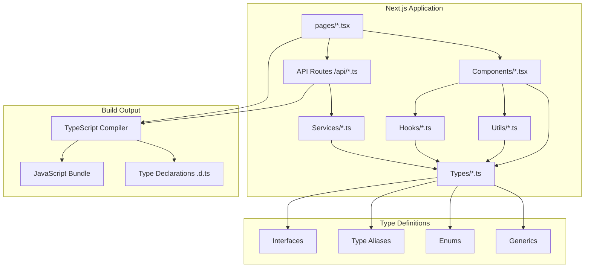
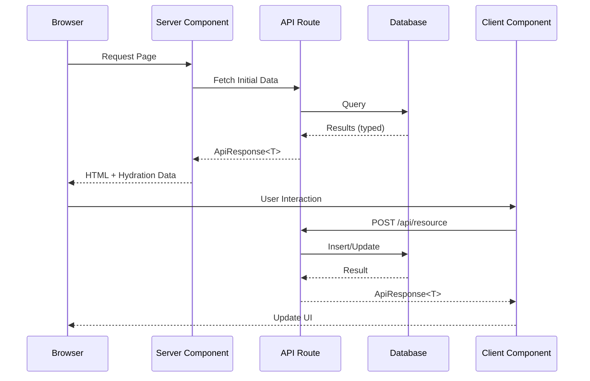

# How to Use Next.js with TypeScript

Author: [nawazdhandala](https://www.github.com/nawazdhandala)

Tags: Next.js, TypeScript, React, Web Development, Frontend, JavaScript, Type Safety

Description: A practical guide to building type-safe Next.js applications with TypeScript, covering project setup, component patterns, API routes, data fetching, and production best practices.

---

> Building web applications with Next.js and TypeScript creates a powerful combination of server-side rendering, static generation, and compile-time type checking. Teams adopting these technologies together report fewer runtime errors and improved developer productivity.

TypeScript adds static typing to JavaScript, catching errors before they reach production. Next.js provides the framework for building React applications with built-in routing, API endpoints, and performance optimizations. Together, they form the foundation for modern web development.

---

## Why TypeScript with Next.js?

| Benefit | Description |
|---------|-------------|
| **Compile-time errors** | Catch bugs before deployment |
| **Better IDE support** | Autocomplete, refactoring, navigation |
| **Self-documenting code** | Types serve as inline documentation |
| **Easier refactoring** | Change code with confidence |
| **Team scalability** | Onboarding becomes easier with typed interfaces |

---

## Project Architecture

The following diagram shows how TypeScript integrates with Next.js components:



---

## Setting Up a New Project

The quickest way to start a Next.js project with TypeScript is using create-next-app with the TypeScript flag.

```bash
# Create a new Next.js project with TypeScript
npx create-next-app@latest my-app --typescript

# Navigate into the project directory
cd my-app

# Start the development server
npm run dev
```

### Adding TypeScript to Existing Projects

For existing Next.js projects, adding TypeScript requires creating a configuration file and installing dependencies.

```bash
# Install TypeScript and type definitions
npm install --save-dev typescript @types/react @types/node @types/react-dom

# Create an empty tsconfig.json file - Next.js will populate it automatically
touch tsconfig.json

# Run the development server - Next.js detects TypeScript and configures it
npm run dev
```

---

## TypeScript Configuration

Next.js generates a default tsconfig.json, but customizing it improves type safety and developer experience.

```json
{
  "compilerOptions": {
    // Target modern JavaScript for better performance
    "target": "ES2020",
    "lib": ["dom", "dom.iterable", "esnext"],

    // Enable all strict type checking options
    "strict": true,
    "noEmit": true,

    // Module resolution settings for Next.js
    "module": "esnext",
    "moduleResolution": "bundler",
    "resolveJsonModule": true,
    "isolatedModules": true,
    "jsx": "preserve",

    // Enable incremental compilation for faster builds
    "incremental": true,

    // Path aliases for cleaner imports
    "baseUrl": ".",
    "paths": {
      "@/*": ["./src/*"],
      "@components/*": ["./src/components/*"],
      "@hooks/*": ["./src/hooks/*"],
      "@types/*": ["./src/types/*"],
      "@utils/*": ["./src/utils/*"],
      "@services/*": ["./src/services/*"]
    },

    // Additional strict checks
    "noUnusedLocals": true,
    "noUnusedParameters": true,
    "noFallthroughCasesInSwitch": true,
    "noUncheckedIndexedAccess": true,

    // Plugin for Next.js specific features
    "plugins": [
      {
        "name": "next"
      }
    ]
  },
  "include": [
    "next-env.d.ts",
    "**/*.ts",
    "**/*.tsx",
    ".next/types/**/*.ts"
  ],
  "exclude": ["node_modules"]
}
```

---

## Type Definitions

Creating a centralized types directory keeps your codebase organized and makes types reusable across components.

### Basic Types and Interfaces

The following file defines common types used throughout the application.

```typescript
// src/types/index.ts

// User-related types
export interface User {
  id: string;
  email: string;
  name: string;
  avatar?: string;
  role: UserRole;
  createdAt: Date;
  updatedAt: Date;
}

export enum UserRole {
  Admin = 'admin',
  Editor = 'editor',
  Viewer = 'viewer',
}

// API response wrapper for consistent error handling
export interface ApiResponse<T> {
  data: T;
  success: boolean;
  message?: string;
  errors?: ValidationError[];
}

export interface ValidationError {
  field: string;
  message: string;
}

// Pagination types for list endpoints
export interface PaginatedResponse<T> {
  items: T[];
  total: number;
  page: number;
  pageSize: number;
  totalPages: number;
  hasNextPage: boolean;
  hasPreviousPage: boolean;
}

export interface PaginationParams {
  page?: number;
  pageSize?: number;
  sortBy?: string;
  sortOrder?: 'asc' | 'desc';
}

// Blog post example with optional fields
export interface BlogPost {
  id: string;
  title: string;
  slug: string;
  content: string;
  excerpt: string;
  author: User;
  tags: string[];
  publishedAt?: Date;
  status: PostStatus;
}

export type PostStatus = 'draft' | 'published' | 'archived';

// Form state type for handling user input
export interface FormState<T> {
  values: T;
  errors: Partial<Record<keyof T, string>>;
  isSubmitting: boolean;
  isValid: boolean;
}
```

---

## Page Components with App Router

Next.js 13+ uses the App Router by default. Pages are React Server Components that can fetch data directly.

### Layout Component

The root layout wraps all pages and provides shared UI elements.

```typescript
// src/app/layout.tsx
import type { Metadata } from 'next';
import { Inter } from 'next/font/google';
import './globals.css';

// Load Inter font with Latin subset for performance
const inter = Inter({ subsets: ['latin'] });

// Metadata object provides SEO information for the entire site
export const metadata: Metadata = {
  title: {
    default: 'My Next.js App',
    template: '%s | My Next.js App',
  },
  description: 'A type-safe Next.js application built with TypeScript',
  keywords: ['Next.js', 'TypeScript', 'React'],
};

// Props interface defines the children prop type explicitly
interface RootLayoutProps {
  children: React.ReactNode;
}

// Root layout component - wraps all pages in the application
export default function RootLayout({ children }: RootLayoutProps): JSX.Element {
  return (
    <html lang="en">
      <body className={inter.className}>
        <header>
          <nav>{/* Navigation component */}</nav>
        </header>
        <main>{children}</main>
        <footer>{/* Footer component */}</footer>
      </body>
    </html>
  );
}
```

### Page with Data Fetching

Server Components can fetch data directly without useEffect or useState.

```typescript
// src/app/posts/page.tsx
import type { Metadata } from 'next';
import type { BlogPost, PaginatedResponse } from '@/types';
import { PostCard } from '@/components/PostCard';
import { Pagination } from '@/components/Pagination';

// Generate metadata for SEO
export const metadata: Metadata = {
  title: 'Blog Posts',
  description: 'Browse all published blog posts',
};

// Define the props type for search params
interface PostsPageProps {
  searchParams: Promise<{
    page?: string;
    tag?: string;
  }>;
}

// Async function to fetch posts from the API
async function getPosts(
  page: number = 1,
  tag?: string
): Promise<PaginatedResponse<BlogPost>> {
  const params = new URLSearchParams({
    page: page.toString(),
    pageSize: '10',
    status: 'published',
  });

  if (tag) {
    params.set('tag', tag);
  }

  const response = await fetch(
    `${process.env.API_URL}/api/posts?${params.toString()}`,
    {
      // Revalidate cache every 60 seconds
      next: { revalidate: 60 },
    }
  );

  if (!response.ok) {
    throw new Error('Failed to fetch posts');
  }

  return response.json();
}

// Server Component - no 'use client' directive needed
export default async function PostsPage({
  searchParams,
}: PostsPageProps): Promise<JSX.Element> {
  const resolvedParams = await searchParams;
  const page = Number(resolvedParams.page) || 1;
  const tag = resolvedParams.tag;

  const posts = await getPosts(page, tag);

  return (
    <div className="container mx-auto px-4 py-8">
      <h1 className="text-3xl font-bold mb-8">Blog Posts</h1>

      {tag && (
        <p className="mb-4 text-gray-600">
          Showing posts tagged with: <strong>{tag}</strong>
        </p>
      )}

      <div className="grid gap-6 md:grid-cols-2 lg:grid-cols-3">
        {posts.items.map((post) => (
          <PostCard key={post.id} post={post} />
        ))}
      </div>

      <Pagination
        currentPage={posts.page}
        totalPages={posts.totalPages}
        hasNextPage={posts.hasNextPage}
        hasPreviousPage={posts.hasPreviousPage}
      />
    </div>
  );
}
```

### Dynamic Routes with TypeScript

Dynamic segments use brackets in the folder name and receive params as props.

```typescript
// src/app/posts/[slug]/page.tsx
import type { Metadata } from 'next';
import { notFound } from 'next/navigation';
import type { BlogPost } from '@/types';

// Props interface includes the dynamic segment parameter
interface PostPageProps {
  params: Promise<{
    slug: string;
  }>;
}

// Fetch a single post by slug
async function getPost(slug: string): Promise<BlogPost | null> {
  const response = await fetch(`${process.env.API_URL}/api/posts/${slug}`, {
    next: { revalidate: 60 },
  });

  if (response.status === 404) {
    return null;
  }

  if (!response.ok) {
    throw new Error('Failed to fetch post');
  }

  return response.json();
}

// Generate metadata dynamically based on the post content
export async function generateMetadata({
  params,
}: PostPageProps): Promise<Metadata> {
  const resolvedParams = await params;
  const post = await getPost(resolvedParams.slug);

  if (!post) {
    return {
      title: 'Post Not Found',
    };
  }

  return {
    title: post.title,
    description: post.excerpt,
    openGraph: {
      title: post.title,
      description: post.excerpt,
      type: 'article',
      publishedTime: post.publishedAt?.toISOString(),
      authors: [post.author.name],
    },
  };
}

// Generate static paths at build time for better performance
export async function generateStaticParams(): Promise<{ slug: string }[]> {
  const response = await fetch(`${process.env.API_URL}/api/posts/slugs`);
  const slugs: string[] = await response.json();

  return slugs.map((slug) => ({ slug }));
}

// Page component renders the post content
export default async function PostPage({
  params,
}: PostPageProps): Promise<JSX.Element> {
  const resolvedParams = await params;
  const post = await getPost(resolvedParams.slug);

  // Return 404 page if post not found
  if (!post) {
    notFound();
  }

  return (
    <article className="container mx-auto px-4 py-8 max-w-3xl">
      <header className="mb-8">
        <h1 className="text-4xl font-bold mb-4">{post.title}</h1>
        <div className="flex items-center gap-4 text-gray-600">
          <span>By {post.author.name}</span>
          {post.publishedAt && (
            <time dateTime={post.publishedAt.toISOString()}>
              {new Date(post.publishedAt).toLocaleDateString()}
            </time>
          )}
        </div>
        <div className="flex gap-2 mt-4">
          {post.tags.map((tag) => (
            <span
              key={tag}
              className="px-3 py-1 bg-gray-100 rounded-full text-sm"
            >
              {tag}
            </span>
          ))}
        </div>
      </header>

      <div
        className="prose prose-lg"
        dangerouslySetInnerHTML={{ __html: post.content }}
      />
    </article>
  );
}
```

---

## Client Components

Components that need interactivity must use the 'use client' directive.

### Interactive Form Component

The following form component handles user input with full type safety.

```typescript
// src/components/ContactForm.tsx
'use client';

import { useState, FormEvent, ChangeEvent } from 'react';
import type { FormState, ApiResponse } from '@/types';

// Define the shape of form data
interface ContactFormData {
  name: string;
  email: string;
  subject: string;
  message: string;
}

// Initial state with empty values
const initialFormData: ContactFormData = {
  name: '',
  email: '',
  subject: '',
  message: '',
};

// Props interface for the component
interface ContactFormProps {
  onSuccess?: () => void;
  className?: string;
}

export function ContactForm({
  onSuccess,
  className = '',
}: ContactFormProps): JSX.Element {
  // Type-safe form state management
  const [formState, setFormState] = useState<FormState<ContactFormData>>({
    values: initialFormData,
    errors: {},
    isSubmitting: false,
    isValid: false,
  });

  const [submitStatus, setSubmitStatus] = useState<
    'idle' | 'success' | 'error'
  >('idle');

  // Validate a single field and return error message if invalid
  function validateField(
    name: keyof ContactFormData,
    value: string
  ): string | undefined {
    switch (name) {
      case 'name':
        if (!value.trim()) return 'Name is required';
        if (value.length < 2) return 'Name must be at least 2 characters';
        break;
      case 'email':
        if (!value.trim()) return 'Email is required';
        if (!/^[^\s@]+@[^\s@]+\.[^\s@]+$/.test(value)) {
          return 'Please enter a valid email address';
        }
        break;
      case 'subject':
        if (!value.trim()) return 'Subject is required';
        break;
      case 'message':
        if (!value.trim()) return 'Message is required';
        if (value.length < 10) return 'Message must be at least 10 characters';
        break;
    }
    return undefined;
  }

  // Handle input changes with type-safe event handling
  function handleChange(
    event: ChangeEvent<HTMLInputElement | HTMLTextAreaElement>
  ): void {
    const { name, value } = event.target;
    const fieldName = name as keyof ContactFormData;
    const error = validateField(fieldName, value);

    setFormState((prev) => ({
      ...prev,
      values: { ...prev.values, [fieldName]: value },
      errors: { ...prev.errors, [fieldName]: error },
      isValid: !error && Object.values(prev.errors).every((e) => !e),
    }));
  }

  // Handle form submission with async/await
  async function handleSubmit(event: FormEvent<HTMLFormElement>): Promise<void> {
    event.preventDefault();

    // Validate all fields before submission
    const errors: Partial<Record<keyof ContactFormData, string>> = {};
    for (const [key, value] of Object.entries(formState.values)) {
      const error = validateField(key as keyof ContactFormData, value);
      if (error) {
        errors[key as keyof ContactFormData] = error;
      }
    }

    if (Object.keys(errors).length > 0) {
      setFormState((prev) => ({ ...prev, errors }));
      return;
    }

    setFormState((prev) => ({ ...prev, isSubmitting: true }));

    try {
      const response = await fetch('/api/contact', {
        method: 'POST',
        headers: { 'Content-Type': 'application/json' },
        body: JSON.stringify(formState.values),
      });

      const result: ApiResponse<null> = await response.json();

      if (result.success) {
        setSubmitStatus('success');
        setFormState({
          values: initialFormData,
          errors: {},
          isSubmitting: false,
          isValid: false,
        });
        onSuccess?.();
      } else {
        setSubmitStatus('error');
        if (result.errors) {
          const fieldErrors: Partial<Record<keyof ContactFormData, string>> = {};
          result.errors.forEach((err) => {
            fieldErrors[err.field as keyof ContactFormData] = err.message;
          });
          setFormState((prev) => ({ ...prev, errors: fieldErrors }));
        }
      }
    } catch {
      setSubmitStatus('error');
    } finally {
      setFormState((prev) => ({ ...prev, isSubmitting: false }));
    }
  }

  return (
    <form onSubmit={handleSubmit} className={`space-y-4 ${className}`}>
      <div>
        <label htmlFor="name" className="block text-sm font-medium mb-1">
          Name
        </label>
        <input
          type="text"
          id="name"
          name="name"
          value={formState.values.name}
          onChange={handleChange}
          className="w-full px-3 py-2 border rounded-md"
          disabled={formState.isSubmitting}
        />
        {formState.errors.name && (
          <p className="text-red-500 text-sm mt-1">{formState.errors.name}</p>
        )}
      </div>

      <div>
        <label htmlFor="email" className="block text-sm font-medium mb-1">
          Email
        </label>
        <input
          type="email"
          id="email"
          name="email"
          value={formState.values.email}
          onChange={handleChange}
          className="w-full px-3 py-2 border rounded-md"
          disabled={formState.isSubmitting}
        />
        {formState.errors.email && (
          <p className="text-red-500 text-sm mt-1">{formState.errors.email}</p>
        )}
      </div>

      <div>
        <label htmlFor="subject" className="block text-sm font-medium mb-1">
          Subject
        </label>
        <input
          type="text"
          id="subject"
          name="subject"
          value={formState.values.subject}
          onChange={handleChange}
          className="w-full px-3 py-2 border rounded-md"
          disabled={formState.isSubmitting}
        />
        {formState.errors.subject && (
          <p className="text-red-500 text-sm mt-1">{formState.errors.subject}</p>
        )}
      </div>

      <div>
        <label htmlFor="message" className="block text-sm font-medium mb-1">
          Message
        </label>
        <textarea
          id="message"
          name="message"
          rows={4}
          value={formState.values.message}
          onChange={handleChange}
          className="w-full px-3 py-2 border rounded-md"
          disabled={formState.isSubmitting}
        />
        {formState.errors.message && (
          <p className="text-red-500 text-sm mt-1">{formState.errors.message}</p>
        )}
      </div>

      <button
        type="submit"
        disabled={formState.isSubmitting}
        className="w-full bg-blue-600 text-white py-2 px-4 rounded-md hover:bg-blue-700 disabled:opacity-50"
      >
        {formState.isSubmitting ? 'Sending...' : 'Send Message'}
      </button>

      {submitStatus === 'success' && (
        <p className="text-green-600">Message sent successfully!</p>
      )}

      {submitStatus === 'error' && (
        <p className="text-red-600">Failed to send message. Please try again.</p>
      )}
    </form>
  );
}
```

---

## API Routes with Type Safety

Next.js API routes benefit significantly from TypeScript, ensuring request and response types are validated.

### Type-Safe API Handler

The following API route handles POST requests with full type checking.

```typescript
// src/app/api/posts/route.ts
import { NextRequest, NextResponse } from 'next/server';
import type { BlogPost, ApiResponse, PaginatedResponse } from '@/types';

// Request body type for creating a post
interface CreatePostRequest {
  title: string;
  content: string;
  excerpt: string;
  tags: string[];
  status: 'draft' | 'published';
}

// Type guard to validate request body structure
function isValidCreatePostRequest(data: unknown): data is CreatePostRequest {
  if (typeof data !== 'object' || data === null) {
    return false;
  }

  const post = data as Record<string, unknown>;

  return (
    typeof post.title === 'string' &&
    typeof post.content === 'string' &&
    typeof post.excerpt === 'string' &&
    Array.isArray(post.tags) &&
    post.tags.every((tag) => typeof tag === 'string') &&
    (post.status === 'draft' || post.status === 'published')
  );
}

// GET handler for fetching paginated posts
export async function GET(
  request: NextRequest
): Promise<NextResponse<ApiResponse<PaginatedResponse<BlogPost>>>> {
  const { searchParams } = new URL(request.url);

  const page = Number(searchParams.get('page')) || 1;
  const pageSize = Math.min(Number(searchParams.get('pageSize')) || 10, 100);
  const status = searchParams.get('status');
  const tag = searchParams.get('tag');

  try {
    // Simulated database query - replace with actual database call
    const posts = await fetchPostsFromDatabase({
      page,
      pageSize,
      status,
      tag,
    });

    return NextResponse.json({
      data: posts,
      success: true,
    });
  } catch (error) {
    console.error('Failed to fetch posts:', error);

    return NextResponse.json(
      {
        data: {
          items: [],
          total: 0,
          page: 1,
          pageSize: 10,
          totalPages: 0,
          hasNextPage: false,
          hasPreviousPage: false,
        },
        success: false,
        message: 'Failed to fetch posts',
      },
      { status: 500 }
    );
  }
}

// POST handler for creating a new post
export async function POST(
  request: NextRequest
): Promise<NextResponse<ApiResponse<BlogPost | null>>> {
  try {
    const body: unknown = await request.json();

    // Validate request body using type guard
    if (!isValidCreatePostRequest(body)) {
      return NextResponse.json(
        {
          data: null,
          success: false,
          message: 'Invalid request body',
          errors: [
            { field: 'body', message: 'Request body does not match expected format' },
          ],
        },
        { status: 400 }
      );
    }

    // Validate title length
    if (body.title.length < 5 || body.title.length > 200) {
      return NextResponse.json(
        {
          data: null,
          success: false,
          errors: [
            { field: 'title', message: 'Title must be between 5 and 200 characters' },
          ],
        },
        { status: 400 }
      );
    }

    // Validate content is not empty
    if (body.content.trim().length === 0) {
      return NextResponse.json(
        {
          data: null,
          success: false,
          errors: [{ field: 'content', message: 'Content cannot be empty' }],
        },
        { status: 400 }
      );
    }

    // Create the post in the database
    const newPost = await createPostInDatabase(body);

    return NextResponse.json(
      {
        data: newPost,
        success: true,
        message: 'Post created successfully',
      },
      { status: 201 }
    );
  } catch (error) {
    console.error('Failed to create post:', error);

    return NextResponse.json(
      {
        data: null,
        success: false,
        message: 'Failed to create post',
      },
      { status: 500 }
    );
  }
}

// Placeholder functions - implement with your actual database
async function fetchPostsFromDatabase(params: {
  page: number;
  pageSize: number;
  status: string | null;
  tag: string | null;
}): Promise<PaginatedResponse<BlogPost>> {
  // Implementation depends on your database
  console.log('Fetching posts with params:', params);
  return {
    items: [],
    total: 0,
    page: params.page,
    pageSize: params.pageSize,
    totalPages: 0,
    hasNextPage: false,
    hasPreviousPage: false,
  };
}

async function createPostInDatabase(data: CreatePostRequest): Promise<BlogPost> {
  // Implementation depends on your database
  console.log('Creating post:', data);
  throw new Error('Not implemented');
}
```

---

## Custom Hooks with TypeScript

Type-safe hooks make state management predictable and catch errors early.

### useFetch Hook

A generic hook for fetching data with loading and error states.

```typescript
// src/hooks/useFetch.ts
'use client';

import { useState, useEffect, useCallback } from 'react';

// Generic interface for fetch state
interface FetchState<T> {
  data: T | null;
  isLoading: boolean;
  error: Error | null;
}

// Return type includes refetch function
interface UseFetchResult<T> extends FetchState<T> {
  refetch: () => Promise<void>;
}

// Options for customizing fetch behavior
interface UseFetchOptions {
  enabled?: boolean;
  refetchInterval?: number;
  onSuccess?: <T>(data: T) => void;
  onError?: (error: Error) => void;
}

// Generic hook that works with any data type
export function useFetch<T>(
  url: string,
  options: UseFetchOptions = {}
): UseFetchResult<T> {
  const { enabled = true, refetchInterval, onSuccess, onError } = options;

  const [state, setState] = useState<FetchState<T>>({
    data: null,
    isLoading: enabled,
    error: null,
  });

  // Memoized fetch function that can be called manually
  const fetchData = useCallback(async (): Promise<void> => {
    setState((prev) => ({ ...prev, isLoading: true, error: null }));

    try {
      const response = await fetch(url);

      if (!response.ok) {
        throw new Error(`HTTP error! status: ${response.status}`);
      }

      const data: T = await response.json();

      setState({ data, isLoading: false, error: null });
      onSuccess?.(data);
    } catch (error) {
      const fetchError =
        error instanceof Error ? error : new Error('Unknown error occurred');

      setState((prev) => ({
        ...prev,
        isLoading: false,
        error: fetchError,
      }));
      onError?.(fetchError);
    }
  }, [url, onSuccess, onError]);

  // Fetch on mount and when URL changes
  useEffect(() => {
    if (!enabled) {
      return;
    }

    fetchData();
  }, [enabled, fetchData]);

  // Optional: Set up refetch interval
  useEffect(() => {
    if (!enabled || !refetchInterval) {
      return;
    }

    const intervalId = setInterval(fetchData, refetchInterval);

    return () => clearInterval(intervalId);
  }, [enabled, refetchInterval, fetchData]);

  return {
    ...state,
    refetch: fetchData,
  };
}
```

### useLocalStorage Hook

A hook for persisting state to localStorage with type safety.

```typescript
// src/hooks/useLocalStorage.ts
'use client';

import { useState, useEffect, useCallback } from 'react';

// Return type mirrors useState but adds remove function
type UseLocalStorageReturn<T> = [
  T,
  (value: T | ((prev: T) => T)) => void,
  () => void
];

export function useLocalStorage<T>(
  key: string,
  initialValue: T
): UseLocalStorageReturn<T> {
  // Initialize state with value from localStorage or initial value
  const [storedValue, setStoredValue] = useState<T>(() => {
    if (typeof window === 'undefined') {
      return initialValue;
    }

    try {
      const item = window.localStorage.getItem(key);
      return item ? (JSON.parse(item) as T) : initialValue;
    } catch (error) {
      console.warn(`Error reading localStorage key "${key}":`, error);
      return initialValue;
    }
  });

  // Update localStorage when state changes
  const setValue = useCallback(
    (value: T | ((prev: T) => T)): void => {
      try {
        // Handle function updates like regular setState
        const valueToStore =
          value instanceof Function ? value(storedValue) : value;

        setStoredValue(valueToStore);

        if (typeof window !== 'undefined') {
          window.localStorage.setItem(key, JSON.stringify(valueToStore));
        }
      } catch (error) {
        console.warn(`Error setting localStorage key "${key}":`, error);
      }
    },
    [key, storedValue]
  );

  // Remove item from localStorage
  const removeValue = useCallback((): void => {
    try {
      setStoredValue(initialValue);
      if (typeof window !== 'undefined') {
        window.localStorage.removeItem(key);
      }
    } catch (error) {
      console.warn(`Error removing localStorage key "${key}":`, error);
    }
  }, [key, initialValue]);

  // Sync with other tabs/windows
  useEffect(() => {
    function handleStorageChange(event: StorageEvent): void {
      if (event.key === key && event.newValue !== null) {
        try {
          setStoredValue(JSON.parse(event.newValue) as T);
        } catch {
          // Ignore parse errors from other sources
        }
      }
    }

    window.addEventListener('storage', handleStorageChange);
    return () => window.removeEventListener('storage', handleStorageChange);
  }, [key]);

  return [storedValue, setValue, removeValue];
}
```

---

## Data Flow Architecture

The following diagram illustrates how data flows through a type-safe Next.js application:



---

## Environment Variables

TypeScript can validate environment variables at build time.

### Type-Safe Environment Variables

Create a module that validates and exports typed environment variables.

```typescript
// src/lib/env.ts
import { z } from 'zod';

// Define schema for environment variables
const envSchema = z.object({
  // Required variables
  DATABASE_URL: z.string().url(),
  API_URL: z.string().url(),

  // Optional with defaults
  NODE_ENV: z
    .enum(['development', 'production', 'test'])
    .default('development'),

  // Public variables (exposed to browser)
  NEXT_PUBLIC_APP_URL: z.string().url(),
  NEXT_PUBLIC_API_URL: z.string().url(),

  // Optional secrets
  JWT_SECRET: z.string().min(32).optional(),
  SMTP_HOST: z.string().optional(),
  SMTP_PORT: z.coerce.number().optional(),
});

// Infer the type from the schema
type Env = z.infer<typeof envSchema>;

// Parse and validate environment variables
function validateEnv(): Env {
  const parsed = envSchema.safeParse(process.env);

  if (!parsed.success) {
    console.error(
      'Invalid environment variables:',
      parsed.error.flatten().fieldErrors
    );
    throw new Error('Invalid environment variables');
  }

  return parsed.data;
}

// Export validated environment variables
export const env = validateEnv();

// Type-safe access to public variables (client-side safe)
export const publicEnv = {
  appUrl: env.NEXT_PUBLIC_APP_URL,
  apiUrl: env.NEXT_PUBLIC_API_URL,
} as const;
```

---

## Error Boundaries with TypeScript

Error boundaries catch rendering errors and display fallback UI.

```typescript
// src/components/ErrorBoundary.tsx
'use client';

import { Component, ErrorInfo, ReactNode } from 'react';

// Props interface with required children and optional fallback
interface ErrorBoundaryProps {
  children: ReactNode;
  fallback?: ReactNode;
  onError?: (error: Error, errorInfo: ErrorInfo) => void;
}

// State interface tracks error information
interface ErrorBoundaryState {
  hasError: boolean;
  error: Error | null;
}

export class ErrorBoundary extends Component<
  ErrorBoundaryProps,
  ErrorBoundaryState
> {
  constructor(props: ErrorBoundaryProps) {
    super(props);
    this.state = { hasError: false, error: null };
  }

  // Update state when an error occurs
  static getDerivedStateFromError(error: Error): ErrorBoundaryState {
    return { hasError: true, error };
  }

  // Log error details for debugging
  componentDidCatch(error: Error, errorInfo: ErrorInfo): void {
    console.error('Error caught by boundary:', error, errorInfo);
    this.props.onError?.(error, errorInfo);
  }

  // Reset error state
  handleReset = (): void => {
    this.setState({ hasError: false, error: null });
  };

  render(): ReactNode {
    if (this.state.hasError) {
      // Render custom fallback or default error UI
      if (this.props.fallback) {
        return this.props.fallback;
      }

      return (
        <div className="p-4 bg-red-50 border border-red-200 rounded-md">
          <h2 className="text-lg font-semibold text-red-800">
            Something went wrong
          </h2>
          <p className="text-red-600 mt-2">
            {this.state.error?.message || 'An unexpected error occurred'}
          </p>
          <button
            onClick={this.handleReset}
            className="mt-4 px-4 py-2 bg-red-600 text-white rounded hover:bg-red-700"
          >
            Try again
          </button>
        </div>
      );
    }

    return this.props.children;
  }
}

// Next.js 13+ error.tsx file for App Router
// src/app/error.tsx
'use client';

import { useEffect } from 'react';

interface ErrorPageProps {
  error: Error & { digest?: string };
  reset: () => void;
}

export default function ErrorPage({
  error,
  reset,
}: ErrorPageProps): JSX.Element {
  useEffect(() => {
    // Log error to error reporting service
    console.error('Page error:', error);
  }, [error]);

  return (
    <div className="flex flex-col items-center justify-center min-h-screen p-4">
      <h1 className="text-2xl font-bold text-gray-900">
        Something went wrong!
      </h1>
      <p className="mt-2 text-gray-600">{error.message}</p>
      {error.digest && (
        <p className="mt-1 text-sm text-gray-400">Error ID: {error.digest}</p>
      )}
      <button
        onClick={reset}
        className="mt-4 px-6 py-2 bg-blue-600 text-white rounded-md hover:bg-blue-700"
      >
        Try again
      </button>
    </div>
  );
}
```

---

## Testing with TypeScript

Type-safe tests catch errors in test code as well as production code.

```typescript
// src/__tests__/components/ContactForm.test.tsx
import { render, screen, fireEvent, waitFor } from '@testing-library/react';
import userEvent from '@testing-library/user-event';
import { ContactForm } from '@/components/ContactForm';

// Mock fetch globally
const mockFetch = jest.fn();
global.fetch = mockFetch;

describe('ContactForm', () => {
  beforeEach(() => {
    mockFetch.mockClear();
  });

  it('renders all form fields', () => {
    render(<ContactForm />);

    expect(screen.getByLabelText(/name/i)).toBeInTheDocument();
    expect(screen.getByLabelText(/email/i)).toBeInTheDocument();
    expect(screen.getByLabelText(/subject/i)).toBeInTheDocument();
    expect(screen.getByLabelText(/message/i)).toBeInTheDocument();
    expect(screen.getByRole('button', { name: /send/i })).toBeInTheDocument();
  });

  it('shows validation errors for empty fields', async () => {
    const user = userEvent.setup();
    render(<ContactForm />);

    // Submit without filling fields
    await user.click(screen.getByRole('button', { name: /send/i }));

    await waitFor(() => {
      expect(screen.getByText(/name is required/i)).toBeInTheDocument();
      expect(screen.getByText(/email is required/i)).toBeInTheDocument();
    });
  });

  it('validates email format', async () => {
    const user = userEvent.setup();
    render(<ContactForm />);

    const emailInput = screen.getByLabelText(/email/i);
    await user.type(emailInput, 'invalid-email');
    await user.tab();

    await waitFor(() => {
      expect(screen.getByText(/valid email/i)).toBeInTheDocument();
    });
  });

  it('submits form with valid data', async () => {
    mockFetch.mockResolvedValueOnce({
      ok: true,
      json: () => Promise.resolve({ success: true }),
    });

    const onSuccess = jest.fn();
    const user = userEvent.setup();
    render(<ContactForm onSuccess={onSuccess} />);

    // Fill out form
    await user.type(screen.getByLabelText(/name/i), 'John Doe');
    await user.type(screen.getByLabelText(/email/i), 'john@example.com');
    await user.type(screen.getByLabelText(/subject/i), 'Test Subject');
    await user.type(screen.getByLabelText(/message/i), 'Test message content');

    // Submit
    await user.click(screen.getByRole('button', { name: /send/i }));

    await waitFor(() => {
      expect(mockFetch).toHaveBeenCalledWith('/api/contact', {
        method: 'POST',
        headers: { 'Content-Type': 'application/json' },
        body: JSON.stringify({
          name: 'John Doe',
          email: 'john@example.com',
          subject: 'Test Subject',
          message: 'Test message content',
        }),
      });
      expect(onSuccess).toHaveBeenCalled();
    });
  });

  it('displays error message on submission failure', async () => {
    mockFetch.mockResolvedValueOnce({
      ok: false,
      json: () => Promise.resolve({ success: false, message: 'Server error' }),
    });

    const user = userEvent.setup();
    render(<ContactForm />);

    // Fill and submit
    await user.type(screen.getByLabelText(/name/i), 'John Doe');
    await user.type(screen.getByLabelText(/email/i), 'john@example.com');
    await user.type(screen.getByLabelText(/subject/i), 'Test');
    await user.type(screen.getByLabelText(/message/i), 'Test message here');
    await user.click(screen.getByRole('button', { name: /send/i }));

    await waitFor(() => {
      expect(screen.getByText(/failed to send/i)).toBeInTheDocument();
    });
  });
});
```

---

## Best Practices Summary

| Practice | Description |
|----------|-------------|
| **Enable strict mode** | Use `"strict": true` in tsconfig.json |
| **Define explicit return types** | Avoid implicit any in function returns |
| **Use type guards** | Validate unknown data at runtime |
| **Prefer interfaces** | Use interfaces for object shapes, types for unions |
| **Centralize types** | Keep shared types in a dedicated directory |
| **Validate environment variables** | Use zod or similar for runtime validation |
| **Type API responses** | Create interfaces for all API responses |
| **Document with JSDoc** | Add descriptions for complex types |

---

## Conclusion

Building Next.js applications with TypeScript provides a solid foundation for scalable, maintainable web development. The combination offers compile-time safety, better IDE support, and self-documenting code that makes team collaboration easier.

Key takeaways:
- Configure TypeScript with strict settings from the start
- Create centralized type definitions for reusability
- Use type guards for runtime validation of external data
- Leverage generics for reusable hooks and components
- Write tests with TypeScript for comprehensive coverage

Start with strict TypeScript configuration, and your codebase will guide you toward better patterns as you build.

---

*Need to monitor your Next.js application in production? [OneUptime](https://oneuptime.com) provides full-stack observability with real-time performance monitoring, error tracking, and alerting for modern web applications.*

**Related Reading:**
- [How to Implement Rate Limiting in FastAPI Without External Services](https://oneuptime.com/blog/post/2025-01-06-fastapi-rate-limiting/view)
