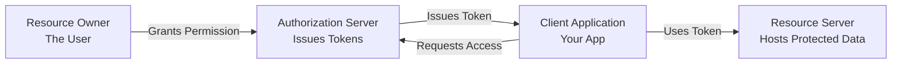
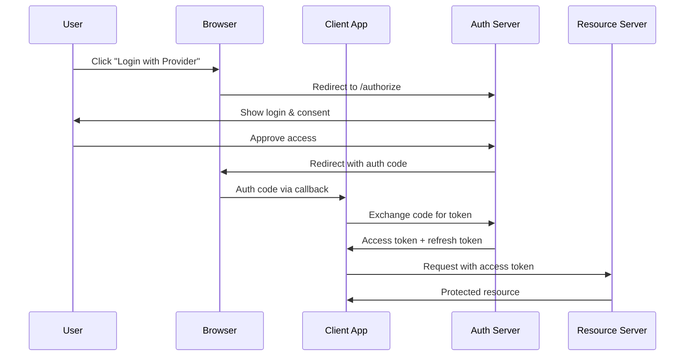
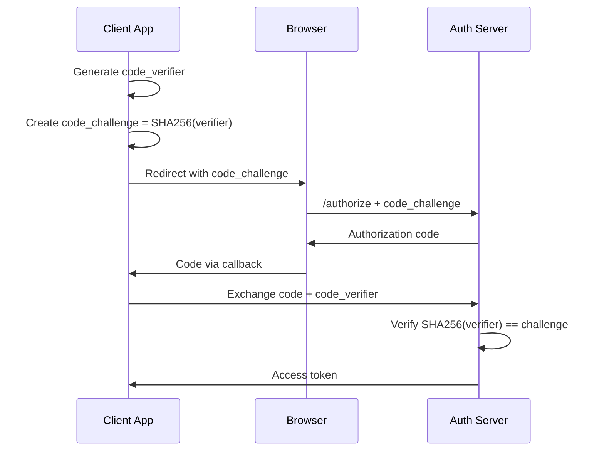
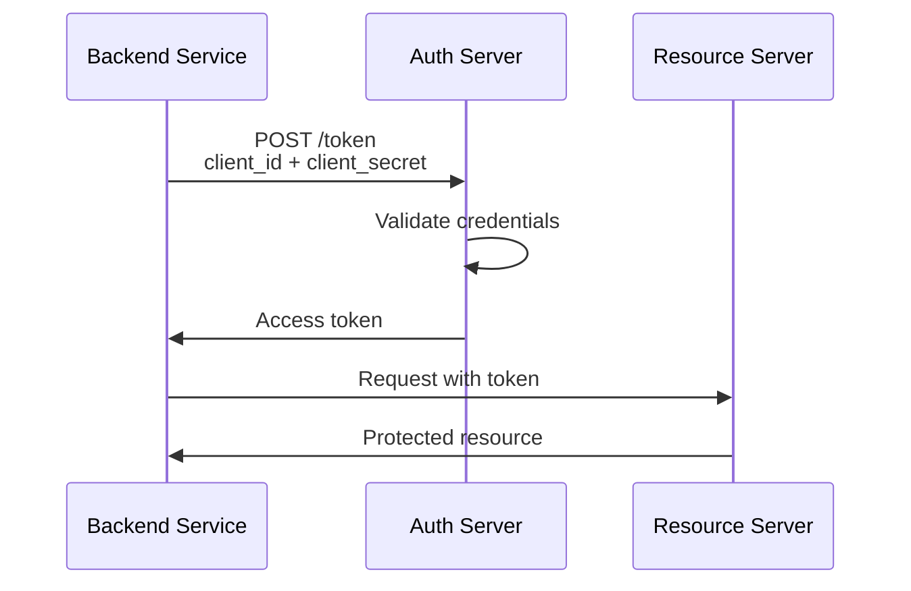
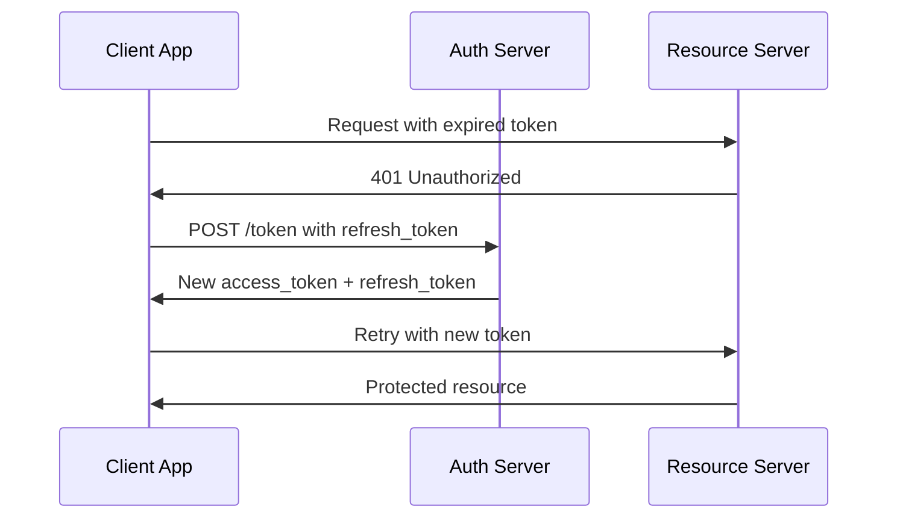
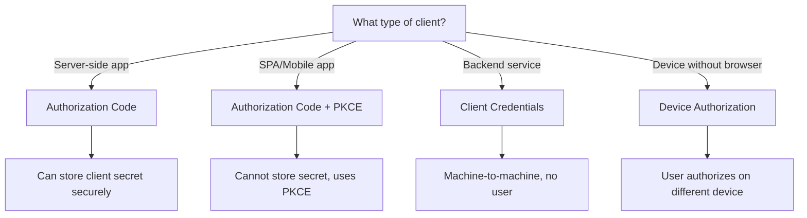

# How to Understand OAuth 2.0 Flow

Author: [nawazdhandala](https://github.com/nawazdhandala)

Tags: OAuth 2.0, Authentication, Security, API, Authorization

Description: A practical guide to understanding OAuth 2.0 flows, grant types, and implementation patterns for securing your applications and APIs.

---

OAuth 2.0 is everywhere. Every time you click "Sign in with Google" or grant an app access to your calendar, OAuth 2.0 is working behind the scenes. But for many developers, it remains a confusing mix of tokens, redirects, and grant types. This guide breaks down OAuth 2.0 into digestible pieces with real examples.

## What Problem Does OAuth 2.0 Solve?

Before OAuth, if you wanted an app to access your data on another service, you had to give it your username and password. That app would then have full access to your account, and you had no way to limit what it could do or revoke access without changing your password.

OAuth 2.0 solves this by introducing delegated authorization. Instead of sharing credentials, users grant limited access through tokens that can be scoped and revoked.

| Without OAuth | With OAuth 2.0 |
|---------------|----------------|
| Share password with third-party apps | Never share your password |
| All or nothing access | Granular permissions (scopes) |
| Revoke by changing password | Revoke individual app access |
| Apps store your credentials | Apps only store tokens |

## The Four Roles in OAuth 2.0

Before diving into flows, you need to understand the four actors involved.



| Role | Description | Example |
|------|-------------|---------|
| **Resource Owner** | The user who owns the data | You, the human |
| **Client** | The application requesting access | A mobile app, web app |
| **Authorization Server** | Issues tokens after authentication | Google, Auth0, Keycloak |
| **Resource Server** | Hosts the protected resources | Google Calendar API |

## OAuth 2.0 Grant Types

OAuth 2.0 defines several grant types, each designed for different scenarios. The grant type determines how the client obtains an access token.

### Authorization Code Flow

This is the most secure and commonly used flow for server-side applications. The authorization code acts as an intermediary, so the access token is never exposed to the browser.



Here is a Node.js implementation of the authorization code flow. The server handles the OAuth callback, exchanges the code for tokens, and stores them securely.

```javascript
// server.js - Express server handling OAuth 2.0 Authorization Code Flow
const express = require('express');
const crypto = require('crypto');
const axios = require('axios');

const app = express();

// OAuth configuration - store these in environment variables
const config = {
  clientId: process.env.OAUTH_CLIENT_ID,
  clientSecret: process.env.OAUTH_CLIENT_SECRET,
  authorizationUrl: 'https://auth.example.com/oauth/authorize',
  tokenUrl: 'https://auth.example.com/oauth/token',
  redirectUri: 'http://localhost:3000/callback',
  scopes: ['read:profile', 'read:email'],
};

// Generate a random state parameter to prevent CSRF attacks.
// The state is stored in the session and verified when the callback is received.
function generateState() {
  return crypto.randomBytes(32).toString('hex');
}

// Step 1: Redirect user to authorization server
// The state parameter prevents CSRF, and scope limits what the app can access
app.get('/login', (req, res) => {
  const state = generateState();

  // Store state in session for verification later
  req.session.oauthState = state;

  // Build the authorization URL with required parameters
  const authUrl = new URL(config.authorizationUrl);
  authUrl.searchParams.set('response_type', 'code');
  authUrl.searchParams.set('client_id', config.clientId);
  authUrl.searchParams.set('redirect_uri', config.redirectUri);
  authUrl.searchParams.set('scope', config.scopes.join(' '));
  authUrl.searchParams.set('state', state);

  res.redirect(authUrl.toString());
});

// Step 2: Handle the callback from authorization server
// Verify state, exchange the code for tokens, then store them securely
app.get('/callback', async (req, res) => {
  const { code, state, error, error_description } = req.query;

  // Check for errors from the authorization server
  if (error) {
    console.error('OAuth error:', error, error_description);
    return res.status(400).json({ error, error_description });
  }

  // Verify state to prevent CSRF attacks
  if (state !== req.session.oauthState) {
    return res.status(400).json({ error: 'State mismatch - possible CSRF attack' });
  }

  try {
    // Exchange authorization code for tokens
    const tokenResponse = await axios.post(config.tokenUrl, {
      grant_type: 'authorization_code',
      code,
      redirect_uri: config.redirectUri,
      client_id: config.clientId,
      client_secret: config.clientSecret,
    }, {
      headers: { 'Content-Type': 'application/x-www-form-urlencoded' },
    });

    const { access_token, refresh_token, expires_in, token_type } = tokenResponse.data;

    // Store tokens securely - never in localStorage for web apps
    // Use HTTP-only cookies or server-side session storage
    req.session.accessToken = access_token;
    req.session.refreshToken = refresh_token;
    req.session.tokenExpiry = Date.now() + (expires_in * 1000);

    res.redirect('/dashboard');
  } catch (err) {
    console.error('Token exchange failed:', err.response?.data || err.message);
    res.status(500).json({ error: 'Token exchange failed' });
  }
});

// Step 3: Use the access token to call protected APIs
// Check expiry and refresh if needed before making requests
app.get('/api/profile', async (req, res) => {
  const { accessToken, tokenExpiry } = req.session;

  if (!accessToken) {
    return res.status(401).json({ error: 'Not authenticated' });
  }

  // Check if token needs refresh
  if (Date.now() >= tokenExpiry - 60000) {
    await refreshAccessToken(req);
  }

  try {
    const response = await axios.get('https://api.example.com/user/profile', {
      headers: {
        'Authorization': `Bearer ${req.session.accessToken}`,
      },
    });

    res.json(response.data);
  } catch (err) {
    res.status(err.response?.status || 500).json({ error: 'API request failed' });
  }
});

app.listen(3000);
```

### Authorization Code Flow with PKCE

PKCE (Proof Key for Code Exchange) adds an extra security layer for public clients like mobile and single-page apps that cannot securely store a client secret. The code verifier and challenge prevent authorization code interception attacks.



This implementation shows PKCE for a React single-page application. The code verifier is generated client-side and used to prove the token request comes from the same client that initiated authorization.

```javascript
// oauth-pkce.js - PKCE implementation for single-page applications
// PKCE adds security for public clients that can't store secrets

// Generate a cryptographically random code verifier
// This is a high-entropy random string that acts as a secret
function generateCodeVerifier() {
  const array = new Uint8Array(32);
  crypto.getRandomValues(array);
  return base64UrlEncode(array);
}

// Create the code challenge by hashing the verifier
// The challenge is sent in the authorization request
// The verifier is sent when exchanging the code for tokens
async function generateCodeChallenge(verifier) {
  const encoder = new TextEncoder();
  const data = encoder.encode(verifier);
  const hash = await crypto.subtle.digest('SHA-256', data);
  return base64UrlEncode(new Uint8Array(hash));
}

// Base64 URL encoding without padding (required by OAuth spec)
function base64UrlEncode(buffer) {
  return btoa(String.fromCharCode(...buffer))
    .replace(/\+/g, '-')
    .replace(/\//g, '_')
    .replace(/=+$/, '');
}

// OAuth client for PKCE flow
class PKCEClient {
  constructor(config) {
    this.config = config;
    this.codeVerifier = null;
  }

  // Start the authorization flow
  // Generates PKCE values and redirects to the auth server
  async authorize() {
    this.codeVerifier = generateCodeVerifier();
    const codeChallenge = await generateCodeChallenge(this.codeVerifier);

    // Store verifier for later use - sessionStorage is acceptable for PKCE
    sessionStorage.setItem('pkce_verifier', this.codeVerifier);

    const state = generateCodeVerifier(); // Reuse function for state
    sessionStorage.setItem('oauth_state', state);

    const params = new URLSearchParams({
      response_type: 'code',
      client_id: this.config.clientId,
      redirect_uri: this.config.redirectUri,
      scope: this.config.scopes.join(' '),
      state: state,
      code_challenge: codeChallenge,
      code_challenge_method: 'S256',
    });

    window.location.href = `${this.config.authorizationUrl}?${params}`;
  }

  // Handle the callback and exchange code for tokens
  // Uses the stored verifier to prove we initiated the request
  async handleCallback() {
    const params = new URLSearchParams(window.location.search);
    const code = params.get('code');
    const state = params.get('state');
    const error = params.get('error');

    if (error) {
      throw new Error(params.get('error_description') || error);
    }

    // Verify state
    const storedState = sessionStorage.getItem('oauth_state');
    if (state !== storedState) {
      throw new Error('State mismatch - possible CSRF attack');
    }

    // Retrieve the code verifier
    const codeVerifier = sessionStorage.getItem('pkce_verifier');
    if (!codeVerifier) {
      throw new Error('Code verifier not found - restart authorization');
    }

    // Exchange code for tokens with PKCE verifier
    const response = await fetch(this.config.tokenUrl, {
      method: 'POST',
      headers: {
        'Content-Type': 'application/x-www-form-urlencoded',
      },
      body: new URLSearchParams({
        grant_type: 'authorization_code',
        code: code,
        redirect_uri: this.config.redirectUri,
        client_id: this.config.clientId,
        code_verifier: codeVerifier,
      }),
    });

    if (!response.ok) {
      const error = await response.json();
      throw new Error(error.error_description || 'Token exchange failed');
    }

    const tokens = await response.json();

    // Clean up
    sessionStorage.removeItem('pkce_verifier');
    sessionStorage.removeItem('oauth_state');

    return tokens;
  }
}

// Usage
const oauth = new PKCEClient({
  clientId: 'your-client-id',
  authorizationUrl: 'https://auth.example.com/oauth/authorize',
  tokenUrl: 'https://auth.example.com/oauth/token',
  redirectUri: 'http://localhost:3000/callback',
  scopes: ['openid', 'profile', 'email'],
});

// Start login
document.getElementById('login-btn').onclick = () => oauth.authorize();

// Handle callback on redirect
if (window.location.pathname === '/callback') {
  oauth.handleCallback()
    .then(tokens => {
      console.log('Logged in!', tokens);
      // Store tokens and redirect to app
    })
    .catch(err => {
      console.error('Login failed:', err);
    });
}
```

### Client Credentials Flow

This flow is for machine-to-machine communication where no user is involved. The client authenticates directly with its credentials to get an access token. This is commonly used for backend services, cron jobs, and microservices.



The client credentials flow is straightforward since there is no user interaction. The service authenticates and gets a token in a single request.

```javascript
// client-credentials.js - Machine-to-machine authentication
// Use this for backend services, microservices, or scheduled jobs

class ServiceClient {
  constructor(config) {
    this.config = config;
    this.accessToken = null;
    this.tokenExpiry = null;
  }

  // Get access token using client credentials
  // Tokens are cached and refreshed automatically
  async getAccessToken() {
    // Return cached token if still valid
    if (this.accessToken && this.tokenExpiry > Date.now() + 60000) {
      return this.accessToken;
    }

    // Request new token
    const response = await fetch(this.config.tokenUrl, {
      method: 'POST',
      headers: {
        'Content-Type': 'application/x-www-form-urlencoded',
        // Some providers require Basic auth header instead of body params
        'Authorization': 'Basic ' + btoa(
          `${this.config.clientId}:${this.config.clientSecret}`
        ),
      },
      body: new URLSearchParams({
        grant_type: 'client_credentials',
        scope: this.config.scopes?.join(' ') || '',
      }),
    });

    if (!response.ok) {
      const error = await response.json();
      throw new Error(error.error_description || 'Failed to get token');
    }

    const data = await response.json();

    this.accessToken = data.access_token;
    this.tokenExpiry = Date.now() + (data.expires_in * 1000);

    return this.accessToken;
  }

  // Make authenticated API request
  // Handles token refresh automatically
  async request(url, options = {}) {
    const token = await this.getAccessToken();

    const response = await fetch(url, {
      ...options,
      headers: {
        ...options.headers,
        'Authorization': `Bearer ${token}`,
      },
    });

    // If unauthorized, clear token and retry once
    if (response.status === 401) {
      this.accessToken = null;
      this.tokenExpiry = null;
      const newToken = await this.getAccessToken();

      return fetch(url, {
        ...options,
        headers: {
          ...options.headers,
          'Authorization': `Bearer ${newToken}`,
        },
      });
    }

    return response;
  }
}

// Usage for a backend service
const apiClient = new ServiceClient({
  clientId: process.env.CLIENT_ID,
  clientSecret: process.env.CLIENT_SECRET,
  tokenUrl: 'https://auth.example.com/oauth/token',
  scopes: ['read:data', 'write:data'],
});

// Make authenticated requests
async function fetchData() {
  const response = await apiClient.request('https://api.example.com/data');
  return response.json();
}
```

### Refresh Token Flow

Access tokens are short-lived by design. When they expire, the refresh token lets you get a new access token without requiring the user to log in again.



This token manager handles automatic refresh and prevents race conditions when multiple requests trigger refresh simultaneously.

```javascript
// token-manager.js - Handles access token refresh automatically
// Prevents race conditions when multiple requests need refresh

class TokenManager {
  constructor(config) {
    this.config = config;
    this.tokens = null;
    this.refreshPromise = null;
  }

  // Set tokens after initial authorization
  setTokens(tokens) {
    this.tokens = {
      accessToken: tokens.access_token,
      refreshToken: tokens.refresh_token,
      expiresAt: Date.now() + (tokens.expires_in * 1000),
    };
  }

  // Get a valid access token, refreshing if needed
  // Uses a shared promise to prevent multiple simultaneous refresh calls
  async getAccessToken() {
    if (!this.tokens) {
      throw new Error('Not authenticated');
    }

    // Token still valid
    if (this.tokens.expiresAt > Date.now() + 60000) {
      return this.tokens.accessToken;
    }

    // If refresh is already in progress, wait for it
    if (this.refreshPromise) {
      await this.refreshPromise;
      return this.tokens.accessToken;
    }

    // Start refresh
    this.refreshPromise = this.refreshAccessToken();

    try {
      await this.refreshPromise;
      return this.tokens.accessToken;
    } finally {
      this.refreshPromise = null;
    }
  }

  // Refresh the access token using the refresh token
  // Refresh tokens may also be rotated for security
  async refreshAccessToken() {
    const response = await fetch(this.config.tokenUrl, {
      method: 'POST',
      headers: {
        'Content-Type': 'application/x-www-form-urlencoded',
      },
      body: new URLSearchParams({
        grant_type: 'refresh_token',
        refresh_token: this.tokens.refreshToken,
        client_id: this.config.clientId,
        client_secret: this.config.clientSecret,
      }),
    });

    if (!response.ok) {
      // Refresh token may be expired or revoked
      this.tokens = null;
      throw new Error('Session expired - please log in again');
    }

    const data = await response.json();

    // Update tokens - note that a new refresh token may be issued
    this.tokens = {
      accessToken: data.access_token,
      refreshToken: data.refresh_token || this.tokens.refreshToken,
      expiresAt: Date.now() + (data.expires_in * 1000),
    };
  }

  // Clear tokens on logout
  clearTokens() {
    this.tokens = null;
  }
}

// Create an axios instance with automatic token refresh
const tokenManager = new TokenManager({
  tokenUrl: 'https://auth.example.com/oauth/token',
  clientId: 'your-client-id',
  clientSecret: 'your-client-secret',
});

// Axios interceptor for automatic token handling
axios.interceptors.request.use(async (config) => {
  const token = await tokenManager.getAccessToken();
  config.headers.Authorization = `Bearer ${token}`;
  return config;
});

// Handle 401 responses with retry
axios.interceptors.response.use(
  response => response,
  async error => {
    const originalRequest = error.config;

    if (error.response?.status === 401 && !originalRequest._retry) {
      originalRequest._retry = true;

      try {
        await tokenManager.refreshAccessToken();
        const token = await tokenManager.getAccessToken();
        originalRequest.headers.Authorization = `Bearer ${token}`;
        return axios(originalRequest);
      } catch (refreshError) {
        // Redirect to login
        window.location.href = '/login';
        return Promise.reject(refreshError);
      }
    }

    return Promise.reject(error);
  }
);
```

## Understanding Scopes

Scopes define what the client can access. They provide granular permission control so users can grant limited access to their data.

| Scope | Description | Example |
|-------|-------------|---------|
| `openid` | Basic OIDC authentication | Required for ID tokens |
| `profile` | User's name, picture | Display user info |
| `email` | User's email address | Contact user |
| `read:repos` | Read repository data | View code |
| `write:repos` | Modify repositories | Push code |
| `offline_access` | Get refresh token | Long-lived access |

The consent screen shows users exactly what permissions the app is requesting.

```javascript
// Request specific scopes based on what your app needs
// Don't request more scopes than necessary - follow least privilege
const authUrl = new URL('https://auth.example.com/oauth/authorize');
authUrl.searchParams.set('scope', [
  'openid',           // Required for OIDC
  'profile',          // Get user's name and picture
  'email',            // Get user's email
  'offline_access',   // Get refresh token for long sessions
].join(' '));
```

## Token Types Explained

OAuth 2.0 uses different types of tokens, each with a specific purpose.

| Token Type | Purpose | Lifetime | Storage |
|------------|---------|----------|---------|
| **Access Token** | Authorize API requests | Short (minutes to hours) | Memory, HTTP-only cookie |
| **Refresh Token** | Get new access tokens | Long (days to months) | Secure, server-side |
| **ID Token** | Authenticate user identity | Short | Memory |

Access tokens come in two formats. Opaque tokens are random strings that require introspection to validate. JWTs (JSON Web Tokens) are self-contained and can be validated locally.

```javascript
// Decode a JWT access token to inspect its contents
// Note: Always validate tokens server-side before trusting claims
function decodeJwt(token) {
  const [header, payload, signature] = token.split('.');

  return {
    header: JSON.parse(atob(header)),
    payload: JSON.parse(atob(payload)),
    signature: signature,
  };
}

// Example JWT payload
const decoded = decodeJwt(accessToken);
console.log(decoded.payload);
// {
//   "sub": "user123",           // Subject (user ID)
//   "aud": "api.example.com",   // Audience (intended recipient)
//   "iss": "auth.example.com",  // Issuer
//   "exp": 1704067200,          // Expiration time
//   "iat": 1704063600,          // Issued at
//   "scope": "read:profile"     // Granted scopes
// }
```

## Security Best Practices

OAuth 2.0 is only secure when implemented correctly. Here are critical security considerations.

### 1. Always Use HTTPS

Never transmit tokens over unencrypted connections.

### 2. Validate the State Parameter

The state parameter prevents CSRF attacks. Always generate, store, and verify it.

```javascript
// Generate unpredictable state
const state = crypto.randomBytes(32).toString('hex');
req.session.oauthState = state;

// Verify on callback - reject if mismatch
if (req.query.state !== req.session.oauthState) {
  throw new Error('Invalid state parameter');
}
```

### 3. Store Tokens Securely

Never store tokens in localStorage for web apps since it is vulnerable to XSS attacks.

```javascript
// For web apps: Use HTTP-only cookies or server-side sessions
res.cookie('access_token', token, {
  httpOnly: true,    // Not accessible via JavaScript
  secure: true,      // Only sent over HTTPS
  sameSite: 'lax',   // CSRF protection
  maxAge: 3600000,   // 1 hour
});

// For SPAs: Keep tokens in memory, use refresh tokens
// The refresh token can be in an HTTP-only cookie
class TokenStore {
  constructor() {
    this.accessToken = null; // Memory only
  }

  setAccessToken(token) {
    this.accessToken = token;
  }

  getAccessToken() {
    return this.accessToken;
  }
}
```

### 4. Validate Tokens Properly

Always validate tokens before trusting them.

```javascript
// JWT validation checklist
async function validateToken(token, expectedAudience) {
  const decoded = jwt.decode(token, { complete: true });

  // Check expiration
  if (decoded.payload.exp < Date.now() / 1000) {
    throw new Error('Token expired');
  }

  // Check issuer
  if (decoded.payload.iss !== 'https://auth.example.com') {
    throw new Error('Invalid issuer');
  }

  // Check audience
  if (decoded.payload.aud !== expectedAudience) {
    throw new Error('Invalid audience');
  }

  // Verify signature using JWKS
  const verified = await jwt.verify(token, getPublicKey);

  return verified;
}
```

### 5. Use Short-Lived Access Tokens

Short token lifetimes limit the damage if tokens are compromised.

```javascript
// Recommended token lifetimes
const tokenLifetimes = {
  accessToken: 15 * 60,        // 15 minutes
  refreshToken: 7 * 24 * 60 * 60, // 7 days
  idToken: 60 * 60,            // 1 hour
};
```

## Common OAuth 2.0 Errors

Here are errors you will encounter and how to handle them.

| Error | Cause | Solution |
|-------|-------|----------|
| `invalid_client` | Wrong client ID or secret | Check credentials |
| `invalid_grant` | Expired or invalid code/token | Re-authenticate |
| `invalid_scope` | Requested scope not allowed | Request valid scopes |
| `access_denied` | User denied consent | Show appropriate message |
| `invalid_request` | Missing required parameter | Check request format |

```javascript
// Handle OAuth errors gracefully
app.get('/callback', async (req, res) => {
  const { error, error_description } = req.query;

  if (error) {
    switch (error) {
      case 'access_denied':
        // User clicked "Deny" on consent screen
        return res.redirect('/login?message=Access+was+denied');

      case 'invalid_scope':
        // App requested scopes it's not allowed to use
        console.error('Scope configuration error:', error_description);
        return res.status(500).render('error', {
          message: 'Application configuration error',
        });

      default:
        console.error('OAuth error:', error, error_description);
        return res.status(400).render('error', {
          message: error_description || 'Authentication failed',
        });
    }
  }

  // Continue with token exchange...
});
```

## Choosing the Right Flow

Use this decision tree to pick the correct OAuth flow for your application.



| Application Type | Recommended Flow | Why |
|------------------|------------------|-----|
| Traditional web app | Authorization Code | Can store client secret |
| Single-page app | Authorization Code + PKCE | No secret, PKCE protects |
| Mobile app | Authorization Code + PKCE | Deep links, no secret |
| Backend service | Client Credentials | No user involved |
| CLI tool | Device Authorization | No browser on device |
| Smart TV | Device Authorization | Limited input capability |

## Summary

OAuth 2.0 provides a secure, standardized way to grant third-party applications limited access to resources without sharing credentials. The key concepts to remember:

- **Grant types** determine how tokens are obtained based on your application type
- **Scopes** provide granular permission control
- **Access tokens** are short-lived and used for API requests
- **Refresh tokens** allow obtaining new access tokens without re-authentication
- **PKCE** adds security for public clients that cannot store secrets
- **State parameter** prevents CSRF attacks in the authorization flow

When implementing OAuth 2.0, always use PKCE for public clients, store tokens securely, validate all tokens and state parameters, and follow the principle of least privilege when requesting scopes.

---

*Building applications with OAuth 2.0 authentication? [OneUptime](https://oneuptime.com) helps you monitor your authentication flows, track token-related errors, and ensure your OAuth implementation is running smoothly. Set up alerts for authentication failures and get notified before your users experience login issues.*
