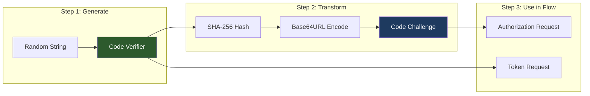
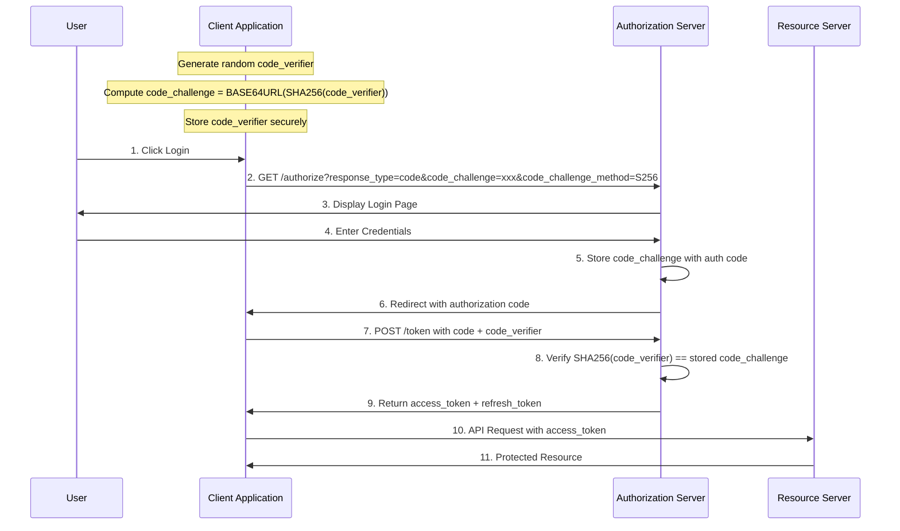
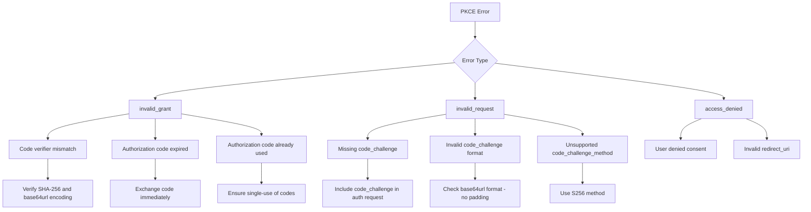
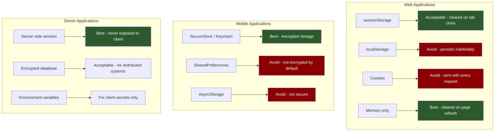
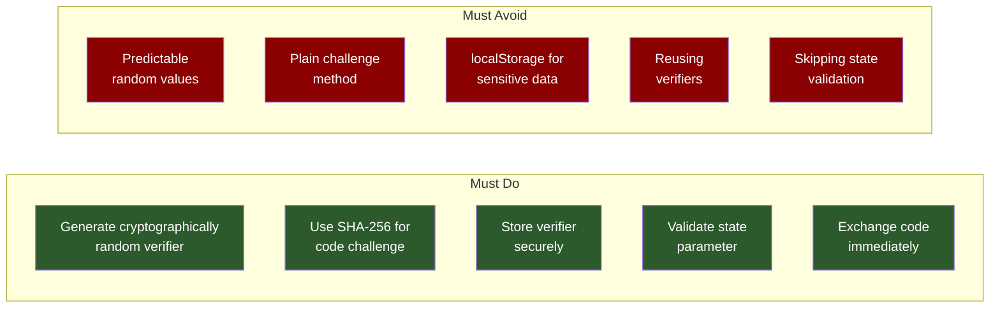

# How to Implement PKCE Flow

Author: [nawazdhandala](https://github.com/nawazdhandala)

Tags: OAuth2, PKCE, Authentication, Security

Description: A comprehensive, step-by-step guide to implementing PKCE (Proof Key for Code Exchange) in your applications. Learn the cryptographic foundations, build implementations for web, mobile, and backend services, and follow security best practices.

---

PKCE (Proof Key for Code Exchange, pronounced "pixy") has become the gold standard for securing OAuth 2.0 authorization flows in modern applications. Originally designed for mobile apps and single-page applications that cannot securely store client secrets, PKCE is now recommended for all OAuth clients, including confidential server-side applications. This guide walks you through implementing PKCE from the ground up, with practical code examples for multiple platforms.

## Understanding the PKCE Mechanism

Before diving into implementation, let us understand exactly what PKCE does and why each step matters. PKCE adds a dynamic, one-time secret to the authorization code flow, replacing the need for a static client secret.

### The Core Concept

PKCE works by creating a cryptographic proof that the same client that started the authorization flow is the one completing it. This happens through a challenge-response mechanism using a code verifier and code challenge.



The security relies on the one-way nature of the SHA-256 hash function. An attacker who intercepts the code challenge during the authorization request cannot reverse it to obtain the code verifier needed for the token exchange.

### Complete PKCE Authorization Flow

Here is the complete flow showing how PKCE parameters integrate with the standard authorization code flow.



## Implementing PKCE: The Building Blocks

Let us build PKCE support from scratch, starting with the cryptographic primitives and working up to complete implementations.

### Step 1: Generating the Code Verifier

The code verifier is a cryptographically random string between 43 and 128 characters. It must use only unreserved URI characters: A-Z, a-z, 0-9, hyphen, period, underscore, and tilde.

This Python implementation generates a secure code verifier using the secrets module for cryptographically strong random values. The resulting string is URL-safe and meets the RFC 7636 specification requirements.

```python
import secrets
import hashlib
import base64
from dataclasses import dataclass
from typing import Tuple


def generate_code_verifier(length: int = 64) -> str:
    """
    Generate a cryptographically random code verifier.

    The verifier must be between 43-128 characters and use only
    unreserved URI characters: [A-Z] / [a-z] / [0-9] / "-" / "." / "_" / "~"

    Args:
        length: Number of random bytes to generate (default 64 = 86 chars)

    Returns:
        A URL-safe base64-encoded random string
    """
    # Generate random bytes using cryptographically secure random generator
    random_bytes = secrets.token_bytes(length)

    # Encode as URL-safe base64, removing padding characters
    # This produces approximately 4/3 * length characters
    verifier = base64.urlsafe_b64encode(random_bytes).decode('utf-8').rstrip('=')

    return verifier


# Example usage
verifier = generate_code_verifier()
print(f"Code Verifier: {verifier}")
print(f"Length: {len(verifier)} characters")
# Output: Code Verifier: dBjftJeZ4CVP-mB92K27uhbUJU1p1r_wW1gFWFOEjXk...
# Length: 86 characters
```

### Step 2: Creating the Code Challenge

The code challenge is derived from the code verifier using SHA-256 hashing followed by base64url encoding. This transformation is irreversible, which is the foundation of PKCE security.

This function computes the SHA-256 hash of the verifier and encodes it using base64url format without padding. The resulting challenge is safe to transmit publicly.

```python
def generate_code_challenge(code_verifier: str) -> str:
    """
    Generate a code challenge from the code verifier using S256 method.

    The challenge is computed as: BASE64URL(SHA256(ASCII(code_verifier)))

    Args:
        code_verifier: The code verifier string

    Returns:
        The base64url-encoded SHA-256 hash of the verifier
    """
    # Encode verifier to bytes using ASCII
    verifier_bytes = code_verifier.encode('ascii')

    # Compute SHA-256 hash
    sha256_digest = hashlib.sha256(verifier_bytes).digest()

    # Encode hash as base64url without padding
    challenge = base64.urlsafe_b64encode(sha256_digest).decode('utf-8').rstrip('=')

    return challenge


# Example usage
verifier = generate_code_verifier()
challenge = generate_code_challenge(verifier)
print(f"Verifier:  {verifier}")
print(f"Challenge: {challenge}")
```

### Step 3: Complete PKCE Parameter Generation

Let us wrap these functions into a reusable data class that generates and holds both values together.

This class generates both the code verifier and challenge together, ensuring they are always paired correctly. The verification method demonstrates how the server validates the PKCE proof.

```python
@dataclass
class PKCEParameters:
    """
    Container for PKCE code verifier and challenge pair.

    Attributes:
        code_verifier: The random secret kept by the client
        code_challenge: The hashed challenge sent to the authorization server
        code_challenge_method: The hashing method used (always 'S256')
    """
    code_verifier: str
    code_challenge: str
    code_challenge_method: str = "S256"

    @classmethod
    def generate(cls) -> 'PKCEParameters':
        """Generate a new PKCE parameter pair."""
        verifier = generate_code_verifier()
        challenge = generate_code_challenge(verifier)
        return cls(
            code_verifier=verifier,
            code_challenge=challenge,
            code_challenge_method="S256"
        )

    def verify(self, received_verifier: str) -> bool:
        """
        Verify that a received code verifier matches the challenge.

        This is what the authorization server does during token exchange.

        Args:
            received_verifier: The code_verifier from the token request

        Returns:
            True if verification passes, False otherwise
        """
        computed_challenge = generate_code_challenge(received_verifier)
        # Use constant-time comparison to prevent timing attacks
        return secrets.compare_digest(self.code_challenge, computed_challenge)


# Generate PKCE parameters
pkce = PKCEParameters.generate()
print(f"Verifier: {pkce.code_verifier}")
print(f"Challenge: {pkce.code_challenge}")
print(f"Method: {pkce.code_challenge_method}")

# Simulate server verification
print(f"Verification: {pkce.verify(pkce.code_verifier)}")  # True
print(f"Wrong verifier: {pkce.verify('wrong-verifier')}")  # False
```

## JavaScript Implementation for Browser Applications

Single-page applications require browser-native cryptography. Modern browsers provide the Web Crypto API, which offers secure random number generation and SHA-256 hashing.

### Core PKCE Utilities

These utility functions implement PKCE using the Web Crypto API. All operations are performed client-side using cryptographically secure primitives built into the browser.

```javascript
// pkce-utils.js - Browser-native PKCE implementation

/**
 * Generate a cryptographically random code verifier.
 * Uses Web Crypto API for secure random number generation.
 *
 * @returns {string} A 43-character URL-safe base64 string
 */
function generateCodeVerifier() {
    // Create a typed array to hold 32 random bytes (256 bits of entropy)
    const buffer = new Uint8Array(32);

    // Fill with cryptographically secure random values
    // This uses the platform's CSPRNG (e.g., /dev/urandom on Unix)
    crypto.getRandomValues(buffer);

    // Convert to URL-safe base64 encoding
    return base64UrlEncode(buffer);
}

/**
 * Generate the code challenge from a code verifier using SHA-256.
 * The challenge is the hash of the verifier, not the verifier itself.
 *
 * @param {string} verifier - The code verifier to hash
 * @returns {Promise<string>} The base64url-encoded SHA-256 hash
 */
async function generateCodeChallenge(verifier) {
    // Create a TextEncoder to convert the string to UTF-8 bytes
    const encoder = new TextEncoder();
    const data = encoder.encode(verifier);

    // Compute SHA-256 hash using Web Crypto API
    // This returns an ArrayBuffer containing the hash
    const hashBuffer = await crypto.subtle.digest('SHA-256', data);

    // Convert the ArrayBuffer to a Uint8Array for encoding
    const hashArray = new Uint8Array(hashBuffer);

    // Encode as URL-safe base64 without padding
    return base64UrlEncode(hashArray);
}

/**
 * Encode a byte array as URL-safe base64 without padding.
 * Standard base64 uses + and / which are not URL-safe.
 *
 * @param {Uint8Array} buffer - The bytes to encode
 * @returns {string} URL-safe base64 string without padding
 */
function base64UrlEncode(buffer) {
    // Convert byte array to regular base64
    let base64 = '';
    const bytes = new Uint8Array(buffer);
    const len = bytes.byteLength;

    for (let i = 0; i < len; i++) {
        base64 += String.fromCharCode(bytes[i]);
    }

    // Use btoa for base64 encoding, then make URL-safe
    return btoa(base64)
        .replace(/\+/g, '-')  // Replace + with -
        .replace(/\//g, '_')  // Replace / with _
        .replace(/=+$/, '');  // Remove trailing padding
}

/**
 * Generate a random state parameter for CSRF protection.
 * The state should be unpredictable and verified on callback.
 *
 * @returns {string} A random string for the state parameter
 */
function generateState() {
    const buffer = new Uint8Array(16);
    crypto.getRandomValues(buffer);
    return base64UrlEncode(buffer);
}

// Export for module usage
export { generateCodeVerifier, generateCodeChallenge, generateState, base64UrlEncode };
```

### Complete OAuth2 PKCE Client for SPAs

This class provides a complete PKCE implementation for single-page applications. It handles the entire authorization flow including parameter generation, redirect handling, and token exchange.

```javascript
// oauth2-pkce-client.js - Complete PKCE client for single-page applications

import { generateCodeVerifier, generateCodeChallenge, generateState } from './pkce-utils.js';

/**
 * OAuth2 client with PKCE support for browser-based applications.
 * Handles the complete authorization code flow with PKCE.
 */
class OAuth2PKCEClient {
    /**
     * Create a new OAuth2 PKCE client.
     *
     * @param {Object} config - OAuth2 configuration
     * @param {string} config.clientId - The OAuth client ID
     * @param {string} config.authorizationEndpoint - The authorization URL
     * @param {string} config.tokenEndpoint - The token exchange URL
     * @param {string} config.redirectUri - The callback URL
     * @param {string[]} config.scopes - Requested permission scopes
     */
    constructor(config) {
        this.clientId = config.clientId;
        this.authorizationEndpoint = config.authorizationEndpoint;
        this.tokenEndpoint = config.tokenEndpoint;
        this.redirectUri = config.redirectUri;
        this.scopes = config.scopes || ['openid', 'profile'];

        // Storage keys for PKCE parameters
        this.VERIFIER_KEY = 'oauth2_pkce_verifier';
        this.STATE_KEY = 'oauth2_pkce_state';
    }

    /**
     * Initiate the authorization flow.
     * Generates PKCE parameters and redirects to the authorization server.
     *
     * @param {Object} options - Additional options
     * @param {string[]} options.additionalScopes - Extra scopes to request
     * @param {Object} options.extraParams - Additional URL parameters
     */
    async authorize(options = {}) {
        // Generate PKCE parameters
        const codeVerifier = generateCodeVerifier();
        const codeChallenge = await generateCodeChallenge(codeVerifier);
        const state = generateState();

        // Store verifier and state in sessionStorage
        // sessionStorage is cleared when the tab closes, reducing exposure
        sessionStorage.setItem(this.VERIFIER_KEY, codeVerifier);
        sessionStorage.setItem(this.STATE_KEY, state);

        // Build the list of scopes
        const allScopes = [...this.scopes, ...(options.additionalScopes || [])];

        // Construct authorization URL with all required parameters
        const params = new URLSearchParams({
            response_type: 'code',
            client_id: this.clientId,
            redirect_uri: this.redirectUri,
            scope: allScopes.join(' '),
            state: state,
            code_challenge: codeChallenge,
            code_challenge_method: 'S256',
            ...options.extraParams
        });

        // Redirect to authorization server
        const authUrl = `${this.authorizationEndpoint}?${params.toString()}`;
        window.location.href = authUrl;
    }

    /**
     * Handle the OAuth callback and exchange the code for tokens.
     * Call this method on your callback page.
     *
     * @returns {Promise<Object>} The token response
     * @throws {Error} If callback validation or token exchange fails
     */
    async handleCallback() {
        const params = new URLSearchParams(window.location.search);

        // Check for error response from authorization server
        const error = params.get('error');
        if (error) {
            const description = params.get('error_description') || 'Authorization failed';
            throw new OAuth2Error(error, description);
        }

        // Extract authorization code
        const code = params.get('code');
        if (!code) {
            throw new OAuth2Error('missing_code', 'No authorization code in callback');
        }

        // Validate state parameter to prevent CSRF
        const receivedState = params.get('state');
        const expectedState = sessionStorage.getItem(this.STATE_KEY);

        if (!expectedState) {
            throw new OAuth2Error('missing_state', 'No stored state found - session may have expired');
        }

        if (receivedState !== expectedState) {
            throw new OAuth2Error('state_mismatch', 'State parameter does not match - possible CSRF attack');
        }

        // Retrieve stored code verifier
        const codeVerifier = sessionStorage.getItem(this.VERIFIER_KEY);
        if (!codeVerifier) {
            throw new OAuth2Error('missing_verifier', 'No code verifier found - restart authorization');
        }

        // Exchange authorization code for tokens
        const tokens = await this.exchangeCodeForTokens(code, codeVerifier);

        // Clean up stored PKCE parameters
        sessionStorage.removeItem(this.VERIFIER_KEY);
        sessionStorage.removeItem(this.STATE_KEY);

        // Remove code from URL to prevent accidental reuse
        window.history.replaceState({}, document.title, window.location.pathname);

        return tokens;
    }

    /**
     * Exchange authorization code for tokens.
     *
     * @param {string} code - The authorization code
     * @param {string} codeVerifier - The PKCE code verifier
     * @returns {Promise<Object>} Token response with access_token, refresh_token, etc.
     */
    async exchangeCodeForTokens(code, codeVerifier) {
        const response = await fetch(this.tokenEndpoint, {
            method: 'POST',
            headers: {
                'Content-Type': 'application/x-www-form-urlencoded',
            },
            body: new URLSearchParams({
                grant_type: 'authorization_code',
                code: code,
                redirect_uri: this.redirectUri,
                client_id: this.clientId,
                code_verifier: codeVerifier,
            }),
        });

        const data = await response.json();

        if (!response.ok) {
            throw new OAuth2Error(
                data.error || 'token_error',
                data.error_description || 'Token exchange failed'
            );
        }

        return data;
    }

    /**
     * Refresh an access token using a refresh token.
     *
     * @param {string} refreshToken - The refresh token
     * @returns {Promise<Object>} New token response
     */
    async refreshAccessToken(refreshToken) {
        const response = await fetch(this.tokenEndpoint, {
            method: 'POST',
            headers: {
                'Content-Type': 'application/x-www-form-urlencoded',
            },
            body: new URLSearchParams({
                grant_type: 'refresh_token',
                refresh_token: refreshToken,
                client_id: this.clientId,
            }),
        });

        const data = await response.json();

        if (!response.ok) {
            throw new OAuth2Error(
                data.error || 'refresh_error',
                data.error_description || 'Token refresh failed'
            );
        }

        return data;
    }
}

/**
 * Custom error class for OAuth2 errors.
 */
class OAuth2Error extends Error {
    constructor(code, description) {
        super(description);
        this.name = 'OAuth2Error';
        this.code = code;
    }
}

export { OAuth2PKCEClient, OAuth2Error };
```

### Using the Client in Your Application

This example shows how to integrate the PKCE client into a React or vanilla JavaScript application, handling both the login initiation and callback processing.

```javascript
// app.js - Example usage of the PKCE client

import { OAuth2PKCEClient } from './oauth2-pkce-client.js';

// Initialize the OAuth2 client with your provider's configuration
const oauth = new OAuth2PKCEClient({
    clientId: 'your-client-id',
    authorizationEndpoint: 'https://auth.example.com/authorize',
    tokenEndpoint: 'https://auth.example.com/token',
    redirectUri: window.location.origin + '/callback',
    scopes: ['openid', 'profile', 'email', 'offline_access'],
});

// Token storage using a simple in-memory store
// For production, consider using a more robust solution
const tokenStore = {
    accessToken: null,
    refreshToken: null,
    expiresAt: null,

    setTokens(response) {
        this.accessToken = response.access_token;
        this.refreshToken = response.refresh_token;
        this.expiresAt = Date.now() + (response.expires_in * 1000);
    },

    isExpired() {
        // Consider token expired 60 seconds before actual expiry
        return this.expiresAt && Date.now() >= this.expiresAt - 60000;
    },

    clear() {
        this.accessToken = null;
        this.refreshToken = null;
        this.expiresAt = null;
    }
};

// Login handler
async function login() {
    try {
        // This will redirect to the authorization server
        await oauth.authorize({
            additionalScopes: ['custom:scope'],
            extraParams: {
                prompt: 'consent',  // Always show consent screen
            }
        });
    } catch (error) {
        console.error('Failed to start authorization:', error);
    }
}

// Callback handler - run this on your callback page
async function handleCallback() {
    try {
        const tokens = await oauth.handleCallback();

        // Store tokens
        tokenStore.setTokens(tokens);

        // Redirect to the main application
        window.location.href = '/dashboard';

    } catch (error) {
        console.error('Authorization failed:', error);

        // Show user-friendly error
        if (error.code === 'access_denied') {
            alert('Access was denied. Please try again.');
        } else {
            alert('Login failed: ' + error.message);
        }

        // Redirect to login page
        window.location.href = '/login';
    }
}

// Make authenticated API requests
async function fetchWithAuth(url, options = {}) {
    // Check if token needs refresh
    if (tokenStore.isExpired() && tokenStore.refreshToken) {
        try {
            const newTokens = await oauth.refreshAccessToken(tokenStore.refreshToken);
            tokenStore.setTokens(newTokens);
        } catch (error) {
            // Refresh failed - user needs to re-authenticate
            tokenStore.clear();
            window.location.href = '/login';
            return;
        }
    }

    // Make the request with the access token
    return fetch(url, {
        ...options,
        headers: {
            ...options.headers,
            'Authorization': `Bearer ${tokenStore.accessToken}`,
        },
    });
}

// Detect if we're on the callback page
if (window.location.pathname === '/callback') {
    handleCallback();
}

// Export for use in your application
export { login, fetchWithAuth, tokenStore };
```

## Server-Side Implementation with Python Flask

Server-side applications can securely store client secrets, but PKCE is still recommended as defense in depth. This Flask implementation demonstrates a complete OAuth2 PKCE flow.

### Flask OAuth2 PKCE Application

This Flask application implements the complete PKCE flow with session-based storage for PKCE parameters. It includes routes for initiating login, handling callbacks, and making authenticated API requests.

```python
# app.py - Flask OAuth2 PKCE implementation

from flask import Flask, redirect, request, session, url_for, jsonify
import secrets
import hashlib
import base64
import requests
import os
from functools import wraps
from urllib.parse import urlencode

app = Flask(__name__)
app.secret_key = secrets.token_hex(32)

# OAuth2 configuration - load from environment variables
OAUTH_CONFIG = {
    'client_id': os.environ.get('OAUTH_CLIENT_ID'),
    'client_secret': os.environ.get('OAUTH_CLIENT_SECRET'),  # Optional with PKCE
    'authorization_endpoint': os.environ.get('OAUTH_AUTH_URL', 'https://auth.example.com/authorize'),
    'token_endpoint': os.environ.get('OAUTH_TOKEN_URL', 'https://auth.example.com/token'),
    'redirect_uri': os.environ.get('OAUTH_REDIRECT_URI', 'http://localhost:5000/callback'),
    'scopes': ['openid', 'profile', 'email', 'offline_access'],
}


def generate_pkce_pair():
    """
    Generate a PKCE code verifier and challenge pair.

    Returns:
        tuple: (code_verifier, code_challenge)
    """
    # Generate 64 random bytes for the verifier
    code_verifier = base64.urlsafe_b64encode(
        secrets.token_bytes(64)
    ).decode('utf-8').rstrip('=')

    # Generate the challenge from the verifier
    verifier_bytes = code_verifier.encode('utf-8')
    sha256_hash = hashlib.sha256(verifier_bytes).digest()
    code_challenge = base64.urlsafe_b64encode(sha256_hash).decode('utf-8').rstrip('=')

    return code_verifier, code_challenge


def require_auth(f):
    """
    Decorator to require authentication for a route.
    Redirects to login if no valid session exists.
    """
    @wraps(f)
    def decorated_function(*args, **kwargs):
        if 'access_token' not in session:
            return redirect(url_for('login'))
        return f(*args, **kwargs)
    return decorated_function


@app.route('/')
def index():
    """Home page with login link."""
    if 'access_token' in session:
        return redirect(url_for('dashboard'))
    return '''
        <h1>OAuth2 PKCE Demo</h1>
        <a href="/login">Login with OAuth2</a>
    '''


@app.route('/login')
def login():
    """
    Initiate the OAuth2 PKCE authorization flow.
    Generates PKCE parameters and redirects to the authorization server.
    """
    # Generate PKCE parameters
    code_verifier, code_challenge = generate_pkce_pair()

    # Generate state for CSRF protection
    state = secrets.token_urlsafe(32)

    # Store in session for later verification
    session['pkce_verifier'] = code_verifier
    session['oauth_state'] = state

    # Build authorization URL
    params = {
        'response_type': 'code',
        'client_id': OAUTH_CONFIG['client_id'],
        'redirect_uri': OAUTH_CONFIG['redirect_uri'],
        'scope': ' '.join(OAUTH_CONFIG['scopes']),
        'state': state,
        'code_challenge': code_challenge,
        'code_challenge_method': 'S256',
    }

    auth_url = f"{OAUTH_CONFIG['authorization_endpoint']}?{urlencode(params)}"

    return redirect(auth_url)


@app.route('/callback')
def callback():
    """
    Handle the OAuth2 callback from the authorization server.
    Validates state, exchanges code for tokens, and establishes session.
    """
    # Check for errors from the authorization server
    error = request.args.get('error')
    if error:
        error_description = request.args.get('error_description', 'Unknown error')
        return f'''
            <h1>Authorization Failed</h1>
            <p>Error: {error}</p>
            <p>Description: {error_description}</p>
            <a href="/">Try Again</a>
        ''', 400

    # Get authorization code
    code = request.args.get('code')
    if not code:
        return 'No authorization code received', 400

    # Validate state parameter
    received_state = request.args.get('state')
    expected_state = session.get('oauth_state')

    if not expected_state:
        return 'No state found in session - session may have expired', 400

    if not secrets.compare_digest(expected_state, received_state or ''):
        return 'State mismatch - possible CSRF attack', 400

    # Get PKCE verifier from session
    code_verifier = session.get('pkce_verifier')
    if not code_verifier:
        return 'No PKCE verifier found - session may have expired', 400

    # Exchange authorization code for tokens
    token_data = {
        'grant_type': 'authorization_code',
        'code': code,
        'redirect_uri': OAUTH_CONFIG['redirect_uri'],
        'client_id': OAUTH_CONFIG['client_id'],
        'code_verifier': code_verifier,
    }

    # Include client secret if available (for confidential clients)
    if OAUTH_CONFIG.get('client_secret'):
        token_data['client_secret'] = OAUTH_CONFIG['client_secret']

    try:
        response = requests.post(
            OAUTH_CONFIG['token_endpoint'],
            data=token_data,
            headers={'Content-Type': 'application/x-www-form-urlencoded'},
            timeout=30
        )

        if response.status_code != 200:
            error_info = response.json()
            return f'''
                <h1>Token Exchange Failed</h1>
                <p>Error: {error_info.get('error', 'Unknown')}</p>
                <p>Description: {error_info.get('error_description', '')}</p>
                <a href="/">Try Again</a>
            ''', 400

        tokens = response.json()

        # Clear PKCE/state from session
        session.pop('pkce_verifier', None)
        session.pop('oauth_state', None)

        # Store tokens in session
        session['access_token'] = tokens['access_token']
        session['refresh_token'] = tokens.get('refresh_token')
        session['id_token'] = tokens.get('id_token')
        session['token_expires_at'] = tokens.get('expires_in', 3600)

        return redirect(url_for('dashboard'))

    except requests.exceptions.RequestException as e:
        return f'Token exchange error: {str(e)}', 500


@app.route('/dashboard')
@require_auth
def dashboard():
    """Protected dashboard page."""
    access_token = session.get('access_token', '')
    return f'''
        <h1>Dashboard</h1>
        <p>You are logged in!</p>
        <p>Access Token (first 50 chars): {access_token[:50]}...</p>
        <p><a href="/api/user">Fetch User Info</a></p>
        <p><a href="/logout">Logout</a></p>
    '''


@app.route('/api/user')
@require_auth
def get_user():
    """
    Example protected API endpoint that fetches user info.
    Demonstrates using the access token to call external APIs.
    """
    access_token = session.get('access_token')

    # Example: Fetch user info from the OAuth provider
    # Replace with your actual userinfo endpoint
    try:
        response = requests.get(
            'https://auth.example.com/userinfo',
            headers={'Authorization': f'Bearer {access_token}'},
            timeout=10
        )

        if response.status_code == 401:
            # Token expired - try to refresh
            return redirect(url_for('refresh_token'))

        return jsonify(response.json())

    except requests.exceptions.RequestException as e:
        return jsonify({'error': str(e)}), 500


@app.route('/refresh')
@require_auth
def refresh_token():
    """
    Refresh the access token using the refresh token.
    """
    refresh_token = session.get('refresh_token')

    if not refresh_token:
        return redirect(url_for('login'))

    token_data = {
        'grant_type': 'refresh_token',
        'refresh_token': refresh_token,
        'client_id': OAUTH_CONFIG['client_id'],
    }

    if OAUTH_CONFIG.get('client_secret'):
        token_data['client_secret'] = OAUTH_CONFIG['client_secret']

    try:
        response = requests.post(
            OAUTH_CONFIG['token_endpoint'],
            data=token_data,
            headers={'Content-Type': 'application/x-www-form-urlencoded'},
            timeout=30
        )

        if response.status_code != 200:
            # Refresh token may be expired - require re-authentication
            session.clear()
            return redirect(url_for('login'))

        tokens = response.json()

        # Update session with new tokens
        session['access_token'] = tokens['access_token']
        if 'refresh_token' in tokens:
            session['refresh_token'] = tokens['refresh_token']

        return redirect(url_for('dashboard'))

    except requests.exceptions.RequestException:
        return redirect(url_for('login'))


@app.route('/logout')
def logout():
    """Clear session and logout."""
    session.clear()
    return redirect(url_for('index'))


if __name__ == '__main__':
    app.run(debug=True, port=5000)
```

## Mobile App Implementation with React Native

Mobile applications have unique security considerations. This React Native implementation uses secure storage for sensitive data and handles deep linking for OAuth callbacks.

### React Native PKCE Module

This module provides PKCE functionality for React Native applications using Expo's cryptography and secure storage libraries. It handles the complete flow including secure token persistence.

```javascript
// oauth-pkce.js - React Native PKCE implementation

import * as Crypto from 'expo-crypto';
import * as SecureStore from 'expo-secure-store';
import * as WebBrowser from 'expo-web-browser';
import * as Linking from 'expo-linking';

// Constants for secure storage keys
const STORAGE_KEYS = {
    VERIFIER: 'oauth_pkce_verifier',
    STATE: 'oauth_pkce_state',
    ACCESS_TOKEN: 'oauth_access_token',
    REFRESH_TOKEN: 'oauth_refresh_token',
    TOKEN_EXPIRY: 'oauth_token_expiry',
};

/**
 * Generate PKCE code verifier and challenge for React Native.
 * Uses Expo's crypto module for secure random generation.
 *
 * @returns {Promise<{verifier: string, challenge: string}>}
 */
async function generatePKCE() {
    // Generate 32 random bytes for the verifier
    const randomBytes = await Crypto.getRandomBytesAsync(32);

    // Convert to URL-safe base64
    const verifier = arrayToBase64Url(randomBytes);

    // Generate SHA-256 hash of verifier for challenge
    const hashDigest = await Crypto.digestStringAsync(
        Crypto.CryptoDigestAlgorithm.SHA256,
        verifier,
        { encoding: Crypto.CryptoEncoding.BASE64 }
    );

    // Convert base64 to base64url
    const challenge = hashDigest
        .replace(/\+/g, '-')
        .replace(/\//g, '_')
        .replace(/=+$/, '');

    return { verifier, challenge };
}

/**
 * Convert a Uint8Array to URL-safe base64 string.
 */
function arrayToBase64Url(bytes) {
    const base64 = btoa(String.fromCharCode.apply(null, bytes));
    return base64
        .replace(/\+/g, '-')
        .replace(/\//g, '_')
        .replace(/=+$/, '');
}

/**
 * Generate a random state parameter.
 */
async function generateState() {
    const randomBytes = await Crypto.getRandomBytesAsync(16);
    return arrayToBase64Url(randomBytes);
}

/**
 * OAuth2 PKCE Client for React Native applications.
 * Handles authentication flow with secure storage and deep linking.
 */
class MobileOAuth2Client {
    /**
     * Create a new mobile OAuth2 client.
     *
     * @param {Object} config - OAuth configuration
     */
    constructor(config) {
        this.clientId = config.clientId;
        this.authorizationEndpoint = config.authorizationEndpoint;
        this.tokenEndpoint = config.tokenEndpoint;
        // Use Expo's Linking to create a proper redirect URI
        this.redirectUri = config.redirectUri || Linking.createURL('oauth/callback');
        this.scopes = config.scopes || ['openid', 'profile'];
    }

    /**
     * Perform the complete login flow.
     * Opens the browser, handles authentication, and stores tokens.
     *
     * @returns {Promise<Object>} Token response on success
     * @throws {Error} If authentication fails or is cancelled
     */
    async login() {
        // Generate PKCE parameters
        const { verifier, challenge } = await generatePKCE();
        const state = await generateState();

        // Store verifier and state securely
        await SecureStore.setItemAsync(STORAGE_KEYS.VERIFIER, verifier);
        await SecureStore.setItemAsync(STORAGE_KEYS.STATE, state);

        // Build authorization URL
        const params = new URLSearchParams({
            response_type: 'code',
            client_id: this.clientId,
            redirect_uri: this.redirectUri,
            scope: this.scopes.join(' '),
            state: state,
            code_challenge: challenge,
            code_challenge_method: 'S256',
        });

        const authUrl = `${this.authorizationEndpoint}?${params.toString()}`;

        // Open authentication session in browser
        // This returns when the user is redirected back to the app
        const result = await WebBrowser.openAuthSessionAsync(authUrl, this.redirectUri);

        if (result.type === 'success') {
            // Parse the callback URL and exchange code for tokens
            return await this.handleCallback(result.url);
        } else if (result.type === 'cancel') {
            await this.clearPKCEState();
            throw new Error('Authentication was cancelled');
        } else {
            await this.clearPKCEState();
            throw new Error('Authentication failed');
        }
    }

    /**
     * Handle the OAuth callback URL.
     * Validates state, exchanges code for tokens, and stores them.
     *
     * @param {string} callbackUrl - The full callback URL
     * @returns {Promise<Object>} Token response
     */
    async handleCallback(callbackUrl) {
        const url = new URL(callbackUrl);
        const params = new URLSearchParams(url.search);

        // Check for error response
        const error = params.get('error');
        if (error) {
            await this.clearPKCEState();
            throw new Error(params.get('error_description') || error);
        }

        // Validate state
        const receivedState = params.get('state');
        const expectedState = await SecureStore.getItemAsync(STORAGE_KEYS.STATE);

        if (receivedState !== expectedState) {
            await this.clearPKCEState();
            throw new Error('State mismatch - possible security issue');
        }

        // Get the authorization code
        const code = params.get('code');
        if (!code) {
            await this.clearPKCEState();
            throw new Error('No authorization code received');
        }

        // Get the stored verifier
        const codeVerifier = await SecureStore.getItemAsync(STORAGE_KEYS.VERIFIER);
        if (!codeVerifier) {
            throw new Error('No code verifier found');
        }

        // Exchange code for tokens
        const response = await fetch(this.tokenEndpoint, {
            method: 'POST',
            headers: {
                'Content-Type': 'application/x-www-form-urlencoded',
            },
            body: new URLSearchParams({
                grant_type: 'authorization_code',
                code: code,
                redirect_uri: this.redirectUri,
                client_id: this.clientId,
                code_verifier: codeVerifier,
            }).toString(),
        });

        // Clear PKCE state regardless of result
        await this.clearPKCEState();

        if (!response.ok) {
            const errorData = await response.json();
            throw new Error(errorData.error_description || 'Token exchange failed');
        }

        const tokens = await response.json();

        // Store tokens securely
        await this.storeTokens(tokens);

        return tokens;
    }

    /**
     * Store tokens in secure storage.
     */
    async storeTokens(tokens) {
        await SecureStore.setItemAsync(STORAGE_KEYS.ACCESS_TOKEN, tokens.access_token);

        if (tokens.refresh_token) {
            await SecureStore.setItemAsync(STORAGE_KEYS.REFRESH_TOKEN, tokens.refresh_token);
        }

        if (tokens.expires_in) {
            const expiry = (Date.now() + tokens.expires_in * 1000).toString();
            await SecureStore.setItemAsync(STORAGE_KEYS.TOKEN_EXPIRY, expiry);
        }
    }

    /**
     * Get the current access token, refreshing if necessary.
     *
     * @returns {Promise<string|null>} The access token or null if not authenticated
     */
    async getAccessToken() {
        const accessToken = await SecureStore.getItemAsync(STORAGE_KEYS.ACCESS_TOKEN);

        if (!accessToken) {
            return null;
        }

        // Check if token is expired
        const expiryStr = await SecureStore.getItemAsync(STORAGE_KEYS.TOKEN_EXPIRY);
        const expiry = expiryStr ? parseInt(expiryStr, 10) : 0;

        // Refresh if expired or expiring within 60 seconds
        if (expiry && Date.now() >= expiry - 60000) {
            try {
                await this.refreshToken();
                return await SecureStore.getItemAsync(STORAGE_KEYS.ACCESS_TOKEN);
            } catch (error) {
                // Refresh failed - user needs to re-authenticate
                await this.logout();
                return null;
            }
        }

        return accessToken;
    }

    /**
     * Refresh the access token using the stored refresh token.
     *
     * @returns {Promise<Object>} New token response
     */
    async refreshToken() {
        const refreshToken = await SecureStore.getItemAsync(STORAGE_KEYS.REFRESH_TOKEN);

        if (!refreshToken) {
            throw new Error('No refresh token available');
        }

        const response = await fetch(this.tokenEndpoint, {
            method: 'POST',
            headers: {
                'Content-Type': 'application/x-www-form-urlencoded',
            },
            body: new URLSearchParams({
                grant_type: 'refresh_token',
                refresh_token: refreshToken,
                client_id: this.clientId,
            }).toString(),
        });

        if (!response.ok) {
            throw new Error('Token refresh failed');
        }

        const tokens = await response.json();
        await this.storeTokens(tokens);

        return tokens;
    }

    /**
     * Check if the user is currently authenticated.
     *
     * @returns {Promise<boolean>}
     */
    async isAuthenticated() {
        const token = await this.getAccessToken();
        return token !== null;
    }

    /**
     * Clear all authentication state and log out.
     */
    async logout() {
        await SecureStore.deleteItemAsync(STORAGE_KEYS.ACCESS_TOKEN);
        await SecureStore.deleteItemAsync(STORAGE_KEYS.REFRESH_TOKEN);
        await SecureStore.deleteItemAsync(STORAGE_KEYS.TOKEN_EXPIRY);
    }

    /**
     * Clear temporary PKCE state.
     */
    async clearPKCEState() {
        await SecureStore.deleteItemAsync(STORAGE_KEYS.VERIFIER);
        await SecureStore.deleteItemAsync(STORAGE_KEYS.STATE);
    }
}

export default MobileOAuth2Client;
```

## Server-Side Token Verification

When your API receives requests with access tokens, you need to verify them. This section covers JWT validation and token introspection approaches.

### JWT Token Validation

This Node.js middleware validates JWT access tokens by checking the signature, expiration, issuer, and audience claims. It uses the JWKS (JSON Web Key Set) endpoint to get the public keys.

```javascript
// token-validator.js - JWT validation middleware for Express

const jwt = require('jsonwebtoken');
const jwksClient = require('jwks-rsa');

// JWKS client for fetching public keys
const client = jwksClient({
    jwksUri: 'https://auth.example.com/.well-known/jwks.json',
    cache: true,
    cacheMaxEntries: 5,
    cacheMaxAge: 10 * 60 * 1000, // 10 minutes
});

/**
 * Get the signing key for a specific key ID.
 * Called by jwt.verify to fetch the public key.
 */
function getSigningKey(header, callback) {
    client.getSigningKey(header.kid, (err, key) => {
        if (err) {
            callback(err);
            return;
        }
        const signingKey = key.publicKey || key.rsaPublicKey;
        callback(null, signingKey);
    });
}

/**
 * Express middleware to validate JWT access tokens.
 * Extracts token from Authorization header and verifies it.
 */
function validateToken(options = {}) {
    const {
        audience = process.env.OAUTH_AUDIENCE,
        issuer = process.env.OAUTH_ISSUER,
        algorithms = ['RS256'],
    } = options;

    return async (req, res, next) => {
        // Extract token from Authorization header
        const authHeader = req.headers.authorization;

        if (!authHeader) {
            return res.status(401).json({
                error: 'missing_token',
                error_description: 'No Authorization header provided',
            });
        }

        // Check for Bearer scheme
        const parts = authHeader.split(' ');
        if (parts.length !== 2 || parts[0].toLowerCase() !== 'bearer') {
            return res.status(401).json({
                error: 'invalid_token',
                error_description: 'Authorization header must use Bearer scheme',
            });
        }

        const token = parts[1];

        // Verify the token
        try {
            const decoded = await new Promise((resolve, reject) => {
                jwt.verify(
                    token,
                    getSigningKey,
                    {
                        audience: audience,
                        issuer: issuer,
                        algorithms: algorithms,
                    },
                    (err, decoded) => {
                        if (err) reject(err);
                        else resolve(decoded);
                    }
                );
            });

            // Attach decoded token to request for use in route handlers
            req.user = decoded;
            req.token = token;

            next();

        } catch (error) {
            // Handle specific JWT errors
            if (error.name === 'TokenExpiredError') {
                return res.status(401).json({
                    error: 'token_expired',
                    error_description: 'Access token has expired',
                });
            }

            if (error.name === 'JsonWebTokenError') {
                return res.status(401).json({
                    error: 'invalid_token',
                    error_description: error.message,
                });
            }

            console.error('Token validation error:', error);
            return res.status(500).json({
                error: 'server_error',
                error_description: 'Token validation failed',
            });
        }
    };
}

/**
 * Middleware to check for specific scopes.
 * Use after validateToken middleware.
 */
function requireScopes(...requiredScopes) {
    return (req, res, next) => {
        const tokenScopes = req.user.scope?.split(' ') || [];

        const hasAllScopes = requiredScopes.every(scope =>
            tokenScopes.includes(scope)
        );

        if (!hasAllScopes) {
            return res.status(403).json({
                error: 'insufficient_scope',
                error_description: `Required scopes: ${requiredScopes.join(', ')}`,
            });
        }

        next();
    };
}

module.exports = { validateToken, requireScopes };
```

### Using the Middleware in Express Routes

This example shows how to use the validation middleware to protect API routes with both authentication and scope requirements.

```javascript
// routes.js - Protected API routes using token validation

const express = require('express');
const { validateToken, requireScopes } = require('./token-validator');

const router = express.Router();

// Apply token validation to all routes in this router
router.use(validateToken({
    audience: 'https://api.example.com',
    issuer: 'https://auth.example.com',
}));

// Public user info - just needs valid token
router.get('/user/profile', (req, res) => {
    // req.user contains the decoded token claims
    res.json({
        userId: req.user.sub,
        email: req.user.email,
        name: req.user.name,
    });
});

// Reading data requires 'read:data' scope
router.get('/data', requireScopes('read:data'), (req, res) => {
    res.json({ data: 'Protected data' });
});

// Writing data requires 'write:data' scope
router.post('/data', requireScopes('write:data'), (req, res) => {
    res.json({ success: true });
});

// Admin operations require both admin and write scopes
router.delete('/data/:id', requireScopes('admin', 'write:data'), (req, res) => {
    res.json({ deleted: req.params.id });
});

module.exports = router;
```

## Error Handling and Troubleshooting

PKCE implementations can fail at various points. This section covers common errors and their solutions.

### Common PKCE Errors



### Error Handling Implementation

This error handler provides user-friendly messages and debugging information for common PKCE errors. It helps identify the root cause of authentication failures.

```python
# error_handling.py - PKCE error handling utilities

from enum import Enum
from dataclasses import dataclass
from typing import List, Optional


class PKCEErrorCode(Enum):
    """Common OAuth2/PKCE error codes."""
    INVALID_GRANT = "invalid_grant"
    INVALID_REQUEST = "invalid_request"
    INVALID_CLIENT = "invalid_client"
    ACCESS_DENIED = "access_denied"
    UNAUTHORIZED_CLIENT = "unauthorized_client"
    SERVER_ERROR = "server_error"


@dataclass
class PKCEErrorInfo:
    """Structured error information with troubleshooting steps."""
    code: str
    description: str
    possible_causes: List[str]
    solutions: List[str]
    is_user_error: bool


def analyze_pkce_error(error_code: str, error_description: str) -> PKCEErrorInfo:
    """
    Analyze a PKCE/OAuth2 error and provide troubleshooting guidance.

    Args:
        error_code: The OAuth2 error code
        error_description: The error description from the server

    Returns:
        Structured error information with solutions
    """
    description_lower = error_description.lower()

    # Invalid grant errors
    if error_code == "invalid_grant":
        if "verifier" in description_lower or "pkce" in description_lower:
            return PKCEErrorInfo(
                code=error_code,
                description="PKCE verification failed",
                possible_causes=[
                    "Code verifier does not match the code challenge",
                    "SHA-256 hash implementation is incorrect",
                    "Base64URL encoding includes padding characters",
                    "Code verifier was modified between requests",
                ],
                solutions=[
                    "Verify SHA-256 implementation produces correct output",
                    "Ensure base64url encoding removes padding (=) characters",
                    "Check that + is replaced with - and / with _",
                    "Confirm code verifier is stored and retrieved correctly",
                    "Verify you're using the same verifier from the auth request",
                ],
                is_user_error=False
            )

        if "expired" in description_lower:
            return PKCEErrorInfo(
                code=error_code,
                description="Authorization code has expired",
                possible_causes=[
                    "Too much time passed between auth and token exchange",
                    "Authorization code was already used",
                    "Clock skew between client and server",
                ],
                solutions=[
                    "Exchange the code immediately after receiving it",
                    "Authorization codes typically expire in 30-60 seconds",
                    "Ensure codes are used only once",
                    "Check system clock synchronization",
                ],
                is_user_error=False
            )

        return PKCEErrorInfo(
            code=error_code,
            description="Invalid grant",
            possible_causes=[
                "Authorization code is invalid or expired",
                "Code was already exchanged for tokens",
                "Redirect URI does not match",
            ],
            solutions=[
                "Ensure redirect_uri exactly matches the authorization request",
                "Exchange the code only once",
                "Start a new authorization flow",
            ],
            is_user_error=False
        )

    # Invalid request errors
    if error_code == "invalid_request":
        if "code_challenge" in description_lower:
            return PKCEErrorInfo(
                code=error_code,
                description="Invalid or missing code challenge",
                possible_causes=[
                    "code_challenge parameter is missing",
                    "code_challenge format is invalid",
                    "code_challenge_method is not supported",
                ],
                solutions=[
                    "Include code_challenge in authorization request",
                    "Use S256 for code_challenge_method",
                    "Ensure code_challenge is base64url encoded without padding",
                    "Verify the challenge is exactly 43 characters for S256",
                ],
                is_user_error=False
            )

        return PKCEErrorInfo(
            code=error_code,
            description="Invalid request parameters",
            possible_causes=[
                "Required parameter is missing",
                "Parameter format is invalid",
                "Redirect URI is not registered",
            ],
            solutions=[
                "Check all required parameters are included",
                "Verify parameter formats match OAuth2 spec",
                "Ensure redirect_uri is registered with the provider",
            ],
            is_user_error=False
        )

    # Access denied
    if error_code == "access_denied":
        return PKCEErrorInfo(
            code=error_code,
            description="Access was denied",
            possible_causes=[
                "User clicked 'Deny' on the consent screen",
                "User cancelled the authentication",
                "Application is not authorized for requested scopes",
            ],
            solutions=[
                "Show a user-friendly message explaining access is required",
                "Provide an option to try again",
                "Request only necessary scopes",
            ],
            is_user_error=True
        )

    # Default error
    return PKCEErrorInfo(
        code=error_code,
        description=error_description or "Unknown error",
        possible_causes=["Check authorization server logs for details"],
        solutions=["Contact support if the problem persists"],
        is_user_error=False
    )


def format_error_message(error_info: PKCEErrorInfo, include_technical: bool = False) -> str:
    """
    Format error information for display.

    Args:
        error_info: The analyzed error information
        include_technical: Whether to include technical details

    Returns:
        Formatted error message
    """
    if error_info.is_user_error:
        return f"Authentication cancelled. Please try again to continue."

    message = f"Authentication failed: {error_info.description}"

    if include_technical:
        message += f"\n\nPossible causes:\n"
        for cause in error_info.possible_causes:
            message += f"  - {cause}\n"

        message += f"\nSuggested solutions:\n"
        for solution in error_info.solutions:
            message += f"  - {solution}\n"

    return message
```

## Security Best Practices

Implementing PKCE correctly is crucial for security. Follow these best practices to ensure your implementation is secure.

### PKCE Security Checklist

| Practice | Description | Priority |
|----------|-------------|----------|
| Use S256 method | Always use SHA-256 for code challenge, never plain | Critical |
| Cryptographic random | Use CSPRNG for code verifier generation | Critical |
| Sufficient entropy | Use at least 32 bytes (256 bits) for verifier | Critical |
| Secure storage | Store verifier in memory or secure storage only | Critical |
| One-time use | Generate new verifier for each authorization request | Critical |
| State parameter | Always use state for CSRF protection | High |
| HTTPS only | Never transmit tokens over unencrypted connections | Critical |
| Short-lived codes | Exchange authorization codes immediately | High |
| Token validation | Always validate tokens before trusting claims | High |
| Clear on completion | Remove verifier after token exchange | Medium |

### Secure Storage Guidelines



## Testing Your PKCE Implementation

Testing authentication flows requires careful setup. Here is how to test your PKCE implementation.

### Unit Testing PKCE Generation

This test suite verifies that PKCE parameters are generated correctly and meet the RFC 7636 specification requirements.

```python
# test_pkce.py - Unit tests for PKCE implementation

import unittest
import re
import hashlib
import base64


class TestPKCEGeneration(unittest.TestCase):
    """Test PKCE parameter generation."""

    def test_code_verifier_length(self):
        """Code verifier should be between 43-128 characters."""
        verifier = generate_code_verifier()
        self.assertGreaterEqual(len(verifier), 43)
        self.assertLessEqual(len(verifier), 128)

    def test_code_verifier_characters(self):
        """Code verifier should only use unreserved URI characters."""
        verifier = generate_code_verifier()
        # Valid characters: A-Z, a-z, 0-9, -, ., _, ~
        valid_pattern = re.compile(r'^[A-Za-z0-9\-._~]+$')
        self.assertTrue(valid_pattern.match(verifier))

    def test_code_verifier_uniqueness(self):
        """Each verifier should be unique."""
        verifiers = [generate_code_verifier() for _ in range(100)]
        self.assertEqual(len(verifiers), len(set(verifiers)))

    def test_code_challenge_format(self):
        """Code challenge should be 43 characters (SHA-256 = 32 bytes = 43 base64url chars)."""
        verifier = generate_code_verifier()
        challenge = generate_code_challenge(verifier)
        self.assertEqual(len(challenge), 43)

    def test_code_challenge_no_padding(self):
        """Code challenge should not have base64 padding."""
        verifier = generate_code_verifier()
        challenge = generate_code_challenge(verifier)
        self.assertNotIn('=', challenge)

    def test_code_challenge_url_safe(self):
        """Code challenge should not contain + or /."""
        verifier = generate_code_verifier()
        challenge = generate_code_challenge(verifier)
        self.assertNotIn('+', challenge)
        self.assertNotIn('/', challenge)

    def test_challenge_verification(self):
        """Verifier should correctly verify against its challenge."""
        pkce = PKCEParameters.generate()
        self.assertTrue(pkce.verify(pkce.code_verifier))

    def test_wrong_verifier_fails(self):
        """Wrong verifier should fail verification."""
        pkce = PKCEParameters.generate()
        wrong_verifier = generate_code_verifier()
        self.assertFalse(pkce.verify(wrong_verifier))

    def test_known_test_vector(self):
        """Test against RFC 7636 Appendix B test vector."""
        # Known test vector from RFC 7636
        verifier = "dBjftJeZ4CVP-mB92K27uhbUJU1p1r_wW1gFWFOEjXk"
        expected_challenge = "E9Melhoa2OwvFrEMTJguCHaoeK1t8URWbuGJSstw-cM"

        challenge = generate_code_challenge(verifier)
        self.assertEqual(challenge, expected_challenge)


if __name__ == '__main__':
    unittest.main()
```

## Integration with Popular Identity Providers

Different identity providers have varying PKCE configurations. Here is how to integrate with the most common ones.

### Provider Configuration Examples

This configuration object shows the correct endpoints and settings for popular OAuth2/OIDC providers that support PKCE.

```javascript
// provider-configs.js - Configuration for popular identity providers

const providerConfigs = {
    // Auth0 configuration
    auth0: (domain, clientId) => ({
        clientId: clientId,
        authorizationEndpoint: `https://${domain}/authorize`,
        tokenEndpoint: `https://${domain}/oauth/token`,
        scopes: ['openid', 'profile', 'email', 'offline_access'],
        // Auth0 requires PKCE for SPAs
        pkceRequired: true,
    }),

    // Okta configuration
    okta: (domain, clientId) => ({
        clientId: clientId,
        authorizationEndpoint: `https://${domain}/oauth2/default/v1/authorize`,
        tokenEndpoint: `https://${domain}/oauth2/default/v1/token`,
        scopes: ['openid', 'profile', 'email', 'offline_access'],
        pkceRequired: true,
    }),

    // Google configuration
    google: (clientId) => ({
        clientId: clientId,
        authorizationEndpoint: 'https://accounts.google.com/o/oauth2/v2/auth',
        tokenEndpoint: 'https://oauth2.googleapis.com/token',
        scopes: ['openid', 'profile', 'email'],
        // Google supports PKCE but doesn't require it for web apps
        pkceRequired: false,
    }),

    // Microsoft Azure AD / Entra ID configuration
    microsoft: (tenantId, clientId) => ({
        clientId: clientId,
        authorizationEndpoint: `https://login.microsoftonline.com/${tenantId}/oauth2/v2.0/authorize`,
        tokenEndpoint: `https://login.microsoftonline.com/${tenantId}/oauth2/v2.0/token`,
        scopes: ['openid', 'profile', 'email', 'offline_access'],
        pkceRequired: true,
    }),

    // Keycloak configuration
    keycloak: (baseUrl, realm, clientId) => ({
        clientId: clientId,
        authorizationEndpoint: `${baseUrl}/realms/${realm}/protocol/openid-connect/auth`,
        tokenEndpoint: `${baseUrl}/realms/${realm}/protocol/openid-connect/token`,
        scopes: ['openid', 'profile', 'email', 'offline_access'],
        pkceRequired: true,
    }),

    // AWS Cognito configuration
    cognito: (region, userPoolId, clientId) => ({
        clientId: clientId,
        authorizationEndpoint: `https://${userPoolId}.auth.${region}.amazoncognito.com/oauth2/authorize`,
        tokenEndpoint: `https://${userPoolId}.auth.${region}.amazoncognito.com/oauth2/token`,
        scopes: ['openid', 'profile', 'email'],
        pkceRequired: true,
    }),
};

export default providerConfigs;
```

## Summary and Key Takeaways

PKCE has become essential for secure OAuth2 implementations. Here are the key points to remember.

### Implementation Checklist



### When to Use PKCE

| Application Type | PKCE Required? | Reason |
|------------------|----------------|--------|
| Single-page applications | Yes | Cannot store client secrets |
| Mobile applications | Yes | Code can be decompiled |
| Desktop applications | Yes | Binary can be reverse-engineered |
| CLI tools | Yes | No secure secret storage |
| Server-side web apps | Recommended | Defense in depth |
| Machine-to-machine | Not applicable | Use client credentials flow |

### Final Recommendations

1. **Always use PKCE for public clients** - Mobile apps, SPAs, and desktop applications must use PKCE since they cannot securely store client secrets.

2. **Consider PKCE for confidential clients too** - OAuth 2.1 recommends PKCE for all authorization code flows, providing defense in depth.

3. **Use the S256 challenge method** - SHA-256 provides strong security. The plain method offers minimal protection.

4. **Generate verifiers with sufficient entropy** - Use at least 32 bytes of cryptographically secure random data.

5. **Store verifiers appropriately** - Use server-side sessions, sessionStorage for web apps, or secure storage for mobile apps.

6. **Always validate the state parameter** - PKCE protects against code interception, but state is still needed for CSRF protection.

7. **Exchange codes immediately** - Authorization codes are short-lived. Exchange them for tokens as soon as you receive them.

8. **Clear sensitive data after use** - Remove verifiers from storage after the token exchange completes.

As OAuth 2.1 becomes the standard, PKCE will transition from a recommendation to a requirement. Implementing it correctly now ensures your authentication flows are secure and future-proof.

---

*Need to monitor your OAuth2 authentication flows and ensure they are working correctly? [OneUptime](https://oneuptime.com) helps you track authentication success rates, monitor token endpoint latency, and get alerted when login issues occur. Keep your users logging in smoothly with proactive monitoring.*
