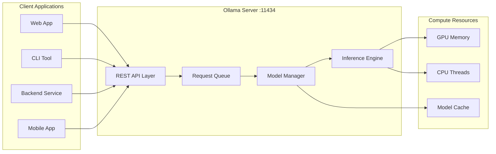
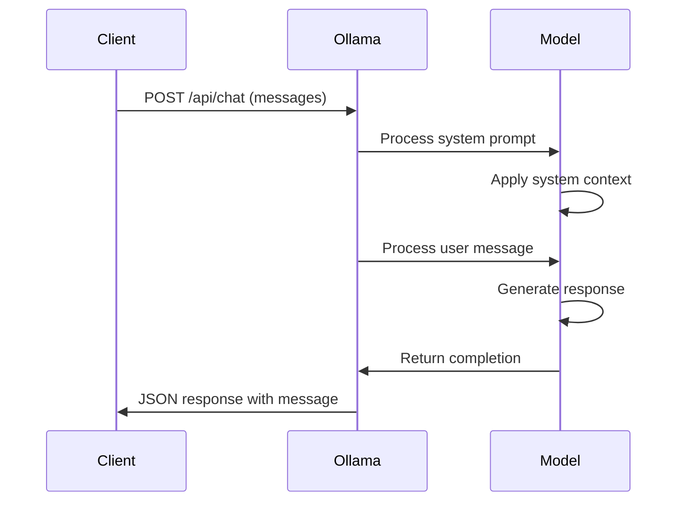
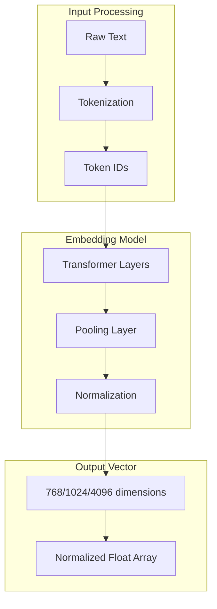
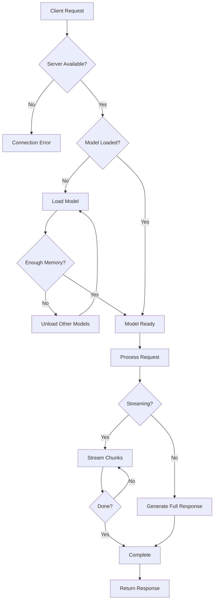

# How to Use Ollama API

Author: [nawazdhandala](https://www.github.com/nawazdhandala)

Tags: Ollama, API, LLM, AI

Description: A comprehensive guide to the Ollama API for building applications with local large language models. Learn REST endpoints, streaming responses, embeddings, model management, and integration patterns.

---

> The Ollama API is your gateway to integrating local LLMs into applications. Whether you are building chatbots, code assistants, or AI-powered workflows, understanding the API deeply unlocks the full potential of local inference.

This guide covers every aspect of the Ollama API, from basic requests to advanced patterns like streaming, embeddings, and multi-modal inputs. By the end, you will be equipped to build production-ready applications that leverage local LLMs effectively.

---

## Understanding the Ollama API Architecture

Before diving into endpoints, let us understand how the Ollama API works.



The Ollama server exposes a REST API on port 11434 by default. Requests flow through a queue to the model manager, which handles loading and unloading models from memory. The inference engine then processes requests using available GPU or CPU resources.

---

## Core API Endpoints

The Ollama API provides several endpoints for different operations. Here is a quick overview:

| Endpoint | Method | Purpose |
|----------|--------|---------|
| `/api/generate` | POST | Text generation with prompts |
| `/api/chat` | POST | Conversational chat completions |
| `/api/embeddings` | POST | Generate vector embeddings |
| `/api/tags` | GET | List available models |
| `/api/show` | POST | Get model details |
| `/api/pull` | POST | Download a model |
| `/api/push` | POST | Upload a model |
| `/api/delete` | DELETE | Remove a model |
| `/api/copy` | POST | Copy/rename a model |
| `/api/create` | POST | Create model from Modelfile |
| `/api/ps` | GET | List running models |
| `/api/version` | GET | Get Ollama version |

---

## The Generate Endpoint

The `/api/generate` endpoint is the foundation for text generation. It takes a prompt and returns a completion.

### Basic Generation Request

This example shows a simple generation request with streaming disabled for easier handling.

```bash
# Send a basic generation request to Ollama
# The stream: false option returns the complete response at once
curl http://localhost:11434/api/generate -d '{
  "model": "llama3.2",
  "prompt": "Explain microservices architecture in three sentences.",
  "stream": false
}'
```

The response includes the generated text along with metadata:

```json
{
  "model": "llama3.2",
  "created_at": "2026-02-02T10:30:00.000Z",
  "response": "Microservices architecture breaks down applications into small, independent services that communicate via APIs. Each service handles a specific business function and can be developed, deployed, and scaled independently. This approach improves flexibility, fault isolation, and enables teams to work autonomously on different parts of the system.",
  "done": true,
  "context": [1, 2, 3, ...],
  "total_duration": 2145000000,
  "load_duration": 50000000,
  "prompt_eval_count": 12,
  "prompt_eval_duration": 245000000,
  "eval_count": 67,
  "eval_duration": 1850000000
}
```

### Understanding Response Fields

Each field in the response provides valuable information:

- **model**: The model used for generation
- **response**: The generated text
- **done**: Indicates completion status
- **context**: Token context for continuing conversations
- **total_duration**: Total processing time in nanoseconds
- **load_duration**: Time spent loading the model
- **prompt_eval_count**: Number of tokens in the prompt
- **eval_count**: Number of tokens generated
- **eval_duration**: Time spent generating tokens

### Generation with Parameters

Fine-tune generation behavior by passing additional parameters.

```bash
# Generate with custom parameters for more controlled output
# temperature controls randomness (lower = more deterministic)
# top_p controls nucleus sampling diversity
# num_ctx sets the context window size
curl http://localhost:11434/api/generate -d '{
  "model": "llama3.2",
  "prompt": "Write a function to validate email addresses",
  "stream": false,
  "options": {
    "temperature": 0.3,
    "top_p": 0.9,
    "top_k": 40,
    "num_ctx": 4096,
    "num_predict": 500,
    "stop": ["```", "def validate"],
    "seed": 42
  }
}'
```

### Key Generation Parameters

| Parameter | Default | Description |
|-----------|---------|-------------|
| temperature | 0.8 | Controls randomness (0.0 to 2.0) |
| top_p | 0.9 | Nucleus sampling threshold |
| top_k | 40 | Limits token selection to top K |
| num_ctx | 2048 | Context window size |
| num_predict | 128 | Maximum tokens to generate |
| stop | [] | Stop sequences to end generation |
| seed | random | Random seed for reproducibility |
| repeat_penalty | 1.1 | Penalty for repeated tokens |
| presence_penalty | 0.0 | Penalty for tokens already present |
| frequency_penalty | 0.0 | Penalty based on token frequency |

---

## The Chat Endpoint

The `/api/chat` endpoint provides a conversational interface with message history support.

### Basic Chat Request

This example demonstrates a simple chat completion with system and user messages.

```bash
# Send a chat request with message history
# Messages include role (system, user, assistant) and content
curl http://localhost:11434/api/chat -d '{
  "model": "llama3.2",
  "messages": [
    {
      "role": "system",
      "content": "You are a helpful DevOps engineer. Keep answers concise."
    },
    {
      "role": "user",
      "content": "What is the difference between Docker and Kubernetes?"
    }
  ],
  "stream": false
}'
```

Response:

```json
{
  "model": "llama3.2",
  "created_at": "2026-02-02T10:35:00.000Z",
  "message": {
    "role": "assistant",
    "content": "Docker is a containerization platform that packages applications with their dependencies. Kubernetes is an orchestration system that manages, scales, and deploys containers across clusters. Docker creates containers; Kubernetes manages them at scale."
  },
  "done": true,
  "total_duration": 1890000000,
  "eval_count": 52
}
```

### Multi-Turn Conversations

Maintain conversation context by including the full message history.

```bash
# Multi-turn conversation with full history
# Include previous messages to maintain context
curl http://localhost:11434/api/chat -d '{
  "model": "llama3.2",
  "messages": [
    {
      "role": "system",
      "content": "You are a Python tutor helping a beginner learn programming."
    },
    {
      "role": "user",
      "content": "What is a list in Python?"
    },
    {
      "role": "assistant",
      "content": "A list in Python is an ordered collection that can hold multiple items. You create one with square brackets: my_list = [1, 2, 3]. Lists are mutable, meaning you can add, remove, or change items after creation."
    },
    {
      "role": "user",
      "content": "How do I add items to it?"
    }
  ],
  "stream": false
}'
```

### Chat Message Flow



---

## Streaming Responses

Streaming delivers tokens as they are generated, improving perceived responsiveness.

### Understanding Streaming

When `stream: true` (the default), Ollama sends newline-delimited JSON objects as tokens are generated.

```bash
# Enable streaming to receive tokens as they generate
# Each line is a separate JSON object
curl http://localhost:11434/api/generate -d '{
  "model": "llama3.2",
  "prompt": "Write a poem about programming"
}'
```

Streaming output arrives line by line:

```json
{"model":"llama3.2","response":"In","done":false}
{"model":"llama3.2","response":" the","done":false}
{"model":"llama3.2","response":" realm","done":false}
{"model":"llama3.2","response":" of","done":false}
...
{"model":"llama3.2","response":"","done":true,"total_duration":2500000000}
```

### Python Streaming Implementation

This example shows how to handle streaming responses in Python.

```python
# streaming_example.py
# Demonstrates handling streaming responses from Ollama API
# Uses the requests library with stream=True for efficient memory usage

import requests
import json

def stream_generate(prompt: str, model: str = "llama3.2") -> None:
    """
    Stream a generation response from Ollama, printing tokens as they arrive.

    Args:
        prompt: The text prompt to send to the model
        model: The model name to use for generation
    """
    url = "http://localhost:11434/api/generate"

    # Prepare the request payload
    payload = {
        "model": model,
        "prompt": prompt,
        "stream": True  # Enable streaming
    }

    # Use requests with stream=True to avoid loading entire response in memory
    with requests.post(url, json=payload, stream=True) as response:
        response.raise_for_status()

        # Process each line as it arrives
        for line in response.iter_lines():
            if line:
                # Parse the JSON chunk
                chunk = json.loads(line)

                # Print the token without newline for continuous output
                print(chunk.get("response", ""), end="", flush=True)

                # Check if generation is complete
                if chunk.get("done"):
                    print()  # Add newline at the end
                    # Print generation statistics
                    print(f"\nTotal tokens: {chunk.get('eval_count', 'N/A')}")
                    print(f"Duration: {chunk.get('total_duration', 0) / 1e9:.2f}s")


def stream_chat(messages: list, model: str = "llama3.2") -> str:
    """
    Stream a chat response and return the complete message.

    Args:
        messages: List of message dictionaries with 'role' and 'content'
        model: The model name to use

    Returns:
        The complete assistant response as a string
    """
    url = "http://localhost:11434/api/chat"

    payload = {
        "model": model,
        "messages": messages,
        "stream": True
    }

    full_response = []

    with requests.post(url, json=payload, stream=True) as response:
        response.raise_for_status()

        for line in response.iter_lines():
            if line:
                chunk = json.loads(line)
                content = chunk.get("message", {}).get("content", "")
                full_response.append(content)
                print(content, end="", flush=True)

                if chunk.get("done"):
                    print()

    return "".join(full_response)


if __name__ == "__main__":
    # Example: Stream a generation
    print("=== Streaming Generation ===")
    stream_generate("Explain what an API is in simple terms")

    print("\n=== Streaming Chat ===")
    messages = [
        {"role": "system", "content": "You are a helpful coding assistant."},
        {"role": "user", "content": "What is REST?"}
    ]
    response = stream_chat(messages)
```

### JavaScript/Node.js Streaming

Handle streaming in Node.js applications.

```javascript
// streaming.js
// Demonstrates streaming Ollama responses in Node.js
// Uses fetch API with ReadableStream for processing

/**
 * Stream a generation response from Ollama
 * @param {string} prompt - The prompt to send
 * @param {string} model - The model name
 */
async function streamGenerate(prompt, model = 'llama3.2') {
    const response = await fetch('http://localhost:11434/api/generate', {
        method: 'POST',
        headers: {
            'Content-Type': 'application/json',
        },
        body: JSON.stringify({
            model: model,
            prompt: prompt,
            stream: true
        })
    });

    // Get the readable stream from the response
    const reader = response.body.getReader();
    const decoder = new TextDecoder();

    let fullResponse = '';

    while (true) {
        const { done, value } = await reader.read();

        if (done) break;

        // Decode the chunk and split by newlines
        const chunk = decoder.decode(value);
        const lines = chunk.split('\n').filter(line => line.trim());

        for (const line of lines) {
            try {
                const json = JSON.parse(line);

                // Process the token
                if (json.response) {
                    process.stdout.write(json.response);
                    fullResponse += json.response;
                }

                // Check if generation is complete
                if (json.done) {
                    console.log('\n');
                    console.log(`Tokens generated: ${json.eval_count}`);
                    console.log(`Duration: ${(json.total_duration / 1e9).toFixed(2)}s`);
                }
            } catch (e) {
                // Handle partial JSON chunks
                continue;
            }
        }
    }

    return fullResponse;
}


/**
 * Stream a chat completion with message history
 * @param {Array} messages - Array of message objects
 * @param {string} model - The model name
 */
async function streamChat(messages, model = 'llama3.2') {
    const response = await fetch('http://localhost:11434/api/chat', {
        method: 'POST',
        headers: {
            'Content-Type': 'application/json',
        },
        body: JSON.stringify({
            model: model,
            messages: messages,
            stream: true
        })
    });

    const reader = response.body.getReader();
    const decoder = new TextDecoder();
    let fullContent = '';

    while (true) {
        const { done, value } = await reader.read();
        if (done) break;

        const chunk = decoder.decode(value);
        const lines = chunk.split('\n').filter(line => line.trim());

        for (const line of lines) {
            try {
                const json = JSON.parse(line);
                const content = json.message?.content || '';
                process.stdout.write(content);
                fullContent += content;
            } catch (e) {
                continue;
            }
        }
    }

    console.log('\n');
    return fullContent;
}


// Example usage
async function main() {
    console.log('=== Streaming Generation ===\n');
    await streamGenerate('What are the benefits of containerization?');

    console.log('\n=== Streaming Chat ===\n');
    await streamChat([
        { role: 'system', content: 'You are a cloud architect.' },
        { role: 'user', content: 'Explain load balancing briefly.' }
    ]);
}

main().catch(console.error);
```

---

## The Embeddings Endpoint

Embeddings convert text into numerical vectors, essential for semantic search and RAG applications.

### Generating Embeddings

Request embeddings for text using the `/api/embeddings` endpoint.

```bash
# Generate embeddings for a text string
# Returns a vector that represents the semantic meaning
curl http://localhost:11434/api/embeddings -d '{
  "model": "nomic-embed-text",
  "prompt": "Kubernetes is a container orchestration platform"
}'
```

Response:

```json
{
  "embedding": [
    0.0023064255,
    -0.009327292,
    0.015465736,
    ...
  ]
}
```

### Batch Embeddings in Python

This example shows how to generate embeddings for multiple documents.

```python
# embeddings_example.py
# Demonstrates generating and using embeddings from Ollama
# Useful for semantic search and RAG applications

import requests
import numpy as np
from typing import List

def get_embedding(text: str, model: str = "nomic-embed-text") -> List[float]:
    """
    Generate an embedding vector for the given text.

    Args:
        text: The text to embed
        model: The embedding model to use

    Returns:
        A list of floats representing the embedding vector
    """
    url = "http://localhost:11434/api/embeddings"

    response = requests.post(url, json={
        "model": model,
        "prompt": text
    })
    response.raise_for_status()

    return response.json()["embedding"]


def get_batch_embeddings(texts: List[str], model: str = "nomic-embed-text") -> List[List[float]]:
    """
    Generate embeddings for multiple texts.

    Args:
        texts: List of texts to embed
        model: The embedding model to use

    Returns:
        List of embedding vectors
    """
    return [get_embedding(text, model) for text in texts]


def cosine_similarity(vec1: List[float], vec2: List[float]) -> float:
    """
    Calculate cosine similarity between two vectors.

    Args:
        vec1: First embedding vector
        vec2: Second embedding vector

    Returns:
        Similarity score between -1 and 1
    """
    v1 = np.array(vec1)
    v2 = np.array(vec2)

    return np.dot(v1, v2) / (np.linalg.norm(v1) * np.linalg.norm(v2))


def find_most_similar(query: str, documents: List[str], model: str = "nomic-embed-text") -> List[tuple]:
    """
    Find the most similar documents to a query.

    Args:
        query: The search query
        documents: List of documents to search
        model: The embedding model to use

    Returns:
        List of (document, similarity_score) tuples, sorted by similarity
    """
    # Generate query embedding
    query_embedding = get_embedding(query, model)

    # Generate document embeddings
    doc_embeddings = get_batch_embeddings(documents, model)

    # Calculate similarities
    similarities = []
    for doc, embedding in zip(documents, doc_embeddings):
        similarity = cosine_similarity(query_embedding, embedding)
        similarities.append((doc, similarity))

    # Sort by similarity (highest first)
    similarities.sort(key=lambda x: x[1], reverse=True)

    return similarities


if __name__ == "__main__":
    # Example: Semantic search over documents
    documents = [
        "Docker containers package applications with dependencies.",
        "Kubernetes orchestrates containers across clusters.",
        "Python is a popular programming language.",
        "PostgreSQL is a relational database system.",
        "Redis is an in-memory data store for caching."
    ]

    query = "How do I deploy containerized applications?"

    print(f"Query: {query}\n")
    print("Results ranked by similarity:")
    print("-" * 50)

    results = find_most_similar(query, documents)

    for doc, score in results:
        print(f"[{score:.4f}] {doc}")
```

### Embeddings Workflow



---

## Model Management API

The Ollama API provides endpoints for managing models programmatically.

### List Models

Retrieve all locally available models.

```bash
# List all downloaded models with their details
curl http://localhost:11434/api/tags
```

Response:

```json
{
  "models": [
    {
      "name": "llama3.2:latest",
      "modified_at": "2026-02-01T10:00:00Z",
      "size": 2147483648,
      "digest": "sha256:abc123...",
      "details": {
        "format": "gguf",
        "family": "llama",
        "parameter_size": "3B",
        "quantization_level": "Q4_K_M"
      }
    },
    {
      "name": "nomic-embed-text:latest",
      "modified_at": "2026-02-01T09:00:00Z",
      "size": 274440192,
      "digest": "sha256:def456...",
      "details": {
        "format": "gguf",
        "family": "nomic-bert",
        "parameter_size": "137M",
        "quantization_level": "F16"
      }
    }
  ]
}
```

### Get Model Information

Retrieve detailed information about a specific model.

```bash
# Get detailed information about a model
curl http://localhost:11434/api/show -d '{
  "name": "llama3.2"
}'
```

### Pull a Model

Download a model from the Ollama library.

```bash
# Pull a model with streaming progress updates
curl http://localhost:11434/api/pull -d '{
  "name": "llama3.2:3b",
  "stream": true
}'
```

### Delete a Model

Remove a model from local storage.

```bash
# Delete a model to free disk space
curl -X DELETE http://localhost:11434/api/delete -d '{
  "name": "llama3.2:1b"
}'
```

### Copy/Rename a Model

Create a copy of an existing model with a new name.

```bash
# Copy a model with a new name
curl http://localhost:11434/api/copy -d '{
  "source": "llama3.2",
  "destination": "my-llama"
}'
```

### List Running Models

Check which models are currently loaded in memory.

```bash
# List models currently loaded in memory
curl http://localhost:11434/api/ps
```

Response:

```json
{
  "models": [
    {
      "name": "llama3.2:latest",
      "model": "llama3.2:latest",
      "size": 3825819519,
      "digest": "abc123...",
      "details": {
        "parent_model": "",
        "format": "gguf",
        "family": "llama",
        "parameter_size": "3B",
        "quantization_level": "Q4_K_M"
      },
      "expires_at": "2026-02-02T11:00:00Z",
      "size_vram": 3825819519
    }
  ]
}
```

---

## Creating Models via API

Create custom models programmatically using the `/api/create` endpoint.

### Create Model from Modelfile

This example creates a custom model with a system prompt and parameters.

```bash
# Create a custom model from a Modelfile specification
# The modelfile parameter contains the Modelfile contents as a string
curl http://localhost:11434/api/create -d '{
  "name": "code-assistant",
  "modelfile": "FROM llama3.2\nSYSTEM \"You are a senior software engineer. Provide clear, well-commented code examples. Follow best practices and explain your reasoning.\"\nPARAMETER temperature 0.4\nPARAMETER top_p 0.9"
}'
```

### Python Model Management

This comprehensive example shows model management operations in Python.

```python
# model_management.py
# Complete model management operations using the Ollama API
# Includes listing, pulling, creating, and deleting models

import requests
from typing import List, Dict, Optional

class OllamaModelManager:
    """
    A class to manage Ollama models through the API.

    Provides methods for listing, pulling, creating, and deleting models.
    """

    def __init__(self, base_url: str = "http://localhost:11434"):
        """
        Initialize the model manager.

        Args:
            base_url: The Ollama server URL
        """
        self.base_url = base_url

    def list_models(self) -> List[Dict]:
        """
        Get all locally available models.

        Returns:
            List of model dictionaries with details
        """
        response = requests.get(f"{self.base_url}/api/tags")
        response.raise_for_status()
        return response.json().get("models", [])

    def get_model_info(self, name: str) -> Dict:
        """
        Get detailed information about a specific model.

        Args:
            name: The model name

        Returns:
            Dictionary with model details
        """
        response = requests.post(
            f"{self.base_url}/api/show",
            json={"name": name}
        )
        response.raise_for_status()
        return response.json()

    def pull_model(self, name: str, callback=None) -> bool:
        """
        Download a model from the Ollama library.

        Args:
            name: The model name to pull
            callback: Optional function called with progress updates

        Returns:
            True if successful
        """
        response = requests.post(
            f"{self.base_url}/api/pull",
            json={"name": name, "stream": True},
            stream=True
        )
        response.raise_for_status()

        for line in response.iter_lines():
            if line and callback:
                import json
                data = json.loads(line)
                callback(data)

        return True

    def delete_model(self, name: str) -> bool:
        """
        Delete a model from local storage.

        Args:
            name: The model name to delete

        Returns:
            True if successful
        """
        response = requests.delete(
            f"{self.base_url}/api/delete",
            json={"name": name}
        )
        response.raise_for_status()
        return True

    def create_model(self, name: str, modelfile: str) -> bool:
        """
        Create a new model from a Modelfile specification.

        Args:
            name: The name for the new model
            modelfile: The Modelfile contents as a string

        Returns:
            True if successful
        """
        response = requests.post(
            f"{self.base_url}/api/create",
            json={"name": name, "modelfile": modelfile},
            stream=True
        )
        response.raise_for_status()

        # Consume the stream to complete creation
        for line in response.iter_lines():
            pass

        return True

    def copy_model(self, source: str, destination: str) -> bool:
        """
        Copy a model with a new name.

        Args:
            source: The source model name
            destination: The new model name

        Returns:
            True if successful
        """
        response = requests.post(
            f"{self.base_url}/api/copy",
            json={"source": source, "destination": destination}
        )
        response.raise_for_status()
        return True

    def list_running(self) -> List[Dict]:
        """
        Get models currently loaded in memory.

        Returns:
            List of running model dictionaries
        """
        response = requests.get(f"{self.base_url}/api/ps")
        response.raise_for_status()
        return response.json().get("models", [])


if __name__ == "__main__":
    manager = OllamaModelManager()

    # List all models
    print("=== Available Models ===")
    for model in manager.list_models():
        size_gb = model["size"] / (1024**3)
        print(f"  {model['name']}: {size_gb:.2f} GB")

    # Show running models
    print("\n=== Running Models ===")
    running = manager.list_running()
    if running:
        for model in running:
            print(f"  {model['name']}")
    else:
        print("  No models currently loaded")

    # Create a custom model
    print("\n=== Creating Custom Model ===")
    modelfile = """FROM llama3.2
SYSTEM "You are a helpful assistant specialized in DevOps and cloud infrastructure."
PARAMETER temperature 0.5
PARAMETER num_ctx 4096"""

    manager.create_model("devops-helper", modelfile)
    print("  Created: devops-helper")
```

---

## OpenAI-Compatible API

Ollama provides an OpenAI-compatible API at `/v1/`, allowing you to use existing OpenAI client libraries.

### Using OpenAI Python Client

This example shows how to use the official OpenAI Python library with Ollama.

```python
# openai_compatible.py
# Use the OpenAI Python library with Ollama's compatible API
# This allows easy migration between local and cloud models

from openai import OpenAI

# Initialize the client pointing to local Ollama server
# The api_key is required but not validated by Ollama
client = OpenAI(
    base_url="http://localhost:11434/v1",
    api_key="ollama"  # Required but can be any string
)

def chat_completion(messages: list, model: str = "llama3.2") -> str:
    """
    Get a chat completion using OpenAI-compatible API.

    Args:
        messages: List of message dictionaries
        model: The model name

    Returns:
        The assistant's response
    """
    response = client.chat.completions.create(
        model=model,
        messages=messages,
        temperature=0.7,
        max_tokens=1000
    )

    return response.choices[0].message.content


def streaming_chat(messages: list, model: str = "llama3.2"):
    """
    Stream a chat completion using OpenAI-compatible API.

    Args:
        messages: List of message dictionaries
        model: The model name
    """
    stream = client.chat.completions.create(
        model=model,
        messages=messages,
        stream=True
    )

    for chunk in stream:
        content = chunk.choices[0].delta.content
        if content:
            print(content, end="", flush=True)

    print()


def generate_embeddings(texts: list, model: str = "nomic-embed-text") -> list:
    """
    Generate embeddings using OpenAI-compatible API.

    Args:
        texts: List of texts to embed
        model: The embedding model

    Returns:
        List of embedding vectors
    """
    response = client.embeddings.create(
        model=model,
        input=texts
    )

    return [item.embedding for item in response.data]


if __name__ == "__main__":
    # Chat completion example
    messages = [
        {"role": "system", "content": "You are a helpful assistant."},
        {"role": "user", "content": "What is Kubernetes?"}
    ]

    print("=== Chat Completion ===")
    response = chat_completion(messages)
    print(response)

    print("\n=== Streaming Chat ===")
    streaming_chat(messages)

    print("\n=== Embeddings ===")
    texts = ["Hello world", "Machine learning is fascinating"]
    embeddings = generate_embeddings(texts)
    print(f"Generated {len(embeddings)} embeddings")
    print(f"Dimension: {len(embeddings[0])}")
```

### API Compatibility Reference

| OpenAI Endpoint | Ollama Equivalent | Support Level |
|----------------|-------------------|---------------|
| `/v1/chat/completions` | Fully supported | Complete |
| `/v1/completions` | Supported | Complete |
| `/v1/embeddings` | Supported | Complete |
| `/v1/models` | Maps to `/api/tags` | Complete |
| `/v1/images/generations` | Not supported | None |
| `/v1/audio/*` | Not supported | None |

---

## Multi-Modal API (Vision Models)

Some Ollama models support image inputs for vision tasks.

### Sending Images with Requests

Send images encoded as base64 with your requests.

```python
# vision_example.py
# Send images to vision-capable models via the Ollama API
# Images must be base64-encoded

import base64
import requests
from pathlib import Path

def encode_image(image_path: str) -> str:
    """
    Encode an image file as base64.

    Args:
        image_path: Path to the image file

    Returns:
        Base64-encoded string
    """
    with open(image_path, "rb") as image_file:
        return base64.b64encode(image_file.read()).decode("utf-8")


def analyze_image(image_path: str, prompt: str, model: str = "llava") -> str:
    """
    Analyze an image using a vision model.

    Args:
        image_path: Path to the image file
        prompt: The question or instruction about the image
        model: The vision model to use (e.g., llava, bakllava)

    Returns:
        The model's analysis of the image
    """
    url = "http://localhost:11434/api/generate"

    # Encode the image
    image_data = encode_image(image_path)

    # Send request with image
    response = requests.post(url, json={
        "model": model,
        "prompt": prompt,
        "images": [image_data],
        "stream": False
    })
    response.raise_for_status()

    return response.json()["response"]


def chat_with_image(image_path: str, messages: list, model: str = "llava") -> str:
    """
    Have a conversation about an image using the chat endpoint.

    Args:
        image_path: Path to the image file
        messages: List of message dictionaries
        model: The vision model to use

    Returns:
        The assistant's response
    """
    url = "http://localhost:11434/api/chat"

    image_data = encode_image(image_path)

    # Add image to the last user message
    for msg in reversed(messages):
        if msg["role"] == "user":
            msg["images"] = [image_data]
            break

    response = requests.post(url, json={
        "model": model,
        "messages": messages,
        "stream": False
    })
    response.raise_for_status()

    return response.json()["message"]["content"]


if __name__ == "__main__":
    # Example: Analyze an image
    image_path = "screenshot.png"

    if Path(image_path).exists():
        # Simple analysis
        result = analyze_image(
            image_path,
            "Describe what you see in this image in detail."
        )
        print("Image Analysis:")
        print(result)

        # Chat about the image
        messages = [
            {"role": "user", "content": "What colors are prominent in this image?"}
        ]
        chat_result = chat_with_image(image_path, messages)
        print("\nChat Response:")
        print(chat_result)
```

---

## Building a Complete Application

Here is a complete example that combines multiple API features into a chatbot application.

```python
# chatbot_app.py
# A complete chatbot application using the Ollama API
# Features: conversation history, streaming, system prompts, and model switching

import requests
import json
from typing import List, Dict, Optional, Generator

class OllamaChatbot:
    """
    A full-featured chatbot using the Ollama API.

    Supports conversation history, streaming responses, custom system prompts,
    and model switching.
    """

    def __init__(
        self,
        model: str = "llama3.2",
        system_prompt: Optional[str] = None,
        base_url: str = "http://localhost:11434"
    ):
        """
        Initialize the chatbot.

        Args:
            model: The default model to use
            system_prompt: Optional system prompt to set context
            base_url: The Ollama server URL
        """
        self.model = model
        self.base_url = base_url
        self.conversation: List[Dict] = []

        if system_prompt:
            self.conversation.append({
                "role": "system",
                "content": system_prompt
            })

    def set_model(self, model: str) -> None:
        """Switch to a different model."""
        self.model = model

    def clear_history(self) -> None:
        """Clear conversation history, keeping system prompt if present."""
        if self.conversation and self.conversation[0]["role"] == "system":
            self.conversation = [self.conversation[0]]
        else:
            self.conversation = []

    def chat(self, message: str, stream: bool = True) -> Generator[str, None, None]:
        """
        Send a message and yield response chunks.

        Args:
            message: The user's message
            stream: Whether to stream the response

        Yields:
            Response text chunks as they arrive
        """
        # Add user message to history
        self.conversation.append({
            "role": "user",
            "content": message
        })

        url = f"{self.base_url}/api/chat"
        payload = {
            "model": self.model,
            "messages": self.conversation,
            "stream": stream
        }

        if stream:
            # Stream the response
            response = requests.post(url, json=payload, stream=True)
            response.raise_for_status()

            full_response = []

            for line in response.iter_lines():
                if line:
                    chunk = json.loads(line)
                    content = chunk.get("message", {}).get("content", "")
                    full_response.append(content)
                    yield content

                    if chunk.get("done"):
                        break

            # Add assistant response to history
            self.conversation.append({
                "role": "assistant",
                "content": "".join(full_response)
            })
        else:
            # Get complete response
            response = requests.post(url, json=payload)
            response.raise_for_status()

            data = response.json()
            assistant_message = data["message"]["content"]

            self.conversation.append({
                "role": "assistant",
                "content": assistant_message
            })

            yield assistant_message

    def get_history(self) -> List[Dict]:
        """Get the full conversation history."""
        return self.conversation.copy()

    def save_history(self, filepath: str) -> None:
        """Save conversation history to a JSON file."""
        with open(filepath, "w") as f:
            json.dump(self.conversation, f, indent=2)

    def load_history(self, filepath: str) -> None:
        """Load conversation history from a JSON file."""
        with open(filepath, "r") as f:
            self.conversation = json.load(f)


def main():
    """Interactive chatbot demo."""
    print("Ollama Chatbot")
    print("Commands: /clear, /model <name>, /save <file>, /load <file>, /quit")
    print("-" * 50)

    # Initialize chatbot with a system prompt
    bot = OllamaChatbot(
        model="llama3.2",
        system_prompt="You are a helpful assistant. Be concise but thorough."
    )

    while True:
        try:
            user_input = input("\nYou: ").strip()

            if not user_input:
                continue

            # Handle commands
            if user_input.startswith("/"):
                parts = user_input.split(maxsplit=1)
                command = parts[0].lower()
                arg = parts[1] if len(parts) > 1 else None

                if command == "/quit":
                    print("Goodbye!")
                    break
                elif command == "/clear":
                    bot.clear_history()
                    print("Conversation cleared.")
                elif command == "/model" and arg:
                    bot.set_model(arg)
                    print(f"Switched to model: {arg}")
                elif command == "/save" and arg:
                    bot.save_history(arg)
                    print(f"History saved to: {arg}")
                elif command == "/load" and arg:
                    bot.load_history(arg)
                    print(f"History loaded from: {arg}")
                else:
                    print("Unknown command")
                continue

            # Send message and stream response
            print("\nAssistant: ", end="", flush=True)
            for chunk in bot.chat(user_input):
                print(chunk, end="", flush=True)
            print()

        except KeyboardInterrupt:
            print("\n\nGoodbye!")
            break
        except Exception as e:
            print(f"\nError: {e}")


if __name__ == "__main__":
    main()
```

---

## Error Handling and Best Practices

### Handling API Errors

Implement proper error handling for robust applications.

```python
# error_handling.py
# Robust error handling for Ollama API requests
# Covers common failure scenarios and retry logic

import requests
import time
from typing import Optional

class OllamaAPIError(Exception):
    """Base exception for Ollama API errors."""
    pass

class ModelNotFoundError(OllamaAPIError):
    """Raised when the requested model is not available."""
    pass

class ServerUnavailableError(OllamaAPIError):
    """Raised when the Ollama server is not reachable."""
    pass

class GenerationError(OllamaAPIError):
    """Raised when generation fails."""
    pass


def safe_generate(
    prompt: str,
    model: str = "llama3.2",
    max_retries: int = 3,
    retry_delay: float = 1.0,
    timeout: int = 120
) -> Optional[str]:
    """
    Generate text with comprehensive error handling and retries.

    Args:
        prompt: The prompt to send
        model: The model to use
        max_retries: Maximum number of retry attempts
        retry_delay: Delay between retries in seconds
        timeout: Request timeout in seconds

    Returns:
        The generated text, or None if all retries fail

    Raises:
        ModelNotFoundError: If the model is not available
        ServerUnavailableError: If the server is not reachable
        GenerationError: If generation fails after all retries
    """
    url = "http://localhost:11434/api/generate"
    payload = {
        "model": model,
        "prompt": prompt,
        "stream": False
    }

    last_error = None

    for attempt in range(max_retries):
        try:
            response = requests.post(
                url,
                json=payload,
                timeout=timeout
            )

            # Handle specific HTTP status codes
            if response.status_code == 404:
                raise ModelNotFoundError(
                    f"Model '{model}' not found. "
                    f"Run 'ollama pull {model}' to download it."
                )

            if response.status_code == 500:
                error_data = response.json()
                error_msg = error_data.get("error", "Unknown server error")
                raise GenerationError(f"Server error: {error_msg}")

            response.raise_for_status()

            data = response.json()
            return data.get("response")

        except requests.exceptions.ConnectionError as e:
            last_error = ServerUnavailableError(
                "Cannot connect to Ollama server. "
                "Make sure it is running with 'ollama serve'."
            )
        except requests.exceptions.Timeout as e:
            last_error = GenerationError(
                f"Request timed out after {timeout} seconds. "
                "Consider using a smaller model or shorter prompt."
            )
        except ModelNotFoundError:
            # Do not retry for model not found
            raise
        except Exception as e:
            last_error = GenerationError(f"Unexpected error: {str(e)}")

        # Wait before retrying
        if attempt < max_retries - 1:
            time.sleep(retry_delay * (attempt + 1))  # Exponential backoff

    if last_error:
        raise last_error

    return None


def check_server_health() -> bool:
    """
    Check if the Ollama server is healthy and responding.

    Returns:
        True if server is healthy, False otherwise
    """
    try:
        response = requests.get(
            "http://localhost:11434/api/version",
            timeout=5
        )
        return response.status_code == 200
    except:
        return False


def check_model_available(model: str) -> bool:
    """
    Check if a specific model is available locally.

    Args:
        model: The model name to check

    Returns:
        True if model is available, False otherwise
    """
    try:
        response = requests.get("http://localhost:11434/api/tags", timeout=10)
        response.raise_for_status()

        models = response.json().get("models", [])
        model_names = [m["name"].split(":")[0] for m in models]

        return model in model_names or model.split(":")[0] in model_names
    except:
        return False


if __name__ == "__main__":
    # Check server health first
    if not check_server_health():
        print("ERROR: Ollama server is not running")
        print("Start it with: ollama serve")
        exit(1)

    print("Server is healthy")

    # Check if model is available
    model = "llama3.2"
    if not check_model_available(model):
        print(f"WARNING: Model '{model}' not found locally")
        print(f"Pull it with: ollama pull {model}")
    else:
        print(f"Model '{model}' is available")

    # Try generation with error handling
    try:
        result = safe_generate(
            "What is 2 + 2?",
            model=model
        )
        print(f"\nGenerated response: {result}")
    except OllamaAPIError as e:
        print(f"\nAPI Error: {e}")
```

### Best Practices Summary

1. **Always handle connection errors** - The Ollama server might not be running
2. **Check model availability** - Verify models exist before using them
3. **Implement timeouts** - Long generations can hang; set appropriate timeouts
4. **Use streaming for UX** - Streaming improves perceived responsiveness
5. **Manage conversation length** - Trim old messages to stay within context limits
6. **Implement retry logic** - Transient failures can be recovered with retries
7. **Log API metrics** - Track latency and token counts for optimization
8. **Validate inputs** - Sanitize prompts to prevent unexpected behavior

---

## Performance Optimization

### Connection Pooling

Use session objects to reuse connections.

```python
# Use a session for connection pooling
import requests

session = requests.Session()

# Reuse the session for multiple requests
response1 = session.post("http://localhost:11434/api/generate", json={...})
response2 = session.post("http://localhost:11434/api/chat", json={...})
```

### Batch Processing

When processing multiple items, batch them efficiently.

```python
# Process items concurrently with a thread pool
from concurrent.futures import ThreadPoolExecutor
import requests

def process_prompt(prompt: str) -> str:
    response = requests.post(
        "http://localhost:11434/api/generate",
        json={"model": "llama3.2", "prompt": prompt, "stream": False}
    )
    return response.json()["response"]

prompts = ["Question 1", "Question 2", "Question 3"]

# Process concurrently (be mindful of model memory)
with ThreadPoolExecutor(max_workers=2) as executor:
    results = list(executor.map(process_prompt, prompts))
```

### Memory Management

Monitor and manage model memory usage.

```python
# Unload models to free memory
import requests

def unload_model(model: str) -> None:
    """Unload a model from memory by sending a request with keep_alive=0."""
    requests.post(
        "http://localhost:11434/api/generate",
        json={
            "model": model,
            "prompt": "",
            "keep_alive": 0
        }
    )
```

---

## API Request Flow



---

## Conclusion

The Ollama API provides a powerful interface for integrating local LLMs into your applications. Key takeaways:

- **Two main generation endpoints**: `/api/generate` for simple completions, `/api/chat` for conversations
- **Streaming is the default**: Use it for better user experience; disable it for simpler code
- **Embeddings enable semantic search**: Essential for RAG and similarity applications
- **OpenAI compatibility**: Existing OpenAI code works with minimal changes
- **Model management is API-driven**: Pull, create, and manage models programmatically
- **Error handling is critical**: Always handle connection failures and model availability

The API's simplicity combined with its OpenAI compatibility makes Ollama an excellent choice for building AI-powered applications that need to run locally, whether for privacy, cost savings, or offline capability.

---

*Need to monitor your AI-powered applications? [OneUptime](https://oneuptime.com) provides comprehensive observability for your infrastructure, including health checks, incident management, and status pages to ensure your services stay reliable.*
