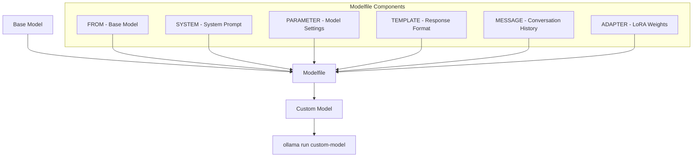
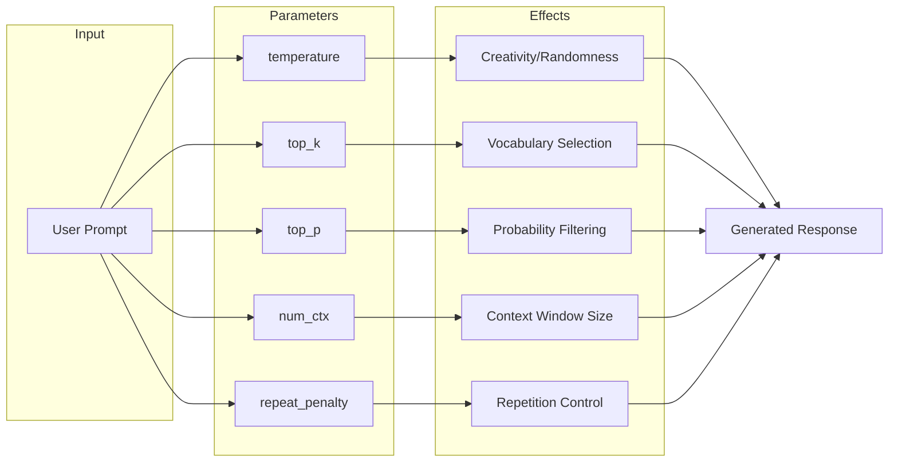
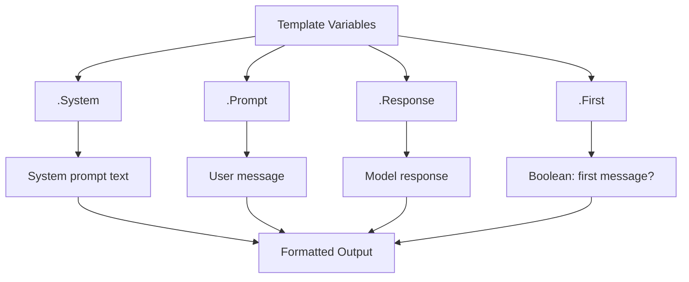
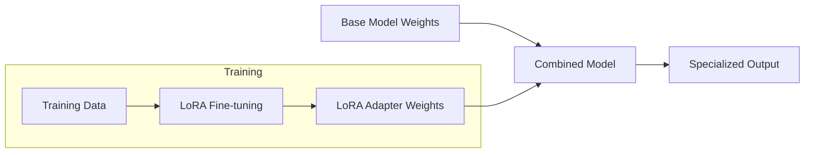
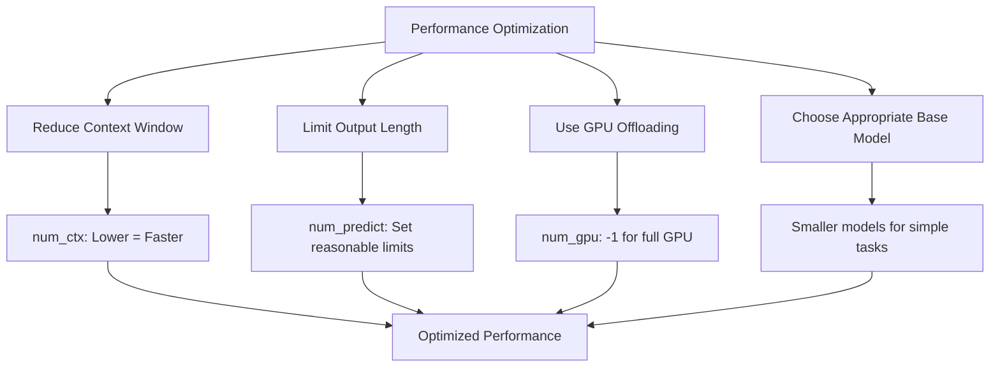

# How to Create Custom Modelfiles in Ollama

Author: [nawazdhandala](https://www.github.com/nawazdhandala)

Tags: Ollama, LLM, AI, Machine Learning, Modelfile, Local AI, Custom Models, Deep Learning

Description: Learn how to create custom Modelfiles in Ollama to fine-tune model behavior, set system prompts, adjust parameters, and build specialized AI assistants that run entirely on your local machine.

---

> Running large language models locally has become incredibly accessible with Ollama, but the real power comes from customizing those models to fit your specific needs. Custom Modelfiles let you create specialized AI assistants with persistent system prompts, optimized parameters, and tailored behavior patterns.

Ollama's Modelfile syntax borrows concepts from Dockerfiles, making it familiar to developers who have worked with containerization. You define a base model, layer on your customizations, and build a new model that inherits the capabilities of the original while adding your specific requirements.

---

## Understanding Modelfiles

A Modelfile is a blueprint for creating custom Ollama models. It specifies the base model, system prompts, parameters, and other configurations that define how your model behaves.

### Modelfile Architecture

The following diagram illustrates how Modelfile components work together to create a customized model.



### Basic Modelfile Structure

Every Modelfile starts with a FROM instruction that specifies the base model. All other instructions are optional and modify the base model's behavior.

```dockerfile
# Modelfile
# Specify the base model - required first instruction
FROM llama3.2

# Set a system prompt that persists across conversations
SYSTEM """You are a helpful coding assistant specializing in Python.
Always provide code examples with detailed comments.
Explain your reasoning step by step."""

# Adjust model parameters for your use case
PARAMETER temperature 0.7
PARAMETER num_ctx 4096
```

---

## Creating Your First Custom Model

Let's build a practical custom model step by step. We'll create a code review assistant that provides structured feedback.

### Step 1: Create the Modelfile

Save the following content to a file named `Modelfile` in your working directory.

```dockerfile
# Modelfile for Code Review Assistant
# Based on the capable llama3.2 model with 8B parameters

FROM llama3.2

# Define the assistant's role and behavior through a detailed system prompt
SYSTEM """You are an expert code reviewer with 15 years of experience in software development.

When reviewing code, you MUST:
1. Check for security vulnerabilities first
2. Identify performance bottlenecks
3. Suggest improvements for readability and maintainability
4. Point out any violations of coding best practices
5. Provide specific, actionable feedback with code examples

Format your reviews as:
## Security Issues
## Performance Concerns
## Code Quality
## Recommendations

Be thorough but constructive. Always explain WHY something is an issue."""

# Lower temperature for more consistent, focused reviews
PARAMETER temperature 0.3

# Increase context window to handle larger code files
PARAMETER num_ctx 8192

# Higher top_k for better code understanding
PARAMETER top_k 50

# Moderate top_p for balanced creativity
PARAMETER top_p 0.9
```

### Step 2: Build the Model

Run the following command in your terminal to create the custom model from your Modelfile.

```bash
# Build the custom model from the Modelfile
# The -f flag specifies the Modelfile path
ollama create code-reviewer -f ./Modelfile
```

### Step 3: Test Your Model

Verify the model works correctly by running a test query.

```bash
# Run the custom model and test with a prompt
ollama run code-reviewer "Review this Python function:

def get_user(id):
    query = f'SELECT * FROM users WHERE id = {id}'
    return db.execute(query)"
```

---

## Advanced Modelfile Parameters

Understanding parameters helps you fine-tune model behavior for specific tasks. Each parameter affects different aspects of text generation.

### Parameter Reference

The following diagram shows how key parameters influence model output.



### Complete Parameter List

Here is a comprehensive Modelfile demonstrating all available parameters with explanations.

```dockerfile
# Modelfile with all available parameters explained
FROM llama3.2

# TEMPERATURE: Controls randomness in output
# Range: 0.0 to 2.0 (default: 0.8)
# Lower values = more focused and deterministic
# Higher values = more creative and varied
PARAMETER temperature 0.7

# TOP_K: Limits vocabulary to top K most likely tokens
# Range: 1 to vocabulary size (default: 40)
# Lower values = more focused on likely words
# Higher values = allows more diverse vocabulary
PARAMETER top_k 40

# TOP_P (nucleus sampling): Cumulative probability threshold
# Range: 0.0 to 1.0 (default: 0.9)
# Lower values = stricter, more predictable
# Higher values = allows more variety
PARAMETER top_p 0.9

# NUM_CTX: Context window size in tokens
# Determines how much conversation history the model remembers
# Larger values require more memory but provide better context
PARAMETER num_ctx 4096

# NUM_PREDICT: Maximum tokens to generate
# -1 for unlimited, or set a specific limit
# Useful for controlling response length
PARAMETER num_predict 1024

# REPEAT_PENALTY: Penalizes repeated tokens
# Range: 0.0 to 2.0 (default: 1.1)
# Higher values reduce repetition
PARAMETER repeat_penalty 1.1

# REPEAT_LAST_N: Tokens to consider for repeat penalty
# How far back to look for repetitions
PARAMETER repeat_last_n 64

# SEED: Random seed for reproducible outputs
# Set a specific value for deterministic results
# Useful for testing and debugging
PARAMETER seed 42

# STOP: Stop sequences that end generation
# Model stops when it generates any of these
PARAMETER stop "<|endoftext|>"
PARAMETER stop "Human:"
PARAMETER stop "Assistant:"

# MIROSTAT: Alternative sampling method
# 0 = disabled, 1 = Mirostat, 2 = Mirostat 2.0
PARAMETER mirostat 0

# MIROSTAT_TAU: Target entropy for Mirostat
# Lower = more focused, Higher = more diverse
PARAMETER mirostat_tau 5.0

# MIROSTAT_ETA: Learning rate for Mirostat
PARAMETER mirostat_eta 0.1

# NUM_GPU: Number of GPU layers to offload
# -1 = all layers, 0 = CPU only
PARAMETER num_gpu -1

# NUM_THREAD: CPU threads for computation
# Defaults to number of physical cores
PARAMETER num_thread 8
```

---

## Building Specialized Assistants

Different use cases require different configurations. Below are templates for common scenarios.

### Technical Documentation Writer

A model optimized for generating clear, accurate technical documentation.

```dockerfile
# Modelfile for Technical Documentation Writer
FROM llama3.2

SYSTEM """You are a technical documentation specialist who creates clear,
comprehensive documentation for software projects.

Your documentation style:
- Use clear, concise language avoiding jargon when possible
- Include practical code examples for every concept
- Structure content with proper headings and bullet points
- Add notes, warnings, and tips where appropriate
- Write for developers of varying skill levels

Always include:
1. Overview/Introduction
2. Prerequisites
3. Step-by-step instructions
4. Code examples with comments
5. Troubleshooting section
6. Related resources"""

# Moderate temperature for balanced creativity and accuracy
PARAMETER temperature 0.5

# Extended context for longer documents
PARAMETER num_ctx 8192

# Allow longer responses for comprehensive documentation
PARAMETER num_predict 4096

# Reduce repetition in longer content
PARAMETER repeat_penalty 1.15
```

### SQL Query Assistant

A model specialized for database queries and optimization.

```dockerfile
# Modelfile for SQL Query Assistant
FROM llama3.2

SYSTEM """You are a database expert specializing in SQL query optimization and design.

When helping with SQL:
- Always consider query performance and indexing
- Explain execution plans when relevant
- Suggest appropriate indexes for common queries
- Warn about potential issues (N+1 queries, full table scans)
- Support PostgreSQL, MySQL, and SQLite syntax differences

Format your responses:
1. The SQL query with comments
2. Explanation of what it does
3. Performance considerations
4. Alternative approaches if applicable"""

# Lower temperature for precise, accurate queries
PARAMETER temperature 0.2

# Focused vocabulary for technical accuracy
PARAMETER top_k 30

# Strong repetition penalty to avoid redundant clauses
PARAMETER repeat_penalty 1.2

# Standard context window
PARAMETER num_ctx 4096

# Stop generating if it starts explaining unrelated topics
PARAMETER stop "Unrelated:"
PARAMETER stop "Off-topic:"
```

### Creative Writing Partner

A model configured for storytelling and creative content.

```dockerfile
# Modelfile for Creative Writing Partner
FROM llama3.2

SYSTEM """You are a creative writing partner with expertise in storytelling,
character development, and narrative structure.

Your approach to creative writing:
- Embrace vivid, descriptive language
- Develop complex, believable characters
- Build tension and pacing naturally
- Use dialogue that reveals character
- Maintain consistent tone and voice
- Suggest plot developments without taking over the story

When collaborating:
- Ask clarifying questions about the writer's vision
- Offer multiple options for plot directions
- Provide constructive feedback on drafts
- Help overcome writer's block with prompts and exercises"""

# Higher temperature for creative variety
PARAMETER temperature 0.9

# Wider vocabulary selection for richer language
PARAMETER top_k 60

# Higher top_p for more creative freedom
PARAMETER top_p 0.95

# Extended context for longer narratives
PARAMETER num_ctx 8192

# Generous token limit for detailed responses
PARAMETER num_predict 2048

# Lower repeat penalty to allow stylistic repetition
PARAMETER repeat_penalty 1.05
```

---

## Using Templates for Custom Response Formats

Templates give you fine-grained control over how the model formats its responses. Ollama uses Go template syntax.

### Template Variables

The following diagram shows the flow of variables through the template system.



### Custom Template Example

Here is a Modelfile that uses a custom template to structure conversations in a specific format.

```dockerfile
# Modelfile with custom response template
FROM llama3.2

SYSTEM """You are a helpful assistant that provides structured responses."""

# Custom template using Go template syntax
# This creates a specific conversation format
TEMPLATE """{{ if .System }}<|system|>
{{ .System }}<|end|>
{{ end }}{{ if .Prompt }}<|user|>
{{ .Prompt }}<|end|>
{{ end }}<|assistant|>
{{ .Response }}<|end|>
"""

# Parameters optimized for structured output
PARAMETER temperature 0.5
PARAMETER num_ctx 4096
PARAMETER stop "<|end|>"
PARAMETER stop "<|user|>"
```

### JSON Output Template

A template designed to encourage JSON-formatted responses, useful for API integrations.

```dockerfile
# Modelfile for JSON Output
FROM llama3.2

SYSTEM """You are an API assistant that ALWAYS responds in valid JSON format.
Never include explanations outside the JSON structure.
Always use proper JSON syntax with double quotes for strings."""

TEMPLATE """{{ if .System }}<|system|>
{{ .System }}
Important: Respond ONLY with valid JSON. No other text.<|end|>
{{ end }}{{ if .Prompt }}<|user|>
Return a JSON response for: {{ .Prompt }}<|end|>
{{ end }}<|assistant|>
```json
{{ .Response }}
```<|end|>
"""

# Very low temperature for consistent JSON formatting
PARAMETER temperature 0.1

# Focused generation
PARAMETER top_k 20
PARAMETER top_p 0.8

# Stop at JSON end markers
PARAMETER stop "```"
PARAMETER stop "\n\n"
```

---

## Adding Conversation History with MESSAGE

The MESSAGE instruction lets you pre-seed conversations with example interactions, helping the model understand the expected response style.

### Few-Shot Learning Example

Pre-seeded messages teach the model your expected format through examples.

```dockerfile
# Modelfile with conversation history for few-shot learning
FROM llama3.2

SYSTEM """You are a sentiment analysis assistant.
Analyze text and respond with exactly one word: POSITIVE, NEGATIVE, or NEUTRAL."""

# Example conversations that teach the model the expected format
MESSAGE user "I absolutely love this product! Best purchase ever!"
MESSAGE assistant "POSITIVE"

MESSAGE user "The service was okay, nothing special but no complaints."
MESSAGE assistant "NEUTRAL"

MESSAGE user "Terrible experience. Would not recommend to anyone."
MESSAGE assistant "NEGATIVE"

MESSAGE user "The food arrived cold and the delivery was late."
MESSAGE assistant "NEGATIVE"

# Very low temperature for consistent classification
PARAMETER temperature 0.1

# Minimal generation needed
PARAMETER num_predict 10

# Focused vocabulary
PARAMETER top_k 10
```

### Complex Multi-Turn Example

For more complex tasks, multiple example exchanges help establish patterns.

```dockerfile
# Modelfile for code explanation with detailed examples
FROM llama3.2

SYSTEM """You are a code explainer. Given code, explain what it does
in simple terms that a junior developer can understand."""

# First example: Python list comprehension
MESSAGE user """Explain this code:
squares = [x**2 for x in range(10)]"""

MESSAGE assistant """Breaking down this code:

1. `range(10)` creates numbers 0 through 9
2. `for x in range(10)` loops through each number
3. `x**2` calculates the square of each number
4. `[...]` collects all results into a list

Result: `squares` contains [0, 1, 4, 9, 16, 25, 36, 49, 64, 81]

In plain English: Create a list containing the squares of numbers 0-9."""

# Second example: JavaScript async/await
MESSAGE user """Explain this code:
const data = await fetch(url).then(res => res.json());"""

MESSAGE assistant """Breaking down this code:

1. `fetch(url)` sends an HTTP request to the URL
2. `.then(res => res.json())` waits for response, then parses it as JSON
3. `await` pauses execution until the data is ready
4. `const data` stores the parsed JSON result

Result: `data` contains whatever JSON the server returned.

In plain English: Fetch data from a URL and parse the JSON response."""

PARAMETER temperature 0.4
PARAMETER num_ctx 4096
```

---

## Integrating LoRA Adapters

LoRA (Low-Rank Adaptation) adapters allow you to add fine-tuned weights on top of a base model without modifying the original weights.

### LoRA Integration Flow

The following diagram shows how LoRA adapters modify model behavior.



### Using ADAPTER Instruction

If you have trained a LoRA adapter (using tools like PEFT or LLaMA-Factory), you can integrate it into your Modelfile.

```dockerfile
# Modelfile with LoRA adapter
# Base model provides general capabilities
FROM llama3.2

# Path to your trained LoRA adapter weights
# Adapters are typically in safetensors or GGML format
ADAPTER ./my-custom-adapter

# System prompt complementing the fine-tuned behavior
SYSTEM """You are a specialized assistant fine-tuned for medical terminology.
Always use precise medical language and cite sources when possible."""

# Parameters tuned for the adapter's training
PARAMETER temperature 0.3
PARAMETER num_ctx 4096
```

### Multiple Adapters Pattern

While Ollama supports one adapter per model, you can create multiple models with different adapters.

```bash
# Create specialized models from the same base with different adapters
ollama create medical-assistant -f ./Modelfile.medical
ollama create legal-assistant -f ./Modelfile.legal
ollama create finance-assistant -f ./Modelfile.finance
```

---

## Managing Custom Models

Effective model management helps you organize and maintain your custom models.

### Building and Versioning

The build script below creates versioned models and provides management commands.

```bash
#!/bin/bash
# build-models.sh - Script to build and manage custom Ollama models

# Set version for tracking changes
VERSION="1.2.0"

# Build code reviewer model with version tag
echo "Building code-reviewer:${VERSION}..."
ollama create "code-reviewer:${VERSION}" -f ./modelfiles/code-reviewer.Modelfile

# Also tag as latest for convenience
ollama create "code-reviewer:latest" -f ./modelfiles/code-reviewer.Modelfile

# Build documentation writer
echo "Building doc-writer:${VERSION}..."
ollama create "doc-writer:${VERSION}" -f ./modelfiles/doc-writer.Modelfile
ollama create "doc-writer:latest" -f ./modelfiles/doc-writer.Modelfile

# List all custom models
echo ""
echo "Available custom models:"
ollama list | grep -E "(code-reviewer|doc-writer)"
```

### Model Information Commands

Use these commands to inspect and manage your models.

```bash
# List all installed models
ollama list

# Show detailed information about a specific model
# Includes parameter settings, system prompt, and template
ollama show code-reviewer

# Show just the Modelfile used to create a model
ollama show code-reviewer --modelfile

# Show the model's license information
ollama show code-reviewer --license

# Remove a model when no longer needed
ollama rm code-reviewer:1.0.0

# Copy a model to create a new version
ollama cp code-reviewer code-reviewer-backup
```

### Testing Models Programmatically

Here is a Python script to test your custom models systematically.

```python
# test_models.py
# Automated testing script for custom Ollama models

import subprocess
import json
from typing import Optional

def query_model(model: str, prompt: str, timeout: int = 60) -> Optional[str]:
    """
    Send a prompt to an Ollama model and return the response.

    Args:
        model: Name of the Ollama model to query
        prompt: The prompt text to send
        timeout: Maximum seconds to wait for response

    Returns:
        Model response text, or None if an error occurred
    """
    try:
        # Use ollama run command with echo to pipe the prompt
        result = subprocess.run(
            ["ollama", "run", model],
            input=prompt,
            capture_output=True,
            text=True,
            timeout=timeout
        )
        return result.stdout.strip()
    except subprocess.TimeoutExpired:
        print(f"Timeout waiting for {model}")
        return None
    except Exception as e:
        print(f"Error querying {model}: {e}")
        return None


def test_code_reviewer():
    """Test the code-reviewer model with a known problematic code sample."""

    test_code = '''
def get_user(user_id):
    query = f"SELECT * FROM users WHERE id = {user_id}"
    return db.execute(query)
'''

    print("Testing code-reviewer model...")
    print("-" * 50)

    response = query_model("code-reviewer", f"Review this code:\n{test_code}")

    if response:
        # Check if the model identified the SQL injection vulnerability
        if "sql injection" in response.lower() or "injection" in response.lower():
            print("PASS: Model correctly identified SQL injection risk")
        else:
            print("WARN: Model may have missed SQL injection vulnerability")

        print("\nResponse preview:")
        print(response[:500] + "..." if len(response) > 500 else response)
    else:
        print("FAIL: No response received")


def test_sentiment_analyzer():
    """Test the sentiment analysis model with known samples."""

    test_cases = [
        ("I love this product!", "POSITIVE"),
        ("Worst experience ever.", "NEGATIVE"),
        ("It was okay.", "NEUTRAL"),
    ]

    print("\nTesting sentiment-analyzer model...")
    print("-" * 50)

    passed = 0
    for text, expected in test_cases:
        response = query_model("sentiment-analyzer", text)
        if response and expected.lower() in response.lower():
            print(f"PASS: '{text}' -> {response.strip()}")
            passed += 1
        else:
            print(f"FAIL: '{text}' -> {response} (expected {expected})")

    print(f"\nResults: {passed}/{len(test_cases)} passed")


if __name__ == "__main__":
    test_code_reviewer()
    test_sentiment_analyzer()
```

---

## Best Practices for Modelfiles

Follow these guidelines to create effective, maintainable custom models.

### Organization Structure

Maintain a consistent directory structure for your Modelfiles.

```
ollama-models/
├── modelfiles/
│   ├── code-reviewer.Modelfile
│   ├── doc-writer.Modelfile
│   ├── sql-assistant.Modelfile
│   └── creative-writer.Modelfile
├── adapters/
│   └── custom-adapter/
├── tests/
│   └── test_models.py
├── build.sh
└── README.md
```

### Modelfile Best Practices

Key recommendations for writing effective Modelfiles:

```dockerfile
# BEST PRACTICES EXAMPLE
# 1. Always add comments explaining the model's purpose
# 2. Use descriptive system prompts with clear instructions
# 3. Set parameters explicitly rather than relying on defaults
# 4. Include stop sequences to prevent runaway generation
# 5. Test thoroughly before deployment

FROM llama3.2

# Purpose: API endpoint classifier for routing requests
# Author: team@example.com
# Version: 2.1.0
# Last Updated: 2026-02-02

SYSTEM """You classify API requests into categories for routing.
Categories: AUTH, USER, BILLING, SUPPORT, OTHER
Respond with ONLY the category name, nothing else."""

# Explicit parameters for reproducible behavior
PARAMETER temperature 0.1
PARAMETER top_k 20
PARAMETER top_p 0.9
PARAMETER num_ctx 2048
PARAMETER num_predict 10

# Stop sequences prevent extra output
PARAMETER stop "\n"
PARAMETER stop " "
PARAMETER stop "."
```

### Performance Optimization Tips



---

## Troubleshooting Common Issues

### Model Not Responding as Expected

When your model does not follow the system prompt, try these fixes.

```dockerfile
# Issue: Model ignores system prompt
# Solution: Reinforce instructions in the template

FROM llama3.2

SYSTEM """You MUST respond only in JSON format. No other text allowed."""

# Reinforce in template
TEMPLATE """{{ if .System }}<|system|>
CRITICAL: {{ .System }}
Remember: JSON ONLY. No explanations.<|end|>
{{ end }}<|user|>
{{ .Prompt }}<|end|>
<|assistant|>
{{ .Response }}"""

# Lower temperature helps with instruction following
PARAMETER temperature 0.1
```

### Output Too Long or Too Short

Adjust these parameters to control response length.

```dockerfile
# For shorter responses
PARAMETER num_predict 256
PARAMETER stop "\n\n"
PARAMETER temperature 0.3

# For longer, more detailed responses
PARAMETER num_predict 4096
PARAMETER repeat_penalty 1.15
PARAMETER temperature 0.6
```

### Model Running Slowly

Check these common causes and solutions.

```bash
# Check if GPU is being used
ollama run code-reviewer "test" --verbose

# Common fixes in Modelfile:
# 1. Reduce context window
PARAMETER num_ctx 2048

# 2. Ensure GPU offloading is enabled
PARAMETER num_gpu -1

# 3. Use a smaller base model for simple tasks
FROM llama3.2:3b  # Instead of 8B or larger
```

---

## Conclusion

Custom Modelfiles in Ollama provide a powerful way to create specialized AI assistants tailored to your specific needs. By understanding the available instructions and parameters, you can build models that excel at particular tasks while running entirely on your local machine.

Key takeaways:
- Start with a solid base model and layer customizations
- Write detailed system prompts that clearly define expected behavior
- Tune parameters based on your use case (precision vs creativity)
- Use templates for structured output formats
- Pre-seed conversations with MESSAGE for consistent response styles
- Test your models systematically before deployment

The combination of local execution, customization flexibility, and no API costs makes Ollama with custom Modelfiles an excellent choice for development, testing, and production AI workloads.

---

*Running AI models locally? [OneUptime](https://oneuptime.com) helps you monitor your AI infrastructure, track model performance, and ensure your local LLM deployments stay healthy and responsive.*

**Related Reading:**
- [How to Monitor LLM with OpenLIT and OneUptime](https://oneuptime.com/blog/post/2024-09-13-monitoring-llm-with-openlit-and-oneuptime/view)
