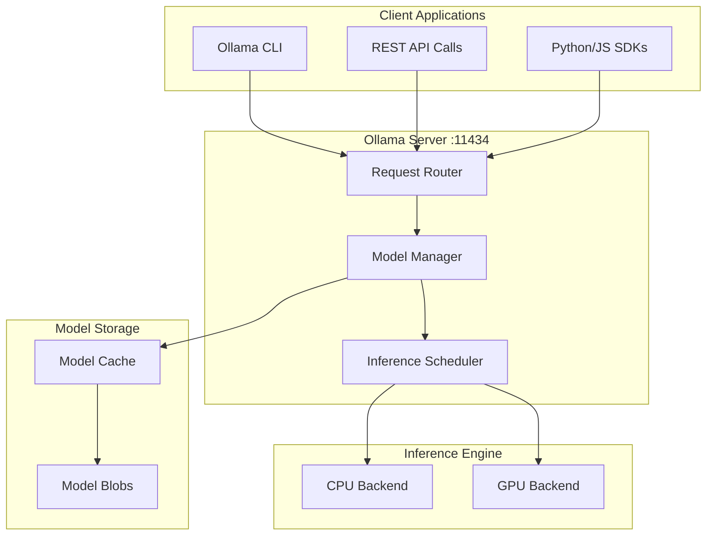

# How to Install and Configure Ollama

Author: [nawazdhandala](https://www.github.com/nawazdhandala)

Tags: Ollama, LLM, AI, Local AI, Machine Learning

Description: Learn how to install and configure Ollama to run large language models locally on your machine with complete privacy and zero API costs.

---

> Running LLMs locally has gone from "nice to have" to "essential" for many development workflows. Ollama makes this surprisingly simple, letting you run models like Llama 3, Mistral, and CodeLlama on your own hardware without sending data to external APIs.

Whether you're building AI-powered applications, experimenting with different models, or just want to keep your data private, Ollama provides a straightforward path to local LLM inference.

---

## What is Ollama?

Ollama is an open-source tool that lets you run large language models locally. It handles model management, optimization, and provides a simple API that mirrors OpenAI's interface - making it easy to switch between local and cloud-based models.

Key benefits:
- **Privacy**: Your data never leaves your machine
- **Cost**: No API fees after the initial setup
- **Speed**: No network latency for inference
- **Offline**: Works without internet after downloading models

---

## Installation

### macOS

The easiest way to install Ollama on macOS is through the official installer or Homebrew.

Download and run the installer from the Ollama website, or use Homebrew:

```bash
# Install Ollama using Homebrew
brew install ollama
```

### Linux

On Linux, Ollama provides a single-line installation script that works across most distributions:

```bash
# Download and run the official install script
curl -fsSL https://ollama.com/install.sh | sh
```

For manual installation or if you prefer not to pipe to shell, you can download the binary directly:

```bash
# Download the Linux binary
curl -L https://ollama.com/download/ollama-linux-amd64 -o ollama

# Make it executable
chmod +x ollama

# Move to a directory in your PATH
sudo mv ollama /usr/local/bin/
```

### Windows

On Windows, download the installer from the Ollama website and run it. Alternatively, use Windows Package Manager:

```powershell
# Install using winget
winget install Ollama.Ollama
```

### Docker

If you prefer containerized deployments, Ollama provides an official Docker image:

```bash
# Pull the official Ollama image
docker pull ollama/ollama

# Run Ollama container with GPU support (NVIDIA)
docker run -d --gpus all -v ollama:/root/.ollama -p 11434:11434 --name ollama ollama/ollama

# Run without GPU (CPU only)
docker run -d -v ollama:/root/.ollama -p 11434:11434 --name ollama ollama/ollama
```

---

## Starting Ollama

After installation, you need to start the Ollama server before you can use it.

### Starting the Server

Start the Ollama background service that handles model inference:

```bash
# Start Ollama server in the background
ollama serve
```

On macOS and Windows, the desktop application starts the server automatically. On Linux, you might want to set up a systemd service for automatic startup.

Create a systemd service file for automatic startup on Linux:

```bash
# Create systemd service file
sudo tee /etc/systemd/system/ollama.service > /dev/null <<EOF
[Unit]
Description=Ollama Server
After=network-online.target

[Service]
ExecStart=/usr/local/bin/ollama serve
User=ollama
Group=ollama
Restart=always
RestartSec=3
Environment="PATH=/usr/local/bin:/usr/bin:/bin"

[Install]
WantedBy=multi-user.target
EOF

# Create ollama user
sudo useradd -r -s /bin/false -m -d /usr/share/ollama ollama

# Enable and start the service
sudo systemctl daemon-reload
sudo systemctl enable ollama
sudo systemctl start ollama

# Check status
sudo systemctl status ollama
```

---

## Downloading and Running Models

With the server running, you can pull and run models.

### Pull a Model

Download a model before running it. Ollama maintains a library of optimized models:

```bash
# Pull the Llama 3.2 model (default size)
ollama pull llama3.2

# Pull a specific size variant
ollama pull llama3.2:1b    # 1 billion parameters - fast, less capable
ollama pull llama3.2:3b    # 3 billion parameters - balanced

# Pull other popular models
ollama pull mistral        # Mistral 7B - great for general use
ollama pull codellama      # Optimized for code generation
ollama pull phi3           # Microsoft's small but capable model
ollama pull gemma2         # Google's open model
```

### Run a Model Interactively

Start an interactive chat session with a model:

```bash
# Start interactive chat with Llama 3.2
ollama run llama3.2
```

This opens a chat interface where you can type prompts and get responses. Type `/bye` to exit.

### List Available Models

See which models you have downloaded locally:

```bash
# List all downloaded models
ollama list

# Example output:
# NAME              ID            SIZE     MODIFIED
# llama3.2:latest   a80c4f17acd5  2.0 GB   2 hours ago
# mistral:latest    61e88e884507  4.1 GB   1 day ago
# codellama:latest  8fdf8f752f6e  3.8 GB   3 days ago
```

### Remove a Model

Delete models you no longer need to free up disk space:

```bash
# Remove a specific model
ollama rm codellama

# Remove a specific version
ollama rm llama3.2:1b
```

---

## Using the API

Ollama exposes a REST API that's compatible with many existing tools and libraries.

### Basic API Usage

The Ollama API runs on port 11434 by default. Here's how to interact with it using curl:

```bash
# Generate a completion
curl http://localhost:11434/api/generate -d '{
  "model": "llama3.2",
  "prompt": "Explain kubernetes in one paragraph",
  "stream": false
}'

# Chat completion (conversation format)
curl http://localhost:11434/api/chat -d '{
  "model": "llama3.2",
  "messages": [
    {"role": "user", "content": "What is Docker?"}
  ],
  "stream": false
}'
```

### Python Integration

Use Ollama with Python using the official library or requests:

```python
# Install the official Ollama Python library
# pip install ollama

import ollama

# Simple generation
response = ollama.generate(
    model='llama3.2',
    prompt='Write a Python function to calculate factorial'
)
print(response['response'])

# Chat conversation with message history
messages = [
    {'role': 'system', 'content': 'You are a helpful coding assistant.'},
    {'role': 'user', 'content': 'How do I read a JSON file in Python?'}
]

response = ollama.chat(model='llama3.2', messages=messages)
print(response['message']['content'])

# Streaming responses for real-time output
for chunk in ollama.chat(
    model='llama3.2',
    messages=[{'role': 'user', 'content': 'Explain REST APIs'}],
    stream=True
):
    print(chunk['message']['content'], end='', flush=True)
```

### Using with OpenAI-Compatible Libraries

Ollama's API is compatible with OpenAI's format, so you can use existing OpenAI client libraries:

```python
# pip install openai

from openai import OpenAI

# Point the OpenAI client to Ollama's local server
client = OpenAI(
    base_url='http://localhost:11434/v1',
    api_key='ollama'  # Required but not validated
)

# Use the familiar OpenAI interface
response = client.chat.completions.create(
    model='llama3.2',
    messages=[
        {'role': 'system', 'content': 'You are a helpful assistant.'},
        {'role': 'user', 'content': 'What is the capital of France?'}
    ]
)

print(response.choices[0].message.content)
```

### Node.js Integration

Use Ollama from Node.js applications:

```javascript
// Using the official ollama-js library
// npm install ollama

import ollama from 'ollama';

// Simple generation
async function generate() {
  const response = await ollama.generate({
    model: 'llama3.2',
    prompt: 'Write a haiku about programming'
  });
  console.log(response.response);
}

// Chat with streaming
async function streamChat() {
  const response = await ollama.chat({
    model: 'llama3.2',
    messages: [{ role: 'user', content: 'Explain async/await' }],
    stream: true
  });

  // Process the stream
  for await (const part of response) {
    process.stdout.write(part.message.content);
  }
}

generate();
```

---

## Creating Custom Models

You can create custom models with specific behaviors using Modelfiles.

### Modelfile Basics

A Modelfile defines how to customize a base model. Create a file named `Modelfile`:

```dockerfile
# Start from a base model
FROM llama3.2

# Set the system prompt that defines the model's personality
SYSTEM """
You are a senior DevOps engineer with expertise in Kubernetes, Docker,
and cloud infrastructure. You provide concise, practical answers with
code examples when relevant. You prefer YAML for configuration files.
"""

# Adjust model parameters
PARAMETER temperature 0.7
PARAMETER top_p 0.9
PARAMETER num_ctx 4096
```

Build and use your custom model:

```bash
# Create the custom model from the Modelfile
ollama create devops-assistant -f Modelfile

# Run your custom model
ollama run devops-assistant

# List models to confirm it was created
ollama list
```

### Advanced Modelfile Options

Here's a more comprehensive Modelfile example with additional options:

```dockerfile
FROM codellama:13b

# System prompt for code-focused assistance
SYSTEM """
You are an expert Python developer. Follow these rules:
1. Always include type hints in function signatures
2. Add docstrings to all functions
3. Prefer list comprehensions over loops when appropriate
4. Use f-strings for string formatting
5. Follow PEP 8 style guidelines
"""

# Temperature controls randomness (0.0-1.0)
# Lower = more deterministic, higher = more creative
PARAMETER temperature 0.3

# Controls diversity of token selection
PARAMETER top_p 0.95

# Context window size in tokens
PARAMETER num_ctx 8192

# Stop sequences - model stops generating when it sees these
PARAMETER stop "```"
PARAMETER stop "</code>"

# Number of tokens to keep from initial prompt
PARAMETER num_keep 24
```

---

## Configuration Options

### Environment Variables

Configure Ollama behavior through environment variables:

```bash
# Set the host and port Ollama listens on
export OLLAMA_HOST=0.0.0.0:11434

# Change the directory where models are stored
export OLLAMA_MODELS=/path/to/models

# Set maximum loaded models in memory
export OLLAMA_MAX_LOADED_MODELS=2

# Keep models loaded in memory for this duration
export OLLAMA_KEEP_ALIVE=5m

# Enable debug logging
export OLLAMA_DEBUG=1
```

### GPU Configuration

Ollama automatically detects and uses available GPUs. For specific configurations:

```bash
# Use specific NVIDIA GPU(s) by index
export CUDA_VISIBLE_DEVICES=0,1

# Limit GPU memory usage (in MB)
export OLLAMA_GPU_MEMORY=8192

# Force CPU-only mode
export OLLAMA_NO_GPU=1
```

### Memory Management

Control how Ollama manages model memory:

```bash
# Set how long to keep models loaded after last use
# Default is 5 minutes, use 0 to unload immediately
export OLLAMA_KEEP_ALIVE=10m

# Limit the number of models loaded simultaneously
export OLLAMA_MAX_LOADED_MODELS=1
```

---

## Architecture Overview

Understanding how Ollama works helps with troubleshooting and optimization.



---

## Common Use Cases

### Code Generation and Review

Set up a coding assistant that runs entirely locally:

```bash
# Pull a code-optimized model
ollama pull codellama:13b

# Create a code review assistant
cat > Modelfile <<EOF
FROM codellama:13b
SYSTEM "You are a code reviewer. Analyze code for bugs, security issues, and suggest improvements. Be concise and specific."
PARAMETER temperature 0.2
EOF

ollama create code-reviewer -f Modelfile
ollama run code-reviewer
```

### Document Summarization

For processing internal documents without sending them to external APIs:

```python
import ollama

def summarize_document(text: str) -> str:
    """Summarize a document using local LLM."""
    response = ollama.generate(
        model='llama3.2',
        prompt=f"""Summarize the following document in 3-5 bullet points:

{text}

Summary:""",
        options={
            'temperature': 0.3,  # Low temperature for factual summary
            'num_ctx': 8192      # Larger context for long documents
        }
    )
    return response['response']

# Example usage
document = open('report.txt').read()
summary = summarize_document(document)
print(summary)
```

### Local RAG Pipeline

Build a retrieval-augmented generation system that keeps all data local:

```python
import ollama
from typing import List

def simple_rag(query: str, context_docs: List[str]) -> str:
    """Simple RAG implementation using Ollama."""

    # Combine context documents into a single context string
    context = "\n\n---\n\n".join(context_docs)

    # Create prompt with context and query
    prompt = f"""Use the following context to answer the question.
If the answer is not in the context, say "I don't have enough information."

Context:
{context}

Question: {query}

Answer:"""

    # Generate response using local model
    response = ollama.generate(
        model='llama3.2',
        prompt=prompt,
        options={
            'temperature': 0.3,
            'num_ctx': 4096
        }
    )

    return response['response']

# Example usage
docs = [
    "OneUptime is an open-source observability platform.",
    "It provides uptime monitoring, incident management, and status pages.",
    "OneUptime supports OpenTelemetry for traces, metrics, and logs."
]

answer = simple_rag("What does OneUptime provide?", docs)
print(answer)
```

---

## Troubleshooting

### Common Issues

**Model fails to load (out of memory)**

Check available memory and try a smaller model variant:

```bash
# Check current memory usage
ollama ps

# Try a smaller model variant
ollama run llama3.2:1b  # Instead of larger variants
```

**Slow inference speed**

Verify GPU is being used and check model size:

```bash
# Check if GPU is detected
ollama run llama3.2 --verbose

# Monitor GPU usage (NVIDIA)
nvidia-smi -l 1
```

**Connection refused errors**

Make sure the Ollama server is running:

```bash
# Check if server is running
curl http://localhost:11434/api/version

# Start the server if not running
ollama serve
```

**Model download fails**

Check network connectivity and disk space:

```bash
# Check available disk space
df -h

# Retry with verbose output
ollama pull llama3.2 --verbose
```

---

## Performance Tips

1. **Use GPU acceleration** - Ollama automatically uses NVIDIA GPUs when available
2. **Choose appropriate model sizes** - Smaller models run faster with less memory
3. **Adjust context length** - Smaller context windows use less memory
4. **Use streaming** - Stream responses for better perceived performance
5. **Keep models loaded** - Set `OLLAMA_KEEP_ALIVE` to avoid reload delays

---

## Security Considerations

When running Ollama in production or team environments:

- **Bind to localhost** - Default binding prevents external access
- **Use a reverse proxy** - Add authentication if exposing to a network
- **Monitor resource usage** - LLMs can consume significant CPU/GPU/memory
- **Audit model sources** - Only use models from trusted sources

---

## Conclusion

Ollama makes running LLMs locally straightforward. Key takeaways:

- **Installation is simple** - Single command on most platforms
- **Model management is easy** - Pull, list, and remove models with simple commands
- **API is compatible** - Works with existing OpenAI client libraries
- **Customization is flexible** - Create specialized models with Modelfiles
- **Privacy is guaranteed** - All inference happens on your machine

Local LLMs are particularly valuable for processing sensitive data, reducing API costs, and building applications that work offline.

---

*Building AI-powered applications? [OneUptime](https://oneuptime.com) provides comprehensive monitoring for your infrastructure, including health checks, incident management, and status pages to keep your services reliable.*
