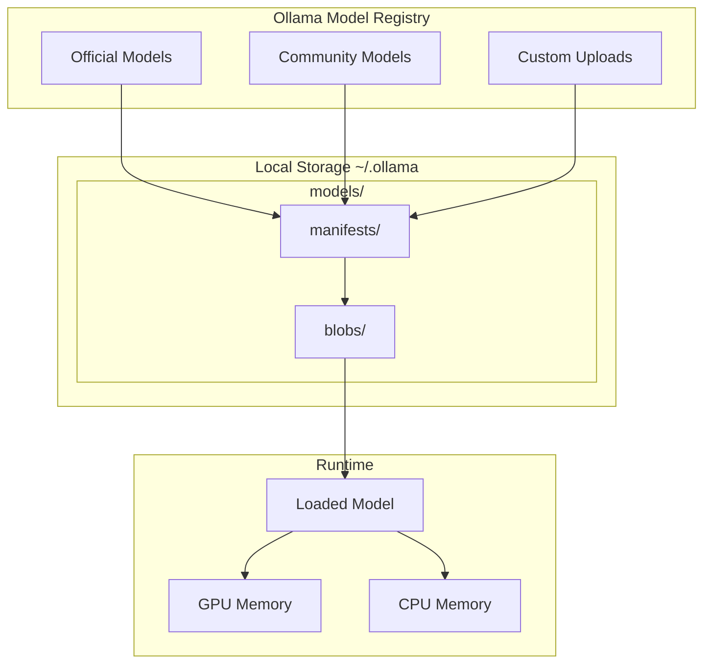
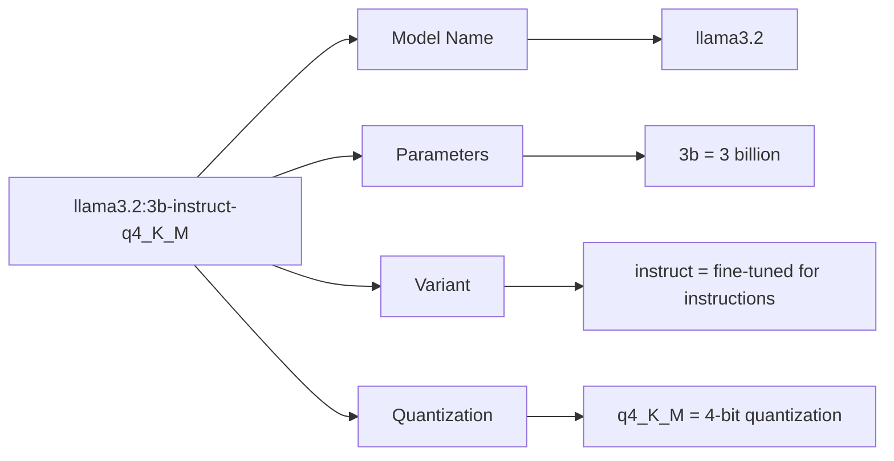
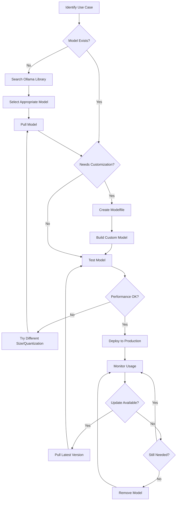

# Ollama Models: How to Pull, List, Update, and Manage Local LLMs

Author: [nawazdhandala](https://www.github.com/nawazdhandala)

Tags: Ollama, LLM, AI, Model Management, Local AI

Description: Complete guide to managing Ollama models. Pull new models, list installed ones, update to latest versions, customize with Modelfiles, and clean up disk space.

---

> Getting models into Ollama is straightforward, but managing them effectively requires understanding how Ollama stores, versions, and updates models. Knowing these details helps you keep your model library organized and your disk space under control.

Whether you are experimenting with different models or building production applications, mastering model management in Ollama will save you time and frustration down the road.

---

## Understanding Ollama's Model System

Before diving into commands, let us look at how Ollama organizes models internally.



Ollama stores models in two parts:
- **Manifests**: Metadata files containing model information, configuration, and references to blobs
- **Blobs**: The actual model weights stored as content-addressed files

Multiple models can share blobs if they use the same base weights, which saves significant disk space when working with model variants.

---

## Pulling Models from the Registry

The `ollama pull` command downloads models from the Ollama model registry.

### Basic Pull Operations

Download a model using its name from the registry.

```bash
# Pull the latest version of Llama 3.2
# Ollama automatically selects an appropriate size based on your hardware
ollama pull llama3.2
```

You will see download progress with layer information:

```
pulling manifest
pulling 8934d96d3f08... 100% |████████████████████| 2.0 GB
pulling 8c17c2ebb0ea... 100% |████████████████████| 7.0 KB
pulling 7c23fb36d801... 100% |████████████████████| 4.8 KB
pulling 2e0493f67d0c... 100% |████████████████████| 59 B
pulling fa304d675061... 100% |████████████████████| 91 B
pulling 42ba7f8a01dd... 100% |████████████████████| 557 B
verifying sha256 digest
writing manifest
removing any unused layers
success
```

### Pulling Specific Model Variants

Models come in different sizes and quantization levels. Specify the exact variant using tags.

```bash
# Pull a specific size variant of Llama 3.2
# The :1b suffix indicates the 1 billion parameter version
ollama pull llama3.2:1b

# Pull the 3 billion parameter version
ollama pull llama3.2:3b

# Pull a specific quantization level
# Q4_K_M offers good balance between size and quality
ollama pull llama3.2:3b-instruct-q4_K_M

# Pull the full precision version (larger but higher quality)
ollama pull llama3.2:3b-instruct-fp16
```

### Understanding Model Tags

Model tags follow a consistent naming pattern.



Common tag components:
- **Parameter count**: 1b, 3b, 7b, 8b, 13b, 70b
- **Variants**: instruct, chat, code, text
- **Quantization**: q2_K, q3_K_S, q4_0, q4_K_M, q5_K_M, q8_0, fp16

Lower quantization (q2, q3, q4) means smaller files but slightly reduced quality. Higher quantization (q8, fp16) preserves more quality but requires more memory.

---

## Listing and Inspecting Models

### View Downloaded Models

See all models stored locally using the list command.

```bash
# List all downloaded models with sizes and modification dates
ollama list
```

Example output:

```
NAME                    ID              SIZE      MODIFIED
llama3.2:latest         a80c4f17acd5    2.0 GB    2 hours ago
llama3.2:1b             baf6a787fdff    1.3 GB    3 hours ago
codellama:13b           8fdf8f752f6e    7.4 GB    1 day ago
mistral:latest          61e88e884507    4.1 GB    2 days ago
nomic-embed-text:latest 0a109f422b47    274 MB    3 days ago
```

### Check Running Models

See which models are currently loaded in memory.

```bash
# Display models loaded in GPU/CPU memory
ollama ps
```

Example output:

```
NAME              ID              SIZE      PROCESSOR    UNTIL
llama3.2:latest   a80c4f17acd5    3.3 GB    100% GPU     4 minutes from now
```

The UNTIL column shows when the model will be unloaded from memory if not used.

### Inspect Model Details

Get detailed information about a specific model.

```bash
# Show comprehensive model information including parameters and template
ollama show llama3.2
```

Output includes:

```
  Model
    architecture     llama
    parameters       3.2B
    quantization     Q4_K_M
    context length   131072
    embedding length 3072

  Parameters
    stop    "<|start_header_id|>"
    stop    "<|end_header_id|>"
    stop    "<|eot_id|>"

  License
    Llama 3.2 Community License Agreement
    ...
```

For more specific information, use these variants:

```bash
# Show only the license information
ollama show llama3.2 --license

# Show the modelfile (template and parameters)
ollama show llama3.2 --modelfile

# Show the system prompt if defined
ollama show llama3.2 --system

# Show the prompt template
ollama show llama3.2 --template
```

---

## Updating Models

Ollama does not have a dedicated update command, but pulling a model again will download any newer version.

### Check for Updates

Pull the model again to check for and download updates.

```bash
# Re-pulling fetches the latest version if available
# Existing layers that match are not re-downloaded
ollama pull llama3.2
```

If the model is already up to date, you will see:

```
pulling manifest
pulling 8934d96d3f08... 100% |████████████████████| (already exists)
pulling 8c17c2ebb0ea... 100% |████████████████████| (already exists)
...
verifying sha256 digest
writing manifest
success
```

### Update All Models Script

Automate updates for all your downloaded models with a script.

```bash
#!/bin/bash
# update_all_models.sh
# Pulls the latest version of all locally installed Ollama models
# Useful for keeping your model library current

echo "Updating all Ollama models..."

# Get list of installed models and update each one
# The awk command extracts just the model name from the list output
ollama list | tail -n +2 | awk '{print $1}' | while read model; do
    echo ""
    echo "Updating: $model"
    ollama pull "$model"
done

echo ""
echo "All models updated!"
```

Save and run the script:

```bash
# Make the script executable
chmod +x update_all_models.sh

# Run the update script
./update_all_models.sh
```

---

## Removing Models

Keep your disk space under control by removing models you no longer need.

### Delete a Single Model

Remove a specific model from local storage.

```bash
# Remove a model by name
ollama rm codellama

# Remove a specific version/tag
ollama rm llama3.2:1b

# Remove multiple models in sequence
ollama rm mistral && ollama rm phi3
```

### Clean Up All Unused Models

Remove all models except the ones you want to keep.

```bash
#!/bin/bash
# cleanup_models.sh
# Removes all models except those in the keep list
# Modify the KEEP array to match your needs

# Models to keep (modify this list)
KEEP=("llama3.2:latest" "nomic-embed-text:latest")

# Get all installed models
ALL_MODELS=$(ollama list | tail -n +2 | awk '{print $1}')

for model in $ALL_MODELS; do
    # Check if model is in keep list
    keep=false
    for keeper in "${KEEP[@]}"; do
        if [ "$model" == "$keeper" ]; then
            keep=true
            break
        fi
    done

    # Remove if not in keep list
    if [ "$keep" = false ]; then
        echo "Removing: $model"
        ollama rm "$model"
    else
        echo "Keeping: $model"
    fi
done
```

### Check Disk Usage

Monitor how much space your models are using.

```bash
# Check total size of Ollama storage directory
du -sh ~/.ollama

# Check size of individual components
du -sh ~/.ollama/models/manifests
du -sh ~/.ollama/models/blobs

# List blobs sorted by size
ls -lhS ~/.ollama/models/blobs/ | head -20
```

---

## Copying and Renaming Models

Create copies of models with different names for organization or customization.

### Create a Model Copy

Copy an existing model to a new name.

```bash
# Copy llama3.2 to a new name
# Useful for creating a base before customization
ollama cp llama3.2 my-llama-base

# Verify the copy exists
ollama list
```

The copy shares the underlying blobs with the original, so disk usage does not double.

### Model Organization Strategy

Use naming conventions to organize your model library.

```bash
# Create project-specific model copies
ollama cp llama3.2 project-alpha/assistant
ollama cp codellama project-alpha/coder

# Create environment-specific copies
ollama cp llama3.2 dev/llama
ollama cp llama3.2 staging/llama
ollama cp llama3.2 prod/llama
```

---

## Creating Custom Models

Build customized models from base models using Modelfiles.

### Modelfile Structure

A Modelfile defines how to customize a base model.

```dockerfile
# Modelfile for a DevOps-focused assistant
# Start from a capable base model
FROM llama3.2:3b

# Define the system prompt that shapes model behavior
SYSTEM """
You are an expert DevOps engineer with deep knowledge of:
- Kubernetes and container orchestration
- CI/CD pipelines and automation
- Infrastructure as Code (Terraform, Pulumi)
- Monitoring and observability
- Cloud platforms (AWS, GCP, Azure)

Provide practical, production-ready advice. Include code examples when relevant.
Always consider security implications in your recommendations.
"""

# Adjust generation parameters
# Lower temperature for more consistent, focused responses
PARAMETER temperature 0.4

# Top-p sampling for controlled diversity
PARAMETER top_p 0.9

# Increase context window for longer conversations
PARAMETER num_ctx 8192

# Stop sequences to control output format
PARAMETER stop "<|end|>"
PARAMETER stop "Human:"
```

### Build Custom Models

Create models from Modelfiles using the create command.

```bash
# Create a custom model from a Modelfile
# The -f flag specifies the Modelfile path
ollama create devops-assistant -f ./Modelfile

# List models to verify creation
ollama list

# Test the custom model
ollama run devops-assistant "How do I set up a Kubernetes deployment with auto-scaling?"
```

### Advanced Modelfile Examples

Create specialized models for different use cases.

```dockerfile
# Modelfile.code-reviewer
# A model optimized for code review tasks
FROM codellama:13b

SYSTEM """
You are a senior code reviewer. Analyze code for:
1. Bugs and logical errors
2. Security vulnerabilities
3. Performance issues
4. Code style and readability
5. Missing error handling

Format your review as:
- CRITICAL: Issues that must be fixed
- WARNING: Issues that should be addressed
- SUGGESTION: Improvements to consider

Be specific and include line references when possible.
"""

# Low temperature for consistent, focused analysis
PARAMETER temperature 0.2

# Higher top_k for more thorough consideration of alternatives
PARAMETER top_k 50

PARAMETER num_ctx 16384
```

```dockerfile
# Modelfile.sql-expert
# A model specialized for SQL and database queries
FROM llama3.2:3b

SYSTEM """
You are an expert database administrator and SQL developer.
You specialize in PostgreSQL, MySQL, and SQLite.

When writing queries:
- Always use parameterized queries to prevent SQL injection
- Include appropriate indexes suggestions
- Optimize for performance
- Add comments explaining complex logic

Format SQL with proper indentation and uppercase keywords.
"""

PARAMETER temperature 0.3
PARAMETER num_ctx 4096
```

Build both models:

```bash
# Create specialized models
ollama create code-reviewer -f Modelfile.code-reviewer
ollama create sql-expert -f Modelfile.sql-expert
```

---

## Managing Models with the API

Perform model management operations programmatically using the API.

### Python Model Manager

A comprehensive class for managing models via the API.

```python
# model_manager.py
# Provides programmatic control over Ollama model operations
# Includes pulling, listing, deleting, and creating models

import requests
import json
from typing import List, Dict, Optional, Callable
from dataclasses import dataclass

@dataclass
class ModelInfo:
    """Container for model information."""
    name: str
    size: int
    digest: str
    modified_at: str
    parameter_size: str
    quantization: str
    family: str

    @property
    def size_gb(self) -> float:
        """Return size in gigabytes."""
        return self.size / (1024 ** 3)


class OllamaModelManager:
    """
    Manage Ollama models through the REST API.

    Provides methods for all model management operations including
    pulling, listing, removing, and creating custom models.
    """

    def __init__(self, base_url: str = "http://localhost:11434"):
        """
        Initialize the model manager.

        Args:
            base_url: The Ollama server URL (default: http://localhost:11434)
        """
        self.base_url = base_url
        self.session = requests.Session()

    def list_models(self) -> List[ModelInfo]:
        """
        Get all locally available models with detailed information.

        Returns:
            List of ModelInfo objects containing model details
        """
        response = self.session.get(f"{self.base_url}/api/tags")
        response.raise_for_status()

        models = []
        for m in response.json().get("models", []):
            details = m.get("details", {})
            models.append(ModelInfo(
                name=m["name"],
                size=m["size"],
                digest=m["digest"],
                modified_at=m["modified_at"],
                parameter_size=details.get("parameter_size", "unknown"),
                quantization=details.get("quantization_level", "unknown"),
                family=details.get("family", "unknown")
            ))

        return models

    def get_model_info(self, name: str) -> Dict:
        """
        Get detailed information about a specific model.

        Args:
            name: The model name to query

        Returns:
            Dictionary containing complete model information
        """
        response = self.session.post(
            f"{self.base_url}/api/show",
            json={"name": name}
        )
        response.raise_for_status()
        return response.json()

    def pull_model(
        self,
        name: str,
        progress_callback: Optional[Callable[[Dict], None]] = None
    ) -> bool:
        """
        Download a model from the Ollama registry.

        Args:
            name: The model name to pull (e.g., "llama3.2:3b")
            progress_callback: Optional function called with progress updates

        Returns:
            True if pull was successful
        """
        response = self.session.post(
            f"{self.base_url}/api/pull",
            json={"name": name, "stream": True},
            stream=True
        )
        response.raise_for_status()

        for line in response.iter_lines():
            if line:
                data = json.loads(line)
                if progress_callback:
                    progress_callback(data)

                # Check for completion or error
                if data.get("status") == "success":
                    return True
                if "error" in data:
                    raise Exception(data["error"])

        return True

    def delete_model(self, name: str) -> bool:
        """
        Remove a model from local storage.

        Args:
            name: The model name to delete

        Returns:
            True if deletion was successful
        """
        response = self.session.delete(
            f"{self.base_url}/api/delete",
            json={"name": name}
        )
        response.raise_for_status()
        return True

    def copy_model(self, source: str, destination: str) -> bool:
        """
        Create a copy of a model with a new name.

        Args:
            source: The source model name
            destination: The new model name

        Returns:
            True if copy was successful
        """
        response = self.session.post(
            f"{self.base_url}/api/copy",
            json={"source": source, "destination": destination}
        )
        response.raise_for_status()
        return True

    def create_model(
        self,
        name: str,
        modelfile: str,
        progress_callback: Optional[Callable[[Dict], None]] = None
    ) -> bool:
        """
        Create a new model from a Modelfile specification.

        Args:
            name: The name for the new model
            modelfile: The Modelfile contents as a string
            progress_callback: Optional function called with progress updates

        Returns:
            True if creation was successful
        """
        response = self.session.post(
            f"{self.base_url}/api/create",
            json={"name": name, "modelfile": modelfile},
            stream=True
        )
        response.raise_for_status()

        for line in response.iter_lines():
            if line:
                data = json.loads(line)
                if progress_callback:
                    progress_callback(data)

        return True

    def list_running(self) -> List[Dict]:
        """
        Get models currently loaded in memory.

        Returns:
            List of dictionaries describing running models
        """
        response = self.session.get(f"{self.base_url}/api/ps")
        response.raise_for_status()
        return response.json().get("models", [])

    def unload_model(self, name: str) -> bool:
        """
        Unload a model from memory to free resources.

        Args:
            name: The model name to unload

        Returns:
            True if unload was successful
        """
        # Sending a generate request with keep_alive=0 unloads the model
        response = self.session.post(
            f"{self.base_url}/api/generate",
            json={
                "model": name,
                "prompt": "",
                "keep_alive": 0
            }
        )
        response.raise_for_status()
        return True


def main():
    """Demonstrate model management operations."""
    manager = OllamaModelManager()

    # List all models
    print("=== Installed Models ===")
    for model in manager.list_models():
        print(f"  {model.name}")
        print(f"    Size: {model.size_gb:.2f} GB")
        print(f"    Parameters: {model.parameter_size}")
        print(f"    Quantization: {model.quantization}")
        print()

    # Show running models
    print("=== Running Models ===")
    running = manager.list_running()
    if running:
        for m in running:
            print(f"  {m['name']} - {m['size'] / 1e9:.2f} GB in memory")
    else:
        print("  No models currently loaded")

    # Pull a model with progress display
    print("\n=== Pulling Model ===")
    def show_progress(data):
        status = data.get("status", "")
        if "pulling" in status:
            completed = data.get("completed", 0)
            total = data.get("total", 1)
            percent = (completed / total) * 100 if total > 0 else 0
            print(f"\r  {status}: {percent:.1f}%", end="", flush=True)
        else:
            print(f"\r  {status}                    ")

    # Uncomment to test pulling
    # manager.pull_model("phi3:mini", progress_callback=show_progress)

    # Create a custom model
    print("\n=== Creating Custom Model ===")
    modelfile = '''FROM llama3.2
SYSTEM "You are a helpful coding assistant. Provide clear, well-documented code."
PARAMETER temperature 0.4'''

    # Uncomment to test creation
    # manager.create_model("my-coder", modelfile)
    # print("  Created: my-coder")


if __name__ == "__main__":
    main()
```

---

## Model Storage and Disk Management

Understanding where and how Ollama stores models helps with backup and disk management.

### Storage Locations

Ollama stores models in platform-specific directories.

```bash
# macOS default location
~/.ollama/models/

# Linux default location
~/.ollama/models/

# Windows default location
C:\Users\<username>\.ollama\models\

# Custom location via environment variable
export OLLAMA_MODELS=/custom/path/to/models
```

### Storage Structure

Inspect the storage directory structure.

```bash
# View the directory structure
tree ~/.ollama/models/ -L 2

# Example output:
# ~/.ollama/models/
# ├── blobs/
# │   ├── sha256-1234...
# │   ├── sha256-5678...
# │   └── sha256-abcd...
# └── manifests/
#     └── registry.ollama.ai/
#         └── library/
#             ├── llama3.2/
#             ├── mistral/
#             └── codellama/
```

### Disk Usage Analysis

Monitor and analyze model storage usage.

```bash
# Total Ollama storage size
du -sh ~/.ollama

# Size breakdown by model
for dir in ~/.ollama/models/manifests/registry.ollama.ai/library/*/; do
    model=$(basename "$dir")
    size=$(du -sh "$dir" 2>/dev/null | cut -f1)
    echo "$size    $model"
done | sort -h

# Find largest blob files
ls -lhS ~/.ollama/models/blobs/ | head -10
```

### Moving Model Storage

Relocate models to a different disk or partition.

```bash
# Stop Ollama first
# On macOS: quit the Ollama app
# On Linux: sudo systemctl stop ollama

# Move the models directory
mv ~/.ollama/models /new/location/ollama-models

# Create a symlink to the new location
ln -s /new/location/ollama-models ~/.ollama/models

# Or use the environment variable instead
echo 'export OLLAMA_MODELS=/new/location/ollama-models' >> ~/.bashrc
source ~/.bashrc

# Start Ollama again
ollama serve
```

---

## Model Lifecycle Workflow

A typical workflow for managing models in a development environment.



---

## Best Practices for Model Management

### 1. Use Specific Tags

Always specify version tags in production to ensure consistency.

```bash
# Development - use latest for experimentation
ollama pull llama3.2

# Production - pin to specific version
ollama pull llama3.2:3b-instruct-q4_K_M
```

### 2. Monitor Disk Space

Set up alerts before your disk fills up with models.

```bash
#!/bin/bash
# check_ollama_disk.sh
# Alert if Ollama storage exceeds threshold

THRESHOLD_GB=50
CURRENT_GB=$(du -s ~/.ollama 2>/dev/null | awk '{print int($1/1024/1024)}')

if [ "$CURRENT_GB" -gt "$THRESHOLD_GB" ]; then
    echo "WARNING: Ollama storage is ${CURRENT_GB}GB (threshold: ${THRESHOLD_GB}GB)"
    echo "Consider removing unused models with 'ollama rm <model>'"
fi
```

### 3. Document Custom Models

Keep Modelfiles in version control with your application code.

```bash
# Project structure
my-app/
├── src/
├── models/
│   ├── Modelfile.assistant
│   ├── Modelfile.coder
│   └── Modelfile.reviewer
├── scripts/
│   └── setup_models.sh
└── README.md
```

### 4. Automate Model Setup

Create setup scripts for new development environments.

```bash
#!/bin/bash
# setup_models.sh
# Sets up all required models for the project

MODELS=(
    "llama3.2:3b"
    "nomic-embed-text"
)

CUSTOM_MODELS=(
    "assistant:Modelfile.assistant"
    "coder:Modelfile.coder"
)

echo "Pulling required models..."
for model in "${MODELS[@]}"; do
    echo "Pulling $model..."
    ollama pull "$model"
done

echo "Creating custom models..."
for entry in "${CUSTOM_MODELS[@]}"; do
    name="${entry%%:*}"
    file="${entry##*:}"
    echo "Creating $name from $file..."
    ollama create "$name" -f "models/$file"
done

echo "Setup complete!"
ollama list
```

### 5. Regular Cleanup

Schedule periodic cleanup of unused models.

```bash
# Add to crontab for weekly cleanup
# crontab -e
# 0 2 * * 0 /path/to/cleanup_models.sh

#!/bin/bash
# cleanup_models.sh
# Remove models not used in the last 30 days

DAYS_THRESHOLD=30

ollama list | tail -n +2 | while read name id size modified; do
    # Parse the modified date and compare
    # Remove models older than threshold
    echo "Checking: $name (modified: $modified)"
done
```

---

## Troubleshooting Model Issues

### Model Pull Failures

Common issues and solutions when pulling models.

```bash
# Check network connectivity
curl -I https://ollama.com

# Verify disk space
df -h ~/.ollama

# Check for corrupted downloads by re-pulling
ollama rm llama3.2
ollama pull llama3.2

# Use verbose mode for debugging
OLLAMA_DEBUG=1 ollama pull llama3.2
```

### Model Load Failures

Diagnose why a model fails to load.

```bash
# Check available memory
free -h  # Linux
vm_stat  # macOS

# Try a smaller model variant
ollama run llama3.2:1b

# Check GPU availability
nvidia-smi  # NVIDIA GPUs

# Force CPU-only mode
OLLAMA_NO_GPU=1 ollama run llama3.2
```

### Corrupted Model Recovery

Fix corrupted model installations.

```bash
# Remove the corrupted model completely
ollama rm llama3.2

# Clear any orphaned blobs
# WARNING: Only do this if no other models depend on these blobs

# Re-pull the model fresh
ollama pull llama3.2

# Verify integrity
ollama show llama3.2
```

---

## Conclusion

Effective model management in Ollama involves understanding both the commands and the underlying storage system. Key takeaways:

- **Pull with tags** for consistent, reproducible environments
- **Monitor disk usage** as models can consume significant space
- **Create custom models** using Modelfiles for specialized use cases
- **Use the API** for programmatic model management in applications
- **Automate updates and cleanup** to maintain a healthy model library
- **Document your models** by keeping Modelfiles in version control

With these practices, you can maintain an organized collection of models that serves your development and production needs without wasting resources.

---

*Running AI-powered applications? [OneUptime](https://oneuptime.com) provides comprehensive monitoring for your infrastructure, including health checks, incident management, and status pages to keep your services reliable.*
