# How to Implement On-Call Rotations

Author: [nawazdhandala](https://www.github.com/nawazdhandala)

Tags: SRE, On-Call, Operations, DevOps, Incident Management, Reliability

Description: A comprehensive implementation guide for building effective on-call rotations, including scheduling strategies, tooling configuration, automation scripts, and best practices for sustainable incident response.

---

On-call rotations are the backbone of operational reliability. When systems fail at 3 AM, someone needs to respond. But implementing on-call poorly leads to burnout, slow incident response, and unhappy engineers. This guide walks through everything you need to implement on-call rotations that work - from initial planning to automation and continuous improvement.

## Understanding On-Call Rotations

An on-call rotation is a schedule that determines which team member is responsible for responding to incidents during a given time period. The goals are straightforward:

- **Coverage**: Someone is always available to respond
- **Fairness**: The burden is distributed equitably across the team
- **Sustainability**: Engineers can maintain work-life balance
- **Effectiveness**: The right person responds quickly with the right context

Before diving into implementation, let's understand the key components that make up an on-call system.


## Step 1: Assess Your Requirements

Before building your on-call system, answer these fundamental questions:

### Coverage Requirements

| Question | Options | Impact |
|----------|---------|--------|
| What hours need coverage? | Business hours only, 24/7, extended hours | Team size needed |
| What is your SLA response time? | 5 min, 15 min, 1 hour | Alerting urgency |
| Do you need follow-the-sun? | Single region, multi-region | Team distribution |
| What services are in scope? | Critical only, all services | Rotation complexity |

### Team Capacity Planning

Calculate the minimum team size for sustainable on-call:

The following Python function calculates team size based on coverage hours and maximum on-call burden per engineer. This helps ensure you have enough engineers to maintain sustainable rotations.

```python
def calculate_minimum_team_size(
    coverage_hours_per_week: int,
    max_oncall_hours_per_engineer_per_month: int,
    include_backup: bool = True
) -> dict:
    """
    Calculate the minimum team size needed for on-call coverage.

    Args:
        coverage_hours_per_week: Total hours requiring coverage (168 for 24/7)
        max_oncall_hours_per_engineer_per_month: Maximum sustainable on-call hours
        include_backup: Whether to include secondary/backup coverage

    Returns:
        Dictionary with team sizing recommendations
    """
    # Monthly coverage hours
    monthly_coverage = coverage_hours_per_week * 4.33  # Weeks per month

    # Multiplier for backup coverage
    coverage_multiplier = 2 if include_backup else 1
    total_coverage_needed = monthly_coverage * coverage_multiplier

    # Calculate minimum engineers
    min_engineers = total_coverage_needed / max_oncall_hours_per_engineer_per_month

    # Round up and add buffer
    recommended = int(min_engineers) + 2  # Buffer for PTO, sick days

    return {
        "minimum_engineers": int(min_engineers),
        "recommended_engineers": recommended,
        "hours_per_engineer_monthly": total_coverage_needed / recommended,
        "coverage_type": "24/7 with backup" if include_backup else "Primary only"
    }

# Example: 24/7 coverage with max 40 on-call hours per month per engineer
result = calculate_minimum_team_size(
    coverage_hours_per_week=168,
    max_oncall_hours_per_engineer_per_month=40,
    include_backup=True
)
print(f"Recommended team size: {result['recommended_engineers']} engineers")
# Output: Recommended team size: 20 engineers
```

For most teams, aim for at least 6-8 engineers in a rotation to maintain sustainability. Smaller teams should consider limiting coverage to business hours or partnering with other teams.

## Step 2: Choose Your Rotation Model

Different rotation models suit different team structures and coverage requirements.

### Weekly Rotation

The most common model. One engineer owns on-call for an entire week.


**Pros**: Context continuity, simpler handoffs, predictable schedules
**Cons**: Longer continuous burden, harder to swap shifts

### Daily Rotation

Each engineer takes a 24-hour shift.

**Pros**: Spreads load more evenly, easier to cover single days
**Cons**: More handoffs, less context continuity

### Shift-Based Rotation

Split the day into shifts (e.g., day shift 8 AM - 8 PM, night shift 8 PM - 8 AM).

```mermaid
gantt
    title Shift-Based Rotation (One Week)
    dateFormat  HH:mm
    axisFormat %H:%M
    section Monday
    Day Shift (Alice)    :08:00, 12h
    Night Shift (Bob)    :20:00, 12h
    section Tuesday
    Day Shift (Charlie)  :08:00, 12h
    Night Shift (Diana)  :20:00, 12h
```



**Pros**: Limits after-hours burden, works well for larger teams
**Cons**: Requires more engineers, more complex scheduling

### Follow-the-Sun

Distribute coverage across time zones so no one works outside business hours.


**Pros**: No after-hours pages, sustainable long-term
**Cons**: Requires global team distribution, coordination overhead

## Step 3: Define Roles and Responsibilities

A well-functioning on-call system has clearly defined roles.

### Primary On-Call

The first responder for all incidents during their shift.

**Responsibilities:**
- Acknowledge alerts within the SLA (typically 5-15 minutes)
- Perform initial triage and assessment
- Start incident response procedures
- Escalate when needed
- Document actions taken

### Secondary On-Call (Backup)

Provides backup when primary is unavailable or during major incidents.

**Responsibilities:**
- Available if primary doesn't respond
- Assist during multi-person incidents
- Take over if primary needs rest during extended incidents
- Shadow new on-call engineers

### Incident Commander (for Major Incidents)

Coordinates response during high-severity incidents.

**Responsibilities:**
- Coordinate multiple responders
- Manage communication
- Make decisions on incident priority
- Interface with stakeholders

This YAML configuration defines the roles and their associated responsibilities, response times, and notification channels. Use this as a template for your own on-call policy documentation.

```yaml
# on-call-policy.yaml
# Defines roles and responsibilities for on-call rotations

roles:
  primary_oncall:
    description: "First responder for all incidents"
    response_time_minutes: 5
    responsibilities:
      - "Acknowledge alerts within SLA"
      - "Perform initial triage"
      - "Execute runbooks"
      - "Escalate when needed"
      - "Document incident timeline"
    notification_channels:
      - phone_call
      - sms
      - slack
      - email

  secondary_oncall:
    description: "Backup responder and incident support"
    response_time_minutes: 15
    responsibilities:
      - "Respond if primary unavailable"
      - "Assist during major incidents"
      - "Provide domain expertise"
    notification_channels:
      - sms
      - slack
      - email

  incident_commander:
    description: "Coordinates major incident response"
    activation_threshold: "SEV1 or SEV2 incidents"
    responsibilities:
      - "Lead incident response"
      - "Coordinate responders"
      - "Manage stakeholder communication"
      - "Make priority decisions"
```

## Step 4: Set Up Your Scheduling System

### Building a Schedule Manager

The following Python class provides a foundation for managing on-call schedules programmatically. It handles schedule creation, rotation, and override management.

```python
from datetime import datetime, timedelta
from typing import List, Optional, Dict
from dataclasses import dataclass, field
from enum import Enum

class RotationType(Enum):
    """Defines the rotation pattern for on-call schedules."""
    WEEKLY = "weekly"
    DAILY = "daily"
    CUSTOM = "custom"

@dataclass
class OnCallShift:
    """
    Represents a single on-call shift.

    Attributes:
        engineer: Name or ID of the engineer on call
        start_time: When the shift begins
        end_time: When the shift ends
        role: Primary, secondary, or custom role
    """
    engineer: str
    start_time: datetime
    end_time: datetime
    role: str = "primary"

    def duration_hours(self) -> float:
        """Calculate shift duration in hours."""
        delta = self.end_time - self.start_time
        return delta.total_seconds() / 3600

@dataclass
class OnCallSchedule:
    """
    Manages an on-call rotation schedule.

    This class handles the core logic of assigning engineers to shifts
    based on rotation type and team roster.
    """
    name: str
    engineers: List[str]
    rotation_type: RotationType
    rotation_length_days: int = 7
    start_date: datetime = field(default_factory=datetime.now)
    timezone: str = "UTC"

    def get_current_oncall(self) -> str:
        """
        Determine who is currently on call.

        Returns:
            The engineer currently on call based on the rotation.
        """
        now = datetime.now()
        days_since_start = (now - self.start_date).days
        rotations_completed = days_since_start // self.rotation_length_days
        current_index = rotations_completed % len(self.engineers)
        return self.engineers[current_index]

    def get_oncall_for_date(self, target_date: datetime) -> str:
        """
        Get the on-call engineer for a specific date.

        Args:
            target_date: The date to check

        Returns:
            The engineer scheduled for that date
        """
        days_since_start = (target_date - self.start_date).days
        rotations_completed = days_since_start // self.rotation_length_days
        index = rotations_completed % len(self.engineers)
        return self.engineers[index]

    def generate_schedule(self, weeks: int = 8) -> List[OnCallShift]:
        """
        Generate a schedule for the specified number of weeks.

        Args:
            weeks: Number of weeks to generate

        Returns:
            List of OnCallShift objects representing the schedule
        """
        shifts = []
        current_date = self.start_date
        end_date = self.start_date + timedelta(weeks=weeks)

        while current_date < end_date:
            engineer = self.get_oncall_for_date(current_date)
            shift_end = current_date + timedelta(days=self.rotation_length_days)

            shifts.append(OnCallShift(
                engineer=engineer,
                start_time=current_date,
                end_time=shift_end,
                role="primary"
            ))
            current_date = shift_end

        return shifts

    def print_schedule(self, weeks: int = 4) -> None:
        """Print a human-readable schedule."""
        shifts = self.generate_schedule(weeks)
        print(f"\nOn-Call Schedule: {self.name}")
        print("-" * 50)
        for shift in shifts:
            print(f"{shift.start_time.strftime('%Y-%m-%d')} to "
                  f"{shift.end_time.strftime('%Y-%m-%d')}: {shift.engineer}")


# Example usage: Create and display a schedule
schedule = OnCallSchedule(
    name="Backend Team Primary",
    engineers=["Alice", "Bob", "Charlie", "Diana", "Eve", "Frank"],
    rotation_type=RotationType.WEEKLY,
    rotation_length_days=7,
    start_date=datetime(2026, 2, 2)
)

schedule.print_schedule(weeks=6)
```

### Implementing Schedule Overrides

Overrides allow temporary changes without modifying the base rotation. This is essential for handling vacations, sick days, and shift swaps.

```python
@dataclass
class ScheduleOverride:
    """
    Represents a temporary override to the normal schedule.

    Overrides take precedence over the base rotation during their
    active period.
    """
    original_engineer: str
    replacement_engineer: str
    start_time: datetime
    end_time: datetime
    reason: str
    approved_by: Optional[str] = None
    created_at: datetime = field(default_factory=datetime.now)

class ScheduleManager:
    """
    Manages on-call schedules with support for overrides.

    This class combines base schedules with overrides to provide
    the actual on-call assignment at any given time.
    """

    def __init__(self, schedule: OnCallSchedule):
        self.schedule = schedule
        self.overrides: List[ScheduleOverride] = []

    def add_override(
        self,
        original: str,
        replacement: str,
        start: datetime,
        end: datetime,
        reason: str
    ) -> ScheduleOverride:
        """
        Add a schedule override.

        Args:
            original: Engineer being replaced
            replacement: Engineer covering the shift
            start: Override start time
            end: Override end time
            reason: Reason for the override

        Returns:
            The created ScheduleOverride object
        """
        # Validate the replacement is in the team
        if replacement not in self.schedule.engineers:
            raise ValueError(f"{replacement} is not in the rotation")

        override = ScheduleOverride(
            original_engineer=original,
            replacement_engineer=replacement,
            start_time=start,
            end_time=end,
            reason=reason
        )
        self.overrides.append(override)
        return override

    def get_effective_oncall(self, at_time: Optional[datetime] = None) -> str:
        """
        Get the actual on-call engineer considering overrides.

        Args:
            at_time: Time to check (defaults to now)

        Returns:
            The engineer who is effectively on call
        """
        if at_time is None:
            at_time = datetime.now()

        # Check for active overrides first
        for override in self.overrides:
            if override.start_time <= at_time < override.end_time:
                return override.replacement_engineer

        # Fall back to base schedule
        return self.schedule.get_oncall_for_date(at_time)

    def get_upcoming_overrides(self, days: int = 30) -> List[ScheduleOverride]:
        """Get all overrides in the next N days."""
        now = datetime.now()
        end = now + timedelta(days=days)
        return [
            o for o in self.overrides
            if o.start_time < end and o.end_time > now
        ]


# Example: Managing overrides
manager = ScheduleManager(schedule)

# Alice is on vacation, Bob covers
manager.add_override(
    original="Alice",
    replacement="Bob",
    start=datetime(2026, 2, 9),
    end=datetime(2026, 2, 16),
    reason="Alice PTO - ski trip"
)

# Check who is on call during the override period
print(f"On call Feb 10: {manager.get_effective_oncall(datetime(2026, 2, 10))}")
# Output: On call Feb 10: Bob
```

## Step 5: Configure Alerting and Escalation

### Escalation Policy Design

A well-designed escalation policy ensures incidents always reach someone while minimizing unnecessary escalations.


### Implementing Escalation Logic

This Python class implements a multi-tier escalation policy. It tracks acknowledgments and automatically escalates when response times exceed thresholds.

```python
from enum import Enum
from dataclasses import dataclass
from typing import List, Callable, Optional
import asyncio

class EscalationLevel(Enum):
    """Defines the escalation tiers."""
    PRIMARY = 1
    SECONDARY = 2
    TEAM_LEAD = 3
    MANAGER = 4

@dataclass
class EscalationRule:
    """
    A single escalation rule defining who to notify and when.

    Attributes:
        level: The escalation tier
        targets: List of people or schedules to notify
        delay_minutes: Minutes to wait before escalating to next level
    """
    level: EscalationLevel
    targets: List[str]  # Can be user IDs or schedule IDs
    delay_minutes: int

@dataclass
class EscalationPolicy:
    """
    Complete escalation policy with multiple levels.

    The policy defines the sequence of notifications and timing
    for incident escalation.
    """
    name: str
    rules: List[EscalationRule]
    repeat_count: int = 2  # How many times to loop through the policy

    def get_rule_for_level(self, level: EscalationLevel) -> Optional[EscalationRule]:
        """Get the rule for a specific escalation level."""
        for rule in self.rules:
            if rule.level == level:
                return rule
        return None

class IncidentEscalator:
    """
    Handles incident escalation based on policy rules.

    This class manages the escalation workflow, tracking acknowledgments
    and triggering notifications at appropriate times.
    """

    def __init__(
        self,
        policy: EscalationPolicy,
        notify_callback: Callable[[str, str], None]
    ):
        """
        Initialize the escalator.

        Args:
            policy: The escalation policy to follow
            notify_callback: Function to call for notifications
                           Arguments: (target, incident_id)
        """
        self.policy = policy
        self.notify = notify_callback
        self.acknowledged = False
        self.current_level = EscalationLevel.PRIMARY

    async def escalate_incident(self, incident_id: str) -> None:
        """
        Run the escalation workflow for an incident.

        Args:
            incident_id: Unique identifier for the incident
        """
        for loop in range(self.policy.repeat_count):
            for rule in self.policy.rules:
                if self.acknowledged:
                    return

                # Notify all targets at this level
                for target in rule.targets:
                    self.notify(target, incident_id)
                    print(f"Notified {target} for incident {incident_id}")

                # Wait for response or timeout
                await asyncio.sleep(rule.delay_minutes * 60)

                if not self.acknowledged:
                    print(f"No response, escalating from {rule.level.name}")

    def acknowledge(self, responder: str) -> None:
        """Mark the incident as acknowledged."""
        self.acknowledged = True
        print(f"Incident acknowledged by {responder}")


# Define a standard escalation policy
standard_policy = EscalationPolicy(
    name="Standard Service Escalation",
    rules=[
        EscalationRule(
            level=EscalationLevel.PRIMARY,
            targets=["primary_oncall_schedule"],
            delay_minutes=5
        ),
        EscalationRule(
            level=EscalationLevel.SECONDARY,
            targets=["secondary_oncall_schedule"],
            delay_minutes=10
        ),
        EscalationRule(
            level=EscalationLevel.TEAM_LEAD,
            targets=["team_lead_user"],
            delay_minutes=15
        ),
        EscalationRule(
            level=EscalationLevel.MANAGER,
            targets=["eng_manager_user", "director_user"],
            delay_minutes=30
        )
    ],
    repeat_count=2
)
```

### Notification Configuration

Configure multiple notification channels to ensure alerts are received.

```yaml
# notification-config.yaml
# Configure notification channels and preferences

notification_channels:
  phone_call:
    provider: "twilio"
    priority: 1  # Highest priority
    retry_count: 3
    retry_interval_seconds: 60

  sms:
    provider: "twilio"
    priority: 2
    retry_count: 2
    retry_interval_seconds: 30

  slack:
    provider: "slack"
    priority: 3
    channel: "#incidents"
    mention_user: true

  email:
    provider: "sendgrid"
    priority: 4
    template: "incident_alert"

notification_rules:
  # High severity: All channels
  sev1:
    channels: [phone_call, sms, slack, email]
    repeat_until_acknowledged: true
    repeat_interval_minutes: 5

  # Medium severity: SMS and Slack
  sev2:
    channels: [sms, slack, email]
    repeat_until_acknowledged: true
    repeat_interval_minutes: 10

  # Low severity: Slack only during business hours
  sev3:
    channels: [slack, email]
    repeat_until_acknowledged: false
    business_hours_only: true
```

## Step 6: Implement Handoff Procedures

Effective handoffs prevent knowledge loss between shifts and ensure continuity during ongoing incidents.

### Handoff Checklist System

This Python class implements a structured handoff process with required items, optional notes, and verification.

```python
from dataclasses import dataclass, field
from datetime import datetime
from typing import List, Optional, Dict
from enum import Enum

class HandoffItemStatus(Enum):
    """Status of a handoff checklist item."""
    PENDING = "pending"
    COMPLETED = "completed"
    NOT_APPLICABLE = "not_applicable"

@dataclass
class HandoffItem:
    """A single item in the handoff checklist."""
    description: str
    category: str
    required: bool = True
    status: HandoffItemStatus = HandoffItemStatus.PENDING
    notes: Optional[str] = None

@dataclass
class OnCallHandoff:
    """
    Manages the handoff process between on-call engineers.

    Ensures all critical information is transferred when
    on-call responsibility changes.
    """
    outgoing_engineer: str
    incoming_engineer: str
    handoff_time: datetime
    items: List[HandoffItem] = field(default_factory=list)
    active_incidents: List[Dict] = field(default_factory=list)
    notes: str = ""
    completed: bool = False

    def __post_init__(self):
        """Initialize with standard checklist items."""
        if not self.items:
            self.items = self._create_default_checklist()

    def _create_default_checklist(self) -> List[HandoffItem]:
        """Create the standard handoff checklist."""
        return [
            # Active Incidents
            HandoffItem(
                description="Review all active incidents",
                category="incidents",
                required=True
            ),
            HandoffItem(
                description="Document current status of ongoing issues",
                category="incidents",
                required=True
            ),
            HandoffItem(
                description="Transfer incident ownership in tracking system",
                category="incidents",
                required=True
            ),

            # Recent Changes
            HandoffItem(
                description="Review deployments in last 24 hours",
                category="changes",
                required=True
            ),
            HandoffItem(
                description="Note any rollbacks or hotfixes",
                category="changes",
                required=True
            ),
            HandoffItem(
                description="Check for pending deployments",
                category="changes",
                required=False
            ),

            # System Health
            HandoffItem(
                description="Review current system health dashboards",
                category="health",
                required=True
            ),
            HandoffItem(
                description="Note any degraded services",
                category="health",
                required=True
            ),
            HandoffItem(
                description="Check error rate trends",
                category="health",
                required=False
            ),

            # Upcoming Events
            HandoffItem(
                description="Review scheduled maintenance windows",
                category="upcoming",
                required=True
            ),
            HandoffItem(
                description="Note expected high-traffic periods",
                category="upcoming",
                required=False
            ),

            # Knowledge Transfer
            HandoffItem(
                description="Share any new runbook updates",
                category="knowledge",
                required=False
            ),
            HandoffItem(
                description="Discuss lessons learned from shift",
                category="knowledge",
                required=False
            )
        ]

    def complete_item(self, index: int, notes: Optional[str] = None) -> None:
        """Mark a checklist item as completed."""
        if 0 <= index < len(self.items):
            self.items[index].status = HandoffItemStatus.COMPLETED
            if notes:
                self.items[index].notes = notes

    def add_active_incident(
        self,
        incident_id: str,
        summary: str,
        status: str,
        next_steps: str
    ) -> None:
        """Add an active incident to the handoff."""
        self.active_incidents.append({
            "id": incident_id,
            "summary": summary,
            "status": status,
            "next_steps": next_steps
        })

    def is_ready_to_complete(self) -> tuple[bool, List[str]]:
        """
        Check if all required items are completed.

        Returns:
            Tuple of (ready, list of incomplete required items)
        """
        incomplete = []
        for item in self.items:
            if item.required and item.status == HandoffItemStatus.PENDING:
                incomplete.append(item.description)
        return len(incomplete) == 0, incomplete

    def generate_summary(self) -> str:
        """Generate a handoff summary document."""
        lines = [
            f"# On-Call Handoff Summary",
            f"",
            f"**From:** {self.outgoing_engineer}",
            f"**To:** {self.incoming_engineer}",
            f"**Time:** {self.handoff_time.isoformat()}",
            f"",
            f"## Active Incidents",
        ]

        if self.active_incidents:
            for incident in self.active_incidents:
                lines.append(f"- **{incident['id']}**: {incident['summary']}")
                lines.append(f"  - Status: {incident['status']}")
                lines.append(f"  - Next steps: {incident['next_steps']}")
        else:
            lines.append("- No active incidents")

        lines.extend([
            f"",
            f"## Handoff Notes",
            self.notes or "No additional notes",
            f"",
            f"## Checklist Status"
        ])

        for item in self.items:
            status_icon = "x" if item.status == HandoffItemStatus.COMPLETED else " "
            lines.append(f"- [{status_icon}] {item.description}")
            if item.notes:
                lines.append(f"  - Note: {item.notes}")

        return "\n".join(lines)


# Example usage
handoff = OnCallHandoff(
    outgoing_engineer="Alice",
    incoming_engineer="Bob",
    handoff_time=datetime(2026, 2, 9, 10, 0)
)

# Add an active incident
handoff.add_active_incident(
    incident_id="INC-1234",
    summary="Elevated error rate on payment service",
    status="Monitoring - error rate decreased after config change",
    next_steps="Continue monitoring for 2 hours, escalate if rate increases"
)

# Complete checklist items
handoff.complete_item(0, "INC-1234 is the only active incident")
handoff.complete_item(1)
handoff.complete_item(3, "v2.3.1 deployed at 14:00 yesterday")

# Check readiness
ready, incomplete = handoff.is_ready_to_complete()
print(f"Ready for handoff: {ready}")
print(f"Incomplete items: {incomplete}")
```

## Step 7: Build Automation and Tooling

### Slack Bot for On-Call Management

A Slack bot simplifies common on-call operations like checking who is on call, requesting overrides, and triggering escalations.

```python
import os
from datetime import datetime, timedelta
from slack_bolt import App
from slack_bolt.adapter.socket_mode import SocketModeHandler

# Initialize the Slack app with necessary tokens
app = App(token=os.environ["SLACK_BOT_TOKEN"])

# Store schedule manager globally (in production, use proper dependency injection)
schedule_manager = None

@app.command("/oncall")
def handle_oncall_command(ack, say, command):
    """
    Handle the /oncall slash command.

    Usage:
        /oncall - Show current on-call engineer
        /oncall next - Show next on-call
        /oncall schedule - Show next 4 weeks
    """
    ack()  # Acknowledge the command immediately

    args = command.get("text", "").strip().lower()

    if not args:
        # Show current on-call
        current = schedule_manager.get_effective_oncall()
        say(f":pager: Currently on-call: *{current}*")

    elif args == "next":
        # Show next on-call
        next_shift = datetime.now() + timedelta(days=7)
        next_oncall = schedule_manager.get_effective_oncall(next_shift)
        say(f":calendar: Next on-call (starting {next_shift.strftime('%m/%d')}): *{next_oncall}*")

    elif args == "schedule":
        # Show upcoming schedule
        shifts = schedule_manager.schedule.generate_schedule(weeks=4)
        blocks = [
            {
                "type": "header",
                "text": {"type": "plain_text", "text": "On-Call Schedule"}
            }
        ]

        for shift in shifts:
            blocks.append({
                "type": "section",
                "text": {
                    "type": "mrkdwn",
                    "text": f"*{shift.start_time.strftime('%b %d')}* - *{shift.end_time.strftime('%b %d')}*: {shift.engineer}"
                }
            })

        say(blocks=blocks)

@app.command("/oncall-swap")
def handle_swap_request(ack, say, command, client):
    """
    Handle requests to swap on-call shifts.

    Usage: /oncall-swap @user 2026-02-09 2026-02-16
    """
    ack()

    # Parse the command arguments
    args = command["text"].split()
    if len(args) < 3:
        say("Usage: `/oncall-swap @user start_date end_date`")
        return

    # Extract user mention and dates
    replacement_user = args[0].strip("<@>").upper()
    start_date = datetime.strptime(args[1], "%Y-%m-%d")
    end_date = datetime.strptime(args[2], "%Y-%m-%d")

    # Get user info
    requesting_user = command["user_id"]

    # Create the override request (pending approval)
    say(
        blocks=[
            {
                "type": "section",
                "text": {
                    "type": "mrkdwn",
                    "text": f":arrows_counterclockwise: *Shift Swap Request*\n"
                           f"<@{requesting_user}> wants <@{replacement_user}> to cover:\n"
                           f"*{start_date.strftime('%b %d')}* to *{end_date.strftime('%b %d')}*"
                }
            },
            {
                "type": "actions",
                "elements": [
                    {
                        "type": "button",
                        "text": {"type": "plain_text", "text": "Approve"},
                        "style": "primary",
                        "action_id": "approve_swap",
                        "value": f"{requesting_user}|{replacement_user}|{args[1]}|{args[2]}"
                    },
                    {
                        "type": "button",
                        "text": {"type": "plain_text", "text": "Decline"},
                        "style": "danger",
                        "action_id": "decline_swap",
                        "value": f"{requesting_user}|{replacement_user}"
                    }
                ]
            }
        ]
    )

@app.action("approve_swap")
def handle_swap_approval(ack, body, say):
    """Process approved shift swap."""
    ack()

    # Parse the value
    parts = body["actions"][0]["value"].split("|")
    original_user, replacement_user, start, end = parts

    # Create the override
    start_date = datetime.strptime(start, "%Y-%m-%d")
    end_date = datetime.strptime(end, "%Y-%m-%d")

    schedule_manager.add_override(
        original=original_user,
        replacement=replacement_user,
        start=start_date,
        end=end_date,
        reason="Approved shift swap via Slack"
    )

    say(f":white_check_mark: Shift swap approved! <@{replacement_user}> will cover from {start} to {end}")

@app.command("/escalate")
def handle_manual_escalation(ack, say, command, client):
    """
    Manually trigger an escalation.

    Usage: /escalate [incident_id] [reason]
    """
    ack()

    args = command["text"].split(maxsplit=1)
    incident_id = args[0] if args else "MANUAL"
    reason = args[1] if len(args) > 1 else "Manual escalation requested"

    # Trigger escalation to secondary
    current_oncall = schedule_manager.get_effective_oncall()

    say(
        f":rotating_light: *Manual Escalation Triggered*\n"
        f"*Incident:* {incident_id}\n"
        f"*Reason:* {reason}\n"
        f"*Current on-call:* {current_oncall}\n\n"
        f"Paging secondary on-call..."
    )

    # In production, this would trigger actual paging
    # page_secondary_oncall(incident_id, reason)

# Start the bot
if __name__ == "__main__":
    handler = SocketModeHandler(app, os.environ["SLACK_APP_TOKEN"])
    handler.start()
```

### Calendar Integration

Sync on-call schedules with calendar systems for visibility.

```python
from google.oauth2.credentials import Credentials
from googleapiclient.discovery import build
from datetime import datetime, timedelta
from typing import List

class CalendarSync:
    """
    Synchronizes on-call schedules with Google Calendar.

    Creates calendar events for each on-call shift to provide
    visibility and reminders.
    """

    def __init__(self, credentials: Credentials, calendar_id: str):
        """
        Initialize the calendar sync.

        Args:
            credentials: Google OAuth credentials
            calendar_id: The calendar to sync to
        """
        self.service = build('calendar', 'v3', credentials=credentials)
        self.calendar_id = calendar_id

    def sync_schedule(
        self,
        shifts: List['OnCallShift'],
        clear_existing: bool = True
    ) -> None:
        """
        Sync on-call shifts to the calendar.

        Args:
            shifts: List of OnCallShift objects to sync
            clear_existing: Whether to remove existing on-call events
        """
        if clear_existing:
            self._clear_oncall_events(shifts[0].start_time, shifts[-1].end_time)

        for shift in shifts:
            self._create_event(shift)

    def _create_event(self, shift: 'OnCallShift') -> dict:
        """Create a calendar event for an on-call shift."""
        event = {
            'summary': f'On-Call: {shift.engineer} ({shift.role})',
            'description': (
                f'On-call shift for {shift.engineer}\n'
                f'Role: {shift.role}\n'
                f'Duration: {shift.duration_hours()} hours\n\n'
                f'Runbook: https://wiki.example.com/oncall-runbook'
            ),
            'start': {
                'dateTime': shift.start_time.isoformat(),
                'timeZone': 'UTC',
            },
            'end': {
                'dateTime': shift.end_time.isoformat(),
                'timeZone': 'UTC',
            },
            'reminders': {
                'useDefault': False,
                'overrides': [
                    {'method': 'popup', 'minutes': 60},  # 1 hour before
                    {'method': 'email', 'minutes': 1440},  # 1 day before
                ],
            },
            # Custom property to identify on-call events
            'extendedProperties': {
                'private': {
                    'oncall': 'true',
                    'engineer': shift.engineer,
                    'role': shift.role
                }
            }
        }

        return self.service.events().insert(
            calendarId=self.calendar_id,
            body=event
        ).execute()

    def _clear_oncall_events(self, start: datetime, end: datetime) -> None:
        """Remove existing on-call events in the date range."""
        events = self.service.events().list(
            calendarId=self.calendar_id,
            timeMin=start.isoformat() + 'Z',
            timeMax=end.isoformat() + 'Z',
            privateExtendedProperty='oncall=true'
        ).execute()

        for event in events.get('items', []):
            self.service.events().delete(
                calendarId=self.calendar_id,
                eventId=event['id']
            ).execute()
```

## Step 8: Monitor On-Call Health

Track metrics to ensure your on-call program remains sustainable.

### Key Metrics to Track

| Metric | Target | Why It Matters |
|--------|--------|----------------|
| Pages per shift | < 5 | High page volume leads to burnout |
| After-hours pages | < 2/week | Sleep disruption degrades performance |
| Time to acknowledge | < 5 min | Measures response readiness |
| Escalation rate | < 10% | High escalation suggests coverage gaps |
| Mean time to resolve | < 1 hour | Measures incident handling efficiency |
| Override frequency | < 20% | Too many overrides suggests schedule issues |

### Metrics Dashboard Configuration

```yaml
# oncall-metrics-dashboard.yaml
# Configuration for on-call health monitoring

metrics:
  - name: pages_per_shift
    query: |
      count(incidents)
      where oncall_shift_id = $shift_id
    threshold:
      warning: 5
      critical: 10

  - name: after_hours_pages
    query: |
      count(incidents)
      where created_at.hour not between 9 and 17
      and created_at > now() - 7d
    threshold:
      warning: 2
      critical: 5

  - name: mean_time_to_acknowledge
    query: |
      avg(acknowledged_at - created_at)
      where acknowledged_at is not null
      and created_at > now() - 30d
    threshold:
      warning: 300  # 5 minutes
      critical: 600  # 10 minutes

  - name: escalation_rate
    query: |
      count(incidents where escalated = true) / count(incidents) * 100
      where created_at > now() - 30d
    threshold:
      warning: 10
      critical: 20

alerts:
  - name: high_page_volume
    condition: pages_per_shift > 10
    severity: warning
    notification: "#oncall-health"
    message: "High page volume detected for current shift"

  - name: slow_acknowledgment
    condition: mean_time_to_acknowledge > 600
    severity: critical
    notification: "#oncall-health"
    message: "Average acknowledgment time exceeds 10 minutes"
```

## Best Practices Summary

### Schedule Design

- **Size your team appropriately**: Aim for 6-8 engineers minimum per rotation
- **Publish schedules early**: At least 4-6 weeks in advance
- **Balance the load**: Track hours per engineer and adjust as needed
- **Include backup coverage**: Never rely on a single point of failure

### Tooling and Automation

- **Automate repetitive tasks**: Schedule generation, calendar sync, reporting
- **Make overrides self-service**: Reduce friction for legitimate changes
- **Integrate with existing tools**: Slack, calendars, ticketing systems

### Handoffs and Communication

- **Standardize handoffs**: Use checklists to ensure consistency
- **Document everything**: Active incidents, recent changes, known issues
- **Communicate schedule changes**: Notify affected parties promptly

### Continuous Improvement

- **Review metrics regularly**: Monthly on-call health reviews
- **Address alert fatigue**: Reduce noise, improve signal
- **Update runbooks**: Keep documentation current
- **Gather feedback**: Regular retrospectives with on-call engineers

## Integration with OneUptime

For teams looking for an integrated solution, [OneUptime](https://oneuptime.com) provides built-in on-call management alongside monitoring and incident response. Key features include:

- **Visual schedule builder**: Drag-and-drop schedule creation
- **Automatic escalations**: Configurable multi-tier escalation policies
- **Multiple notification channels**: Phone, SMS, email, Slack, and more
- **Override management**: Easy shift swaps and temporary coverage
- **Integrated incident timeline**: On-call data linked to incident records
- **Health metrics**: Built-in dashboards for rotation health

The advantage of an integrated platform is that alerting, on-call scheduling, and incident management work together seamlessly, reducing the complexity of managing multiple tools.

## Conclusion

Implementing on-call rotations requires thoughtful planning across multiple dimensions: team sizing, rotation models, tooling, escalation policies, and continuous improvement processes. The key to success is treating on-call as a first-class operational concern rather than an afterthought.

Start with the basics: ensure coverage, define clear responsibilities, and establish reliable alerting. Then iterate: add automation, refine escalation policies, and optimize based on metrics. With the right foundation, on-call can be a sustainable part of your engineering culture rather than a source of burnout.

Remember: the goal is not just to respond to incidents, but to build a system where the right people respond quickly with the right context, and where the operational burden is distributed fairly across the team.
