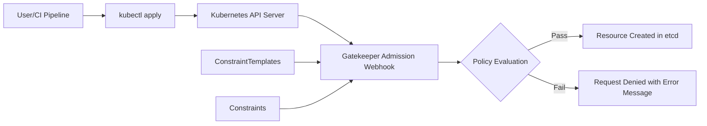
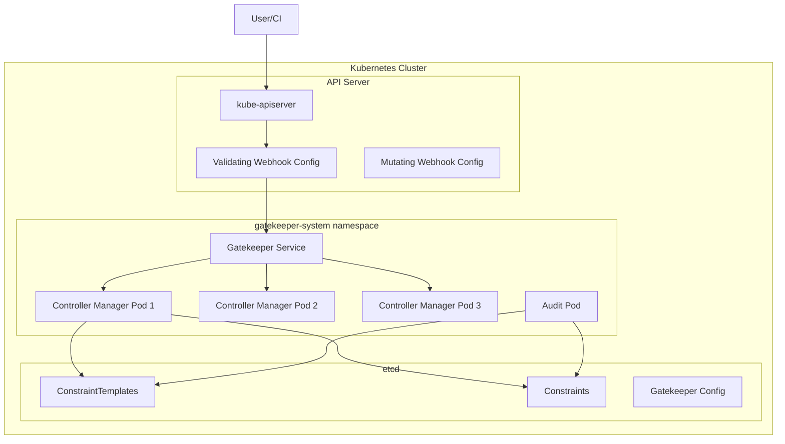

# How to Install OPA Gatekeeper on Kubernetes

Author: [nawazdhandala](https://github.com/nawazdhandala)

Tags: OPA, Gatekeeper, Kubernetes, Policy

Description: A comprehensive guide to installing OPA Gatekeeper on Kubernetes for policy enforcement. Learn installation methods, configuration options, verification steps, troubleshooting, and production best practices.

---

Open Policy Agent (OPA) Gatekeeper brings policy-as-code to Kubernetes. It acts as a validating admission controller that intercepts requests to the Kubernetes API server and evaluates them against policies you define. Before you can enforce policies, you need to install Gatekeeper correctly. This guide walks you through every installation method, configuration option, and verification step to get Gatekeeper running in your cluster.

## What is OPA Gatekeeper?

OPA Gatekeeper is a customizable admission webhook for Kubernetes that enforces policies executed by the Open Policy Agent. When a user or service tries to create, update, or delete a Kubernetes resource, the API server sends an admission review request to Gatekeeper. Gatekeeper evaluates the request against your policies and returns an allow or deny decision.



Key features of Gatekeeper include:

- **Validating Admission Control**: Blocks non-compliant resources before they enter the cluster
- **Audit Functionality**: Scans existing resources for policy violations
- **Mutation Support**: Modifies resources to make them compliant
- **Constraint Templates**: Reusable policy definitions written in Rego
- **Dry Run Mode**: Tests policies without enforcement

## Prerequisites

Before installing Gatekeeper, ensure your environment meets these requirements:

- **Kubernetes cluster**: Version 1.16 or later (1.25+ recommended for Pod Security Standards)
- **kubectl**: Configured to communicate with your cluster
- **Cluster admin access**: Required to create ClusterRoles and admission webhooks
- **Helm 3** (optional): For Helm-based installation

Verify your cluster access and version.

```bash
# Check your Kubernetes version
# This command shows the server version which must be 1.16 or higher
kubectl version --short

# Verify you have cluster-admin privileges
# This command should return "yes" if you have admin access
kubectl auth can-i create clusterroles
```

## Installation Method 1: Using kubectl (Manifests)

The simplest way to install Gatekeeper is using the official release manifests. This method is ideal for quick setups and testing environments.

### Step 1: Apply the Gatekeeper Manifests

Download and apply the Gatekeeper manifests from the official release.

```bash
# Install Gatekeeper v3.15.0 (check for latest version)
# This command downloads and applies all required resources including
# CRDs, namespace, deployments, services, and webhook configurations
kubectl apply -f https://raw.githubusercontent.com/open-policy-agent/gatekeeper/v3.15.0/deploy/gatekeeper.yaml
```

### Step 2: Verify the Installation

Wait for all Gatekeeper pods to be ready.

```bash
# Check that all pods are running in the gatekeeper-system namespace
# You should see the controller-manager and audit pods in Running state
kubectl get pods -n gatekeeper-system

# Expected output:
# NAME                                             READY   STATUS    RESTARTS   AGE
# gatekeeper-audit-7c84869dbf-r25pt                1/1     Running   0          1m
# gatekeeper-controller-manager-6bcc7f8fb5-4jz6k   1/1     Running   0          1m
# gatekeeper-controller-manager-6bcc7f8fb5-k9gxj   1/1     Running   0          1m
# gatekeeper-controller-manager-6bcc7f8fb5-z9rmt   1/1     Running   0          1m
```

### Step 3: Verify Webhook Configuration

Check that the validating webhook is registered.

```bash
# List validating webhook configurations
# Gatekeeper should appear in this list
kubectl get validatingwebhookconfigurations

# View the webhook details
# This shows which resources Gatekeeper intercepts
kubectl get validatingwebhookconfiguration gatekeeper-validating-webhook-configuration -o yaml
```

## Installation Method 2: Using Helm

Helm provides more configuration flexibility and is the recommended approach for production environments.

### Step 1: Add the Gatekeeper Helm Repository

```bash
# Add the official Gatekeeper Helm repository
helm repo add gatekeeper https://open-policy-agent.github.io/gatekeeper/charts

# Update your local Helm repository cache
helm repo update
```

### Step 2: Install Gatekeeper with Default Settings

```bash
# Install Gatekeeper with default configuration
# This creates the gatekeeper-system namespace and deploys all components
helm install gatekeeper gatekeeper/gatekeeper \
  --namespace gatekeeper-system \
  --create-namespace
```

### Step 3: Install with Custom Configuration

For production environments, customize the installation with additional options.

```bash
# Install with production-ready configuration
# This command sets multiple replicas, resource limits, and enables auditing
helm install gatekeeper gatekeeper/gatekeeper \
  --namespace gatekeeper-system \
  --create-namespace \
  --set replicas=3 \
  --set audit.replicas=1 \
  --set auditInterval=60 \
  --set constraintViolationsLimit=100 \
  --set auditFromCache=true \
  --set disableValidatingWebhook=false \
  --set validatingWebhookTimeoutSeconds=5 \
  --set enableDeleteOperations=true \
  --set logLevel=INFO
```

### Step 4: Using a Values File

For complex configurations, use a values file.

```yaml
# gatekeeper-values.yaml
# This file contains all Gatekeeper Helm configuration options
# Customize these values based on your cluster requirements

# Number of controller-manager replicas for high availability
replicas: 3

# Audit controller configuration
audit:
  replicas: 1
  # How often to run audit scans (in seconds)
  interval: 60

# Resource limits for controller-manager pods
controllerManager:
  resources:
    limits:
      cpu: 1000m
      memory: 512Mi
    requests:
      cpu: 100m
      memory: 256Mi

# Resource limits for audit pods
auditResources:
  limits:
    cpu: 500m
    memory: 256Mi
  requests:
    cpu: 100m
    memory: 128Mi

# Webhook configuration
validatingWebhookTimeoutSeconds: 5
validatingWebhookFailurePolicy: Ignore

# Enable mutation support (beta feature)
mutatingWebhookEnabled: true

# Exempt namespaces from Gatekeeper policies
exemptNamespaces:
  - kube-system
  - gatekeeper-system

# Log level: DEBUG, INFO, WARNING, ERROR
logLevel: INFO

# Pod disruption budget for high availability
podDisruptionBudget:
  enabled: true
  minAvailable: 1

# Node affinity and tolerations for scheduling
affinity:
  nodeAffinity:
    preferredDuringSchedulingIgnoredDuringExecution:
      - weight: 100
        preference:
          matchExpressions:
            - key: node-role.kubernetes.io/control-plane
              operator: Exists

# Enable external data providers (advanced feature)
externaldataProviderResponseCacheTTL: 10m
```

Install using the values file.

```bash
# Install Gatekeeper using the custom values file
helm install gatekeeper gatekeeper/gatekeeper \
  --namespace gatekeeper-system \
  --create-namespace \
  --values gatekeeper-values.yaml
```

## Installation Method 3: Using Kustomize

Kustomize allows you to customize the official manifests without modifying them directly.

### Step 1: Create Kustomization Structure

```bash
# Create directory structure for Kustomize
mkdir -p gatekeeper-install/base
mkdir -p gatekeeper-install/overlays/production
```

### Step 2: Create Base Kustomization

```yaml
# gatekeeper-install/base/kustomization.yaml
# This references the official Gatekeeper manifests as the base
apiVersion: kustomize.config.k8s.io/v1beta1
kind: Kustomization

resources:
  - https://raw.githubusercontent.com/open-policy-agent/gatekeeper/v3.15.0/deploy/gatekeeper.yaml
```

### Step 3: Create Production Overlay

```yaml
# gatekeeper-install/overlays/production/kustomization.yaml
# This overlay customizes the base for production use
apiVersion: kustomize.config.k8s.io/v1beta1
kind: Kustomization

resources:
  - ../../base

# Patch the deployment for production settings
patches:
  - patch: |-
      apiVersion: apps/v1
      kind: Deployment
      metadata:
        name: gatekeeper-controller-manager
        namespace: gatekeeper-system
      spec:
        replicas: 3
        template:
          spec:
            containers:
              - name: manager
                resources:
                  limits:
                    cpu: 1000m
                    memory: 512Mi
                  requests:
                    cpu: 100m
                    memory: 256Mi
```

### Step 4: Apply with Kustomize

```bash
# Preview the generated manifests
kubectl kustomize gatekeeper-install/overlays/production

# Apply the customized installation
kubectl apply -k gatekeeper-install/overlays/production
```

## Post-Installation Verification

After installation, verify that Gatekeeper is functioning correctly.

### Check Component Status

```bash
# Verify all Gatekeeper components are running
# All pods should show 1/1 READY and Running status
kubectl get pods -n gatekeeper-system -o wide

# Check the Gatekeeper deployment status
kubectl get deployment -n gatekeeper-system

# View Gatekeeper logs for any errors
kubectl logs -n gatekeeper-system deployment/gatekeeper-controller-manager --tail=50
```

### Verify CRDs are Installed

Gatekeeper installs several Custom Resource Definitions.

```bash
# List all Gatekeeper CRDs
# You should see configs, constrainttemplates, constraints, and more
kubectl get crd | grep gatekeeper

# Expected output:
# assign.mutations.gatekeeper.sh
# assignmetadata.mutations.gatekeeper.sh
# configs.config.gatekeeper.sh
# constraintpodstatuses.status.gatekeeper.sh
# constrainttemplatepodstatuses.status.gatekeeper.sh
# constrainttemplates.templates.gatekeeper.sh
# expansiontemplate.expansion.gatekeeper.sh
# modifyset.mutations.gatekeeper.sh
# mutatorpodstatuses.status.gatekeeper.sh
# providers.externaldata.gatekeeper.sh
```

### Test Webhook Functionality

Create a test ConstraintTemplate and Constraint to verify Gatekeeper works.

```yaml
# test-constrainttemplate.yaml
# A simple template that requires a specific label on all pods
apiVersion: templates.gatekeeper.sh/v1
kind: ConstraintTemplate
metadata:
  name: k8srequiredlabels
spec:
  crd:
    spec:
      names:
        kind: K8sRequiredLabels
      validation:
        openAPIV3Schema:
          type: object
          properties:
            labels:
              type: array
              items:
                type: string
  targets:
    - target: admission.k8s.gatekeeper.sh
      rego: |
        package k8srequiredlabels

        violation[{"msg": msg}] {
          provided := {label | input.review.object.metadata.labels[label]}
          required := {label | label := input.parameters.labels[_]}
          missing := required - provided
          count(missing) > 0
          msg := sprintf("Missing required labels: %v", [missing])
        }
```

Apply the test template.

```bash
# Apply the ConstraintTemplate
kubectl apply -f test-constrainttemplate.yaml

# Verify the template is created
kubectl get constrainttemplate k8srequiredlabels
```

Create a test constraint.

```yaml
# test-constraint.yaml
# This constraint requires all pods to have a "team" label
apiVersion: constraints.gatekeeper.sh/v1beta1
kind: K8sRequiredLabels
metadata:
  name: require-team-label
spec:
  match:
    kinds:
      - apiGroups: [""]
        kinds: ["Pod"]
    excludedNamespaces:
      - kube-system
      - gatekeeper-system
  parameters:
    labels:
      - team
```

Test the policy enforcement.

```bash
# Apply the constraint
kubectl apply -f test-constraint.yaml

# Wait for the constraint to be enforced
sleep 5

# This pod should be rejected (missing team label)
kubectl run test-pod --image=nginx --restart=Never

# Expected error:
# Error from server (Forbidden): admission webhook "validation.gatekeeper.sh"
# denied the request: [require-team-label] Missing required labels: {"team"}

# This pod should be allowed (has team label)
kubectl run test-pod --image=nginx --restart=Never --labels="team=platform"

# Cleanup test resources
kubectl delete pod test-pod
kubectl delete k8srequiredlabels require-team-label
kubectl delete constrainttemplate k8srequiredlabels
```

## Gatekeeper Architecture Deep Dive

Understanding Gatekeeper's architecture helps with troubleshooting and optimization.



### Controller Manager

The controller manager pods handle:

- **Webhook requests**: Evaluates admission requests against policies
- **Template compilation**: Compiles Rego policies from ConstraintTemplates
- **Constraint enforcement**: Applies constraints to matching resources

### Audit Controller

The audit controller:

- **Scans existing resources**: Finds violations in resources created before policies
- **Reports violations**: Updates constraint status with violation details
- **Runs periodically**: Configurable interval (default: 60 seconds)

## Configuration Options

### Gatekeeper Config Resource

The Config resource controls Gatekeeper's behavior.

```yaml
# gatekeeper-config.yaml
# This config customizes Gatekeeper's operational parameters
apiVersion: config.gatekeeper.sh/v1alpha1
kind: Config
metadata:
  name: config
  namespace: gatekeeper-system
spec:
  # Sync specific resources for use in policies
  # This allows Rego policies to access other cluster resources
  sync:
    syncOnly:
      - group: ""
        version: "v1"
        kind: "Namespace"
      - group: ""
        version: "v1"
        kind: "Pod"
      - group: "networking.k8s.io"
        version: "v1"
        kind: "NetworkPolicy"

  # Configure validation behavior
  validation:
    traces:
      - user: "system:serviceaccount:kube-system:*"
        kind:
          group: ""
          version: "v1"
          kind: "Event"

  # Match configuration for excluded resources
  match:
    - excludedNamespaces:
        - kube-system
        - gatekeeper-system
      processes:
        - "*"
```

Apply the configuration.

```bash
# Apply the Gatekeeper config
kubectl apply -f gatekeeper-config.yaml

# Verify the config is active
kubectl get config -n gatekeeper-system
```

### Namespace Exemptions

Exclude namespaces from all Gatekeeper policies.

```yaml
# namespace-exemption-config.yaml
# Exempts specific namespaces from policy enforcement
apiVersion: config.gatekeeper.sh/v1alpha1
kind: Config
metadata:
  name: config
  namespace: gatekeeper-system
spec:
  match:
    - excludedNamespaces:
        - kube-system
        - kube-public
        - kube-node-lease
        - gatekeeper-system
        - cert-manager
        - istio-system
      processes:
        - "*"
```

## Upgrading Gatekeeper

### Upgrade Using kubectl

```bash
# Check current version
kubectl get deployment -n gatekeeper-system gatekeeper-controller-manager -o jsonpath='{.spec.template.spec.containers[0].image}'

# Upgrade to a new version by applying updated manifests
kubectl apply -f https://raw.githubusercontent.com/open-policy-agent/gatekeeper/v3.15.0/deploy/gatekeeper.yaml

# Verify the upgrade
kubectl rollout status deployment/gatekeeper-controller-manager -n gatekeeper-system
```

### Upgrade Using Helm

```bash
# Update the Helm repository
helm repo update

# Check available versions
helm search repo gatekeeper/gatekeeper --versions

# Upgrade to the latest version
helm upgrade gatekeeper gatekeeper/gatekeeper \
  --namespace gatekeeper-system \
  --reuse-values

# Or upgrade with new values
helm upgrade gatekeeper gatekeeper/gatekeeper \
  --namespace gatekeeper-system \
  --values gatekeeper-values.yaml
```

## Uninstalling Gatekeeper

### Remove Using kubectl

```bash
# Delete the Gatekeeper installation
# This removes all Gatekeeper components but preserves CRDs
kubectl delete -f https://raw.githubusercontent.com/open-policy-agent/gatekeeper/v3.15.0/deploy/gatekeeper.yaml

# Remove CRDs (this deletes all constraints and templates)
kubectl delete crd -l gatekeeper.sh/system=yes
```

### Remove Using Helm

```bash
# Uninstall the Helm release
helm uninstall gatekeeper --namespace gatekeeper-system

# Delete the namespace
kubectl delete namespace gatekeeper-system

# Optionally remove CRDs (Helm does not remove CRDs by default)
kubectl delete crd -l gatekeeper.sh/system=yes
```

## Troubleshooting Common Issues

### Issue 1: Webhook Timeout Errors

If you see timeout errors when creating resources:

```bash
# Check webhook configuration timeout
kubectl get validatingwebhookconfiguration gatekeeper-validating-webhook-configuration -o yaml | grep timeout

# Increase timeout if needed (Helm)
helm upgrade gatekeeper gatekeeper/gatekeeper \
  --namespace gatekeeper-system \
  --set validatingWebhookTimeoutSeconds=10 \
  --reuse-values

# Check controller manager logs for slow policy evaluation
kubectl logs -n gatekeeper-system deployment/gatekeeper-controller-manager | grep -i timeout
```

### Issue 2: Policies Not Being Enforced

```bash
# Check if the webhook is registered
kubectl get validatingwebhookconfigurations | grep gatekeeper

# Verify constraint status
kubectl get constraints

# Check for Rego compilation errors in ConstraintTemplate
kubectl describe constrainttemplate <template-name>

# View controller manager logs
kubectl logs -n gatekeeper-system deployment/gatekeeper-controller-manager --tail=100
```

### Issue 3: Audit Not Finding Violations

```bash
# Check audit pod status
kubectl get pods -n gatekeeper-system | grep audit

# View audit logs
kubectl logs -n gatekeeper-system deployment/gatekeeper-audit --tail=100

# Verify audit interval configuration
kubectl get deployment gatekeeper-audit -n gatekeeper-system -o yaml | grep -A5 "args"
```

### Issue 4: High Memory Usage

```bash
# Check current resource usage
kubectl top pods -n gatekeeper-system

# Increase memory limits
helm upgrade gatekeeper gatekeeper/gatekeeper \
  --namespace gatekeeper-system \
  --set controllerManager.resources.limits.memory=1Gi \
  --reuse-values

# Reduce audit frequency to lower memory pressure
helm upgrade gatekeeper gatekeeper/gatekeeper \
  --namespace gatekeeper-system \
  --set auditInterval=300 \
  --reuse-values
```

## Production Best Practices

### High Availability Configuration

```yaml
# production-values.yaml
# High availability configuration for production clusters
replicas: 3

audit:
  replicas: 1

podDisruptionBudget:
  enabled: true
  minAvailable: 2

affinity:
  podAntiAffinity:
    preferredDuringSchedulingIgnoredDuringExecution:
      - weight: 100
        podAffinityTerm:
          labelSelector:
            matchExpressions:
              - key: control-plane
                operator: In
                values:
                  - controller-manager
          topologyKey: kubernetes.io/hostname

resources:
  limits:
    cpu: 1000m
    memory: 512Mi
  requests:
    cpu: 100m
    memory: 256Mi
```

### Webhook Failure Policy

For production, consider the failure policy carefully.

```yaml
# Fail-open: allows requests if Gatekeeper is unavailable
# Use this to prevent Gatekeeper outages from blocking all deployments
validatingWebhookFailurePolicy: Ignore

# Fail-closed: blocks requests if Gatekeeper is unavailable
# Use this for strict security requirements
validatingWebhookFailurePolicy: Fail
```

### Monitoring and Alerting

Gatekeeper exposes Prometheus metrics.

```bash
# Check if metrics are exposed
kubectl get service -n gatekeeper-system | grep metrics

# Port-forward to view metrics locally
kubectl port-forward -n gatekeeper-system service/gatekeeper-webhook-service 8888:443

# Key metrics to monitor:
# - gatekeeper_violations: Number of policy violations
# - gatekeeper_constraint_templates: Number of active templates
# - gatekeeper_constraints: Number of active constraints
# - controller_runtime_reconcile_errors_total: Reconciliation errors
```

### GitOps Integration

Store your policies in Git and deploy with ArgoCD or Flux.

```yaml
# argocd-application.yaml
# ArgoCD application for Gatekeeper policies
apiVersion: argoproj.io/v1alpha1
kind: Application
metadata:
  name: gatekeeper-policies
  namespace: argocd
spec:
  project: default
  source:
    repoURL: https://github.com/your-org/gatekeeper-policies.git
    targetRevision: main
    path: policies
  destination:
    server: https://kubernetes.default.svc
    namespace: gatekeeper-system
  syncPolicy:
    automated:
      prune: true
      selfHeal: true
```

## Security Considerations

### RBAC Configuration

Gatekeeper requires cluster-wide permissions. Review and restrict if needed.

```bash
# View Gatekeeper's cluster role
kubectl get clusterrole gatekeeper-manager-role -o yaml

# View Gatekeeper's cluster role binding
kubectl get clusterrolebinding gatekeeper-manager-rolebinding -o yaml
```

### Network Policies

Secure the Gatekeeper namespace.

```yaml
# gatekeeper-network-policy.yaml
# Restrict network access to Gatekeeper pods
apiVersion: networking.k8s.io/v1
kind: NetworkPolicy
metadata:
  name: gatekeeper-network-policy
  namespace: gatekeeper-system
spec:
  podSelector: {}
  policyTypes:
    - Ingress
    - Egress
  ingress:
    # Allow webhook traffic from API server
    - from:
        - namespaceSelector: {}
      ports:
        - protocol: TCP
          port: 8443
  egress:
    # Allow DNS resolution
    - to:
        - namespaceSelector: {}
      ports:
        - protocol: UDP
          port: 53
    # Allow API server communication
    - to:
        - ipBlock:
            cidr: 0.0.0.0/0
      ports:
        - protocol: TCP
          port: 443
```

## Summary

Installing OPA Gatekeeper on Kubernetes involves these key steps:

1. **Choose an installation method**: kubectl manifests for simplicity, Helm for customization, or Kustomize for GitOps workflows
2. **Configure for your environment**: Set replicas, resource limits, and webhook timeout based on cluster size
3. **Verify the installation**: Check pods, CRDs, and webhook registration
4. **Test with a sample policy**: Confirm enforcement works before deploying production policies
5. **Monitor and maintain**: Set up alerting on Gatekeeper health and policy violations

Gatekeeper provides a powerful foundation for Kubernetes policy enforcement. Once installed, you can define ConstraintTemplates to codify your organization's security and operational requirements, then create Constraints to apply them across your cluster. Start with audit mode to understand your current compliance state, fix violations, and then switch to enforcement mode for continuous policy compliance.
