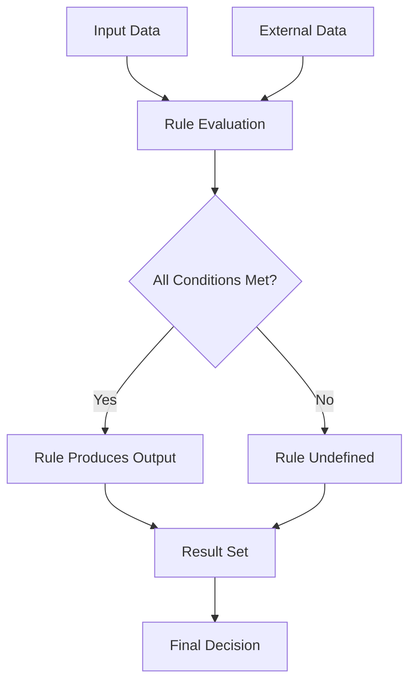
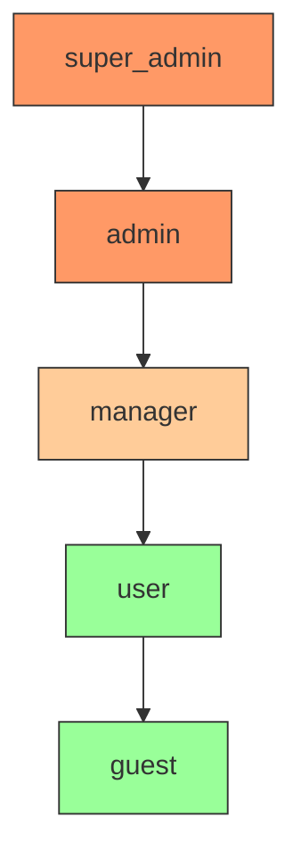
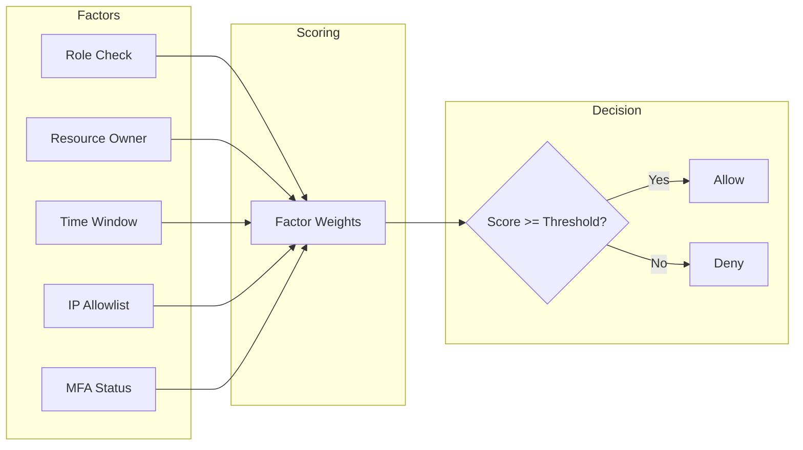

# How to Build Complex OPA Rego Functions

Author: [nawazdhandala](https://www.github.com/nawazdhandala)

Tags: OPA, Rego, Policy as Code, Authorization, Kubernetes, Security, DevOps

Description: Learn how to build complex OPA Rego functions for advanced policy evaluation. Covers custom functions, recursive logic, data aggregation, and performance optimization patterns for production policy engines.

---

> Policy decisions rarely fit into simple allow/deny patterns. Real-world authorization requires complex logic: role hierarchies, resource ownership chains, time-based rules, and aggregate calculations. Open Policy Agent's Rego language provides the building blocks, but mastering complex functions takes practice.

Rego is a declarative query language designed specifically for expressing policies. While basic policies are straightforward, building maintainable complex functions requires understanding Rego's evaluation model and data flow patterns.

---

## Understanding Rego's Evaluation Model

Before diving into complex functions, you need to understand how Rego evaluates queries. Unlike imperative languages where code executes top-to-bottom, Rego evaluates all rules simultaneously and unifies results.



### Key Concepts

Every Rego rule consists of a head (what it produces) and a body (the conditions). All conditions in the body must be satisfied for the rule to produce its output.

```rego
# policy.rego
# Basic rule structure - head := value { body }
package authz

# The rule head defines the output variable and value
# The body contains conditions that must ALL be true
allow := true {
    # Condition 1: User must have admin role
    input.user.role == "admin"

    # Condition 2: Request must be within business hours
    time.clock(time.now_ns())[0] >= 9
    time.clock(time.now_ns())[0] < 17
}
```

---

## Building Custom Helper Functions

Complex policies benefit from reusable helper functions. Rego supports user-defined functions that encapsulate logic and improve readability.

### Basic Function Syntax

A Rego function takes parameters in parentheses and returns the value assigned in the rule head. Functions can have multiple definitions with different conditions, providing pattern-matching behavior similar to functional languages.

```rego
# helpers.rego
# Reusable helper functions for policy evaluation
package helpers

# Function to check if a value exists in a list
# Parameters are passed in parentheses
# The function returns true if element is found in list
contains_element(list, element) {
    # Iterate over list - rule succeeds if any iteration matches
    list[_] == element
}

# Function to get intersection of two lists
# Returns a set of elements that appear in both lists
intersection(list1, list2) = result {
    # Set comprehension: collect all x where x is in both lists
    result := {x |
        list1[_] = x    # x is an element of list1
        list2[_] = x    # x is also an element of list2
    }
}

# Function with multiple conditions
# Calculates effective permission level from role hierarchy
permission_level(role) = 100 { role == "super_admin" }
permission_level(role) = 75 { role == "admin" }
permission_level(role) = 50 { role == "manager" }
permission_level(role) = 25 { role == "user" }
permission_level(role) = 0 { role == "guest" }
```

### Functions with Default Values

When a function might not match any conditions, provide a default value to avoid undefined results. Defaults act as fallback values when no rule produces output.

```rego
# default_functions.rego
# Functions with fallback default values
package authz

# Default ensures the rule always produces a value
# Without this, unknown roles would cause undefined
default permission_level(role) = 0

permission_level(role) = 100 { role == "super_admin" }
permission_level(role) = 75 { role == "admin" }
permission_level(role) = 50 { role == "manager" }
permission_level(role) = 25 { role == "user" }

# Usage example: comparing permission levels
can_modify_user(actor, target) {
    # Actor must have higher permission than target
    permission_level(actor.role) > permission_level(target.role)
}
```

---

## Working with Nested Data Structures

Real-world policies often need to traverse complex nested data. Rego provides powerful operators for navigating and querying hierarchical structures.

### Deep Object Access

Safely access nested fields using the optional chaining pattern. Guard against missing intermediate keys to prevent evaluation failures.

```rego
# nested_data.rego
# Traversing complex nested data structures
package authz

# Input structure example:
# {
#   "request": {
#     "resource": {
#       "metadata": {
#         "labels": {
#           "environment": "production",
#           "team": "platform"
#         }
#       }
#     }
#   }
# }

# Safe nested access using intermediate variables
# Each assignment verifies the path exists
get_label(label_name) = value {
    resource := input.request.resource
    metadata := resource.metadata
    labels := metadata.labels
    value := labels[label_name]
}

# Alternative: Direct path with existence check
# The object.get built-in provides safe access with defaults
get_label_safe(label_name) = value {
    value := object.get(
        input.request.resource.metadata.labels,
        label_name,
        "unknown"  # Default if path doesn't exist
    )
}

# Checking multiple nested conditions
is_production_resource {
    input.request.resource.metadata.labels.environment == "production"
}

is_platform_team {
    input.request.resource.metadata.labels.team == "platform"
}

# Combining nested checks
requires_elevated_approval {
    is_production_resource
    is_platform_team
}
```

### Array Traversal and Filtering

Process arrays using Rego's iteration and comprehension syntax. Array comprehensions let you filter and transform collections declaratively.

```rego
# array_processing.rego
# Processing and filtering arrays
package authz

# Input example:
# {
#   "users": [
#     {"name": "alice", "role": "admin", "department": "eng"},
#     {"name": "bob", "role": "user", "department": "eng"},
#     {"name": "carol", "role": "admin", "department": "sales"}
#   ]
# }

# Find all admins using array comprehension
# The result is a list of user objects matching the condition
admins := [user |
    user := input.users[_]     # Iterate over all users
    user.role == "admin"       # Keep only admins
]

# Extract specific fields from filtered results
admin_names := [name |
    user := input.users[_]
    user.role == "admin"
    name := user.name          # Extract just the name
]

# Count elements matching a condition
admin_count := count(admins)

# Filter by multiple conditions
eng_admins := [user |
    user := input.users[_]
    user.role == "admin"
    user.department == "eng"
]

# Check if any element matches (existential quantification)
has_admin {
    input.users[_].role == "admin"
}

# Check if all elements match (universal quantification)
all_users_active {
    # For every user, their status must be active
    user := input.users[_]
    user.status == "active"
}
```

---

## Recursive Data Structures

Role hierarchies, organization trees, and permission inheritance often require recursive traversal. Rego handles recursion through graph reachability built-ins and recursive rule definitions.

### Role Hierarchy with Inheritance

The following example implements a role hierarchy where permissions flow downward. Administrators inherit all permissions from managers, who inherit from users.



```rego
# role_hierarchy.rego
# Implementing role inheritance with graph reachability
package authz

# Define the role hierarchy as a graph
# Each role maps to its direct parent (the role it inherits from)
role_hierarchy := {
    "guest": [],
    "user": ["guest"],
    "manager": ["user"],
    "admin": ["manager"],
    "super_admin": ["admin"]
}

# Get all roles that a given role inherits from
# Uses graph.reachable to traverse the hierarchy
inherited_roles(role) = roles {
    # Build a graph where each role points to its parents
    graph := {r: role_hierarchy[r] | role_hierarchy[r]}

    # Find all nodes reachable from the starting role
    roles := graph.reachable(graph, {role})
}

# Check if a role has a specific permission
# Permissions can be assigned to any role in the hierarchy
role_permissions := {
    "guest": {"read:public"},
    "user": {"read:own", "write:own"},
    "manager": {"read:team", "write:team", "approve:requests"},
    "admin": {"read:all", "write:all", "delete:all"},
    "super_admin": {"manage:system", "manage:users"}
}

# Collect all permissions for a role including inherited ones
effective_permissions(role) = perms {
    # Get this role and all inherited roles
    all_roles := inherited_roles(role)

    # Union all permissions from all applicable roles
    perms := {p |
        some r
        all_roles[r]                    # For each inherited role
        p := role_permissions[r][_]     # Get each permission
    }
}

# Authorization check using effective permissions
allow {
    required := input.required_permission
    user_perms := effective_permissions(input.user.role)
    user_perms[required]
}
```

### Organization Tree Traversal

Many policies require traversing organizational hierarchies to determine resource ownership or approval chains.

```rego
# org_tree.rego
# Traversing organizational hierarchies
package authz

# Organization structure as adjacency list
# Each node lists its direct children
org_structure := {
    "ceo": ["cto", "cfo", "coo"],
    "cto": ["eng_director", "security_director"],
    "eng_director": ["team_lead_1", "team_lead_2"],
    "team_lead_1": ["dev_1", "dev_2", "dev_3"],
    "team_lead_2": ["dev_4", "dev_5"]
}

# Reverse mapping: find parent of any employee
parent_of(employee) = parent {
    org_structure[parent][_] == employee
}

# Get all subordinates (direct and indirect) of a manager
subordinates(manager) = subs {
    # Build graph for reachability
    subs := graph.reachable(org_structure, {manager}) - {manager}
}

# Check if manager has authority over employee
has_authority_over(manager, employee) {
    subs := subordinates(manager)
    subs[employee]
}

# Get approval chain for an employee (path to CEO)
approval_chain(employee) = chain {
    chain := [p |
        # Walk up the tree collecting parents
        some i
        p := walk_up(employee, i)
        p != null
    ]
}

# Helper to walk up N levels in the hierarchy
walk_up(employee, 0) = employee
walk_up(employee, n) = result {
    n > 0
    parent := parent_of(employee)
    result := walk_up(parent, n - 1)
}
```

---

## Aggregation and Statistical Functions

Complex policies often need to aggregate data: counting resources, summing quotas, or calculating averages. Rego provides aggregation functions that work with comprehensions.

### Resource Quota Enforcement

Enforce limits on resource creation by aggregating current usage and comparing against quotas.

```rego
# quotas.rego
# Enforcing resource quotas with aggregation
package authz

# Current resources in the system (from external data)
# Loaded via OPA's data API or bundle
resources := data.cluster.resources

# Quota definitions per team
quotas := {
    "platform": {"cpu": 100, "memory": 200, "pods": 50},
    "frontend": {"cpu": 50, "memory": 100, "pods": 25},
    "backend": {"cpu": 75, "memory": 150, "pods": 40}
}

# Calculate current usage for a team
current_usage(team, resource_type) = total {
    # Sum all resources of the given type owned by the team
    total := sum([r.spec[resource_type] |
        r := resources[_]
        r.metadata.labels.team == team
        r.spec[resource_type]
    ])
}

# Check if a new resource would exceed quota
would_exceed_quota(team, resource_type, requested_amount) {
    current := current_usage(team, resource_type)
    quota := quotas[team][resource_type]
    current + requested_amount > quota
}

# Deny requests that would exceed quota
deny[msg] {
    input.request.kind.kind == "Pod"
    team := input.request.object.metadata.labels.team
    cpu := input.request.object.spec.containers[_].resources.requests.cpu

    would_exceed_quota(team, "cpu", cpu)
    msg := sprintf("CPU quota exceeded for team %s", [team])
}

# Calculate remaining quota
remaining_quota(team, resource_type) = remaining {
    quota := quotas[team][resource_type]
    used := current_usage(team, resource_type)
    remaining := quota - used
}
```

### Statistical Thresholds

Implement policies based on statistical measures like averages, percentiles, or standard deviations.

```rego
# statistics.rego
# Statistical analysis for policy decisions
package authz

# Calculate average of a list of numbers
average(values) = avg {
    count(values) > 0
    avg := sum(values) / count(values)
}

# Calculate minimum and maximum
min_value(values) = min(values)
max_value(values) = max(values)

# Check if a value is within N standard deviations of mean
# Useful for anomaly detection in access patterns
within_normal_range(value, values, num_std_devs) {
    avg := average(values)
    variance := sum([(v - avg) * (v - avg) | v := values[_]]) / count(values)
    std_dev := sqrt(variance)

    value >= avg - (num_std_devs * std_dev)
    value <= avg + (num_std_devs * std_dev)
}

# Example: Flag unusual access patterns
access_times := data.user_access.timestamps

deny[msg] {
    input.request.type == "api_access"
    current_hour := time.clock(time.now_ns())[0]

    # Get user's typical access hours
    typical_hours := [h |
        t := access_times[input.user.id][_]
        h := time.clock(t)[0]
    ]

    # Flag if current hour is unusual (>2 std devs from mean)
    not within_normal_range(current_hour, typical_hours, 2)

    msg := "Access attempt at unusual time - additional verification required"
}

# Helper: square root approximation using Newton's method
sqrt(x) = result {
    x >= 0
    result := sqrt_iter(x, x / 2, 10)
}

sqrt_iter(x, guess, 0) = guess
sqrt_iter(x, guess, iterations) = result {
    iterations > 0
    new_guess := (guess + x / guess) / 2
    result := sqrt_iter(x, new_guess, iterations - 1)
}
```

---

## Complex Conditional Logic

Real policies often have intricate conditional requirements. Rego supports multiple strategies for expressing complex logic clearly.

### Multi-Factor Authorization

Combine multiple factors into a single authorization decision using weighted scoring or threshold-based logic.



```rego
# multi_factor.rego
# Multi-factor authorization with weighted scoring
package authz

# Factor weights - higher weight = more important
factor_weights := {
    "valid_role": 30,
    "resource_owner": 25,
    "within_business_hours": 15,
    "ip_allowlisted": 20,
    "mfa_verified": 10
}

# Minimum score required for different operations
operation_thresholds := {
    "read": 30,
    "write": 50,
    "delete": 70,
    "admin": 90
}

# Evaluate individual factors
factor_valid_role {
    allowed_roles := {"admin", "manager", "user"}
    allowed_roles[input.user.role]
}

factor_resource_owner {
    input.resource.owner == input.user.id
}

factor_within_business_hours {
    hour := time.clock(time.now_ns())[0]
    hour >= 9
    hour < 18
}

factor_ip_allowlisted {
    allowlist := data.config.ip_allowlist
    net.cidr_contains(allowlist[_], input.client_ip)
}

factor_mfa_verified {
    input.user.mfa_verified == true
}

# Calculate total score from passing factors
authorization_score = score {
    passing_factors := {name |
        factor_weights[name]
        check_factor(name)
    }

    score := sum([factor_weights[f] | f := passing_factors[_]])
}

# Dynamic factor check dispatcher
check_factor("valid_role") { factor_valid_role }
check_factor("resource_owner") { factor_resource_owner }
check_factor("within_business_hours") { factor_within_business_hours }
check_factor("ip_allowlisted") { factor_ip_allowlisted }
check_factor("mfa_verified") { factor_mfa_verified }

# Final authorization decision
allow {
    threshold := operation_thresholds[input.operation]
    authorization_score >= threshold
}

# Provide detailed decision explanation
decision := {
    "allowed": allow,
    "score": authorization_score,
    "required_score": operation_thresholds[input.operation],
    "passing_factors": {name |
        factor_weights[name]
        check_factor(name)
    },
    "failing_factors": {name |
        factor_weights[name]
        not check_factor(name)
    }
}
```

### Rule Chaining and Composition

Break complex policies into smaller rules that chain together. Each rule handles one aspect of the decision.

```rego
# rule_chaining.rego
# Composing complex policies from simple rules
package authz

# Layer 1: Basic authentication
user_authenticated {
    input.user.id
    input.user.session_valid == true
}

# Layer 2: Basic authorization
user_has_base_permission {
    user_authenticated
    required_permission := action_permissions[input.action]
    effective_permissions(input.user.role)[required_permission]
}

# Layer 3: Resource-specific checks
resource_access_allowed {
    user_has_base_permission
    check_resource_constraints
}

# Layer 4: Environmental constraints
request_environment_valid {
    resource_access_allowed
    check_ip_restrictions
    check_time_restrictions
    check_rate_limits
}

# Layer 5: Audit and compliance
audit_requirements_met {
    request_environment_valid
    check_compliance_requirements
}

# Final decision uses the full chain
allow {
    audit_requirements_met
}

# Each check is a separate rule for clarity
check_resource_constraints {
    # Owner can always access
    input.resource.owner == input.user.id
}

check_resource_constraints {
    # Team members can access team resources
    input.resource.team == input.user.team
    input.resource.visibility != "private"
}

check_ip_restrictions {
    not data.config.ip_restrictions_enabled
}

check_ip_restrictions {
    data.config.ip_restrictions_enabled
    net.cidr_contains(data.config.allowed_cidrs[_], input.client_ip)
}

check_time_restrictions {
    not data.config.time_restrictions_enabled
}

check_time_restrictions {
    data.config.time_restrictions_enabled
    hour := time.clock(time.now_ns())[0]
    hour >= data.config.allowed_hours.start
    hour < data.config.allowed_hours.end
}

check_rate_limits {
    # Rate limit logic would check external data
    data.rate_limits[input.user.id].requests_remaining > 0
}

check_compliance_requirements {
    input.resource.classification != "restricted"
}

check_compliance_requirements {
    input.resource.classification == "restricted"
    input.user.clearance_level >= input.resource.required_clearance
}
```

---

## Performance Optimization

Complex policies can become slow if not optimized. Understanding Rego's evaluation model helps write efficient rules.

### Indexing and Early Termination

Structure rules to take advantage of OPA's indexing. Rules that can be indexed evaluate faster because OPA builds lookup tables for constant comparisons.

```rego
# performance.rego
# Optimized rule structures for better performance
package authz

# SLOW: Requires scanning all permissions for each request
# The iteration over permissions happens for every evaluation
slow_has_permission(user, permission) {
    data.permissions[i].user == user
    data.permissions[i].permission == permission
}

# FAST: Uses indexed lookup structure
# Data is pre-organized as user -> permissions mapping
fast_permissions := {user: perms |
    some user
    data.permissions[_].user == user
    perms := {p |
        data.permissions[_].user == user
        p := data.permissions[_].permission
    }
}

fast_has_permission(user, permission) {
    fast_permissions[user][permission]
}

# SLOW: Multiple iterations over same data
slow_check {
    some i
    data.resources[i].type == "pod"
    data.resources[i].namespace == input.namespace
    data.resources[i].labels.app == input.app
}

# FAST: Single pass with multiple conditions
fast_check {
    resource := data.resources[_]
    resource.type == "pod"
    resource.namespace == input.namespace
    resource.labels.app == input.app
}

# Use partial evaluation for request-independent computation
# OPA can pre-compute these during bundle loading
precomputed_role_mapping := {role: perms |
    role := data.roles[_].name
    perms := data.roles[_].permissions
}
```

### Avoiding Redundant Computation

Cache intermediate results in rules and avoid recomputing values that do not change during evaluation.

```rego
# caching.rego
# Avoiding redundant computation
package authz

# BAD: Recomputes expensive operation multiple times
bad_policy {
    count(expensive_computation(input.data)) > 10
    sum(expensive_computation(input.data)) > 100
    max(expensive_computation(input.data)) < 50
}

# GOOD: Compute once and reuse
good_policy {
    # Compute expensive operation once
    computed := expensive_computation(input.data)

    # Use cached result for all checks
    count(computed) > 10
    sum(computed) > 100
    max(computed) < 50
}

# Use with keyword to compute intermediate values
efficient_policy {
    # Compute base data once
    with_computed := compute_base_data(input)

    # Separate conditions using the same computed data
    check_condition_a(with_computed)
    check_condition_b(with_computed)
    check_condition_c(with_computed)
}
```

---

## Testing Complex Functions

Robust testing ensures complex functions behave correctly across edge cases. OPA provides built-in testing capabilities.

### Unit Testing Rego Functions

Create test files alongside your policies to verify function behavior.

```rego
# policy_test.rego
# Unit tests for complex policy functions
package authz

# Test helper function
test_contains_element_found {
    contains_element(["a", "b", "c"], "b")
}

test_contains_element_not_found {
    not contains_element(["a", "b", "c"], "d")
}

# Test permission level calculation
test_permission_level_admin {
    permission_level("admin") == 75
}

test_permission_level_unknown_role {
    permission_level("unknown") == 0
}

# Test role inheritance
test_inherited_roles_admin {
    roles := inherited_roles("admin")
    roles["admin"]
    roles["manager"]
    roles["user"]
    roles["guest"]
}

# Test with mock input
test_allow_admin_user {
    allow with input as {
        "user": {"role": "admin"},
        "required_permission": "read:all"
    }
}

test_deny_guest_user {
    not allow with input as {
        "user": {"role": "guest"},
        "required_permission": "write:all"
    }
}

# Test edge cases
test_empty_list_intersection {
    result := intersection([], ["a", "b"])
    count(result) == 0
}

test_no_common_elements {
    result := intersection(["a", "b"], ["c", "d"])
    count(result) == 0
}

# Test with mock external data
test_quota_enforcement {
    deny[_] with input as {
        "request": {
            "kind": {"kind": "Pod"},
            "object": {
                "metadata": {"labels": {"team": "platform"}},
                "spec": {"containers": [{"resources": {"requests": {"cpu": 200}}}]}
            }
        }
    } with data.cluster.resources as [
        {"metadata": {"labels": {"team": "platform"}}, "spec": {"cpu": 50}}
    ]
}
```

### Running Tests

Execute tests using the OPA CLI to verify policy correctness.

```bash
# Run all tests in the current directory
opa test . -v

# Run tests with coverage reporting
opa test . --coverage --format=json

# Run specific test file
opa test policy_test.rego -v

# Run tests matching a pattern
opa test . -v --run "test_permission"
```

---

## Real-World Example: Kubernetes Admission Control

Combine all concepts into a production admission controller policy.

```rego
# kubernetes_admission.rego
# Complete Kubernetes admission controller policy
package kubernetes.admission

# Import helper functions from other packages
import data.helpers.contains_element
import data.helpers.permission_level

# Deny rules accumulate all policy violations
deny[msg] {
    not valid_namespace
    msg := sprintf("Invalid namespace: %s", [input.request.namespace])
}

deny[msg] {
    input.request.kind.kind == "Pod"
    not valid_image_registry
    msg := "Container images must come from approved registries"
}

deny[msg] {
    input.request.kind.kind == "Pod"
    container := input.request.object.spec.containers[_]
    not container.resources.limits.memory
    msg := sprintf("Container %s must have memory limits", [container.name])
}

deny[msg] {
    input.request.kind.kind == "Pod"
    container := input.request.object.spec.containers[_]
    not container.resources.limits.cpu
    msg := sprintf("Container %s must have CPU limits", [container.name])
}

deny[msg] {
    input.request.kind.kind == "Pod"
    container := input.request.object.spec.containers[_]
    container.securityContext.privileged == true
    msg := sprintf("Privileged containers not allowed: %s", [container.name])
}

deny[msg] {
    input.request.kind.kind == "Pod"
    not valid_pod_security_context
    msg := "Pod must have security context with runAsNonRoot: true"
}

# Namespace validation
valid_namespace {
    allowed_namespaces := data.config.allowed_namespaces
    contains_element(allowed_namespaces, input.request.namespace)
}

# Image registry validation
valid_image_registry {
    container := input.request.object.spec.containers[_]
    approved_registries := data.config.approved_registries
    startswith(container.image, approved_registries[_])
}

# Security context validation
valid_pod_security_context {
    input.request.object.spec.securityContext.runAsNonRoot == true
}

# Warn rules for non-blocking recommendations
warn[msg] {
    input.request.kind.kind == "Pod"
    not input.request.object.metadata.labels.app
    msg := "Pods should have an 'app' label for monitoring"
}

warn[msg] {
    input.request.kind.kind == "Deployment"
    input.request.object.spec.replicas < 2
    msg := "Deployments should have at least 2 replicas for high availability"
}

# Main response
response := {
    "allowed": count(deny) == 0,
    "status": {
        "reason": reason
    }
}

reason = msg {
    count(deny) > 0
    msg := concat("; ", deny)
}

reason = "Allowed" {
    count(deny) == 0
}
```

---

## Best Practices Summary

When building complex Rego functions, keep these principles in mind:

1. **Break down complex logic** into smaller, testable functions
2. **Use descriptive names** that explain what rules check
3. **Add comments** explaining the policy intent, not just the code
4. **Provide defaults** for rules that might be undefined
5. **Test edge cases** including empty inputs and missing data
6. **Optimize hot paths** by structuring rules for indexing
7. **Use comprehensions** instead of explicit iteration where possible
8. **Separate concerns** into different packages for maintainability

---

## Conclusion

Building complex OPA Rego functions requires understanding the declarative evaluation model and applying patterns for data traversal, aggregation, and composition. Start with simple rules, compose them into complex policies, and always test thoroughly.

The patterns covered here handle most real-world policy scenarios: role hierarchies, resource quotas, multi-factor authorization, and Kubernetes admission control. Apply these building blocks to your specific authorization requirements.

---

*Need to monitor your policy decisions? [OneUptime](https://oneuptime.com) provides observability for your authorization layer, helping you track policy evaluation latency, decision patterns, and potential security issues.*

**Related Reading:**
- [How to Configure Kubernetes Multi-Tenancy](https://oneuptime.com/blog/post/2026-02-02-kubernetes-multi-tenancy/view)
- [How to Implement Kubernetes Egress Network Policies](https://oneuptime.com/blog/post/2026-02-02-kubernetes-egress-network-policies/view)
