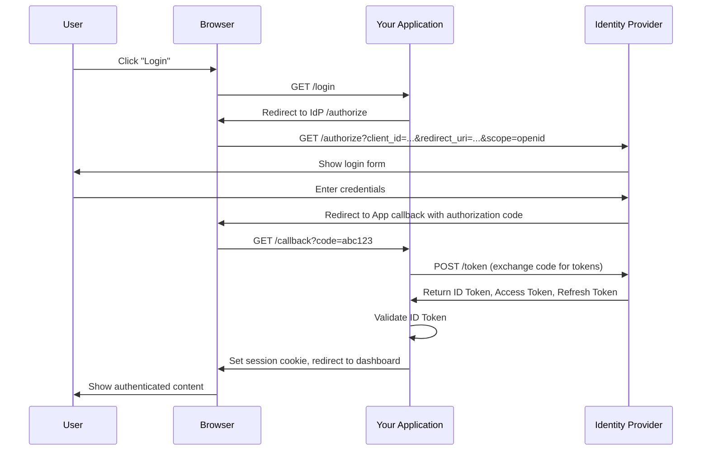
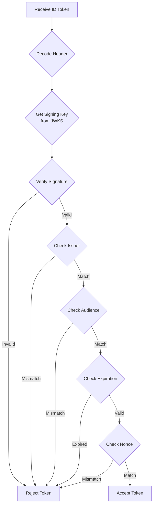
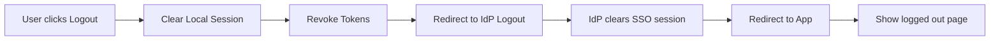

# How to Implement OIDC Authentication

Author: [nawazdhandala](https://github.com/nawazdhandala)

Tags: OIDC, OpenID Connect, Authentication, Identity, Security, OAuth2, SSO, JWT

Description: A comprehensive guide to implementing OpenID Connect (OIDC) authentication in your applications, covering provider configuration, authorization flows, token handling, and security best practices.

---

OpenID Connect (OIDC) has become the industry standard for authentication in modern web applications. Built on top of OAuth 2.0, OIDC adds an identity layer that allows applications to verify user identity and obtain basic profile information. This guide walks you through implementing OIDC authentication from the ground up, with practical examples and security best practices.

## What is OpenID Connect?

OpenID Connect is an authentication protocol that extends OAuth 2.0 with identity verification capabilities. While OAuth 2.0 handles authorization (what you can access), OIDC handles authentication (who you are). The protocol introduces the ID Token, a JSON Web Token (JWT) that contains claims about the authenticated user.

### Key Components

Before diving into implementation, let us understand the core components of OIDC:

- **Identity Provider (IdP)**: The service that authenticates users and issues tokens (e.g., Okta, Auth0, Keycloak, Azure AD)
- **Relying Party (RP)**: Your application that relies on the IdP for authentication
- **ID Token**: A JWT containing user identity claims
- **Access Token**: A token used to access protected resources (inherited from OAuth 2.0)
- **Refresh Token**: A long-lived token used to obtain new access tokens
- **UserInfo Endpoint**: An API endpoint that returns additional user profile information

## OIDC Authentication Flow

The most common OIDC flow for web applications is the Authorization Code Flow. Here is how it works:



## Setting Up Your OIDC Provider

Before implementing the client-side code, you need to register your application with an OIDC provider. Here is a general configuration that applies to most providers:

### Provider Registration

Register your application with your chosen identity provider. You will need to configure the following settings:

| Setting | Description | Example Value |
|---------|-------------|---------------|
| Client ID | Public identifier for your app | `my-web-app` |
| Client Secret | Secret key (keep secure) | `your-secret-key` |
| Redirect URIs | Allowed callback URLs | `https://app.example.com/callback` |
| Post-Logout URIs | Where to redirect after logout | `https://app.example.com` |
| Scopes | Permissions to request | `openid profile email` |

### Discovery Document

OIDC providers expose a discovery document at a well-known URL that contains all the endpoints and capabilities of the provider.

This code fetches the OIDC discovery document which contains all the endpoints you need for authentication. The discovery document is cached to avoid repeated network requests.

```javascript
// oidc-discovery.js
const DISCOVERY_CACHE = new Map();
const CACHE_TTL = 3600000; // 1 hour in milliseconds

async function getOIDCDiscovery(issuerUrl) {
  const cacheKey = issuerUrl;
  const cached = DISCOVERY_CACHE.get(cacheKey);

  // Return cached discovery if still valid
  if (cached && Date.now() - cached.timestamp < CACHE_TTL) {
    return cached.data;
  }

  // Fetch the discovery document from the well-known endpoint
  const discoveryUrl = `${issuerUrl}/.well-known/openid-configuration`;
  const response = await fetch(discoveryUrl);

  if (!response.ok) {
    throw new Error(`Failed to fetch OIDC discovery: ${response.status}`);
  }

  const discovery = await response.json();

  // Cache the discovery document
  DISCOVERY_CACHE.set(cacheKey, {
    data: discovery,
    timestamp: Date.now(),
  });

  return discovery;
}

// Example usage
const discovery = await getOIDCDiscovery('https://accounts.google.com');
console.log('Authorization endpoint:', discovery.authorization_endpoint);
console.log('Token endpoint:', discovery.token_endpoint);
console.log('UserInfo endpoint:', discovery.userinfo_endpoint);
```

## Implementing the Authorization Code Flow

### Step 1: Generate the Authorization URL

The first step in the OIDC flow is redirecting the user to the identity provider's authorization endpoint. You must include security parameters like state and PKCE to prevent CSRF and authorization code injection attacks.

```javascript
// auth-service.js
const crypto = require('crypto');

class OIDCAuthService {
  constructor(config) {
    this.clientId = config.clientId;
    this.clientSecret = config.clientSecret;
    this.redirectUri = config.redirectUri;
    this.issuerUrl = config.issuerUrl;
    this.scopes = config.scopes || ['openid', 'profile', 'email'];
    this.discovery = null;
  }

  // Generate a cryptographically secure random string for state and PKCE
  generateRandomString(length = 32) {
    return crypto.randomBytes(length).toString('base64url');
  }

  // Generate PKCE code verifier and challenge
  // PKCE prevents authorization code interception attacks
  generatePKCE() {
    const codeVerifier = this.generateRandomString(64);
    const codeChallenge = crypto
      .createHash('sha256')
      .update(codeVerifier)
      .digest('base64url');

    return { codeVerifier, codeChallenge };
  }

  async getDiscovery() {
    if (!this.discovery) {
      this.discovery = await getOIDCDiscovery(this.issuerUrl);
    }
    return this.discovery;
  }

  // Build the authorization URL with all required parameters
  async buildAuthorizationUrl(options = {}) {
    const discovery = await this.getDiscovery();

    // Generate state to prevent CSRF attacks
    const state = this.generateRandomString();

    // Generate PKCE parameters for additional security
    const { codeVerifier, codeChallenge } = this.generatePKCE();

    // Generate nonce to prevent replay attacks on ID tokens
    const nonce = this.generateRandomString();

    const params = new URLSearchParams({
      client_id: this.clientId,
      redirect_uri: this.redirectUri,
      response_type: 'code',
      scope: this.scopes.join(' '),
      state: state,
      nonce: nonce,
      code_challenge: codeChallenge,
      code_challenge_method: 'S256',
      // Optional: request specific claims
      ...(options.loginHint && { login_hint: options.loginHint }),
      ...(options.prompt && { prompt: options.prompt }),
    });

    const authorizationUrl = `${discovery.authorization_endpoint}?${params}`;

    // Return the URL and the values that need to be stored in session
    return {
      url: authorizationUrl,
      state,
      nonce,
      codeVerifier,
    };
  }
}
```

### Step 2: Handle the Callback

After the user authenticates with the identity provider, they are redirected back to your application with an authorization code. You must validate the state parameter and exchange the code for tokens.

```javascript
// callback-handler.js
async function handleOIDCCallback(req, res, authService, sessionStore) {
  const { code, state, error, error_description } = req.query;

  // Check for errors from the identity provider
  if (error) {
    console.error('OIDC error:', error, error_description);
    return res.redirect(`/login?error=${encodeURIComponent(error_description || error)}`);
  }

  // Retrieve the stored session data
  const storedSession = await sessionStore.get(req.sessionId);

  if (!storedSession) {
    return res.redirect('/login?error=session_expired');
  }

  // Validate the state parameter to prevent CSRF attacks
  // This is critical for security - never skip this check
  if (state !== storedSession.state) {
    console.error('State mismatch: possible CSRF attack');
    return res.redirect('/login?error=invalid_state');
  }

  try {
    // Exchange the authorization code for tokens
    const tokens = await authService.exchangeCodeForTokens(
      code,
      storedSession.codeVerifier
    );

    // Validate the ID token
    const idTokenClaims = await authService.validateIdToken(
      tokens.id_token,
      storedSession.nonce
    );

    // Create the user session
    const user = {
      id: idTokenClaims.sub,
      email: idTokenClaims.email,
      name: idTokenClaims.name,
      picture: idTokenClaims.picture,
    };

    // Store tokens securely (consider encryption at rest)
    await sessionStore.set(req.sessionId, {
      user,
      accessToken: tokens.access_token,
      refreshToken: tokens.refresh_token,
      idToken: tokens.id_token,
      expiresAt: Date.now() + (tokens.expires_in * 1000),
    });

    // Clear the temporary auth state
    await sessionStore.clearAuthState(req.sessionId);

    // Redirect to the original destination or dashboard
    const returnTo = storedSession.returnTo || '/dashboard';
    res.redirect(returnTo);

  } catch (error) {
    console.error('Token exchange failed:', error);
    res.redirect('/login?error=token_exchange_failed');
  }
}
```

### Step 3: Exchange Code for Tokens

The token exchange is a server-to-server request where you send the authorization code and receive tokens in return. This request must include your client credentials.

```javascript
// token-exchange.js
async function exchangeCodeForTokens(code, codeVerifier) {
  const discovery = await this.getDiscovery();

  // Build the token request body
  const body = new URLSearchParams({
    grant_type: 'authorization_code',
    code: code,
    redirect_uri: this.redirectUri,
    client_id: this.clientId,
    client_secret: this.clientSecret,
    code_verifier: codeVerifier,
  });

  const response = await fetch(discovery.token_endpoint, {
    method: 'POST',
    headers: {
      'Content-Type': 'application/x-www-form-urlencoded',
    },
    body: body.toString(),
  });

  if (!response.ok) {
    const errorData = await response.json();
    throw new Error(`Token exchange failed: ${errorData.error_description || errorData.error}`);
  }

  return response.json();
}
```

## Validating ID Tokens

ID token validation is critical for security. You must verify the signature, issuer, audience, and expiration before trusting the token claims.



This validation function performs all the security checks required by the OIDC specification. Each check is critical and should not be skipped.

```javascript
// token-validation.js
const jwt = require('jsonwebtoken');
const jwksClient = require('jwks-rsa');

class TokenValidator {
  constructor(issuerUrl, clientId) {
    this.issuerUrl = issuerUrl;
    this.clientId = clientId;
    this.jwksClient = null;
  }

  // Initialize the JWKS client for fetching signing keys
  async initJwksClient() {
    if (this.jwksClient) return;

    const discovery = await getOIDCDiscovery(this.issuerUrl);

    this.jwksClient = jwksClient({
      jwksUri: discovery.jwks_uri,
      cache: true,
      cacheMaxAge: 86400000, // 24 hours
      rateLimit: true,
      jwksRequestsPerMinute: 10,
    });
  }

  // Retrieve the signing key for a specific key ID
  async getSigningKey(kid) {
    await this.initJwksClient();

    return new Promise((resolve, reject) => {
      this.jwksClient.getSigningKey(kid, (err, key) => {
        if (err) {
          reject(err);
        } else {
          resolve(key.getPublicKey());
        }
      });
    });
  }

  // Validate the ID token with all required checks
  async validateIdToken(idToken, expectedNonce) {
    // Decode the token header to get the key ID
    const decoded = jwt.decode(idToken, { complete: true });

    if (!decoded) {
      throw new Error('Invalid token format');
    }

    // Get the public key used to sign this token
    const publicKey = await this.getSigningKey(decoded.header.kid);

    // Verify the token signature and standard claims
    const claims = jwt.verify(idToken, publicKey, {
      issuer: this.issuerUrl,
      audience: this.clientId,
      algorithms: ['RS256', 'RS384', 'RS512'],
    });

    // Verify the nonce to prevent replay attacks
    // The nonce was generated during the authorization request
    if (claims.nonce !== expectedNonce) {
      throw new Error('Nonce mismatch: possible replay attack');
    }

    // Verify the token is not too old (auth_time claim)
    // Optional: reject tokens if authentication happened too long ago
    if (claims.auth_time) {
      const maxAuthAge = 3600; // 1 hour
      if (Date.now() / 1000 - claims.auth_time > maxAuthAge) {
        throw new Error('Authentication is too old');
      }
    }

    return claims;
  }
}
```

## Implementing Token Refresh

Access tokens expire frequently for security reasons. Use refresh tokens to obtain new access tokens without requiring the user to re-authenticate.

```javascript
// token-refresh.js
class TokenManager {
  constructor(authService, sessionStore) {
    this.authService = authService;
    this.sessionStore = sessionStore;
    // Buffer time before expiration to refresh proactively
    this.refreshBuffer = 60000; // 1 minute
  }

  // Check if the access token needs to be refreshed
  isTokenExpiring(session) {
    if (!session.expiresAt) return true;
    return Date.now() > (session.expiresAt - this.refreshBuffer);
  }

  // Refresh the access token using the refresh token
  async refreshAccessToken(sessionId) {
    const session = await this.sessionStore.get(sessionId);

    if (!session || !session.refreshToken) {
      throw new Error('No refresh token available');
    }

    const discovery = await this.authService.getDiscovery();

    // Build the refresh token request
    const body = new URLSearchParams({
      grant_type: 'refresh_token',
      refresh_token: session.refreshToken,
      client_id: this.authService.clientId,
      client_secret: this.authService.clientSecret,
    });

    const response = await fetch(discovery.token_endpoint, {
      method: 'POST',
      headers: {
        'Content-Type': 'application/x-www-form-urlencoded',
      },
      body: body.toString(),
    });

    if (!response.ok) {
      // Refresh token is invalid or expired
      // User needs to re-authenticate
      await this.sessionStore.delete(sessionId);
      throw new Error('Refresh token expired');
    }

    const tokens = await response.json();

    // Update the session with new tokens
    await this.sessionStore.set(sessionId, {
      ...session,
      accessToken: tokens.access_token,
      // Some providers rotate refresh tokens
      refreshToken: tokens.refresh_token || session.refreshToken,
      expiresAt: Date.now() + (tokens.expires_in * 1000),
    });

    return tokens.access_token;
  }

  // Middleware to ensure valid access token
  async ensureValidToken(sessionId) {
    const session = await this.sessionStore.get(sessionId);

    if (!session) {
      throw new Error('No session found');
    }

    if (this.isTokenExpiring(session)) {
      return this.refreshAccessToken(sessionId);
    }

    return session.accessToken;
  }
}
```

## Fetching User Information

The UserInfo endpoint provides additional claims about the authenticated user that may not be included in the ID token.

```javascript
// userinfo.js
async function fetchUserInfo(accessToken, userInfoEndpoint) {
  const response = await fetch(userInfoEndpoint, {
    headers: {
      'Authorization': `Bearer ${accessToken}`,
    },
  });

  if (!response.ok) {
    if (response.status === 401) {
      throw new Error('Access token is invalid or expired');
    }
    throw new Error(`UserInfo request failed: ${response.status}`);
  }

  return response.json();
}

// Example: Enrich user profile with additional claims
async function enrichUserProfile(session, authService) {
  const discovery = await authService.getDiscovery();

  const userInfo = await fetchUserInfo(
    session.accessToken,
    discovery.userinfo_endpoint
  );

  // Merge ID token claims with UserInfo response
  return {
    ...session.user,
    ...userInfo,
    // Ensure sub claim matches
    id: userInfo.sub,
  };
}
```

## Implementing Logout

Proper logout requires both local session cleanup and notification to the identity provider.



This logout implementation performs a complete cleanup by revoking tokens at the identity provider and clearing the local session.

```javascript
// logout.js
async function handleLogout(req, res, authService, sessionStore) {
  const session = await sessionStore.get(req.sessionId);

  if (!session) {
    return res.redirect('/');
  }

  const discovery = await authService.getDiscovery();

  // Revoke the refresh token if the provider supports it
  if (discovery.revocation_endpoint && session.refreshToken) {
    try {
      await fetch(discovery.revocation_endpoint, {
        method: 'POST',
        headers: {
          'Content-Type': 'application/x-www-form-urlencoded',
        },
        body: new URLSearchParams({
          token: session.refreshToken,
          token_type_hint: 'refresh_token',
          client_id: authService.clientId,
          client_secret: authService.clientSecret,
        }).toString(),
      });
    } catch (error) {
      // Log but do not block logout if revocation fails
      console.error('Token revocation failed:', error);
    }
  }

  // Clear the local session
  await sessionStore.delete(req.sessionId);

  // Clear the session cookie
  res.clearCookie('session');

  // Redirect to the identity provider's logout endpoint
  // This terminates the SSO session
  if (discovery.end_session_endpoint) {
    const logoutParams = new URLSearchParams({
      id_token_hint: session.idToken,
      post_logout_redirect_uri: `${process.env.APP_URL}/`,
      client_id: authService.clientId,
    });

    return res.redirect(`${discovery.end_session_endpoint}?${logoutParams}`);
  }

  // If no end_session_endpoint, just redirect to home
  res.redirect('/');
}
```

## Express.js Integration Example

Here is a complete Express.js integration that ties all the pieces together.

```javascript
// app.js
const express = require('express');
const session = require('express-session');
const { OIDCAuthService } = require('./auth-service');
const { TokenValidator } = require('./token-validation');
const { TokenManager } = require('./token-refresh');
const RedisStore = require('connect-redis').default;
const { createClient } = require('redis');

const app = express();

// Initialize Redis for session storage
const redisClient = createClient({ url: process.env.REDIS_URL });
redisClient.connect();

// Configure session middleware with secure settings
app.use(session({
  store: new RedisStore({ client: redisClient }),
  secret: process.env.SESSION_SECRET,
  resave: false,
  saveUninitialized: false,
  cookie: {
    secure: process.env.NODE_ENV === 'production',
    httpOnly: true,
    sameSite: 'lax',
    maxAge: 86400000, // 24 hours
  },
}));

// Initialize OIDC services
const authService = new OIDCAuthService({
  clientId: process.env.OIDC_CLIENT_ID,
  clientSecret: process.env.OIDC_CLIENT_SECRET,
  redirectUri: `${process.env.APP_URL}/auth/callback`,
  issuerUrl: process.env.OIDC_ISSUER_URL,
  scopes: ['openid', 'profile', 'email', 'offline_access'],
});

const tokenValidator = new TokenValidator(
  process.env.OIDC_ISSUER_URL,
  process.env.OIDC_CLIENT_ID
);

// Session store adapter for the token manager
const sessionStore = {
  get: async (id) => {
    return new Promise((resolve) => {
      app.sessionStore.get(id, (err, session) => {
        resolve(err ? null : session);
      });
    });
  },
  set: async (id, data) => {
    return new Promise((resolve, reject) => {
      app.sessionStore.set(id, data, (err) => {
        err ? reject(err) : resolve();
      });
    });
  },
  delete: async (id) => {
    return new Promise((resolve) => {
      app.sessionStore.destroy(id, () => resolve());
    });
  },
};

const tokenManager = new TokenManager(authService, sessionStore);

// Login route - initiates the OIDC flow
app.get('/auth/login', async (req, res) => {
  try {
    const { url, state, nonce, codeVerifier } = await authService.buildAuthorizationUrl({
      prompt: req.query.prompt,
    });

    // Store auth state in session for validation
    req.session.authState = {
      state,
      nonce,
      codeVerifier,
      returnTo: req.query.returnTo || '/dashboard',
    };

    res.redirect(url);
  } catch (error) {
    console.error('Login initiation failed:', error);
    res.redirect('/error?message=login_failed');
  }
});

// Callback route - handles the redirect from the identity provider
app.get('/auth/callback', async (req, res) => {
  const { code, state, error, error_description } = req.query;

  if (error) {
    console.error('OIDC error:', error, error_description);
    return res.redirect(`/error?message=${encodeURIComponent(error_description || error)}`);
  }

  const authState = req.session.authState;

  if (!authState || state !== authState.state) {
    return res.redirect('/error?message=invalid_state');
  }

  try {
    // Exchange code for tokens
    const tokens = await authService.exchangeCodeForTokens(
      code,
      authState.codeVerifier
    );

    // Validate the ID token
    const claims = await tokenValidator.validateIdToken(
      tokens.id_token,
      authState.nonce
    );

    // Store user and tokens in session
    req.session.user = {
      id: claims.sub,
      email: claims.email,
      name: claims.name,
      picture: claims.picture,
    };
    req.session.tokens = {
      accessToken: tokens.access_token,
      refreshToken: tokens.refresh_token,
      idToken: tokens.id_token,
      expiresAt: Date.now() + (tokens.expires_in * 1000),
    };

    // Clear auth state
    delete req.session.authState;

    res.redirect(authState.returnTo);
  } catch (error) {
    console.error('Callback handling failed:', error);
    res.redirect('/error?message=authentication_failed');
  }
});

// Logout route
app.get('/auth/logout', async (req, res) => {
  const idToken = req.session.tokens?.idToken;

  // Destroy the session
  req.session.destroy(async (err) => {
    if (err) {
      console.error('Session destruction failed:', err);
    }

    res.clearCookie('connect.sid');

    // Redirect to IdP logout
    const discovery = await authService.getDiscovery();
    if (discovery.end_session_endpoint && idToken) {
      const params = new URLSearchParams({
        id_token_hint: idToken,
        post_logout_redirect_uri: process.env.APP_URL,
      });
      res.redirect(`${discovery.end_session_endpoint}?${params}`);
    } else {
      res.redirect('/');
    }
  });
});

// Authentication middleware
function requireAuth(req, res, next) {
  if (!req.session.user) {
    return res.redirect(`/auth/login?returnTo=${encodeURIComponent(req.originalUrl)}`);
  }
  next();
}

// Protected route example
app.get('/dashboard', requireAuth, (req, res) => {
  res.json({
    message: 'Welcome to your dashboard',
    user: req.session.user,
  });
});

// API route with token refresh
app.get('/api/profile', requireAuth, async (req, res) => {
  try {
    // Ensure we have a valid access token
    const accessToken = await tokenManager.ensureValidToken(req.sessionID);

    // Fetch user info from the IdP
    const discovery = await authService.getDiscovery();
    const userInfo = await fetch(discovery.userinfo_endpoint, {
      headers: { Authorization: `Bearer ${accessToken}` },
    }).then(r => r.json());

    res.json(userInfo);
  } catch (error) {
    if (error.message === 'Refresh token expired') {
      return res.redirect('/auth/login');
    }
    res.status(500).json({ error: error.message });
  }
});

app.listen(3000, () => {
  console.log('Server running on http://localhost:3000');
});
```

## Security Best Practices

### 1. Always Use PKCE

PKCE (Proof Key for Code Exchange) prevents authorization code interception attacks. Even if your application is a confidential client with a client secret, PKCE provides an additional layer of security.

```javascript
// Always generate and use PKCE parameters
const { codeVerifier, codeChallenge } = generatePKCE();

// Include in authorization request
params.append('code_challenge', codeChallenge);
params.append('code_challenge_method', 'S256');

// Include verifier in token request
body.append('code_verifier', codeVerifier);
```

### 2. Validate All Token Claims

Never skip claim validation. Each check serves a specific security purpose.

```javascript
// Required validations for ID tokens
const validations = {
  iss: 'Issuer must match your IdP',
  aud: 'Audience must include your client_id',
  exp: 'Token must not be expired',
  iat: 'Issued-at must be in the past',
  nonce: 'Must match the nonce you sent',
};
```

### 3. Secure Session Configuration

Configure sessions with security-focused settings.

```javascript
// Secure session configuration
app.use(session({
  // Use a secure, random secret
  secret: process.env.SESSION_SECRET,
  // Do not save session if nothing changed
  resave: false,
  // Do not create session until data is stored
  saveUninitialized: false,
  cookie: {
    // Only send over HTTPS in production
    secure: process.env.NODE_ENV === 'production',
    // Prevent JavaScript access to cookies
    httpOnly: true,
    // Protect against CSRF
    sameSite: 'lax',
    // Set reasonable expiration
    maxAge: 86400000,
  },
}));
```

### 4. Store Tokens Securely

Never expose tokens to the frontend if possible. Store them server-side and use session cookies for authentication.

```javascript
// Good: Store tokens server-side only
req.session.tokens = {
  accessToken,
  refreshToken,
  idToken,
};

// Bad: Sending tokens to the frontend
res.json({ accessToken }); // Avoid this
```

### 5. Implement Proper Error Handling

Handle errors gracefully without exposing sensitive information.

```javascript
// Do not expose internal errors to users
app.use((err, req, res, next) => {
  console.error('Error:', err);

  // Generic error for users
  res.status(500).json({
    error: 'An error occurred',
    // Include trace ID for debugging
    traceId: req.traceId,
  });
});
```

## Common OIDC Scopes

Understanding available scopes helps you request only the permissions you need:

| Scope | Description | Claims Returned |
|-------|-------------|-----------------|
| `openid` | Required for OIDC | `sub` |
| `profile` | Basic profile info | `name`, `family_name`, `given_name`, `picture` |
| `email` | Email address | `email`, `email_verified` |
| `address` | Physical address | `address` object |
| `phone` | Phone number | `phone_number`, `phone_number_verified` |
| `offline_access` | Request refresh token | N/A |

## Testing Your OIDC Implementation

Create comprehensive tests for your OIDC integration.

```javascript
// oidc.test.js
const { expect } = require('chai');
const { TokenValidator } = require('./token-validation');
const jwt = require('jsonwebtoken');

describe('OIDC Token Validation', () => {
  const validator = new TokenValidator(
    'https://example.auth0.com',
    'test-client-id'
  );

  it('should reject tokens with invalid issuer', async () => {
    const token = jwt.sign(
      { iss: 'https://malicious.com', aud: 'test-client-id' },
      'secret'
    );

    await expect(validator.validateIdToken(token, 'nonce'))
      .to.be.rejectedWith('Invalid issuer');
  });

  it('should reject tokens with mismatched nonce', async () => {
    const token = jwt.sign(
      {
        iss: 'https://example.auth0.com',
        aud: 'test-client-id',
        nonce: 'original-nonce',
      },
      'secret'
    );

    await expect(validator.validateIdToken(token, 'different-nonce'))
      .to.be.rejectedWith('Nonce mismatch');
  });

  it('should reject expired tokens', async () => {
    const token = jwt.sign(
      {
        iss: 'https://example.auth0.com',
        aud: 'test-client-id',
        exp: Math.floor(Date.now() / 1000) - 3600, // 1 hour ago
      },
      'secret'
    );

    await expect(validator.validateIdToken(token, 'nonce'))
      .to.be.rejectedWith('Token expired');
  });
});
```

## Troubleshooting Common Issues

### Invalid Redirect URI

Ensure your redirect URI exactly matches what is registered with the identity provider, including trailing slashes and protocol.

### State Mismatch

State mismatches usually indicate session issues. Ensure sessions persist correctly across redirects.

### Token Validation Failures

Check that your clock is synchronized. JWT validation is time-sensitive.

### CORS Issues

OIDC token endpoints do not support CORS. Always make token requests from your backend.

## Summary

Implementing OIDC authentication requires attention to security details at every step:

1. **Use the Authorization Code Flow** with PKCE for web applications
2. **Validate all token claims** including issuer, audience, expiration, and nonce
3. **Store tokens securely** on the server side, never in localStorage
4. **Implement token refresh** to maintain seamless user sessions
5. **Handle logout properly** by revoking tokens and terminating IdP sessions

OIDC provides a standardized, secure way to authenticate users across applications. By following these patterns and best practices, you can implement robust authentication that protects your users and your application.
