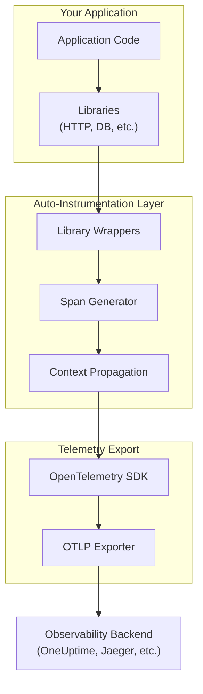
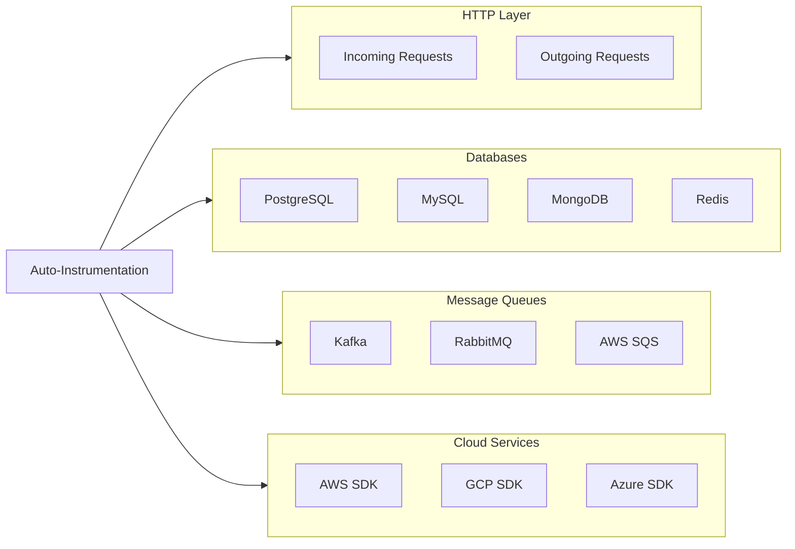

# How to Use OpenTelemetry Auto-Instrumentation

Author: [nawazdhandala](https://github.com/nawazdhandala)

Tags: OpenTelemetry, Auto-Instrumentation, Observability, Tracing, Monitoring, Python, Node.js, Java

Description: A practical guide to using OpenTelemetry auto-instrumentation across multiple languages. Learn how to get instant observability without writing instrumentation code manually.

---

Getting observability into your applications typically requires adding tracing code throughout your codebase. OpenTelemetry auto-instrumentation eliminates most of that work by automatically capturing traces, metrics, and spans from common libraries and frameworks. You get immediate visibility into HTTP requests, database queries, and external service calls without modifying your application code.

For foundational concepts, check out our guides on [traces and spans](https://oneuptime.com/blog/post/2025-08-27-traces-and-spans-in-opentelemetry/view) and [reducing noise in OpenTelemetry](https://oneuptime.com/blog/post/2025-08-25-how-to-reduce-noise-in-opentelemetry/view).

## What Auto-Instrumentation Does

Auto-instrumentation works by monkey-patching or wrapping common libraries at runtime. When your application makes an HTTP request, queries a database, or calls an external service, the auto-instrumentation layer intercepts these calls and creates spans automatically.

The following diagram shows how auto-instrumentation fits into your application architecture:



## Node.js Auto-Instrumentation

### Installation

The Node.js auto-instrumentation package bundles instrumentations for common libraries including Express, HTTP, PostgreSQL, MySQL, Redis, and many more.

```bash
npm install @opentelemetry/api \
  @opentelemetry/sdk-node \
  @opentelemetry/auto-instrumentations-node \
  @opentelemetry/exporter-trace-otlp-http
```

### Basic Configuration

Create a separate instrumentation file that must be loaded before any other modules. The early loading is critical because auto-instrumentation needs to wrap libraries before your application imports them.

```javascript
// instrumentation.js
// Load this file FIRST using: node --require ./instrumentation.js app.js

const { NodeSDK } = require('@opentelemetry/sdk-node');
const { getNodeAutoInstrumentations } = require('@opentelemetry/auto-instrumentations-node');
const { OTLPTraceExporter } = require('@opentelemetry/exporter-trace-otlp-http');
const { Resource } = require('@opentelemetry/resources');
const { SemanticResourceAttributes } = require('@opentelemetry/semantic-conventions');

// Define your service identity - appears in all traces
const resource = new Resource({
  [SemanticResourceAttributes.SERVICE_NAME]: process.env.OTEL_SERVICE_NAME || 'my-node-service',
  [SemanticResourceAttributes.SERVICE_VERSION]: '1.0.0',
  [SemanticResourceAttributes.DEPLOYMENT_ENVIRONMENT]: process.env.NODE_ENV || 'development',
});

// Configure the OTLP exporter to send traces to your backend
const traceExporter = new OTLPTraceExporter({
  url: process.env.OTEL_EXPORTER_OTLP_ENDPOINT || 'http://localhost:4318/v1/traces',
});

// Initialize the SDK with auto-instrumentations
const sdk = new NodeSDK({
  resource,
  traceExporter,
  instrumentations: [
    getNodeAutoInstrumentations({
      // Enable specific instrumentations
      '@opentelemetry/instrumentation-http': { enabled: true },
      '@opentelemetry/instrumentation-express': { enabled: true },
      '@opentelemetry/instrumentation-pg': { enabled: true },
      '@opentelemetry/instrumentation-redis': { enabled: true },
      // Disable file system instrumentation to reduce noise
      '@opentelemetry/instrumentation-fs': { enabled: false },
    }),
  ],
});

// Start the SDK before your app loads
sdk.start();

// Ensure graceful shutdown
process.on('SIGTERM', () => {
  sdk.shutdown()
    .then(() => console.log('OpenTelemetry SDK shut down successfully'))
    .catch((error) => console.error('Error shutting down SDK', error))
    .finally(() => process.exit(0));
});

module.exports = sdk;
```

### Running Your Application

Use the Node.js `--require` flag to load instrumentation before your application code.

```bash
# Using the require flag ensures instrumentation loads first
node --require ./instrumentation.js app.js

# Or set it via NODE_OPTIONS environment variable
export NODE_OPTIONS="--require ./instrumentation.js"
node app.js
```

### Zero-Code Option with Environment Variables

For even simpler setup, use the auto-instrumentation package as a preload module without creating a configuration file.

```bash
# Install the auto-instrumentation package globally or locally
npm install @opentelemetry/auto-instrumentations-node

# Run with environment configuration only
export OTEL_SERVICE_NAME=my-service
export OTEL_EXPORTER_OTLP_ENDPOINT=http://localhost:4318
export OTEL_TRACES_EXPORTER=otlp
export OTEL_NODE_RESOURCE_DETECTORS=env,host,os

node --require @opentelemetry/auto-instrumentations-node/register app.js
```

## Python Auto-Instrumentation

### Installation

Python's auto-instrumentation is distributed through the `opentelemetry-distro` package which provides a convenient installation mechanism.

```bash
# Install the base packages
pip install opentelemetry-distro opentelemetry-exporter-otlp

# Bootstrap installs all available instrumentations for detected libraries
opentelemetry-bootstrap -a install
```

### Running with Auto-Instrumentation

The `opentelemetry-instrument` command wraps your Python application and enables auto-instrumentation at runtime.

```bash
# Basic usage with default settings
opentelemetry-instrument python app.py

# With explicit configuration
opentelemetry-instrument \
  --service_name my-python-service \
  --exporter_otlp_endpoint http://localhost:4318 \
  python app.py
```

### Environment Variable Configuration

Configure auto-instrumentation entirely through environment variables for container deployments.

```bash
# Service identification
export OTEL_SERVICE_NAME=my-python-service
export OTEL_RESOURCE_ATTRIBUTES=service.version=1.0.0,deployment.environment=production

# Exporter configuration
export OTEL_EXPORTER_OTLP_ENDPOINT=http://localhost:4318
export OTEL_EXPORTER_OTLP_PROTOCOL=http/protobuf

# Trace settings
export OTEL_TRACES_SAMPLER=parentbased_traceidratio
export OTEL_TRACES_SAMPLER_ARG=0.1

# Run the application
opentelemetry-instrument python app.py
```

### Dockerfile Example

A minimal Dockerfile that includes Python auto-instrumentation for containerized deployments.

```dockerfile
FROM python:3.11-slim

WORKDIR /app

# Copy application requirements
COPY requirements.txt .

# Install application dependencies
RUN pip install --no-cache-dir -r requirements.txt

# Install OpenTelemetry auto-instrumentation
RUN pip install opentelemetry-distro opentelemetry-exporter-otlp && \
    opentelemetry-bootstrap -a install

# Copy application code
COPY . .

# Set OpenTelemetry environment variables
ENV OTEL_SERVICE_NAME=my-python-service
ENV OTEL_EXPORTER_OTLP_ENDPOINT=http://otel-collector:4318
ENV OTEL_PYTHON_LOGGING_AUTO_INSTRUMENTATION_ENABLED=true

# Run with auto-instrumentation
CMD ["opentelemetry-instrument", "python", "app.py"]
```

### Django Configuration

For Django applications, auto-instrumentation works seamlessly with both WSGI and ASGI deployments.

```bash
# Install Django-specific instrumentation
pip install opentelemetry-instrumentation-django

# Run Django with auto-instrumentation
opentelemetry-instrument python manage.py runserver

# Production with gunicorn
opentelemetry-instrument gunicorn myproject.wsgi:application \
  --workers 4 \
  --bind 0.0.0.0:8000
```

### FastAPI Configuration

FastAPI applications using uvicorn require the ASGI instrumentation.

```bash
# Install FastAPI/ASGI instrumentation
pip install opentelemetry-instrumentation-fastapi opentelemetry-instrumentation-asgi

# Run with auto-instrumentation
opentelemetry-instrument uvicorn main:app --host 0.0.0.0 --port 8000
```

## Java Auto-Instrumentation

### Java Agent Approach

Java auto-instrumentation uses a Java agent that attaches to the JVM at startup. Download the agent JAR and include it in your startup command.

```bash
# Download the latest OpenTelemetry Java agent
curl -L -o opentelemetry-javaagent.jar \
  https://github.com/open-telemetry/opentelemetry-java-instrumentation/releases/latest/download/opentelemetry-javaagent.jar
```

### Running with the Java Agent

Attach the agent using the `-javaagent` JVM flag. The agent automatically instruments supported libraries.

```bash
# Basic usage
java -javaagent:opentelemetry-javaagent.jar \
  -Dotel.service.name=my-java-service \
  -Dotel.exporter.otlp.endpoint=http://localhost:4318 \
  -jar myapp.jar

# With additional configuration
java -javaagent:opentelemetry-javaagent.jar \
  -Dotel.service.name=my-java-service \
  -Dotel.resource.attributes=service.version=1.0.0,deployment.environment=production \
  -Dotel.exporter.otlp.endpoint=http://localhost:4318 \
  -Dotel.traces.sampler=parentbased_traceidratio \
  -Dotel.traces.sampler.arg=0.1 \
  -jar myapp.jar
```

### Environment Variable Configuration for Java

Configure the Java agent through environment variables for Kubernetes deployments.

```bash
# Export configuration as environment variables
export OTEL_SERVICE_NAME=my-java-service
export OTEL_EXPORTER_OTLP_ENDPOINT=http://localhost:4318
export OTEL_RESOURCE_ATTRIBUTES=service.version=1.0.0
export OTEL_TRACES_SAMPLER=parentbased_traceidratio
export OTEL_TRACES_SAMPLER_ARG=0.1

# Run with the agent
java -javaagent:opentelemetry-javaagent.jar -jar myapp.jar
```

### Spring Boot Configuration

Spring Boot applications work seamlessly with the Java agent. No code changes required.

```bash
# Run Spring Boot with auto-instrumentation
java -javaagent:opentelemetry-javaagent.jar \
  -Dotel.service.name=spring-boot-service \
  -Dotel.exporter.otlp.endpoint=http://localhost:4318 \
  -jar spring-boot-app.jar
```

### Dockerfile for Java Applications

A production-ready Dockerfile that includes the OpenTelemetry Java agent.

```dockerfile
FROM eclipse-temurin:17-jre-jammy

WORKDIR /app

# Download OpenTelemetry Java agent
ADD https://github.com/open-telemetry/opentelemetry-java-instrumentation/releases/latest/download/opentelemetry-javaagent.jar /app/opentelemetry-javaagent.jar

# Copy application JAR
COPY target/myapp.jar /app/myapp.jar

# Set environment variables for OpenTelemetry
ENV JAVA_TOOL_OPTIONS="-javaagent:/app/opentelemetry-javaagent.jar"
ENV OTEL_SERVICE_NAME=my-java-service
ENV OTEL_EXPORTER_OTLP_ENDPOINT=http://otel-collector:4318

# Run the application
CMD ["java", "-jar", "myapp.jar"]
```

## Kubernetes Deployment

### Deploying with Auto-Instrumentation in Kubernetes

The following example shows a Kubernetes deployment with OpenTelemetry auto-instrumentation for a Node.js application.

```yaml
apiVersion: apps/v1
kind: Deployment
metadata:
  name: my-node-app
spec:
  replicas: 3
  selector:
    matchLabels:
      app: my-node-app
  template:
    metadata:
      labels:
        app: my-node-app
    spec:
      containers:
      - name: app
        image: my-node-app:latest
        ports:
        - containerPort: 3000
        env:
        # OpenTelemetry configuration via environment variables
        - name: OTEL_SERVICE_NAME
          value: "my-node-app"
        - name: OTEL_EXPORTER_OTLP_ENDPOINT
          value: "http://otel-collector.monitoring:4318"
        - name: OTEL_RESOURCE_ATTRIBUTES
          value: "service.version=1.0.0,deployment.environment=production"
        - name: OTEL_TRACES_SAMPLER
          value: "parentbased_traceidratio"
        - name: OTEL_TRACES_SAMPLER_ARG
          value: "0.1"
        # Add pod and node information to traces
        - name: OTEL_RESOURCE_ATTRIBUTES
          value: "k8s.pod.name=$(POD_NAME),k8s.namespace.name=$(NAMESPACE)"
        - name: POD_NAME
          valueFrom:
            fieldRef:
              fieldPath: metadata.name
        - name: NAMESPACE
          valueFrom:
            fieldRef:
              fieldPath: metadata.namespace
```

### OpenTelemetry Operator for Kubernetes

For advanced Kubernetes deployments, the OpenTelemetry Operator can automatically inject instrumentation into pods.

```yaml
# Install the OpenTelemetry Operator first
# kubectl apply -f https://github.com/open-telemetry/opentelemetry-operator/releases/latest/download/opentelemetry-operator.yaml

# Define an Instrumentation resource
apiVersion: opentelemetry.io/v1alpha1
kind: Instrumentation
metadata:
  name: auto-instrumentation
  namespace: default
spec:
  exporter:
    endpoint: http://otel-collector.monitoring:4318
  propagators:
    - tracecontext
    - baggage
  sampler:
    type: parentbased_traceidratio
    argument: "0.1"
  # Language-specific configuration
  nodejs:
    image: ghcr.io/open-telemetry/opentelemetry-operator/autoinstrumentation-nodejs:latest
  python:
    image: ghcr.io/open-telemetry/opentelemetry-operator/autoinstrumentation-python:latest
  java:
    image: ghcr.io/open-telemetry/opentelemetry-operator/autoinstrumentation-java:latest
```

Annotate your pods to enable automatic injection:

```yaml
apiVersion: apps/v1
kind: Deployment
metadata:
  name: my-app
spec:
  template:
    metadata:
      annotations:
        # Inject Node.js auto-instrumentation
        instrumentation.opentelemetry.io/inject-nodejs: "true"
        # Or for Python
        # instrumentation.opentelemetry.io/inject-python: "true"
        # Or for Java
        # instrumentation.opentelemetry.io/inject-java: "true"
    spec:
      containers:
      - name: app
        image: my-app:latest
```

## What Gets Instrumented Automatically

Auto-instrumentation captures telemetry from many common libraries without code changes. The following diagram shows the typical coverage:



### Node.js Supported Libraries

| Category | Libraries |
|----------|-----------|
| **HTTP** | http, https, express, fastify, koa, hapi, restify |
| **Database** | pg, mysql, mysql2, mongodb, redis, ioredis |
| **Message Queues** | amqplib, kafkajs |
| **Cloud** | aws-sdk, @aws-sdk/* |
| **GraphQL** | graphql, @apollo/server |
| **gRPC** | @grpc/grpc-js |

### Python Supported Libraries

| Category | Libraries |
|----------|-----------|
| **HTTP** | requests, urllib3, httpx, aiohttp |
| **Frameworks** | django, flask, fastapi, starlette |
| **Database** | psycopg2, pymysql, pymongo, redis |
| **Message Queues** | pika, confluent-kafka, celery |
| **Cloud** | boto3, botocore |

### Java Supported Libraries

| Category | Libraries |
|----------|-----------|
| **HTTP** | HttpURLConnection, OkHttp, Apache HttpClient |
| **Frameworks** | Spring, Spring Boot, JAX-RS, Servlet |
| **Database** | JDBC, Hibernate, R2DBC |
| **Message Queues** | Kafka, RabbitMQ, JMS |
| **Cloud** | AWS SDK v1 and v2 |

## Customizing Auto-Instrumentation

### Selective Instrumentation in Node.js

Enable only the instrumentations you need to reduce overhead and noise.

```javascript
// instrumentation.js
const { getNodeAutoInstrumentations } = require('@opentelemetry/auto-instrumentations-node');

const instrumentations = getNodeAutoInstrumentations({
  // Enable HTTP and Express
  '@opentelemetry/instrumentation-http': {
    enabled: true,
    // Ignore health check endpoints
    ignoreIncomingRequestHook: (req) => {
      return req.url === '/health' || req.url === '/ready';
    },
  },
  '@opentelemetry/instrumentation-express': { enabled: true },

  // Enable database instrumentations
  '@opentelemetry/instrumentation-pg': { enabled: true },
  '@opentelemetry/instrumentation-redis': { enabled: true },

  // Disable noisy instrumentations
  '@opentelemetry/instrumentation-fs': { enabled: false },
  '@opentelemetry/instrumentation-dns': { enabled: false },
  '@opentelemetry/instrumentation-net': { enabled: false },
});
```

### Adding Custom Attributes

Enhance auto-instrumented spans with custom attributes for better context.

```javascript
const { trace } = require('@opentelemetry/api');

// Middleware to add request context to auto-instrumented spans
function enrichSpanMiddleware(req, res, next) {
  const span = trace.getActiveSpan();

  if (span) {
    // Add user context
    if (req.user) {
      span.setAttribute('user.id', req.user.id);
      span.setAttribute('user.tenant', req.user.tenantId);
    }

    // Add request metadata
    span.setAttribute('http.request_id', req.headers['x-request-id']);
    span.setAttribute('http.client_version', req.headers['x-client-version']);
  }

  next();
}

app.use(enrichSpanMiddleware);
```

### Python Custom Span Enhancement

Add custom attributes to auto-instrumented spans in Python using span processors.

```python
from opentelemetry import trace
from opentelemetry.sdk.trace import SpanProcessor

class CustomAttributeSpanProcessor(SpanProcessor):
    """Add custom attributes to all spans."""

    def on_start(self, span, parent_context):
        # Add environment information
        span.set_attribute("app.version", "1.0.0")
        span.set_attribute("app.region", "us-east-1")

    def on_end(self, span):
        pass

    def shutdown(self):
        pass

    def force_flush(self, timeout_millis=30000):
        return True

# Register the processor
from opentelemetry.sdk.trace import TracerProvider

provider = TracerProvider()
provider.add_span_processor(CustomAttributeSpanProcessor())
trace.set_tracer_provider(provider)
```

## Combining Auto and Manual Instrumentation

Auto-instrumentation captures infrastructure-level telemetry. Manual instrumentation adds business context. Use both together for complete observability.

```javascript
const { trace } = require('@opentelemetry/api');

// Auto-instrumentation handles Express routes and HTTP calls
// Manual instrumentation adds business logic spans

const tracer = trace.getTracer('order-service');

app.post('/orders', async (req, res) => {
  // The Express auto-instrumentation already created a span for the route
  // Add a child span for business logic

  return tracer.startActiveSpan('process-order', async (span) => {
    try {
      span.setAttribute('order.customer_id', req.body.customerId);
      span.setAttribute('order.items_count', req.body.items.length);

      // Validate order - create child span for timing
      await tracer.startActiveSpan('validate-order', async (validationSpan) => {
        await validateOrder(req.body);
        validationSpan.end();
      });

      // Process payment - auto-instrumentation captures the HTTP call to payment service
      // but we add business context
      await tracer.startActiveSpan('process-payment', async (paymentSpan) => {
        paymentSpan.setAttribute('payment.method', req.body.paymentMethod);
        await processPayment(req.body.payment);
        paymentSpan.end();
      });

      // Create the order
      const order = await createOrder(req.body);
      span.setAttribute('order.id', order.id);
      span.setAttribute('order.total', order.total);

      res.status(201).json(order);
    } catch (error) {
      span.recordException(error);
      span.setStatus({ code: trace.SpanStatusCode.ERROR });
      res.status(500).json({ error: 'Order processing failed' });
    } finally {
      span.end();
    }
  });
});
```

## Troubleshooting Common Issues

### Spans Not Appearing

1. Verify the exporter endpoint is correct and reachable
2. Check that instrumentation loads before application code
3. Enable debug logging to see what is being instrumented

For Node.js debug logging:

```bash
export OTEL_LOG_LEVEL=debug
node --require ./instrumentation.js app.js
```

For Python debug logging:

```bash
export OTEL_PYTHON_LOG_LEVEL=debug
opentelemetry-instrument python app.py
```

### Missing Library Instrumentation

Ensure the specific instrumentation package is installed. Auto-instrumentation bundles only detect libraries that are already installed.

```bash
# Node.js - check what instrumentations are available
npm ls | grep opentelemetry

# Python - list installed instrumentations
pip list | grep opentelemetry-instrumentation
```

### High Cardinality Issues

Auto-instrumentation can create high cardinality attributes. Filter or sample to reduce costs.

```javascript
// Example: Remove high-cardinality URL parameters from HTTP spans
const { getNodeAutoInstrumentations } = require('@opentelemetry/auto-instrumentations-node');

getNodeAutoInstrumentations({
  '@opentelemetry/instrumentation-http': {
    enabled: true,
    // Normalize URLs to reduce cardinality
    requestHook: (span, request) => {
      const url = new URL(request.url, `http://${request.headers.host}`);
      // Remove query parameters
      span.updateName(`${request.method} ${url.pathname}`);
    },
  },
});
```

## Performance Considerations

Auto-instrumentation adds some overhead. Here are guidelines for production deployments:

| Setting | Development | Production |
|---------|-------------|------------|
| **Sampling Rate** | 100% | 1-10% |
| **Batch Size** | Small | Large (512+) |
| **Export Interval** | 1-5s | 10-30s |
| **Enabled Libraries** | All | Essential only |

Configure sampling for production:

```bash
# Sample 10% of traces
export OTEL_TRACES_SAMPLER=parentbased_traceidratio
export OTEL_TRACES_SAMPLER_ARG=0.1
```

## Summary

OpenTelemetry auto-instrumentation provides immediate observability with minimal code changes. You can instrument applications by:

1. Installing the auto-instrumentation package for your language
2. Configuring the exporter endpoint via environment variables
3. Running your application with the instrumentation enabled

Key points to remember:

- Load instrumentation before your application code
- Use environment variables for configuration in containerized deployments
- Combine auto-instrumentation with manual instrumentation for business context
- Sample in production to control costs

For sending your telemetry data to a backend, see our guide on [what is the OpenTelemetry Collector](https://oneuptime.com/blog/post/2025-09-18-what-is-opentelemetry-collector-and-why-use-one/view).
