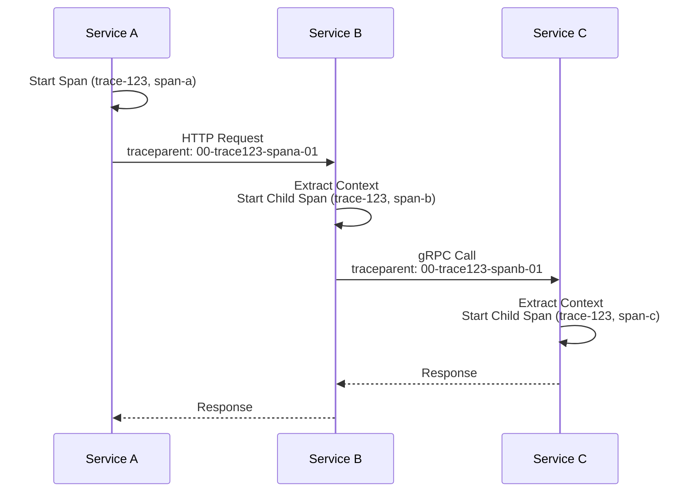
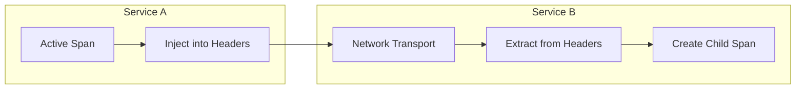
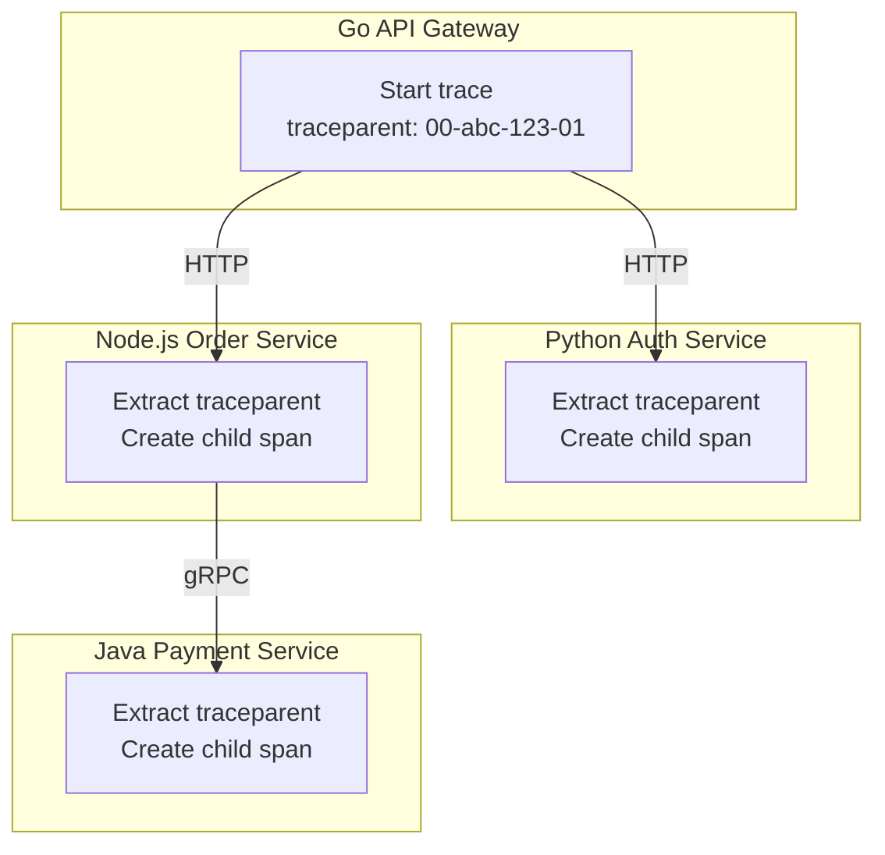

# How to Use OpenTelemetry Context Propagation

Author: [nawazdhandala](https://www.github.com/nawazdhandala)

Tags: OpenTelemetry, Context Propagation, Distributed Tracing, Microservices, W3C Trace Context, Observability, APM

Description: A practical guide to OpenTelemetry context propagation covering HTTP, gRPC, message queues, and async patterns. Learn to maintain trace continuity across service boundaries in distributed systems.

---

> Distributed systems fail silently when traces break at service boundaries. Context propagation is the mechanism that keeps your observability intact across every hop in your architecture.

Modern applications span multiple services, cloud functions, message queues, and background workers. Each component needs trace context to participate in a unified trace. Without proper propagation, you end up with disconnected spans that provide little debugging value.

Context propagation ensures that a trace ID and span ID travel alongside every request, enabling observability tools to reconstruct the complete request journey. OpenTelemetry provides standardized APIs and propagators that work across languages and frameworks.

---

## Table of Contents

1. What Is Context Propagation
2. How Context Flows Through Systems
3. Setting Up OpenTelemetry Propagators
4. HTTP Context Propagation
5. gRPC Context Propagation
6. Message Queue Propagation
7. Async and Background Job Propagation
8. Cross-Language Propagation
9. Debugging Broken Traces
10. Best Practices

---

## 1. What Is Context Propagation

Context propagation is the mechanism for passing trace metadata between processes. When Service A calls Service B, context propagation ensures Service B can create spans that link to Service A's trace.

The propagated context includes:

| Field | Purpose |
|-------|---------|
| Trace ID | Unique identifier for the entire distributed trace |
| Span ID | Identifier for the parent span making the outbound call |
| Trace Flags | Sampling decisions and feature flags |
| Trace State | Vendor-specific data for multi-vendor scenarios |



Without propagation, Service B and Service C would start new traces, resulting in three disconnected traces instead of one unified view.

---

## 2. How Context Flows Through Systems

Context propagation involves two operations: injection and extraction.

**Injection** serializes the current span context into a carrier format (headers, metadata, or message properties) when making outbound calls.

**Extraction** deserializes the span context from incoming requests and attaches it to the current execution context.



OpenTelemetry handles both operations through Propagator interfaces. The most common propagators are:

- **W3C TraceContext**: Industry standard, uses `traceparent` and `tracestate` headers
- **B3**: Zipkin format, uses `x-b3-*` headers
- **Jaeger**: Uses `uber-trace-id` header
- **AWS X-Ray**: Uses `X-Amzn-Trace-Id` header

---

## 3. Setting Up OpenTelemetry Propagators

Before propagation works, you need to configure which propagators your application uses. Most applications should use W3C TraceContext as the primary propagator.

The following example configures OpenTelemetry with composite propagators to support both W3C TraceContext and B3 formats. Supporting multiple formats helps during migrations or when integrating with systems that use different standards.

```javascript
// telemetry-setup.js
const { NodeSDK } = require('@opentelemetry/sdk-node');
const { getNodeAutoInstrumentations } = require('@opentelemetry/auto-instrumentations-node');
const { OTLPTraceExporter } = require('@opentelemetry/exporter-trace-otlp-http');
const { W3CTraceContextPropagator } = require('@opentelemetry/core');
const { B3Propagator, B3InjectEncoding } = require('@opentelemetry/propagator-b3');
const { CompositePropagator } = require('@opentelemetry/core');

// Create a composite propagator that supports both W3C and B3 formats.
// W3C TraceContext is the modern standard; B3 provides backward compatibility.
const propagator = new CompositePropagator({
  propagators: [
    new W3CTraceContextPropagator(),
    new B3Propagator({ injectEncoding: B3InjectEncoding.MULTI_HEADER }),
  ],
});

const sdk = new NodeSDK({
  serviceName: 'order-service',
  traceExporter: new OTLPTraceExporter({
    url: process.env.OTEL_EXPORTER_OTLP_ENDPOINT || 'https://oneuptime.com/otlp/v1/traces',
    headers: {
      'x-oneuptime-token': process.env.ONEUPTIME_TOKEN,
    },
  }),
  instrumentations: [getNodeAutoInstrumentations()],
  textMapPropagator: propagator,
});

sdk.start();

// Graceful shutdown ensures all spans are exported before process exit.
process.on('SIGTERM', () => {
  sdk.shutdown()
    .then(() => console.log('Telemetry shut down'))
    .catch((err) => console.error('Shutdown error', err))
    .finally(() => process.exit(0));
});
```

Python applications use a similar configuration pattern. The set_global_textmap function registers propagators globally, making them available to all instrumentation libraries.

```python
# telemetry_setup.py
import os
from opentelemetry import trace
from opentelemetry.sdk.trace import TracerProvider
from opentelemetry.sdk.trace.export import BatchSpanProcessor
from opentelemetry.exporter.otlp.proto.http.trace_exporter import OTLPSpanExporter
from opentelemetry.sdk.resources import Resource
from opentelemetry.propagate import set_global_textmap
from opentelemetry.propagators.composite import CompositePropagator
from opentelemetry.trace.propagation.tracecontext import TraceContextTextMapPropagator
from opentelemetry.propagators.b3 import B3MultiFormat

def init_telemetry(service_name: str):
    """
    Initialize OpenTelemetry with OTLP exporter and composite propagators.
    Call once at application startup before any spans are created.
    """
    resource = Resource.create({
        "service.name": service_name,
        "service.version": os.getenv("SERVICE_VERSION", "1.0.0"),
        "deployment.environment": os.getenv("ENVIRONMENT", "production"),
    })

    provider = TracerProvider(resource=resource)

    # Configure OTLP exporter for sending traces to your observability backend.
    exporter = OTLPSpanExporter(
        endpoint=os.getenv("OTEL_EXPORTER_OTLP_ENDPOINT", "https://oneuptime.com/otlp/v1/traces"),
        headers={"x-oneuptime-token": os.getenv("ONEUPTIME_TOKEN", "")}
    )

    # BatchSpanProcessor batches spans for efficient network usage.
    provider.add_span_processor(BatchSpanProcessor(exporter))
    trace.set_tracer_provider(provider)

    # Register propagators globally. Composite propagator tries each format in order.
    propagator = CompositePropagator([
        TraceContextTextMapPropagator(),
        B3MultiFormat()
    ])
    set_global_textmap(propagator)

    return trace.get_tracer(service_name)
```

---

## 4. HTTP Context Propagation

HTTP is the most common transport for microservices communication. Context propagation for HTTP involves injecting headers on outbound requests and extracting them on inbound requests.

### Injecting Context into Outbound Requests

When your service makes HTTP calls to downstream services, inject the current trace context into request headers. The receiving service will extract these headers and continue the trace.

```javascript
// http-client.js
const { trace, context, propagation } = require('@opentelemetry/api');
const axios = require('axios');

const tracer = trace.getTracer('http-client');

/**
 * Makes an HTTP request with trace context automatically injected.
 * The downstream service receives traceparent and tracestate headers.
 */
async function fetchUserProfile(userId) {
  return tracer.startActiveSpan('fetch-user-profile', async (span) => {
    try {
      // Set attributes that help identify what the span represents.
      span.setAttribute('user.id', userId);
      span.setAttribute('http.method', 'GET');

      // Prepare headers object. propagation.inject adds trace headers to it.
      const headers = {};
      propagation.inject(context.active(), headers);

      const response = await axios.get(
        `http://user-service:3000/api/users/${userId}`,
        { headers }
      );

      span.setAttribute('http.status_code', response.status);
      return response.data;

    } catch (error) {
      span.recordException(error);
      span.setStatus({ code: trace.SpanStatusCode.ERROR, message: error.message });
      throw error;

    } finally {
      span.end();
    }
  });
}
```

### Extracting Context from Inbound Requests

On the server side, extract context from incoming request headers before creating spans. The extracted context becomes the parent of any spans created while processing the request.

```javascript
// http-server.js
const express = require('express');
const { trace, context, propagation } = require('@opentelemetry/api');

const app = express();
const tracer = trace.getTracer('user-service');

/**
 * Middleware that extracts trace context from incoming requests.
 * All downstream spans within the request handler become children of this span.
 */
function tracingMiddleware(req, res, next) {
  // Extract trace context from incoming headers.
  const extractedContext = propagation.extract(context.active(), req.headers);

  // Create a span within the extracted context.
  const span = tracer.startSpan(
    `${req.method} ${req.path}`,
    {
      kind: trace.SpanKind.SERVER,
      attributes: {
        'http.method': req.method,
        'http.url': req.url,
        'http.route': req.path,
      },
    },
    extractedContext
  );

  // Make the span active for the duration of request processing.
  context.with(trace.setSpan(extractedContext, span), () => {
    // Capture response status code when response finishes.
    res.on('finish', () => {
      span.setAttribute('http.status_code', res.statusCode);
      if (res.statusCode >= 400) {
        span.setStatus({ code: trace.SpanStatusCode.ERROR });
      }
      span.end();
    });

    next();
  });
}

app.use(tracingMiddleware);

app.get('/api/users/:id', async (req, res) => {
  // Any spans created here automatically link to the parent from middleware.
  const user = await getUserFromDatabase(req.params.id);
  res.json(user);
});
```

### Python HTTP Example with Requests Library

Python applications follow the same pattern. The inject function adds trace headers to the outgoing request, while extract retrieves context from incoming requests.

```python
# http_client.py
import requests
from opentelemetry import trace, propagate
from opentelemetry.trace import SpanKind

tracer = trace.get_tracer(__name__)

def call_inventory_service(product_id: str) -> dict:
    """
    Call the inventory service with trace context propagation.
    The inventory service receives the traceparent header automatically.
    """
    with tracer.start_as_current_span(
        "check-inventory",
        kind=SpanKind.CLIENT
    ) as span:
        span.set_attribute("product.id", product_id)
        span.set_attribute("http.method", "GET")

        # Create headers dict and inject trace context into it.
        headers = {}
        propagate.inject(headers)

        url = f"http://inventory-service:8080/api/inventory/{product_id}"
        span.set_attribute("http.url", url)

        response = requests.get(url, headers=headers)

        span.set_attribute("http.status_code", response.status_code)

        if response.status_code >= 400:
            span.set_status(trace.Status(
                trace.StatusCode.ERROR,
                f"HTTP {response.status_code}"
            ))

        return response.json()
```

---

## 5. gRPC Context Propagation

gRPC uses metadata instead of HTTP headers for context propagation. The propagation pattern remains the same: inject on client side, extract on server side.

### gRPC Client with Context Injection

The client interceptor injects trace context into gRPC metadata before each call. All outbound gRPC calls from the application will carry trace context automatically.

```python
# grpc_client.py
import grpc
from opentelemetry import trace, propagate
from opentelemetry.trace import SpanKind

import inventory_pb2
import inventory_pb2_grpc

tracer = trace.get_tracer(__name__)

class TracingClientInterceptor(grpc.UnaryUnaryClientInterceptor):
    """
    gRPC client interceptor that injects trace context into outbound calls.
    Attach to channel to automatically propagate context on all calls.
    """

    def intercept_unary_unary(self, continuation, client_call_details, request):
        # Extract method name for span naming.
        method = client_call_details.method

        with tracer.start_as_current_span(
            f"grpc-client {method}",
            kind=SpanKind.CLIENT
        ) as span:
            span.set_attribute("rpc.system", "grpc")
            span.set_attribute("rpc.method", method)

            # Inject trace context into metadata.
            metadata = dict(client_call_details.metadata or [])
            propagate.inject(metadata)

            # Convert back to list of tuples for gRPC.
            new_metadata = list(metadata.items())

            # Create new call details with updated metadata.
            new_details = grpc.ClientCallDetails(
                method=client_call_details.method,
                timeout=client_call_details.timeout,
                metadata=new_metadata,
                credentials=client_call_details.credentials,
                wait_for_ready=client_call_details.wait_for_ready,
                compression=client_call_details.compression,
            )

            response = continuation(new_details, request)
            return response


def create_inventory_client(host: str = "inventory-service:50051"):
    """
    Create a gRPC client with automatic trace context propagation.
    """
    channel = grpc.insecure_channel(host)
    intercepted_channel = grpc.intercept_channel(
        channel,
        TracingClientInterceptor()
    )
    return inventory_pb2_grpc.InventoryServiceStub(intercepted_channel)


def check_stock(client, product_id: str) -> int:
    """Check inventory stock using the traced gRPC client."""
    request = inventory_pb2.StockRequest(product_id=product_id)
    response = client.GetStock(request)
    return response.quantity
```

### gRPC Server with Context Extraction

The server interceptor extracts trace context from incoming metadata and creates a server span that links to the caller's trace.

```python
# grpc_server.py
import grpc
from concurrent import futures
from opentelemetry import trace, propagate
from opentelemetry.trace import SpanKind

import inventory_pb2
import inventory_pb2_grpc

tracer = trace.get_tracer(__name__)

class TracingServerInterceptor(grpc.ServerInterceptor):
    """
    gRPC server interceptor that extracts trace context from incoming calls.
    Creates a server span for each incoming RPC.
    """

    def intercept_service(self, continuation, handler_call_details):
        method = handler_call_details.method

        def traced_handler(request, context):
            # Extract trace context from incoming metadata.
            metadata = dict(context.invocation_metadata())
            parent_context = propagate.extract(metadata)

            with tracer.start_as_current_span(
                f"grpc-server {method}",
                context=parent_context,
                kind=SpanKind.SERVER
            ) as span:
                span.set_attribute("rpc.system", "grpc")
                span.set_attribute("rpc.method", method)

                try:
                    # Call the actual handler within traced context.
                    handler = continuation(handler_call_details)
                    return handler.unary_unary(request, context)

                except Exception as e:
                    span.record_exception(e)
                    span.set_status(trace.Status(
                        trace.StatusCode.ERROR,
                        str(e)
                    ))
                    raise

        return grpc.unary_unary_rpc_method_handler(traced_handler)


class InventoryService(inventory_pb2_grpc.InventoryServiceServicer):
    """Inventory service implementation with automatic tracing from interceptor."""

    def GetStock(self, request, context):
        # Spans created here are children of the server span from interceptor.
        with tracer.start_as_current_span("database-query") as span:
            span.set_attribute("db.system", "postgresql")
            span.set_attribute("product.id", request.product_id)

            quantity = self._fetch_stock_from_db(request.product_id)

            return inventory_pb2.StockResponse(quantity=quantity)

    def _fetch_stock_from_db(self, product_id: str) -> int:
        # Database query simulation.
        return 42


def serve():
    server = grpc.server(
        futures.ThreadPoolExecutor(max_workers=10),
        interceptors=[TracingServerInterceptor()]
    )
    inventory_pb2_grpc.add_InventoryServiceServicer_to_server(
        InventoryService(),
        server
    )
    server.add_insecure_port('[::]:50051')
    server.start()
    server.wait_for_termination()
```

---

## 6. Message Queue Propagation

Message queues present unique challenges for context propagation because messages may be processed long after they are published. The producer and consumer run at different times and possibly on different machines.

### Kafka Producer with Context Injection

When publishing messages to Kafka, inject the trace context into message headers. The consumer extracts this context when processing the message.

```javascript
// kafka-producer.js
const { Kafka } = require('kafkajs');
const { trace, context, propagation } = require('@opentelemetry/api');

const kafka = new Kafka({ brokers: ['kafka:9092'] });
const producer = kafka.producer();
const tracer = trace.getTracer('order-service');

/**
 * Publish an order event to Kafka with trace context in message headers.
 * The consumer can extract context and continue the same trace.
 */
async function publishOrderCreated(order) {
  return tracer.startActiveSpan('kafka-publish order-created', {
    kind: trace.SpanKind.PRODUCER,
    attributes: {
      'messaging.system': 'kafka',
      'messaging.destination': 'orders',
      'messaging.operation': 'publish',
      'order.id': order.id,
    },
  }, async (span) => {
    try {
      // Inject trace context into headers object.
      const headers = {};
      propagation.inject(context.active(), headers);

      // Convert header values to buffers for Kafka.
      const kafkaHeaders = {};
      for (const [key, value] of Object.entries(headers)) {
        kafkaHeaders[key] = Buffer.from(value);
      }

      await producer.send({
        topic: 'orders',
        messages: [{
          key: order.id,
          value: JSON.stringify(order),
          headers: kafkaHeaders,
        }],
      });

      span.setAttribute('messaging.message_id', order.id);

    } catch (error) {
      span.recordException(error);
      span.setStatus({ code: trace.SpanStatusCode.ERROR });
      throw error;

    } finally {
      span.end();
    }
  });
}
```

### Kafka Consumer with Context Extraction

The consumer extracts trace context from message headers before processing. Even if the message was published hours ago, the trace remains connected.

```javascript
// kafka-consumer.js
const { Kafka } = require('kafkajs');
const { trace, context, propagation } = require('@opentelemetry/api');

const kafka = new Kafka({ brokers: ['kafka:9092'] });
const consumer = kafka.consumer({ groupId: 'fulfillment-service' });
const tracer = trace.getTracer('fulfillment-service');

/**
 * Process order messages with trace context extracted from headers.
 * Creates a consumer span that links to the producer's trace.
 */
async function startConsumer() {
  await consumer.connect();
  await consumer.subscribe({ topic: 'orders', fromBeginning: false });

  await consumer.run({
    eachMessage: async ({ topic, partition, message }) => {
      // Convert Kafka headers from buffers to strings.
      const headers = {};
      for (const [key, value] of Object.entries(message.headers || {})) {
        headers[key] = value.toString();
      }

      // Extract trace context from message headers.
      const extractedContext = propagation.extract(context.active(), headers);

      // Create consumer span within the extracted context.
      tracer.startActiveSpan('kafka-consume order-created', {
        kind: trace.SpanKind.CONSUMER,
        attributes: {
          'messaging.system': 'kafka',
          'messaging.destination': topic,
          'messaging.operation': 'receive',
          'messaging.kafka.partition': partition,
        },
      }, extractedContext, async (span) => {
        try {
          const order = JSON.parse(message.value.toString());
          span.setAttribute('order.id', order.id);

          await processOrder(order);

        } catch (error) {
          span.recordException(error);
          span.setStatus({ code: trace.SpanStatusCode.ERROR });
          throw error;

        } finally {
          span.end();
        }
      });
    },
  });
}

async function processOrder(order) {
  // Nested spans are children of the consumer span.
  return tracer.startActiveSpan('process-order', async (span) => {
    span.setAttribute('order.id', order.id);
    // Processing logic here.
    span.end();
  });
}
```

### RabbitMQ Example

RabbitMQ uses message properties for context propagation. The pattern is similar to Kafka but uses the properties.headers field.

```python
# rabbitmq_publisher.py
import pika
import json
from opentelemetry import trace, propagate
from opentelemetry.trace import SpanKind

tracer = trace.get_tracer(__name__)

class TracedRabbitMQPublisher:
    """
    RabbitMQ publisher that injects trace context into message headers.
    """

    def __init__(self, connection_params):
        self.connection = pika.BlockingConnection(connection_params)
        self.channel = self.connection.channel()

    def publish(self, exchange: str, routing_key: str, message: dict):
        """Publish message with trace context in headers."""
        with tracer.start_as_current_span(
            f"rabbitmq-publish {exchange}",
            kind=SpanKind.PRODUCER
        ) as span:
            span.set_attribute("messaging.system", "rabbitmq")
            span.set_attribute("messaging.destination", exchange)
            span.set_attribute("messaging.routing_key", routing_key)

            # Inject trace context into headers dictionary.
            headers = {}
            propagate.inject(headers)

            properties = pika.BasicProperties(
                headers=headers,
                content_type="application/json",
                delivery_mode=2,  # Persistent message.
            )

            self.channel.basic_publish(
                exchange=exchange,
                routing_key=routing_key,
                body=json.dumps(message),
                properties=properties
            )
```

---

## 7. Async and Background Job Propagation

Background jobs and async workers often lose trace context because they run outside the original request context. Explicit context serialization solves this problem.

### Celery Task with Context Propagation

Celery tasks need trace context passed through task headers. The producer serializes the context, and the worker deserializes it before execution.

```python
# celery_tasks.py
import json
from celery import Celery
from opentelemetry import trace, propagate
from opentelemetry.trace import SpanKind
from functools import wraps

app = Celery('tasks', broker='redis://localhost:6379/0')
tracer = trace.get_tracer(__name__)

def traced_task(func):
    """
    Decorator that extracts trace context from Celery task headers.
    Wrap Celery tasks with this to maintain trace continuity.
    """
    @wraps(func)
    def wrapper(*args, **kwargs):
        # Get task headers from the current task request.
        task = wrapper.request
        headers = task.headers or {}

        # Deserialize trace context if present.
        trace_context_str = headers.get('trace_context')
        if trace_context_str:
            carrier = json.loads(trace_context_str)
            parent_context = propagate.extract(carrier)
        else:
            parent_context = None

        with tracer.start_as_current_span(
            f"celery-task {func.__name__}",
            context=parent_context,
            kind=SpanKind.CONSUMER
        ) as span:
            span.set_attribute("celery.task_name", func.__name__)
            span.set_attribute("celery.task_id", task.id)

            try:
                result = func(*args, **kwargs)
                span.set_attribute("celery.status", "SUCCESS")
                return result

            except Exception as e:
                span.record_exception(e)
                span.set_status(trace.Status(trace.StatusCode.ERROR, str(e)))
                span.set_attribute("celery.status", "FAILURE")
                raise

    # Preserve bind attribute for Celery task registration.
    wrapper.__wrapped__ = func
    return wrapper


@app.task(bind=True)
@traced_task
def process_payment(self, order_id: str, amount: float):
    """Process payment for an order with trace context from caller."""
    with tracer.start_as_current_span("validate-payment") as span:
        span.set_attribute("order.id", order_id)
        span.set_attribute("payment.amount", amount)
        # Payment validation logic here.

    with tracer.start_as_current_span("charge-card") as span:
        span.set_attribute("order.id", order_id)
        # Card charging logic here.

    return {"status": "completed", "order_id": order_id}


def send_task_with_context(task_name: str, args=None, kwargs=None):
    """
    Send a Celery task with trace context propagated in headers.
    Call instead of task.delay() to maintain trace continuity.
    """
    with tracer.start_as_current_span(
        f"celery-send {task_name}",
        kind=SpanKind.PRODUCER
    ) as span:
        # Serialize current trace context.
        carrier = {}
        propagate.inject(carrier)
        trace_context = json.dumps(carrier)

        span.set_attribute("celery.task_name", task_name)

        result = app.send_task(
            task_name,
            args=args,
            kwargs=kwargs,
            headers={'trace_context': trace_context}
        )

        span.set_attribute("celery.task_id", result.id)
        return result
```

### BullMQ (Node.js) with Context Propagation

BullMQ jobs can carry trace context in job data or options. The following example shows both producer and worker implementations.

```javascript
// bullmq-producer.js
const { Queue } = require('bullmq');
const { trace, context, propagation } = require('@opentelemetry/api');

const emailQueue = new Queue('emails', { connection: { host: 'localhost' } });
const tracer = trace.getTracer('notification-service');

/**
 * Add a job to the queue with trace context.
 * The worker extracts context and continues the trace.
 */
async function queueEmailNotification(userId, templateId, data) {
  return tracer.startActiveSpan('queue-email', {
    kind: trace.SpanKind.PRODUCER,
    attributes: {
      'messaging.system': 'bullmq',
      'messaging.destination': 'emails',
      'user.id': userId,
    },
  }, async (span) => {
    // Serialize trace context into job data.
    const traceContext = {};
    propagation.inject(context.active(), traceContext);

    const job = await emailQueue.add('send-email', {
      userId,
      templateId,
      data,
      _traceContext: traceContext,  // Embedded trace context.
    });

    span.setAttribute('job.id', job.id);
    span.end();

    return job;
  });
}
```

```javascript
// bullmq-worker.js
const { Worker } = require('bullmq');
const { trace, context, propagation } = require('@opentelemetry/api');

const tracer = trace.getTracer('email-worker');

/**
 * Worker that processes email jobs with trace context extraction.
 */
const emailWorker = new Worker('emails', async (job) => {
  const { userId, templateId, data, _traceContext } = job.data;

  // Extract trace context from job data.
  const parentContext = _traceContext
    ? propagation.extract(context.active(), _traceContext)
    : context.active();

  return tracer.startActiveSpan('process-email', {
    kind: trace.SpanKind.CONSUMER,
    attributes: {
      'messaging.system': 'bullmq',
      'job.id': job.id,
      'user.id': userId,
    },
  }, parentContext, async (span) => {
    try {
      // Email processing spans are children of process-email.
      await renderTemplate(templateId, data);
      await sendEmail(userId, templateId);

      span.end();
      return { success: true };

    } catch (error) {
      span.recordException(error);
      span.setStatus({ code: trace.SpanStatusCode.ERROR });
      span.end();
      throw error;
    }
  });
}, { connection: { host: 'localhost' } });
```

---

## 8. Cross-Language Propagation

One of OpenTelemetry's strengths is cross-language compatibility. A trace can start in a Go service, pass through Python, continue in Node.js, and remain fully connected.

The W3C TraceContext format ensures compatibility. Every language's OpenTelemetry implementation can read and write these headers.



### Go Service Example

Go applications use the otel propagation package. The pattern matches other languages: inject on outbound, extract on inbound.

```go
// main.go
package main

import (
    "context"
    "net/http"

    "go.opentelemetry.io/otel"
    "go.opentelemetry.io/otel/propagation"
    "go.opentelemetry.io/otel/trace"
)

var tracer = otel.Tracer("api-gateway")

// InjectContext adds trace context to outbound HTTP request headers.
func InjectContext(ctx context.Context, req *http.Request) {
    otel.GetTextMapPropagator().Inject(ctx, propagation.HeaderCarrier(req.Header))
}

// ExtractContext retrieves trace context from incoming HTTP request headers.
func ExtractContext(req *http.Request) context.Context {
    return otel.GetTextMapPropagator().Extract(
        req.Context(),
        propagation.HeaderCarrier(req.Header),
    )
}

// callDownstreamService makes an HTTP call with trace context propagation.
func callDownstreamService(ctx context.Context, url string) (*http.Response, error) {
    ctx, span := tracer.Start(ctx, "call-downstream",
        trace.WithSpanKind(trace.SpanKindClient))
    defer span.End()

    req, err := http.NewRequestWithContext(ctx, "GET", url, nil)
    if err != nil {
        return nil, err
    }

    // Inject trace context into request headers.
    InjectContext(ctx, req)

    return http.DefaultClient.Do(req)
}

// tracingMiddleware extracts trace context and creates a server span.
func tracingMiddleware(next http.Handler) http.Handler {
    return http.HandlerFunc(func(w http.ResponseWriter, r *http.Request) {
        ctx := ExtractContext(r)

        ctx, span := tracer.Start(ctx, r.Method+" "+r.URL.Path,
            trace.WithSpanKind(trace.SpanKindServer))
        defer span.End()

        // Pass context to next handler.
        next.ServeHTTP(w, r.WithContext(ctx))
    })
}
```

---

## 9. Debugging Broken Traces

Broken traces are frustrating. A request enters your system, and somewhere along the way, the trace ends. The following techniques help identify where propagation fails.

### Check Headers Are Being Sent

Add logging to verify trace headers exist in outbound requests. Missing headers indicate the inject step failed.

```javascript
// debug-propagation.js
const { propagation, context, trace } = require('@opentelemetry/api');

function debugOutboundRequest(url) {
  const span = trace.getActiveSpan();

  // Log current span context.
  if (span) {
    const ctx = span.spanContext();
    console.log('Current trace:', ctx.traceId);
    console.log('Current span:', ctx.spanId);
  } else {
    console.log('WARNING: No active span');
  }

  // Log what would be injected.
  const headers = {};
  propagation.inject(context.active(), headers);
  console.log('Injected headers:', headers);

  // If headers is empty, propagation configuration is wrong.
  if (Object.keys(headers).length === 0) {
    console.log('ERROR: No headers injected. Check propagator configuration.');
  }
}
```

### Verify Headers Are Being Extracted

On the receiving service, log incoming headers to confirm they contain trace context.

```python
# debug_extraction.py
from opentelemetry import propagate, trace

def debug_incoming_request(headers: dict):
    """Log trace context extraction for debugging."""
    print(f"Incoming headers: {headers}")

    # Check for W3C traceparent header.
    traceparent = headers.get('traceparent')
    if traceparent:
        print(f"Found traceparent: {traceparent}")
    else:
        print("WARNING: No traceparent header found")

    # Attempt extraction.
    ctx = propagate.extract(headers)

    # Check if extraction produced a valid span context.
    span_ctx = trace.get_current_span(ctx).get_span_context()
    if span_ctx.is_valid:
        print(f"Extracted trace_id: {format(span_ctx.trace_id, '032x')}")
        print(f"Extracted span_id: {format(span_ctx.span_id, '016x')}")
    else:
        print("WARNING: Extraction produced invalid span context")
```

### Common Issues and Solutions

| Symptom | Likely Cause | Solution |
|---------|-------------|----------|
| Headers not injected | No active span | Ensure injection happens inside a span |
| Headers not extracted | Wrong header names | Check propagator matches sender format |
| Traces start but children missing | Context not passed to child operations | Use context.with() or startActiveSpan |
| Async operations disconnected | Context lost in callback | Explicitly propagate context to callbacks |

---

## 10. Best Practices

### Always Use Automatic Instrumentation First

OpenTelemetry provides automatic instrumentation for most frameworks. Use it as a baseline and add manual instrumentation only for business-specific spans.

```javascript
// Good: Let auto-instrumentation handle HTTP propagation.
const { getNodeAutoInstrumentations } = require('@opentelemetry/auto-instrumentations-node');

const sdk = new NodeSDK({
  instrumentations: [getNodeAutoInstrumentations()],
});
```

### Propagate Context in All Outbound Calls

Every external call should propagate context. Missing propagation in even one service breaks the trace.

```python
# Every HTTP call should include trace headers.
headers = {}
propagate.inject(headers)
response = requests.get(url, headers=headers)
```

### Use Semantic Conventions

Consistent attribute names help with querying and visualization. OpenTelemetry defines semantic conventions for common operations.

```javascript
// Use standard attribute names for HTTP spans.
span.setAttribute('http.method', 'POST');
span.setAttribute('http.url', url);
span.setAttribute('http.status_code', response.status);

// Use standard names for messaging spans.
span.setAttribute('messaging.system', 'kafka');
span.setAttribute('messaging.destination', topic);
span.setAttribute('messaging.operation', 'publish');
```

### Handle Missing Context Gracefully

Not all requests will have trace context, especially at system boundaries. Start a new trace when context is missing rather than failing.

```python
# Extract returns empty context if no trace headers present.
parent_context = propagate.extract(headers)

# start_as_current_span works with or without parent context.
with tracer.start_as_current_span("handle-request", context=parent_context):
    # Processing continues, starting new trace if needed.
    pass
```

### Add Business Context to Spans

Technical spans show what happened. Business attributes show why it matters.

```javascript
span.setAttribute('order.id', order.id);
span.setAttribute('customer.tier', customer.tier);
span.setAttribute('payment.method', payment.method);
span.setAttribute('order.total', order.total);
```

---

## Conclusion

Context propagation is the foundation of distributed tracing. Without it, traces break at service boundaries and lose their value for debugging and performance analysis.

Key takeaways:

- **Configure propagators early** in application initialization
- **Inject context** into every outbound call using `propagation.inject()`
- **Extract context** from every inbound request using `propagation.extract()`
- **Serialize context explicitly** for message queues and background jobs
- **Use W3C TraceContext** for cross-language and cross-vendor compatibility

Once propagation works correctly, your traces provide complete visibility into request flows across your entire distributed system.

---

*Ready to visualize your distributed traces? [OneUptime](https://oneuptime.com) provides end-to-end trace visualization with automatic service dependency mapping, latency analysis, and correlation with logs and metrics.*

**Related Reading:**
- [How to Build OpenTelemetry W3C Context Propagation](https://oneuptime.com/blog/post/2026-01-30-opentelemetry-w3c-context-propagation/view)
- [How to Implement Context Management in OpenTelemetry](https://oneuptime.com/blog/post/2026-01-25-context-management-opentelemetry/view)
- [How to Implement Distributed Tracing in Python Microservices](https://oneuptime.com/blog/post/2025-01-06-python-distributed-tracing-microservices/view)
