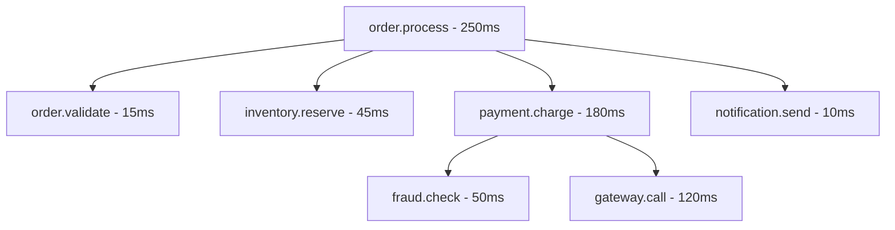
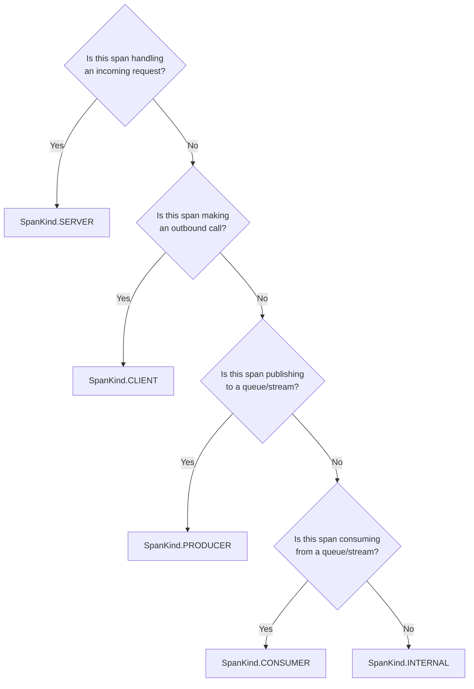

# How to Implement Custom OpenTelemetry Spans

Author: [nawazdhandala](https://www.github.com/nawazdhandala)

Tags: OpenTelemetry, Tracing, Custom Spans, Observability, TypeScript, NodeJS, Python, Instrumentation

Description: A hands-on guide to implementing custom OpenTelemetry spans for granular observability. Learn when to create custom spans, how to add meaningful attributes and events, and best practices for instrumenting business logic beyond auto-instrumentation.

---

Auto-instrumentation gives you visibility into HTTP requests, database queries, and common framework operations. But what about your business logic? The pricing calculation that sometimes takes 500ms? The complex validation pipeline? The third-party SDK that wraps multiple operations?

Custom spans fill these gaps. They let you instrument exactly what matters to your application, giving you the granular visibility that auto-instrumentation cannot provide.

---

## Table of Contents

1. When to Create Custom Spans
2. Setting Up the Tracer
3. Basic Span Creation Patterns
4. Adding Context with Attributes
5. Recording Events Within Spans
6. Error Handling and Status Codes
7. Nested Spans and Parent-Child Relationships
8. Span Kind Selection
9. Practical Examples by Use Case
10. Custom Spans in Python
11. Performance Considerations
12. Common Mistakes to Avoid
13. Testing Your Instrumentation

---

## 1. When to Create Custom Spans

Before adding spans everywhere, ask yourself: "Will knowing the duration and outcome of this operation help me debug or optimize?"

**Good candidates for custom spans:**

- Business logic with measurable latency (pricing, recommendations, fraud scoring)
- External SDK calls not covered by auto-instrumentation
- Batch processing operations (processing N items)
- Complex validations or transformations
- Cache operations with conditional logic
- Background job steps

**Skip custom spans for:**

- Simple synchronous computations (under 1ms)
- Operations already covered by auto-instrumentation
- Every function call (leads to span explosion)
- Logging-style breadcrumbs (use events instead)

The sweet spot is usually 5-15 custom spans per request for complex services, fewer for simple ones.

---

## 2. Setting Up the Tracer

Every custom span starts with a tracer instance. The tracer should be created once per instrumentation scope (typically per module or service component).

The following code creates a tracer with a name and version. The name helps identify which part of your code generated the span when debugging.

```typescript
// src/instrumentation/tracer.ts
import { trace, Tracer } from '@opentelemetry/api';

// Create a tracer for your service or module
// The name appears in your observability backend, making it easier to filter
const tracer: Tracer = trace.getTracer(
  'order-service',      // Instrumentation scope name
  '1.0.0'               // Version (helps track changes)
);

export { tracer };
```

For applications with multiple distinct components, consider creating separate tracers.

Each component gets its own tracer with a descriptive name. Filtering spans by instrumentation scope name becomes straightforward in your observability dashboard.

```typescript
// src/instrumentation/tracers.ts
import { trace } from '@opentelemetry/api';

// Separate tracers for different concerns
export const paymentTracer = trace.getTracer('payment-processor', '2.1.0');
export const inventoryTracer = trace.getTracer('inventory-manager', '1.3.0');
export const notificationTracer = trace.getTracer('notification-service', '1.0.0');
```

---

## 3. Basic Span Creation Patterns

OpenTelemetry offers several ways to create spans. Choose based on your needs.

### Pattern 1: startActiveSpan (Recommended for Most Cases)

startActiveSpan handles context propagation automatically. Any child spans created within the callback inherit the parent relationship without manual context management.

```typescript
import { tracer } from './tracer';
import { SpanStatusCode } from '@opentelemetry/api';

async function calculatePricing(items: Item[]): Promise<PricingResult> {
  // startActiveSpan automatically:
  // 1. Creates the span
  // 2. Sets it as the active span in context
  // 3. Ends the span when the callback completes
  return tracer.startActiveSpan('pricing.calculate', async (span) => {
    try {
      // Business logic here
      const basePrice = items.reduce((sum, item) => sum + item.price, 0);
      const discount = await fetchDiscount(items);
      const finalPrice = basePrice - discount;

      // Add useful attributes
      span.setAttribute('pricing.item_count', items.length);
      span.setAttribute('pricing.base_price', basePrice);
      span.setAttribute('pricing.discount_applied', discount);
      span.setAttribute('pricing.final_price', finalPrice);

      return { basePrice, discount, finalPrice };
    } catch (error) {
      span.recordException(error as Error);
      span.setStatus({ code: SpanStatusCode.ERROR, message: (error as Error).message });
      throw error;
    }
  });
}
```

### Pattern 2: Manual Span Management

Use manual management when you need fine-grained control over span lifecycle, especially for spans that cross callback boundaries.

```typescript
import { tracer } from './tracer';
import { context, trace, SpanStatusCode } from '@opentelemetry/api';

async function processWithManualSpan(data: ProcessData): Promise<void> {
  const span = tracer.startSpan('data.process');

  // Manually set the span as active in the current context
  const ctx = trace.setSpan(context.active(), span);

  try {
    // Run work within the span's context
    await context.with(ctx, async () => {
      await stepOne(data);
      await stepTwo(data);
    });
  } catch (error) {
    span.recordException(error as Error);
    span.setStatus({ code: SpanStatusCode.ERROR });
    throw error;
  } finally {
    // Always end the span, even on failure
    span.end();
  }
}
```

### Pattern 3: Wrapper Utility Function

A reusable wrapper reduces boilerplate and ensures consistent error handling across your codebase.

```typescript
// src/instrumentation/with-span.ts
import { tracer } from './tracer';
import { Span, SpanStatusCode, SpanOptions, context, trace } from '@opentelemetry/api';

type SpanCallback<T> = (span: Span) => Promise<T> | T;

export async function withSpan<T>(
  name: string,
  fn: SpanCallback<T>,
  options?: SpanOptions
): Promise<T> {
  const span = tracer.startSpan(name, options);
  const ctx = trace.setSpan(context.active(), span);

  try {
    const result = await context.with(ctx, () => fn(span));
    return result;
  } catch (error) {
    span.recordException(error as Error);
    span.setStatus({
      code: SpanStatusCode.ERROR,
      message: (error as Error).message
    });
    throw error;
  } finally {
    span.end();
  }
}

// Usage becomes clean and consistent
async function validateOrder(order: Order): Promise<ValidationResult> {
  return withSpan('order.validate', async (span) => {
    span.setAttribute('order.id', order.id);
    span.setAttribute('order.item_count', order.items.length);

    // Validation logic
    const result = await runValidationRules(order);
    span.setAttribute('validation.passed', result.isValid);

    return result;
  });
}
```

---

## 4. Adding Context with Attributes

Attributes transform spans from timing data into searchable, filterable insights. Well-chosen attributes answer the question: "What do I need to know to debug issues involving this span?"

### Attribute Best Practices

The following example demonstrates adding attributes that provide context without introducing high cardinality or exposing sensitive data.

```typescript
import { withSpan } from './with-span';

async function processPayment(payment: PaymentRequest): Promise<PaymentResult> {
  return withSpan('payment.process', async (span) => {
    // Good: Low-cardinality, useful for filtering and aggregation
    span.setAttribute('payment.method', payment.method);           // 'card', 'bank', 'wallet'
    span.setAttribute('payment.currency', payment.currency);       // 'USD', 'EUR'
    span.setAttribute('payment.amount_cents', payment.amountCents);
    span.setAttribute('payment.is_recurring', payment.isRecurring);

    // Good: Helps identify patterns without being too specific
    span.setAttribute('payment.amount_bucket', getAmountBucket(payment.amountCents));

    // AVOID: High cardinality (unique per request)
    // span.setAttribute('payment.transaction_id', payment.transactionId);
    // Instead, if needed for correlation, use a smaller subset or link to logs

    // AVOID: PII or sensitive data
    // span.setAttribute('payment.card_number', payment.cardNumber);
    // span.setAttribute('payment.customer_email', payment.email);

    const result = await chargePaymentProvider(payment);

    // Add outcome attributes
    span.setAttribute('payment.status', result.status);
    span.setAttribute('payment.provider_latency_ms', result.providerLatencyMs);

    if (result.declineReason) {
      span.setAttribute('payment.decline_reason', result.declineReason);
    }

    return result;
  });
}

function getAmountBucket(cents: number): string {
  if (cents < 1000) return 'micro';      // Under $10
  if (cents < 10000) return 'small';     // $10-$100
  if (cents < 100000) return 'medium';   // $100-$1000
  return 'large';                         // Over $1000
}
```

### Semantic Conventions

OpenTelemetry defines semantic conventions for common attribute names. Using them ensures consistency with auto-instrumentation and across teams.

```typescript
import { SemanticAttributes } from '@opentelemetry/semantic-conventions';

async function callExternalApi(endpoint: string): Promise<ApiResponse> {
  return withSpan('external.api.call', async (span) => {
    // Use semantic conventions where applicable
    span.setAttribute(SemanticAttributes.HTTP_METHOD, 'POST');
    span.setAttribute(SemanticAttributes.HTTP_URL, endpoint);
    span.setAttribute(SemanticAttributes.HTTP_TARGET, new URL(endpoint).pathname);

    const response = await fetch(endpoint, { method: 'POST' });

    span.setAttribute(SemanticAttributes.HTTP_STATUS_CODE, response.status);

    return response.json();
  }, { kind: SpanKind.CLIENT });
}
```

---

## 5. Recording Events Within Spans

Events mark significant moments within a span without creating child spans. Use them for milestones, state changes, and diagnostic checkpoints.

The following code shows how events capture the flow of a multi-stage operation. Each event includes relevant attributes to provide context.

```typescript
import { withSpan } from './with-span';

async function fulfillOrder(order: Order): Promise<FulfillmentResult> {
  return withSpan('order.fulfill', async (span) => {
    span.setAttribute('order.id', order.id);

    // Event: Starting inventory check
    span.addEvent('inventory.check.start', {
      'inventory.warehouse_count': order.warehouseIds.length
    });

    const inventoryResult = await checkInventory(order);

    // Event: Inventory check complete with outcome
    span.addEvent('inventory.check.complete', {
      'inventory.all_available': inventoryResult.allAvailable,
      'inventory.items_checked': inventoryResult.itemCount
    });

    if (!inventoryResult.allAvailable) {
      span.addEvent('fulfillment.backorder.triggered', {
        'backorder.item_count': inventoryResult.unavailableCount
      });
    }

    // Event: Payment capture starting
    span.addEvent('payment.capture.start');

    const paymentResult = await capturePayment(order);

    span.addEvent('payment.capture.complete', {
      'payment.captured': paymentResult.success,
      'payment.amount_cents': paymentResult.amountCents
    });

    // Event: Shipping label generation
    span.addEvent('shipping.label.generate');

    const shippingLabel = await generateShippingLabel(order);

    span.addEvent('shipping.label.created', {
      'shipping.carrier': shippingLabel.carrier,
      'shipping.tracking_number_prefix': shippingLabel.trackingNumber.slice(0, 4)
    });

    return {
      orderId: order.id,
      status: 'fulfilled',
      trackingNumber: shippingLabel.trackingNumber
    };
  });
}
```

### Events vs Child Spans

| Scenario | Use Event | Use Child Span |
|----------|-----------|----------------|
| Quick checkpoint (< 1ms) | Yes | No |
| Operation with meaningful duration | No | Yes |
| State transition notification | Yes | No |
| Operation you want to query/filter by duration | No | Yes |
| Retry attempt marker | Yes | No |
| External API call | No | Yes |

---

## 6. Error Handling and Status Codes

Proper error handling in spans enables alerting, tail sampling on failures, and faster debugging.

The following pattern ensures exceptions are recorded with full context while setting appropriate status codes.

```typescript
import { SpanStatusCode } from '@opentelemetry/api';
import { withSpan } from './with-span';

async function processWithErrorHandling(data: InputData): Promise<OutputData> {
  return withSpan('data.process', async (span) => {
    span.setAttribute('input.size_bytes', JSON.stringify(data).length);

    try {
      // Validation phase
      const validationResult = validateInput(data);
      if (!validationResult.isValid) {
        // Business logic failure (not an exception)
        span.setStatus({
          code: SpanStatusCode.ERROR,
          message: `Validation failed: ${validationResult.errors.join(', ')}`
        });
        span.setAttribute('error.type', 'validation');
        span.setAttribute('error.validation_errors', validationResult.errors.length);

        throw new ValidationError(validationResult.errors);
      }

      // Processing phase
      const result = await transformData(data);

      span.setStatus({ code: SpanStatusCode.OK });
      return result;

    } catch (error) {
      const err = error as Error;

      // Record the exception with stack trace
      span.recordException(err);

      // Categorize the error for filtering
      if (err instanceof ValidationError) {
        span.setAttribute('error.category', 'validation');
      } else if (err instanceof TimeoutError) {
        span.setAttribute('error.category', 'timeout');
      } else if (err instanceof NetworkError) {
        span.setAttribute('error.category', 'network');
      } else {
        span.setAttribute('error.category', 'unknown');
      }

      // Set status if not already set
      span.setStatus({
        code: SpanStatusCode.ERROR,
        message: err.message
      });

      throw error;
    }
  });
}
```

### Handling Partial Failures

Some operations can partially succeed. Record this nuance in your spans.

```typescript
async function processBatch(items: Item[]): Promise<BatchResult> {
  return withSpan('batch.process', async (span) => {
    span.setAttribute('batch.size', items.length);

    const results = await Promise.allSettled(
      items.map(item => processItem(item))
    );

    const succeeded = results.filter(r => r.status === 'fulfilled').length;
    const failed = results.filter(r => r.status === 'rejected').length;

    span.setAttribute('batch.succeeded', succeeded);
    span.setAttribute('batch.failed', failed);
    span.setAttribute('batch.success_rate', succeeded / items.length);

    // Partial failure: set status based on threshold
    if (failed > 0 && succeeded === 0) {
      span.setStatus({ code: SpanStatusCode.ERROR, message: 'All items failed' });
    } else if (failed > 0) {
      // Some failures but not total
      span.addEvent('batch.partial_failure', {
        'failure.count': failed,
        'failure.rate': failed / items.length
      });
      // Keep status OK but record the partial failure
      span.setStatus({ code: SpanStatusCode.OK });
    } else {
      span.setStatus({ code: SpanStatusCode.OK });
    }

    return { succeeded, failed, total: items.length };
  });
}
```

---

## 7. Nested Spans and Parent-Child Relationships

When using `startActiveSpan`, child spans automatically connect to their parent. The following diagram shows how nested spans create a trace tree.



The code that produces this trace hierarchy uses nested startActiveSpan calls.

```typescript
async function processOrder(order: Order): Promise<OrderResult> {
  return tracer.startActiveSpan('order.process', async (rootSpan) => {
    rootSpan.setAttribute('order.id', order.id);

    // Child span 1: Validation
    await tracer.startActiveSpan('order.validate', async (validateSpan) => {
      validateSpan.setAttribute('validation.rule_count', 5);
      await runValidationRules(order);
    });

    // Child span 2: Inventory
    await tracer.startActiveSpan('inventory.reserve', async (inventorySpan) => {
      inventorySpan.setAttribute('inventory.sku_count', order.items.length);
      await reserveInventory(order.items);
    });

    // Child span 3: Payment (with its own nested children)
    const paymentResult = await tracer.startActiveSpan('payment.charge', async (paymentSpan) => {
      paymentSpan.setAttribute('payment.amount', order.total);

      // Nested child: Fraud check
      await tracer.startActiveSpan('fraud.check', async (fraudSpan) => {
        const riskScore = await assessFraudRisk(order);
        fraudSpan.setAttribute('fraud.risk_score', riskScore);
      });

      // Nested child: Gateway call
      return tracer.startActiveSpan('gateway.call', async (gatewaySpan) => {
        const result = await chargeCard(order.paymentMethod, order.total);
        gatewaySpan.setAttribute('gateway.response_code', result.code);
        return result;
      });
    });

    // Child span 4: Notification
    await tracer.startActiveSpan('notification.send', async (notifySpan) => {
      notifySpan.setAttribute('notification.channel', 'email');
      await sendOrderConfirmation(order);
    });

    return { orderId: order.id, paymentId: paymentResult.id };
  });
}
```

---

## 8. Span Kind Selection

Span kind tells your observability backend how to interpret the span's role in the distributed trace.



Practical examples of each span kind.

```typescript
import { SpanKind } from '@opentelemetry/api';

// SERVER: Handling incoming HTTP request
// (Usually auto-instrumented, but shown for completeness)
app.post('/api/orders', (req, res) => {
  tracer.startActiveSpan('HTTP POST /api/orders', { kind: SpanKind.SERVER }, async (span) => {
    // Handle request
  });
});

// CLIENT: Making outbound HTTP call to another service
async function callInventoryService(sku: string): Promise<InventoryStatus> {
  return tracer.startActiveSpan('inventory-service.check',
    { kind: SpanKind.CLIENT },
    async (span) => {
      span.setAttribute('inventory.sku', sku);
      const response = await fetch(`http://inventory-service/api/stock/${sku}`);
      span.setAttribute('http.status_code', response.status);
      return response.json();
    }
  );
}

// PRODUCER: Publishing message to Kafka
async function publishOrderEvent(order: Order): Promise<void> {
  return tracer.startActiveSpan('kafka.publish.order-events',
    { kind: SpanKind.PRODUCER },
    async (span) => {
      span.setAttribute('messaging.system', 'kafka');
      span.setAttribute('messaging.destination', 'order-events');
      span.setAttribute('messaging.operation', 'publish');
      await kafkaProducer.send({
        topic: 'order-events',
        messages: [{ value: JSON.stringify(order) }]
      });
    }
  );
}

// CONSUMER: Processing message from queue
async function handleOrderMessage(message: KafkaMessage): Promise<void> {
  return tracer.startActiveSpan('kafka.consume.order-events',
    { kind: SpanKind.CONSUMER },
    async (span) => {
      span.setAttribute('messaging.system', 'kafka');
      span.setAttribute('messaging.destination', 'order-events');
      span.setAttribute('messaging.operation', 'process');
      const order = JSON.parse(message.value.toString());
      await fulfillOrder(order);
    }
  );
}

// INTERNAL: Business logic computation
async function calculateShippingCost(order: Order): Promise<number> {
  return tracer.startActiveSpan('shipping.calculate',
    { kind: SpanKind.INTERNAL },
    async (span) => {
      span.setAttribute('shipping.item_count', order.items.length);
      span.setAttribute('shipping.destination_country', order.address.country);
      // Complex calculation logic
      return computeShippingRate(order);
    }
  );
}
```

---

## 9. Practical Examples by Use Case

### Example 1: Caching with Custom Spans

Track cache behavior to understand hit rates and cache-miss latency.

```typescript
interface CacheResult<T> {
  data: T;
  source: 'cache' | 'origin';
  latencyMs: number;
}

async function getCachedData<T>(
  key: string,
  fetchFn: () => Promise<T>,
  ttlSeconds: number
): Promise<CacheResult<T>> {
  return withSpan('cache.get', async (span) => {
    span.setAttribute('cache.key_prefix', key.split(':')[0]);
    const startTime = Date.now();

    // Try cache first
    const cached = await redis.get(key);

    if (cached) {
      span.setAttribute('cache.hit', true);
      span.addEvent('cache.hit');
      return {
        data: JSON.parse(cached),
        source: 'cache',
        latencyMs: Date.now() - startTime
      };
    }

    span.setAttribute('cache.hit', false);
    span.addEvent('cache.miss');

    // Fetch from origin
    const originStart = Date.now();
    const data = await fetchFn();
    const originLatency = Date.now() - originStart;

    span.setAttribute('cache.origin_latency_ms', originLatency);

    // Store in cache
    await redis.setex(key, ttlSeconds, JSON.stringify(data));
    span.addEvent('cache.populated', { 'cache.ttl_seconds': ttlSeconds });

    return {
      data,
      source: 'origin',
      latencyMs: Date.now() - startTime
    };
  });
}
```

### Example 2: Retry Logic Instrumentation

Capture retry attempts without creating separate spans for each try.

```typescript
interface RetryConfig {
  maxAttempts: number;
  baseDelayMs: number;
  maxDelayMs: number;
}

async function withRetry<T>(
  operationName: string,
  fn: () => Promise<T>,
  config: RetryConfig
): Promise<T> {
  return withSpan(`${operationName}.with_retry`, async (span) => {
    span.setAttribute('retry.max_attempts', config.maxAttempts);

    let lastError: Error | null = null;

    for (let attempt = 1; attempt <= config.maxAttempts; attempt++) {
      span.addEvent('retry.attempt', { 'attempt.number': attempt });

      try {
        const result = await fn();

        span.setAttribute('retry.attempts_used', attempt);
        span.setAttribute('retry.succeeded', true);

        if (attempt > 1) {
          span.addEvent('retry.recovered', {
            'recovered.after_attempts': attempt
          });
        }

        return result;

      } catch (error) {
        lastError = error as Error;

        span.addEvent('retry.attempt_failed', {
          'attempt.number': attempt,
          'error.message': lastError.message,
          'error.type': lastError.constructor.name
        });

        if (attempt < config.maxAttempts) {
          const delay = Math.min(
            config.baseDelayMs * Math.pow(2, attempt - 1),
            config.maxDelayMs
          );
          span.addEvent('retry.backoff', { 'backoff.delay_ms': delay });
          await sleep(delay);
        }
      }
    }

    span.setAttribute('retry.attempts_used', config.maxAttempts);
    span.setAttribute('retry.succeeded', false);
    span.setStatus({
      code: SpanStatusCode.ERROR,
      message: `Failed after ${config.maxAttempts} attempts: ${lastError?.message}`
    });

    throw lastError;
  });
}

// Usage
const userData = await withRetry(
  'user.fetch',
  () => fetchUserFromApi(userId),
  { maxAttempts: 3, baseDelayMs: 100, maxDelayMs: 2000 }
);
```

### Example 3: Feature Flag Evaluation

Track feature flag decisions for debugging and analysis.

```typescript
interface FeatureFlagResult {
  enabled: boolean;
  variant: string | null;
  source: 'cache' | 'remote' | 'default';
}

async function evaluateFeatureFlag(
  flagKey: string,
  userId: string,
  defaultValue: boolean
): Promise<FeatureFlagResult> {
  return withSpan('feature_flag.evaluate', async (span) => {
    span.setAttribute('feature_flag.key', flagKey);
    span.setAttribute('feature_flag.default_value', defaultValue);

    try {
      // Check local cache first
      const cached = featureFlagCache.get(flagKey);
      if (cached && !cached.isExpired()) {
        span.setAttribute('feature_flag.source', 'cache');
        span.setAttribute('feature_flag.enabled', cached.enabled);
        span.setAttribute('feature_flag.variant', cached.variant || 'control');
        return {
          enabled: cached.enabled,
          variant: cached.variant,
          source: 'cache'
        };
      }

      // Fetch from remote
      span.addEvent('feature_flag.remote_fetch');
      const remoteResult = await featureFlagService.evaluate(flagKey, { userId });

      span.setAttribute('feature_flag.source', 'remote');
      span.setAttribute('feature_flag.enabled', remoteResult.enabled);
      span.setAttribute('feature_flag.variant', remoteResult.variant || 'control');

      // Update cache
      featureFlagCache.set(flagKey, remoteResult);

      return {
        enabled: remoteResult.enabled,
        variant: remoteResult.variant,
        source: 'remote'
      };

    } catch (error) {
      span.recordException(error as Error);
      span.addEvent('feature_flag.fallback_to_default', {
        'error.message': (error as Error).message
      });

      span.setAttribute('feature_flag.source', 'default');
      span.setAttribute('feature_flag.enabled', defaultValue);

      // Do not fail the request, just use default
      return {
        enabled: defaultValue,
        variant: null,
        source: 'default'
      };
    }
  });
}
```

---

## 10. Custom Spans in Python

The patterns translate directly to Python with OpenTelemetry's Python SDK.

Setting up the tracer in Python follows the same principles as TypeScript. Import the trace module and create a tracer with a meaningful name.

```python
# instrumentation/tracer.py
from opentelemetry import trace

# Create a tracer for your service
tracer = trace.get_tracer(
    "order-service",
    "1.0.0"
)
```

A context manager simplifies span creation and ensures proper cleanup.

```python
# instrumentation/with_span.py
from contextlib import asynccontextmanager
from opentelemetry import trace
from opentelemetry.trace import Status, StatusCode
from typing import AsyncGenerator, Optional, Dict, Any

tracer = trace.get_tracer("order-service", "1.0.0")

@asynccontextmanager
async def with_span(
    name: str,
    attributes: Optional[Dict[str, Any]] = None,
    kind: trace.SpanKind = trace.SpanKind.INTERNAL
) -> AsyncGenerator[trace.Span, None]:
    """
    Async context manager for creating spans with automatic error handling.

    Usage:
        async with with_span("operation.name", {"key": "value"}) as span:
            # Your code here
            span.set_attribute("result", "success")
    """
    with tracer.start_as_current_span(
        name,
        kind=kind,
        attributes=attributes or {}
    ) as span:
        try:
            yield span
            span.set_status(Status(StatusCode.OK))
        except Exception as e:
            span.record_exception(e)
            span.set_status(Status(StatusCode.ERROR, str(e)))
            raise
```

Using the context manager for business logic instrumentation.

```python
# services/pricing.py
from instrumentation.with_span import with_span
from opentelemetry.trace import SpanKind

async def calculate_pricing(items: list[Item]) -> PricingResult:
    """Calculate total pricing with discounts."""
    async with with_span(
        "pricing.calculate",
        {"pricing.item_count": len(items)}
    ) as span:
        base_price = sum(item.price for item in items)
        span.set_attribute("pricing.base_price", base_price)

        # Fetch applicable discounts
        async with with_span("pricing.fetch_discounts") as discount_span:
            discounts = await fetch_discounts(items)
            discount_span.set_attribute("discount.count", len(discounts))

        total_discount = sum(d.amount for d in discounts)
        final_price = base_price - total_discount

        span.set_attribute("pricing.discount_total", total_discount)
        span.set_attribute("pricing.final_price", final_price)

        return PricingResult(
            base_price=base_price,
            discount=total_discount,
            final_price=final_price
        )
```

A decorator approach offers cleaner syntax for simpler instrumentation needs.

```python
# instrumentation/decorators.py
from functools import wraps
from opentelemetry import trace
from opentelemetry.trace import Status, StatusCode
from typing import Callable, Any
import asyncio

tracer = trace.get_tracer("order-service", "1.0.0")

def traced(
    name: str = None,
    attributes: dict = None
) -> Callable:
    """
    Decorator for tracing functions.

    Usage:
        @traced("custom.operation.name")
        async def my_function(arg1, arg2):
            ...
    """
    def decorator(func: Callable) -> Callable:
        span_name = name or f"{func.__module__}.{func.__name__}"

        @wraps(func)
        async def async_wrapper(*args: Any, **kwargs: Any) -> Any:
            with tracer.start_as_current_span(
                span_name,
                attributes=attributes or {}
            ) as span:
                try:
                    result = await func(*args, **kwargs)
                    span.set_status(Status(StatusCode.OK))
                    return result
                except Exception as e:
                    span.record_exception(e)
                    span.set_status(Status(StatusCode.ERROR, str(e)))
                    raise

        @wraps(func)
        def sync_wrapper(*args: Any, **kwargs: Any) -> Any:
            with tracer.start_as_current_span(
                span_name,
                attributes=attributes or {}
            ) as span:
                try:
                    result = func(*args, **kwargs)
                    span.set_status(Status(StatusCode.OK))
                    return result
                except Exception as e:
                    span.record_exception(e)
                    span.set_status(Status(StatusCode.ERROR, str(e)))
                    raise

        if asyncio.iscoroutinefunction(func):
            return async_wrapper
        return sync_wrapper

    return decorator


# Usage
@traced("inventory.check")
async def check_inventory(sku: str, quantity: int) -> InventoryStatus:
    # Implementation
    ...

@traced()  # Uses function name as span name
def validate_address(address: Address) -> bool:
    # Implementation
    ...
```

---

## 11. Performance Considerations

Custom spans add overhead. Keep these guidelines in mind.

### Measuring Span Overhead

The following benchmark helps understand the cost of span creation in your environment.

```typescript
import { tracer } from './tracer';

async function benchmarkSpanOverhead(): Promise<void> {
  const iterations = 10000;

  // Baseline: no span
  const baselineStart = performance.now();
  for (let i = 0; i < iterations; i++) {
    await doWork();
  }
  const baselineTime = performance.now() - baselineStart;

  // With span
  const spannedStart = performance.now();
  for (let i = 0; i < iterations; i++) {
    await tracer.startActiveSpan('benchmark.work', async (span) => {
      await doWork();
    });
  }
  const spannedTime = performance.now() - spannedStart;

  const overheadPerSpan = (spannedTime - baselineTime) / iterations;
  console.log(`Span overhead: ${overheadPerSpan.toFixed(3)}ms per span`);
}

async function doWork(): Promise<void> {
  // Simulate minimal work
  await new Promise(resolve => setImmediate(resolve));
}
```

### Guidelines for High-Throughput Paths

Avoid creating spans in tight loops. Use sampling or batching instead.

```typescript
// BAD: Span per item in high-volume loop
async function processItemsBad(items: Item[]): Promise<void> {
  for (const item of items) {
    await tracer.startActiveSpan('item.process', async (span) => {
      await processItem(item);
    });
  }
}

// GOOD: Single span for batch with item count
async function processItemsGood(items: Item[]): Promise<void> {
  await tracer.startActiveSpan('batch.process', async (span) => {
    span.setAttribute('batch.size', items.length);

    let processed = 0;
    let failed = 0;

    for (const item of items) {
      try {
        await processItem(item);
        processed++;
      } catch (error) {
        failed++;
        // Log individual failures, do not create spans
      }
    }

    span.setAttribute('batch.processed', processed);
    span.setAttribute('batch.failed', failed);
  });
}

// BETTER: Spans for sample of items (e.g., first, last, and random)
async function processItemsWithSampling(items: Item[]): Promise<void> {
  await tracer.startActiveSpan('batch.process', async (span) => {
    span.setAttribute('batch.size', items.length);

    const sampleIndices = getSampleIndices(items.length, 3);

    for (let i = 0; i < items.length; i++) {
      if (sampleIndices.includes(i)) {
        await tracer.startActiveSpan('item.process.sampled', async (itemSpan) => {
          itemSpan.setAttribute('item.index', i);
          await processItem(items[i]);
        });
      } else {
        await processItem(items[i]);
      }
    }
  });
}
```

---

## 12. Common Mistakes to Avoid

### Mistake 1: Forgetting to End Spans

Spans that never end cause memory leaks and incomplete traces.

```typescript
// BAD: Span never ends if error occurs before span.end()
async function riskyOperation(): Promise<void> {
  const span = tracer.startSpan('risky.operation');
  const result = await doSomethingRisky();  // If this throws, span never ends
  span.end();
}

// GOOD: Use try/finally or startActiveSpan
async function safeOperation(): Promise<void> {
  const span = tracer.startSpan('safe.operation');
  try {
    await doSomethingRisky();
  } finally {
    span.end();  // Always ends, even on error
  }
}

// BETTER: startActiveSpan handles this automatically
async function betterOperation(): Promise<void> {
  await tracer.startActiveSpan('better.operation', async (span) => {
    await doSomethingRisky();
  });
}
```

### Mistake 2: High-Cardinality Span Names

Span names with dynamic values break aggregation and cause metric explosion.

```typescript
// BAD: User ID in span name creates millions of unique span names
tracer.startSpan(`user.${userId}.fetch`);  // Do not do this
tracer.startSpan(`order.${orderId}.process`);  // Do not do this

// GOOD: Static span name, dynamic value in attribute
const span = tracer.startSpan('user.fetch');
span.setAttribute('user.id', userId);

const orderSpan = tracer.startSpan('order.process');
orderSpan.setAttribute('order.id', orderId);
```

### Mistake 3: Missing Error Status on Caught Exceptions

Catching exceptions without recording them hides failures from your observability tools.

```typescript
// BAD: Error is caught but span shows success
async function silentFailure(): Promise<Result | null> {
  return tracer.startActiveSpan('data.fetch', async (span) => {
    try {
      return await fetchData();
    } catch (error) {
      console.error('Failed to fetch:', error);
      return null;  // Span ends with OK status despite failure
    }
  });
}

// GOOD: Record the error even when handling gracefully
async function visibleFailure(): Promise<Result | null> {
  return tracer.startActiveSpan('data.fetch', async (span) => {
    try {
      return await fetchData();
    } catch (error) {
      span.recordException(error as Error);
      span.setStatus({
        code: SpanStatusCode.ERROR,
        message: 'Fetch failed, returning null fallback'
      });
      span.setAttribute('error.handled', true);
      return null;
    }
  });
}
```

### Mistake 4: Creating Spans Without Active Context

Spans created without proper context become orphaned root spans.

```typescript
// BAD: Span created in callback loses parent context
async function brokenParenting(): Promise<void> {
  await tracer.startActiveSpan('parent', async (parentSpan) => {
    // setTimeout callback runs outside the span context
    setTimeout(() => {
      // Orphan span with no parent
      const childSpan = tracer.startSpan('child');
      childSpan.end();
    }, 100);
  });
}

// GOOD: Capture and restore context in callbacks
async function properParenting(): Promise<void> {
  await tracer.startActiveSpan('parent', async (parentSpan) => {
    const currentContext = context.active();

    setTimeout(() => {
      // Restore context before creating child span
      context.with(currentContext, () => {
        const childSpan = tracer.startSpan('child');
        childSpan.end();
      });
    }, 100);
  });
}
```

---

## 13. Testing Your Instrumentation

Verify your spans are created correctly with an in-memory exporter.

```typescript
// tests/instrumentation.test.ts
import {
  InMemorySpanExporter,
  SimpleSpanProcessor
} from '@opentelemetry/sdk-trace-base';
import { NodeTracerProvider } from '@opentelemetry/sdk-trace-node';
import { trace, SpanStatusCode } from '@opentelemetry/api';

describe('Custom Span Instrumentation', () => {
  let exporter: InMemorySpanExporter;
  let provider: NodeTracerProvider;

  beforeEach(() => {
    // Set up in-memory exporter for testing
    exporter = new InMemorySpanExporter();
    provider = new NodeTracerProvider();
    provider.addSpanProcessor(new SimpleSpanProcessor(exporter));
    provider.register();
  });

  afterEach(() => {
    exporter.reset();
    provider.shutdown();
  });

  it('creates pricing span with correct attributes', async () => {
    const items = [
      { sku: 'SKU-1', price: 1000 },
      { sku: 'SKU-2', price: 2000 }
    ];

    await calculatePricing(items);

    const spans = exporter.getFinishedSpans();
    const pricingSpan = spans.find(s => s.name === 'pricing.calculate');

    expect(pricingSpan).toBeDefined();
    expect(pricingSpan?.attributes['pricing.item_count']).toBe(2);
    expect(pricingSpan?.attributes['pricing.base_price']).toBe(3000);
    expect(pricingSpan?.status.code).toBe(SpanStatusCode.OK);
  });

  it('records error status on failure', async () => {
    await expect(
      processWithErrorHandling({ invalid: true } as any)
    ).rejects.toThrow();

    const spans = exporter.getFinishedSpans();
    const errorSpan = spans.find(s => s.name === 'data.process');

    expect(errorSpan?.status.code).toBe(SpanStatusCode.ERROR);
    expect(errorSpan?.events.some(e => e.name === 'exception')).toBe(true);
  });

  it('maintains parent-child relationships', async () => {
    await processOrder(mockOrder);

    const spans = exporter.getFinishedSpans();
    const parentSpan = spans.find(s => s.name === 'order.process');
    const childSpan = spans.find(s => s.name === 'order.validate');

    expect(childSpan?.parentSpanId).toBe(parentSpan?.spanContext().spanId);
  });
});
```

---

## Summary

Custom spans unlock granular observability beyond what auto-instrumentation provides. Key takeaways:

| Aspect | Recommendation |
|--------|----------------|
| When to create spans | Business logic with measurable latency, external SDKs, batch processing |
| Span creation pattern | Prefer `startActiveSpan` for automatic context propagation |
| Attributes | Low cardinality, no PII, actionable for filtering |
| Events | Milestones and state transitions within a span |
| Error handling | Always `recordException` and `setStatus` on failures |
| Performance | Avoid span-per-item in loops; batch or sample instead |
| Testing | Use `InMemorySpanExporter` to verify instrumentation |

Custom spans should answer the question: "What happened inside this operation and why did it take that long?" Instrument thoughtfully, keep names stable, and your traces become powerful debugging tools rather than noise.

---

*Ready to visualize your custom spans? Send traces to [OneUptime](https://oneuptime.com) via OTLP and correlate them with your logs and metrics for complete observability.*

---

### Related Reading

- [What are Traces and Spans in OpenTelemetry](https://oneuptime.com/blog/post/2025-08-27-traces-and-spans-in-opentelemetry/view) - Understand the foundational concepts before diving into custom instrumentation.
- [How to Name Spans in OpenTelemetry](https://oneuptime.com/blog/post/2024-11-04-how-to-name-spans-in-opentelemetry/view) - Best practices for span naming that keeps traces searchable.
- [How to Reduce Noise in OpenTelemetry](https://oneuptime.com/blog/post/2025-08-25-how-to-reduce-noise-in-opentelemetry/view) - Sampling strategies to manage trace volume.
