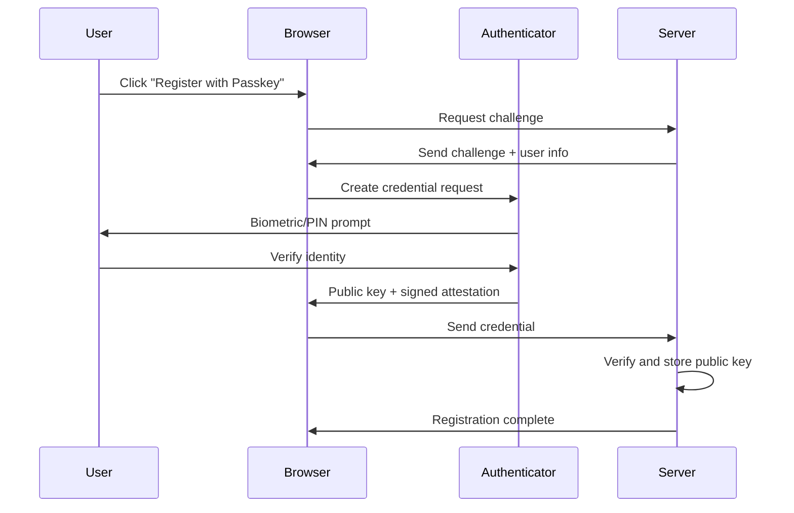
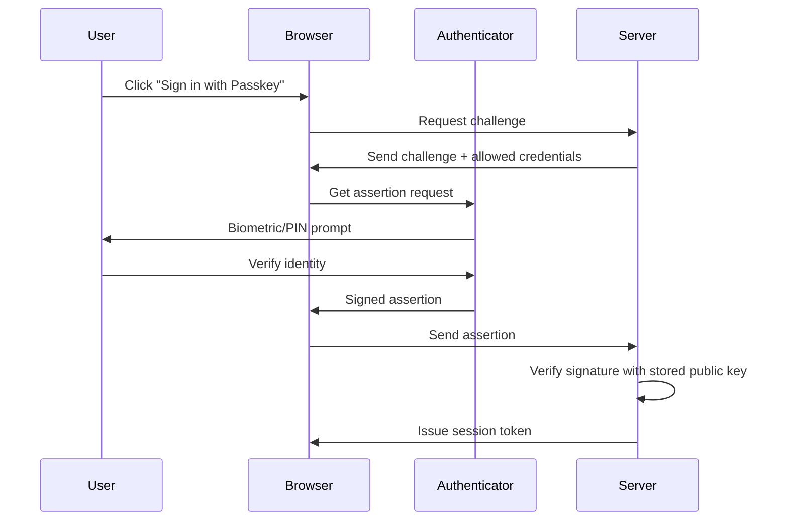
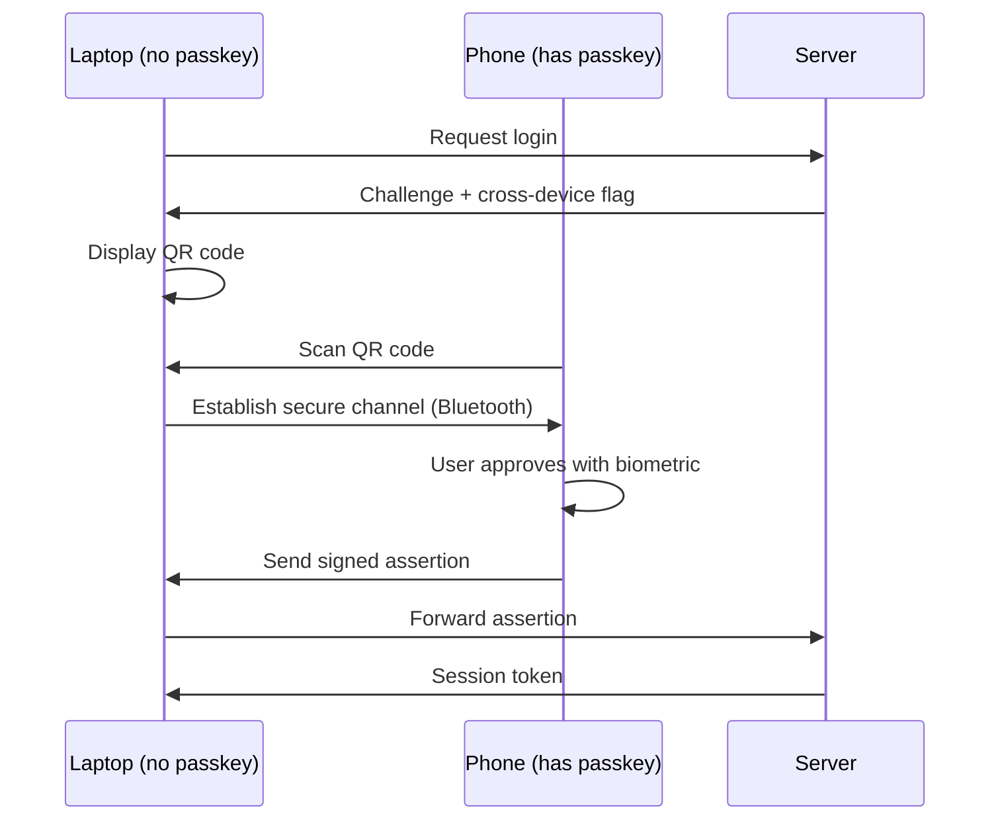

# How to Understand Passkeys and WebAuthn

Author: [nawazdhandala](https://www.github.com/nawazdhandala)

Tags: Passkeys, WebAuthn, Authentication, Security, Passwordless

Description: Learn how passkeys and WebAuthn work to replace passwords with cryptographic key pairs, providing phishing-resistant authentication for modern applications.

---

> Passwords are the weakest link in application security. Passkeys, built on the WebAuthn standard, replace passwords with cryptographic key pairs that live on your devices. This guide breaks down how the technology works and how to implement it.

If you've ever dealt with password reset flows, credential stuffing attacks, or users who write their passwords on sticky notes, you know why the industry is moving away from passwords. Passkeys solve these problems by fundamentally changing how authentication works.

---

## What Are Passkeys?

Passkeys are cryptographic credentials stored on your device (phone, laptop, security key). Instead of transmitting a secret (password) over the network, your device proves it holds a private key by signing a challenge. The server only sees the public key and signature.

| Aspect | Passwords | Passkeys |
|--------|-----------|----------|
| **Storage** | Server stores hash | Server stores public key |
| **Authentication** | Send secret over network | Sign challenge locally |
| **Phishing risk** | High | None (origin-bound) |
| **Reuse risk** | Common | Impossible |
| **User effort** | Remember complex strings | Biometric or PIN |

---

## How WebAuthn Works

WebAuthn (Web Authentication) is the W3C standard that powers passkeys. It defines the API between browsers and authenticators.

The following diagram shows the registration flow:



---

## Key Concepts

### Relying Party (RP)

The relying party is your application. It's identified by a domain name (e.g., `example.com`). Passkeys are bound to this domain, which is why phishing doesn't work.

### Authenticator

The device that stores and uses the private key. This can be:

- **Platform authenticator**: Built into your device (Touch ID, Face ID, Windows Hello)
- **Roaming authenticator**: External device (YubiKey, security keys)

### Credential

A key pair consisting of:

- **Private key**: Never leaves the authenticator
- **Public key**: Stored on the server
- **Credential ID**: Unique identifier for the key pair

---

## Registration Flow in Code

Let's implement passkey registration. First, the server generates a challenge.

This endpoint creates the options needed to register a new passkey:

```javascript
// server/routes/auth.js
const crypto = require('crypto');
const { Fido2Lib } = require('fido2-lib');

// Initialize FIDO2 library with your domain settings
const fido2 = new Fido2Lib({
    timeout: 60000,
    rpId: "example.com",
    rpName: "Example App",
    challengeSize: 32,
    attestation: "none",
    cryptoParams: [-7, -257],  // ES256 and RS256 algorithms
    authenticatorRequirement: "preferred",
    authenticatorUserVerification: "preferred"
});

// Store challenges temporarily (use Redis in production)
const challenges = new Map();

// Generate registration options
async function getRegistrationOptions(req, res) {
    const { userId, username, displayName } = req.body;

    // Create registration options
    const registrationOptions = await fido2.attestationOptions();

    // Add user information
    registrationOptions.user = {
        id: Buffer.from(userId).toString('base64url'),
        name: username,
        displayName: displayName
    };

    // Store challenge for verification
    challenges.set(userId, {
        challenge: registrationOptions.challenge,
        timestamp: Date.now()
    });

    res.json(registrationOptions);
}
```

The browser receives these options and prompts the user:

```javascript
// client/auth.js

async function registerPasskey(userId, username) {
    // Get registration options from server
    const optionsResponse = await fetch('/api/auth/register/options', {
        method: 'POST',
        headers: { 'Content-Type': 'application/json' },
        body: JSON.stringify({ userId, username, displayName: username })
    });

    const options = await optionsResponse.json();

    // Decode base64url values for WebAuthn API
    options.challenge = base64urlToBuffer(options.challenge);
    options.user.id = base64urlToBuffer(options.user.id);

    // Prompt user to create passkey
    // This triggers biometric/PIN on their device
    const credential = await navigator.credentials.create({
        publicKey: options
    });

    // Send credential to server
    const registrationResponse = await fetch('/api/auth/register/verify', {
        method: 'POST',
        headers: { 'Content-Type': 'application/json' },
        body: JSON.stringify({
            userId,
            credential: {
                id: credential.id,
                rawId: bufferToBase64url(credential.rawId),
                response: {
                    clientDataJSON: bufferToBase64url(credential.response.clientDataJSON),
                    attestationObject: bufferToBase64url(credential.response.attestationObject)
                },
                type: credential.type
            }
        })
    });

    return registrationResponse.json();
}

// Helper functions for base64url encoding
function base64urlToBuffer(base64url) {
    const padding = '='.repeat((4 - base64url.length % 4) % 4);
    const base64 = base64url.replace(/-/g, '+').replace(/_/g, '/') + padding;
    const binary = atob(base64);
    const bytes = new Uint8Array(binary.length);
    for (let i = 0; i < binary.length; i++) {
        bytes[i] = binary.charCodeAt(i);
    }
    return bytes.buffer;
}

function bufferToBase64url(buffer) {
    const bytes = new Uint8Array(buffer);
    let binary = '';
    for (let i = 0; i < bytes.length; i++) {
        binary += String.fromCharCode(bytes[i]);
    }
    return btoa(binary).replace(/\+/g, '-').replace(/\//g, '_').replace(/=/g, '');
}
```

The server verifies and stores the credential:

```javascript
// server/routes/auth.js

async function verifyRegistration(req, res) {
    const { userId, credential } = req.body;

    // Retrieve stored challenge
    const storedChallenge = challenges.get(userId);
    if (!storedChallenge) {
        return res.status(400).json({ error: 'Challenge not found or expired' });
    }

    // Check challenge hasn't expired (5 minutes)
    if (Date.now() - storedChallenge.timestamp > 300000) {
        challenges.delete(userId);
        return res.status(400).json({ error: 'Challenge expired' });
    }

    try {
        // Verify the attestation
        const attestationExpectations = {
            challenge: storedChallenge.challenge,
            origin: "https://example.com",
            factor: "either"
        };

        const result = await fido2.attestationResult(credential, attestationExpectations);

        // Store the credential in your database
        await saveCredential(userId, {
            credentialId: credential.id,
            publicKey: result.authnrData.get('credentialPublicKeyPem'),
            counter: result.authnrData.get('counter'),
            createdAt: new Date()
        });

        // Clean up challenge
        challenges.delete(userId);

        res.json({ success: true, message: 'Passkey registered successfully' });
    } catch (error) {
        console.error('Registration verification failed:', error);
        res.status(400).json({ error: 'Verification failed' });
    }
}
```

---

## Authentication Flow

Once registered, authentication follows a similar pattern but uses the stored credential.

The authentication flow diagram:



Server-side authentication options:

```javascript
// server/routes/auth.js

async function getAuthenticationOptions(req, res) {
    const { username } = req.body;

    // Look up user's registered credentials
    const user = await findUserByUsername(username);
    if (!user) {
        return res.status(404).json({ error: 'User not found' });
    }

    const credentials = await getCredentialsForUser(user.id);

    // Generate authentication options
    const authOptions = await fido2.assertionOptions();

    // Include allowed credentials so the browser knows which passkey to use
    authOptions.allowCredentials = credentials.map(cred => ({
        id: cred.credentialId,
        type: 'public-key',
        transports: ['internal', 'usb', 'ble', 'nfc']
    }));

    // Store challenge for verification
    challenges.set(user.id, {
        challenge: authOptions.challenge,
        timestamp: Date.now()
    });

    res.json({ ...authOptions, userId: user.id });
}
```

Client-side authentication request:

```javascript
// client/auth.js

async function authenticateWithPasskey(username) {
    // Get authentication options
    const optionsResponse = await fetch('/api/auth/login/options', {
        method: 'POST',
        headers: { 'Content-Type': 'application/json' },
        body: JSON.stringify({ username })
    });

    const options = await optionsResponse.json();
    const userId = options.userId;

    // Decode challenge
    options.challenge = base64urlToBuffer(options.challenge);

    // Decode allowed credential IDs
    if (options.allowCredentials) {
        options.allowCredentials = options.allowCredentials.map(cred => ({
            ...cred,
            id: base64urlToBuffer(cred.id)
        }));
    }

    // Get assertion from authenticator
    // User will see biometric prompt
    const assertion = await navigator.credentials.get({
        publicKey: options
    });

    // Send assertion to server for verification
    const verifyResponse = await fetch('/api/auth/login/verify', {
        method: 'POST',
        headers: { 'Content-Type': 'application/json' },
        body: JSON.stringify({
            userId,
            assertion: {
                id: assertion.id,
                rawId: bufferToBase64url(assertion.rawId),
                response: {
                    clientDataJSON: bufferToBase64url(assertion.response.clientDataJSON),
                    authenticatorData: bufferToBase64url(assertion.response.authenticatorData),
                    signature: bufferToBase64url(assertion.response.signature),
                    userHandle: assertion.response.userHandle
                        ? bufferToBase64url(assertion.response.userHandle)
                        : null
                },
                type: assertion.type
            }
        })
    });

    return verifyResponse.json();
}
```

Server-side assertion verification:

```javascript
// server/routes/auth.js

async function verifyAuthentication(req, res) {
    const { userId, assertion } = req.body;

    // Get stored challenge
    const storedChallenge = challenges.get(userId);
    if (!storedChallenge) {
        return res.status(400).json({ error: 'Challenge not found' });
    }

    // Get the credential used
    const credential = await getCredentialById(assertion.id);
    if (!credential || credential.userId !== userId) {
        return res.status(400).json({ error: 'Credential not found' });
    }

    try {
        // Verify the assertion
        const assertionExpectations = {
            challenge: storedChallenge.challenge,
            origin: "https://example.com",
            factor: "either",
            publicKey: credential.publicKey,
            prevCounter: credential.counter,
            userHandle: userId
        };

        const result = await fido2.assertionResult(assertion, assertionExpectations);

        // Update counter to prevent replay attacks
        const newCounter = result.authnrData.get('counter');
        await updateCredentialCounter(assertion.id, newCounter);

        // Clean up challenge
        challenges.delete(userId);

        // Create session
        const token = generateSessionToken(userId);

        res.json({
            success: true,
            token,
            message: 'Authentication successful'
        });
    } catch (error) {
        console.error('Authentication verification failed:', error);
        res.status(400).json({ error: 'Authentication failed' });
    }
}
```

---

## Conditional UI (Autofill)

Modern browsers support conditional UI, where passkeys appear in the username autofill dropdown. This creates a smooth user experience.

```javascript
// client/conditionalUI.js

async function initConditionalUI() {
    // Check if conditional UI is supported
    if (!window.PublicKeyCredential ||
        !PublicKeyCredential.isConditionalMediationAvailable) {
        return false;
    }

    const available = await PublicKeyCredential.isConditionalMediationAvailable();
    if (!available) {
        return false;
    }

    // Start conditional UI request
    // This runs in the background and shows passkeys in autofill
    try {
        const options = await fetch('/api/auth/conditional/options').then(r => r.json());

        options.challenge = base64urlToBuffer(options.challenge);

        // The mediation: 'conditional' flag enables autofill UI
        const assertion = await navigator.credentials.get({
            publicKey: options,
            mediation: 'conditional'
        });

        // User selected a passkey from autofill
        // Verify it with the server
        await verifyAssertion(assertion);

    } catch (error) {
        // User cancelled or no passkey selected
        console.log('Conditional UI not used:', error.message);
    }
}

// Call this when the login page loads
document.addEventListener('DOMContentLoaded', () => {
    initConditionalUI();
});
```

Add the autocomplete attribute to your username input:

```html
<!-- Make the username field passkey-aware -->
<input
    type="text"
    name="username"
    autocomplete="username webauthn"
    placeholder="Username or use passkey"
/>
```

---

## Cross-Device Authentication

Users can authenticate on one device using a passkey stored on another device. This works through QR codes and Bluetooth.



The browser handles this automatically when you include the `hybrid` transport:

```javascript
// Allow cross-device authentication
const options = {
    publicKey: {
        challenge: challenge,
        allowCredentials: [{
            id: credentialId,
            type: 'public-key',
            // Include 'hybrid' for cross-device support
            transports: ['internal', 'hybrid', 'usb', 'ble', 'nfc']
        }],
        timeout: 120000,  // Longer timeout for cross-device
        userVerification: 'preferred'
    }
};
```

---

## Security Considerations

### Origin Binding

Passkeys are bound to a specific origin. A passkey created for `example.com` will not work on `evil-example.com`, even if the page looks identical. This is enforced by the browser.

```javascript
// The browser automatically includes the origin in clientDataJSON
// Server must verify it matches expected origin
const clientData = JSON.parse(
    Buffer.from(credential.response.clientDataJSON, 'base64url').toString()
);

if (clientData.origin !== 'https://example.com') {
    throw new Error('Origin mismatch - possible attack');
}
```

### Replay Protection

The counter increments with each authentication. If a replayed authentication has a counter less than or equal to the stored value, reject it:

```javascript
// Check counter to prevent replay attacks
const newCounter = result.authnrData.get('counter');
const storedCounter = credential.counter;

if (newCounter <= storedCounter) {
    // Counter hasn't increased - possible cloned authenticator or replay
    console.error('Counter not increased', { newCounter, storedCounter });
    throw new Error('Replay attack detected');
}

// Update stored counter
await updateCredentialCounter(credentialId, newCounter);
```

### User Verification

Request user verification (biometric or PIN) when appropriate:

```javascript
const options = {
    publicKey: {
        // Options: 'required', 'preferred', 'discouraged'
        userVerification: 'required',  // Always require biometric/PIN
        // ...
    }
};
```

---

## Browser Support

| Browser | Platform Auth | Security Keys | Conditional UI |
|---------|---------------|---------------|----------------|
| Chrome 67+ | Yes | Yes | Chrome 108+ |
| Safari 14+ | Yes | Yes | Safari 16+ |
| Firefox 60+ | Yes | Yes | Firefox 119+ |
| Edge 79+ | Yes | Yes | Edge 108+ |

Check for support before offering passkeys:

```javascript
// Check WebAuthn support
async function checkPasskeySupport() {
    const support = {
        webauthn: false,
        platformAuth: false,
        conditionalUI: false
    };

    // Basic WebAuthn support
    if (window.PublicKeyCredential) {
        support.webauthn = true;

        // Platform authenticator (Touch ID, Face ID, Windows Hello)
        try {
            support.platformAuth = await PublicKeyCredential
                .isUserVerifyingPlatformAuthenticatorAvailable();
        } catch (e) {
            support.platformAuth = false;
        }

        // Conditional UI (autofill)
        try {
            if (PublicKeyCredential.isConditionalMediationAvailable) {
                support.conditionalUI = await PublicKeyCredential
                    .isConditionalMediationAvailable();
            }
        } catch (e) {
            support.conditionalUI = false;
        }
    }

    return support;
}

// Adapt your UI based on support
const support = await checkPasskeySupport();

if (support.platformAuth) {
    showPasskeyRegistrationButton();
}

if (support.conditionalUI) {
    enablePasskeyAutofill();
}
```

---

## Migration Strategy

Don't force users to switch immediately. Offer passkeys alongside existing authentication:

1. **Add passkey option**: Let users add passkeys to existing accounts
2. **Promote during login**: Show passkey option prominently
3. **Gradual deprecation**: Reduce password complexity requirements over time
4. **Account recovery**: Keep backup methods (email, SMS) during transition

```javascript
// Check if user has passkeys registered
async function getAuthMethods(userId) {
    const passkeys = await getCredentialsForUser(userId);
    const hasPassword = await userHasPassword(userId);

    return {
        passkeys: passkeys.length,
        hasPassword,
        canUsePasskey: passkeys.length > 0,
        suggestPasskey: hasPassword && passkeys.length === 0
    };
}
```

---

## Conclusion

Passkeys eliminate the biggest security problems with passwords:

- **No phishing**: Credentials are bound to the legitimate site
- **No password reuse**: Every site gets a unique key pair
- **No weak passwords**: Cryptographic keys are always strong
- **Better UX**: Biometrics are faster than typing passwords

The main challenges are browser support and user familiarity, but both are improving rapidly. Start by adding passkey support alongside existing authentication, and users will naturally migrate as they experience the convenience.

---

*Want to monitor your authentication flows in production? [OneUptime](https://oneuptime.com) provides real-time monitoring for authentication systems, helping you track success rates, latency, and errors across your login infrastructure.*

**Related Reading:**
- [How to Implement JWT Best Practices](https://oneuptime.com/blog)
- [How to Configure OAuth 2.0 Flows](https://oneuptime.com/blog)
