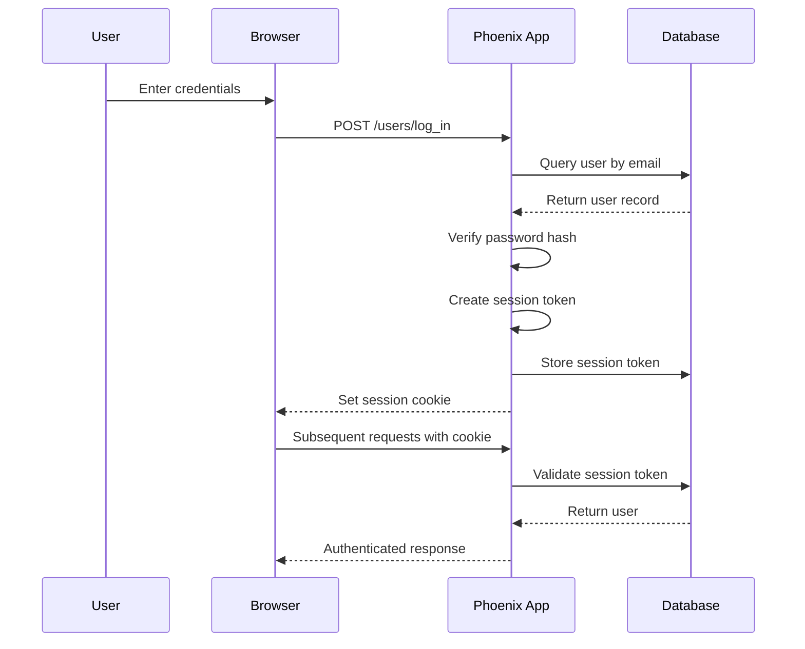

# How to Implement Authentication in Phoenix

Author: [nawazdhandala](https://www.github.com/nawazdhandala)

Tags: Elixir, Phoenix, Authentication, Security, Web Development

Description: A complete guide to implementing secure authentication in Phoenix applications using phx.gen.auth, session management, and token-based authentication patterns.

---

> Authentication in Phoenix has come a long way. With the built-in `phx.gen.auth` generator and Elixir's powerful pattern matching, you can build secure authentication systems that are both maintainable and production-ready.

Phoenix provides excellent tooling for authentication out of the box. This guide covers everything from basic session-based auth to token-based APIs, giving you the knowledge to secure your Phoenix applications properly.

---

## Authentication Architecture in Phoenix

Before diving into code, let's understand how authentication flows work in Phoenix applications.



---

## Getting Started with phx.gen.auth

Phoenix ships with a powerful authentication generator that creates a complete, secure authentication system. This is the recommended starting point for most applications.

### Generate the Authentication System

Run the generator to scaffold user authentication with email and password.

```bash
# Generate authentication context with User schema
mix phx.gen.auth Accounts User users

# Run the generated migrations
mix ecto.migrate
```

This creates:

- User schema with secure password hashing
- Session-based authentication
- Email confirmation (optional)
- Password reset functionality
- LiveView-compatible authentication

### Understanding the Generated Code

The generator creates several key modules. Let's examine the most important ones.

The Accounts context handles all user-related operations. Here's the core user creation logic with password hashing.

```elixir
# lib/my_app/accounts.ex
# Main context module for user management
defmodule MyApp.Accounts do
  @moduledoc """
  The Accounts context handles user registration, authentication,
  and session management.
  """

  import Ecto.Query, warn: false
  alias MyApp.Repo
  alias MyApp.Accounts.{User, UserToken}

  # Register a new user with hashed password
  def register_user(attrs) do
    %User{}
    |> User.registration_changeset(attrs)
    |> Repo.insert()
  end

  # Authenticate user by email and password
  # Returns {:ok, user} or {:error, :bad_credentials}
  def get_user_by_email_and_password(email, password)
      when is_binary(email) and is_binary(password) do
    user = Repo.get_by(User, email: email)

    # Use constant-time comparison to prevent timing attacks
    if User.valid_password?(user, password) do
      {:ok, user}
    else
      {:error, :bad_credentials}
    end
  end

  # Generate a session token for authenticated user
  def generate_user_session_token(user) do
    {token, user_token} = UserToken.build_session_token(user)
    Repo.insert!(user_token)
    token
  end

  # Retrieve user from session token
  def get_user_by_session_token(token) do
    {:ok, query} = UserToken.verify_session_token_query(token)
    Repo.one(query)
  end

  # Delete session token on logout
  def delete_user_session_token(token) do
    Repo.delete_all(UserToken.by_token_and_context_query(token, "session"))
    :ok
  end
end
```

---

## User Schema and Password Hashing

The User schema includes built-in password hashing using Bcrypt. The changeset separates registration, email changes, and password changes for security.

```elixir
# lib/my_app/accounts/user.ex
# User schema with secure password handling
defmodule MyApp.Accounts.User do
  use Ecto.Schema
  import Ecto.Changeset

  @derive {Phoenix.Param, key: :id}
  @derive {Inspect, except: [:password, :hashed_password]}

  schema "users" do
    field :email, :string
    field :password, :string, virtual: true, redact: true
    field :hashed_password, :string, redact: true
    field :confirmed_at, :naive_datetime

    timestamps(type: :utc_datetime)
  end

  # Changeset for user registration - requires email and password
  def registration_changeset(user, attrs, opts \\ []) do
    user
    |> cast(attrs, [:email, :password])
    |> validate_email(opts)
    |> validate_password(opts)
  end

  # Email validation with format check and uniqueness constraint
  defp validate_email(changeset, opts) do
    changeset
    |> validate_required([:email])
    |> validate_format(:email, ~r/^[^\s]+@[^\s]+$/, message: "must have the @ sign and no spaces")
    |> validate_length(:email, max: 160)
    |> maybe_validate_unique_email(opts)
  end

  # Password validation with minimum length and complexity requirements
  defp validate_password(changeset, opts) do
    changeset
    |> validate_required([:password])
    |> validate_length(:password, min: 12, max: 72)
    # Optional: Add complexity requirements
    |> validate_format(:password, ~r/[a-z]/, message: "must have at least one lowercase letter")
    |> validate_format(:password, ~r/[A-Z]/, message: "must have at least one uppercase letter")
    |> validate_format(:password, ~r/[0-9]/, message: "must have at least one digit")
    |> maybe_hash_password(opts)
  end

  # Hash password only if it's present and valid
  defp maybe_hash_password(changeset, opts) do
    hash_password? = Keyword.get(opts, :hash_password, true)
    password = get_change(changeset, :password)

    if hash_password? && password && changeset.valid? do
      changeset
      # Use Bcrypt with cost factor for production security
      |> put_change(:hashed_password, Bcrypt.hash_pwd_salt(password))
      |> delete_change(:password)
    else
      changeset
    end
  end

  # Verify password using constant-time comparison
  def valid_password?(%__MODULE__{hashed_password: hashed}, password)
      when is_binary(hashed) and byte_size(password) > 0 do
    Bcrypt.verify_pass(password, hashed)
  end

  # Prevent timing attacks by running hash even for nil user
  def valid_password?(_, _) do
    Bcrypt.no_user_verify()
    false
  end

  defp maybe_validate_unique_email(changeset, opts) do
    if Keyword.get(opts, :validate_email, true) do
      changeset
      |> unsafe_validate_unique(:email, MyApp.Repo)
      |> unique_constraint(:email)
    else
      changeset
    end
  end
end
```

---

## Session Management

Phoenix uses secure session tokens stored in the database. This allows for proper logout, session tracking, and token revocation.

### Session Token Schema

The UserToken schema handles different token types: session tokens, email confirmation, and password reset.

```elixir
# lib/my_app/accounts/user_token.ex
# Token management for sessions and email verification
defmodule MyApp.Accounts.UserToken do
  use Ecto.Schema
  import Ecto.Query

  # Token validity periods - adjust based on your security requirements
  @session_validity_in_days 60
  @reset_password_validity_in_days 1
  @confirm_validity_in_days 7

  # Random bytes for token generation (256 bits)
  @rand_size 32

  schema "users_tokens" do
    field :token, :binary
    field :context, :string
    field :sent_to, :string

    belongs_to :user, MyApp.Accounts.User
    timestamps(type: :utc_datetime, updated_at: false)
  end

  # Build a new session token for a user
  def build_session_token(user) do
    # Generate cryptographically secure random token
    token = :crypto.strong_rand_bytes(@rand_size)

    user_token = %__MODULE__{
      token: token,
      context: "session",
      user_id: user.id
    }

    {token, user_token}
  end

  # Create query to verify session token and fetch user
  def verify_session_token_query(token) do
    query =
      from t in __MODULE__,
        join: u in assoc(t, :user),
        where: t.token == ^token,
        where: t.context == "session",
        # Expire old sessions automatically
        where: t.inserted_at > ago(@session_validity_in_days, "day"),
        select: u

    {:ok, query}
  end

  # Query to find token by value and context
  def by_token_and_context_query(token, context) do
    from t in __MODULE__,
      where: t.token == ^token,
      where: t.context == ^context
  end

  # Query to find all tokens for a user
  def by_user_and_contexts_query(user, contexts) do
    from t in __MODULE__,
      where: t.user_id == ^user.id,
      where: t.context in ^contexts
  end
end
```

---

## Authentication Controller

The session controller handles login, logout, and session creation. Note the security measures like preventing session fixation.

```elixir
# lib/my_app_web/controllers/user_session_controller.ex
# Controller for handling user sessions
defmodule MyAppWeb.UserSessionController do
  use MyAppWeb, :controller

  alias MyApp.Accounts
  alias MyAppWeb.UserAuth

  def new(conn, _params) do
    render(conn, :new, error_message: nil)
  end

  def create(conn, %{"user" => user_params}) do
    %{"email" => email, "password" => password} = user_params

    case Accounts.get_user_by_email_and_password(email, password) do
      {:ok, user} ->
        conn
        |> put_flash(:info, "Welcome back!")
        |> UserAuth.log_in_user(user, user_params)

      {:error, :bad_credentials} ->
        # Generic error message to prevent email enumeration
        render(conn, :new, error_message: "Invalid email or password")
    end
  end

  def delete(conn, _params) do
    conn
    |> put_flash(:info, "Logged out successfully.")
    |> UserAuth.log_out_user()
  end
end
```

---

## Authentication Plug Module

The UserAuth module provides plugs for authentication and session management across your application.

```elixir
# lib/my_app_web/user_auth.ex
# Authentication plugs and helpers
defmodule MyAppWeb.UserAuth do
  use MyAppWeb, :verified_routes

  import Plug.Conn
  import Phoenix.Controller

  alias MyApp.Accounts

  # Maximum age for the session cookie (60 days in seconds)
  @max_age 60 * 60 * 24 * 60
  @remember_me_cookie "_my_app_web_user_remember_me"
  @remember_me_options [sign: true, max_age: @max_age, same_site: "Lax"]

  # Log in user by creating session and setting cookie
  def log_in_user(conn, user, params \\ %{}) do
    token = Accounts.generate_user_session_token(user)
    user_return_to = get_session(conn, :user_return_to)

    conn
    # Prevent session fixation attacks by generating new session
    |> renew_session()
    |> put_token_in_session(token)
    |> maybe_write_remember_me_cookie(token, params)
    |> redirect(to: user_return_to || signed_in_path(conn))
  end

  # Write remember me cookie if requested
  defp maybe_write_remember_me_cookie(conn, token, %{"remember_me" => "true"}) do
    put_resp_cookie(conn, @remember_me_cookie, token, @remember_me_options)
  end

  defp maybe_write_remember_me_cookie(conn, _token, _params) do
    conn
  end

  # Clear session and redirect to login
  def log_out_user(conn) do
    user_token = get_session(conn, :user_token)
    user_token && Accounts.delete_user_session_token(user_token)

    if live_socket_id = get_session(conn, :live_socket_id) do
      # Disconnect all LiveView sockets for this user
      MyAppWeb.Endpoint.broadcast(live_socket_id, "disconnect", %{})
    end

    conn
    |> renew_session()
    |> delete_resp_cookie(@remember_me_cookie)
    |> redirect(to: ~p"/")
  end

  # Fetch current user from session or remember me cookie
  def fetch_current_user(conn, _opts) do
    {user_token, conn} = ensure_user_token(conn)
    user = user_token && Accounts.get_user_by_session_token(user_token)
    assign(conn, :current_user, user)
  end

  defp ensure_user_token(conn) do
    if token = get_session(conn, :user_token) do
      {token, conn}
    else
      conn = fetch_cookies(conn, signed: [@remember_me_cookie])

      if token = conn.cookies[@remember_me_cookie] do
        {token, put_token_in_session(conn, token)}
      else
        {nil, conn}
      end
    end
  end

  # Plug to require authenticated user
  def require_authenticated_user(conn, _opts) do
    if conn.assigns[:current_user] do
      conn
    else
      conn
      |> put_flash(:error, "You must log in to access this page.")
      |> maybe_store_return_to()
      |> redirect(to: ~p"/users/log_in")
      |> halt()
    end
  end

  # Plug to redirect if user is already authenticated
  def redirect_if_user_is_authenticated(conn, _opts) do
    if conn.assigns[:current_user] do
      conn
      |> redirect(to: signed_in_path(conn))
      |> halt()
    else
      conn
    end
  end

  defp renew_session(conn) do
    delete_csrf_token()

    conn
    |> configure_session(renew: true)
    |> clear_session()
  end

  defp put_token_in_session(conn, token) do
    conn
    |> put_session(:user_token, token)
    |> put_session(:live_socket_id, "users_sessions:#{Base.url_encode64(token)}")
  end

  defp maybe_store_return_to(%{method: "GET"} = conn) do
    put_session(conn, :user_return_to, current_path(conn))
  end

  defp maybe_store_return_to(conn), do: conn

  defp signed_in_path(_conn), do: ~p"/"
end
```

---

## Router Configuration

Configure your router with authentication pipelines to protect routes.

```elixir
# lib/my_app_web/router.ex
# Router with authentication pipelines
defmodule MyAppWeb.Router do
  use MyAppWeb, :router

  import MyAppWeb.UserAuth

  # Browser pipeline with session handling
  pipeline :browser do
    plug :accepts, ["html"]
    plug :fetch_session
    plug :fetch_live_flash
    plug :put_root_layout, html: {MyAppWeb.Layouts, :root}
    plug :protect_from_forgery
    plug :put_secure_browser_headers
    plug :fetch_current_user
  end

  # API pipeline for token-based authentication
  pipeline :api do
    plug :accepts, ["json"]
  end

  # Public routes - no authentication required
  scope "/", MyAppWeb do
    pipe_through :browser

    get "/", PageController, :home
  end

  # Routes that redirect logged-in users (login, registration)
  scope "/", MyAppWeb do
    pipe_through [:browser, :redirect_if_user_is_authenticated]

    get "/users/register", UserRegistrationController, :new
    post "/users/register", UserRegistrationController, :create
    get "/users/log_in", UserSessionController, :new
    post "/users/log_in", UserSessionController, :create
    get "/users/reset_password", UserResetPasswordController, :new
    post "/users/reset_password", UserResetPasswordController, :create
    get "/users/reset_password/:token", UserResetPasswordController, :edit
    put "/users/reset_password/:token", UserResetPasswordController, :update
  end

  # Protected routes - require authentication
  scope "/", MyAppWeb do
    pipe_through [:browser, :require_authenticated_user]

    get "/users/settings", UserSettingsController, :edit
    put "/users/settings", UserSettingsController, :update
    get "/users/settings/confirm_email/:token", UserSettingsController, :confirm_email

    # Your protected resources
    resources "/posts", PostController
    resources "/dashboard", DashboardController, only: [:index]
  end

  # Logout route - requires authentication
  scope "/", MyAppWeb do
    pipe_through [:browser]

    delete "/users/log_out", UserSessionController, :delete
    get "/users/confirm/:token", UserConfirmationController, :edit
    post "/users/confirm/:token", UserConfirmationController, :update
  end
end
```

---

## Token-Based API Authentication

For API clients, you'll want token-based authentication instead of sessions. Here's how to implement bearer token authentication.

### API Token Schema

Add a dedicated token type for API authentication with longer validity and optional scopes.

```elixir
# lib/my_app/accounts/api_token.ex
# API tokens for programmatic access
defmodule MyApp.Accounts.ApiToken do
  use Ecto.Schema
  import Ecto.Changeset
  import Ecto.Query

  @rand_size 32
  @token_validity_days 365

  schema "api_tokens" do
    field :token, :binary
    field :token_hint, :string
    field :name, :string
    field :scopes, {:array, :string}, default: []
    field :last_used_at, :utc_datetime

    belongs_to :user, MyApp.Accounts.User
    timestamps(type: :utc_datetime)
  end

  def changeset(token, attrs) do
    token
    |> cast(attrs, [:name, :scopes])
    |> validate_required([:name])
    |> validate_length(:name, max: 100)
  end

  # Generate a new API token for a user
  def build_token(user, attrs) do
    token = :crypto.strong_rand_bytes(@rand_size)

    # Store only last 4 chars as hint for identification
    token_hint = token |> Base.url_encode64() |> String.slice(-4, 4)

    api_token =
      %__MODULE__{
        token: token,
        token_hint: token_hint,
        user_id: user.id
      }
      |> changeset(attrs)

    # Return the raw token (shown once) and the changeset
    {Base.url_encode64(token, padding: false), api_token}
  end

  # Query to verify API token
  def verify_token_query(token) do
    case Base.url_decode64(token, padding: false) do
      {:ok, decoded_token} ->
        query =
          from t in __MODULE__,
            join: u in assoc(t, :user),
            where: t.token == ^decoded_token,
            where: t.inserted_at > ago(@token_validity_days, "day"),
            select: {u, t}

        {:ok, query}

      :error ->
        {:error, :invalid_token}
    end
  end
end
```

### API Authentication Plug

Create a plug that extracts and validates bearer tokens from the Authorization header.

```elixir
# lib/my_app_web/plugs/api_auth.ex
# API authentication plug for bearer tokens
defmodule MyAppWeb.Plugs.ApiAuth do
  @moduledoc """
  Plug for authenticating API requests using bearer tokens.

  Add to your API pipeline:

      pipeline :api do
        plug :accepts, ["json"]
        plug MyAppWeb.Plugs.ApiAuth
      end
  """

  import Plug.Conn
  alias MyApp.Accounts
  alias MyApp.Accounts.ApiToken

  def init(opts), do: opts

  def call(conn, _opts) do
    with {:ok, token} <- extract_token(conn),
         {:ok, query} <- ApiToken.verify_token_query(token),
         {user, api_token} <- MyApp.Repo.one(query) do
      # Update last used timestamp asynchronously
      Task.start(fn -> update_last_used(api_token) end)

      conn
      |> assign(:current_user, user)
      |> assign(:api_token, api_token)
    else
      _ ->
        conn
        |> assign(:current_user, nil)
        |> assign(:api_token, nil)
    end
  end

  # Extract bearer token from Authorization header
  defp extract_token(conn) do
    case get_req_header(conn, "authorization") do
      ["Bearer " <> token] -> {:ok, String.trim(token)}
      _ -> {:error, :missing_token}
    end
  end

  # Track when token was last used
  defp update_last_used(api_token) do
    import Ecto.Query

    MyApp.Repo.update_all(
      from(t in ApiToken, where: t.id == ^api_token.id),
      set: [last_used_at: DateTime.utc_now()]
    )
  end
end
```

### API Controller with Authentication

Protect your API endpoints with the authentication plug.

```elixir
# lib/my_app_web/controllers/api/v1/posts_controller.ex
# Protected API controller
defmodule MyAppWeb.Api.V1.PostsController do
  use MyAppWeb, :controller

  alias MyApp.Posts

  # Require authentication for all actions
  plug :require_api_auth

  def index(conn, _params) do
    posts = Posts.list_user_posts(conn.assigns.current_user)
    json(conn, %{data: posts})
  end

  def show(conn, %{"id" => id}) do
    case Posts.get_user_post(conn.assigns.current_user, id) do
      nil ->
        conn
        |> put_status(:not_found)
        |> json(%{error: "Post not found"})

      post ->
        json(conn, %{data: post})
    end
  end

  def create(conn, %{"post" => post_params}) do
    case Posts.create_post(conn.assigns.current_user, post_params) do
      {:ok, post} ->
        conn
        |> put_status(:created)
        |> json(%{data: post})

      {:error, changeset} ->
        conn
        |> put_status(:unprocessable_entity)
        |> json(%{errors: format_errors(changeset)})
    end
  end

  # Private plug to require API authentication
  defp require_api_auth(conn, _opts) do
    if conn.assigns[:current_user] do
      conn
    else
      conn
      |> put_status(:unauthorized)
      |> json(%{error: "Authentication required"})
      |> halt()
    end
  end

  defp format_errors(changeset) do
    Ecto.Changeset.traverse_errors(changeset, fn {msg, opts} ->
      Enum.reduce(opts, msg, fn {key, value}, acc ->
        String.replace(acc, "%{#{key}}", to_string(value))
      end)
    end)
  end
end
```

---

## LiveView Authentication

Phoenix LiveView requires special handling for authentication since it uses WebSockets.

### Mount Hook for LiveView

Create a hook that runs on every LiveView mount to check authentication.

```elixir
# lib/my_app_web/live/user_auth.ex
# LiveView authentication helpers
defmodule MyAppWeb.Live.UserAuth do
  @moduledoc """
  LiveView authentication hooks.

  Use in your LiveViews:

      use MyAppWeb, :live_view

      on_mount {MyAppWeb.Live.UserAuth, :ensure_authenticated}
  """

  import Phoenix.Component
  import Phoenix.LiveView
  alias MyApp.Accounts

  # Mount hook that requires authentication
  def on_mount(:ensure_authenticated, _params, session, socket) do
    socket = mount_current_user(socket, session)

    if socket.assigns.current_user do
      {:cont, socket}
    else
      socket =
        socket
        |> put_flash(:error, "You must log in to access this page.")
        |> redirect(to: ~p"/users/log_in")

      {:halt, socket}
    end
  end

  # Mount hook that just loads user if present
  def on_mount(:mount_current_user, _params, session, socket) do
    {:cont, mount_current_user(socket, session)}
  end

  # Mount hook that redirects authenticated users
  def on_mount(:redirect_if_authenticated, _params, session, socket) do
    socket = mount_current_user(socket, session)

    if socket.assigns.current_user do
      {:halt, redirect(socket, to: ~p"/")}
    else
      {:cont, socket}
    end
  end

  defp mount_current_user(socket, session) do
    assign_new(socket, :current_user, fn ->
      if user_token = session["user_token"] do
        Accounts.get_user_by_session_token(user_token)
      end
    end)
  end
end
```

### Protected LiveView Example

Here's how to use the authentication hook in your LiveViews.

```elixir
# lib/my_app_web/live/dashboard_live.ex
# Protected LiveView with authentication
defmodule MyAppWeb.DashboardLive do
  use MyAppWeb, :live_view

  # Require authentication on mount
  on_mount {MyAppWeb.Live.UserAuth, :ensure_authenticated}

  @impl true
  def mount(_params, _session, socket) do
    # current_user is already assigned by the hook
    user = socket.assigns.current_user

    socket =
      socket
      |> assign(:page_title, "Dashboard")
      |> assign(:stats, load_user_stats(user))

    {:ok, socket}
  end

  @impl true
  def render(assigns) do
    ~H"""
    <div class="dashboard">
      <h1>Welcome, <%= @current_user.email %></h1>

      <div class="stats-grid">
        <div class="stat-card">
          <h3>Posts</h3>
          <p><%= @stats.posts_count %></p>
        </div>

        <div class="stat-card">
          <h3>Comments</h3>
          <p><%= @stats.comments_count %></p>
        </div>
      </div>
    </div>
    """
  end

  defp load_user_stats(user) do
    %{
      posts_count: MyApp.Posts.count_user_posts(user),
      comments_count: MyApp.Comments.count_user_comments(user)
    }
  end
end
```

---

## Security Best Practices

### Rate Limiting Login Attempts

Protect against brute force attacks by rate limiting authentication endpoints.

```elixir
# lib/my_app_web/plugs/rate_limiter.ex
# Simple rate limiter using ETS
defmodule MyAppWeb.Plugs.RateLimiter do
  @moduledoc """
  Rate limiting plug for authentication endpoints.

  Configure in your endpoint or router:

      plug MyAppWeb.Plugs.RateLimiter,
        max_requests: 5,
        interval_seconds: 60,
        error_message: "Too many login attempts"
  """

  import Plug.Conn

  @default_max_requests 5
  @default_interval_seconds 60

  def init(opts) do
    # Ensure ETS table exists
    if :ets.whereis(:rate_limiter) == :undefined do
      :ets.new(:rate_limiter, [:named_table, :public, :set])
    end

    opts
  end

  def call(conn, opts) do
    max_requests = Keyword.get(opts, :max_requests, @default_max_requests)
    interval = Keyword.get(opts, :interval_seconds, @default_interval_seconds)
    error_message = Keyword.get(opts, :error_message, "Rate limit exceeded")

    # Use client IP as identifier
    key = get_client_ip(conn)
    now = System.system_time(:second)

    case check_rate(key, now, max_requests, interval) do
      :ok ->
        conn

      :rate_limited ->
        conn
        |> put_status(:too_many_requests)
        |> Phoenix.Controller.put_view(MyAppWeb.ErrorJSON)
        |> Phoenix.Controller.render("429.json", message: error_message)
        |> halt()
    end
  end

  defp check_rate(key, now, max_requests, interval) do
    case :ets.lookup(:rate_limiter, key) do
      [] ->
        # First request from this IP
        :ets.insert(:rate_limiter, {key, 1, now})
        :ok

      [{^key, count, first_request}] when now - first_request > interval ->
        # Interval expired, reset counter
        :ets.insert(:rate_limiter, {key, 1, now})
        :ok

      [{^key, count, _first_request}] when count < max_requests ->
        # Under limit, increment counter
        :ets.update_counter(:rate_limiter, key, {2, 1})
        :ok

      _ ->
        # Rate limited
        :rate_limited
    end
  end

  defp get_client_ip(conn) do
    # Check for forwarded IP first (for reverse proxies)
    forwarded =
      conn
      |> get_req_header("x-forwarded-for")
      |> List.first()

    if forwarded do
      forwarded |> String.split(",") |> List.first() |> String.trim()
    else
      conn.remote_ip |> Tuple.to_list() |> Enum.join(".")
    end
  end
end
```

### Secure Password Requirements

Enforce strong passwords with validation and breach checking.

```elixir
# lib/my_app/accounts/password_validator.ex
# Enhanced password validation
defmodule MyApp.Accounts.PasswordValidator do
  @moduledoc """
  Password strength validation with common password checking.
  """

  import Ecto.Changeset

  # Common passwords to reject
  @common_passwords ~w(
    password123 qwerty123 letmein123 welcome123 admin123
    password1234 123456789a abcdefghij qwertyuiop
  )

  def validate_password_strength(changeset, field \\ :password) do
    changeset
    |> validate_length(field, min: 12, max: 72)
    |> validate_format(field, ~r/[a-z]/, message: "must contain a lowercase letter")
    |> validate_format(field, ~r/[A-Z]/, message: "must contain an uppercase letter")
    |> validate_format(field, ~r/[0-9]/, message: "must contain a number")
    |> validate_not_common(field)
    |> validate_not_email(field)
  end

  # Reject commonly used passwords
  defp validate_not_common(changeset, field) do
    validate_change(changeset, field, fn _, password ->
      normalized = String.downcase(password)

      if normalized in @common_passwords do
        [{field, "is too common, please choose a stronger password"}]
      else
        []
      end
    end)
  end

  # Password should not contain the email
  defp validate_not_email(changeset, field) do
    validate_change(changeset, field, fn _, password ->
      email = get_field(changeset, :email) || ""
      email_local = email |> String.split("@") |> List.first() || ""

      if String.length(email_local) > 3 and
           String.contains?(String.downcase(password), String.downcase(email_local)) do
        [{field, "should not contain your email"}]
      else
        []
      end
    end)
  end
end
```

### Session Security

Add additional session security measures.

```elixir
# lib/my_app_web/plugs/session_security.ex
# Session security enhancements
defmodule MyAppWeb.Plugs.SessionSecurity do
  @moduledoc """
  Additional session security measures.
  """

  import Plug.Conn

  def init(opts), do: opts

  def call(conn, _opts) do
    conn
    |> check_session_ip()
    |> check_session_user_agent()
    |> rotate_session_if_needed()
  end

  # Detect session hijacking by IP change
  defp check_session_ip(conn) do
    current_ip = get_client_ip(conn)
    session_ip = get_session(conn, :session_ip)

    cond do
      is_nil(session_ip) ->
        put_session(conn, :session_ip, current_ip)

      session_ip != current_ip ->
        # IP changed, could be session hijacking
        # Option 1: Log and monitor
        Logger.warning("Session IP changed from #{session_ip} to #{current_ip}")
        put_session(conn, :session_ip, current_ip)

        # Option 2: Invalidate session (stricter)
        # conn |> clear_session() |> configure_session(renew: true)

      true ->
        conn
    end
  end

  # Track user agent for session
  defp check_session_user_agent(conn) do
    current_ua = get_req_header(conn, "user-agent") |> List.first() || "unknown"
    session_ua = get_session(conn, :session_user_agent)

    if is_nil(session_ua) do
      put_session(conn, :session_user_agent, current_ua)
    else
      conn
    end
  end

  # Rotate session periodically to limit exposure
  defp rotate_session_if_needed(conn) do
    last_rotation = get_session(conn, :session_rotated_at)
    now = DateTime.utc_now()

    # Rotate session every hour
    if is_nil(last_rotation) or DateTime.diff(now, last_rotation, :hour) >= 1 do
      conn
      |> configure_session(renew: true)
      |> put_session(:session_rotated_at, now)
    else
      conn
    end
  end

  defp get_client_ip(conn) do
    conn.remote_ip |> Tuple.to_list() |> Enum.join(".")
  end
end
```

---

## Testing Authentication

Test your authentication thoroughly to ensure security.

```elixir
# test/my_app_web/controllers/user_session_controller_test.exs
# Authentication controller tests
defmodule MyAppWeb.UserSessionControllerTest do
  use MyAppWeb.ConnCase, async: true

  import MyApp.AccountsFixtures

  setup do
    %{user: user_fixture()}
  end

  describe "POST /users/log_in" do
    test "logs in user with valid credentials", %{conn: conn, user: user} do
      conn =
        post(conn, ~p"/users/log_in", %{
          "user" => %{
            "email" => user.email,
            "password" => valid_user_password()
          }
        })

      assert get_session(conn, :user_token)
      assert redirected_to(conn) == ~p"/"

      # Verify user can access protected routes
      conn = get(conn, ~p"/users/settings")
      assert html_response(conn, 200) =~ "Settings"
    end

    test "returns error with invalid credentials", %{conn: conn, user: user} do
      conn =
        post(conn, ~p"/users/log_in", %{
          "user" => %{
            "email" => user.email,
            "password" => "wrongpassword"
          }
        })

      assert html_response(conn, 200) =~ "Invalid email or password"
      refute get_session(conn, :user_token)
    end

    test "returns error with non-existent email", %{conn: conn} do
      conn =
        post(conn, ~p"/users/log_in", %{
          "user" => %{
            "email" => "nonexistent@example.com",
            "password" => "anypassword123"
          }
        })

      # Same message to prevent email enumeration
      assert html_response(conn, 200) =~ "Invalid email or password"
    end
  end

  describe "DELETE /users/log_out" do
    test "logs out user", %{conn: conn, user: user} do
      conn = log_in_user(conn, user)
      assert get_session(conn, :user_token)

      conn = delete(conn, ~p"/users/log_out")

      assert redirected_to(conn) == ~p"/"
      refute get_session(conn, :user_token)
    end
  end

  describe "protected routes" do
    test "redirect to login when not authenticated", %{conn: conn} do
      conn = get(conn, ~p"/users/settings")

      assert redirected_to(conn) == ~p"/users/log_in"
      assert get_flash(conn, :error) =~ "must log in"
    end

    test "allow access when authenticated", %{conn: conn, user: user} do
      conn = conn |> log_in_user(user) |> get(~p"/users/settings")

      assert html_response(conn, 200)
    end
  end
end
```

---

## Summary

Implementing authentication in Phoenix is straightforward with the right approach:

| Component | Recommendation |
|-----------|----------------|
| Starting Point | Use `phx.gen.auth` generator |
| Password Storage | Bcrypt with proper cost factor |
| Sessions | Database-backed tokens |
| API Auth | Bearer tokens with scopes |
| LiveView | Use `on_mount` hooks |
| Security | Rate limiting, strong passwords, session rotation |

Key takeaways:

1. **Use phx.gen.auth** - It provides a secure, battle-tested starting point
2. **Database-backed sessions** - Allow proper logout and session tracking
3. **Separate API tokens** - Use dedicated tokens for programmatic access
4. **LiveView hooks** - Handle authentication consistently across LiveViews
5. **Rate limiting** - Protect against brute force attacks
6. **Strong password policies** - Enforce minimum requirements

Phoenix's built-in authentication tools combined with Elixir's pattern matching make building secure authentication systems both safe and enjoyable.

---

*Need to monitor authentication events and security incidents? [OneUptime](https://oneuptime.com) provides real-time alerting for authentication failures, unusual login patterns, and session anomalies to keep your Phoenix application secure.*

**Related Reading:**
- [How to Handle Background Jobs with Oban](https://oneuptime.com/blog/post/2026-02-02-phoenix-oban-background-jobs/view)
- [How to Handle LiveView Form Validation in Phoenix](https://oneuptime.com/blog/post/2026-02-02-phoenix-liveview-form-validation/view)
