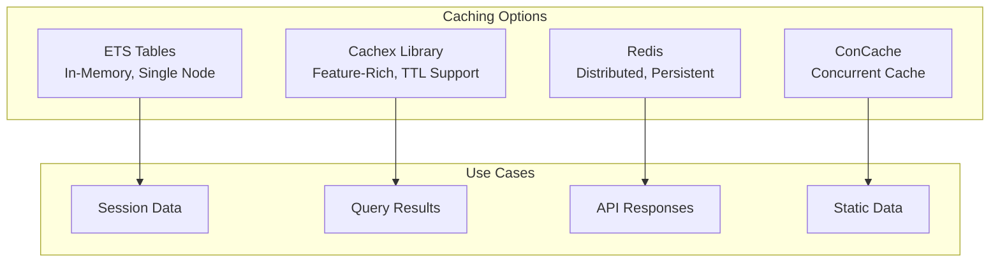
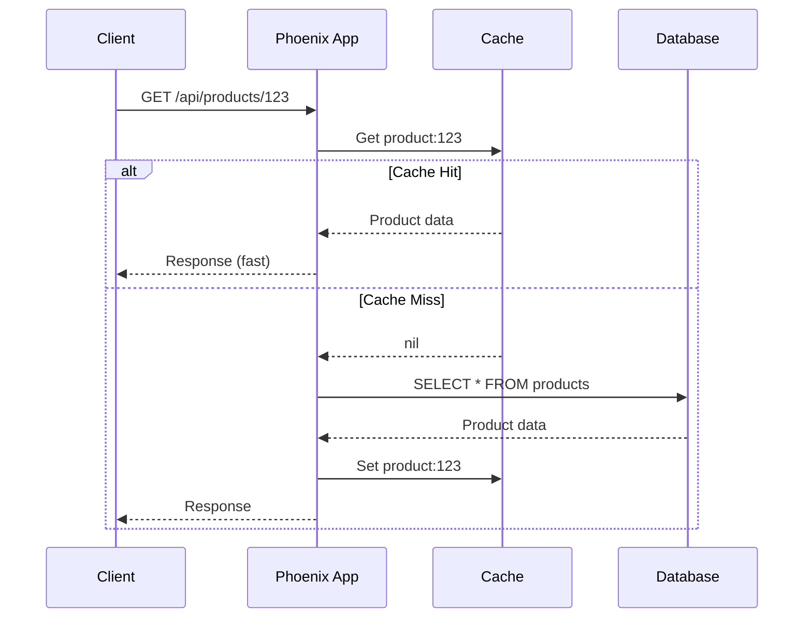

# How to Implement Caching in Phoenix

Author: [nawazdhandala](https://www.github.com/nawazdhandala)

Tags: Elixir, Phoenix, Caching, ETS, Redis, Performance, Optimization

Description: Learn how to implement effective caching strategies in Phoenix applications using ETS, Cachex, and Redis to dramatically improve performance.

---

> Caching is one of the most effective ways to boost application performance. Phoenix and Elixir provide excellent caching options, from in-memory ETS tables to distributed caching with Redis.

Phoenix applications can benefit significantly from well-implemented caching strategies. This guide covers ETS-based caching, the Cachex library, Redis integration, and best practices for production deployments.

---

## Understanding Caching in Elixir/Phoenix

Before implementing caching, let's understand the available options and when to use each:



---

## ETS-Based Caching

Erlang Term Storage (ETS) provides fast, in-memory storage that's perfect for caching within a single node.

### Creating an ETS Cache Module

```elixir
defmodule MyApp.Cache do
  @moduledoc """
  Simple ETS-based cache for Phoenix applications.
  Provides fast in-memory caching with TTL support.
  """
  
  use GenServer
  
  @table_name :app_cache
  @cleanup_interval :timer.minutes(5)
  
  # Client API
  
  def start_link(opts \\ []) do
    GenServer.start_link(__MODULE__, opts, name: __MODULE__)
  end
  
  @doc """
  Get a value from the cache.
  Returns {:ok, value} if found and not expired, :error otherwise.
  """
  def get(key) do
    case :ets.lookup(@table_name, key) do
      [{^key, value, expires_at}] ->
        if DateTime.compare(DateTime.utc_now(), expires_at) == :lt do
          {:ok, value}
        else
          delete(key)
          :error
        end
      [] ->
        :error
    end
  end
  
  @doc """
  Store a value in the cache with optional TTL in seconds.
  Default TTL is 5 minutes.
  """
  def put(key, value, ttl_seconds \\ 300) do
    expires_at = DateTime.add(DateTime.utc_now(), ttl_seconds, :second)
    :ets.insert(@table_name, {key, value, expires_at})
    :ok
  end
  
  @doc """
  Delete a key from the cache.
  """
  def delete(key) do
    :ets.delete(@table_name, key)
    :ok
  end
  
  @doc """
  Get a value from cache or compute it if missing.
  The function is only called on cache miss.
  """
  def fetch(key, ttl_seconds \\ 300, fun) when is_function(fun, 0) do
    case get(key) do
      {:ok, value} ->
        value
      :error ->
        value = fun.()
        put(key, value, ttl_seconds)
        value
    end
  end
  
  # Server callbacks
  
  @impl true
  def init(_opts) do
    table = :ets.new(@table_name, [
      :set,
      :public,
      :named_table,
      read_concurrency: true,
      write_concurrency: true
    ])
    
    schedule_cleanup()
    {:ok, %{table: table}}
  end
  
  @impl true
  def handle_info(:cleanup, state) do
    cleanup_expired_entries()
    schedule_cleanup()
    {:noreply, state}
  end
  
  defp schedule_cleanup do
    Process.send_after(self(), :cleanup, @cleanup_interval)
  end
  
  defp cleanup_expired_entries do
    now = DateTime.utc_now()
    
    :ets.foldl(fn {key, _value, expires_at}, acc ->
      if DateTime.compare(now, expires_at) != :lt do
        :ets.delete(@table_name, key)
      end
      acc
    end, nil, @table_name)
  end
end
```

### Using the Cache in Controllers

```elixir
defmodule MyAppWeb.ProductController do
  use MyAppWeb, :controller
  
  alias MyApp.{Cache, Products}
  
  def show(conn, %{"id" => id}) do
    # Cache product data for 10 minutes
    product = Cache.fetch("product:#{id}", 600, fn ->
      Products.get_product!(id)
    end)
    
    render(conn, :show, product: product)
  end
  
  def index(conn, params) do
    cache_key = "products:#{:erlang.phash2(params)}"
    
    products = Cache.fetch(cache_key, 300, fn ->
      Products.list_products(params)
    end)
    
    render(conn, :index, products: products)
  end
end
```

---

## Using Cachex for Advanced Caching

Cachex provides a more feature-rich caching solution with TTL, limits, and hooks.

### Adding Cachex to Your Project

```elixir
# mix.exs
defp deps do
  [
    {:cachex, "~> 3.6"}
  ]
end
```

### Configuring Cachex

```elixir
# lib/my_app/application.ex
defmodule MyApp.Application do
  use Application
  
  def start(_type, _args) do
    children = [
      # Start Cachex cache
      {Cachex, name: :app_cache, expiration: expiration_config()},
      
      # Other children...
      MyAppWeb.Endpoint
    ]
    
    opts = [strategy: :one_for_one, name: MyApp.Supervisor]
    Supervisor.start_link(children, opts)
  end
  
  defp expiration_config do
    Cachex.Spec.expiration(
      default: :timer.minutes(5),
      interval: :timer.seconds(30),
      lazy: true
    )
  end
end
```

### Cachex Usage Examples

```elixir
defmodule MyApp.CachedQueries do
  @moduledoc """
  Cached database queries using Cachex.
  """
  
  alias MyApp.Repo
  import Ecto.Query
  
  @doc """
  Get a user by ID with caching.
  """
  def get_user(id) do
    Cachex.fetch(:app_cache, "user:#{id}", fn ->
      case Repo.get(User, id) do
        nil -> {:ignore, nil}
        user -> {:commit, user}
      end
    end)
    |> handle_cachex_result()
  end
  
  @doc """
  Get popular products with caching.
  """
  def get_popular_products(limit \\ 10) do
    cache_key = "popular_products:#{limit}"
    
    Cachex.fetch(:app_cache, cache_key, fn ->
      products = from(p in Product,
        order_by: [desc: p.view_count],
        limit: ^limit
      )
      |> Repo.all()
      
      {:commit, products, ttl: :timer.minutes(15)}
    end)
    |> handle_cachex_result()
  end
  
  @doc """
  Invalidate user cache when user is updated.
  """
  def invalidate_user(id) do
    Cachex.del(:app_cache, "user:#{id}")
  end
  
  defp handle_cachex_result({:ok, value}), do: value
  defp handle_cachex_result({:commit, value}), do: value
  defp handle_cachex_result({:ignore, value}), do: value
end
```

---

## Redis Integration for Distributed Caching

For multi-node deployments, Redis provides distributed caching that all nodes can share.

### Setting Up Redix

```elixir
# mix.exs
defp deps do
  [
    {:redix, "~> 1.2"}
  ]
end

# lib/my_app/application.ex
children = [
  {Redix, name: :redix, host: "localhost", port: 6379}
]
```

### Redis Cache Module

```elixir
defmodule MyApp.RedisCache do
  @moduledoc """
  Distributed cache using Redis.
  Suitable for multi-node Phoenix deployments.
  """
  
  @doc """
  Get a value from Redis cache.
  """
  def get(key) do
    case Redix.command(:redix, ["GET", key]) do
      {:ok, nil} -> :error
      {:ok, value} -> {:ok, decode(value)}
      {:error, _} -> :error
    end
  end
  
  @doc """
  Set a value with TTL in seconds.
  """
  def put(key, value, ttl_seconds \\ 300) do
    encoded = encode(value)
    Redix.command(:redix, ["SETEX", key, ttl_seconds, encoded])
    :ok
  end
  
  @doc """
  Delete a key from cache.
  """
  def delete(key) do
    Redix.command(:redix, ["DEL", key])
    :ok
  end
  
  @doc """
  Fetch with cache-aside pattern.
  """
  def fetch(key, ttl_seconds \\ 300, fun) do
    case get(key) do
      {:ok, value} -> value
      :error ->
        value = fun.()
        put(key, value, ttl_seconds)
        value
    end
  end
  
  defp encode(value), do: :erlang.term_to_binary(value)
  defp decode(binary), do: :erlang.binary_to_term(binary)
end
```

---

## Cache-Aside Pattern in Phoenix

Implement the cache-aside pattern for automatic cache management:



---

## Best Practices

1. **Choose the right cache backend** - Use ETS for single-node, Redis for distributed
2. **Set appropriate TTLs** - Balance freshness vs. performance
3. **Implement cache invalidation** - Clear cache when data changes
4. **Use cache keys wisely** - Include all query parameters in keys
5. **Monitor cache hit rates** - Track performance metrics
6. **Handle cache failures gracefully** - Fall back to database on errors

---

## Summary

| Cache Type | Use Case | Pros | Cons |
|------------|----------|------|------|
| ETS | Single-node, high-speed | Very fast, no dependencies | Not distributed |
| Cachex | Feature-rich caching | TTL, hooks, limits | Single-node |
| Redis | Distributed caching | Shared across nodes | External dependency |

Effective caching can dramatically improve your Phoenix application's performance. Start with ETS for simple use cases, add Cachex for advanced features, and use Redis when you need distributed caching across multiple nodes.
