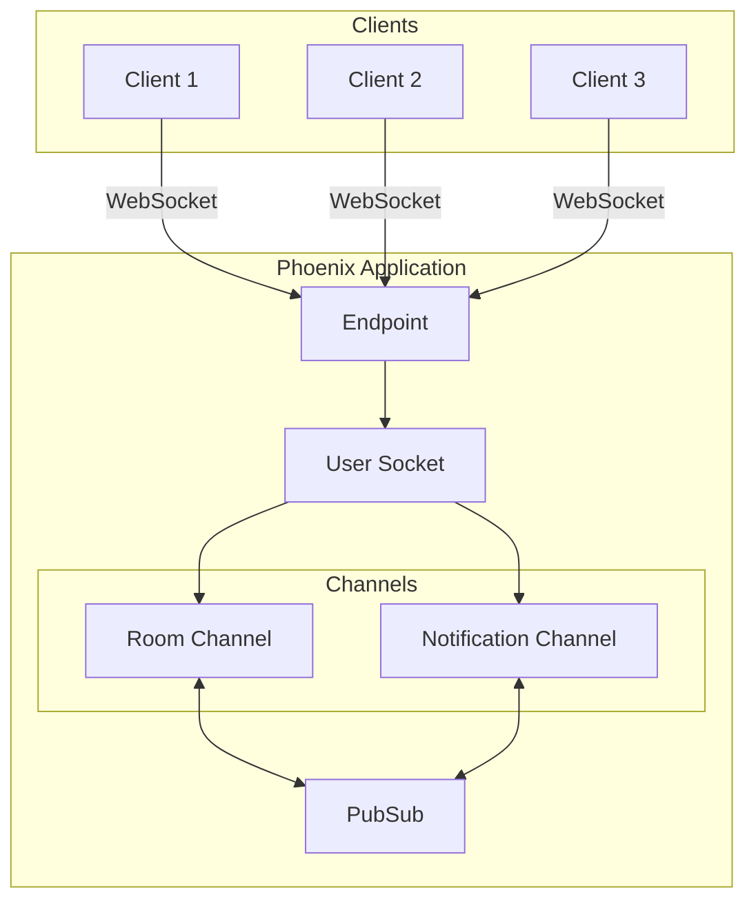
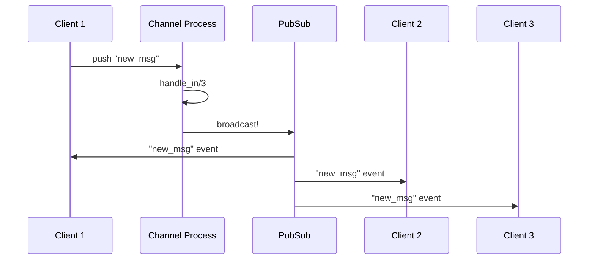

# How to Configure Phoenix Channel Topics and Broadcasts

Author: [nawazdhandala](https://www.github.com/nawazdhandala)

Tags: Elixir, Phoenix, Channels, WebSockets, Real-time

Description: Learn how to configure Phoenix Channels for real-time communication in Elixir applications. This comprehensive guide covers topics, broadcasts, presence tracking, and production-ready patterns for building scalable WebSocket applications.

---

> Phoenix Channels provide a powerful abstraction for real-time communication, enabling bidirectional data flow between clients and servers. Whether you're building chat applications, live dashboards, or collaborative tools, understanding how to configure topics and broadcasts is essential for creating responsive, scalable applications.

Real-time features have become a standard expectation in modern web applications. Phoenix Channels, built on top of WebSockets with fallback to long-polling, make implementing these features straightforward while maintaining excellent performance characteristics.

---

## Understanding Phoenix Channels Architecture

Before diving into configuration, let's understand how Phoenix Channels work at a high level.



Phoenix Channels consist of several key components:

| Component | Purpose | Scope |
|-----------|---------|-------|
| **Endpoint** | Entry point for WebSocket connections | Application-wide |
| **Socket** | Manages connection state and authentication | Per-connection |
| **Channel** | Handles topic-specific logic | Per-topic subscription |
| **PubSub** | Message distribution system | Cluster-wide |
| **Topic** | Named channel for message routing | Logical grouping |

---

## Setting Up Your First Channel

### Creating the Socket

The socket handles the initial WebSocket connection and authentication. Here we define the socket module that will manage all channel connections for authenticated users.

```elixir
# lib/my_app_web/channels/user_socket.ex
defmodule MyAppWeb.UserSocket do
  use Phoenix.Socket

  # Define which channels this socket can handle
  # The "*" wildcard allows any subtopic under "room:"
  channel "room:*", MyAppWeb.RoomChannel
  channel "notifications:*", MyAppWeb.NotificationChannel

  # Socket connection callback - called when client first connects
  # Returns {:ok, socket} to accept or :error to reject
  @impl true
  def connect(%{"token" => token}, socket, _connect_info) do
    case verify_token(token) do
      {:ok, user_id} ->
        # Assign user_id to socket for use in channels
        {:ok, assign(socket, :user_id, user_id)}

      {:error, _reason} ->
        :error
    end
  end

  def connect(_params, _socket, _connect_info), do: :error

  # Identify the socket connection - used for targeting specific users
  # This enables sending messages to specific users across the cluster
  @impl true
  def id(socket), do: "user_socket:#{socket.assigns.user_id}"

  # Token verification helper
  defp verify_token(token) do
    Phoenix.Token.verify(
      MyAppWeb.Endpoint,
      "user auth",
      token,
      max_age: 86400
    )
  end
end
```

### Configuring the Endpoint

Add the socket to your endpoint configuration. This tells Phoenix to handle WebSocket connections at the specified path.

```elixir
# lib/my_app_web/endpoint.ex
defmodule MyAppWeb.Endpoint do
  use Phoenix.Endpoint, otp_app: :my_app

  # Socket configuration with WebSocket and long-polling transports
  # websocket: true enables WebSocket transport
  # longpoll: false disables long-polling fallback (enable if needed)
  socket "/socket", MyAppWeb.UserSocket,
    websocket: [
      timeout: 45_000,
      compress: true,
      check_origin: ["https://myapp.com"]
    ],
    longpoll: false

  # ... rest of endpoint configuration
end
```

---

## Understanding Topics

Topics are the addressing system for Phoenix Channels. They determine which messages go where and who receives them.

### Topic Naming Conventions

Topics follow a pattern of `resource:identifier`. Here are common patterns and their use cases.

```elixir
# Topic naming patterns and their typical use cases
# Format: "resource:identifier"

# Public topics - anyone can join
"lobby"                    # Single global topic
"room:lobby"               # Namespaced global topic

# Resource-specific topics - scoped to a specific entity
"room:123"                 # Chat room with ID 123
"game:abc-def"             # Game session with UUID
"document:draft_456"       # Collaborative document

# User-specific topics - private to a single user
"user:789"                 # User's private channel
"notifications:user_789"   # User's notification stream

# Compound topics - multiple scoping levels
"org:acme:room:general"    # Organization-scoped room
"project:123:tasks"        # Project-scoped task updates
```

### Implementing Topic Authorization

Not all topics should be accessible to all users. Implement proper authorization in your channel's join callback.

```elixir
# lib/my_app_web/channels/room_channel.ex
defmodule MyAppWeb.RoomChannel do
  use MyAppWeb, :channel

  # Join callback - called when client attempts to join a topic
  # First argument is the full topic string
  # Second argument contains any parameters sent with the join request
  @impl true
  def join("room:lobby", _params, socket) do
    # Public lobby - allow anyone
    {:ok, socket}
  end

  def join("room:" <> room_id, _params, socket) do
    user_id = socket.assigns.user_id

    # Check if user has permission to join this room
    # authorize_room/2 returns :ok or {:error, reason}
    case authorize_room(user_id, room_id) do
      :ok ->
        # Send initial room state after joining
        send(self(), :after_join)
        {:ok, assign(socket, :room_id, room_id), socket}

      {:error, reason} ->
        {:error, %{reason: reason}}
    end
  end

  # Handle the after_join message we sent to ourselves
  # This pattern allows us to push data after the join completes
  @impl true
  def handle_info(:after_join, socket) do
    room_id = socket.assigns.room_id

    # Push recent messages to the newly joined client
    messages = Messages.get_recent(room_id, limit: 50)
    push(socket, "message_history", %{messages: messages})

    # Track presence for this user in this room
    {:ok, _} = Presence.track(socket, socket.assigns.user_id, %{
      online_at: System.system_time(:second),
      device: "web"
    })

    {:noreply, socket}
  end

  defp authorize_room(user_id, room_id) do
    if Rooms.member?(room_id, user_id) do
      :ok
    else
      {:error, "not_a_member"}
    end
  end
end
```

---

## Broadcasting Messages

Broadcasting is how you send messages to all subscribers of a topic. Phoenix provides several broadcasting functions for different use cases.

### Broadcast Flow



### Basic Broadcasting

The most common broadcast pattern sends messages to all subscribers of a topic, including the sender.

```elixir
# lib/my_app_web/channels/room_channel.ex
defmodule MyAppWeb.RoomChannel do
  use MyAppWeb, :channel

  # Handle incoming "new_msg" event from client
  # payload contains the message data sent by the client
  @impl true
  def handle_in("new_msg", %{"body" => body}, socket) do
    user_id = socket.assigns.user_id
    room_id = socket.assigns.room_id

    # Persist the message to the database
    {:ok, message} = Messages.create(%{
      body: body,
      user_id: user_id,
      room_id: room_id
    })

    # Broadcast to ALL subscribers of this topic (including sender)
    # The event name "new_msg" will be received by all clients
    broadcast!(socket, "new_msg", %{
      id: message.id,
      body: message.body,
      user_id: user_id,
      inserted_at: message.inserted_at
    })

    {:noreply, socket}
  end

  # Handle "typing" indicator - broadcast to others only
  @impl true
  def handle_in("typing", %{"typing" => is_typing}, socket) do
    # broadcast_from! sends to all subscribers EXCEPT the sender
    # Useful for typing indicators where sender already knows their state
    broadcast_from!(socket, "user_typing", %{
      user_id: socket.assigns.user_id,
      typing: is_typing
    })

    {:noreply, socket}
  end
end
```

### Broadcasting from Outside Channels

Sometimes you need to broadcast messages from outside a channel process, such as from a background job or another part of your application.

```elixir
# Broadcasting from anywhere in your application
# This is useful for background jobs, scheduled tasks, or other processes
defmodule MyApp.Notifications do
  alias MyAppWeb.Endpoint

  # Send notification to a specific user's channel
  # Uses Endpoint.broadcast! which goes through PubSub
  def notify_user(user_id, event, payload) do
    Endpoint.broadcast!(
      "notifications:#{user_id}",
      event,
      payload
    )
  end

  # Send notification to all users in a room
  def notify_room(room_id, event, payload) do
    Endpoint.broadcast!(
      "room:#{room_id}",
      event,
      payload
    )
  end

  # Broadcast with error handling
  # broadcast/3 returns :ok or {:error, reason} instead of raising
  def safe_broadcast(topic, event, payload) do
    case Endpoint.broadcast(topic, event, payload) do
      :ok ->
        :ok

      {:error, reason} ->
        Logger.error("Broadcast failed: #{inspect(reason)}")
        {:error, reason}
    end
  end
end
```

### Intercepting Broadcasts

Sometimes you need to modify or filter broadcasts before they reach clients. Use intercept for this.

```elixir
# lib/my_app_web/channels/room_channel.ex
defmodule MyAppWeb.RoomChannel do
  use MyAppWeb, :channel

  # Declare which events this channel will intercept
  # Intercepted events go through handle_out before being pushed
  intercept ["new_msg", "user_joined"]

  # handle_out is called for intercepted broadcasts
  # Allows you to modify, filter, or suppress messages per-client
  @impl true
  def handle_out("new_msg", payload, socket) do
    user_id = socket.assigns.user_id

    # Check if sender is blocked by this recipient
    if blocked?(user_id, payload.user_id) do
      # Don't push - silently drop the message for this client
      {:noreply, socket}
    else
      # Enrich payload with additional data specific to this recipient
      enriched = Map.put(payload, :is_own_message, payload.user_id == user_id)
      push(socket, "new_msg", enriched)
      {:noreply, socket}
    end
  end

  def handle_out("user_joined", payload, socket) do
    # Add relationship context for this specific viewer
    relationship = get_relationship(socket.assigns.user_id, payload.user_id)
    enriched = Map.put(payload, :relationship, relationship)
    push(socket, "user_joined", enriched)
    {:noreply, socket}
  end

  defp blocked?(viewer_id, author_id) do
    BlockList.blocked?(viewer_id, author_id)
  end

  defp get_relationship(user_id, other_id) do
    Relationships.get(user_id, other_id)
  end
end
```

---

## Presence Tracking

Phoenix Presence provides distributed presence tracking across your cluster. It handles the complexity of tracking who is online and synchronizing that state.

### Setting Up Presence

First, create a Presence module for your application. This module handles presence tracking for all channels.

```elixir
# lib/my_app_web/channels/presence.ex
defmodule MyAppWeb.Presence do
  use Phoenix.Presence,
    otp_app: :my_app,
    pubsub_server: MyApp.PubSub

  # Optional: customize presence list transformation
  # Called when presence list is fetched
  def fetch(_topic, presences) do
    # Enrich presence data with user information
    users = presences
    |> Map.keys()
    |> MyApp.Users.get_users_map()

    for {key, %{metas: metas}} <- presences, into: %{} do
      {key, %{
        metas: metas,
        user: Map.get(users, key)
      }}
    end
  end
end
```

### Using Presence in Channels

Track and untrack users as they join and leave channels. The presence system automatically handles synchronization.

```elixir
# lib/my_app_web/channels/room_channel.ex
defmodule MyAppWeb.RoomChannel do
  use MyAppWeb, :channel
  alias MyAppWeb.Presence

  @impl true
  def join("room:" <> room_id, _params, socket) do
    # Send after_join to ourselves - allows join to complete first
    send(self(), :after_join)
    {:ok, assign(socket, :room_id, room_id)}
  end

  @impl true
  def handle_info(:after_join, socket) do
    user_id = socket.assigns.user_id

    # Push current presence state to the joining client
    # list/2 returns all currently tracked presences for the topic
    push(socket, "presence_state", Presence.list(socket))

    # Track this user's presence
    # First argument is socket (determines topic)
    # Second is the key (usually user_id)
    # Third is metadata about this presence
    {:ok, _ref} = Presence.track(socket, user_id, %{
      online_at: System.system_time(:second),
      device: socket.assigns[:device] || "unknown",
      status: "online"
    })

    {:noreply, socket}
  end

  # Handle presence status updates from client
  @impl true
  def handle_in("update_status", %{"status" => status}, socket) do
    user_id = socket.assigns.user_id

    # Update presence metadata
    # Presence automatically broadcasts the diff to all subscribers
    Presence.update(socket, user_id, fn meta ->
      Map.put(meta, :status, status)
    end)

    {:noreply, socket}
  end
end
```

### Client-Side Presence Handling

On the client side, handle presence synchronization using the Phoenix JavaScript library.

```javascript
// assets/js/room.js
import { Socket, Presence } from "phoenix"

// Initialize socket connection with authentication token
const socket = new Socket("/socket", {
  params: { token: window.userToken }
})

socket.connect()

// Join a specific room channel
const channel = socket.channel("room:123", {})

// Initialize presence tracking
let presences = {}

// Handle initial presence state
channel.on("presence_state", state => {
  presences = Presence.syncState(presences, state)
  renderOnlineUsers(presences)
})

// Handle presence changes (joins/leaves)
channel.on("presence_diff", diff => {
  presences = Presence.syncDiff(presences, diff)
  renderOnlineUsers(presences)
})

// Render function to update UI with online users
function renderOnlineUsers(presences) {
  const users = Presence.list(presences, (id, { metas, user }) => {
    // metas is array of all sessions for this user
    // user is the enriched data from fetch/2
    return {
      id: id,
      name: user?.name || "Unknown",
      status: metas[0]?.status || "online",
      deviceCount: metas.length
    }
  })

  const container = document.getElementById("online-users")
  container.innerHTML = users
    .map(u => `<div class="user ${u.status}">${u.name} (${u.deviceCount} devices)</div>`)
    .join("")
}

// Join the channel
channel.join()
  .receive("ok", resp => console.log("Joined room", resp))
  .receive("error", resp => console.log("Failed to join", resp))
```

---

## Advanced Patterns

### Rate Limiting Channel Messages

Protect your channels from abuse by implementing rate limiting on incoming messages.

```elixir
# lib/my_app_web/channels/room_channel.ex
defmodule MyAppWeb.RoomChannel do
  use MyAppWeb, :channel

  # Rate limit configuration: 10 messages per 5 seconds
  @rate_limit_count 10
  @rate_limit_window 5_000

  @impl true
  def join("room:" <> room_id, _params, socket) do
    # Initialize rate limit state in socket assigns
    socket = socket
    |> assign(:room_id, room_id)
    |> assign(:message_timestamps, [])

    {:ok, socket}
  end

  @impl true
  def handle_in("new_msg", payload, socket) do
    case check_rate_limit(socket) do
      {:ok, socket} ->
        # Process message normally
        broadcast!(socket, "new_msg", payload)
        {:noreply, socket}

      {:error, :rate_limited, socket} ->
        # Inform client they are rate limited
        push(socket, "error", %{
          reason: "rate_limited",
          message: "Too many messages. Please slow down."
        })
        {:noreply, socket}
    end
  end

  # Check and update rate limit state
  defp check_rate_limit(socket) do
    now = System.monotonic_time(:millisecond)
    window_start = now - @rate_limit_window

    # Filter out timestamps outside the current window
    recent = socket.assigns.message_timestamps
    |> Enum.filter(fn ts -> ts > window_start end)

    if length(recent) >= @rate_limit_count do
      {:error, :rate_limited, socket}
    else
      # Add current timestamp and update socket
      socket = assign(socket, :message_timestamps, [now | recent])
      {:ok, socket}
    end
  end
end
```

### Channel Pipelines

Create reusable pipelines for common channel operations, similar to Plug pipelines for HTTP.

```elixir
# lib/my_app_web/channels/channel_helpers.ex
defmodule MyAppWeb.ChannelHelpers do
  @moduledoc """
  Reusable pipeline functions for channels
  """

  import Phoenix.Channel

  # Validate that required fields are present in payload
  def validate_payload(socket, payload, required_fields) do
    missing = required_fields -- Map.keys(payload)

    if Enum.empty?(missing) do
      {:ok, socket, payload}
    else
      {:error, socket, "Missing required fields: #{Enum.join(missing, ", ")}"}
    end
  end

  # Sanitize string fields to prevent XSS
  def sanitize_strings(socket, payload, fields) do
    sanitized = Enum.reduce(fields, payload, fn field, acc ->
      case Map.get(acc, field) do
        value when is_binary(value) ->
          Map.put(acc, field, HtmlSanitizeEx.strip_tags(value))
        _ ->
          acc
      end
    end)

    {:ok, socket, sanitized}
  end

  # Log channel events for debugging/auditing
  def log_event(socket, event, payload) do
    Logger.info("Channel event",
      event: event,
      user_id: socket.assigns[:user_id],
      topic: socket.topic,
      payload_keys: Map.keys(payload)
    )

    {:ok, socket, payload}
  end
end
```

Use the pipeline in your channel:

```elixir
# lib/my_app_web/channels/room_channel.ex
defmodule MyAppWeb.RoomChannel do
  use MyAppWeb, :channel
  import MyAppWeb.ChannelHelpers

  @impl true
  def handle_in("new_msg", payload, socket) do
    # Pipeline of validations and transformations
    with {:ok, socket, payload} <- validate_payload(socket, payload, ["body"]),
         {:ok, socket, payload} <- sanitize_strings(socket, payload, ["body"]),
         {:ok, socket, payload} <- log_event(socket, "new_msg", payload) do

      broadcast!(socket, "new_msg", %{
        body: payload["body"],
        user_id: socket.assigns.user_id,
        timestamp: DateTime.utc_now()
      })

      {:noreply, socket}
    else
      {:error, socket, reason} ->
        push(socket, "error", %{reason: reason})
        {:noreply, socket}
    end
  end
end
```

### Sharding for High-Volume Topics

For topics with many subscribers, consider sharding to distribute load across multiple channel processes.

```elixir
# lib/my_app_web/channels/sharded_channel.ex
defmodule MyAppWeb.ShardedChannel do
  use MyAppWeb, :channel

  @shard_count 16

  # Calculate shard for a given entity
  def shard_for(entity_id) do
    :erlang.phash2(entity_id, @shard_count)
  end

  # Generate sharded topic name
  def sharded_topic(base_topic, entity_id) do
    shard = shard_for(entity_id)
    "#{base_topic}:shard:#{shard}"
  end

  # Broadcast to all shards of a topic
  def broadcast_to_all_shards(base_topic, event, payload) do
    for shard <- 0..(@shard_count - 1) do
      topic = "#{base_topic}:shard:#{shard}"
      MyAppWeb.Endpoint.broadcast!(topic, event, payload)
    end
  end
end
```

```elixir
# Usage in a channel
defmodule MyAppWeb.LiveFeedChannel do
  use MyAppWeb, :channel
  alias MyAppWeb.ShardedChannel

  @impl true
  def join("feed:" <> feed_id, _params, socket) do
    user_id = socket.assigns.user_id

    # Join the appropriate shard based on user_id
    # This distributes users across channel processes
    sharded_topic = ShardedChannel.sharded_topic("feed:#{feed_id}", user_id)

    # Subscribe to the sharded topic
    MyAppWeb.Endpoint.subscribe(sharded_topic)

    {:ok, assign(socket, :feed_id, feed_id)}
  end
end
```

---

## Production Considerations

### Configuring PubSub for Clustering

When running multiple Phoenix nodes, configure PubSub to use a distributed adapter.

```elixir
# config/runtime.exs
config :my_app, MyApp.PubSub,
  name: MyApp.PubSub,
  adapter: Phoenix.PubSub.PG2,
  pool_size: 10

# For Redis-backed PubSub (for non-Erlang clustering)
# config :my_app, MyApp.PubSub,
#   name: MyApp.PubSub,
#   adapter: Phoenix.PubSub.Redis,
#   host: System.get_env("REDIS_HOST"),
#   node_name: System.get_env("NODE_NAME")
```

### Handling Connection Failures

Implement reconnection logic and graceful degradation on the client side.

```javascript
// assets/js/socket.js
import { Socket } from "phoenix"

class ReconnectingSocket {
  constructor(url, options = {}) {
    this.maxRetries = options.maxRetries || 10
    this.retryCount = 0
    this.baseDelay = options.baseDelay || 1000

    this.socket = new Socket(url, {
      ...options,
      reconnectAfterMs: (tries) => this.calculateBackoff(tries)
    })

    this.setupEventHandlers()
  }

  // Exponential backoff with jitter for reconnection
  calculateBackoff(tries) {
    // Cap at 30 seconds
    const maxDelay = 30000
    const delay = Math.min(
      this.baseDelay * Math.pow(2, tries),
      maxDelay
    )
    // Add random jitter to prevent thundering herd
    const jitter = Math.random() * 1000
    return delay + jitter
  }

  setupEventHandlers() {
    this.socket.onOpen(() => {
      console.log("Socket connected")
      this.retryCount = 0
      this.onConnect?.()
    })

    this.socket.onClose(() => {
      console.log("Socket closed")
      this.onDisconnect?.()
    })

    this.socket.onError((error) => {
      console.error("Socket error:", error)
      this.retryCount++

      if (this.retryCount >= this.maxRetries) {
        console.error("Max retries exceeded")
        this.onMaxRetries?.()
      }
    })
  }

  connect() {
    this.socket.connect()
    return this
  }

  channel(topic, params) {
    return this.socket.channel(topic, params)
  }
}

// Usage
const socket = new ReconnectingSocket("/socket", {
  params: { token: window.userToken },
  maxRetries: 10
})

socket.onConnect = () => updateConnectionStatus("connected")
socket.onDisconnect = () => updateConnectionStatus("disconnected")
socket.onMaxRetries = () => showReconnectButton()

socket.connect()
```

### Monitoring Channel Health

Track channel metrics for observability and debugging.

```elixir
# lib/my_app_web/channels/instrumented_channel.ex
defmodule MyAppWeb.InstrumentedChannel do
  @moduledoc """
  Channel with built-in telemetry instrumentation
  """

  defmacro __using__(_opts) do
    quote do
      use Phoenix.Channel

      @before_compile MyAppWeb.InstrumentedChannel
    end
  end

  defmacro __before_compile__(_env) do
    quote do
      # Wrap join with telemetry
      defoverridable join: 3

      def join(topic, params, socket) do
        start_time = System.monotonic_time()

        result = super(topic, params, socket)

        duration = System.monotonic_time() - start_time

        :telemetry.execute(
          [:my_app, :channel, :join],
          %{duration: duration},
          %{topic: topic, result: elem(result, 0)}
        )

        result
      end

      # Wrap handle_in with telemetry
      defoverridable handle_in: 3

      def handle_in(event, payload, socket) do
        start_time = System.monotonic_time()

        result = super(event, payload, socket)

        duration = System.monotonic_time() - start_time

        :telemetry.execute(
          [:my_app, :channel, :handle_in],
          %{duration: duration},
          %{topic: socket.topic, event: event}
        )

        result
      end
    end
  end
end
```

Attach telemetry handlers to collect and report metrics:

```elixir
# lib/my_app/telemetry.ex
defmodule MyApp.Telemetry do
  require Logger

  def setup do
    events = [
      [:my_app, :channel, :join],
      [:my_app, :channel, :handle_in]
    ]

    :telemetry.attach_many(
      "my-app-channel-handler",
      events,
      &handle_event/4,
      nil
    )
  end

  def handle_event([:my_app, :channel, :join], measurements, metadata, _config) do
    duration_ms = System.convert_time_unit(
      measurements.duration,
      :native,
      :millisecond
    )

    Logger.info("Channel join",
      topic: metadata.topic,
      result: metadata.result,
      duration_ms: duration_ms
    )

    # Report to your metrics system
    :telemetry.execute(
      [:my_app, :metrics, :channel_join],
      %{count: 1, duration_ms: duration_ms},
      metadata
    )
  end

  def handle_event([:my_app, :channel, :handle_in], measurements, metadata, _config) do
    duration_ms = System.convert_time_unit(
      measurements.duration,
      :native,
      :millisecond
    )

    # Report to your metrics system
    :telemetry.execute(
      [:my_app, :metrics, :channel_message],
      %{count: 1, duration_ms: duration_ms},
      metadata
    )
  end
end
```

---

## Best Practices

### 1. Keep Channel Processes Lightweight

Channel processes should focus on message routing. Offload heavy work to separate processes.

```elixir
# Bad: Heavy processing in channel
def handle_in("process_data", %{"data" => data}, socket) do
  # This blocks the channel process
  result = heavy_computation(data)
  push(socket, "result", result)
  {:noreply, socket}
end

# Good: Offload to a task
def handle_in("process_data", %{"data" => data}, socket) do
  user_id = socket.assigns.user_id
  topic = socket.topic

  # Spawn a task to handle heavy work
  Task.start(fn ->
    result = heavy_computation(data)
    MyAppWeb.Endpoint.broadcast!(topic, "result", %{
      user_id: user_id,
      result: result
    })
  end)

  {:noreply, socket}
end
```

### 2. Use Meaningful Topic Hierarchies

Design your topic structure to match your domain model and access patterns.

```elixir
# Clear topic hierarchy examples
"org:#{org_id}:project:#{project_id}:tasks"
"user:#{user_id}:notifications"
"game:#{game_id}:player:#{player_id}"
```

### 3. Handle Errors Gracefully

Always handle errors and provide feedback to clients.

```elixir
def handle_in("action", payload, socket) do
  case perform_action(payload) do
    {:ok, result} ->
      push(socket, "action_result", %{success: true, data: result})
      {:noreply, socket}

    {:error, :not_found} ->
      push(socket, "action_result", %{success: false, error: "not_found"})
      {:noreply, socket}

    {:error, :unauthorized} ->
      push(socket, "action_result", %{success: false, error: "unauthorized"})
      {:noreply, socket}

    {:error, reason} ->
      Logger.error("Action failed: #{inspect(reason)}")
      push(socket, "action_result", %{success: false, error: "internal_error"})
      {:noreply, socket}
  end
end
```

### 4. Implement Heartbeats and Timeouts

Configure appropriate timeouts to detect and clean up stale connections.

```elixir
# config/config.exs
config :my_app, MyAppWeb.Endpoint,
  # ...
  pubsub_server: MyApp.PubSub

# In endpoint.ex
socket "/socket", MyAppWeb.UserSocket,
  websocket: [
    timeout: 45_000,          # Close if no messages for 45s
    transport_log: :debug,    # Log transport events
    check_origin: true        # Validate origin header
  ]
```

---

## Conclusion

Phoenix Channels provide a robust foundation for building real-time applications. Key takeaways:

- **Topics** are your addressing system - design them to match your domain model
- **Broadcasts** distribute messages efficiently across your cluster
- **Presence** handles the complexity of tracking online users
- **Intercept** broadcasts when you need per-client customization
- **Rate limiting** protects against abuse
- **Telemetry** provides observability into channel behavior

With these patterns, you can build scalable, maintainable real-time features that perform well under load.

---

*Need to monitor your Phoenix Channels in production? [OneUptime](https://oneuptime.com) provides real-time monitoring with WebSocket support and customizable alerting.*

**Related Reading:**
- [How to Monitor Elixir Applications with OpenTelemetry](https://oneuptime.com/blog/post/2026-02-06-what-opentelemetry-does-not-do/view)
- [Building Scalable Real-time Systems with Phoenix](https://hexdocs.pm/phoenix/channels.html)
