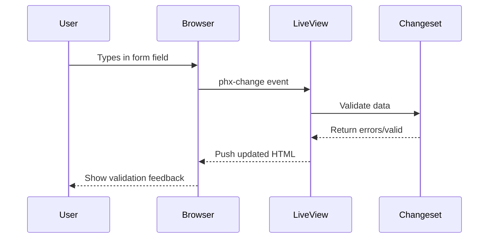
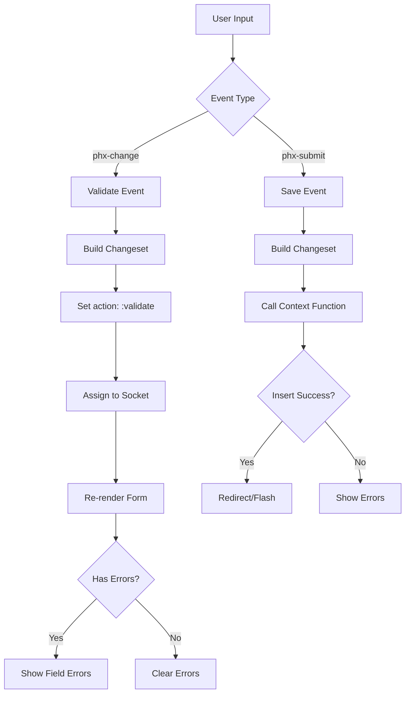

# How to Handle LiveView Form Validation in Phoenix

Author: [nawazdhandala](https://www.github.com/nawazdhandala)

Tags: Elixir, Phoenix, LiveView, Forms, Validation

Description: Learn how to implement robust form validation in Phoenix LiveView with real-time feedback, changesets, and error handling. This guide covers inline validation, custom validators, and production-ready patterns.

---

> Forms are the gateway to user data in web applications. Phoenix LiveView transforms form handling by providing real-time validation feedback without page refreshes or custom JavaScript. This guide shows you how to build robust, user-friendly forms with LiveView.

Phoenix LiveView revolutionizes form handling by keeping all validation logic server-side while delivering instant feedback to users. No more duplicating validation rules between frontend and backend.

---

## How LiveView Form Validation Works

LiveView forms operate through a persistent WebSocket connection. When users interact with form fields, events are sent to the server, processed through Ecto changesets, and validation results are pushed back to the client instantly.



This server-centric approach means your validation logic lives in one place and works consistently across all clients.

---

## Setting Up the Foundation

Before diving into forms, you need a schema with validations and a LiveView to host the form.

### The Ecto Schema

This schema defines a user registration form with common validation requirements like required fields, format validation, and length constraints.

```elixir
# lib/my_app/accounts/user.ex
defmodule MyApp.Accounts.User do
  use Ecto.Schema
  import Ecto.Changeset

  schema "users" do
    field :email, :string
    field :username, :string
    field :password, :string, virtual: true
    field :password_hash, :string
    field :age, :integer
    field :bio, :string
    field :accepted_terms, :boolean, default: false

    timestamps()
  end

  @doc """
  Creates a changeset for user registration.
  All validation rules are defined here and reused across the application.
  """
  def registration_changeset(user, attrs) do
    user
    |> cast(attrs, [:email, :username, :password, :age, :bio, :accepted_terms])
    |> validate_required([:email, :username, :password, :accepted_terms])
    |> validate_email()
    |> validate_username()
    |> validate_password()
    |> validate_age()
    |> validate_acceptance(:accepted_terms, message: "You must accept the terms")
  end

  # Email validation with format check and uniqueness constraint
  defp validate_email(changeset) do
    changeset
    |> validate_format(:email, ~r/^[^\s]+@[^\s]+\.[^\s]+$/,
      message: "must be a valid email address"
    )
    |> validate_length(:email, max: 160)
    |> unsafe_validate_unique(:email, MyApp.Repo)
    |> unique_constraint(:email)
  end

  # Username validation with format and length constraints
  defp validate_username(changeset) do
    changeset
    |> validate_format(:username, ~r/^[a-zA-Z0-9_]+$/,
      message: "can only contain letters, numbers, and underscores"
    )
    |> validate_length(:username, min: 3, max: 30)
    |> unsafe_validate_unique(:username, MyApp.Repo)
    |> unique_constraint(:username)
  end

  # Password validation with strength requirements
  defp validate_password(changeset) do
    changeset
    |> validate_length(:password, min: 8, max: 72)
    |> validate_format(:password, ~r/[a-z]/,
      message: "must contain at least one lowercase letter"
    )
    |> validate_format(:password, ~r/[A-Z]/,
      message: "must contain at least one uppercase letter"
    )
    |> validate_format(:password, ~r/[0-9]/,
      message: "must contain at least one number"
    )
  end

  # Age validation with range constraint
  defp validate_age(changeset) do
    changeset
    |> validate_number(:age, greater_than_or_equal_to: 13, less_than: 150,
      message: "must be between 13 and 150"
    )
  end
end
```

---

## Building the LiveView Form

The LiveView handles form state, processes events, and renders the form with real-time validation feedback.

### Basic LiveView Structure

This LiveView initializes with an empty changeset and handles both validation events and form submission.

```elixir
# lib/my_app_web/live/registration_live.ex
defmodule MyAppWeb.RegistrationLive do
  use MyAppWeb, :live_view

  alias MyApp.Accounts
  alias MyApp.Accounts.User

  @impl true
  def mount(_params, _session, socket) do
    # Create an empty changeset for the form
    # The action: nil means no errors are shown initially
    changeset = Accounts.change_user_registration(%User{})

    {:ok,
     socket
     |> assign(:page_title, "Register")
     |> assign_form(changeset)}
  end

  @impl true
  def render(assigns) do
    ~H"""
    <div class="max-w-md mx-auto mt-8">
      <h1 class="text-2xl font-bold mb-6">Create Account</h1>

      <.form
        for={@form}
        id="registration-form"
        phx-change="validate"
        phx-submit="save"
        class="space-y-4"
      >
        <.input
          field={@form[:email]}
          type="email"
          label="Email"
          placeholder="you@example.com"
          phx-debounce="300"
        />

        <.input
          field={@form[:username]}
          type="text"
          label="Username"
          placeholder="johndoe"
          phx-debounce="300"
        />

        <.input
          field={@form[:password]}
          type="password"
          label="Password"
          placeholder="At least 8 characters"
          phx-debounce="blur"
        />

        <.input
          field={@form[:age]}
          type="number"
          label="Age"
          phx-debounce="blur"
        />

        <.input
          field={@form[:bio]}
          type="textarea"
          label="Bio (optional)"
          placeholder="Tell us about yourself"
          phx-debounce="500"
        />

        <.input
          field={@form[:accepted_terms]}
          type="checkbox"
          label="I accept the terms and conditions"
        />

        <.button type="submit" phx-disable-with="Creating account...">
          Create Account
        </.button>
      </.form>
    </div>
    """
  end

  @impl true
  def handle_event("validate", %{"user" => user_params}, socket) do
    # Create changeset with action: :validate to show errors
    changeset =
      %User{}
      |> Accounts.change_user_registration(user_params)
      |> Map.put(:action, :validate)

    {:noreply, assign_form(socket, changeset)}
  end

  @impl true
  def handle_event("save", %{"user" => user_params}, socket) do
    case Accounts.register_user(user_params) do
      {:ok, user} ->
        {:noreply,
         socket
         |> put_flash(:info, "Account created successfully!")
         |> redirect(to: ~p"/login")}

      {:error, %Ecto.Changeset{} = changeset} ->
        {:noreply, assign_form(socket, changeset)}
    end
  end

  # Helper function to assign the form to the socket
  defp assign_form(socket, %Ecto.Changeset{} = changeset) do
    assign(socket, :form, to_form(changeset))
  end
end
```

### The Context Module

The context module provides the interface for creating and validating users.

```elixir
# lib/my_app/accounts.ex
defmodule MyApp.Accounts do
  alias MyApp.Repo
  alias MyApp.Accounts.User

  @doc """
  Returns a changeset for tracking user registration changes.
  Used by LiveView for real-time validation.
  """
  def change_user_registration(%User{} = user, attrs \\ %{}) do
    User.registration_changeset(user, attrs)
  end

  @doc """
  Registers a new user.
  Returns {:ok, user} on success or {:error, changeset} on failure.
  """
  def register_user(attrs) do
    %User{}
    |> User.registration_changeset(attrs)
    |> Repo.insert()
  end
end
```

---

## Understanding Debounce Strategies

Debouncing controls when validation events fire. Choosing the right strategy improves both user experience and server performance.

| Strategy | Syntax | Use Case |
|----------|--------|----------|
| **Time-based** | `phx-debounce="300"` | General text inputs |
| **Blur** | `phx-debounce="blur"` | Sensitive fields like passwords |
| **None** | No attribute | Checkboxes, selects |

### When to Use Each Strategy

Time-based debouncing works well for most text fields. It waits for the user to pause typing before validating, reducing server load while still providing quick feedback.

```elixir
# Validates 300ms after user stops typing
<.input field={@form[:email]} phx-debounce="300" />
```

Blur debouncing validates only when the user leaves the field. Use this for sensitive data or expensive validations.

```elixir
# Validates only when field loses focus
<.input field={@form[:password]} phx-debounce="blur" />
```

No debouncing provides instant feedback, suitable for discrete inputs like checkboxes and dropdowns.

```elixir
# Validates immediately on change
<.input field={@form[:accepted_terms]} type="checkbox" />
```

---

## Custom Validation Functions

Beyond built-in validators, you often need custom validation logic for business rules.

### Password Confirmation Validation

This validator ensures the password confirmation matches the original password.

```elixir
# lib/my_app/accounts/user.ex
def registration_changeset(user, attrs) do
  user
  |> cast(attrs, [:email, :username, :password, :password_confirmation])
  |> validate_required([:email, :username, :password])
  |> validate_password_confirmation()
  # ... other validations
end

defp validate_password_confirmation(changeset) do
  password = get_change(changeset, :password)
  confirmation = get_change(changeset, :password_confirmation)

  if password && confirmation && password != confirmation do
    add_error(changeset, :password_confirmation, "does not match password")
  else
    changeset
  end
end
```

### Conditional Validation

Sometimes fields are required only when other conditions are met. This example requires a company name when the account type is business.

```elixir
defp validate_company_name(changeset) do
  account_type = get_field(changeset, :account_type)

  if account_type == :business do
    validate_required(changeset, [:company_name])
  else
    changeset
  end
end
```

### Async Validation for Uniqueness

For real-time uniqueness checks, use `unsafe_validate_unique/3` which queries the database during validation.

```elixir
defp validate_email(changeset) do
  changeset
  |> validate_format(:email, ~r/^[^\s]+@[^\s]+\.[^\s]+$/)
  # This performs a database query during validation
  # "unsafe" because another process could insert before final save
  |> unsafe_validate_unique(:email, MyApp.Repo)
  # This adds the actual database constraint
  |> unique_constraint(:email)
end
```

---

## Building Reusable Form Components

Create reusable components to maintain consistency across your application.

### Enhanced Input Component

This component extends the default input with additional features like help text and character counting.

```elixir
# lib/my_app_web/components/form_components.ex
defmodule MyAppWeb.FormComponents do
  use Phoenix.Component
  import MyAppWeb.CoreComponents

  attr :field, Phoenix.HTML.FormField, required: true
  attr :label, :string, required: true
  attr :type, :string, default: "text"
  attr :help_text, :string, default: nil
  attr :max_length, :integer, default: nil
  attr :show_count, :boolean, default: false
  attr :rest, :global

  def enhanced_input(assigns) do
    ~H"""
    <div class="form-group">
      <.input
        field={@field}
        type={@type}
        label={@label}
        maxlength={@max_length}
        {@rest}
      />

      <div class="flex justify-between text-sm text-gray-500 mt-1">
        <span :if={@help_text}><%= @help_text %></span>
        <span :if={@show_count && @max_length}>
          <%= String.length(@field.value || "") %>/<%= @max_length %>
        </span>
      </div>
    </div>
    """
  end
end
```

### Password Strength Indicator

A component that shows password strength in real-time.

```elixir
attr :password, :string, required: true

def password_strength(assigns) do
  strength = calculate_strength(assigns.password || "")
  assigns = assign(assigns, :strength, strength)

  ~H"""
  <div class="mt-2">
    <div class="flex gap-1">
      <div
        :for={i <- 1..4}
        class={[
          "h-2 flex-1 rounded",
          strength_color(@strength, i)
        ]}
      />
    </div>
    <p class="text-sm mt-1 text-gray-600">
      Strength: <%= strength_label(@strength) %>
    </p>
  </div>
  """
end

defp calculate_strength(password) do
  checks = [
    String.length(password) >= 8,
    String.match?(password, ~r/[a-z]/),
    String.match?(password, ~r/[A-Z]/),
    String.match?(password, ~r/[0-9]/),
    String.match?(password, ~r/[^a-zA-Z0-9]/)
  ]

  Enum.count(checks, & &1)
end

defp strength_color(strength, position) when position <= strength do
  case strength do
    1 -> "bg-red-500"
    2 -> "bg-orange-500"
    3 -> "bg-yellow-500"
    4 -> "bg-lime-500"
    5 -> "bg-green-500"
  end
end

defp strength_color(_, _), do: "bg-gray-200"

defp strength_label(strength) do
  case strength do
    0 -> "Very Weak"
    1 -> "Weak"
    2 -> "Fair"
    3 -> "Good"
    4 -> "Strong"
    5 -> "Very Strong"
  end
end
```

---

## Handling Complex Form Scenarios

Real applications often require more complex form handling patterns.

### Multi-Step Forms

Break long forms into steps while maintaining validation state.

```elixir
defmodule MyAppWeb.MultiStepFormLive do
  use MyAppWeb, :live_view

  @steps [:personal, :contact, :preferences, :review]

  @impl true
  def mount(_params, _session, socket) do
    {:ok,
     socket
     |> assign(:current_step, :personal)
     |> assign(:completed_steps, MapSet.new())
     |> assign_form(Accounts.change_user_registration(%User{}))}
  end

  @impl true
  def handle_event("validate", %{"user" => params}, socket) do
    changeset =
      %User{}
      |> Accounts.change_user_registration(params)
      |> Map.put(:action, :validate)

    {:noreply, assign_form(socket, changeset)}
  end

  @impl true
  def handle_event("next_step", %{"user" => params}, socket) do
    changeset = Accounts.change_user_registration(%User{}, params)

    # Validate only fields for current step
    if step_valid?(changeset, socket.assigns.current_step) do
      next = next_step(socket.assigns.current_step)
      completed = MapSet.put(socket.assigns.completed_steps, socket.assigns.current_step)

      {:noreply,
       socket
       |> assign(:current_step, next)
       |> assign(:completed_steps, completed)
       |> assign_form(changeset)}
    else
      {:noreply, assign_form(socket, %{changeset | action: :validate})}
    end
  end

  @impl true
  def handle_event("prev_step", _params, socket) do
    prev = prev_step(socket.assigns.current_step)
    {:noreply, assign(socket, :current_step, prev)}
  end

  # Define which fields belong to each step
  defp step_fields(:personal), do: [:username, :email]
  defp step_fields(:contact), do: [:phone, :address]
  defp step_fields(:preferences), do: [:newsletter, :notifications]
  defp step_fields(:review), do: []

  defp step_valid?(changeset, step) do
    fields = step_fields(step)

    Enum.all?(fields, fn field ->
      case Keyword.get(changeset.errors, field) do
        nil -> true
        _ -> false
      end
    end)
  end

  defp next_step(current) do
    index = Enum.find_index(@steps, &(&1 == current))
    Enum.at(@steps, index + 1, current)
  end

  defp prev_step(current) do
    index = Enum.find_index(@steps, &(&1 == current))
    Enum.at(@steps, max(0, index - 1))
  end

  defp assign_form(socket, changeset) do
    assign(socket, :form, to_form(changeset))
  end
end
```

### Nested Forms with Associations

Handle forms with nested data using `inputs_for`.

```elixir
# Schema with addresses association
defmodule MyApp.Accounts.User do
  use Ecto.Schema

  schema "users" do
    field :name, :string
    has_many :addresses, MyApp.Accounts.Address, on_replace: :delete
  end

  def changeset(user, attrs) do
    user
    |> cast(attrs, [:name])
    |> cast_assoc(:addresses, with: &MyApp.Accounts.Address.changeset/2)
    |> validate_required([:name])
  end
end

# Address schema
defmodule MyApp.Accounts.Address do
  use Ecto.Schema

  schema "addresses" do
    field :street, :string
    field :city, :string
    field :zip, :string
    field :delete, :boolean, virtual: true

    belongs_to :user, MyApp.Accounts.User
  end

  def changeset(address, attrs) do
    address
    |> cast(attrs, [:street, :city, :zip, :delete])
    |> validate_required([:street, :city, :zip])
    |> maybe_mark_for_deletion()
  end

  defp maybe_mark_for_deletion(changeset) do
    if get_change(changeset, :delete) do
      %{changeset | action: :delete}
    else
      changeset
    end
  end
end
```

The LiveView template for nested forms uses `inputs_for` to iterate over the association.

```elixir
def render(assigns) do
  ~H"""
  <.form for={@form} phx-change="validate" phx-submit="save">
    <.input field={@form[:name]} label="Name" />

    <div class="mt-6">
      <h3 class="font-semibold mb-2">Addresses</h3>

      <.inputs_for :let={address_form} field={@form[:addresses]}>
        <div class="border p-4 rounded mb-4">
          <input type="hidden" name="user[addresses_sort][]" value={address_form.index} />

          <.input field={address_form[:street]} label="Street" />
          <.input field={address_form[:city]} label="City" />
          <.input field={address_form[:zip]} label="ZIP Code" />

          <label class="flex items-center gap-2 mt-2 text-red-600">
            <input
              type="checkbox"
              name={address_form[:delete].name}
              value="true"
              class="rounded"
            />
            Remove this address
          </label>
        </div>
      </.inputs_for>

      <input type="hidden" name="user[addresses_drop][]" />

      <button
        type="button"
        phx-click="add_address"
        class="text-blue-600 hover:underline"
      >
        + Add Address
      </button>
    </div>

    <.button type="submit" class="mt-6">Save</.button>
  </.form>
  """
end

def handle_event("add_address", _, socket) do
  changeset = socket.assigns.form.source

  addresses =
    changeset
    |> Ecto.Changeset.get_field(:addresses, [])
    |> Enum.concat([%MyApp.Accounts.Address{}])

  changeset = Ecto.Changeset.put_assoc(changeset, :addresses, addresses)

  {:noreply, assign_form(socket, changeset)}
end
```

---

## Error Handling Best Practices

Effective error presentation improves user experience and helps users fix issues quickly.

### Field-Level Error Display

The default Phoenix input component displays errors below each field. Customize the styling for better visibility.

```elixir
# lib/my_app_web/components/core_components.ex
def input(assigns) do
  ~H"""
  <div phx-feedback-for={@name}>
    <.label for={@id}><%= @label %></.label>
    <input
      type={@type}
      name={@name}
      id={@id}
      value={Phoenix.HTML.Form.normalize_value(@type, @value)}
      class={[
        "mt-1 block w-full rounded-md border-gray-300 shadow-sm",
        "focus:border-indigo-500 focus:ring-indigo-500",
        @errors != [] && "border-red-500 focus:border-red-500 focus:ring-red-500"
      ]}
      {@rest}
    />
    <.error :for={msg <- @errors}><%= msg %></.error>
  </div>
  """
end

def error(assigns) do
  ~H"""
  <p class="mt-1 text-sm text-red-600 flex items-center gap-1">
    <Heroicons.exclamation_circle mini class="h-4 w-4" />
    <%= render_slot(@inner_block) %>
  </p>
  """
end
```

### Form-Level Error Summary

Display all errors at the top of the form for accessibility.

```elixir
attr :changeset, Ecto.Changeset, required: true

def error_summary(assigns) do
  errors = get_all_errors(assigns.changeset)
  assigns = assign(assigns, :errors, errors)

  ~H"""
  <div
    :if={@errors != []}
    class="bg-red-50 border border-red-200 rounded-md p-4 mb-6"
    role="alert"
    aria-live="polite"
  >
    <div class="flex items-start">
      <Heroicons.exclamation_triangle class="h-5 w-5 text-red-500 mt-0.5" />
      <div class="ml-3">
        <h3 class="text-sm font-medium text-red-800">
          Please fix the following errors:
        </h3>
        <ul class="mt-2 text-sm text-red-700 list-disc list-inside">
          <li :for={{field, message} <- @errors}>
            <span class="font-medium"><%= humanize(field) %>:</span>
            <%= message %>
          </li>
        </ul>
      </div>
    </div>
  </div>
  """
end

defp get_all_errors(changeset) do
  Ecto.Changeset.traverse_errors(changeset, fn {msg, opts} ->
    Regex.replace(~r"%{(\w+)}", msg, fn _, key ->
      opts |> Keyword.get(String.to_existing_atom(key), key) |> to_string()
    end)
  end)
  |> Enum.flat_map(fn {field, messages} ->
    Enum.map(messages, &{field, &1})
  end)
end
```

---

## Form Validation Flow

Understanding the complete validation flow helps you build better forms.



---

## Performance Optimization

Optimize form validation for better user experience and reduced server load.

### Selective Validation

Only validate changed fields to reduce processing time.

```elixir
def handle_event("validate", %{"user" => params, "_target" => target}, socket) do
  # target contains the path to the changed field
  # e.g., ["user", "email"] when email changes
  field = target |> List.last() |> String.to_existing_atom()

  changeset =
    %User{}
    |> Accounts.change_user_registration(params)
    |> validate_field(field)
    |> Map.put(:action, :validate)

  {:noreply, assign_form(socket, changeset)}
end

defp validate_field(changeset, :email), do: validate_email(changeset)
defp validate_field(changeset, :password), do: validate_password(changeset)
defp validate_field(changeset, _), do: changeset
```

### Throttling Expensive Validations

Use assigns to track validation timing and skip redundant checks.

```elixir
def handle_event("validate", %{"user" => params}, socket) do
  now = System.monotonic_time(:millisecond)
  last_validation = socket.assigns[:last_validation] || 0

  changeset =
    if now - last_validation > 100 do
      %User{}
      |> Accounts.change_user_registration(params)
      |> Map.put(:action, :validate)
    else
      socket.assigns.form.source
      |> Ecto.Changeset.cast(params, [:email, :username, :password])
    end

  {:noreply,
   socket
   |> assign(:last_validation, now)
   |> assign_form(changeset)}
end
```

---

## Testing Form Validation

Comprehensive tests ensure your validation logic works correctly.

### Unit Testing Changesets

Test changeset validations in isolation.

```elixir
# test/my_app/accounts/user_test.exs
defmodule MyApp.Accounts.UserTest do
  use MyApp.DataCase

  alias MyApp.Accounts.User

  describe "registration_changeset/2" do
    test "valid attributes create valid changeset" do
      attrs = %{
        email: "test@example.com",
        username: "testuser",
        password: "Password123",
        accepted_terms: true
      }

      changeset = User.registration_changeset(%User{}, attrs)
      assert changeset.valid?
    end

    test "requires email" do
      changeset = User.registration_changeset(%User{}, %{})
      assert %{email: ["can't be blank"]} = errors_on(changeset)
    end

    test "validates email format" do
      changeset = User.registration_changeset(%User{}, %{email: "invalid"})
      assert %{email: ["must be a valid email address"]} = errors_on(changeset)
    end

    test "validates password strength" do
      changeset = User.registration_changeset(%User{}, %{password: "weak"})
      errors = errors_on(changeset)

      assert "must contain at least one uppercase letter" in errors.password
      assert "must contain at least one number" in errors.password
    end

    test "validates username format" do
      changeset = User.registration_changeset(%User{}, %{username: "invalid user!"})
      assert %{username: ["can only contain letters, numbers, and underscores"]} =
               errors_on(changeset)
    end
  end
end
```

### Integration Testing LiveView Forms

Test the complete form interaction flow.

```elixir
# test/my_app_web/live/registration_live_test.exs
defmodule MyAppWeb.RegistrationLiveTest do
  use MyAppWeb.ConnCase

  import Phoenix.LiveViewTest

  describe "registration form" do
    test "renders registration form", %{conn: conn} do
      {:ok, view, html} = live(conn, ~p"/register")

      assert html =~ "Create Account"
      assert has_element?(view, "input[name='user[email]']")
      assert has_element?(view, "input[name='user[username]']")
    end

    test "validates form on change", %{conn: conn} do
      {:ok, view, _html} = live(conn, ~p"/register")

      # Submit invalid email
      view
      |> form("#registration-form", user: %{email: "invalid"})
      |> render_change()

      assert has_element?(view, "[phx-feedback-for='user[email]'] p", "must be a valid email")
    end

    test "submits valid form successfully", %{conn: conn} do
      {:ok, view, _html} = live(conn, ~p"/register")

      {:ok, _view, html} =
        view
        |> form("#registration-form", user: %{
          email: "test@example.com",
          username: "testuser",
          password: "Password123",
          accepted_terms: true
        })
        |> render_submit()
        |> follow_redirect(conn)

      assert html =~ "Account created successfully"
    end

    test "shows errors on invalid submission", %{conn: conn} do
      {:ok, view, _html} = live(conn, ~p"/register")

      html =
        view
        |> form("#registration-form", user: %{email: "", username: ""})
        |> render_submit()

      assert html =~ "can't be blank"
    end
  end
end
```

---

## Best Practices Summary

Following these practices ensures robust and user-friendly form validation.

| Practice | Description |
|----------|-------------|
| **Single Source of Truth** | Keep all validation in Ecto changesets |
| **Appropriate Debouncing** | Use time-based for text, blur for sensitive fields |
| **Clear Error Messages** | Write human-readable, actionable messages |
| **Progressive Validation** | Show errors only after user interaction |
| **Accessibility** | Include ARIA attributes and error summaries |
| **Testing** | Cover both changeset logic and LiveView integration |

---

## Conclusion

Phoenix LiveView transforms form validation by providing real-time feedback while keeping all logic server-side. Key takeaways:

- **Changesets are central** to validation, providing a consistent API across your application
- **Debouncing strategies** balance responsiveness with server efficiency
- **Custom validators** handle complex business rules elegantly
- **Reusable components** ensure consistency and reduce duplication
- **Comprehensive testing** catches issues before they reach users

With these patterns, you can build forms that guide users through data entry with immediate, helpful feedback.

---

*Building a Phoenix application? [OneUptime](https://oneuptime.com) provides monitoring and observability for Elixir applications with OpenTelemetry support.*

**Related Reading:**
- [How to Use Phoenix LiveView for Real-Time UIs](https://oneuptime.com/blog/post/2026-01-26-phoenix-liveview-realtime/view)
- [How to Build REST APIs with Phoenix and Elixir](https://oneuptime.com/blog/post/2026-01-26-phoenix-elixir-rest-api/view)
