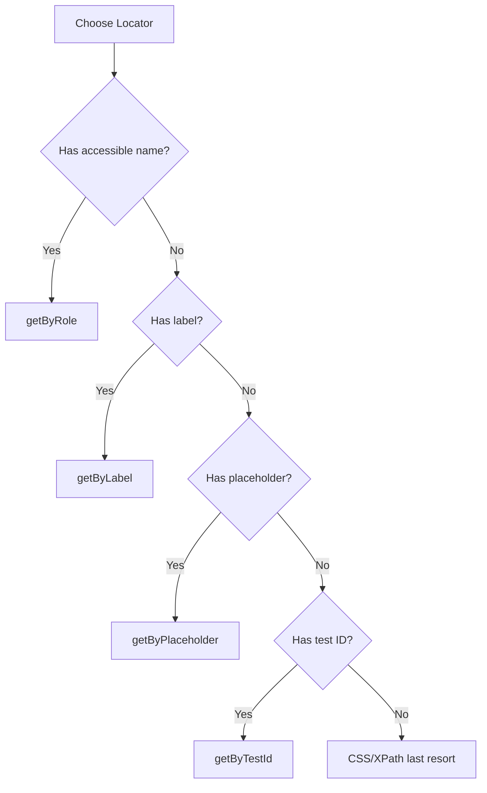

# How to Write E2E Tests with Playwright

Author: [nawazdhandala](https://www.github.com/nawazdhandala)

Tags: Playwright, Testing, E2E, Automation, JavaScript

Description: Learn how to write reliable end-to-end tests with Playwright, covering installation, selectors, assertions, and best practices for testing modern web applications.

---

End-to-end tests verify your application works correctly from a user's perspective. Playwright, developed by Microsoft, has become the go-to choice for E2E testing due to its speed, reliability, and cross-browser support. This guide walks you through writing effective Playwright tests.

## Why Playwright?

| Feature | Benefit |
|---------|---------|
| **Auto-wait** | No manual waits needed |
| **Cross-browser** | Chrome, Firefox, Safari |
| **Parallel execution** | Fast test runs |
| **Trace viewer** | Debug failed tests easily |
| **Network interception** | Mock API responses |
| **Mobile emulation** | Test responsive designs |

## Installation and Setup

Start by installing Playwright in your project:

```bash
npm init playwright@latest
```

This command creates the necessary configuration files and installs browser binaries. The setup wizard will ask you a few questions about your project structure.

Here is the generated configuration file with explanations for each option:

```javascript
// playwright.config.js
const { defineConfig, devices } = require('@playwright/test');

module.exports = defineConfig({
  // Directory containing test files
  testDir: './tests',

  // Run tests in parallel for faster execution
  fullyParallel: true,

  // Fail the build if test.only is left in code (prevents accidental CI skips)
  forbidOnly: !!process.env.CI,

  // Retry failed tests twice in CI to handle flaky tests
  retries: process.env.CI ? 2 : 0,

  // Number of parallel workers, reduce in CI to avoid resource contention
  workers: process.env.CI ? 1 : undefined,

  // Reporter configuration - HTML report for local, line reporter for CI
  reporter: 'html',

  // Shared settings for all projects
  use: {
    // Base URL for relative navigation
    baseURL: 'http://localhost:3000',

    // Capture trace on first retry for debugging
    trace: 'on-first-retry',

    // Take screenshot on failure
    screenshot: 'only-on-failure',
  },

  // Configure projects for different browsers
  projects: [
    {
      name: 'chromium',
      use: { ...devices['Desktop Chrome'] },
    },
    {
      name: 'firefox',
      use: { ...devices['Desktop Firefox'] },
    },
    {
      name: 'webkit',
      use: { ...devices['Desktop Safari'] },
    },
  ],
});
```

## Your First Test

Playwright tests are straightforward to write. Each test gets a fresh browser context, ensuring isolation between tests.

```javascript
// tests/homepage.spec.js
const { test, expect } = require('@playwright/test');

// Describe block groups related tests together
test.describe('Homepage', () => {
  // Each test function receives page and other fixtures
  test('should display welcome message', async ({ page }) => {
    // Navigate to the homepage
    await page.goto('/');

    // Assert that the heading contains expected text
    // Playwright auto-waits for the element to be visible
    await expect(page.getByRole('heading', { name: 'Welcome' })).toBeVisible();
  });

  test('should navigate to about page', async ({ page }) => {
    await page.goto('/');

    // Click a link and wait for navigation
    await page.getByRole('link', { name: 'About' }).click();

    // Verify we landed on the correct page
    await expect(page).toHaveURL('/about');
    await expect(page.getByRole('heading', { name: 'About Us' })).toBeVisible();
  });
});
```

## Locator Strategies

Playwright provides multiple ways to locate elements. Use the most resilient strategy for your use case to avoid flaky tests.



Here are examples of each locator strategy with explanations:

```javascript
// tests/locators.spec.js
const { test, expect } = require('@playwright/test');

test('locator strategies', async ({ page }) => {
  await page.goto('/form');

  // RECOMMENDED: Role-based selectors (most resilient to changes)
  // These match how users and assistive technology interact with elements
  await page.getByRole('button', { name: 'Submit' }).click();
  await page.getByRole('textbox', { name: 'Email' }).fill('test@example.com');
  await page.getByRole('checkbox', { name: 'Remember me' }).check();

  // Label-based selectors (great for forms)
  // Matches the <label> element's text
  await page.getByLabel('Password').fill('secret123');

  // Placeholder-based selectors
  // Useful when labels are visually hidden
  await page.getByPlaceholder('Search...').fill('playwright');

  // Text-based selectors
  // Matches visible text content
  await page.getByText('Welcome back').click();

  // Test ID selectors (explicitly added for testing)
  // Add data-testid attributes to elements you need to target
  await page.getByTestId('submit-button').click();

  // CSS selectors (use sparingly, fragile to style changes)
  await page.locator('.error-message').isVisible();

  // Combining locators for precision
  // Find a button inside a specific section
  await page
    .locator('section')
    .filter({ hasText: 'Payment' })
    .getByRole('button', { name: 'Pay Now' })
    .click();
});
```

## Form Testing

Testing forms is one of the most common E2E scenarios. Here is a complete example covering input, validation, and submission:

```javascript
// tests/login.spec.js
const { test, expect } = require('@playwright/test');

test.describe('Login Form', () => {
  // Run before each test in this describe block
  test.beforeEach(async ({ page }) => {
    await page.goto('/login');
  });

  test('should login successfully with valid credentials', async ({ page }) => {
    // Fill in the login form
    await page.getByLabel('Email').fill('user@example.com');
    await page.getByLabel('Password').fill('correctpassword');

    // Submit the form
    await page.getByRole('button', { name: 'Sign In' }).click();

    // Verify successful login by checking redirect and welcome message
    await expect(page).toHaveURL('/dashboard');
    await expect(page.getByText('Welcome, User')).toBeVisible();
  });

  test('should show error for invalid credentials', async ({ page }) => {
    await page.getByLabel('Email').fill('user@example.com');
    await page.getByLabel('Password').fill('wrongpassword');

    await page.getByRole('button', { name: 'Sign In' }).click();

    // Check error message appears and we stay on login page
    await expect(page.getByRole('alert')).toContainText('Invalid credentials');
    await expect(page).toHaveURL('/login');
  });

  test('should validate required fields', async ({ page }) => {
    // Try to submit empty form
    await page.getByRole('button', { name: 'Sign In' }).click();

    // Check validation messages for both fields
    await expect(page.getByText('Email is required')).toBeVisible();
    await expect(page.getByText('Password is required')).toBeVisible();
  });

  test('should validate email format', async ({ page }) => {
    await page.getByLabel('Email').fill('not-an-email');
    await page.getByLabel('Password').fill('somepassword');

    await page.getByRole('button', { name: 'Sign In' }).click();

    await expect(page.getByText('Please enter a valid email')).toBeVisible();
  });
});
```

## API Mocking

Playwright can intercept network requests to mock API responses. This is useful for testing edge cases and error states without needing a backend.

```javascript
// tests/api-mocking.spec.js
const { test, expect } = require('@playwright/test');

test('should display user data from API', async ({ page }) => {
  // Intercept API calls before navigating
  // This mock will respond to any request matching the URL pattern
  await page.route('**/api/users/me', async (route) => {
    await route.fulfill({
      status: 200,
      contentType: 'application/json',
      body: JSON.stringify({
        id: 1,
        name: 'Test User',
        email: 'test@example.com',
      }),
    });
  });

  await page.goto('/profile');

  // Verify the mocked data is displayed
  await expect(page.getByText('Test User')).toBeVisible();
  await expect(page.getByText('test@example.com')).toBeVisible();
});

test('should handle API errors gracefully', async ({ page }) => {
  // Mock a server error response
  await page.route('**/api/users/me', async (route) => {
    await route.fulfill({
      status: 500,
      contentType: 'application/json',
      body: JSON.stringify({ error: 'Internal server error' }),
    });
  });

  await page.goto('/profile');

  // Verify error UI is shown
  await expect(page.getByText('Something went wrong')).toBeVisible();
  await expect(page.getByRole('button', { name: 'Retry' })).toBeVisible();
});

test('should handle slow API responses', async ({ page }) => {
  // Simulate a slow network
  await page.route('**/api/users/me', async (route) => {
    // Delay response by 3 seconds
    await new Promise((resolve) => setTimeout(resolve, 3000));
    await route.fulfill({
      status: 200,
      contentType: 'application/json',
      body: JSON.stringify({ id: 1, name: 'Test User' }),
    });
  });

  await page.goto('/profile');

  // Verify loading state is shown
  await expect(page.getByText('Loading...')).toBeVisible();

  // Wait for data to appear after delay
  await expect(page.getByText('Test User')).toBeVisible({ timeout: 5000 });
});
```

## Page Object Model

The Page Object Model (POM) pattern improves test maintainability by encapsulating page interactions in reusable classes. When the UI changes, you only update the page object.

```javascript
// pages/login-page.js
class LoginPage {
  constructor(page) {
    this.page = page;
    // Define locators as properties for reuse
    this.emailInput = page.getByLabel('Email');
    this.passwordInput = page.getByLabel('Password');
    this.submitButton = page.getByRole('button', { name: 'Sign In' });
    this.errorAlert = page.getByRole('alert');
  }

  // Navigate to the login page
  async goto() {
    await this.page.goto('/login');
  }

  // Perform login action
  async login(email, password) {
    await this.emailInput.fill(email);
    await this.passwordInput.fill(password);
    await this.submitButton.click();
  }

  // Get error message text
  async getErrorMessage() {
    return await this.errorAlert.textContent();
  }
}

module.exports = { LoginPage };
```

```javascript
// pages/dashboard-page.js
class DashboardPage {
  constructor(page) {
    this.page = page;
    this.welcomeMessage = page.getByTestId('welcome-message');
    this.logoutButton = page.getByRole('button', { name: 'Logout' });
  }

  async logout() {
    await this.logoutButton.click();
  }

  async getWelcomeText() {
    return await this.welcomeMessage.textContent();
  }
}

module.exports = { DashboardPage };
```

Here is how to use page objects in your tests:

```javascript
// tests/login-pom.spec.js
const { test, expect } = require('@playwright/test');
const { LoginPage } = require('../pages/login-page');
const { DashboardPage } = require('../pages/dashboard-page');

test.describe('Login with Page Objects', () => {
  test('should login and see dashboard', async ({ page }) => {
    // Initialize page objects
    const loginPage = new LoginPage(page);
    const dashboardPage = new DashboardPage(page);

    // Use page object methods instead of raw locators
    await loginPage.goto();
    await loginPage.login('user@example.com', 'password123');

    // Verify dashboard loads
    await expect(page).toHaveURL('/dashboard');
    const welcomeText = await dashboardPage.getWelcomeText();
    expect(welcomeText).toContain('Welcome');
  });
});
```

## Authentication State

Re-authenticating in every test is slow. Playwright allows you to save and reuse authentication state across tests.

```javascript
// tests/auth.setup.js
const { test: setup } = require('@playwright/test');

// This runs once before all tests that depend on it
setup('authenticate', async ({ page }) => {
  await page.goto('/login');
  await page.getByLabel('Email').fill('admin@example.com');
  await page.getByLabel('Password').fill('adminpassword');
  await page.getByRole('button', { name: 'Sign In' }).click();

  // Wait for authentication to complete
  await page.waitForURL('/dashboard');

  // Save the authenticated state to a file
  // This includes cookies and localStorage
  await page.context().storageState({ path: './playwright/.auth/user.json' });
});
```

Configure your project to use the saved authentication state:

```javascript
// playwright.config.js additions
module.exports = defineConfig({
  projects: [
    // Setup project runs first to create auth state
    { name: 'setup', testMatch: /.*\.setup\.js/ },

    {
      name: 'chromium',
      use: {
        ...devices['Desktop Chrome'],
        // Use saved auth state for all tests in this project
        storageState: './playwright/.auth/user.json',
      },
      // Run setup before this project
      dependencies: ['setup'],
    },
  ],
});
```

## Visual Testing

Playwright supports screenshot comparison to catch visual regressions. This is useful for ensuring UI changes do not break existing layouts.

```javascript
// tests/visual.spec.js
const { test, expect } = require('@playwright/test');

test('homepage visual regression', async ({ page }) => {
  await page.goto('/');

  // Take a full page screenshot and compare with baseline
  // First run creates the baseline, subsequent runs compare against it
  await expect(page).toHaveScreenshot('homepage.png', {
    fullPage: true,
    // Allow 0.5% pixel difference to account for anti-aliasing
    maxDiffPixelRatio: 0.005,
  });
});

test('component visual regression', async ({ page }) => {
  await page.goto('/components');

  // Screenshot a specific element instead of full page
  const card = page.getByTestId('product-card');
  await expect(card).toHaveScreenshot('product-card.png');
});

test('responsive visual testing', async ({ page }) => {
  // Test mobile viewport
  await page.setViewportSize({ width: 375, height: 667 });
  await page.goto('/');

  await expect(page).toHaveScreenshot('homepage-mobile.png', {
    fullPage: true,
  });
});
```

## Test Fixtures

Fixtures let you share setup and teardown logic across tests. Create custom fixtures for common scenarios like authenticated users or test data.

```javascript
// tests/fixtures.js
const { test: base, expect } = require('@playwright/test');

// Extend the base test with custom fixtures
const test = base.extend({
  // Custom fixture for an authenticated admin user
  authenticatedPage: async ({ page }, use) => {
    // Setup: Login as admin
    await page.goto('/login');
    await page.getByLabel('Email').fill('admin@example.com');
    await page.getByLabel('Password').fill('adminpassword');
    await page.getByRole('button', { name: 'Sign In' }).click();
    await page.waitForURL('/dashboard');

    // Provide the authenticated page to the test
    await use(page);

    // Teardown: Logout after test completes
    await page.goto('/logout');
  },

  // Custom fixture for seeding test data
  testUser: async ({ request }, use) => {
    // Setup: Create a test user via API
    const response = await request.post('/api/users', {
      data: {
        email: `test-${Date.now()}@example.com`,
        password: 'testpassword',
      },
    });
    const user = await response.json();

    // Provide user data to the test
    await use(user);

    // Teardown: Delete the test user
    await request.delete(`/api/users/${user.id}`);
  },
});

module.exports = { test, expect };
```

Using custom fixtures in tests:

```javascript
// tests/admin.spec.js
const { test, expect } = require('./fixtures');

test('admin can access settings', async ({ authenticatedPage }) => {
  // Page is already authenticated as admin
  await authenticatedPage.goto('/admin/settings');
  await expect(authenticatedPage.getByRole('heading', { name: 'Settings' })).toBeVisible();
});

test('can update user profile', async ({ authenticatedPage, testUser }) => {
  // testUser contains the created user data
  await authenticatedPage.goto(`/users/${testUser.id}`);
  await expect(authenticatedPage.getByText(testUser.email)).toBeVisible();
});
```

## Running Tests

Playwright provides various ways to run your tests:

```bash
# Run all tests
npx playwright test

# Run tests in headed mode (see the browser)
npx playwright test --headed

# Run specific test file
npx playwright test tests/login.spec.js

# Run tests matching a pattern
npx playwright test -g "login"

# Run tests on specific browser
npx playwright test --project=chromium

# Run tests in debug mode with inspector
npx playwright test --debug

# Update snapshots for visual tests
npx playwright test --update-snapshots

# Show HTML report of last run
npx playwright show-report
```

## Debugging Failed Tests

Playwright provides excellent debugging tools. Use the trace viewer to see exactly what happened during a failed test.

```javascript
// playwright.config.js - Enable tracing
module.exports = defineConfig({
  use: {
    // Capture trace on first retry
    trace: 'on-first-retry',
    // Capture video on failure
    video: 'on-first-retry',
  },
});
```

The trace viewer shows a timeline of actions, screenshots, network requests, and console logs. Open it with:

```bash
npx playwright show-trace trace.zip
```

For interactive debugging during test development:

```javascript
// Add this to pause execution and open inspector
test('debug example', async ({ page }) => {
  await page.goto('/');

  // Pause here - opens Playwright Inspector
  await page.pause();

  // Continue with test...
});
```

## CI/CD Integration

Playwright works well in CI environments. Here is a GitHub Actions workflow example:

```yaml
# .github/workflows/playwright.yml
name: Playwright Tests
on:
  push:
    branches: [main]
  pull_request:
    branches: [main]
jobs:
  test:
    timeout-minutes: 60
    runs-on: ubuntu-latest
    steps:
      - uses: actions/checkout@v4

      - uses: actions/setup-node@v4
        with:
          node-version: 20

      - name: Install dependencies
        run: npm ci

      - name: Install Playwright Browsers
        run: npx playwright install --with-deps

      - name: Run Playwright tests
        run: npx playwright test

      - uses: actions/upload-artifact@v4
        if: always()
        with:
          name: playwright-report
          path: playwright-report/
          retention-days: 30
```

## Best Practices

| Practice | Reason |
|----------|--------|
| **Use role-based selectors** | Resilient to UI changes |
| **Avoid hardcoded waits** | Use auto-wait instead |
| **Isolate tests** | Each test should be independent |
| **Use page objects** | Maintainable test code |
| **Mock external APIs** | Reliable and fast tests |
| **Run in CI** | Catch regressions early |
| **Use test IDs sparingly** | Only when needed |
| **Keep tests focused** | One scenario per test |

## Common Pitfalls

Avoid these common mistakes when writing Playwright tests:

```javascript
// BAD: Hardcoded waits
await page.waitForTimeout(5000); // Never do this

// GOOD: Wait for specific condition
await page.waitForSelector('.loaded');
await expect(page.getByText('Ready')).toBeVisible();

// BAD: Brittle CSS selectors
await page.locator('div > div:nth-child(2) > button').click();

// GOOD: Semantic selectors
await page.getByRole('button', { name: 'Submit' }).click();

// BAD: Tests that depend on each other
test('create user', async ({ page }) => { /* creates user */ });
test('edit user', async ({ page }) => { /* assumes user exists */ });

// GOOD: Independent tests with proper setup
test('edit user', async ({ page }) => {
  // Create user in beforeEach or use fixture
  await createTestUser();
  // Then edit
});
```

## Summary

Playwright provides a powerful, modern approach to E2E testing:

| Feature | Purpose |
|---------|---------|
| **Auto-wait** | Eliminate flaky timeouts |
| **Locators** | Resilient element selection |
| **API mocking** | Test edge cases |
| **Page objects** | Maintainable code |
| **Fixtures** | Reusable setup/teardown |
| **Tracing** | Debug failures |
| **Visual testing** | Catch UI regressions |

Start with simple tests and gradually adopt more advanced patterns as your test suite grows. The key is writing tests that are reliable, maintainable, and provide confidence that your application works correctly.

---

*Looking for a reliable way to monitor your web applications in production? [OneUptime](https://oneuptime.com) provides comprehensive monitoring, alerting, and incident management to ensure your E2E-tested application stays healthy after deployment.*
