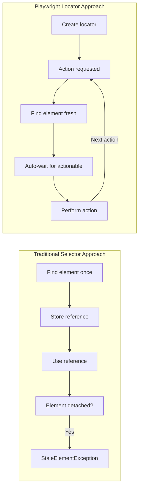
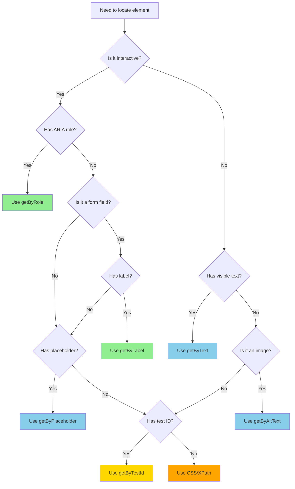

# How to Use Playwright Locators

Author: [nawazdhandala](https://github.com/nawazdhandala)

Tags: Playwright, Testing, E2E, Locators, Test Automation, Web Testing

Description: A comprehensive guide to using Playwright locators for reliable end-to-end testing. Learn about built-in locators, filtering strategies, chaining, best practices, and how to handle dynamic content.

---

Playwright locators are the foundation of reliable end-to-end testing. They represent a way to find elements on a page at any moment, automatically waiting for elements to become actionable before performing operations. Unlike traditional element selectors that find elements once and hold a reference, locators are evaluated fresh every time they are used. This makes them resilient to DOM changes and eliminates an entire category of flaky test failures.

## Understanding Locators vs Selectors

Before diving into locator types, it is important to understand the difference between locators and traditional selectors.



Traditional selectors in tools like Selenium find an element once and store a reference to that DOM node. If the page re-renders or the element is removed and re-added, that reference becomes stale, causing test failures. Playwright locators work differently. They store the query itself, not the result. Every time you interact with a locator, Playwright finds the element fresh and waits for it to be ready.

## Built-in Locators

Playwright provides several built-in locators that are designed to be resilient and user-centric. These locators match how users actually find elements on a page.

### getByRole - The Preferred Choice

The `getByRole` locator queries elements by their ARIA role and accessible name. This is the most recommended approach because it mirrors how assistive technologies and users perceive the page.

```typescript
// Find a button with the text "Submit"
// This matches <button>Submit</button> or <input type="submit" value="Submit">
const submitButton = page.getByRole('button', { name: 'Submit' });

// Find a link with partial text match
// This matches <a href="/docs">View Documentation</a>
const docsLink = page.getByRole('link', { name: /documentation/i });

// Find a checkbox with a label
// This matches <input type="checkbox" id="terms"> with <label for="terms">Accept terms</label>
const termsCheckbox = page.getByRole('checkbox', { name: 'Accept terms' });

// Find a heading at a specific level
// This matches <h2>Welcome Back</h2>
const heading = page.getByRole('heading', { name: 'Welcome Back', level: 2 });

// Find a textbox (input or textarea)
// This matches <input type="text"> or <textarea>
const searchInput = page.getByRole('textbox', { name: 'Search' });

// Find a navigation region
// This matches <nav aria-label="Main navigation">
const mainNav = page.getByRole('navigation', { name: 'Main navigation' });
```

Common ARIA roles you will use frequently:

| Role | Matches |
|------|---------|
| `button` | `<button>`, `<input type="button/submit/reset">`, elements with `role="button"` |
| `link` | `<a href="...">`, elements with `role="link"` |
| `textbox` | `<input type="text/email/password/...">`, `<textarea>` |
| `checkbox` | `<input type="checkbox">` |
| `radio` | `<input type="radio">` |
| `combobox` | `<select>`, autocomplete inputs |
| `heading` | `<h1>` through `<h6>` |
| `list` | `<ul>`, `<ol>` |
| `listitem` | `<li>` |
| `table` | `<table>` |
| `row` | `<tr>` |
| `cell` | `<td>`, `<th>` |

### getByLabel - Form Elements Made Easy

The `getByLabel` locator finds form elements by their associated label text. This is the natural way users identify form fields.

```typescript
// Find input by its label
// Matches: <label>Email address<input type="email"></label>
// Or: <label for="email">Email address</label><input id="email" type="email">
const emailInput = page.getByLabel('Email address');

// Using regex for flexible matching
// Matches labels containing "password" (case-insensitive)
const passwordInput = page.getByLabel(/password/i);

// Find input with exact label match
// This prevents matching "Email address (required)" when you want "Email address"
const exactEmailInput = page.getByLabel('Email address', { exact: true });
```

### getByPlaceholder - Placeholder Text

When form elements lack proper labels, you can fall back to placeholder text.

```typescript
// Find input by placeholder
// Matches: <input placeholder="Enter your email">
const emailField = page.getByPlaceholder('Enter your email');

// Regex matching for flexibility
const searchField = page.getByPlaceholder(/search/i);
```

### getByText - Visible Text Content

The `getByText` locator finds elements by their text content. This is useful for finding non-interactive elements or when other locators do not apply.

```typescript
// Find element containing specific text
// Matches: <span>Welcome to the dashboard</span>
const welcomeMessage = page.getByText('Welcome to the dashboard');

// Partial text matching (default behavior)
// Matches: <p>Your order has been confirmed</p>
const confirmationText = page.getByText('order has been');

// Exact text matching
// Only matches if the text is exactly "Error"
const errorText = page.getByText('Error', { exact: true });

// Regex for complex patterns
// Matches: <span>Order #12345 confirmed</span>
const orderConfirmation = page.getByText(/Order #\d+ confirmed/);
```

### getByAltText - Images and Areas

The `getByAltText` locator finds images by their alt attribute.

```typescript
// Find image by alt text
// Matches: 
const logo = page.getByAltText('Company Logo');

// Find area element in image map
// Matches: <area alt="Sales Region" href="/sales">
const salesRegion = page.getByAltText('Sales Region');
```

### getByTitle - Title Attribute

The `getByTitle` locator finds elements by their title attribute.

```typescript
// Find element by title
// Matches: <span title="Close dialog">X</span>
const closeButton = page.getByTitle('Close dialog');

// Matches SVG with title
// Matches: <svg><title>Settings icon</title>...</svg>
const settingsIcon = page.getByTitle('Settings icon');
```

### getByTestId - Test-Specific Attributes

When semantic locators are not available, use test IDs as a last resort.

```typescript
// Find element by data-testid
// Matches: <div data-testid="user-profile">
const userProfile = page.getByTestId('user-profile');
```

You can customize the test ID attribute in your Playwright configuration.

```typescript
// playwright.config.ts
import { defineConfig } from '@playwright/test';

export default defineConfig({
  use: {
    // Use data-qa instead of data-testid
    testIdAttribute: 'data-qa',
  },
});
```

## CSS and XPath Locators

While built-in locators are preferred, CSS and XPath selectors are available when needed.

```typescript
// CSS selector
// Useful for complex styling-based selection
const sidebar = page.locator('.sidebar-container');
const submitBtn = page.locator('button[type="submit"]');
const firstItem = page.locator('ul.items > li:first-child');

// XPath selector (prefix with xpath=)
// Useful for text-based selection and traversing up the DOM
const cellWithValue = page.locator('xpath=//td[text()="Active"]');
const parentDiv = page.locator('xpath=//span[@class="label"]/parent::div');
```

## Locator Priority Decision Tree

Use this decision tree to choose the right locator type.



## Filtering Locators

Locators can be filtered to narrow down matches when multiple elements match your initial query.

### Filter by Text

Filter elements by their text content.

```typescript
// Find all list items, then filter by text
// Matches the <li> containing "Electronics"
const electronicsCat = page.getByRole('listitem').filter({ hasText: 'Electronics' });

// Filter with regex
// Matches list items containing any price
const pricedItems = page.getByRole('listitem').filter({ hasText: /\$\d+\.\d{2}/ });

// Exclude items with certain text using regex negation
// Note: Use .not() for exclusion instead
```

### Filter by Child Locator

Filter parent elements based on their children.

```typescript
// Find table rows that contain a specific button
// This is useful for data tables where you need to find a row by its content
const rowWithEditButton = page
  .getByRole('row')
  .filter({ has: page.getByRole('button', { name: 'Edit' }) });

// Find cards that contain a specific heading
// Matches <div class="card"> containing <h3>Featured Product</h3>
const featuredCard = page
  .locator('.card')
  .filter({ has: page.getByRole('heading', { name: 'Featured Product' }) });

// Combine multiple filters
// Find rows with both an "Active" status and a "Delete" button
const activeRowWithDelete = page
  .getByRole('row')
  .filter({ hasText: 'Active' })
  .filter({ has: page.getByRole('button', { name: 'Delete' }) });
```

### Filter by Not Having

Use `.filter({ hasNot: ... })` to exclude elements.

```typescript
// Find all rows that do NOT have a disabled button
const enabledRows = page
  .getByRole('row')
  .filter({ hasNot: page.locator('button[disabled]') });

// Find items without "Out of Stock" text
const inStockItems = page
  .getByRole('listitem')
  .filter({ hasNotText: 'Out of Stock' });
```

## Chaining Locators

Locators can be chained to navigate through the DOM hierarchy.

```typescript
// Start from a container and find elements within it
// First find the sidebar, then find links inside it
const sidebarLinks = page
  .locator('.sidebar')
  .getByRole('link');

// Chain multiple levels deep
// Find the navigation, then the menu, then specific items
const menuItem = page
  .getByRole('navigation')
  .locator('.dropdown-menu')
  .getByRole('menuitem', { name: 'Settings' });

// Combine with filtering for precision
// Find the user table, filter to a specific row, then find the edit button
const editUserButton = page
  .getByRole('table', { name: 'Users' })
  .getByRole('row')
  .filter({ hasText: 'john@example.com' })
  .getByRole('button', { name: 'Edit' });
```

## Working with Lists and Tables

Playwright provides powerful methods for working with repeated elements.

### Counting Elements

Count matching elements to verify list length.

```typescript
// Count all list items
const itemCount = await page.getByRole('listitem').count();
expect(itemCount).toBe(10);

// Count visible items only
const visibleCount = await page.getByRole('listitem').filter({ visible: true }).count();
```

### Iterating Over Elements

Process each element in a collection.

```typescript
// Get all items and iterate
const items = page.getByRole('listitem');
const allItems = await items.all();

for (const item of allItems) {
  const text = await item.textContent();
  console.log(text);
}

// Collect all text content
const allTexts = await items.allTextContents();
console.log(allTexts); // ['Item 1', 'Item 2', 'Item 3']

// Get inner text of all items
const allInnerTexts = await items.allInnerTexts();
```

### Selecting by Index

Access elements by their position in the list.

```typescript
// Get the first item (0-indexed)
const firstItem = page.getByRole('listitem').first();

// Get the last item
const lastItem = page.getByRole('listitem').last();

// Get item at specific index
const thirdItem = page.getByRole('listitem').nth(2);

// Negative index counts from the end
// -1 is last, -2 is second to last
const secondToLast = page.getByRole('listitem').nth(-2);
```

### Working with Tables

Tables require combining multiple locator techniques.

```typescript
// tests/table-operations.spec.ts
import { test, expect } from '@playwright/test';

test('interact with data table', async ({ page }) => {
  await page.goto('/users');

  // Get the users table
  const table = page.getByRole('table', { name: 'Users' });

  // Verify header columns
  const headers = table.getByRole('columnheader');
  await expect(headers).toHaveText(['Name', 'Email', 'Role', 'Actions']);

  // Find a specific row by content
  const johnRow = table
    .getByRole('row')
    .filter({ hasText: 'john@example.com' });

  // Click edit button in that row
  await johnRow.getByRole('button', { name: 'Edit' }).click();

  // Verify cell content in specific position
  const thirdRowSecondCell = table
    .getByRole('row')
    .nth(3)
    .getByRole('cell')
    .nth(1);

  await expect(thirdRowSecondCell).toHaveText('jane@example.com');
});
```

## Handling Dynamic Content

Modern web applications frequently update the DOM. Locators handle this gracefully with built-in waiting mechanisms.

### Auto-Waiting

Playwright automatically waits for elements to be actionable before performing operations.

```typescript
// tests/dynamic-content.spec.ts
import { test, expect } from '@playwright/test';

test('handles dynamically loaded content', async ({ page }) => {
  await page.goto('/dashboard');

  // Click a button that triggers async data loading
  // Playwright waits for the button to be visible and clickable
  await page.getByRole('button', { name: 'Load Data' }).click();

  // Wait for data to appear - Playwright retries until timeout
  // No explicit wait needed, the assertion handles it
  await expect(page.getByRole('table')).toBeVisible();

  // Verify content that loads asynchronously
  await expect(page.getByText('Loading complete')).toBeVisible();
});
```

### Waiting for Specific States

Sometimes you need to wait for specific element states.

```typescript
// Wait for element to be attached to DOM (may be invisible)
await page.getByTestId('modal').waitFor({ state: 'attached' });

// Wait for element to be visible
await page.getByRole('dialog').waitFor({ state: 'visible' });

// Wait for element to be hidden
await page.getByRole('progressbar').waitFor({ state: 'hidden' });

// Wait for element to be detached from DOM
await page.getByTestId('loading-spinner').waitFor({ state: 'detached' });

// Custom timeout for slow operations
await page.getByText('Report generated').waitFor({
  state: 'visible',
  timeout: 30000 // 30 seconds
});
```

### Handling Loading States

Build robust tests that handle loading indicators.

```typescript
// tests/loading-states.spec.ts
import { test, expect } from '@playwright/test';

test('waits for loading to complete before asserting', async ({ page }) => {
  await page.goto('/products');

  // Wait for loading indicator to disappear
  await page.getByRole('progressbar').waitFor({ state: 'hidden' });

  // Now safe to assert on loaded content
  const products = page.getByRole('article');
  await expect(products).toHaveCount(20);

  // Alternative: wait for specific content to appear
  await expect(page.getByText('Showing 20 products')).toBeVisible();
});
```

## Frame Locators

For elements inside iframes, use frame locators.

```typescript
// tests/iframe-content.spec.ts
import { test, expect } from '@playwright/test';

test('interact with iframe content', async ({ page }) => {
  await page.goto('/embedded-form');

  // Locate the iframe and get a FrameLocator
  const frame = page.frameLocator('#payment-iframe');

  // Use standard locators within the frame
  await frame.getByLabel('Card number').fill('4242424242424242');
  await frame.getByLabel('Expiry').fill('12/28');
  await frame.getByLabel('CVC').fill('123');
  await frame.getByRole('button', { name: 'Pay' }).click();

  // Multiple nested iframes
  const nestedFrame = page
    .frameLocator('#outer-frame')
    .frameLocator('#inner-frame');

  await nestedFrame.getByText('Success').waitFor();
});
```

## Shadow DOM

Playwright can pierce through shadow DOM boundaries automatically.

```typescript
// tests/shadow-dom.spec.ts
import { test, expect } from '@playwright/test';

test('interact with shadow DOM elements', async ({ page }) => {
  await page.goto('/web-components');

  // Playwright pierces shadow DOM by default
  // This works even if the button is inside a shadow root
  await page.getByRole('button', { name: 'Shadow Button' }).click();

  // For CSS selectors, use >> for shadow DOM piercing
  const shadowInput = page.locator('my-component >> input.inner-input');
  await shadowInput.fill('test value');

  // getByTestId also works through shadow DOM
  await page.getByTestId('shadow-element').click();
});
```

## Locator Assertions

Playwright provides rich assertions for locators.

```typescript
// tests/assertions.spec.ts
import { test, expect } from '@playwright/test';

test('locator assertions', async ({ page }) => {
  await page.goto('/dashboard');

  const button = page.getByRole('button', { name: 'Submit' });
  const input = page.getByLabel('Email');
  const message = page.getByTestId('status-message');

  // Visibility assertions
  await expect(button).toBeVisible();
  await expect(message).toBeHidden();

  // Enabled/disabled state
  await expect(button).toBeEnabled();
  await expect(input).toBeEditable();

  // Content assertions
  await expect(message).toHaveText('Ready');
  await expect(message).toContainText('Ready');
  await expect(input).toHaveValue('');
  await expect(input).toBeEmpty();

  // Attribute assertions
  await expect(button).toHaveAttribute('type', 'submit');
  await expect(input).toHaveAttribute('required');

  // CSS assertions
  await expect(button).toHaveClass(/primary/);
  await expect(message).toHaveCSS('color', 'rgb(0, 128, 0)');

  // Count assertions for lists
  const items = page.getByRole('listitem');
  await expect(items).toHaveCount(5);

  // Check/uncheck state
  const checkbox = page.getByRole('checkbox', { name: 'Subscribe' });
  await expect(checkbox).toBeChecked();
  await expect(checkbox).not.toBeChecked();

  // Focus state
  await input.focus();
  await expect(input).toBeFocused();
});
```

## Practical Examples

Let us look at complete examples that demonstrate locator usage in real-world scenarios.

### Login Form Test

A typical login flow using semantic locators.

```typescript
// tests/login.spec.ts
import { test, expect } from '@playwright/test';

test.describe('Login functionality', () => {
  test.beforeEach(async ({ page }) => {
    await page.goto('/login');
  });

  test('successful login with valid credentials', async ({ page }) => {
    // Fill the login form using label-based locators
    await page.getByLabel('Email').fill('user@example.com');
    await page.getByLabel('Password').fill('secretpassword');

    // Submit using role-based locator
    await page.getByRole('button', { name: 'Sign in' }).click();

    // Verify redirect to dashboard
    await expect(page).toHaveURL('/dashboard');

    // Verify welcome message appears
    await expect(page.getByRole('heading', { name: 'Welcome back' })).toBeVisible();
  });

  test('shows error for invalid credentials', async ({ page }) => {
    await page.getByLabel('Email').fill('wrong@example.com');
    await page.getByLabel('Password').fill('wrongpassword');
    await page.getByRole('button', { name: 'Sign in' }).click();

    // Verify error message using text locator
    await expect(page.getByText('Invalid email or password')).toBeVisible();

    // Verify we stay on login page
    await expect(page).toHaveURL('/login');
  });

  test('shows validation errors for empty fields', async ({ page }) => {
    // Submit empty form
    await page.getByRole('button', { name: 'Sign in' }).click();

    // Verify validation messages
    await expect(page.getByText('Email is required')).toBeVisible();
    await expect(page.getByText('Password is required')).toBeVisible();
  });
});
```

### E-Commerce Product Search

Search and filter products with multiple locator types.

```typescript
// tests/product-search.spec.ts
import { test, expect } from '@playwright/test';

test.describe('Product search', () => {
  test('search and filter products', async ({ page }) => {
    await page.goto('/products');

    // Search for a product
    const searchInput = page.getByPlaceholder('Search products...');
    await searchInput.fill('laptop');
    await searchInput.press('Enter');

    // Wait for results to load
    await expect(page.getByText(/\d+ results for "laptop"/)).toBeVisible();

    // Apply category filter
    await page.getByRole('button', { name: 'Categories' }).click();
    await page.getByRole('checkbox', { name: 'Electronics' }).check();
    await page.getByRole('button', { name: 'Apply filters' }).click();

    // Apply price range filter
    const minPrice = page.getByLabel('Minimum price');
    const maxPrice = page.getByLabel('Maximum price');
    await minPrice.fill('500');
    await maxPrice.fill('1500');
    await page.getByRole('button', { name: 'Apply' }).click();

    // Verify filtered results
    const products = page.getByRole('article');
    const count = await products.count();
    expect(count).toBeGreaterThan(0);

    // Verify first product is within price range
    const firstProductPrice = products.first().getByTestId('price');
    const priceText = await firstProductPrice.textContent();
    const price = parseFloat(priceText?.replace('$', '') || '0');
    expect(price).toBeGreaterThanOrEqual(500);
    expect(price).toBeLessThanOrEqual(1500);
  });

  test('add product to cart', async ({ page }) => {
    await page.goto('/products/laptop-pro-15');

    // Select options
    await page.getByRole('combobox', { name: 'Color' }).selectOption('Space Gray');
    await page.getByRole('combobox', { name: 'Storage' }).selectOption('512GB');

    // Add to cart
    await page.getByRole('button', { name: 'Add to cart' }).click();

    // Verify cart notification
    await expect(page.getByRole('alert')).toContainText('Added to cart');

    // Verify cart count updated
    const cartBadge = page.getByRole('navigation').getByTestId('cart-count');
    await expect(cartBadge).toHaveText('1');
  });
});
```

### Data Table Operations

Working with tables containing multiple rows and actions.

```typescript
// tests/user-management.spec.ts
import { test, expect } from '@playwright/test';

test.describe('User management table', () => {
  test.beforeEach(async ({ page }) => {
    await page.goto('/admin/users');
  });

  test('sort table by column', async ({ page }) => {
    // Click column header to sort
    await page.getByRole('columnheader', { name: 'Name' }).click();

    // Verify sort indicator
    await expect(
      page.getByRole('columnheader', { name: 'Name' })
    ).toHaveAttribute('aria-sort', 'ascending');

    // Get first row name
    const firstRowName = page
      .getByRole('row')
      .nth(1) // Skip header row
      .getByRole('cell')
      .first();

    // Verify alphabetical order (first name should start with 'A')
    await expect(firstRowName).toHaveText(/^A/);
  });

  test('edit user via table row action', async ({ page }) => {
    // Find the row for a specific user
    const userRow = page
      .getByRole('row')
      .filter({ hasText: 'john@example.com' });

    // Click the edit button in that row
    await userRow.getByRole('button', { name: 'Edit' }).click();

    // Verify edit modal opens
    await expect(page.getByRole('dialog', { name: 'Edit User' })).toBeVisible();

    // Modify user data
    await page.getByLabel('Full name').clear();
    await page.getByLabel('Full name').fill('John Updated');

    // Save changes
    await page.getByRole('button', { name: 'Save changes' }).click();

    // Verify success message
    await expect(page.getByRole('alert')).toContainText('User updated successfully');

    // Verify table reflects changes
    await expect(userRow).toContainText('John Updated');
  });

  test('bulk delete users', async ({ page }) => {
    // Select multiple rows
    const rows = page.getByRole('row').filter({ has: page.getByRole('checkbox') });

    // Select first three users (skip header)
    for (let i = 1; i <= 3; i++) {
      await rows.nth(i).getByRole('checkbox').check();
    }

    // Verify selection count
    await expect(page.getByText('3 users selected')).toBeVisible();

    // Click bulk delete
    await page.getByRole('button', { name: 'Delete selected' }).click();

    // Confirm in dialog
    await page.getByRole('dialog').getByRole('button', { name: 'Delete' }).click();

    // Verify success
    await expect(page.getByRole('alert')).toContainText('3 users deleted');
  });
});
```

## Best Practices

Follow these guidelines to write maintainable and reliable locators.

### Prefer User-Facing Attributes

```typescript
// Good: Uses role and accessible name
await page.getByRole('button', { name: 'Submit' }).click();

// Good: Uses label association
await page.getByLabel('Email address').fill('test@example.com');

// Avoid: Uses CSS class (can change with styling updates)
await page.locator('.btn-primary-submit').click();

// Avoid: Uses implementation detail
await page.locator('[data-component-id="abc123"]').click();
```

### Use Descriptive Test IDs as Last Resort

When semantic locators are not possible, use descriptive test IDs.

```typescript
// HTML
// <div data-testid="user-profile-card">
//   <span data-testid="user-name">John Doe</span>
// </div>

// Good: Descriptive test ID when no better option exists
await page.getByTestId('user-profile-card').click();

// Avoid: Generic or numbered test IDs
await page.getByTestId('div-1').click();
await page.getByTestId('card').click();
```

### Build Reusable Locators with Page Objects

Encapsulate locators in page object classes for reusability.

```typescript
// pages/LoginPage.ts
import { Page, Locator } from '@playwright/test';

export class LoginPage {
  readonly page: Page;
  readonly emailInput: Locator;
  readonly passwordInput: Locator;
  readonly submitButton: Locator;
  readonly errorMessage: Locator;

  constructor(page: Page) {
    this.page = page;
    // Define locators once, reuse everywhere
    this.emailInput = page.getByLabel('Email');
    this.passwordInput = page.getByLabel('Password');
    this.submitButton = page.getByRole('button', { name: 'Sign in' });
    this.errorMessage = page.getByRole('alert');
  }

  async goto() {
    await this.page.goto('/login');
  }

  async login(email: string, password: string) {
    await this.emailInput.fill(email);
    await this.passwordInput.fill(password);
    await this.submitButton.click();
  }
}

// tests/login.spec.ts
import { test, expect } from '@playwright/test';
import { LoginPage } from '../pages/LoginPage';

test('login with page object', async ({ page }) => {
  const loginPage = new LoginPage(page);
  await loginPage.goto();
  await loginPage.login('user@example.com', 'password');
  await expect(page).toHaveURL('/dashboard');
});
```

### Avoid Brittle Locators

```typescript
// Brittle: Depends on DOM structure
await page.locator('div > div > div > button').click();

// Brittle: Depends on index that may change
await page.locator('button').nth(3).click();

// Resilient: Uses semantic meaning
await page.getByRole('button', { name: 'Save changes' }).click();

// Resilient: Uses stable identifier
await page.getByTestId('save-button').click();
```

### Handle Dynamic Content Properly

```typescript
// Good: Wait for content to be ready
await page.getByRole('table').waitFor();
const rows = await page.getByRole('row').count();

// Good: Use assertions that auto-retry
await expect(page.getByRole('listitem')).toHaveCount(10);

// Avoid: Arbitrary delays
await page.waitForTimeout(2000); // Never do this
const items = await page.getByRole('listitem').count();
```

## Debugging Locators

When locators do not work as expected, use these debugging techniques.

### Using the Playwright Inspector

```bash
# Run tests in debug mode
npx playwright test --debug

# Or use PWDEBUG environment variable
PWDEBUG=1 npx playwright test
```

### Highlighting Locators

```typescript
// Highlight a locator to verify it matches correctly
await page.getByRole('button', { name: 'Submit' }).highlight();

// Pause for manual inspection
await page.pause();
```

### Evaluating Locators in Console

```typescript
// Log matched elements count
const count = await page.getByRole('button').count();
console.log(`Found ${count} buttons`);

// Log all matched text
const texts = await page.getByRole('listitem').allTextContents();
console.log('Items:', texts);
```

### Using codegen for Locator Discovery

```bash
# Open browser and record actions with generated locators
npx playwright codegen http://localhost:3000
```

The codegen tool opens a browser where you can interact with your application. Playwright records your actions and generates test code with appropriate locators.

---

Playwright locators provide a powerful, resilient way to identify elements in your tests. By preferring semantic locators like `getByRole` and `getByLabel`, you write tests that mirror how users interact with your application. These tests are more maintainable because they depend on user-visible attributes rather than implementation details. When semantic locators are not available, fall back to test IDs, and reserve CSS selectors for special cases. Combined with Playwright's auto-waiting capabilities, well-crafted locators result in tests that are both reliable and readable.
