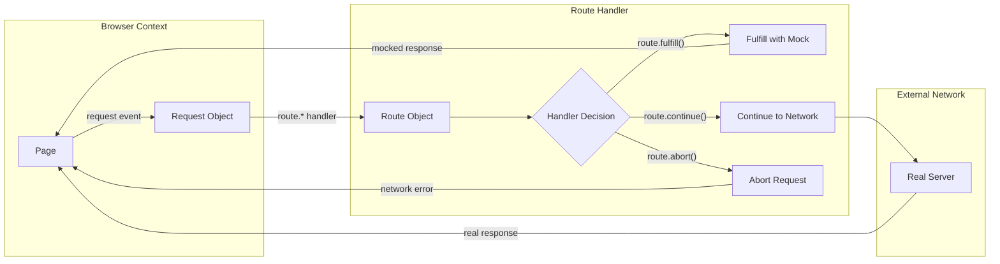
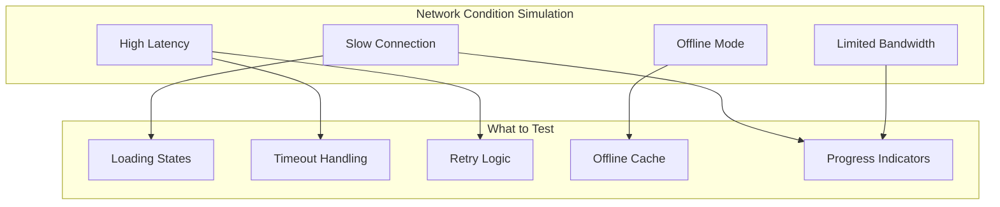
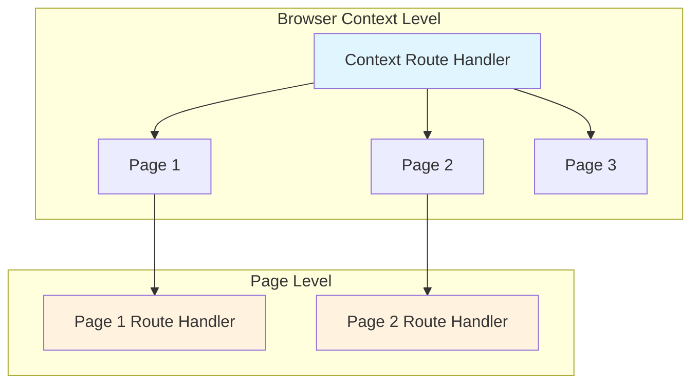

# How to Handle Playwright Network Interception

Author: [nawazdhandala](https://www.github.com/nawazdhandala)

Tags: Playwright, Network Interception, Testing, JavaScript, TypeScript, Web Automation, End-to-End Testing

Description: A comprehensive guide to intercepting, mocking, and modifying network requests in Playwright for robust end-to-end testing. Learn how to stub API responses, simulate network conditions, and debug request flows.

---

Network interception sits at the heart of reliable end-to-end testing. When tests depend on external APIs, third-party services, or databases, they become fragile. Network issues, rate limits, or data changes can cause test failures that have nothing to do with your application code.

Playwright provides powerful network interception capabilities that let you control exactly what your application sees during tests. You can mock API responses, simulate slow connections, block unwanted requests, and inspect network traffic for debugging. Mastering these techniques transforms flaky tests into deterministic ones.

## Why Intercept Network Requests

Testing against live APIs introduces several problems that network interception solves:

| Problem | Network Interception Solution |
| --- | --- |
| Tests fail when API is down | Mock responses ensure tests run independently |
| Rate limiting blocks test execution | Mocked requests never hit rate limits |
| Test data changes unexpectedly | Controlled responses provide consistent data |
| Slow API responses slow down tests | Instant mocked responses speed up test suites |
| Cannot test error scenarios | Simulate 500 errors, timeouts, and edge cases |
| Third-party services charge per request | No network calls means no API costs during tests |

Network interception also enables testing scenarios that would be difficult or impossible with real APIs: server errors, malformed responses, specific edge cases, and race conditions.

## Understanding Playwright's Request Flow

Before diving into code, understanding how Playwright handles requests helps you write better interceptions.



Every network request passes through route handlers before reaching the network. You can intercept at the page level, context level, or even modify requests mid-flight.

## Setting Up Route Handlers

Route handlers intercept requests matching a pattern and let you decide what happens next. The following example shows the basic setup.

```typescript
// Basic route handler setup
// Intercepts all API requests and returns mock data
import { test, expect } from '@playwright/test';

test('intercepts API requests', async ({ page }) => {
  // Register a route handler for all requests to /api/*
  // The handler receives a Route object for controlling the response
  await page.route('**/api/**', async (route) => {
    // Log the intercepted request for debugging
    console.log(`Intercepted: ${route.request().url()}`);

    // Fulfill the request with mock data
    await route.fulfill({
      status: 200,
      contentType: 'application/json',
      body: JSON.stringify({
        users: [
          { id: 1, name: 'Alice' },
          { id: 2, name: 'Bob' }
        ]
      })
    });
  });

  // Navigate to the page that makes API calls
  await page.goto('https://example.com/users');

  // The page now displays mock data instead of real API data
  await expect(page.locator('.user-list')).toContainText('Alice');
});
```

## URL Pattern Matching

Playwright supports multiple ways to match URLs. Choosing the right pattern improves both performance and maintainability.

```typescript
// Different URL matching patterns demonstrated
// Each pattern serves different use cases
import { test } from '@playwright/test';

test.describe('URL pattern matching', () => {

  // Glob patterns work well for simple path matching
  // Double asterisk matches any path segments
  test('glob pattern matching', async ({ page }) => {
    await page.route('**/api/users/**', async (route) => {
      // Matches: /api/users, /api/users/123, /api/users/123/posts
      await route.fulfill({ status: 200, body: '[]' });
    });
  });

  // String matching for exact URLs
  // Useful when you need precise control
  test('exact URL matching', async ({ page }) => {
    await page.route('https://api.example.com/v1/users', async (route) => {
      // Only matches this exact URL, not /users/123
      await route.fulfill({ status: 200, body: '[]' });
    });
  });

  // Regular expressions provide maximum flexibility
  // Use when glob patterns are insufficient
  test('regex pattern matching', async ({ page }) => {
    // Match user IDs that are numeric
    await page.route(/\/api\/users\/\d+$/, async (route) => {
      // Matches: /api/users/123, /api/users/456
      // Does not match: /api/users/abc, /api/users/123/posts
      await route.fulfill({ status: 200, body: '{}' });
    });
  });

  // Predicate functions allow complex matching logic
  // Inspect the full request object before deciding
  test('predicate function matching', async ({ page }) => {
    await page.route(
      (url) => {
        // Match only POST requests to the users endpoint
        return url.pathname.includes('/users');
      },
      async (route) => {
        // Additional check for request method
        if (route.request().method() === 'POST') {
          await route.fulfill({
            status: 201,
            body: JSON.stringify({ id: 999, name: 'New User' })
          });
        } else {
          // Let GET requests through to the real server
          await route.continue();
        }
      }
    );
  });
});
```

## Mocking API Responses

Most test scenarios require mocking API responses. Building robust mocks means handling different response types and HTTP methods.

```typescript
// Comprehensive API mocking for a user management feature
// Demonstrates handling multiple endpoints and methods
import { test, expect, Route, Request } from '@playwright/test';

// Mock data shared across tests
const mockUsers = [
  { id: 1, name: 'Alice', email: 'alice@example.com', role: 'admin' },
  { id: 2, name: 'Bob', email: 'bob@example.com', role: 'user' },
  { id: 3, name: 'Charlie', email: 'charlie@example.com', role: 'user' }
];

test.describe('User API mocking', () => {

  test.beforeEach(async ({ page }) => {
    // Set up route handlers before each test
    // Handles GET, POST, PUT, and DELETE for /api/users
    await page.route('**/api/users**', async (route: Route) => {
      const request: Request = route.request();
      const method = request.method();
      const url = new URL(request.url());

      // Extract user ID from URL if present
      const userIdMatch = url.pathname.match(/\/users\/(\d+)/);
      const userId = userIdMatch ? parseInt(userIdMatch[1]) : null;

      // Route to appropriate handler based on method
      switch (method) {
        case 'GET':
          if (userId) {
            // Return single user
            const user = mockUsers.find(u => u.id === userId);
            await route.fulfill({
              status: user ? 200 : 404,
              contentType: 'application/json',
              body: JSON.stringify(user || { error: 'User not found' })
            });
          } else {
            // Return all users with optional filtering
            const roleFilter = url.searchParams.get('role');
            const filteredUsers = roleFilter
              ? mockUsers.filter(u => u.role === roleFilter)
              : mockUsers;
            await route.fulfill({
              status: 200,
              contentType: 'application/json',
              body: JSON.stringify(filteredUsers)
            });
          }
          break;

        case 'POST':
          // Simulate user creation
          const postData = request.postDataJSON();
          const newUser = {
            id: mockUsers.length + 1,
            ...postData
          };
          await route.fulfill({
            status: 201,
            contentType: 'application/json',
            body: JSON.stringify(newUser)
          });
          break;

        case 'PUT':
          // Simulate user update
          if (userId) {
            const putData = request.postDataJSON();
            await route.fulfill({
              status: 200,
              contentType: 'application/json',
              body: JSON.stringify({ id: userId, ...putData })
            });
          } else {
            await route.fulfill({ status: 400, body: 'User ID required' });
          }
          break;

        case 'DELETE':
          // Simulate user deletion
          await route.fulfill({
            status: userId ? 204 : 400,
            body: ''
          });
          break;

        default:
          await route.continue();
      }
    });
  });

  test('displays user list', async ({ page }) => {
    await page.goto('https://example.com/users');

    // Verify all mock users are displayed
    for (const user of mockUsers) {
      await expect(page.locator(`text=${user.name}`)).toBeVisible();
    }
  });

  test('creates new user', async ({ page }) => {
    await page.goto('https://example.com/users/new');

    await page.fill('[name="name"]', 'Diana');
    await page.fill('[name="email"]', 'diana@example.com');
    await page.click('button[type="submit"]');

    // Verify success message appears
    await expect(page.locator('.success-message')).toContainText('User created');
  });

  test('filters users by role', async ({ page }) => {
    await page.goto('https://example.com/users?role=admin');

    // Only admin users should be visible
    await expect(page.locator('text=Alice')).toBeVisible();
    await expect(page.locator('text=Bob')).not.toBeVisible();
  });
});
```

## Simulating Error Conditions

Real applications must handle errors gracefully. Network interception makes testing error scenarios straightforward.

```typescript
// Testing error handling with simulated failures
// Covers HTTP errors, network failures, and timeouts
import { test, expect } from '@playwright/test';

test.describe('Error scenario testing', () => {

  test('handles 500 server error', async ({ page }) => {
    // Simulate internal server error
    await page.route('**/api/data', async (route) => {
      await route.fulfill({
        status: 500,
        contentType: 'application/json',
        body: JSON.stringify({
          error: 'Internal Server Error',
          message: 'Database connection failed'
        })
      });
    });

    await page.goto('https://example.com/dashboard');

    // Verify error message is displayed to user
    await expect(page.locator('.error-banner')).toContainText(
      'Something went wrong'
    );
    // Verify retry button is available
    await expect(page.locator('button:has-text("Retry")')).toBeVisible();
  });

  test('handles 401 unauthorized error', async ({ page }) => {
    await page.route('**/api/profile', async (route) => {
      await route.fulfill({
        status: 401,
        contentType: 'application/json',
        body: JSON.stringify({ error: 'Token expired' })
      });
    });

    await page.goto('https://example.com/profile');

    // Should redirect to login page
    await expect(page).toHaveURL(/.*\/login/);
  });

  test('handles 429 rate limiting', async ({ page }) => {
    let requestCount = 0;

    await page.route('**/api/search**', async (route) => {
      requestCount++;

      if (requestCount > 3) {
        // Simulate rate limit after 3 requests
        await route.fulfill({
          status: 429,
          headers: {
            'Retry-After': '60'
          },
          body: JSON.stringify({ error: 'Too many requests' })
        });
      } else {
        await route.fulfill({
          status: 200,
          body: JSON.stringify({ results: [] })
        });
      }
    });

    await page.goto('https://example.com/search');

    // Trigger multiple searches
    for (let i = 0; i < 5; i++) {
      await page.fill('[name="query"]', `search term ${i}`);
      await page.click('button[type="submit"]');
    }

    // Should show rate limit warning
    await expect(page.locator('.rate-limit-warning')).toBeVisible();
  });

  test('handles network failure', async ({ page }) => {
    // Abort the request to simulate network failure
    await page.route('**/api/critical-data', async (route) => {
      await route.abort('failed');
    });

    await page.goto('https://example.com/dashboard');

    // Should show offline indicator
    await expect(page.locator('.offline-indicator')).toBeVisible();
  });

  test('handles malformed JSON response', async ({ page }) => {
    await page.route('**/api/data', async (route) => {
      await route.fulfill({
        status: 200,
        contentType: 'application/json',
        // Invalid JSON that will cause parsing error
        body: '{ invalid json }'
      });
    });

    await page.goto('https://example.com/dashboard');

    // Application should handle parse error gracefully
    await expect(page.locator('.error-message')).toContainText(
      'Unable to load data'
    );
  });
});
```

## Simulating Network Conditions

Testing how your application behaves under poor network conditions reveals performance issues and user experience problems.



```typescript
// Simulating various network conditions
// Tests loading states and timeout handling
import { test, expect } from '@playwright/test';

test.describe('Network condition simulation', () => {

  test('shows loading state during slow response', async ({ page }) => {
    // Add artificial delay to API response
    await page.route('**/api/heavy-data', async (route) => {
      // Wait 3 seconds before responding
      await new Promise(resolve => setTimeout(resolve, 3000));

      await route.fulfill({
        status: 200,
        body: JSON.stringify({ data: 'heavy payload' })
      });
    });

    await page.goto('https://example.com/reports');

    // Loading spinner should appear immediately
    await expect(page.locator('.loading-spinner')).toBeVisible();

    // Content should appear after delay
    await expect(page.locator('.report-content')).toBeVisible({
      timeout: 5000
    });

    // Loading spinner should disappear
    await expect(page.locator('.loading-spinner')).not.toBeVisible();
  });

  test('handles request timeout', async ({ page }) => {
    // Never respond to simulate timeout
    await page.route('**/api/data', async (route) => {
      // Simply don't call route.fulfill() or route.continue()
      // The request will hang until the application timeout
    });

    // Set a short timeout for testing
    await page.goto('https://example.com/data');

    // Application should show timeout message
    await expect(page.locator('.timeout-error')).toBeVisible({
      timeout: 10000
    });
  });

  test('progressive loading with streaming', async ({ page }) => {
    // Simulate chunked response
    await page.route('**/api/stream', async (route) => {
      await route.fulfill({
        status: 200,
        headers: {
          'Transfer-Encoding': 'chunked',
          'Content-Type': 'text/plain'
        },
        body: 'chunk1\nchunk2\nchunk3'
      });
    });

    await page.goto('https://example.com/stream-demo');

    await expect(page.locator('.stream-output')).toContainText('chunk1');
    await expect(page.locator('.stream-output')).toContainText('chunk3');
  });
});

// Helper function to throttle network speed
// Useful for testing on simulated slow connections
async function withSlowNetwork(
  page: any,
  downloadSpeed: number,
  callback: () => Promise<void>
) {
  const client = await page.context().newCDPSession(page);

  // Enable network emulation through Chrome DevTools Protocol
  await client.send('Network.emulateNetworkConditions', {
    offline: false,
    downloadThroughput: downloadSpeed * 1024 / 8,  // Convert KB/s to bytes/s
    uploadThroughput: downloadSpeed * 1024 / 8,
    latency: 100
  });

  try {
    await callback();
  } finally {
    // Reset network conditions
    await client.send('Network.emulateNetworkConditions', {
      offline: false,
      downloadThroughput: -1,
      uploadThroughput: -1,
      latency: 0
    });
  }
}
```

## Modifying Requests and Responses

Sometimes you need to modify requests before they reach the server or transform responses before the application sees them.

```typescript
// Request and response modification examples
// Useful for adding auth headers or transforming data
import { test, expect } from '@playwright/test';

test.describe('Request modification', () => {

  test('adds authentication header to requests', async ({ page }) => {
    // Intercept all API requests and add auth header
    await page.route('**/api/**', async (route) => {
      const headers = {
        ...route.request().headers(),
        'Authorization': 'Bearer test-token-12345',
        'X-Request-ID': `test-${Date.now()}`
      };

      // Continue to real server with modified headers
      await route.continue({ headers });
    });

    await page.goto('https://example.com/protected');
    // Requests now include authentication headers
  });

  test('modifies request body', async ({ page }) => {
    await page.route('**/api/submit', async (route) => {
      // Get original post data
      const originalData = route.request().postDataJSON() || {};

      // Add tracking fields to the submission
      const modifiedData = {
        ...originalData,
        timestamp: new Date().toISOString(),
        testEnvironment: true,
        clientVersion: '1.0.0-test'
      };

      await route.continue({
        postData: JSON.stringify(modifiedData)
      });
    });

    await page.goto('https://example.com/form');
    await page.fill('[name="message"]', 'Hello');
    await page.click('button[type="submit"]');
  });

  test('transforms response data', async ({ page }) => {
    await page.route('**/api/users', async (route) => {
      // Fetch real response from server
      const response = await route.fetch();
      const json = await response.json();

      // Transform the response data
      // Add computed fields and mask sensitive data
      const transformedUsers = json.map((user: any) => ({
        ...user,
        email: user.email.replace(/@.*/, '@masked.com'),
        displayName: `${user.firstName} ${user.lastName}`,
        isTestUser: true
      }));

      await route.fulfill({
        response,  // Preserve original headers and status
        body: JSON.stringify(transformedUsers)
      });
    });

    await page.goto('https://example.com/users');

    // Emails should be masked in the UI
    await expect(page.locator('.user-email').first()).toContainText('@masked.com');
  });
});
```

## Recording and Replaying Network Traffic

Capturing real API responses and replaying them in tests provides realistic data without hitting live services.

```typescript
// HAR file recording and playback for realistic test data
// HAR (HTTP Archive) format stores complete request/response cycles
import { test, expect } from '@playwright/test';
import * as fs from 'fs';
import * as path from 'path';

// Recording mode - run once to capture real traffic
test.describe.skip('Record network traffic', () => {

  test('records API calls to HAR file', async ({ page }) => {
    const harPath = path.join(__dirname, 'fixtures', 'api-traffic.har');

    // Start recording all network traffic
    await page.routeFromHAR(harPath, {
      update: true,  // Create/update the HAR file
      updateContent: 'embed'  // Include response bodies in HAR
    });

    // Navigate through the application
    // All network requests will be captured
    await page.goto('https://example.com');
    await page.click('text=Users');
    await page.click('text=Products');

    // HAR file is automatically saved when the page closes
  });
});

// Playback mode - use recorded responses in tests
test.describe('Replay network traffic', () => {

  test('uses recorded responses from HAR file', async ({ page }) => {
    const harPath = path.join(__dirname, 'fixtures', 'api-traffic.har');

    // Route requests through the HAR file
    await page.routeFromHAR(harPath, {
      update: false,  // Playback mode - don't modify HAR
      notFound: 'fallback'  // Fall back to network for unrecorded requests
    });

    await page.goto('https://example.com/users');

    // Page displays data from recorded responses
    await expect(page.locator('.user-list')).toBeVisible();
  });
});

// Custom HAR-like mock system for complex scenarios
class MockServer {
  private recordings: Map<string, any> = new Map();

  async recordResponse(url: string, response: any) {
    this.recordings.set(url, {
      timestamp: Date.now(),
      response
    });
  }

  async getRecordedResponse(url: string): Promise<any | null> {
    return this.recordings.get(url)?.response || null;
  }

  async saveToFile(filePath: string) {
    const data = Object.fromEntries(this.recordings);
    fs.writeFileSync(filePath, JSON.stringify(data, null, 2));
  }

  async loadFromFile(filePath: string) {
    const data = JSON.parse(fs.readFileSync(filePath, 'utf-8'));
    this.recordings = new Map(Object.entries(data));
  }
}

// Usage example with custom mock server
test('custom recording system', async ({ page }) => {
  const mockServer = new MockServer();
  await mockServer.loadFromFile('./fixtures/mock-responses.json');

  await page.route('**/api/**', async (route) => {
    const url = route.request().url();
    const recorded = await mockServer.getRecordedResponse(url);

    if (recorded) {
      await route.fulfill({
        status: 200,
        contentType: 'application/json',
        body: JSON.stringify(recorded)
      });
    } else {
      // Fetch from real server and record for next time
      const response = await route.fetch();
      const body = await response.json();
      await mockServer.recordResponse(url, body);
      await route.fulfill({ response });
    }
  });

  await page.goto('https://example.com');
});
```

## Context-Level vs Page-Level Routing

Playwright allows route handlers at different levels. Understanding the distinction helps organize test code better.



```typescript
// Demonstrating context-level vs page-level routing
// Context routes apply to all pages, page routes are specific
import { test, expect, BrowserContext, Page } from '@playwright/test';

test.describe('Route handler levels', () => {

  test('context-level routing affects all pages', async ({ browser }) => {
    // Create a new context with route handlers
    const context: BrowserContext = await browser.newContext();

    // Context-level route applies to ALL pages in this context
    await context.route('**/api/config', async (route) => {
      await route.fulfill({
        status: 200,
        body: JSON.stringify({
          theme: 'dark',
          language: 'en'
        })
      });
    });

    // Open multiple pages
    const page1 = await context.newPage();
    const page2 = await context.newPage();

    // Both pages receive the mocked config
    await page1.goto('https://example.com/settings');
    await page2.goto('https://example.com/preferences');

    await expect(page1.locator('.theme-indicator')).toHaveAttribute(
      'data-theme',
      'dark'
    );
    await expect(page2.locator('.theme-indicator')).toHaveAttribute(
      'data-theme',
      'dark'
    );

    await context.close();
  });

  test('page-level routing only affects that page', async ({ browser }) => {
    const context = await browser.newContext();
    const page1 = await context.newPage();
    const page2 = await context.newPage();

    // Route handler only for page1
    await page1.route('**/api/user', async (route) => {
      await route.fulfill({
        status: 200,
        body: JSON.stringify({ name: 'Mocked User' })
      });
    });

    // page1 gets mocked response
    await page1.goto('https://example.com/profile');
    await expect(page1.locator('.user-name')).toContainText('Mocked User');

    // page2 gets real response (no route handler)
    await page2.goto('https://example.com/profile');
    // Will show actual user data from server

    await context.close();
  });

  test('combining context and page routes', async ({ browser }) => {
    const context = await browser.newContext();

    // Global mock for authentication
    await context.route('**/api/auth/**', async (route) => {
      await route.fulfill({
        status: 200,
        body: JSON.stringify({
          authenticated: true,
          user: { id: 1, role: 'admin' }
        })
      });
    });

    const page = await context.newPage();

    // Page-specific mock for testing a feature
    await page.route('**/api/feature-flag', async (route) => {
      await route.fulfill({
        status: 200,
        body: JSON.stringify({
          newDashboard: true,
          betaFeatures: true
        })
      });
    });

    await page.goto('https://example.com/dashboard');

    // Both context and page routes are active
    await expect(page.locator('.admin-badge')).toBeVisible();
    await expect(page.locator('.beta-banner')).toBeVisible();

    await context.close();
  });
});
```

## Waiting for Network Requests

Tests often need to wait for specific network requests to complete before making assertions.

```typescript
// Waiting for network events in tests
// Essential for testing async operations
import { test, expect } from '@playwright/test';

test.describe('Network waiting strategies', () => {

  test('waits for specific request to complete', async ({ page }) => {
    // Navigate to page
    await page.goto('https://example.com');

    // Set up request listener before triggering the action
    const responsePromise = page.waitForResponse('**/api/save');

    // Trigger the action that makes the request
    await page.click('button:has-text("Save")');

    // Wait for the response
    const response = await responsePromise;

    // Verify response details
    expect(response.status()).toBe(200);
    const data = await response.json();
    expect(data.success).toBe(true);
  });

  test('waits for request with specific criteria', async ({ page }) => {
    await page.goto('https://example.com/search');

    // Wait for POST request with specific body content
    const responsePromise = page.waitForResponse(
      response => response.url().includes('/api/search') &&
                  response.request().method() === 'POST'
    );

    await page.fill('[name="query"]', 'playwright');
    await page.click('button[type="submit"]');

    const response = await responsePromise;
    const results = await response.json();
    expect(results.items.length).toBeGreaterThan(0);
  });

  test('waits for multiple requests', async ({ page }) => {
    await page.goto('https://example.com/dashboard');

    // Dashboard loads data from multiple endpoints
    const promises = [
      page.waitForResponse('**/api/stats'),
      page.waitForResponse('**/api/notifications'),
      page.waitForResponse('**/api/recent-activity')
    ];

    // Trigger dashboard refresh
    await page.click('button:has-text("Refresh")');

    // Wait for all requests to complete
    const responses = await Promise.all(promises);

    // Verify all succeeded
    responses.forEach(response => {
      expect(response.status()).toBe(200);
    });
  });

  test('handles network idle state', async ({ page }) => {
    // Wait until no network requests for 500ms
    await page.goto('https://example.com', {
      waitUntil: 'networkidle'
    });

    // All initial network requests have completed
    await expect(page.locator('.content-loaded')).toBeVisible();
  });

  test('captures request details for assertions', async ({ page }) => {
    // Track all requests to an endpoint
    const requests: Array<{url: string, method: string, body: any}> = [];

    await page.route('**/api/analytics', async (route) => {
      requests.push({
        url: route.request().url(),
        method: route.request().method(),
        body: route.request().postDataJSON()
      });
      await route.fulfill({ status: 200, body: '{}' });
    });

    await page.goto('https://example.com');
    await page.click('.track-button');
    await page.click('.another-button');

    // Verify analytics calls were made correctly
    expect(requests.length).toBe(2);
    expect(requests[0].body.event).toBe('button_click');
    expect(requests[1].body.event).toBe('another_button_click');
  });
});
```

## Blocking Unwanted Requests

Blocking ads, analytics, or other non-essential requests speeds up tests and reduces noise.

```typescript
// Blocking unnecessary requests for faster tests
// Common patterns for ads, analytics, and third-party services
import { test, expect } from '@playwright/test';

test.describe('Request blocking', () => {

  test.beforeEach(async ({ page }) => {
    // Block common tracking and advertising domains
    await page.route(/(google-analytics|googletagmanager|facebook|doubleclick)\.com/,
      route => route.abort()
    );

    // Block by resource type
    await page.route('**/*', async (route) => {
      const resourceType = route.request().resourceType();

      // Block images, fonts, and stylesheets for faster tests
      if (['image', 'font', 'stylesheet'].includes(resourceType)) {
        await route.abort();
      } else {
        await route.continue();
      }
    });
  });

  test('page loads without blocked resources', async ({ page }) => {
    await page.goto('https://example.com');

    // Page should function without blocked resources
    await expect(page.locator('h1')).toBeVisible();
  });
});

// More selective blocking strategies
test('blocks specific request types', async ({ page }) => {
  const blockedRequests: string[] = [];

  await page.route('**/*', async (route) => {
    const url = route.request().url();

    // Block patterns that slow down tests
    const blockPatterns = [
      /\.jpg$/i,
      /\.png$/i,
      /\.gif$/i,
      /analytics/i,
      /tracking/i,
      /hotjar/i,
      /sentry/i
    ];

    const shouldBlock = blockPatterns.some(pattern => pattern.test(url));

    if (shouldBlock) {
      blockedRequests.push(url);
      await route.abort();
    } else {
      await route.continue();
    }
  });

  await page.goto('https://example.com');

  // Log what was blocked for debugging
  console.log(`Blocked ${blockedRequests.length} requests`);
});

// Block specific responses that cause issues
test('blocks problematic third-party scripts', async ({ page }) => {
  await page.route('**/problematic-widget.js', async (route) => {
    // Return empty script instead of blocking
    // Prevents JavaScript errors from missing global
    await route.fulfill({
      status: 200,
      contentType: 'application/javascript',
      body: '// Mocked empty script'
    });
  });

  await page.goto('https://example.com');
});
```

## Debugging Network Issues

When tests fail due to network issues, debugging tools help identify the problem quickly.

```typescript
// Debugging network issues in Playwright tests
// Logging and inspection utilities
import { test, expect } from '@playwright/test';

test.describe('Network debugging', () => {

  test('logs all network requests', async ({ page }) => {
    // Enable verbose request logging
    page.on('request', request => {
      console.log(`>> ${request.method()} ${request.url()}`);
    });

    page.on('response', response => {
      console.log(`<< ${response.status()} ${response.url()}`);
    });

    page.on('requestfailed', request => {
      console.log(`XX FAILED: ${request.url()}`);
      console.log(`   Error: ${request.failure()?.errorText}`);
    });

    await page.goto('https://example.com');
  });

  test('captures detailed request info', async ({ page }) => {
    const requestLog: any[] = [];

    page.on('request', request => {
      requestLog.push({
        timestamp: new Date().toISOString(),
        method: request.method(),
        url: request.url(),
        headers: request.headers(),
        postData: request.postData(),
        resourceType: request.resourceType()
      });
    });

    page.on('response', async response => {
      const request = response.request();
      const entry = requestLog.find(r => r.url === request.url());
      if (entry) {
        entry.status = response.status();
        entry.responseHeaders = response.headers();
        try {
          entry.responseBody = await response.text();
        } catch {
          entry.responseBody = '[binary or failed to read]';
        }
      }
    });

    await page.goto('https://example.com/api-heavy-page');

    // Save log for analysis
    console.log(JSON.stringify(requestLog, null, 2));
  });

  test('measures request timing', async ({ page }) => {
    const timings: Map<string, number> = new Map();

    page.on('request', request => {
      timings.set(request.url(), Date.now());
    });

    page.on('response', response => {
      const startTime = timings.get(response.url());
      if (startTime) {
        const duration = Date.now() - startTime;
        console.log(`${response.url()}: ${duration}ms`);
      }
    });

    await page.goto('https://example.com');
  });
});

// Helper function for debugging specific routes
async function debugRoute(page: any, pattern: string | RegExp) {
  await page.route(pattern, async (route: any) => {
    const request = route.request();

    console.log('='.repeat(60));
    console.log('INTERCEPTED REQUEST:');
    console.log(`  URL: ${request.url()}`);
    console.log(`  Method: ${request.method()}`);
    console.log(`  Headers: ${JSON.stringify(request.headers(), null, 2)}`);
    console.log(`  Post Data: ${request.postData()}`);
    console.log('='.repeat(60));

    // Continue to see real response
    const response = await route.fetch();
    const body = await response.text();

    console.log('RESPONSE:');
    console.log(`  Status: ${response.status()}`);
    console.log(`  Body: ${body.substring(0, 500)}...`);
    console.log('='.repeat(60));

    await route.fulfill({ response });
  });
}
```

## Best Practices for Network Interception

Following established patterns keeps test code maintainable and reliable.

```typescript
// Organized mock data management
// Separates mock data from test logic
import { test, expect, Page } from '@playwright/test';
import * as path from 'path';
import * as fs from 'fs';

// fixtures/mocks/users.json
const usersMockData = {
  users: [
    { id: 1, name: 'Test User 1', email: 'user1@test.com' },
    { id: 2, name: 'Test User 2', email: 'user2@test.com' }
  ],
  pagination: {
    page: 1,
    totalPages: 1,
    totalItems: 2
  }
};

// Reusable mock setup function
async function setupApiMocks(page: Page, overrides: Record<string, any> = {}) {
  // Default mocks that most tests need
  const defaultMocks = {
    '/api/users': usersMockData,
    '/api/config': { theme: 'light', language: 'en' },
    '/api/auth/me': { id: 1, name: 'Test User', role: 'user' }
  };

  // Merge defaults with test-specific overrides
  const mocks = { ...defaultMocks, ...overrides };

  for (const [endpoint, data] of Object.entries(mocks)) {
    await page.route(`**${endpoint}`, async (route) => {
      await route.fulfill({
        status: 200,
        contentType: 'application/json',
        body: JSON.stringify(data)
      });
    });
  }
}

test.describe('Best practices example', () => {

  test('uses centralized mock setup', async ({ page }) => {
    await setupApiMocks(page);

    await page.goto('https://example.com/dashboard');
    await expect(page.locator('.user-count')).toContainText('2');
  });

  test('overrides specific mocks for edge cases', async ({ page }) => {
    await setupApiMocks(page, {
      '/api/users': { users: [], pagination: { page: 1, totalPages: 0, totalItems: 0 } }
    });

    await page.goto('https://example.com/dashboard');
    await expect(page.locator('.empty-state')).toBeVisible();
  });
});

// Page Object Pattern with network mocking
class UserListPage {
  constructor(private page: Page) {}

  async setupMocks(users: any[]) {
    await this.page.route('**/api/users', async (route) => {
      await route.fulfill({
        status: 200,
        contentType: 'application/json',
        body: JSON.stringify({ users })
      });
    });
  }

  async navigate() {
    await this.page.goto('https://example.com/users');
  }

  async getUserNames(): Promise<string[]> {
    const items = await this.page.locator('.user-name').allTextContents();
    return items;
  }
}

test('page object with mocking', async ({ page }) => {
  const userList = new UserListPage(page);

  await userList.setupMocks([
    { id: 1, name: 'Alice' },
    { id: 2, name: 'Bob' }
  ]);

  await userList.navigate();

  const names = await userList.getUserNames();
  expect(names).toContain('Alice');
  expect(names).toContain('Bob');
});
```

## Summary

Network interception transforms Playwright from a browser automation tool into a comprehensive testing platform. Mocking API responses eliminates external dependencies, speeds up test execution, and enables testing scenarios that would be impossible with real services.

Key techniques to master include route handlers for intercepting requests, response mocking for consistent test data, request modification for authentication testing, and network simulation for performance testing.

Keep mock data organized in separate files, use helper functions for common patterns, and always clean up route handlers between tests. Well-structured network mocking makes tests faster, more reliable, and easier to maintain.

---

*Building applications that depend on external APIs? [OneUptime](https://oneuptime.com) monitors your API endpoints in real-time, alerting you when third-party services experience issues. Track response times, error rates, and availability from multiple locations worldwide.*
