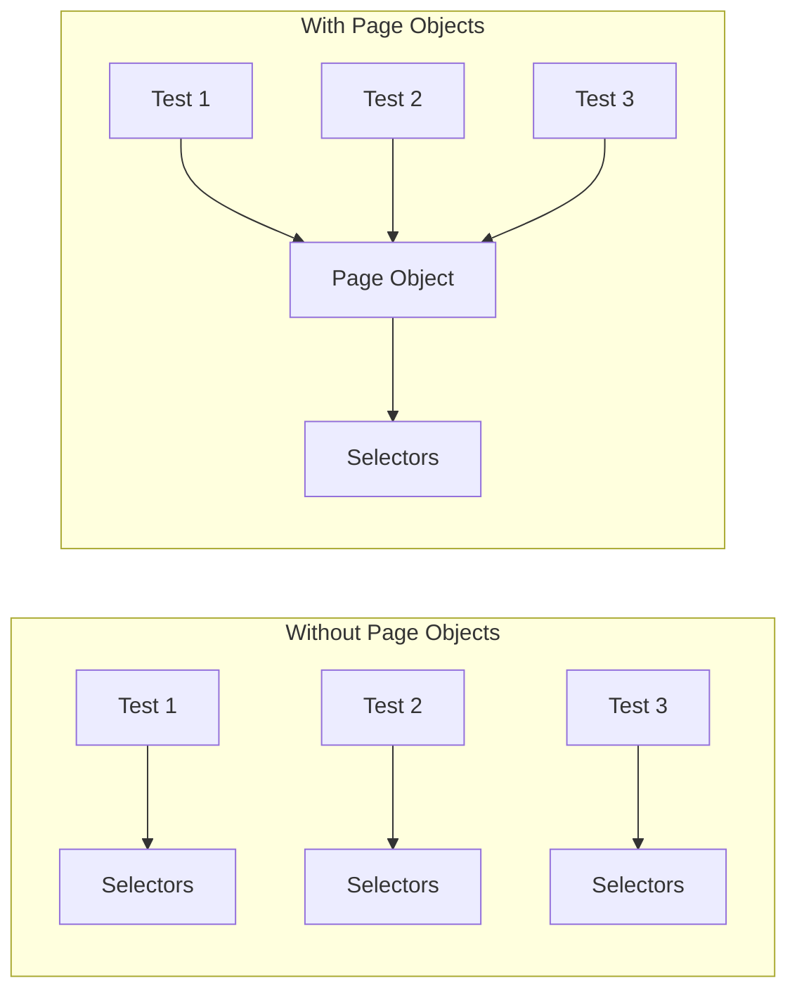
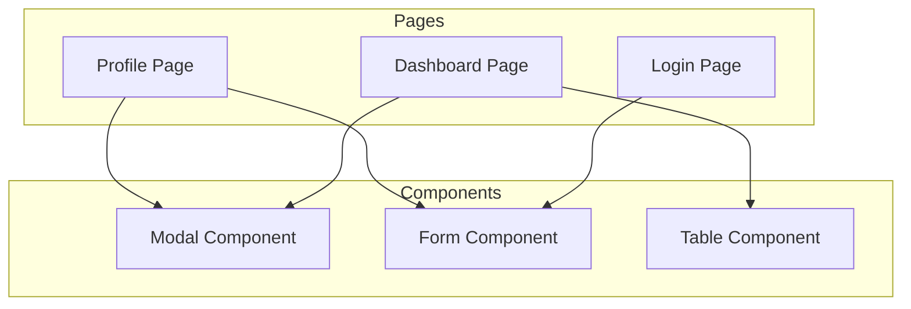
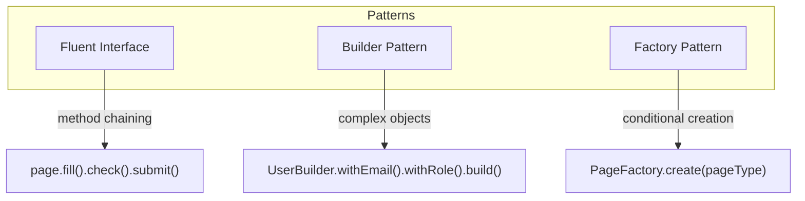

# How to Handle Playwright Page Objects

Author: [nawazdhandala](https://github.com/nawazdhandala)

Tags: Playwright, Testing, Page Objects, Automation, JavaScript, TypeScript, End-to-End Testing

Description: A practical guide to implementing the Page Object Model in Playwright for maintainable, scalable end-to-end tests. Covers page class design, component abstraction, fixtures integration, and real-world patterns.

---

End-to-end tests grow messy fast. Selectors scattered across test files, duplicated login sequences, and brittle assertions make maintenance a nightmare. The Page Object Model (POM) solves these problems by encapsulating page interactions in reusable classes. Playwright's architecture makes implementing page objects straightforward and powerful.

## Why Page Objects Matter

Consider a test file with raw Playwright selectors:

```javascript
// Fragile test without page objects
test('user can checkout', async ({ page }) => {
  await page.goto('/login');
  await page.fill('[data-testid="email"]', 'user@example.com');
  await page.fill('[data-testid="password"]', 'secret123');
  await page.click('[data-testid="submit"]');
  await page.goto('/products');
  await page.click('[data-testid="product-1"] >> button');
  await page.click('[data-testid="cart-icon"]');
  await page.click('[data-testid="checkout-btn"]');
  // More selectors...
});
```

When a developer changes `data-testid="email"` to `data-testid="email-input"`, every test file using that selector breaks. Page objects centralize these selectors so changes only require one update.



## Basic Page Object Structure

A page object class wraps a Playwright page and exposes methods for user interactions. Each method represents an action a user can perform.

The following LoginPage class encapsulates all login-related selectors and actions. Notice how the constructor accepts the Playwright page instance and stores it for use in methods.

```typescript
// pages/login.page.ts
import { Page, Locator, expect } from '@playwright/test';

export class LoginPage {
  // Store the page instance for use in all methods
  private readonly page: Page;

  // Define locators as class properties for reuse and easy updates
  private readonly emailInput: Locator;
  private readonly passwordInput: Locator;
  private readonly submitButton: Locator;
  private readonly errorMessage: Locator;
  private readonly rememberMeCheckbox: Locator;

  constructor(page: Page) {
    this.page = page;

    // Initialize all locators in constructor
    // Using data-testid attributes for stability
    this.emailInput = page.getByTestId('email-input');
    this.passwordInput = page.getByTestId('password-input');
    this.submitButton = page.getByTestId('submit-button');
    this.errorMessage = page.getByTestId('error-message');
    this.rememberMeCheckbox = page.getByLabel('Remember me');
  }

  // Navigate to the login page
  async goto(): Promise<void> {
    await this.page.goto('/login');
  }

  // Fill in credentials and submit the form
  async login(email: string, password: string): Promise<void> {
    await this.emailInput.fill(email);
    await this.passwordInput.fill(password);
    await this.submitButton.click();
  }

  // Login with the "remember me" option checked
  async loginWithRememberMe(email: string, password: string): Promise<void> {
    await this.emailInput.fill(email);
    await this.passwordInput.fill(password);
    await this.rememberMeCheckbox.check();
    await this.submitButton.click();
  }

  // Assert that an error message is displayed
  async expectError(message: string): Promise<void> {
    await expect(this.errorMessage).toContainText(message);
  }

  // Assert successful login by checking URL redirect
  async expectLoginSuccess(): Promise<void> {
    await expect(this.page).toHaveURL(/.*dashboard/);
  }
}
```

## Using Page Objects in Tests

Tests become cleaner and more readable when using page objects. The test describes user behavior rather than implementation details.

The following test file demonstrates how to instantiate and use the LoginPage class. Each test creates a fresh page object instance.

```typescript
// tests/login.spec.ts
import { test, expect } from '@playwright/test';
import { LoginPage } from '../pages/login.page';

test.describe('Login functionality', () => {
  // Declare page object variable for use across tests
  let loginPage: LoginPage;

  // Create a new page object before each test
  test.beforeEach(async ({ page }) => {
    loginPage = new LoginPage(page);
    await loginPage.goto();
  });

  test('successful login redirects to dashboard', async () => {
    await loginPage.login('valid@example.com', 'correctpassword');
    await loginPage.expectLoginSuccess();
  });

  test('invalid credentials show error message', async () => {
    await loginPage.login('invalid@example.com', 'wrongpassword');
    await loginPage.expectError('Invalid email or password');
  });

  test('remember me persists session', async () => {
    await loginPage.loginWithRememberMe('user@example.com', 'password123');
    await loginPage.expectLoginSuccess();
  });
});
```

## Page Object Inheritance

Many applications share common elements across pages like headers, footers, and navigation menus. Create a base page class to avoid duplication.

The BasePage class below provides navigation methods and common element interactions that all page objects inherit.

```typescript
// pages/base.page.ts
import { Page, Locator, expect } from '@playwright/test';

export abstract class BasePage {
  protected readonly page: Page;

  // Common elements present on all pages
  private readonly header: Locator;
  private readonly userMenu: Locator;
  private readonly logoutButton: Locator;
  private readonly searchInput: Locator;
  private readonly notificationBell: Locator;

  constructor(page: Page) {
    this.page = page;

    // Initialize common locators
    this.header = page.getByRole('banner');
    this.userMenu = page.getByTestId('user-menu');
    this.logoutButton = page.getByRole('button', { name: 'Logout' });
    this.searchInput = page.getByPlaceholder('Search...');
    this.notificationBell = page.getByTestId('notifications');
  }

  // Abstract method forces child classes to implement navigation
  abstract goto(): Promise<void>;

  // Common navigation actions available on all pages
  async logout(): Promise<void> {
    await this.userMenu.click();
    await this.logoutButton.click();
  }

  async search(query: string): Promise<void> {
    await this.searchInput.fill(query);
    await this.searchInput.press('Enter');
  }

  async getNotificationCount(): Promise<number> {
    const badge = this.notificationBell.locator('.badge');
    const text = await badge.textContent();
    return parseInt(text || '0', 10);
  }

  // Wait for page to be fully loaded
  async waitForPageLoad(): Promise<void> {
    await this.page.waitForLoadState('networkidle');
  }
}
```

Child page classes extend BasePage to inherit common functionality while adding page-specific methods.

```typescript
// pages/dashboard.page.ts
import { Page, Locator, expect } from '@playwright/test';
import { BasePage } from './base.page';

export class DashboardPage extends BasePage {
  // Dashboard-specific locators
  private readonly welcomeMessage: Locator;
  private readonly statsCards: Locator;
  private readonly recentActivityList: Locator;
  private readonly quickActions: Locator;

  constructor(page: Page) {
    // Call parent constructor to initialize common elements
    super(page);

    // Initialize dashboard-specific locators
    this.welcomeMessage = page.getByTestId('welcome-message');
    this.statsCards = page.getByTestId('stats-card');
    this.recentActivityList = page.getByTestId('recent-activity');
    this.quickActions = page.getByTestId('quick-actions');
  }

  // Implement abstract method from BasePage
  async goto(): Promise<void> {
    await this.page.goto('/dashboard');
  }

  async getWelcomeText(): Promise<string> {
    return await this.welcomeMessage.textContent() || '';
  }

  async getStatsCount(): Promise<number> {
    return await this.statsCards.count();
  }

  async clickQuickAction(actionName: string): Promise<void> {
    await this.quickActions.getByRole('button', { name: actionName }).click();
  }

  async getRecentActivities(): Promise<string[]> {
    const items = await this.recentActivityList.locator('li').all();
    const activities: string[] = [];
    for (const item of items) {
      activities.push(await item.textContent() || '');
    }
    return activities;
  }
}
```

## Component Objects for Reusable UI Elements

Some UI elements appear across multiple pages but are more complex than simple locators. Create component objects for modals, forms, and widgets.



The following ModalComponent class can be used by any page that displays modals.

```typescript
// components/modal.component.ts
import { Page, Locator, expect } from '@playwright/test';

export class ModalComponent {
  private readonly page: Page;
  private readonly container: Locator;
  private readonly title: Locator;
  private readonly closeButton: Locator;
  private readonly confirmButton: Locator;
  private readonly cancelButton: Locator;

  constructor(page: Page, modalTestId: string = 'modal') {
    this.page = page;

    // Modal container scopes all other locators
    this.container = page.getByTestId(modalTestId);
    this.title = this.container.getByRole('heading');
    this.closeButton = this.container.getByTestId('modal-close');
    this.confirmButton = this.container.getByRole('button', { name: /confirm|save|yes/i });
    this.cancelButton = this.container.getByRole('button', { name: /cancel|no/i });
  }

  async waitForOpen(): Promise<void> {
    await expect(this.container).toBeVisible();
  }

  async waitForClose(): Promise<void> {
    await expect(this.container).toBeHidden();
  }

  async getTitle(): Promise<string> {
    return await this.title.textContent() || '';
  }

  async confirm(): Promise<void> {
    await this.confirmButton.click();
    await this.waitForClose();
  }

  async cancel(): Promise<void> {
    await this.cancelButton.click();
    await this.waitForClose();
  }

  async close(): Promise<void> {
    await this.closeButton.click();
    await this.waitForClose();
  }
}
```

Pages can compose component objects to access modal functionality.

```typescript
// pages/settings.page.ts
import { Page, Locator } from '@playwright/test';
import { BasePage } from './base.page';
import { ModalComponent } from '../components/modal.component';

export class SettingsPage extends BasePage {
  private readonly deleteAccountButton: Locator;
  private readonly changePasswordButton: Locator;

  // Compose modal component for delete confirmation
  public readonly deleteModal: ModalComponent;

  constructor(page: Page) {
    super(page);

    this.deleteAccountButton = page.getByRole('button', { name: 'Delete Account' });
    this.changePasswordButton = page.getByRole('button', { name: 'Change Password' });

    // Initialize modal component with specific test ID
    this.deleteModal = new ModalComponent(page, 'delete-confirmation-modal');
  }

  async goto(): Promise<void> {
    await this.page.goto('/settings');
  }

  async initiateAccountDeletion(): Promise<void> {
    await this.deleteAccountButton.click();
    await this.deleteModal.waitForOpen();
  }
}
```

## Playwright Fixtures for Page Objects

Fixtures provide a cleaner way to share page objects across tests. Instead of creating page objects in beforeEach hooks, define custom fixtures that Playwright manages automatically.

The following fixture file extends Playwright's base test to include page objects.

```typescript
// fixtures/test.fixture.ts
import { test as base } from '@playwright/test';
import { LoginPage } from '../pages/login.page';
import { DashboardPage } from '../pages/dashboard.page';
import { SettingsPage } from '../pages/settings.page';

// Define types for custom fixtures
type PageFixtures = {
  loginPage: LoginPage;
  dashboardPage: DashboardPage;
  settingsPage: SettingsPage;
};

// Extend base test with custom page object fixtures
export const test = base.extend<PageFixtures>({
  // Each fixture is a function that receives page and use
  loginPage: async ({ page }, use) => {
    // Create page object instance
    const loginPage = new LoginPage(page);
    // Navigate to the page
    await loginPage.goto();
    // Provide the fixture to the test
    await use(loginPage);
    // Cleanup runs after test completes (optional)
  },

  dashboardPage: async ({ page }, use) => {
    const dashboardPage = new DashboardPage(page);
    await dashboardPage.goto();
    await use(dashboardPage);
  },

  settingsPage: async ({ page }, use) => {
    const settingsPage = new SettingsPage(page);
    await settingsPage.goto();
    await use(settingsPage);
  },
});

// Re-export expect for convenience
export { expect } from '@playwright/test';
```

Tests using fixtures are cleaner and automatically handle setup and teardown.

```typescript
// tests/dashboard.spec.ts
import { test, expect } from '../fixtures/test.fixture';

test.describe('Dashboard', () => {
  // dashboardPage fixture is automatically created and navigated
  test('displays welcome message', async ({ dashboardPage }) => {
    const welcomeText = await dashboardPage.getWelcomeText();
    expect(welcomeText).toContain('Welcome');
  });

  test('shows correct number of stats cards', async ({ dashboardPage }) => {
    const count = await dashboardPage.getStatsCount();
    expect(count).toBeGreaterThan(0);
  });

  // Multiple fixtures can be used in one test
  test('logout returns to login page', async ({ dashboardPage, loginPage }) => {
    await dashboardPage.logout();
    // loginPage fixture provides assertion methods
    await expect(loginPage['page']).toHaveURL(/login/);
  });
});
```

## Authentication State with Page Objects

Playwright supports saving and reusing authentication state. Combine authentication fixtures with page objects for efficient test execution.

```typescript
// fixtures/auth.fixture.ts
import { test as base } from '@playwright/test';
import { LoginPage } from '../pages/login.page';
import { DashboardPage } from '../pages/dashboard.page';

// Storage state file for authenticated sessions
const AUTH_FILE = '.auth/user.json';

type AuthFixtures = {
  authenticatedPage: DashboardPage;
};

export const test = base.extend<AuthFixtures>({
  // Create an authenticated dashboard page
  authenticatedPage: async ({ browser }, use) => {
    // Create context with stored auth state
    const context = await browser.newContext({
      storageState: AUTH_FILE,
    });

    const page = await context.newPage();
    const dashboardPage = new DashboardPage(page);
    await dashboardPage.goto();

    await use(dashboardPage);

    // Cleanup: close context after test
    await context.close();
  },
});

// Setup project to create auth state before tests run
// playwright.config.ts
export default {
  projects: [
    {
      name: 'setup',
      testMatch: /.*\.setup\.ts/,
    },
    {
      name: 'tests',
      dependencies: ['setup'],
      use: {
        storageState: AUTH_FILE,
      },
    },
  ],
};
```

The authentication setup file runs once before all tests.

```typescript
// tests/auth.setup.ts
import { test as setup, expect } from '@playwright/test';
import { LoginPage } from '../pages/login.page';

const AUTH_FILE = '.auth/user.json';

setup('authenticate', async ({ page }) => {
  const loginPage = new LoginPage(page);
  await loginPage.goto();
  await loginPage.login(
    process.env.TEST_USER_EMAIL!,
    process.env.TEST_USER_PASSWORD!
  );
  await loginPage.expectLoginSuccess();

  // Save authentication state to file
  await page.context().storageState({ path: AUTH_FILE });
});
```

## Handling Dynamic Content

Modern web applications load content dynamically. Page objects should handle loading states, infinite scroll, and async updates gracefully.

```typescript
// pages/products.page.ts
import { Page, Locator, expect } from '@playwright/test';
import { BasePage } from './base.page';

export class ProductsPage extends BasePage {
  private readonly productGrid: Locator;
  private readonly productCard: Locator;
  private readonly loadingSpinner: Locator;
  private readonly loadMoreButton: Locator;
  private readonly filterDropdown: Locator;
  private readonly sortDropdown: Locator;
  private readonly emptyState: Locator;

  constructor(page: Page) {
    super(page);

    this.productGrid = page.getByTestId('product-grid');
    this.productCard = page.getByTestId('product-card');
    this.loadingSpinner = page.getByTestId('loading-spinner');
    this.loadMoreButton = page.getByRole('button', { name: 'Load More' });
    this.filterDropdown = page.getByTestId('filter-dropdown');
    this.sortDropdown = page.getByTestId('sort-dropdown');
    this.emptyState = page.getByTestId('empty-state');
  }

  async goto(): Promise<void> {
    await this.page.goto('/products');
    // Wait for initial load to complete
    await this.waitForProductsLoaded();
  }

  // Wait for loading spinner to disappear and products to render
  async waitForProductsLoaded(): Promise<void> {
    await expect(this.loadingSpinner).toBeHidden({ timeout: 10000 });
    // Either products or empty state should be visible
    await expect(this.productGrid.or(this.emptyState)).toBeVisible();
  }

  async getProductCount(): Promise<number> {
    return await this.productCard.count();
  }

  // Load more products and wait for them to render
  async loadMoreProducts(): Promise<void> {
    const initialCount = await this.getProductCount();
    await this.loadMoreButton.click();

    // Wait for new products to appear
    await expect(async () => {
      const newCount = await this.getProductCount();
      expect(newCount).toBeGreaterThan(initialCount);
    }).toPass({ timeout: 5000 });
  }

  // Filter products and wait for results to update
  async filterByCategory(category: string): Promise<void> {
    await this.filterDropdown.click();
    await this.page.getByRole('option', { name: category }).click();
    await this.waitForProductsLoaded();
  }

  // Sort products and wait for reorder
  async sortBy(option: string): Promise<void> {
    await this.sortDropdown.selectOption(option);
    await this.waitForProductsLoaded();
  }

  // Get product details by index
  async getProductInfo(index: number): Promise<{ name: string; price: string }> {
    const card = this.productCard.nth(index);
    const name = await card.getByTestId('product-name').textContent() || '';
    const price = await card.getByTestId('product-price').textContent() || '';
    return { name, price };
  }

  // Add product to cart by name
  async addToCart(productName: string): Promise<void> {
    const card = this.productCard.filter({ hasText: productName });
    await card.getByRole('button', { name: 'Add to Cart' }).click();

    // Wait for cart update confirmation
    await expect(this.page.getByText('Added to cart')).toBeVisible();
  }
}
```

## Page Object Patterns

Several patterns improve page object design and maintainability.



### Fluent Interface Pattern

Return the page object from methods to enable method chaining.

```typescript
// pages/checkout.page.ts
import { Page, Locator } from '@playwright/test';

export class CheckoutPage {
  private readonly page: Page;
  private readonly addressLine1: Locator;
  private readonly addressLine2: Locator;
  private readonly city: Locator;
  private readonly zipCode: Locator;
  private readonly country: Locator;
  private readonly continueButton: Locator;

  constructor(page: Page) {
    this.page = page;
    this.addressLine1 = page.getByLabel('Address Line 1');
    this.addressLine2 = page.getByLabel('Address Line 2');
    this.city = page.getByLabel('City');
    this.zipCode = page.getByLabel('ZIP Code');
    this.country = page.getByLabel('Country');
    this.continueButton = page.getByRole('button', { name: 'Continue' });
  }

  // Each method returns this for chaining
  async fillAddressLine1(value: string): Promise<CheckoutPage> {
    await this.addressLine1.fill(value);
    return this;
  }

  async fillAddressLine2(value: string): Promise<CheckoutPage> {
    await this.addressLine2.fill(value);
    return this;
  }

  async fillCity(value: string): Promise<CheckoutPage> {
    await this.city.fill(value);
    return this;
  }

  async fillZipCode(value: string): Promise<CheckoutPage> {
    await this.zipCode.fill(value);
    return this;
  }

  async selectCountry(value: string): Promise<CheckoutPage> {
    await this.country.selectOption(value);
    return this;
  }

  async continue(): Promise<void> {
    await this.continueButton.click();
  }
}

// Usage with method chaining
// test('checkout flow', async ({ page }) => {
//   const checkout = new CheckoutPage(page);
//   await checkout
//     .fillAddressLine1('123 Main St')
//     .then(p => p.fillCity('Seattle'))
//     .then(p => p.fillZipCode('98101'))
//     .then(p => p.selectCountry('US'))
//     .then(p => p.continue());
// });
```

### Builder Pattern for Test Data

Use builders to create complex test data with sensible defaults.

```typescript
// fixtures/user.builder.ts
interface User {
  email: string;
  password: string;
  firstName: string;
  lastName: string;
  role: 'admin' | 'user' | 'guest';
}

export class UserBuilder {
  private user: User = {
    email: 'test@example.com',
    password: 'Password123!',
    firstName: 'Test',
    lastName: 'User',
    role: 'user',
  };

  // Each method sets a property and returns the builder
  withEmail(email: string): UserBuilder {
    this.user.email = email;
    return this;
  }

  withPassword(password: string): UserBuilder {
    this.user.password = password;
    return this;
  }

  withName(firstName: string, lastName: string): UserBuilder {
    this.user.firstName = firstName;
    this.user.lastName = lastName;
    return this;
  }

  withRole(role: User['role']): UserBuilder {
    this.user.role = role;
    return this;
  }

  // Build returns the final object
  build(): User {
    return { ...this.user };
  }

  // Static factory methods for common scenarios
  static adminUser(): User {
    return new UserBuilder()
      .withEmail('admin@example.com')
      .withRole('admin')
      .build();
  }

  static guestUser(): User {
    return new UserBuilder()
      .withEmail('guest@example.com')
      .withRole('guest')
      .build();
  }
}

// Usage
// const admin = UserBuilder.adminUser();
// const customUser = new UserBuilder()
//   .withEmail('custom@test.com')
//   .withRole('user')
//   .build();
```

## Best Practices

| Practice | Benefit |
|----------|---------|
| Use data-testid attributes | Stable selectors that survive UI changes |
| Keep page objects focused | Single responsibility makes maintenance easier |
| Avoid assertions in page objects | Keep assertions in tests for clarity |
| Use TypeScript | Catch errors at compile time |
| Document public methods | Help team members understand available actions |
| Return new page objects | Model navigation between pages |

### Selector Strategy

Prefer stable selectors that survive design changes.

```typescript
// Selector priority from most to least stable
export class SelectorExamples {
  constructor(private page: Page) {}

  // BEST: Test IDs are explicitly for testing
  byTestId = () => this.page.getByTestId('submit-button');

  // GOOD: Accessibility roles are semantic
  byRole = () => this.page.getByRole('button', { name: 'Submit' });

  // GOOD: Labels are user-facing and stable
  byLabel = () => this.page.getByLabel('Email address');

  // OK: Text content for static elements
  byText = () => this.page.getByText('Welcome back');

  // AVOID: CSS selectors are brittle
  byCss = () => this.page.locator('.btn-primary.submit-form');

  // AVOID: XPath is hard to read and maintain
  byXPath = () => this.page.locator('//button[@class="submit"]');
}
```

## Project Structure

Organize page objects in a clear directory structure.

```
tests/
  e2e/
    login.spec.ts
    dashboard.spec.ts
    checkout.spec.ts
pages/
  base.page.ts
  login.page.ts
  dashboard.page.ts
  checkout.page.ts
  products.page.ts
components/
  modal.component.ts
  form.component.ts
  table.component.ts
  navigation.component.ts
fixtures/
  test.fixture.ts
  auth.fixture.ts
  user.builder.ts
playwright.config.ts
```

## Summary

Page objects transform brittle, duplicated tests into maintainable test suites. Key takeaways:

| Concept | Description |
|---------|-------------|
| Page Object | Class encapsulating page selectors and interactions |
| Base Page | Abstract class for shared functionality |
| Component Object | Reusable UI element abstraction |
| Fixtures | Playwright-managed page object lifecycle |
| Fluent Interface | Method chaining for readable test code |
| Builder Pattern | Complex test data with defaults |

Start simple with basic page objects, then evolve your architecture as your test suite grows. The investment in proper page object design pays dividends in reduced maintenance and faster test development.
