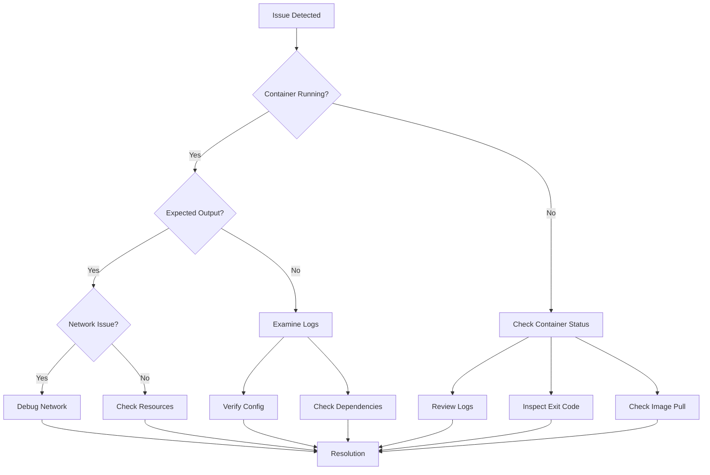
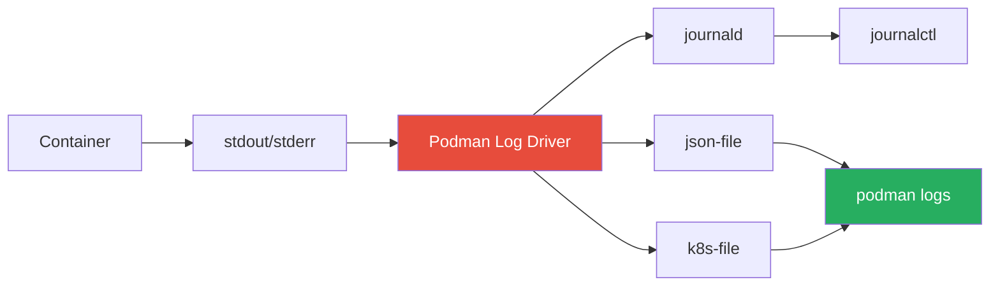
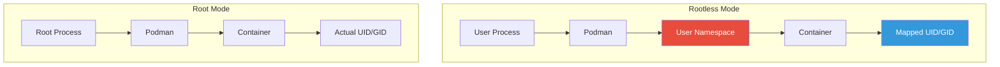
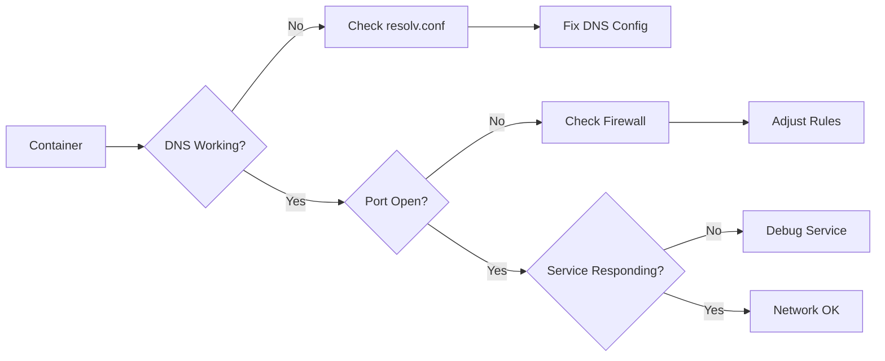
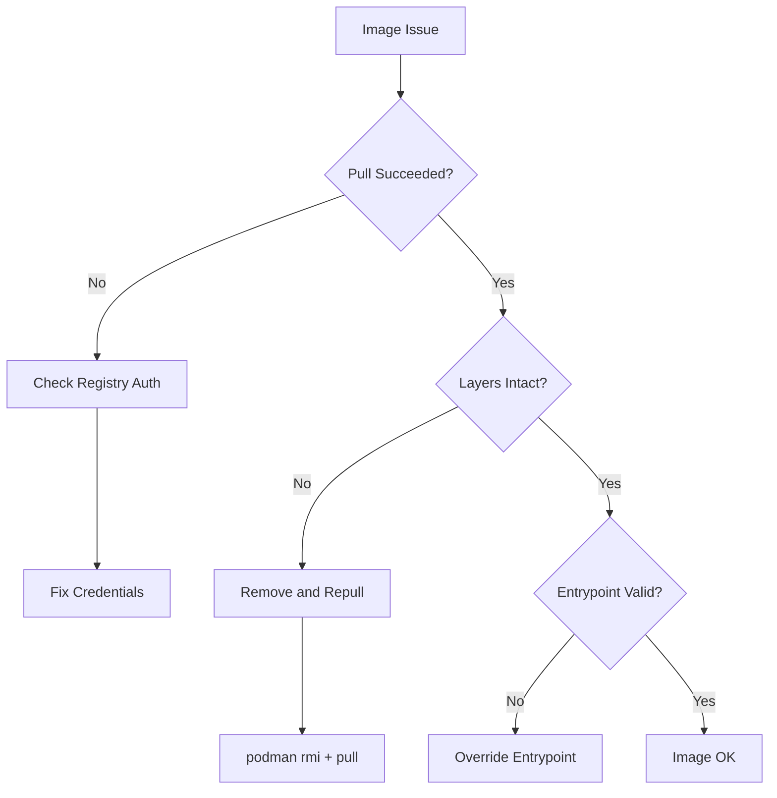
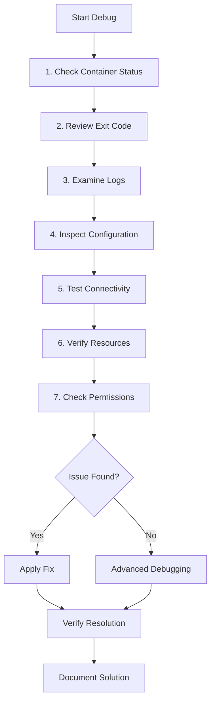
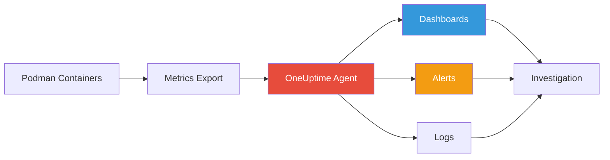

# How to Handle Podman Container Debugging

Author: [nawazdhandala](https://www.github.com/nawazdhandala)

Tags: Podman, Containers, Debugging, DevOps, Troubleshooting, Linux, OCI

Description: A practical guide to debugging Podman containers covering log analysis, interactive inspection, networking issues, rootless debugging, resource constraints, and advanced troubleshooting techniques for production environments.

---

> "The first step in fixing a problem is understanding what went wrong."

Debugging containers in Podman requires understanding both the container runtime and the application inside. Whether you're dealing with crashed processes, networking issues, or permission problems in rootless mode, having the right approach saves hours of frustration. Let me walk you through proven techniques for identifying and resolving container issues efficiently.

## Understanding the Podman Debugging Workflow

Before jumping into specific commands, establishing a systematic debugging workflow helps you approach problems methodically.



## Checking Container Status and Exit Codes

Your first step should always be understanding the current container state. Podman provides detailed status information that reveals why containers stopped or failed to start.

The following commands display container status and help identify the immediate cause of failures.

```bash
# List all containers including stopped ones
# -a shows all containers, not just running
podman ps -a

# Get detailed information about a specific container
# Returns JSON with complete container configuration and state
podman inspect <container-name-or-id>

# Check only the exit code of a stopped container
# Exit code 0 means success, non-zero indicates an error
podman inspect <container-name-or-id> --format '{{.State.ExitCode}}'

# View the container's current state (running, exited, created)
podman inspect <container-name-or-id> --format '{{.State.Status}}'

# See when the container started and stopped
podman inspect <container-name-or-id> --format 'Started: {{.State.StartedAt}} Finished: {{.State.FinishedAt}}'
```

### Common Exit Codes and Their Meanings

Exit codes help diagnose what went wrong inside the container.

| Exit Code | Meaning | Typical Cause |
|-----------|---------|---------------|
| 0 | Success | Container completed normally |
| 1 | General error | Application error, check logs |
| 125 | Container failed to run | Podman daemon error |
| 126 | Command cannot execute | Permission problem |
| 127 | Command not found | Missing binary in image |
| 137 | SIGKILL received | OOM killed or manual stop |
| 139 | SIGSEGV received | Segmentation fault in app |
| 143 | SIGTERM received | Graceful shutdown requested |

## Analyzing Container Logs

Logs reveal what happened inside the container during execution. Podman stores logs from both stdout and stderr, making them essential for troubleshooting.

Use these commands to access container logs in different scenarios.

```bash
# View all logs from a container
podman logs <container-name-or-id>

# Follow logs in real-time (like tail -f)
# Useful for monitoring running containers
podman logs -f <container-name-or-id>

# Show only the last 50 lines
podman logs --tail 50 <container-name-or-id>

# Display timestamps with each log line
# Helps correlate events with external systems
podman logs --timestamps <container-name-or-id>

# Show logs since a specific time
podman logs --since 2024-01-15T10:00:00 <container-name-or-id>

# Show logs from the last 30 minutes
podman logs --since 30m <container-name-or-id>

# Combine options for detailed debugging
podman logs --timestamps --tail 100 -f <container-name-or-id>
```

### Log Management Workflow



### Accessing Logs via journald

When using the journald log driver (default on systems with systemd), you can also query logs through journalctl.

```bash
# View container logs through journald
# Replace CONTAINER_ID with actual container ID
journalctl CONTAINER_ID=<full-container-id>

# Follow journald logs for container
journalctl -f CONTAINER_ID=<full-container-id>

# Check which log driver a container uses
podman inspect <container-name-or-id> --format '{{.HostConfig.LogConfig.Type}}'
```

## Interactive Container Debugging

Sometimes you need to get inside a container to investigate the runtime environment directly. Podman provides multiple ways to interact with running and stopped containers.

Execute commands or start interactive sessions with these approaches.

```bash
# Start an interactive shell in a running container
# -i keeps stdin open, -t allocates a tty
podman exec -it <container-name-or-id> /bin/bash

# If bash is not available, try sh
podman exec -it <container-name-or-id> /bin/sh

# Run a specific command without interactive mode
podman exec <container-name-or-id> cat /etc/hosts

# Check environment variables inside container
podman exec <container-name-or-id> env

# Inspect file permissions
podman exec <container-name-or-id> ls -la /app

# Check running processes
podman exec <container-name-or-id> ps aux

# Examine network configuration from inside
podman exec <container-name-or-id> cat /etc/resolv.conf
```

### Debugging Stopped Containers

When a container has crashed, you cannot use exec. Instead, create a new container from the same image or commit the stopped container.

```bash
# Start a new container with the same image but override entrypoint
# Useful when the default entrypoint crashes immediately
podman run -it --entrypoint /bin/sh <image-name>

# Commit a stopped container to a new image for inspection
# Preserves the filesystem state at the time of failure
podman commit <stopped-container-id> debug-image:latest

# Run the committed image with shell access
podman run -it debug-image:latest /bin/sh

# Copy files out of a stopped container for analysis
podman cp <container-name-or-id>:/app/logs/error.log ./error.log

# Mount container filesystem without starting it
podman mount <container-name-or-id>
# Returns mount path like /var/lib/containers/storage/overlay/.../merged
# Navigate to inspect files, then unmount when done
podman umount <container-name-or-id>
```

## Debugging Rootless Container Issues

Podman's rootless mode introduces unique challenges around permissions, networking, and storage. Understanding these differences helps resolve issues specific to running containers without root.



### Common Rootless Issues and Solutions

Rootless containers frequently encounter permission-related problems. Here are the most common scenarios and fixes.

```bash
# Check if running in rootless mode
podman info | grep rootless

# Verify user namespace mappings
podman unshare cat /proc/self/uid_map

# Fix permission issues with volume mounts
# The :Z option relabels for SELinux, :U maps ownership
podman run -v /host/path:/container/path:Z myimage

# Run container with --userns=keep-id to match host user
# Prevents permission issues when mounting host directories
podman run --userns=keep-id -v $HOME/data:/data myimage

# Check subuid/subgid configuration
cat /etc/subuid
cat /etc/subgid

# Reset rootless storage if corrupted
podman system reset

# Verify storage driver and path
podman info | grep -A5 "store:"
```

### Debugging Network Issues in Rootless Mode

Rootless containers use slirp4netns for networking, which has limitations compared to root mode.

```bash
# Check the network mode being used
podman inspect <container-name-or-id> --format '{{.HostConfig.NetworkMode}}'

# View rootless network configuration
podman network ls

# Inspect network details
podman network inspect podman

# Test outbound connectivity from container
podman exec <container-name-or-id> curl -v https://example.com

# Check port mappings
podman port <container-name-or-id>

# For rootless, ports below 1024 require adjustment
# Check the unprivileged port start value
sysctl net.ipv4.ip_unprivileged_port_start

# Set lower unprivileged port (requires root on host)
sudo sysctl net.ipv4.ip_unprivileged_port_start=80
```

## Network Debugging

Network connectivity problems in containers stem from DNS issues, firewall rules, or container network configuration. Systematic testing helps isolate the problem.



### DNS Troubleshooting

DNS problems cause most container networking issues. Verify resolution works correctly.

```bash
# Check DNS configuration inside container
podman exec <container-name-or-id> cat /etc/resolv.conf

# Test DNS resolution
podman exec <container-name-or-id> nslookup google.com

# If nslookup not available, try getent
podman exec <container-name-or-id> getent hosts google.com

# Create a debug container with network tools
podman run --rm -it nicolaka/netshoot nslookup google.com

# Specify custom DNS servers when running container
podman run --dns 8.8.8.8 --dns 8.8.4.4 myimage
```

### Port and Connectivity Testing

Verify that ports are correctly mapped and services are reachable.

```bash
# List all port mappings for a container
podman port <container-name-or-id>

# Test if port is listening inside container
podman exec <container-name-or-id> netstat -tlnp
# or if netstat not available
podman exec <container-name-or-id> ss -tlnp

# Test connectivity from host to container
curl -v http://localhost:<mapped-port>

# Test connectivity between containers
# First find container IP
podman inspect <container-name-or-id> --format '{{.NetworkSettings.IPAddress}}'

# Then test from another container
podman exec <other-container> curl -v http://<container-ip>:<port>

# Run debug container on same network
podman run --rm -it --network container:<target-container> nicolaka/netshoot curl localhost:<port>
```

### Firewall and SELinux Issues

Security policies can silently block container networking.

```bash
# Check if firewalld is blocking traffic (Fedora/RHEL/CentOS)
sudo firewall-cmd --list-all

# Check SELinux denials
sudo ausearch -m avc -ts recent

# Temporarily set SELinux to permissive for testing
sudo setenforce 0
# Remember to re-enable: sudo setenforce 1

# Check container SELinux label
podman inspect <container-name-or-id> --format '{{.ProcessLabel}}'

# Run container with specific SELinux options
podman run --security-opt label=disable myimage
```

## Resource Constraint Debugging

Resource limits cause containers to be killed or perform poorly. Monitoring usage helps identify when limits are too restrictive.

The following commands help diagnose resource-related problems.

```bash
# View resource limits set on a container
podman inspect <container-name-or-id> --format '{{.HostConfig.Memory}} {{.HostConfig.CpuShares}}'

# Check current resource usage
podman stats <container-name-or-id> --no-stream

# Watch resource usage in real-time
podman stats <container-name-or-id>

# Check all containers' resource usage
podman stats --all

# View cgroup settings for container
podman inspect <container-name-or-id> --format '{{.HostConfig.CgroupParent}}'

# Check if container was OOM killed
podman inspect <container-name-or-id> --format '{{.State.OOMKilled}}'
```

### Memory Debugging

Memory issues manifest as OOM kills or degraded performance.

```bash
# Check memory limit and usage
podman exec <container-name-or-id> cat /sys/fs/cgroup/memory.max 2>/dev/null || \
podman exec <container-name-or-id> cat /sys/fs/cgroup/memory/memory.limit_in_bytes

# View current memory usage
podman exec <container-name-or-id> cat /sys/fs/cgroup/memory.current 2>/dev/null || \
podman exec <container-name-or-id> cat /sys/fs/cgroup/memory/memory.usage_in_bytes

# Check for memory pressure events
dmesg | grep -i "oom\|killed"

# Run container with higher memory limit
podman run --memory 2g myimage

# Run with memory swap limit
podman run --memory 2g --memory-swap 4g myimage
```

### CPU Debugging

CPU throttling causes slowdowns without killing the container.

```bash
# Check CPU limit
podman inspect <container-name-or-id> --format '{{.HostConfig.NanoCpus}}'

# View CPU quota from inside container
podman exec <container-name-or-id> cat /sys/fs/cgroup/cpu.max 2>/dev/null

# Monitor CPU usage over time
podman stats --format "table {{.Name}}\t{{.CPUPerc}}" <container-name-or-id>

# Run with specific CPU limits
# --cpus limits total CPU usage (e.g., 1.5 CPUs)
podman run --cpus 2 myimage

# Pin container to specific CPU cores
podman run --cpuset-cpus 0,1 myimage
```

## Image and Build Debugging

Image problems prevent containers from starting or cause runtime failures. Verify images are correct and complete.



### Image Inspection

Examine image configuration to understand how it should run.

```bash
# View image layers and history
podman history <image-name>

# Inspect image configuration
podman inspect <image-name>

# Check image entrypoint and command
podman inspect <image-name> --format '{{.Config.Entrypoint}} {{.Config.Cmd}}'

# View environment variables baked into image
podman inspect <image-name> --format '{{.Config.Env}}'

# Check exposed ports
podman inspect <image-name> --format '{{.Config.ExposedPorts}}'

# Verify image integrity
podman image inspect <image-name> --format '{{.Digest}}'

# List image labels
podman inspect <image-name> --format '{{.Labels}}'
```

### Build Debugging

When container builds fail, isolate the failing step.

```bash
# Build with verbose output
podman build --log-level debug -t myapp .

# Build without cache to test reproducibility
podman build --no-cache -t myapp .

# Build up to a specific stage in multi-stage build
podman build --target builder -t myapp:builder .

# Run intermediate stage interactively
podman run -it myapp:builder /bin/sh

# Check build history for layer sizes
podman history myapp:latest --no-trunc

# Identify large layers
podman history myapp:latest --format "{{.Size}}\t{{.CreatedBy}}" | sort -hr
```

## Health Check Debugging

Health checks determine if a container is functioning correctly. When health checks fail, containers get restarted or marked unhealthy.

```bash
# View health check configuration
podman inspect <container-name-or-id> --format '{{.Config.Healthcheck}}'

# Check current health status
podman inspect <container-name-or-id> --format '{{.State.Health.Status}}'

# View health check log (last 5 results)
podman inspect <container-name-or-id> --format '{{json .State.Health.Log}}' | jq

# Manually run health check command
podman exec <container-name-or-id> <health-check-command>

# Start container with custom health check
podman run --health-cmd "curl -f http://localhost:8080/health" \
           --health-interval 30s \
           --health-retries 3 \
           --health-timeout 10s \
           myimage
```

## Pod Debugging

Podman pods group containers that share namespaces, similar to Kubernetes pods. Debug pods by examining both the infra container and application containers.

```bash
# List pods and their status
podman pod ps

# View containers in a pod
podman pod inspect <pod-name> --format '{{.Containers}}'

# Get detailed pod information
podman pod inspect <pod-name>

# Check logs from specific container in pod
podman logs <pod-name>-<container-name>

# Execute command in pod container
podman exec -it <container-id-in-pod> /bin/sh

# View pod network configuration
podman pod inspect <pod-name> --format '{{.InfraContainerID}}' | xargs podman inspect --format '{{.NetworkSettings}}'

# Restart all containers in a pod
podman pod restart <pod-name>

# View pod events and state changes
podman events --filter pod=<pod-name>
```

## Event Monitoring

Podman events provide a timeline of container lifecycle changes. Monitoring events helps identify patterns and unexpected behavior.

```bash
# Watch all events in real-time
podman events

# Filter events by container
podman events --filter container=<container-name-or-id>

# Filter by event type
podman events --filter event=start
podman events --filter event=die
podman events --filter event=oom

# View events since a specific time
podman events --since 1h

# Format event output
podman events --format '{{.Time}} {{.Type}} {{.Status}} {{.Actor.Attributes.name}}'

# Export events to JSON for analysis
podman events --format json > events.json
```

## Advanced Debugging Techniques

### Using strace for System Call Debugging

Trace system calls to understand what a process is doing at the kernel level.

```bash
# Run container with SYS_PTRACE capability for strace
podman run --cap-add SYS_PTRACE -it myimage

# Install strace inside container and trace a process
podman exec -it <container-name-or-id> /bin/sh
# Inside container:
# apk add strace (Alpine) or apt install strace (Debian/Ubuntu)
# strace -p 1

# Trace container startup from host
podman run --cap-add SYS_PTRACE myimage strace -f /entrypoint.sh
```

### Debugging with nsenter

Access container namespaces directly from the host for low-level debugging.

```bash
# Get container PID
podman inspect <container-name-or-id> --format '{{.State.Pid}}'

# Enter container network namespace
sudo nsenter -t <pid> -n ip addr

# Enter all namespaces
sudo nsenter -t <pid> -a /bin/sh

# Enter specific namespaces
sudo nsenter -t <pid> --mount --uts --ipc --net --pid /bin/sh
```

### Debugging Systemd Integration

When running Podman containers as systemd services, use systemd tools for debugging.

```bash
# Generate systemd unit file for container
podman generate systemd --name <container-name> --files

# Check service status
systemctl --user status container-<container-name>

# View service logs
journalctl --user -u container-<container-name>

# Debug service startup
systemctl --user start container-<container-name> --no-block
journalctl --user -u container-<container-name> -f
```

## Creating a Debug Toolkit Container

Keep a debug container ready with all necessary tools for troubleshooting.

The following Containerfile creates a comprehensive debugging toolkit.

```dockerfile
# Debug toolkit with comprehensive networking and system tools
FROM alpine:3.19

# Install networking tools
RUN apk add --no-cache \
    curl \
    wget \
    bind-tools \
    iputils \
    net-tools \
    tcpdump \
    iftop \
    mtr \
    nmap \
    netcat-openbsd \
    socat

# Install system debugging tools
RUN apk add --no-cache \
    strace \
    ltrace \
    htop \
    procps \
    lsof \
    file \
    vim \
    jq \
    bash

# Install performance tools
RUN apk add --no-cache \
    sysstat \
    iotop

# Set bash as default shell
SHELL ["/bin/bash", "-c"]

# Keep container running
CMD ["sleep", "infinity"]
```

Build and use the debug toolkit.

```bash
# Build the debug toolkit
podman build -t debug-toolkit:latest -f Containerfile.debug .

# Run debug toolkit connected to a container's network
podman run -d --name debugger --network container:<target-container> debug-toolkit:latest

# Execute debugging commands
podman exec -it debugger bash

# Run debug toolkit with host network for network debugging
podman run -it --rm --network host debug-toolkit:latest

# Run with full capabilities for advanced debugging
podman run -it --rm --privileged debug-toolkit:latest
```

## Debugging Checklist

Follow a systematic approach when troubleshooting container issues.



### Quick Reference Commands

Keep these commands handy for rapid troubleshooting.

```bash
# Quick status overview
podman ps -a --format "table {{.Names}}\t{{.Status}}\t{{.Ports}}"

# Find crashed containers
podman ps -a --filter status=exited --filter status=dead

# Check recent events
podman events --since 15m

# Quick resource check
podman stats --no-stream --all

# System information
podman system info

# Storage usage
podman system df

# Clean up stopped containers and unused images
podman system prune -f
```

## Monitoring with OneUptime

Production container deployments benefit from comprehensive monitoring and alerting. [OneUptime](https://oneuptime.com) provides real-time visibility into your containerized applications:

- **Container Health Monitoring**: Track container status and receive alerts on failures
- **Log Aggregation**: Centralize logs from all containers for easier debugging
- **Resource Metrics**: Monitor CPU, memory, and network usage across containers
- **Uptime Monitoring**: Ensure your containerized services are accessible
- **Incident Management**: Automated alerting and on-call scheduling when issues arise



## Best Practices for Easier Debugging

Adopt these practices to make future debugging sessions more efficient:

1. **Always set meaningful container names** - Random IDs make logs and events harder to follow
2. **Configure appropriate logging** - Ensure logs capture enough detail without overwhelming storage
3. **Use health checks** - Proactive health checking catches issues before users notice
4. **Set resource limits** - Prevents runaway containers from affecting the host
5. **Label containers** - Metadata helps filter and identify containers quickly
6. **Keep debug tools accessible** - Maintain a debug toolkit image ready for deployment
7. **Document common issues** - Build a runbook of solutions for recurring problems

---

Debugging Podman containers becomes straightforward once you develop a systematic approach. Start with status and logs, move to interactive inspection, and use advanced techniques like namespace entry when needed. Rootless mode adds complexity, but understanding user namespace mappings resolves most permission issues. With proper monitoring in place through tools like [OneUptime](https://oneuptime.com), you can catch problems early and maintain reliable containerized services.
