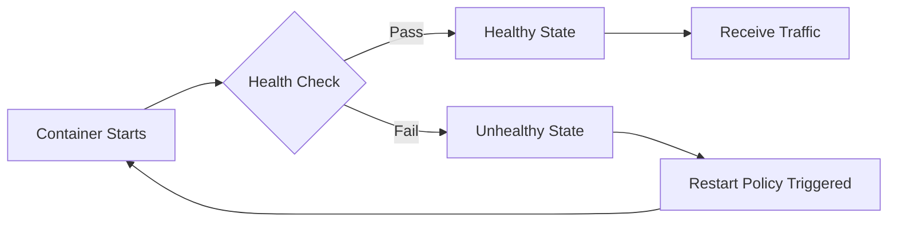
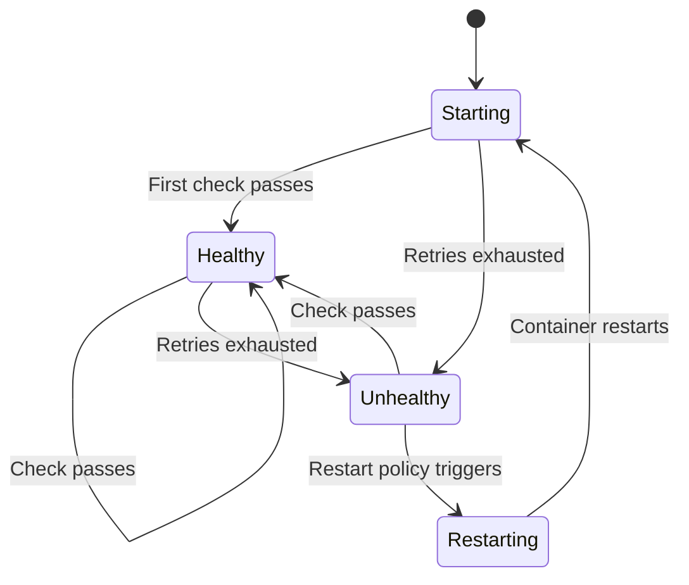
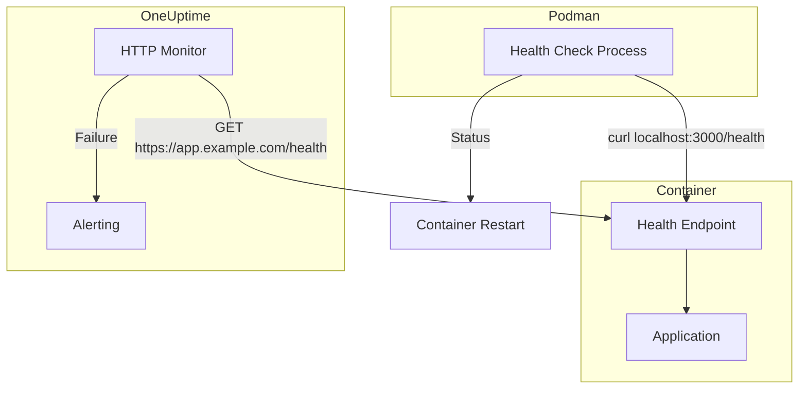

# How to Build Podman Container Health Checks

Author: [nawazdhandala](https://www.github.com/nawazdhandala)

Tags: Podman, Containers, Health Checks, DevOps, Monitoring, Linux, Orchestration

Description: A hands-on guide to implementing container health checks in Podman, covering HEALTHCHECK instructions, custom scripts, systemd integration, and production monitoring strategies.

---

Container health checks tell your orchestrator whether an application is truly ready to serve traffic or stuck in a broken state. Podman supports Docker-compatible HEALTHCHECK directives and adds its own systemd-native workflows for rootless deployments. Here is how to build robust health checks that catch failures before users do.

## Why Health Checks Matter

A container can show as "running" even when the application inside has crashed, exhausted connections, or entered a deadlock. Health checks probe the actual service state and enable:

- Automatic container restarts on failure
- Load balancer integration that routes traffic only to healthy instances
- Graceful rolling updates without serving errors



## Basic HEALTHCHECK in Containerfile

Podman reads HEALTHCHECK instructions from your Containerfile (or Dockerfile). The check runs at intervals and marks the container unhealthy after consecutive failures.

The following example defines a simple HTTP health check for a web server. It uses curl to verify the application responds on its health endpoint.

```dockerfile
FROM docker.io/library/node:20-alpine

WORKDIR /app
COPY package.json package-lock.json ./
RUN npm ci --omit=dev
COPY . .

# HEALTHCHECK parameters:
#   --interval=30s: Run the check every 30 seconds
#   --timeout=5s: Fail if the check takes longer than 5 seconds
#   --start-period=10s: Grace period for container startup
#   --retries=3: Mark unhealthy after 3 consecutive failures
# CMD: The actual health check command (must exit 0 for healthy, 1 for unhealthy)
HEALTHCHECK --interval=30s --timeout=5s --start-period=10s --retries=3 \
    CMD curl -f http://localhost:3000/health || exit 1

CMD ["node", "server.js"]
```

Build and run:

```bash
# Build the image with health check embedded
podman build -t myapp:latest .

# Run the container and verify health status
podman run -d --name myapp myapp:latest

# Check health status after start-period elapses
podman healthcheck run myapp
```

## Custom Health Check Scripts

For complex checks that verify database connections, queue depths, or external dependencies, shell scripts offer more flexibility than one-liners.

Create a dedicated health check script that validates multiple conditions before reporting healthy status.

```bash
#!/bin/sh
# healthcheck.sh
# Exit codes: 0 = healthy, 1 = unhealthy

# Verify the main HTTP endpoint responds
if ! curl -sf http://localhost:3000/health > /dev/null; then
    echo "HTTP health endpoint failed"
    exit 1
fi

# Verify database connectivity by checking a simple query
if ! nc -z localhost 5432; then
    echo "Database port not reachable"
    exit 1
fi

# Verify the application reports ready status
READY=$(curl -sf http://localhost:3000/ready | jq -r '.ready')
if [ "$READY" != "true" ]; then
    echo "Application not ready: $READY"
    exit 1
fi

echo "All health checks passed"
exit 0
```

Reference the script in your Containerfile instead of inline commands.

```dockerfile
# Copy the health check script and make it executable
COPY healthcheck.sh /usr/local/bin/healthcheck.sh
RUN chmod +x /usr/local/bin/healthcheck.sh

# Use the script for health verification
HEALTHCHECK --interval=30s --timeout=10s --retries=3 \
    CMD /usr/local/bin/healthcheck.sh
```

## Runtime Health Check Configuration

Override or define health checks at runtime without rebuilding images. Useful for testing different intervals or adding checks to third-party images.

```bash
# Run with custom health check overriding any image defaults
podman run -d --name redis \
    --health-cmd "redis-cli ping | grep -q PONG" \
    --health-interval 15s \
    --health-timeout 3s \
    --health-retries 3 \
    --health-start-period 5s \
    docker.io/library/redis:7-alpine
```

Disable health checks if an image has problematic defaults.

```bash
# Run without health checks (use only for debugging)
podman run -d --name redis --no-healthcheck docker.io/library/redis:7-alpine
```

## Inspecting Health Status

Podman stores health check results and logs for debugging. Query the current state and recent check outputs.

```bash
# Show container health status in list output
podman ps --format "table {{.Names}} {{.Status}}"

# Get detailed health check information as JSON
podman inspect myapp --format '{{json .State.Health}}' | jq

# Manually trigger a health check and see the result
podman healthcheck run myapp
```

Sample output from `podman inspect`:

```json
{
  "Status": "healthy",
  "FailingStreak": 0,
  "Log": [
    {
      "Start": "2026-02-02T10:15:30.123456789Z",
      "End": "2026-02-02T10:15:30.234567890Z",
      "ExitCode": 0,
      "Output": "All health checks passed\n"
    }
  ]
}
```

## Health Check Flow in Production

Understanding the state transitions helps you tune intervals and retries appropriately.



## Systemd Integration for Rootless Podman

Podman generates systemd unit files that integrate health checks with Linux service management. Systemd can restart containers based on health status.

```bash
# Generate a systemd service file for an existing container
podman generate systemd --new --name myapp > ~/.config/systemd/user/container-myapp.service

# Reload systemd and enable the service
systemctl --user daemon-reload
systemctl --user enable --now container-myapp.service

# Check service status including health
systemctl --user status container-myapp.service
```

Enhance the generated unit file to restart on health failures by adding a watchdog-style check.

```ini
# ~/.config/systemd/user/container-myapp.service
[Unit]
Description=MyApp Container
After=network-online.target

[Service]
Type=simple
Restart=on-failure
RestartSec=10s
# Health check integration: systemd monitors for failures
ExecStartPre=-/usr/bin/podman rm -f myapp
ExecStart=/usr/bin/podman run --name myapp --rm myapp:latest
ExecStop=/usr/bin/podman stop myapp
# Custom health monitoring via ExecCondition or timer
TimeoutStopSec=30

[Install]
WantedBy=default.target
```

## Podman Pods with Health Checks

When running multiple containers as a pod, each container maintains its own health status. Monitor the aggregate health for the pod.

```bash
# Create a pod with shared networking
podman pod create --name mystack -p 8080:80

# Add containers with individual health checks
podman run -d --pod mystack --name web \
    --health-cmd "curl -f http://localhost:80/health || exit 1" \
    --health-interval 20s \
    nginx:alpine

podman run -d --pod mystack --name api \
    --health-cmd "curl -f http://localhost:3000/ready || exit 1" \
    --health-interval 20s \
    myapi:latest

# Check health of all containers in the pod
podman pod inspect mystack --format '{{range .Containers}}{{.Name}}: {{.State}}{{"\n"}}{{end}}'
```

## Health Check Best Practices

Effective health checks balance responsiveness with resource consumption. Follow these guidelines to avoid common pitfalls.

**Keep checks lightweight.** Health checks run frequently, so avoid expensive operations like full database queries or file system scans. A simple endpoint that returns 200 OK suffices for most cases.

```javascript
// Express.js health endpoint example
// Returns immediately without database queries or heavy computation
app.get('/health', (req, res) => {
  res.status(200).json({ status: 'ok', timestamp: Date.now() });
});

// Readiness endpoint checks dependencies before accepting traffic
app.get('/ready', async (req, res) => {
  try {
    // Verify database connection pool is available
    await db.query('SELECT 1');
    res.status(200).json({ ready: true });
  } catch (err) {
    res.status(503).json({ ready: false, error: err.message });
  }
});
```

**Tune intervals for your workload.** Web services handling user traffic need faster detection (10-15 second intervals). Background workers processing queues can tolerate longer intervals (60+ seconds).

**Set appropriate start periods.** Applications that load large datasets or warm caches need longer start periods. A Java application with a 45-second startup should have at least a 60-second start period.

**Use retries to handle transient failures.** Network blips and garbage collection pauses cause occasional check failures. Set retries to 2-3 to avoid unnecessary restarts from momentary issues.

## Integrating with OneUptime

External monitoring complements in-container health checks by verifying your services from the user perspective. Configure OneUptime to poll your health endpoints and alert when checks fail.



Combining internal Podman health checks with external monitoring from OneUptime catches both application-level issues and network/infrastructure problems that internal checks cannot detect.

---

Podman health checks transform container monitoring from "is it running" to "is it working." Start with simple HTTP checks, graduate to custom scripts for complex dependencies, and integrate with systemd for production reliability. Your containers should prove their health, not just their existence.
