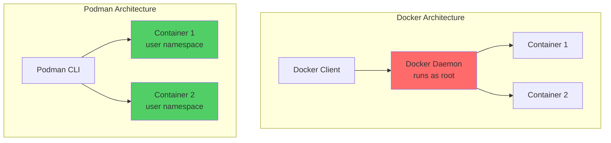
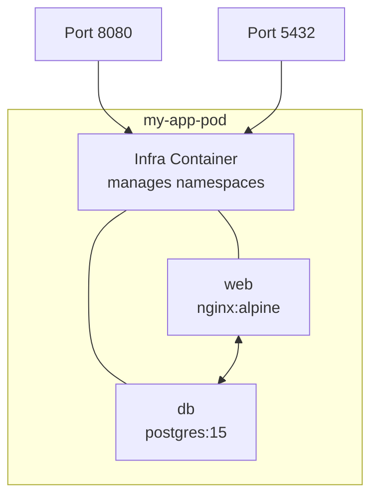

# How to Get Started with Podman

Author: [nawazdhandala](https://www.github.com/nawazdhandala)

Tags: Podman, Containers, Docker Alternative, Linux, DevOps

Description: Learn how to get started with Podman, a daemonless container engine that offers a secure, Docker-compatible alternative for running containers without root privileges.

---

> If you've been using Docker for containerization, Podman is worth a serious look. It's daemonless, rootless by default, and uses the same CLI commands. Switching is almost seamless, and you get better security out of the box.

Podman was developed by Red Hat as a more secure alternative to Docker. The biggest difference? No daemon running as root. Each container runs as a child process of the Podman command itself.

---

## Why Podman Over Docker?

| Feature | Docker | Podman |
|---------|--------|--------|
| Architecture | Client-Server (daemon) | Daemonless |
| Root Required | Yes (by default) | No (rootless by default) |
| Systemd Integration | Limited | Native |
| Kubernetes YAML | Requires conversion | Native support |
| Docker CLI Compatible | Yes | Yes |
| Security Model | Daemon runs as root | Fork-exec model |

The key advantage is the security model. Docker's daemon runs as root, which means if someone compromises your container, they potentially have root access to your host. Podman's fork-exec model means containers run as your user.

---

## Installing Podman

### Ubuntu/Debian

Install Podman from the official repositories:

```bash
# Update package index and install Podman
sudo apt update
sudo apt install -y podman
```

### Fedora/RHEL/CentOS

Podman comes pre-installed on recent Fedora versions. For RHEL/CentOS:

```bash
# Install Podman on RHEL/CentOS
sudo dnf install -y podman
```

### macOS

On macOS, Podman runs containers inside a Linux VM since containers are a Linux technology:

```bash
# Install via Homebrew
brew install podman

# Initialize the Podman machine (creates a Linux VM)
podman machine init

# Start the machine
podman machine start
```

### Verify Installation

Check that Podman is installed correctly:

```bash
# Check Podman version
podman --version

# Get detailed system information
podman info
```

---

## Your First Container

Podman uses the same commands as Docker. If you know Docker, you already know Podman.

### Running a Container

Pull and run a simple container to verify everything works:

```bash
# Run a simple container that prints a message and exits
podman run hello-world

# Run an interactive Ubuntu container
# -i: interactive, -t: allocate TTY, --rm: remove after exit
podman run -it --rm ubuntu:22.04 bash

# Run nginx in the background
# -d: detached mode, -p: port mapping (host:container)
podman run -d -p 8080:80 --name my-nginx nginx:alpine
```

### Managing Containers

Basic container management commands mirror Docker exactly:

```bash
# List running containers
podman ps

# List all containers (including stopped)
podman ps -a

# Stop a running container
podman stop my-nginx

# Start a stopped container
podman start my-nginx

# Remove a container
podman rm my-nginx

# Force remove a running container
podman rm -f my-nginx
```

### Container Logs and Inspection

Debug containers by checking logs and inspecting their configuration:

```bash
# View container logs
podman logs my-nginx

# Follow logs in real-time (like tail -f)
podman logs -f my-nginx

# Get detailed container information as JSON
podman inspect my-nginx

# Execute a command inside a running container
podman exec -it my-nginx /bin/sh
```

---

## Working with Images

### Image Management

Pull, list, and manage container images:

```bash
# Pull an image from a registry
podman pull python:3.12-slim

# List downloaded images
podman images

# Remove an image
podman rmi python:3.12-slim

# Remove all unused images
podman image prune -a
```

### Building Images

Create a Dockerfile for a simple Python application:

```dockerfile
# Dockerfile
FROM python:3.12-slim

WORKDIR /app

# Copy requirements and install dependencies
COPY requirements.txt .
RUN pip install --no-cache-dir -r requirements.txt

# Copy application code
COPY app.py .

# Create non-root user for security
RUN useradd --create-home appuser
USER appuser

EXPOSE 8000

CMD ["python", "app.py"]
```

Build the image using Podman:

```bash
# Build an image from Dockerfile in current directory
# -t: tag the image with a name
podman build -t my-python-app:latest .

# Build with a specific Dockerfile
podman build -f Dockerfile.prod -t my-python-app:prod .

# Build with build arguments
podman build --build-arg VERSION=1.0 -t my-app:1.0 .
```

---

## Rootless Containers

One of Podman's biggest advantages is running containers without root privileges. This is the default behavior.

### Understanding Rootless Mode



### Checking Rootless Status

Verify you're running in rootless mode:

```bash
# Check if running rootless
# Should show your username, not root
podman info --format '{{.Host.Security.Rootless}}'

# See the user namespace mapping
podman unshare cat /proc/self/uid_map
```

### Storage Configuration for Rootless

Configure storage for rootless containers in your home directory:

```bash
# View current storage configuration
podman info --format '{{.Store.GraphRoot}}'

# Default rootless storage location is:
# ~/.local/share/containers/storage
```

---

## Pods - Kubernetes-Style Grouping

Podman introduces the concept of pods, which group containers that share resources. This maps directly to Kubernetes pods.

### Creating and Managing Pods

Pods allow you to run multiple containers that share network and IPC namespaces:

```bash
# Create a new pod with port mapping
# All containers in this pod share the same network
podman pod create --name my-app-pod -p 8080:80 -p 5432:5432

# List all pods
podman pod ls

# Add containers to the pod
podman run -d --pod my-app-pod --name web nginx:alpine
podman run -d --pod my-app-pod --name db postgres:15-alpine

# View containers in the pod
podman pod inspect my-app-pod

# Stop all containers in a pod
podman pod stop my-app-pod

# Start the pod
podman pod start my-app-pod

# Remove the pod and all its containers
podman pod rm -f my-app-pod
```

### Pod Architecture



The infra container is automatically created to hold the namespaces. All containers in the pod communicate over localhost.

---

## Docker Compose with Podman

Podman can work with Docker Compose files using podman-compose or the built-in compose functionality.

### Using podman-compose

Install and use podman-compose for existing Docker Compose workflows:

```bash
# Install podman-compose via pip
pip install podman-compose

# Run your existing docker-compose.yml
podman-compose up -d

# Stop services
podman-compose down
```

### Native Podman Compose (v4.1+)

Recent Podman versions have built-in compose support:

```bash
# Run with native compose support
podman compose up -d

# View logs
podman compose logs -f

# Stop and remove
podman compose down
```

### Example Compose File

This compose file works with both Docker and Podman:

```yaml
# docker-compose.yml
version: '3.8'

services:
  web:
    image: nginx:alpine
    ports:
      - "8080:80"
    volumes:
      - ./html:/usr/share/nginx/html:ro
    depends_on:
      - api

  api:
    build: ./api
    environment:
      - DATABASE_URL=postgres://user:pass@db:5432/app
    depends_on:
      - db

  db:
    image: postgres:15-alpine
    environment:
      - POSTGRES_USER=user
      - POSTGRES_PASSWORD=pass
      - POSTGRES_DB=app
    volumes:
      - pgdata:/var/lib/postgresql/data

volumes:
  pgdata:
```

---

## Generating Kubernetes YAML

A unique Podman feature is generating Kubernetes-compatible YAML from running containers or pods.

### Export Running Containers

Generate Kubernetes manifests from existing containers:

```bash
# Create a container
podman run -d --name redis-server -p 6379:6379 redis:alpine

# Generate Kubernetes YAML from the running container
podman generate kube redis-server > redis-deployment.yaml

# Generate YAML for an entire pod
podman generate kube my-app-pod > my-app-pod.yaml
```

### Play Kubernetes YAML

Run Kubernetes YAML files directly with Podman:

```bash
# Create containers from Kubernetes YAML
podman play kube redis-deployment.yaml

# Stop and remove containers created from YAML
podman play kube --down redis-deployment.yaml
```

### Example Generated YAML

When you run `podman generate kube`, you get output like this:

```yaml
# Generated by Podman
apiVersion: v1
kind: Pod
metadata:
  name: redis-server
  labels:
    app: redis-server
spec:
  containers:
    - name: redis-server
      image: redis:alpine
      ports:
        - containerPort: 6379
          hostPort: 6379
      resources: {}
```

---

## Systemd Integration

Podman integrates natively with systemd, letting you manage containers as system services.

### Generating Systemd Units

Create systemd service files from running containers:

```bash
# Generate a systemd unit file for a container
podman generate systemd --name my-nginx --files --new

# This creates a file like: container-my-nginx.service
```

### Systemd Unit File Example

The generated service file handles container lifecycle:

```ini
# container-my-nginx.service
[Unit]
Description=Podman container-my-nginx.service
Documentation=man:podman-generate-systemd(1)
Wants=network-online.target
After=network-online.target
RequiresMountsFor=%t/containers

[Service]
Environment=PODMAN_SYSTEMD_UNIT=%n
Restart=on-failure
TimeoutStopSec=70
ExecStartPre=/bin/rm -f %t/%n.ctr-id
ExecStart=/usr/bin/podman run \
    --cidfile=%t/%n.ctr-id \
    --cgroups=no-conmon \
    --rm \
    --sdnotify=conmon \
    -d \
    -p 8080:80 \
    --name my-nginx nginx:alpine
ExecStop=/usr/bin/podman stop --ignore --cidfile=%t/%n.ctr-id
ExecStopPost=/usr/bin/podman rm -f --ignore --cidfile=%t/%n.ctr-id
Type=notify
NotifyAccess=all

[Install]
WantedBy=default.target
```

### Installing as a User Service

Run containers as systemd user services for rootless operation:

```bash
# Create the user systemd directory if it doesn't exist
mkdir -p ~/.config/systemd/user

# Move the generated service file
mv container-my-nginx.service ~/.config/systemd/user/

# Reload systemd to recognize the new service
systemctl --user daemon-reload

# Enable the service to start on login
systemctl --user enable container-my-nginx.service

# Start the service now
systemctl --user start container-my-nginx.service

# Check status
systemctl --user status container-my-nginx.service

# Enable lingering so services run even when not logged in
loginctl enable-linger $USER
```

---

## Volumes and Persistent Storage

### Named Volumes

Create and manage named volumes for persistent data:

```bash
# Create a named volume
podman volume create mydata

# List volumes
podman volume ls

# Inspect a volume
podman volume inspect mydata

# Use the volume in a container
podman run -d -v mydata:/data --name data-container alpine

# Remove unused volumes
podman volume prune
```

### Bind Mounts

Mount host directories into containers:

```bash
# Mount current directory as read-write
podman run -v $(pwd):/app:rw my-app

# Mount as read-only
podman run -v $(pwd)/config:/etc/app:ro my-app

# SELinux contexts (required on Fedora/RHEL)
# :z for shared, :Z for private
podman run -v $(pwd):/app:z my-app
```

---

## Networking

### Network Modes

Configure container networking to match your requirements:

```bash
# Default bridge network
podman run -d --name web nginx

# Host networking (container uses host's network stack)
podman run -d --network host --name web nginx

# No networking
podman run -d --network none --name isolated alpine

# Create a custom network
podman network create my-network

# Run container on custom network
podman run -d --network my-network --name web nginx

# Connect a running container to another network
podman network connect my-network existing-container
```

### Listing and Managing Networks

```bash
# List networks
podman network ls

# Inspect a network
podman network inspect my-network

# Remove a network
podman network rm my-network

# Remove all unused networks
podman network prune
```

---

## Docker Compatibility Alias

If you want to use `docker` commands but have them run Podman, create an alias.

### Setting Up the Alias

Add this to your shell configuration file:

```bash
# Add to ~/.bashrc or ~/.zshrc
alias docker=podman

# For docker-compose compatibility
alias docker-compose=podman-compose
```

### Socket Compatibility

For tools that connect to the Docker socket, enable the Podman socket:

```bash
# Enable and start the Podman socket (rootless)
systemctl --user enable podman.socket
systemctl --user start podman.socket

# Set the DOCKER_HOST environment variable
export DOCKER_HOST=unix://$XDG_RUNTIME_DIR/podman/podman.sock

# Test with docker CLI (if installed)
docker info
```

---

## Security Best Practices

### Drop Capabilities

Run containers with minimal privileges:

```bash
# Drop all capabilities and add only what's needed
podman run --cap-drop=ALL --cap-add=NET_BIND_SERVICE nginx

# Run with read-only root filesystem
podman run --read-only --tmpfs /tmp nginx

# Prevent privilege escalation
podman run --security-opt=no-new-privileges nginx
```

### User Namespaces

Configure user namespace mapping for additional isolation:

```bash
# Run with automatic user namespace
podman run --userns=auto nginx

# Map container root to a specific host UID
podman run --uidmap 0:10000:5000 nginx
```

---

## Migrating from Docker

### Quick Migration Steps

1. **Install Podman** on your system
2. **Create the alias**: `alias docker=podman`
3. **Move your images**: Images are compatible

### Moving Docker Images to Podman

Transfer existing Docker images to Podman:

```bash
# Export image from Docker
docker save my-image:latest | podman load

# Or use Skopeo for direct registry transfer
skopeo copy docker-daemon:my-image:latest containers-storage:my-image:latest
```

### What Works the Same

- All container commands (`run`, `stop`, `rm`, `logs`, etc.)
- Image building with Dockerfiles
- Port mapping, volumes, environment variables
- Multi-stage builds
- Most Compose files

### What's Different

- No daemon to manage
- Pods as a first-class concept
- Systemd integration
- Kubernetes YAML generation
- Rootless by default

---

## Troubleshooting Common Issues

### Permission Denied Errors

If you see permission errors in rootless mode:

```bash
# Reset storage if it gets corrupted
podman system reset

# Check storage driver
podman info --format '{{.Store.GraphDriverName}}'

# For overlay issues, ensure fuse-overlayfs is installed
sudo apt install fuse-overlayfs  # Debian/Ubuntu
sudo dnf install fuse-overlayfs  # Fedora/RHEL
```

### Port Binding Below 1024

Rootless containers can't bind to ports below 1024 by default:

```bash
# Allow rootless binding to lower ports
sudo sysctl net.ipv4.ip_unprivileged_port_start=80

# Or use port forwarding
# Map container port 80 to host port 8080
podman run -p 8080:80 nginx
```

### Network Issues

If containers can't reach the internet:

```bash
# Check if slirp4netns is installed (required for rootless networking)
which slirp4netns

# Install if missing
sudo apt install slirp4netns  # Debian/Ubuntu
sudo dnf install slirp4netns  # Fedora/RHEL
```

---

## Conclusion

Podman offers a more secure, daemonless alternative to Docker that's almost entirely compatible at the CLI level. The main benefits are:

- **No daemon required** - reduces attack surface
- **Rootless by default** - better security model
- **Pods** - native Kubernetes-style grouping
- **Systemd integration** - manage containers as services
- **Kubernetes YAML** - generate and run K8s manifests directly

For most workflows, switching from Docker to Podman is as simple as installing Podman and aliasing the commands. Your Dockerfiles, compose files, and muscle memory all transfer over.

---

*Need to monitor your containerized applications? [OneUptime](https://oneuptime.com) provides comprehensive container monitoring with health checks, resource tracking, and alerting to keep your Podman workloads running smoothly.*
