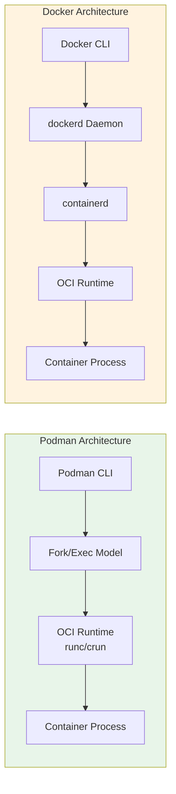
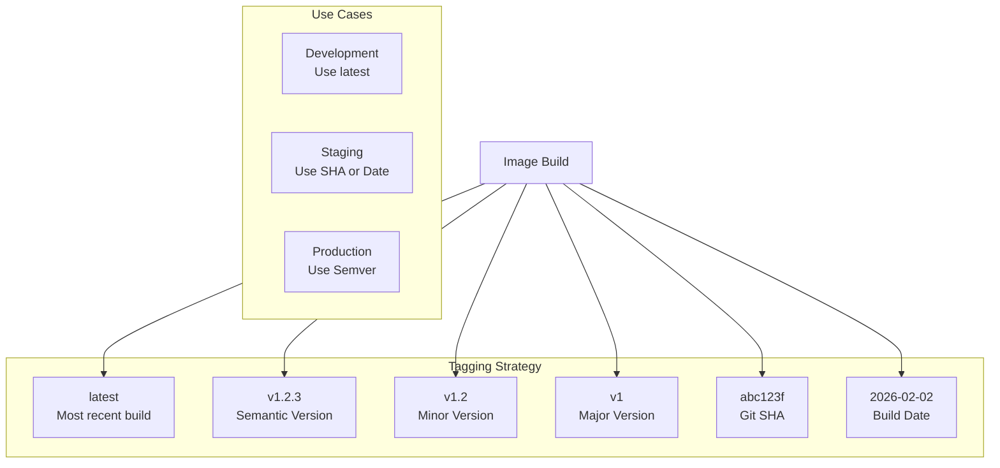
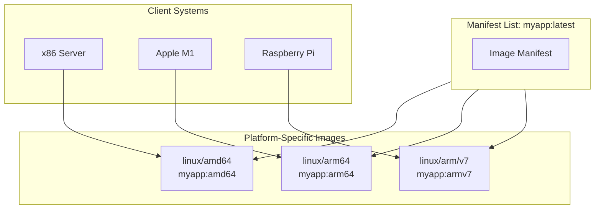

# How to Handle Podman Image Management

Author: [nawazdhandala](https://www.github.com/nawazdhandala)

Tags: Podman, Containers, Container Images, DevOps, Docker Alternative, Linux, OCI

Description: A practical guide to managing container images with Podman, covering pulling, building, tagging, pushing, cleaning, and organizing images effectively in development and production environments.

---

Container image management sits at the heart of any containerized workflow. Podman, the daemonless container engine, provides a robust set of tools for handling images without requiring root privileges or a background daemon. Whether you are migrating from Docker or starting fresh with containers, understanding Podman's image management capabilities will streamline your development and deployment processes.

## Why Podman for Image Management?



Key advantages of Podman for image management:

1. **Daemonless** - No background service required, reducing attack surface
2. **Rootless** - Run containers as a regular user without elevated privileges
3. **Docker Compatible** - Most Docker commands work identically
4. **OCI Compliant** - Uses standard Open Container Initiative image formats
5. **Pod Support** - Native Kubernetes-style pod management

## Getting Started with Podman

### Installation

Install Podman using your distribution's package manager.

```bash
# Fedora, RHEL, CentOS
sudo dnf install podman

# Ubuntu, Debian
sudo apt-get update && sudo apt-get install -y podman

# macOS (using Homebrew)
brew install podman

# Verify installation
podman --version
```

### Initial Configuration

Configure the registries Podman will search when pulling images.

```bash
# View current configuration
podman info

# Check configured registries
cat /etc/containers/registries.conf
```

Create a user-level registries configuration for custom settings.

```bash
# Create user config directory
mkdir -p ~/.config/containers/

# Create custom registries.conf
cat > ~/.config/containers/registries.conf << 'EOF'
# Search these registries when image name doesn't include registry
unqualified-search-registries = ["docker.io", "quay.io", "ghcr.io"]

# Define registry-specific settings
[[registry]]
location = "docker.io"
prefix = "docker.io"

[[registry.mirror]]
location = "mirror.gcr.io"
EOF
```

## Pulling Images

### Basic Image Pull

Retrieve images from container registries using the pull command.

```bash
# Pull from Docker Hub (default registry)
podman pull nginx:latest

# Pull with explicit registry
podman pull docker.io/library/nginx:1.25

# Pull from Quay.io
podman pull quay.io/prometheus/prometheus:latest

# Pull from GitHub Container Registry
podman pull ghcr.io/actions/runner:latest
```

### Pull Options and Verification

Podman provides options for controlling how images are pulled and verified.

```bash
# Pull all tags for an image
podman pull --all-tags nginx

# Pull without verifying TLS (use only for testing)
podman pull --tls-verify=false myregistry.local/myimage:v1

# Pull with authentication
podman login docker.io
podman pull docker.io/private/myimage:latest

# Pull with platform specification for multi-arch images
podman pull --platform linux/arm64 nginx:latest

# Quiet mode for scripts
podman pull -q nginx:latest
```

### Working with Image Digests

Pin images to specific digests for reproducibility.

```bash
# Pull by digest for guaranteed reproducibility
podman pull nginx@sha256:abc123...

# Get the digest of a local image
podman inspect --format '{{.Digest}}' nginx:latest

# List images with their digests
podman images --digests
```

## Listing and Inspecting Images

### View Local Images

Display images stored in the local repository.

```bash
# List all images
podman images

# List with specific format
podman images --format "table {{.Repository}}\t{{.Tag}}\t{{.Size}}\t{{.Created}}"

# List only image IDs
podman images -q

# Show all images including intermediate layers
podman images -a

# Filter images by reference
podman images "nginx*"

# Filter by dangling status (images without tags)
podman images --filter dangling=true
```

### Inspect Image Details

Examine image metadata and configuration.

```bash
# Full JSON inspection
podman inspect nginx:latest

# Get specific fields
podman inspect --format '{{.Config.Cmd}}' nginx:latest

# View exposed ports
podman inspect --format '{{.Config.ExposedPorts}}' nginx:latest

# Check image layers
podman inspect --format '{{.RootFS.Layers}}' nginx:latest

# View environment variables
podman inspect --format '{{range .Config.Env}}{{println .}}{{end}}' nginx:latest
```

### Image History

View the build history and layers of an image.

```bash
# Show image history with all layers
podman history nginx:latest

# Show history with full commands (not truncated)
podman history --no-trunc nginx:latest

# Get history in JSON format
podman history --format json nginx:latest

# Human-readable format
podman history --format "table {{.ID}}\t{{.CreatedBy}}\t{{.Size}}" nginx:latest
```

## Building Images

### Dockerfile-based Builds

Build images from Containerfiles or Dockerfiles.

```bash
# Build from Containerfile in current directory
podman build -t myapp:v1 .

# Build from specific file
podman build -f Containerfile.prod -t myapp:prod .

# Build with build arguments
podman build --build-arg VERSION=1.2.3 -t myapp:v1 .

# Build without cache
podman build --no-cache -t myapp:v1 .

# Build with multiple tags
podman build -t myapp:v1 -t myapp:latest .
```

Here is an example Containerfile demonstrating multi-stage builds.

```dockerfile
# Containerfile
# Stage 1: Build the application
FROM golang:1.21 AS builder

WORKDIR /app

# Copy dependency files first for better caching
COPY go.mod go.sum ./
RUN go mod download

# Copy source code and build
COPY . .
RUN CGO_ENABLED=0 GOOS=linux go build -o /app/server ./cmd/server

# Stage 2: Create minimal runtime image
FROM scratch

# Copy the binary from builder stage
COPY --from=builder /app/server /server

# Copy CA certificates for HTTPS
COPY --from=builder /etc/ssl/certs/ca-certificates.crt /etc/ssl/certs/

EXPOSE 8080
ENTRYPOINT ["/server"]
```

Build the multi-stage image with detailed output.

```bash
# Build with progress output
podman build --progress=plain -t myapp:v1 .

# Build with squash to reduce layers
podman build --squash -t myapp:v1 .

# Build for specific platform
podman build --platform linux/amd64 -t myapp:amd64 .
```

### Buildah Integration

Podman integrates with Buildah for advanced image building.

```bash
# Create a container from base image
container=$(buildah from alpine:latest)

# Run commands in the container
buildah run $container -- apk add --no-cache python3

# Copy files into the container
buildah copy $container ./app /app

# Set configuration
buildah config --entrypoint '["/app/start.sh"]' $container
buildah config --port 8080 $container

# Commit to image
buildah commit $container myapp:v1

# Clean up
buildah rm $container
```

## Tagging Images

### Create and Manage Tags

Organize images with meaningful tags.

```bash
# Add a new tag to an existing image
podman tag nginx:latest myregistry.com/nginx:v1.25

# Tag with multiple registries
podman tag myapp:latest \
  docker.io/myuser/myapp:latest \
  quay.io/myuser/myapp:latest \
  ghcr.io/myuser/myapp:latest

# Tag with semantic versioning
podman tag myapp:latest myapp:1.0.0
podman tag myapp:latest myapp:1.0
podman tag myapp:latest myapp:1
```

### Tagging Strategies

The following diagram illustrates common tagging patterns for container images.



Implement an automated tagging script for CI/CD pipelines.

```bash
#!/bin/bash
# tag-image.sh - Automated image tagging script

IMAGE_NAME="myapp"
REGISTRY="docker.io/myuser"
VERSION="${1:-$(git describe --tags --always)}"
SHA=$(git rev-parse --short HEAD)
DATE=$(date +%Y-%m-%d)

# Build the image
podman build -t "${IMAGE_NAME}:build" .

# Apply multiple tags for different use cases
podman tag "${IMAGE_NAME}:build" "${REGISTRY}/${IMAGE_NAME}:latest"
podman tag "${IMAGE_NAME}:build" "${REGISTRY}/${IMAGE_NAME}:${VERSION}"
podman tag "${IMAGE_NAME}:build" "${REGISTRY}/${IMAGE_NAME}:${SHA}"
podman tag "${IMAGE_NAME}:build" "${REGISTRY}/${IMAGE_NAME}:${DATE}"

# List all tags
echo "Created tags:"
podman images "${REGISTRY}/${IMAGE_NAME}" --format "{{.Repository}}:{{.Tag}}"
```

## Pushing Images

### Push to Registries

Upload local images to container registries.

```bash
# Login to registry first
podman login docker.io
podman login quay.io

# Push image to Docker Hub
podman push myuser/myapp:v1 docker.io/myuser/myapp:v1

# Push to Quay.io
podman push myapp:latest quay.io/myuser/myapp:latest

# Push all tags for an image
podman push --all-tags myuser/myapp docker.io/myuser/myapp

# Push with compression (default is gzip)
podman push --compression-format zstd myapp:v1 registry.local/myapp:v1
```

### Push to Private Registries

Configure authentication and push to private registries.

```bash
# Login with username and password
podman login myregistry.example.com

# Login with credentials from stdin (for scripts)
echo "$REGISTRY_PASSWORD" | podman login -u myuser --password-stdin myregistry.example.com

# Push to private registry
podman push myapp:v1 myregistry.example.com/myapp:v1

# Push with specific TLS settings
podman push --tls-verify=true \
  --cert-dir=/etc/containers/certs.d/myregistry.example.com \
  myapp:v1 myregistry.example.com/myapp:v1
```

### Authentication Management

Manage registry credentials securely.

```bash
# View logged-in registries
podman login --get-login docker.io

# Logout from registry
podman logout docker.io

# Logout from all registries
podman logout --all

# Authentication file location
ls ~/.local/share/containers/auth.json
```

## Image Cleanup and Storage Management

### Remove Images

Clean up unused images to reclaim disk space.

```bash
# Remove specific image
podman rmi nginx:latest

# Remove by image ID
podman rmi abc123

# Remove multiple images
podman rmi nginx:latest alpine:latest ubuntu:latest

# Force remove (even if used by stopped containers)
podman rmi -f myapp:old

# Remove all unused images
podman image prune

# Remove all unused images including tagged ones
podman image prune -a

# Remove with force (skip confirmation)
podman image prune -a -f
```

### Storage Analysis

Understand and manage container storage.

```bash
# Check total storage usage
podman system df

# Detailed storage information
podman system df -v

# View storage information in JSON
podman system df --format json
```

### Automated Cleanup

Set up automated cleanup routines.

```bash
#!/bin/bash
# cleanup-images.sh - Automated image cleanup script

echo "Starting image cleanup..."

# Remove dangling images (untagged)
echo "Removing dangling images..."
podman image prune -f

# Remove images older than 30 days
echo "Removing images older than 30 days..."
podman images --format "{{.ID}} {{.CreatedAt}}" | while read id created; do
    created_date=$(echo "$created" | cut -d' ' -f1)
    if [[ $(date -d "$created_date" +%s) -lt $(date -d "30 days ago" +%s) ]]; then
        echo "Removing old image: $id"
        podman rmi -f "$id" 2>/dev/null || true
    fi
done

# Show remaining storage usage
echo "Current storage usage:"
podman system df

echo "Cleanup complete."
```

### Prune Everything

Perform comprehensive cleanup of all unused resources.

```bash
# Remove all unused data (images, containers, volumes)
podman system prune

# Remove everything including volumes
podman system prune --all --volumes

# Force without confirmation
podman system prune -a -f --volumes
```

## Saving and Loading Images

### Export Images for Transfer

Save images to archives for offline transfer.

```bash
# Save image to tar archive
podman save -o nginx.tar nginx:latest

# Save with compression
podman save nginx:latest | gzip > nginx.tar.gz

# Save multiple images to single archive
podman save -o images.tar nginx:latest alpine:latest redis:latest

# Save with specific format
podman save --format oci-archive -o nginx-oci.tar nginx:latest
```

### Load Images from Archives

Import images from previously saved archives.

```bash
# Load from tar file
podman load -i nginx.tar

# Load from compressed archive
gunzip -c nginx.tar.gz | podman load

# Load with quiet output
podman load -q -i images.tar
```

### Export Container Filesystem

Export a container's filesystem as an image archive.

```bash
# Create a container from an image
podman create --name temp-container nginx:latest

# Export container filesystem
podman export temp-container -o nginx-filesystem.tar

# Import as new image
podman import nginx-filesystem.tar mynginx:imported

# Clean up temporary container
podman rm temp-container
```

## Multi-Architecture Images

### Build Multi-Arch Images

Create images that run on multiple CPU architectures.

```bash
# Create a manifest list for multi-arch image
podman manifest create myapp:latest

# Build for AMD64
podman build --platform linux/amd64 -t myapp:amd64 .
podman manifest add myapp:latest myapp:amd64

# Build for ARM64
podman build --platform linux/arm64 -t myapp:arm64 .
podman manifest add myapp:latest myapp:arm64

# Push the manifest list
podman manifest push --all myapp:latest docker.io/myuser/myapp:latest
```

The following diagram shows how manifest lists work for multi-arch support.



### Inspect Multi-Arch Images

View details about multi-architecture images.

```bash
# Inspect manifest list
podman manifest inspect docker.io/library/nginx:latest

# List local manifests
podman manifest exists myapp:latest

# Remove manifest list
podman manifest rm myapp:latest
```

## Image Security

### Scan Images for Vulnerabilities

Integrate vulnerability scanning into your workflow.

```bash
# Pull and scan with Trivy (external tool)
trivy image nginx:latest

# Scan local images
trivy image --input nginx.tar

# Generate scan report
trivy image --format json -o scan-results.json nginx:latest
```

### Sign Images

Sign images to ensure authenticity.

```bash
# Generate a GPG key if needed
gpg --full-generate-key

# Sign an image
podman push --sign-by your-email@example.com myapp:v1 docker.io/myuser/myapp:v1

# Configure signature storage
cat >> /etc/containers/registries.d/default.yaml << 'EOF'
docker:
  docker.io:
    sigstore: https://sigstore.example.com
EOF
```

### Image Trust Policies

Configure policies for image verification.

```bash
# Create trust policy
cat > /etc/containers/policy.json << 'EOF'
{
    "default": [{"type": "insecureAcceptAnything"}],
    "transports": {
        "docker": {
            "docker.io/myuser": [
                {
                    "type": "signedBy",
                    "keyType": "GPGKeys",
                    "keyPath": "/etc/pki/rpm-gpg/RPM-GPG-KEY-myuser"
                }
            ]
        }
    }
}
EOF
```

## Best Practices

### 1. Use Specific Tags in Production

Avoid using `latest` tag in production environments.

```bash
# Development - acceptable to use latest
podman pull nginx:latest

# Production - always use specific versions
podman pull nginx:1.25.3
podman pull nginx@sha256:abc123...
```

### 2. Implement Layered Caching

Structure Dockerfiles to maximize build cache efficiency.

```dockerfile
# Containerfile with optimized layer caching

# Base image changes rarely - cached long term
FROM node:20-alpine

WORKDIR /app

# Dependencies change occasionally - copy package files first
COPY package.json package-lock.json ./
RUN npm ci --production

# Application code changes frequently - copy last
COPY . .

# Build application
RUN npm run build

CMD ["node", "dist/server.js"]
```

### 3. Clean Up Build Artifacts

Reduce image size by removing unnecessary files.

```dockerfile
# Single RUN command to avoid layer bloat
RUN apk add --no-cache \
        build-base \
        python3-dev \
    && pip install --no-cache-dir -r requirements.txt \
    && apk del build-base python3-dev \
    && rm -rf /var/cache/apk/* /root/.cache
```

### 4. Use .containerignore

Exclude unnecessary files from build context.

```bash
# .containerignore
.git
.gitignore
*.md
Dockerfile*
docker-compose*
.env*
node_modules
__pycache__
*.pyc
.pytest_cache
coverage
.coverage
*.log
```

### 5. Regular Maintenance Schedule

Establish a routine for image maintenance.

```bash
#!/bin/bash
# weekly-maintenance.sh

echo "=== Weekly Image Maintenance ==="

# Update base images
echo "Pulling latest base images..."
podman pull alpine:latest
podman pull nginx:latest
podman pull node:20-alpine

# Clean up old images
echo "Removing unused images..."
podman image prune -a -f --filter "until=168h"

# Show storage report
echo "Storage usage report:"
podman system df

# List images by size
echo "Largest images:"
podman images --format "table {{.Size}}\t{{.Repository}}:{{.Tag}}" | sort -rh | head -10
```

## Troubleshooting

### Common Issues and Solutions

Resolve frequent problems with image management.

```bash
# Issue: Permission denied when pulling
# Solution: Check user namespaces
podman unshare cat /proc/self/uid_map

# Issue: Image not found in local storage
# Solution: Check all storage locations
podman images -a
podman image exists nginx:latest

# Issue: Storage space exhausted
# Solution: Clean up and check storage
podman system prune -a -f
podman system df -v

# Issue: Registry authentication failures
# Solution: Re-authenticate and check credentials
podman logout --all
podman login docker.io

# Issue: Corrupted storage
# Solution: Reset storage (WARNING: removes all data)
podman system reset
```

### Debug Image Builds

Investigate build failures with detailed output.

```bash
# Build with verbose output
podman build --log-level debug -t myapp:v1 .

# Build specific stage for debugging
podman build --target builder -t myapp:builder .

# Run failed build stage interactively
podman run -it myapp:builder /bin/sh
```

---

Effective image management forms the foundation of a reliable container workflow. Podman provides all the tools needed to pull, build, tag, push, and maintain container images without the complexity of a daemon-based architecture. By implementing proper tagging strategies, regular cleanup routines, and security scanning, you can maintain a healthy image repository that supports both development and production workloads.
