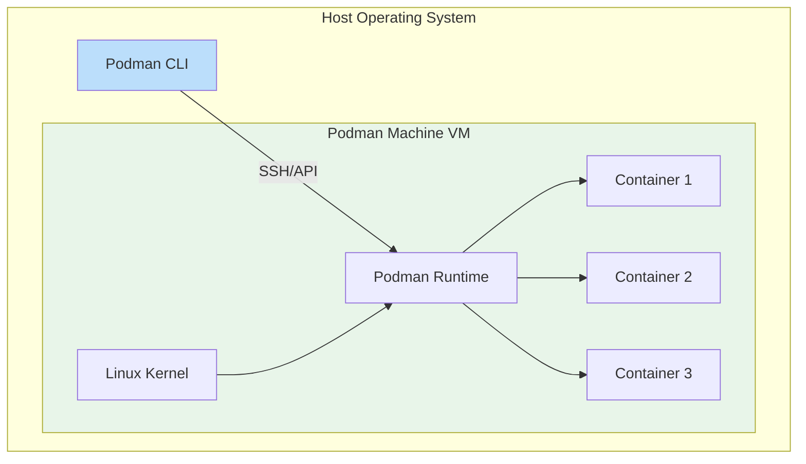
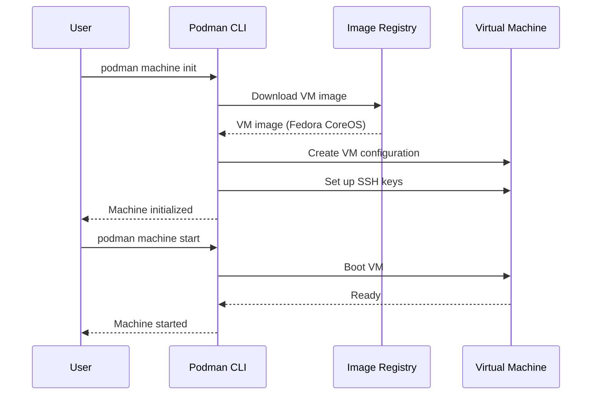
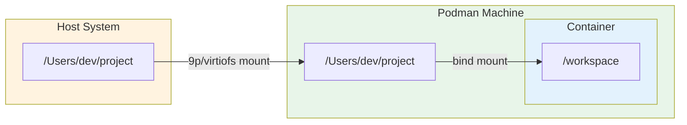
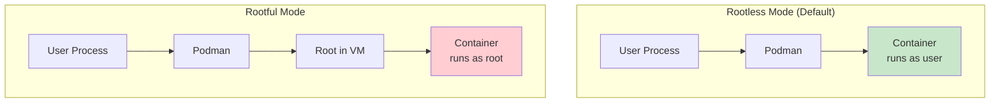
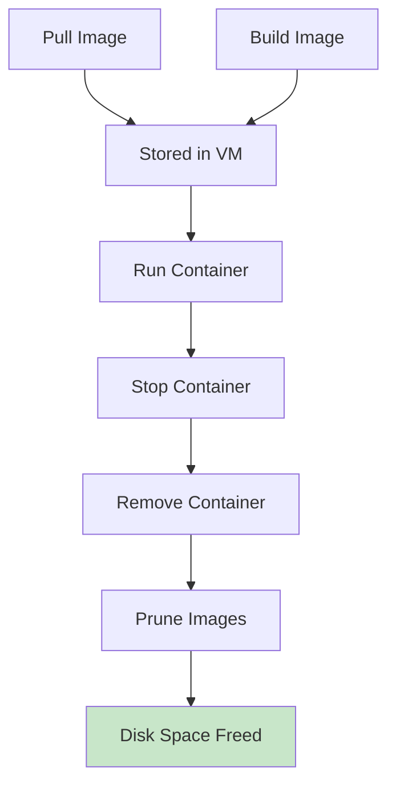
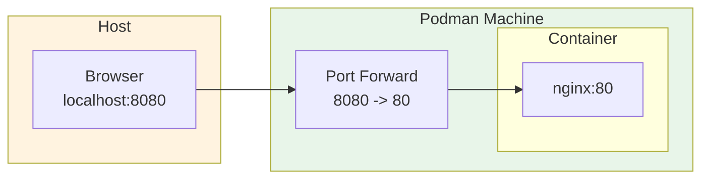
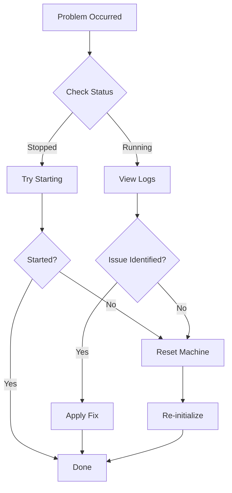

# How to Use Podman Machine on macOS/Windows

Author: [nawazdhandala](https://www.github.com/nawazdhandala)

Tags: Podman, Containers, macOS, Windows, Virtual Machine, DevOps, Docker Alternative

Description: Learn how to set up and use Podman Machine on macOS and Windows, covering installation, configuration, resource management, and advanced features for running Linux containers on non-Linux systems.

---

> Running Linux containers on macOS or Windows requires a Linux virtual machine under the hood. Podman Machine handles the complexity of managing that VM, giving you a seamless container experience without needing to configure virtualization yourself.

Containers are a Linux technology at their core. When you run containers on macOS or Windows, something needs to provide that Linux kernel. Docker Desktop uses a hidden virtual machine, and Podman does the same with Podman Machine - but with more transparency and control over the underlying VM.

---

## How Podman Machine Works

Podman Machine creates and manages a lightweight Linux virtual machine that runs your containers. On macOS, it uses Apple's native virtualization framework (or QEMU), while on Windows, it leverages WSL 2 (Windows Subsystem for Linux).



The architecture keeps the complexity hidden. You run `podman` commands on your host, and they seamlessly execute inside the Linux VM where the actual containers live.

---

## Installing Podman on macOS

### Using Homebrew

Homebrew provides the easiest installation path on macOS:

```bash
# Install Podman using Homebrew package manager
brew install podman
```

### Verifying Installation

After installation, verify that Podman is available:

```bash
# Check the installed Podman version
podman --version

# Expected output: podman version 5.x.x (or similar)
```

### Alternative: Official Installer

Podman also provides a graphical installer for macOS. Download the `.pkg` file from the official Podman releases page on GitHub and run the installer.

---

## Installing Podman on Windows

### Prerequisites

Windows requires WSL 2 (Windows Subsystem for Linux 2) for Podman Machine. Enable it first:

```powershell
# Run PowerShell as Administrator to enable WSL
wsl --install

# After the system restarts, set WSL 2 as the default version
wsl --set-default-version 2
```

### Installing via Winget

Use Windows Package Manager for the simplest installation:

```powershell
# Install Podman using winget
winget install -e --id RedHat.Podman
```

### Installing via MSI

Download the official MSI installer from the Podman GitHub releases page and run it. The installer handles PATH configuration automatically.

### Verifying Installation

Open a new PowerShell or Command Prompt window:

```powershell
# Verify Podman is installed correctly
podman --version
```

---

## Initializing Your First Machine

### Creating a Default Machine

Initialize a new Podman machine with default settings:

```bash
# Initialize a new Podman machine named 'podman-machine-default'
# Downloads the machine image on first run (may take a few minutes)
podman machine init
```

### Machine Initialization Flow



### Starting the Machine

After initialization, start the machine:

```bash
# Start the Podman machine
# First start may take longer as it boots the VM
podman machine start
```

### Verifying the Machine is Running

Confirm the machine is operational:

```bash
# List all Podman machines and their status
podman machine list

# Get detailed system information
podman info
```

---

## Customizing Machine Resources

### Specifying Resources During Init

Control CPU, memory, and disk allocation when creating the machine:

```bash
# Create a machine with custom resources
# --cpus: Number of CPU cores for the VM
# --memory: RAM in MB (4096 = 4GB)
# --disk-size: Disk size in GB
podman machine init \
    --cpus 4 \
    --memory 4096 \
    --disk-size 50
```

### Resource Recommendations by Workload

| Workload Type | CPUs | Memory | Disk |
|--------------|------|--------|------|
| Light (single container) | 1 | 2048 MB | 20 GB |
| Development (multiple services) | 2-4 | 4096 MB | 50 GB |
| Heavy (large builds, databases) | 4-8 | 8192 MB | 100 GB |

### Modifying Existing Machines

To change resources on an existing machine, you need to stop it, remove it, and create a new one:

```bash
# Stop the running machine
podman machine stop

# Remove the existing machine (data will be lost)
podman machine rm

# Create a new machine with updated resources
podman machine init --cpus 4 --memory 8192 --disk-size 100
```

---

## Multiple Machines

### Creating Named Machines

Run multiple machines for different projects or environments:

```bash
# Create a machine specifically for development work
podman machine init dev-machine --cpus 2 --memory 4096

# Create a separate machine for testing
podman machine init test-machine --cpus 1 --memory 2048

# Create a machine for CI/CD workloads
podman machine init ci-machine --cpus 4 --memory 8192
```

### Listing All Machines

View all configured machines:

```bash
# Show all machines with their status and resources
podman machine list

# Example output:
# NAME                    VM TYPE     CREATED      LAST UP      CPUS  MEMORY   DISK SIZE
# podman-machine-default  applehv     2 days ago   Running      2     2048MB   100GB
# dev-machine             applehv     1 hour ago   Stopped      4     4096MB   50GB
# test-machine            applehv     30 mins ago  Stopped      1     2048MB   20GB
```

### Switching Between Machines

Set the active machine for Podman commands:

```bash
# Start a specific machine by name
podman machine start dev-machine

# Stop the currently running machine
podman machine stop

# Stop a specific machine
podman machine stop test-machine
```

---

## Mounting Host Directories

### Default Mount Behavior

Podman Machine mounts your home directory by default, making host files accessible inside containers:

```bash
# Run a container with access to current directory
# The path automatically maps to the same path inside the VM
podman run -v $(pwd):/workspace:z -it alpine ls /workspace
```

### macOS Volume Mounts

On macOS, configure additional mount points during initialization:

```bash
# Create a machine with additional volume mounts
# --volume: Mount host path to VM path
podman machine init \
    --volume /path/on/host:/path/in/vm \
    --volume /Users/Shared:/shared
```

### Windows Volume Mounts

On Windows with WSL 2, Windows drives are accessible through /mnt:

```bash
# Access Windows C: drive from within containers
podman run -v /mnt/c/Projects:/projects:z -it alpine ls /projects
```

### Volume Architecture



---

## Rootful vs Rootless Mode

### Understanding the Modes

Podman Machine can run in rootless mode (default) or rootful mode:



### Creating a Rootful Machine

Some workloads require root privileges inside the VM:

```bash
# Initialize a rootful machine for privileged operations
podman machine init --rootful
```

### Toggling Rootful Mode

Switch modes on an existing machine:

```bash
# Enable rootful mode on existing machine
podman machine set --rootful

# Disable rootful mode (switch back to rootless)
podman machine set --rootful=false

# Restart the machine for changes to take effect
podman machine stop && podman machine start
```

### When to Use Rootful Mode

- Building images that require privileged operations
- Running containers that bind to ports below 1024
- Accessing certain hardware devices
- Testing production configurations that run as root

---

## SSH Access to the Machine

### Connecting to the VM

Access the underlying Linux VM directly via SSH:

```bash
# SSH into the default machine
podman machine ssh

# SSH into a specific machine
podman machine ssh dev-machine

# Run a single command via SSH
podman machine ssh -- cat /etc/os-release
```

### Common SSH Use Cases

Explore the VM environment and troubleshoot issues:

```bash
# Check disk usage inside the VM
podman machine ssh -- df -h

# View running processes
podman machine ssh -- ps aux

# Check available memory
podman machine ssh -- free -m

# Inspect container storage
podman machine ssh -- ls -la /var/lib/containers
```

### Advanced: Using Standard SSH

Get the SSH configuration for use with standard SSH clients:

```bash
# Display SSH connection details
podman machine inspect --format '{{.SSHConfig.IdentityPath}}'

# The machine's SSH port and key location are in the machine config
podman machine inspect
```

---

## Managing Machine Storage

### Checking Disk Usage

Monitor disk space consumed by images and containers:

```bash
# View overall system disk usage
podman system df

# View detailed breakdown of disk usage
podman system df -v

# Example output shows images, containers, and volumes
```

### Cleaning Up Space

Remove unused resources to free disk space:

```bash
# Remove dangling images (untagged and unused)
podman image prune

# Remove all unused images (not just dangling)
podman image prune -a

# Remove stopped containers
podman container prune

# Remove unused volumes
podman volume prune

# Nuclear option: remove everything unused
podman system prune -a
```

### Storage Lifecycle



---

## Networking Configuration

### Port Forwarding

Expose container ports to your host machine:

```bash
# Run nginx and expose port 8080 on the host
# -p HOST_PORT:CONTAINER_PORT
podman run -d -p 8080:80 nginx

# Access via http://localhost:8080
```

### How Port Forwarding Works



### Networking Modes

Configure network behavior for different scenarios:

```bash
# Default bridge networking
podman run -d --network bridge nginx

# Host networking (container shares VM's network)
podman run -d --network host nginx

# Disable networking entirely
podman run -d --network none alpine sleep infinity

# Create custom network for container communication
podman network create mynet
podman run -d --network mynet --name web nginx
podman run -d --network mynet --name api myapi
```

---

## Docker Compatibility

### Socket Compatibility

Enable Docker API compatibility for tools that expect Docker:

```bash
# Check if the Docker socket is available
ls -la ~/.local/share/containers/podman/machine/*/podman.sock

# Set DOCKER_HOST to use Podman as Docker
export DOCKER_HOST="unix://$HOME/.local/share/containers/podman/machine/podman-machine-default/podman.sock"
```

### Docker Compose Support

Run Docker Compose files with Podman:

```bash
# Native Podman compose (built-in)
podman compose up -d

# Or use podman-compose (Python-based)
pip install podman-compose
podman-compose up -d
```

### Creating a Docker Alias

Seamlessly use Docker commands with Podman:

```bash
# Add to ~/.bashrc or ~/.zshrc
alias docker=podman
alias docker-compose='podman compose'
```

---

## Troubleshooting Common Issues

### Machine Won't Start

Address startup failures with these steps:

```bash
# Check machine status and errors
podman machine list
podman machine info

# View machine logs for error details
podman machine logs

# Reset the machine if corrupted
podman machine rm
podman machine init
```

### Permission Denied Errors

Handle permission issues in rootless mode:

```bash
# Ensure proper permissions on socket
podman machine ssh -- ls -la /run/user/$(id -u)/podman/podman.sock

# Switch to rootful mode if needed
podman machine set --rootful
podman machine stop && podman machine start
```

### Slow Performance

Optimize machine performance:

```bash
# Increase allocated resources
podman machine rm
podman machine init --cpus 4 --memory 8192

# Use virtio-fs for better file mount performance (macOS)
podman machine init --volume-driver virtio-fs
```

### Network Connectivity Issues

Debug container networking problems:

```bash
# Test DNS resolution inside a container
podman run --rm alpine nslookup google.com

# Test outbound connectivity
podman run --rm alpine ping -c 3 8.8.8.8

# Check VM network configuration
podman machine ssh -- ip addr
```

### Troubleshooting Flow



---

## Machine Lifecycle Management

### Stopping and Starting

Control machine state for resource management:

```bash
# Stop the machine (preserves data)
podman machine stop

# Start a stopped machine
podman machine start

# Restart the machine
podman machine stop && podman machine start
```

### Removing Machines

Delete machines you no longer need:

```bash
# Remove a stopped machine (prompts for confirmation)
podman machine rm

# Remove a specific machine by name
podman machine rm dev-machine

# Force remove without confirmation
podman machine rm -f test-machine
```

### Complete Reset

Start fresh if issues persist:

```bash
# Remove the current machine
podman machine rm

# Clean up any remaining Podman data
podman system reset

# Initialize a new machine
podman machine init
```

---

## Best Practices

### Resource Allocation

Allocate resources based on your typical workload:

```bash
# Development machine with moderate resources
podman machine init \
    --cpus 2 \
    --memory 4096 \
    --disk-size 50

# Start with conservative settings and increase as needed
```

### Regular Maintenance

Keep your machine healthy with routine cleanup:

```bash
# Weekly cleanup script
podman system prune -a --volumes

# Check disk usage before heavy builds
podman system df
```

### Using Multiple Machines Effectively

Isolate different workloads:

```bash
# Lightweight machine for quick tests
podman machine init quick-test --cpus 1 --memory 1024

# Heavy machine for builds and databases
podman machine init build-env --cpus 4 --memory 8192 --disk-size 100
```

### Security Considerations

Follow security best practices:

```bash
# Prefer rootless mode (default)
# Only use rootful when absolutely necessary
podman machine init  # Creates rootless by default

# Keep the machine image updated
podman machine rm
podman machine init  # Downloads latest image
```

---

## Platform-Specific Notes

### macOS Considerations

Apple's virtualization framework provides the best performance on modern Macs:

```bash
# Check which virtualization provider is being used
podman machine info --format '{{.Host.MachineState}}'

# Apple Silicon (M1/M2/M3) uses Apple Virtualization Framework
# Intel Macs may use QEMU
```

### Windows Considerations

WSL 2 integration on Windows requires specific configuration:

```powershell
# Ensure WSL 2 is the default
wsl --set-default-version 2

# List installed WSL distributions
wsl --list --verbose

# The Podman machine appears as a WSL distribution
```

---

## Conclusion

Podman Machine bridges the gap between macOS/Windows and Linux containers. By managing a lightweight VM transparently, it delivers a native container experience without requiring you to understand virtualization internals.

Key takeaways:

- **Simple setup**: `podman machine init && podman machine start` gets you running
- **Resource control**: Customize CPU, memory, and disk for your workload
- **Multiple machines**: Isolate projects with separate VMs
- **Docker compatible**: Your existing workflows transfer seamlessly
- **Rootless by default**: Security-focused approach from the start

The combination of Podman's daemonless architecture and the Podman Machine abstraction provides a powerful, secure container development environment on any operating system.

---

*Running containerized applications in production? [OneUptime](https://oneuptime.com) provides comprehensive monitoring for your containers, including health checks, resource utilization tracking, and instant alerts when issues arise.*
