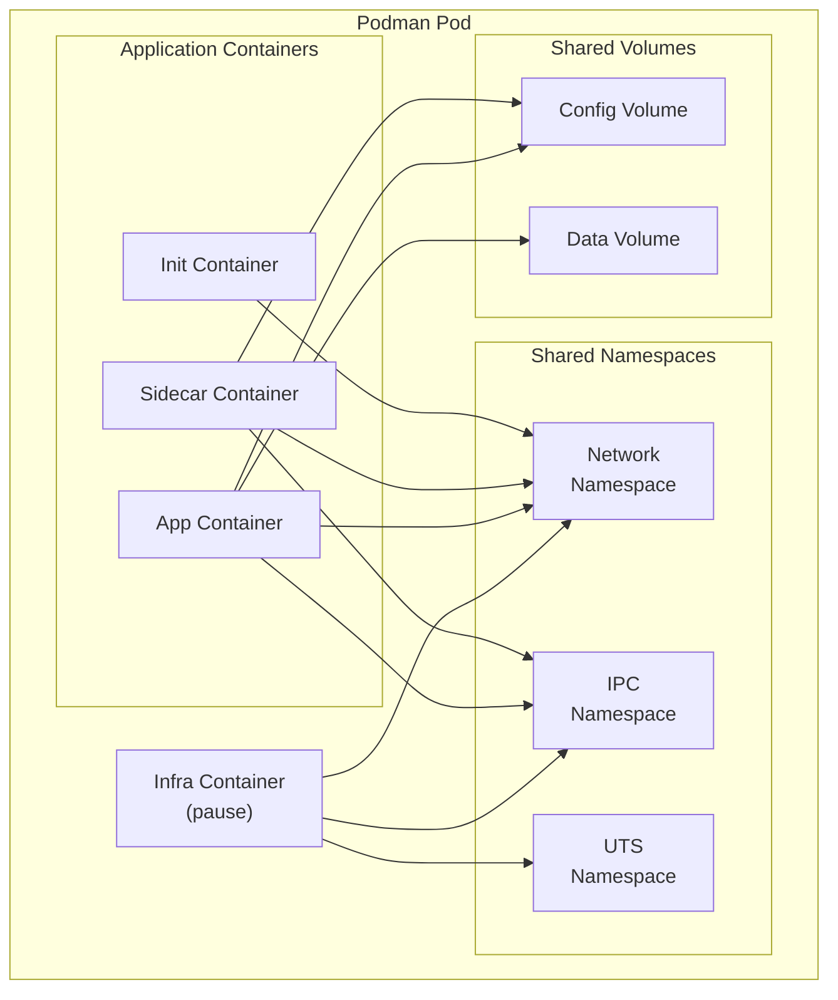
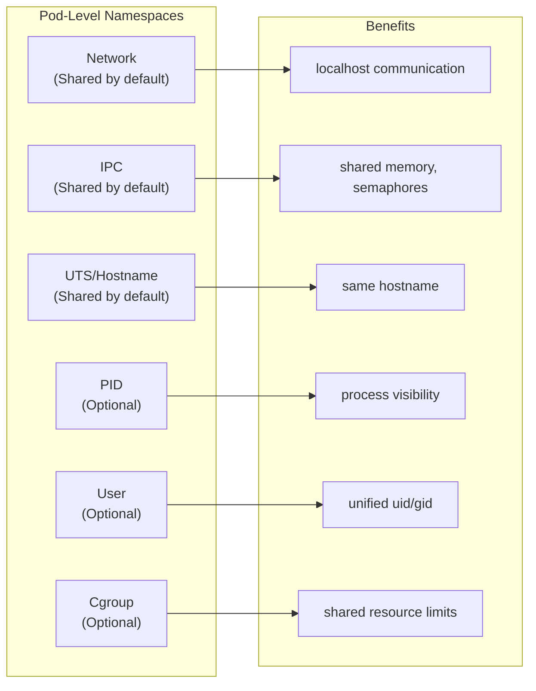
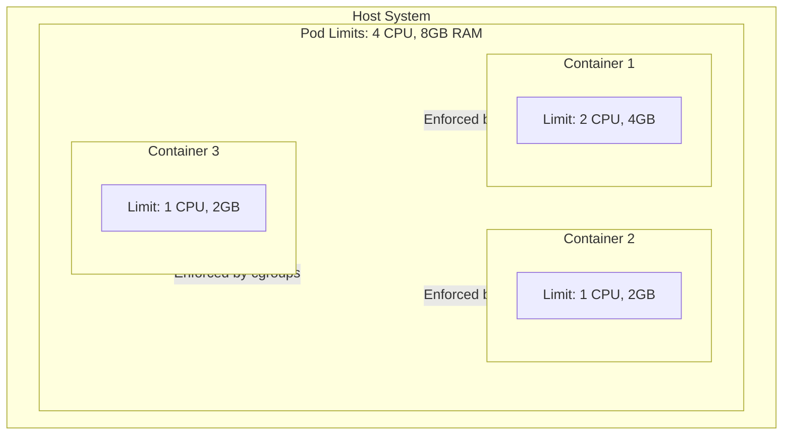
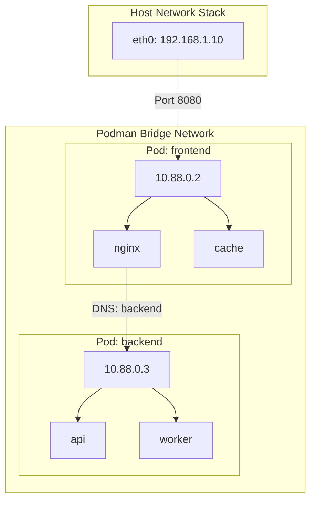
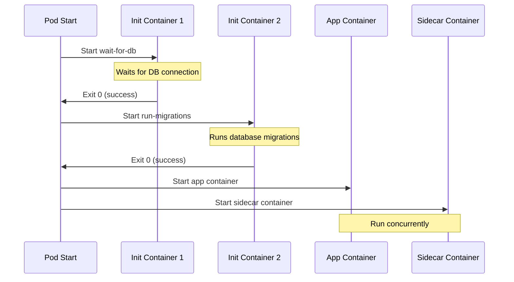

# How to Configure Podman Pod Resource Sharing

Author: [nawazdhandala](https://www.github.com/nawazdhandala)

Tags: Podman, Containers, Resource Management, DevOps, Linux, Kubernetes, Container Security

Description: A practical guide to configuring resource sharing between containers in Podman pods, covering namespace sharing, volume mounts, network configuration, and resource limits for production workloads.

---

Podman pods group multiple containers that share resources like network namespaces, IPC, and storage. Unlike Docker Compose, which runs containers in isolation with a shared network, Podman pods mirror the Kubernetes pod model where containers genuinely share a single network stack and can communicate via localhost.

Understanding pod resource sharing becomes critical when you need sidecar patterns, init containers, or tightly coupled services that must share state. After deploying Podman pods across various production environments, the patterns outlined here represent battle-tested configurations that balance performance with security.

---

## Podman Pod Architecture

Before diving into configuration details, understanding how Podman pods work internally helps explain why certain sharing options exist.



Every Podman pod contains an infra container (similar to Kubernetes pause container) that holds the shared namespaces. Application containers join these namespaces, enabling resource sharing without complex networking or IPC setup.

---

## Creating a Basic Pod with Shared Resources

Start by creating a pod and adding containers that share its resources.

The following command creates a pod with a published port and adds two containers that can communicate over localhost.

```bash
# Create a new pod with the name "webapp" and expose port 8080
# The -p flag maps host port 8080 to pod port 8080
podman pod create --name webapp -p 8080:8080

# Add the main application container to the pod
# --pod flag specifies which pod this container joins
podman run -d --pod webapp --name app \
    -e DATABASE_URL=localhost:5432 \
    myapp:latest

# Add a database sidecar container to the same pod
# Both containers share the network namespace, so the app reaches postgres at localhost:5432
podman run -d --pod webapp --name db \
    -e POSTGRES_PASSWORD=secret \
    postgres:16-alpine
```

Both containers now share the same network namespace. The application container connects to the database using `localhost:5432` rather than a service name or IP address.

---

## Namespace Sharing Options

Podman pods support fine-grained control over which namespaces containers share. Understanding each option helps you make informed security decisions.



### Default Namespace Sharing

Podman pods share network, IPC, and UTS namespaces by default. Containers in the pod can:

- Communicate over localhost (network namespace)
- Use shared memory and semaphores (IPC namespace)
- See the same hostname (UTS namespace)

### Enabling PID Namespace Sharing

PID namespace sharing allows containers to see each other's processes. Useful for debugging or process management sidecars.

```bash
# Create a pod with PID namespace sharing enabled
# --share pid adds the PID namespace to shared resources
podman pod create --name debug-pod --share pid,net,ipc,uts

# Add the main application
podman run -d --pod debug-pod --name app myapp:latest

# Add a debug sidecar that can see all processes in the pod
podman run -d --pod debug-pod --name debugger \
    --cap-add SYS_PTRACE \
    alpine:latest sleep infinity
```

Verify PID visibility from the debugger container.

```bash
# List processes visible from the debugger container
# You should see processes from both containers
podman exec debugger ps aux
```

### Disabling Specific Namespace Sharing

Security-conscious deployments may need to disable certain namespace sharing.

```bash
# Create a pod that only shares the network namespace
# Containers will have separate IPC and UTS namespaces
podman pod create --name isolated-pod --share net

# Verify namespace configuration
podman pod inspect isolated-pod --format '{{.SharedNamespaces}}'
```

---

## Configuring Resource Limits

Resource limits in Podman pods can be applied at both the pod level and individual container level.

### Pod-Level Resource Limits

Pod-level limits apply to all containers combined within the pod.

```bash
# Create a pod with CPU and memory limits
# --cpus limits total CPU cores available to all containers
# --memory limits total memory for the entire pod
podman pod create --name limited-pod \
    --cpus 2.0 \
    --memory 4g \
    --memory-swap 4g \
    -p 8080:8080
```

### Container-Level Resource Limits

Individual containers within a pod can have their own limits, which must fit within pod-level constraints.

```bash
# Add containers with specific resource allocations
# The sum of container limits should not exceed pod limits
podman run -d --pod limited-pod --name api \
    --cpus 1.5 \
    --memory 3g \
    api-server:latest

# Sidecar with lower resource allocation
podman run -d --pod limited-pod --name metrics \
    --cpus 0.5 \
    --memory 512m \
    prometheus-exporter:latest
```

### Resource Limit Hierarchy

The following diagram illustrates how resource limits cascade from pod to container level.



---

## Volume Sharing Between Containers

Containers in a pod can share data through mounted volumes. Volume sharing enables sidecar patterns where one container writes data and another processes it.

### Creating Shared Volumes

Create a pod with named volumes that multiple containers can access.

```bash
# Create a pod with two volumes: one for config, one for data
podman pod create --name data-pod \
    -v config-vol:/config \
    -v data-vol:/data \
    -p 8080:8080

# Main application reads config and writes data
podman run -d --pod data-pod --name app \
    -v config-vol:/config:ro \
    -v data-vol:/data:rw \
    myapp:latest

# Config updater sidecar writes configuration files
podman run -d --pod data-pod --name config-sync \
    -v config-vol:/config:rw \
    config-sync:latest

# Log processor reads data written by the app
podman run -d --pod data-pod --name log-processor \
    -v data-vol:/data:ro \
    log-processor:latest
```

### Using Bind Mounts for Host Access

Bind mounts allow containers to access host filesystem paths directly.

```bash
# Create directories on the host for persistent storage
mkdir -p /opt/myapp/{config,data,logs}

# Create pod with bind mounts to host directories
podman pod create --name host-mount-pod \
    -v /opt/myapp/config:/config:ro,Z \
    -v /opt/myapp/data:/data:rw,Z \
    -v /opt/myapp/logs:/logs:rw,Z \
    -p 8080:8080
```

The `:Z` option applies SELinux labels for container access.

### Temporary Shared Filesystem with tmpfs

For ephemeral data sharing that does not need persistence, use tmpfs mounts.

```bash
# Create a pod with a 256MB tmpfs mount for temporary data
# tmpfs resides in memory and is automatically cleaned up
podman pod create --name tmpfs-pod \
    --mount type=tmpfs,destination=/tmp/shared,tmpfs-size=268435456 \
    -p 8080:8080

# Both containers can read/write to /tmp/shared
podman run -d --pod tmpfs-pod --name writer \
    myapp:latest

podman run -d --pod tmpfs-pod --name reader \
    sidecar:latest
```

---

## Network Configuration

Pod networking in Podman provides several options for controlling container communication.

### Default Pod Networking

By default, pods get a private network namespace with NAT for outbound connectivity.

```bash
# Create a pod with published ports
# External traffic reaches the pod through these mapped ports
podman pod create --name web-pod \
    -p 80:80 \
    -p 443:443

# All containers share these ports
# Only one container can bind to each port within the pod
podman run -d --pod web-pod --name nginx \
    nginx:alpine
```

### Host Network Mode

For maximum network performance, pods can use the host network namespace directly.

```bash
# Create a pod using the host network
# Containers bind directly to host interfaces
# Use with caution as this reduces isolation
podman pod create --name host-net-pod --network host

# Container ports are now exposed directly on the host
podman run -d --pod host-net-pod --name app \
    -e LISTEN_PORT=8080 \
    myapp:latest
```

### Custom Network with DNS

Create a custom network with DNS resolution between pods.

```bash
# Create a custom network for the pods
podman network create --driver bridge mynet

# Create pods on the custom network
podman pod create --name frontend --network mynet -p 8080:8080
podman pod create --name backend --network mynet

# Pods can resolve each other by name
# frontend can reach backend at "backend:port"
podman run -d --pod frontend --name web nginx:alpine
podman run -d --pod backend --name api api-server:latest
```

### Network Configuration Diagram



---

## Init Containers

Init containers run to completion before main containers start. Useful for setup tasks like database migrations or configuration fetching.

### Configuring Init Containers

```bash
# Create a pod for an application with init containers
podman pod create --name app-with-init -p 8080:8080

# Init container 1: Wait for database to be ready
# The --init-ctr flag marks this as an init container
podman create --pod app-with-init --init-ctr always \
    --name wait-for-db \
    busybox:latest \
    sh -c 'until nc -z localhost 5432; do echo waiting for db; sleep 2; done'

# Init container 2: Run database migrations
podman create --pod app-with-init --init-ctr always \
    --name run-migrations \
    myapp:latest \
    ./migrate.sh

# Main application container
podman run -d --pod app-with-init --name app \
    myapp:latest

# Start the pod - init containers run sequentially first
podman pod start app-with-init
```

### Init Container Execution Flow



---

## Sidecar Patterns

Sidecars extend main application functionality without modifying the application container.

### Log Collection Sidecar

Collect and forward logs from the main application.

```bash
# Create a pod with shared log volume
podman pod create --name logging-pod \
    -v log-vol:/var/log/app \
    -p 8080:8080

# Main application writes logs to the shared volume
podman run -d --pod logging-pod --name app \
    -v log-vol:/var/log/app \
    -e LOG_PATH=/var/log/app/app.log \
    myapp:latest

# Fluent Bit sidecar reads and forwards logs
podman run -d --pod logging-pod --name log-shipper \
    -v log-vol:/var/log/app:ro \
    -v ./fluent-bit.conf:/fluent-bit/etc/fluent-bit.conf:ro \
    fluent/fluent-bit:latest
```

### Metrics Exporter Sidecar

Export application metrics in Prometheus format.

```bash
# Create a pod with the app and metrics exporter
podman pod create --name metrics-pod -p 8080:8080 -p 9090:9090

# Main application exposes internal metrics endpoint
podman run -d --pod metrics-pod --name app \
    -e METRICS_PORT=8081 \
    myapp:latest

# Metrics exporter scrapes app metrics and re-exposes for Prometheus
# Uses localhost since containers share the network namespace
podman run -d --pod metrics-pod --name exporter \
    -e SCRAPE_TARGET=localhost:8081 \
    -e LISTEN_PORT=9090 \
    prom/statsd-exporter:latest
```

### Reverse Proxy Sidecar

Add TLS termination or authentication in front of an application.

```bash
# Create a pod for the app with nginx reverse proxy
podman pod create --name proxy-pod -p 443:443

# Backend application listens on localhost:8080
podman run -d --pod proxy-pod --name backend \
    -e LISTEN_ADDR=127.0.0.1:8080 \
    myapp:latest

# Nginx handles TLS and proxies to the backend
podman run -d --pod proxy-pod --name proxy \
    -v ./nginx.conf:/etc/nginx/nginx.conf:ro \
    -v ./certs:/etc/nginx/certs:ro \
    nginx:alpine
```

Sample nginx configuration for the reverse proxy.

```nginx
# nginx.conf - Reverse proxy configuration for sidecar pattern
server {
    listen 443 ssl;
    server_name _;

    ssl_certificate /etc/nginx/certs/server.crt;
    ssl_certificate_key /etc/nginx/certs/server.key;

    location / {
        # Proxy to the app container via localhost
        # Works because both containers share the network namespace
        proxy_pass http://127.0.0.1:8080;
        proxy_set_header Host $host;
        proxy_set_header X-Real-IP $remote_addr;
        proxy_set_header X-Forwarded-For $proxy_add_x_forwarded_for;
        proxy_set_header X-Forwarded-Proto $scheme;
    }
}
```

---

## Pod Definition Files

For reproducible deployments, define pods in YAML files compatible with Kubernetes.

### Basic Pod YAML

Create a pod definition file that Podman can consume directly.

```yaml
# webapp-pod.yaml
apiVersion: v1
kind: Pod
metadata:
  name: webapp
  labels:
    app: webapp
    environment: production
spec:
  # Containers share network, IPC, and UTS namespaces by default
  containers:
    - name: app
      image: docker.io/library/myapp:latest
      ports:
        - containerPort: 8080
          hostPort: 8080
      env:
        - name: DATABASE_URL
          value: "localhost:5432"
        - name: REDIS_URL
          value: "localhost:6379"
      resources:
        limits:
          memory: "2Gi"
          cpu: "1000m"
        requests:
          memory: "512Mi"
          cpu: "250m"
      volumeMounts:
        - name: data
          mountPath: /data
        - name: config
          mountPath: /config
          readOnly: true

    - name: postgres
      image: docker.io/library/postgres:16-alpine
      env:
        - name: POSTGRES_PASSWORD
          valueFrom:
            secretKeyRef:
              name: db-secret
              key: password
      resources:
        limits:
          memory: "1Gi"
          cpu: "500m"
      volumeMounts:
        - name: pgdata
          mountPath: /var/lib/postgresql/data

    - name: redis
      image: docker.io/library/redis:7-alpine
      resources:
        limits:
          memory: "256Mi"
          cpu: "100m"

  # Init container for setup tasks
  initContainers:
    - name: init-config
      image: docker.io/library/busybox:latest
      command: ['sh', '-c', 'cp /defaults/* /config/']
      volumeMounts:
        - name: default-config
          mountPath: /defaults
        - name: config
          mountPath: /config

  volumes:
    - name: data
      persistentVolumeClaim:
        claimName: webapp-data
    - name: config
      emptyDir: {}
    - name: default-config
      configMap:
        name: webapp-config
    - name: pgdata
      persistentVolumeClaim:
        claimName: postgres-data
```

Deploy the pod using podman play.

```bash
# Deploy the pod from YAML definition
# --replace removes existing pod with same name before creating new one
podman play kube webapp-pod.yaml --replace

# View running pods and containers
podman pod ps
podman ps --pod

# Stop and remove the pod
podman play kube webapp-pod.yaml --down
```

### Generating YAML from Running Pods

Export existing pods to YAML for version control or migration.

```bash
# Generate YAML from a running pod
podman generate kube webapp > webapp-export.yaml

# Generate with persistent volume claims included
podman generate kube webapp --service > webapp-with-service.yaml
```

---

## Resource Monitoring

Monitor resource usage to validate limits and identify bottlenecks.

### Real-time Resource Statistics

```bash
# View resource usage for all containers in a pod
podman pod stats webapp

# Sample output showing CPU, memory, and I/O metrics
# POD ID        NAME      CPU %   MEM USAGE / LIMIT   MEM %   NET I/O          BLOCK I/O
# abc123        webapp    15.2%   1.2GiB / 4GiB       30%     50MB / 10MB      100MB / 50MB
```

### Container-Level Inspection

```bash
# Inspect resource limits for a specific container
podman inspect app --format '{{.HostConfig.Memory}} {{.HostConfig.NanoCpus}}'

# View cgroup resource constraints
podman exec app cat /sys/fs/cgroup/memory.max
podman exec app cat /sys/fs/cgroup/cpu.max
```

### Health Check Configuration

Configure health checks to monitor container status within pods.

```bash
# Create a pod with health check enabled containers
podman pod create --name health-pod -p 8080:8080

# Add container with health check
# --health-cmd specifies the command to check health
# --health-interval sets time between checks
# --health-retries sets failures before marking unhealthy
podman run -d --pod health-pod --name app \
    --health-cmd 'curl -f http://localhost:8080/health || exit 1' \
    --health-interval 30s \
    --health-retries 3 \
    --health-start-period 10s \
    --health-timeout 5s \
    myapp:latest

# Check health status
podman healthcheck run app
podman inspect app --format '{{.State.Health.Status}}'
```

---

## Security Considerations

Properly securing shared resources prevents container escape and data leakage.

### Dropping Unnecessary Capabilities

Remove capabilities that containers do not need.

```bash
# Create a container with minimal capabilities
podman run -d --pod webapp --name secure-app \
    --cap-drop ALL \
    --cap-add NET_BIND_SERVICE \
    --read-only \
    --security-opt no-new-privileges:true \
    myapp:latest
```

### User Namespace Mapping

Run containers as non-root users with user namespace isolation.

```bash
# Create a rootless pod with user mapping
# Containers run with unprivileged users mapped to host UIDs
podman pod create --name rootless-pod \
    --userns keep-id \
    -p 8080:8080

# Container processes run as the invoking user
podman run -d --pod rootless-pod --name app \
    --user 1000:1000 \
    myapp:latest
```

### SELinux and Seccomp Profiles

Apply additional security controls using SELinux and seccomp.

```bash
# Run with custom seccomp profile
podman run -d --pod webapp --name secure-app \
    --security-opt seccomp=/path/to/seccomp-profile.json \
    --security-opt label=type:container_runtime_t \
    myapp:latest
```

---

## Systemd Integration

Generate systemd units for pod management and automatic startup.

### Generating Systemd Units

```bash
# Generate systemd unit files for a pod
# Creates files for the pod and each container
podman generate systemd --new --name webapp \
    --files \
    --restart-policy=always

# Output files:
# pod-webapp.service
# container-app.service
# container-db.service
```

### Installing and Enabling Services

```bash
# Copy generated files to systemd directory
cp pod-webapp.service container-*.service ~/.config/systemd/user/

# Reload systemd daemon
systemctl --user daemon-reload

# Enable and start the pod service
systemctl --user enable --now pod-webapp.service

# Check status
systemctl --user status pod-webapp.service
```

### Sample Systemd Unit

The generated unit file manages pod lifecycle automatically.

```ini
# pod-webapp.service
[Unit]
Description=Podman pod-webapp.service
Documentation=man:podman-generate-systemd(1)
Wants=network-online.target
After=network-online.target
RequiresMountsFor=/run/user/1000/containers

[Service]
Environment=PODMAN_SYSTEMD_UNIT=%n
Restart=always
TimeoutStopSec=70
ExecStartPre=/bin/rm -f %t/%n.ctr-id
ExecStart=/usr/bin/podman pod start webapp
ExecStop=/usr/bin/podman pod stop -t 10 webapp
ExecStopPost=/usr/bin/podman pod rm -f webapp
Type=forking
PIDFile=%t/%n.pid

[Install]
WantedBy=default.target
```

---

## Troubleshooting Common Issues

When pod resource sharing does not work as expected, these techniques help identify the problem.

### Namespace Verification

```bash
# Verify containers share the expected namespaces
podman inspect app --format '{{.NetworkSettings.SandboxKey}}'
podman inspect db --format '{{.NetworkSettings.SandboxKey}}'
# Same sandbox key indicates shared network namespace

# Check namespace sharing at the pod level
podman pod inspect webapp --format '{{.SharedNamespaces}}'
```

### Network Connectivity Issues

```bash
# Test localhost connectivity between containers
podman exec app curl -v localhost:5432

# Check listening ports within the pod
podman exec app ss -tlnp

# Verify port mappings
podman port webapp
```

### Resource Limit Conflicts

```bash
# Check if container was OOM killed
podman inspect app --format '{{.State.OOMKilled}}'

# View resource limit events
podman events --filter container=app --filter event=oom

# Check current resource usage vs limits
podman stats app --no-stream
```

### Volume Permission Problems

```bash
# Check volume ownership
podman exec app ls -la /data

# Fix SELinux labels if needed
podman run --rm -v data-vol:/data:Z busybox chown -R 1000:1000 /data

# Verify volume mount points
podman inspect app --format '{{range .Mounts}}{{.Source}} -> {{.Destination}}{{"\n"}}{{end}}'
```

---

## Production Checklist

Before deploying Podman pods to production, verify these configurations.

### Resource Management

- [ ] Pod-level resource limits defined
- [ ] Container-level limits fit within pod constraints
- [ ] Health checks configured for all containers
- [ ] Restart policies set appropriately

### Security

- [ ] Containers run as non-root users
- [ ] Unnecessary capabilities dropped
- [ ] Read-only root filesystem where possible
- [ ] SELinux/AppArmor profiles applied
- [ ] Secrets managed securely (not in environment variables)

### Networking

- [ ] Only required ports published
- [ ] Host network used only when necessary
- [ ] DNS resolution tested between pods

### Storage

- [ ] Persistent volumes configured for stateful data
- [ ] Volume permissions verified
- [ ] Backup strategy for persistent data

### Operations

- [ ] Systemd integration configured
- [ ] Logging aggregation set up
- [ ] Monitoring and alerting in place
- [ ] Pod definitions stored in version control

---

## Summary

Podman pod resource sharing enables powerful container orchestration patterns without the complexity of full Kubernetes deployments. Key takeaways from configuring pod resource sharing include:

1. Pods share network, IPC, and UTS namespaces by default, enabling localhost communication between containers
2. PID namespace sharing can be enabled for debugging scenarios but reduces isolation
3. Resource limits can be applied at both pod and container levels with cgroup enforcement
4. Volume sharing between containers enables sidecar patterns for logging, metrics, and proxying
5. Init containers handle setup tasks before main containers start
6. YAML definitions provide reproducible deployments compatible with Kubernetes
7. Systemd integration ensures pods restart automatically and integrate with system management

For monitoring your Podman infrastructure, OneUptime provides comprehensive observability that tracks container health, resource usage, and application performance across your entire deployment.

---

**Related Reading:**

- [How to Debug Failing Docker Containers Safely](https://oneuptime.com/blog/post/2025-11-27-debug-docker-containers/view)
- [How to Use Docker BuildKit Features](https://oneuptime.com/blog/post/2026-02-02-docker-buildkit/view)
- [How to Implement Kubernetes Service Mesh](https://oneuptime.com/blog/post/2026-02-02-kubernetes-service-mesh/view)
