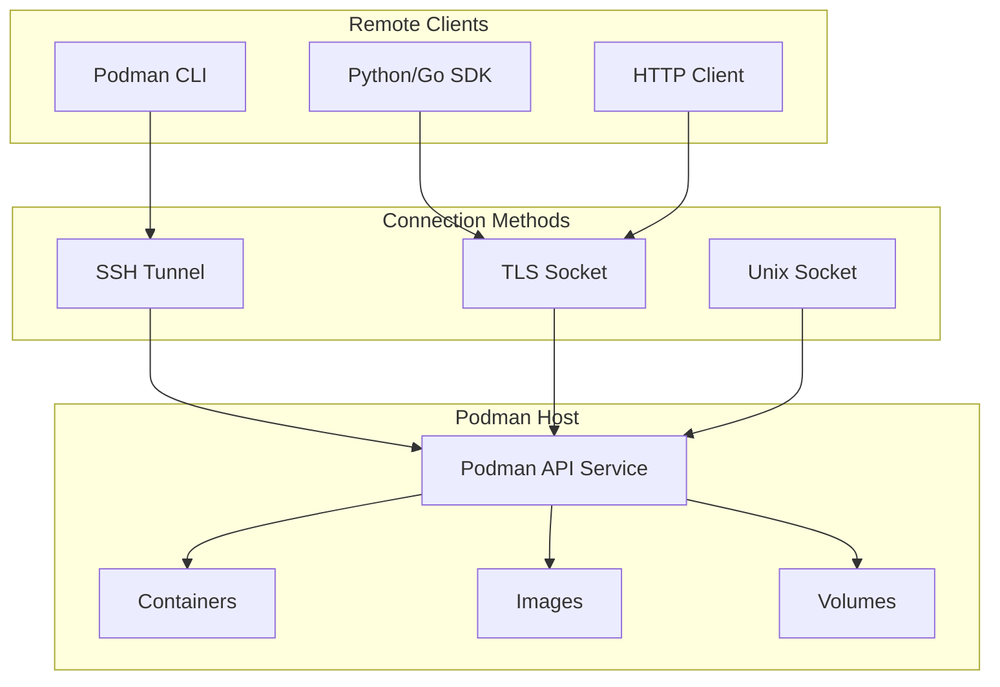
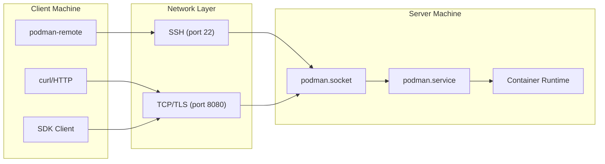
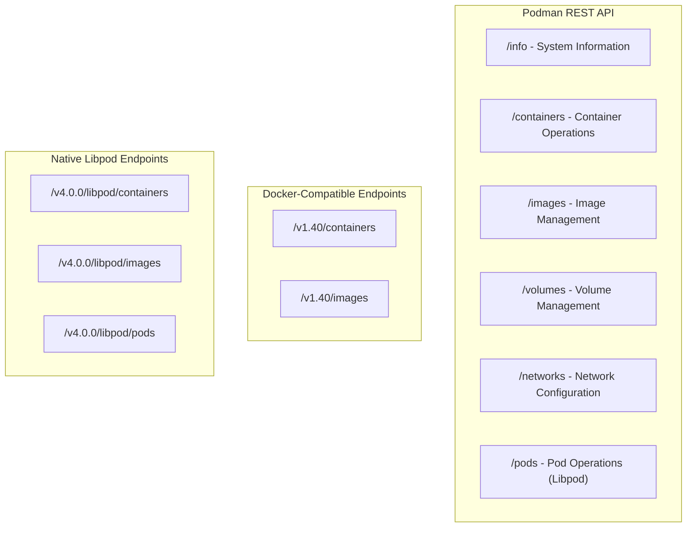
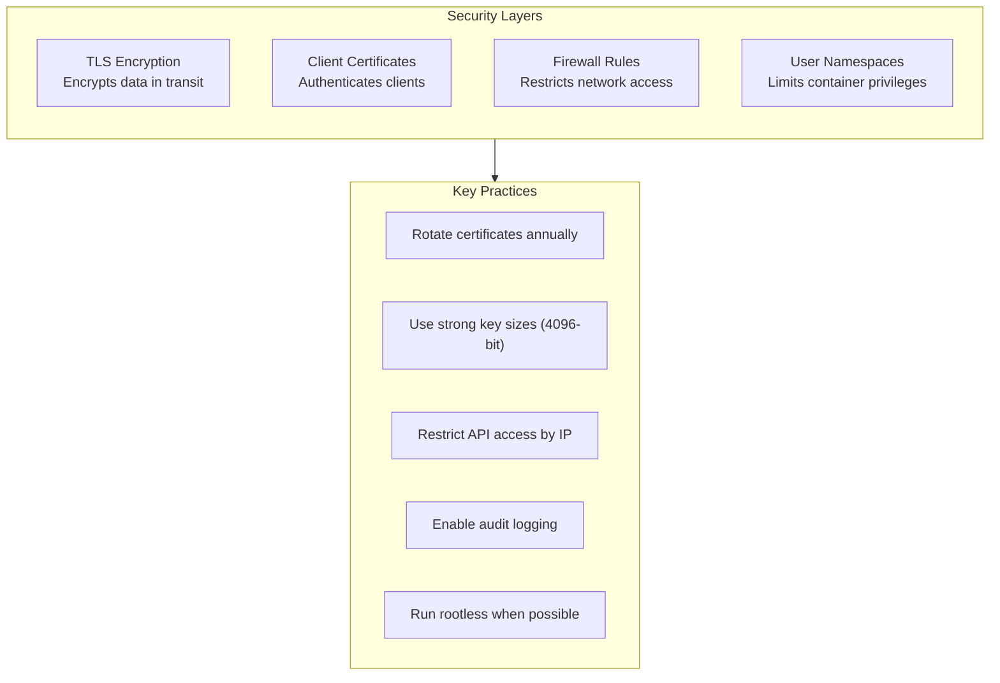

# How to Configure Podman Remote API

Author: [nawazdhandala](https://www.github.com/nawazdhandala)

Tags: Podman, Remote API, Containers, DevOps, Linux, Docker Alternative, Container Management, REST API

Description: Learn how to configure and use the Podman Remote API for managing containers from remote clients. Covers socket activation, TLS authentication, SSH tunneling, and practical API usage examples.

---

> Podman offers a Docker-compatible REST API that enables remote container management without requiring a daemon. Set up secure remote access and automate your container workflows through the API.

Container management from remote machines opens up powerful automation possibilities. Podman's REST API provides a daemon-less approach to achieve exactly that.

---

## Overview



---

## Prerequisites

Before configuring the Podman Remote API, ensure you have the following installed:

```bash
# Install Podman on Fedora/RHEL/CentOS
sudo dnf install podman

# Install Podman on Ubuntu/Debian
sudo apt update && sudo apt install podman

# Verify installation
podman --version
```

---

## Enabling the Podman Socket

### User-Level Socket (Rootless)

For rootless Podman, enable the systemd user socket to start the API service on demand:

```bash
# Enable and start the socket for the current user
# The socket activates the API service when a connection is made
systemctl --user enable podman.socket
systemctl --user start podman.socket

# Verify the socket is active and listening
systemctl --user status podman.socket
```

Check if the socket file exists at the expected location:

```bash
# The default user socket path is under the runtime directory
# XDG_RUNTIME_DIR is typically /run/user/<UID>
ls -la ${XDG_RUNTIME_DIR}/podman/podman.sock
```

### System-Level Socket (Root)

For managing system containers, enable the root-level socket:

```bash
# Enable and start the system socket (requires root)
# Use this for privileged container operations
sudo systemctl enable podman.socket
sudo systemctl start podman.socket

# Verify the system socket status
sudo systemctl status podman.socket
```

The system socket path is `/run/podman/podman.sock`.

---

## Architecture



---

## Testing Local API Access

Before configuring remote access, verify the API works locally:

```bash
# Test with curl using the Unix socket
# The --unix-socket flag tells curl to use the socket file
curl --unix-socket ${XDG_RUNTIME_DIR}/podman/podman.sock \
  http://localhost/v4.0.0/libpod/info | jq
```

Expected output includes system information:

```json
{
  "host": {
    "arch": "amd64",
    "os": "linux",
    "hostname": "podman-host"
  },
  "version": {
    "APIVersion": "4.0.0",
    "Version": "4.9.0"
  }
}
```

---

## Configuring Remote Access via SSH

SSH tunneling provides the most secure method for remote Podman access without exposing ports.

### Server-Side Configuration

Ensure SSH is configured on the Podman host:

```bash
# SSH server should be running
sudo systemctl enable sshd
sudo systemctl start sshd

# Configure SSH key authentication for the remote user
# On the client, copy the public key to the server
ssh-copy-id username@podman-host.example.com
```

### Client-Side Configuration

Create a connection to the remote Podman instance:

```bash
# Add a new remote connection named 'my-server'
# Replace username and hostname with your actual values
podman system connection add my-server \
  ssh://username@podman-host.example.com/run/user/1000/podman/podman.sock

# For root containers, use the system socket path
podman system connection add my-server-root \
  ssh://root@podman-host.example.com/run/podman/podman.sock
```

List and verify configured connections:

```bash
# Display all configured remote connections
# The asterisk (*) indicates the default connection
podman system connection list
```

Output:

```
Name           URI                                                     Identity     Default
my-server      ssh://username@podman-host.example.com/run/user/1000/podman/podman.sock  ~/.ssh/id_rsa  true
my-server-root ssh://root@podman-host.example.com/run/podman/podman.sock                ~/.ssh/id_rsa  false
```

### Using Remote Connections

Run commands against the remote Podman instance:

```bash
# Set the default connection
podman system connection default my-server

# Run commands - they execute on the remote host
podman run -d --name nginx nginx:alpine
podman ps
podman logs nginx

# Or specify the connection per command
podman --connection my-server images
```

---

## Configuring TCP Socket with TLS

For programmatic access or multi-client environments, expose the API over TCP with TLS encryption.

### Generating TLS Certificates

Create a certificate authority and certificates for secure communication:

```bash
#!/bin/bash
# generate-certs.sh
# Creates CA and certificates for Podman TLS authentication

# Configuration - update these values for your environment
CA_SUBJECT="/CN=Podman-CA"
SERVER_SUBJECT="/CN=podman-host.example.com"
CLIENT_SUBJECT="/CN=podman-client"
CERT_DIR="$HOME/.config/podman/certs"

# Create directory structure
mkdir -p "${CERT_DIR}"
cd "${CERT_DIR}"

# Generate the Certificate Authority (CA) private key
# The CA signs both server and client certificates
openssl genrsa -out ca-key.pem 4096

# Create the CA certificate (valid for 10 years)
openssl req -new -x509 -days 3650 \
  -key ca-key.pem \
  -sha256 \
  -out ca.pem \
  -subj "${CA_SUBJECT}"

# Generate server private key
openssl genrsa -out server-key.pem 4096

# Create server certificate signing request
openssl req -new \
  -key server-key.pem \
  -out server.csr \
  -subj "${SERVER_SUBJECT}"

# Create server extensions file for SAN (Subject Alternative Names)
# Include all hostnames and IPs that clients will use to connect
cat > server-ext.cnf << EOF
subjectAltName = DNS:podman-host.example.com,DNS:localhost,IP:192.168.1.100,IP:127.0.0.1
extendedKeyUsage = serverAuth
EOF

# Sign the server certificate with the CA
openssl x509 -req -days 365 \
  -sha256 \
  -in server.csr \
  -CA ca.pem \
  -CAkey ca-key.pem \
  -CAcreateserial \
  -out server-cert.pem \
  -extfile server-ext.cnf

# Generate client private key
openssl genrsa -out client-key.pem 4096

# Create client certificate signing request
openssl req -new \
  -key client-key.pem \
  -out client.csr \
  -subj "${CLIENT_SUBJECT}"

# Create client extensions file
cat > client-ext.cnf << EOF
extendedKeyUsage = clientAuth
EOF

# Sign the client certificate with the CA
openssl x509 -req -days 365 \
  -sha256 \
  -in client.csr \
  -CA ca.pem \
  -CAkey ca-key.pem \
  -CAcreateserial \
  -out client-cert.pem \
  -extfile client-ext.cnf

# Clean up CSR files and set proper permissions
rm -f *.csr *.cnf
chmod 600 *-key.pem
chmod 644 *.pem ca.pem *-cert.pem

echo "Certificates generated in ${CERT_DIR}"
```

### Server Configuration

Create a systemd service to run Podman API with TLS:

```ini
# /etc/systemd/system/podman-api-tls.service
# Systemd service for running Podman API with TLS authentication

[Unit]
Description=Podman API Service with TLS
After=network.target
Wants=network.target

[Service]
Type=simple
# Replace with actual certificate paths on your server
ExecStart=/usr/bin/podman system service \
  --time=0 \
  tcp://0.0.0.0:8443?tlsverify=true&tlscacert=/etc/podman/certs/ca.pem&tlscert=/etc/podman/certs/server-cert.pem&tlskey=/etc/podman/certs/server-key.pem
Restart=always
RestartSec=5

# Security hardening options
NoNewPrivileges=true
ProtectSystem=strict
ProtectHome=read-only

[Install]
WantedBy=multi-user.target
```

Copy certificates to the server and start the service:

```bash
# Create server certificate directory
sudo mkdir -p /etc/podman/certs

# Copy CA and server certificates
sudo cp ca.pem server-cert.pem server-key.pem /etc/podman/certs/
sudo chmod 600 /etc/podman/certs/server-key.pem

# Reload systemd and start the service
sudo systemctl daemon-reload
sudo systemctl enable podman-api-tls.service
sudo systemctl start podman-api-tls.service
```

### Client Configuration

Configure the client to use TLS certificates:

```bash
# Create client certificate directory
mkdir -p ~/.config/podman/certs

# Copy CA and client certificates from the generation machine
cp ca.pem client-cert.pem client-key.pem ~/.config/podman/certs/

# Test the connection with curl
curl --cacert ~/.config/podman/certs/ca.pem \
  --cert ~/.config/podman/certs/client-cert.pem \
  --key ~/.config/podman/certs/client-key.pem \
  https://podman-host.example.com:8443/v4.0.0/libpod/info
```

---

## Using the REST API Directly

### Common API Endpoints

The Podman API follows the Docker API specification with Libpod extensions:



### Container Management Examples

Create and manage containers using curl:

```bash
#!/bin/bash
# podman-api-examples.sh
# Examples of managing containers via the Podman REST API

# Set your connection details
PODMAN_HOST="https://podman-host.example.com:8443"
CERT_DIR="$HOME/.config/podman/certs"

# Common curl options for TLS authentication
CURL_OPTS=(
  --cacert "${CERT_DIR}/ca.pem"
  --cert "${CERT_DIR}/client-cert.pem"
  --key "${CERT_DIR}/client-key.pem"
  -H "Content-Type: application/json"
)

# Get system information
echo "=== System Info ==="
curl -s "${CURL_OPTS[@]}" \
  "${PODMAN_HOST}/v4.0.0/libpod/info" | jq '.version'

# Pull an image before creating containers
echo "=== Pulling Image ==="
curl -s -X POST "${CURL_OPTS[@]}" \
  "${PODMAN_HOST}/v4.0.0/libpod/images/pull?reference=docker.io/library/nginx:alpine"

# Create a new container
# Note: the container is created but not started
echo "=== Creating Container ==="
curl -s -X POST "${CURL_OPTS[@]}" \
  "${PODMAN_HOST}/v4.0.0/libpod/containers/create" \
  -d '{
    "name": "web-server",
    "image": "docker.io/library/nginx:alpine",
    "portmappings": [
      {
        "container_port": 80,
        "host_port": 8080,
        "protocol": "tcp"
      }
    ],
    "env": {
      "NGINX_HOST": "localhost"
    }
  }' | jq

# Start the container
echo "=== Starting Container ==="
curl -s -X POST "${CURL_OPTS[@]}" \
  "${PODMAN_HOST}/v4.0.0/libpod/containers/web-server/start"

# List running containers
echo "=== Running Containers ==="
curl -s "${CURL_OPTS[@]}" \
  "${PODMAN_HOST}/v4.0.0/libpod/containers/json?all=false" | jq '.[].Names'

# Get container logs
echo "=== Container Logs ==="
curl -s "${CURL_OPTS[@]}" \
  "${PODMAN_HOST}/v4.0.0/libpod/containers/web-server/logs?stdout=true&stderr=true"

# Inspect a specific container
echo "=== Container Details ==="
curl -s "${CURL_OPTS[@]}" \
  "${PODMAN_HOST}/v4.0.0/libpod/containers/web-server/json" | jq '.State'

# Stop and remove the container
echo "=== Cleanup ==="
curl -s -X POST "${CURL_OPTS[@]}" \
  "${PODMAN_HOST}/v4.0.0/libpod/containers/web-server/stop"
curl -s -X DELETE "${CURL_OPTS[@]}" \
  "${PODMAN_HOST}/v4.0.0/libpod/containers/web-server"
```

### Image Operations

Manage container images through the API:

```bash
# List all local images
curl -s "${CURL_OPTS[@]}" \
  "${PODMAN_HOST}/v4.0.0/libpod/images/json" | \
  jq '.[] | {id: .Id[0:12], names: .Names, size: .Size}'

# Search for images in registries
curl -s "${CURL_OPTS[@]}" \
  "${PODMAN_HOST}/v4.0.0/libpod/images/search?term=redis&limit=5" | jq

# Remove an image by ID or name
curl -s -X DELETE "${CURL_OPTS[@]}" \
  "${PODMAN_HOST}/v4.0.0/libpod/images/nginx:alpine"

# Prune unused images to free disk space
curl -s -X POST "${CURL_OPTS[@]}" \
  "${PODMAN_HOST}/v4.0.0/libpod/images/prune" | jq
```

---

## Python SDK Integration

The Podman Python SDK provides a high-level interface for API interactions:

```python
# podman_client.py
# Python client for managing Podman containers remotely

import podman
from podman import PodmanClient
import os

def create_podman_client(
    uri: str = None,
    identity: str = None
) -> PodmanClient:
    """
    Create a Podman client connection.

    Args:
        uri: Connection URI (ssh:// or tcp://)
        identity: Path to SSH private key or TLS client key

    Returns:
        PodmanClient instance
    """
    # Default to local socket if no URI provided
    if uri is None:
        uri = f"unix://{os.environ.get('XDG_RUNTIME_DIR')}/podman/podman.sock"

    # Create and return the client
    return PodmanClient(base_url=uri, identity=identity)


def list_containers(client: PodmanClient, all_containers: bool = False):
    """
    List containers with status information.

    Args:
        client: PodmanClient instance
        all_containers: Include stopped containers if True
    """
    containers = client.containers.list(all=all_containers)

    print(f"{'NAME':<20} {'STATUS':<15} {'IMAGE':<30}")
    print("-" * 65)

    for container in containers:
        print(f"{container.name:<20} {container.status:<15} {container.image.tags[0] if container.image.tags else 'none':<30}")


def run_container(
    client: PodmanClient,
    image: str,
    name: str,
    ports: dict = None,
    environment: dict = None,
    detach: bool = True
):
    """
    Run a new container with specified configuration.

    Args:
        client: PodmanClient instance
        image: Container image name
        name: Container name
        ports: Port mappings (e.g., {"8080/tcp": 80})
        environment: Environment variables
        detach: Run in background if True

    Returns:
        Container object
    """
    # Pull the image if not present locally
    try:
        client.images.get(image)
    except podman.errors.ImageNotFound:
        print(f"Pulling image: {image}")
        client.images.pull(image)

    # Create and start the container
    container = client.containers.run(
        image=image,
        name=name,
        ports=ports or {},
        environment=environment or {},
        detach=detach
    )

    print(f"Container '{name}' started with ID: {container.id[:12]}")
    return container


def cleanup_containers(client: PodmanClient, name_prefix: str):
    """
    Stop and remove containers matching a name prefix.

    Args:
        client: PodmanClient instance
        name_prefix: Prefix to match container names
    """
    containers = client.containers.list(all=True)

    for container in containers:
        if container.name.startswith(name_prefix):
            print(f"Removing container: {container.name}")
            container.stop()
            container.remove()


# Example usage demonstrating remote container management
if __name__ == "__main__":
    # Connect via SSH to remote Podman instance
    client = create_podman_client(
        uri="ssh://user@podman-host.example.com/run/user/1000/podman/podman.sock",
        identity="~/.ssh/id_rsa"
    )

    # List existing containers
    print("Current containers:")
    list_containers(client, all_containers=True)

    # Run a new nginx container
    container = run_container(
        client=client,
        image="docker.io/library/nginx:alpine",
        name="web-api",
        ports={"8080/tcp": 80},
        environment={"NGINX_HOST": "api.example.com"}
    )

    # Show updated container list
    print("\nAfter starting new container:")
    list_containers(client, all_containers=False)

    # Cleanup when done
    # cleanup_containers(client, "web-")

    client.close()
```

Install the required package:

```bash
# Install the Podman Python bindings
pip install podman
```

---

## Go SDK Integration

For Go applications, use the official Podman Go bindings:

```go
// main.go
// Go client for managing Podman containers remotely

package main

import (
	"context"
	"fmt"
	"os"

	"github.com/containers/podman/v4/pkg/bindings"
	"github.com/containers/podman/v4/pkg/bindings/containers"
	"github.com/containers/podman/v4/pkg/bindings/images"
	"github.com/containers/podman/v4/pkg/specgen"
)

// createConnection establishes a connection to the Podman API
// socketPath can be a Unix socket or SSH URI
func createConnection(ctx context.Context, socketPath string) (context.Context, error) {
	// bindings.NewConnection handles both local sockets and SSH connections
	conn, err := bindings.NewConnection(ctx, socketPath)
	if err != nil {
		return nil, fmt.Errorf("failed to connect to Podman: %w", err)
	}
	return conn, nil
}

// listContainers displays all containers with their status
func listContainers(ctx context.Context) error {
	// Fetch all containers including stopped ones
	allContainers := true
	opts := &containers.ListOptions{
		All: &allContainers,
	}

	containerList, err := containers.List(ctx, opts)
	if err != nil {
		return fmt.Errorf("failed to list containers: %w", err)
	}

	fmt.Printf("%-20s %-15s %-30s\n", "NAME", "STATE", "IMAGE")
	fmt.Println(strings.Repeat("-", 65))

	for _, c := range containerList {
		name := ""
		if len(c.Names) > 0 {
			name = c.Names[0]
		}
		fmt.Printf("%-20s %-15s %-30s\n", name, c.State, c.Image)
	}

	return nil
}

// runContainer creates and starts a new container
func runContainer(ctx context.Context, imageName, containerName string, ports map[string]uint16) (string, error) {
	// Pull the image if not available locally
	_, err := images.Pull(ctx, imageName, nil)
	if err != nil {
		return "", fmt.Errorf("failed to pull image %s: %w", imageName, err)
	}

	// Build the container specification
	spec := specgen.NewSpecGenerator(imageName, false)
	spec.Name = containerName

	// Configure port mappings
	if ports != nil {
		spec.PortMappings = make([]specgen.PortMapping, 0)
		for containerPort, hostPort := range ports {
			spec.PortMappings = append(spec.PortMappings, specgen.PortMapping{
				ContainerPort: parsePort(containerPort),
				HostPort:      hostPort,
				Protocol:      "tcp",
			})
		}
	}

	// Create the container from the specification
	createResponse, err := containers.CreateWithSpec(ctx, spec, nil)
	if err != nil {
		return "", fmt.Errorf("failed to create container: %w", err)
	}

	// Start the container
	if err := containers.Start(ctx, createResponse.ID, nil); err != nil {
		return "", fmt.Errorf("failed to start container: %w", err)
	}

	return createResponse.ID, nil
}

// parsePort extracts the port number from a port string like "80/tcp"
func parsePort(portSpec string) uint16 {
	var port uint16
	fmt.Sscanf(portSpec, "%d", &port)
	return port
}

func main() {
	ctx := context.Background()

	// Connect to remote Podman via SSH
	// Alternatively use a local socket: "unix:///run/user/1000/podman/podman.sock"
	socketPath := "ssh://user@podman-host.example.com/run/user/1000/podman/podman.sock"

	conn, err := createConnection(ctx, socketPath)
	if err != nil {
		fmt.Fprintf(os.Stderr, "Connection error: %v\n", err)
		os.Exit(1)
	}

	fmt.Println("Connected to Podman")

	// List current containers
	if err := listContainers(conn); err != nil {
		fmt.Fprintf(os.Stderr, "List error: %v\n", err)
	}

	// Run a new container
	containerID, err := runContainer(
		conn,
		"docker.io/library/nginx:alpine",
		"api-server",
		map[string]uint16{"80/tcp": 8080},
	)
	if err != nil {
		fmt.Fprintf(os.Stderr, "Run error: %v\n", err)
		os.Exit(1)
	}

	fmt.Printf("Started container: %s\n", containerID[:12])
}
```

Initialize and build the Go application:

```bash
# Initialize Go module
go mod init podman-client

# Download dependencies
go get github.com/containers/podman/v4/pkg/bindings
go get github.com/containers/podman/v4/pkg/bindings/containers
go get github.com/containers/podman/v4/pkg/bindings/images

# Build the application
go build -o podman-client main.go
```

---

## Firewall and Network Configuration

Configure firewall rules to allow remote API access:

```bash
# For firewalld (Fedora/RHEL/CentOS)
# Open port 8443 for TLS API access
sudo firewall-cmd --permanent --add-port=8443/tcp
sudo firewall-cmd --reload

# Verify the port is open
sudo firewall-cmd --list-ports
```

For environments using iptables directly:

```bash
# Allow incoming connections on port 8443
sudo iptables -A INPUT -p tcp --dport 8443 -j ACCEPT

# Save the rules (method varies by distribution)
sudo iptables-save > /etc/iptables/rules.v4
```

---

## Health Monitoring

Monitor the Podman API service health:

```bash
#!/bin/bash
# check-podman-api.sh
# Health check script for Podman API service

PODMAN_HOST="${1:-https://localhost:8443}"
CERT_DIR="${2:-$HOME/.config/podman/certs}"

# Check if the API responds to ping
response=$(curl -s -o /dev/null -w "%{http_code}" \
  --cacert "${CERT_DIR}/ca.pem" \
  --cert "${CERT_DIR}/client-cert.pem" \
  --key "${CERT_DIR}/client-key.pem" \
  --connect-timeout 5 \
  "${PODMAN_HOST}/v4.0.0/libpod/_ping")

if [ "$response" = "200" ]; then
  echo "OK: Podman API is healthy"
  exit 0
else
  echo "CRITICAL: Podman API returned HTTP ${response}"
  exit 2
fi
```

Create a systemd timer for periodic health checks:

```ini
# /etc/systemd/system/podman-health.timer
[Unit]
Description=Periodic Podman API health check

[Timer]
OnBootSec=1min
OnUnitActiveSec=5min

[Install]
WantedBy=timers.target
```

---

## Security Best Practices



### Certificate Rotation

Automate certificate renewal to maintain security:

```bash
#!/bin/bash
# rotate-certs.sh
# Automated certificate rotation for Podman TLS

CERT_DIR="/etc/podman/certs"
BACKUP_DIR="/etc/podman/certs-backup-$(date +%Y%m%d)"

# Backup existing certificates
mkdir -p "${BACKUP_DIR}"
cp "${CERT_DIR}"/*.pem "${BACKUP_DIR}/"

# Generate new certificates (using the earlier script)
./generate-certs.sh

# Copy new certificates to the server directory
cp server-cert.pem server-key.pem "${CERT_DIR}/"

# Restart the API service to load new certificates
sudo systemctl restart podman-api-tls.service

# Verify the service is running
if systemctl is-active --quiet podman-api-tls.service; then
  echo "Certificate rotation completed successfully"
else
  echo "Service failed to start, restoring backup"
  cp "${BACKUP_DIR}"/*.pem "${CERT_DIR}/"
  sudo systemctl restart podman-api-tls.service
fi
```

---

## Troubleshooting

### Common Issues and Solutions

Check service logs when encountering connection problems:

```bash
# View Podman socket/service logs
journalctl --user -u podman.socket -f

# For system-level service
sudo journalctl -u podman-api-tls.service -f
```

Verify socket permissions and ownership:

```bash
# Check socket file permissions
ls -la ${XDG_RUNTIME_DIR}/podman/podman.sock

# Ensure the socket directory exists
mkdir -p ${XDG_RUNTIME_DIR}/podman

# Reset socket if connection issues persist
systemctl --user restart podman.socket
```

Test TLS certificate validity:

```bash
# Verify the server certificate
openssl s_client -connect podman-host.example.com:8443 \
  -CAfile ~/.config/podman/certs/ca.pem \
  -cert ~/.config/podman/certs/client-cert.pem \
  -key ~/.config/podman/certs/client-key.pem

# Check certificate expiration dates
openssl x509 -in server-cert.pem -noout -dates
```

---

## Comparison with Docker Remote API

| Feature | Podman Remote API | Docker Remote API |
|---------|-------------------|-------------------|
| Daemon Requirement | No (socket activation) | Yes (dockerd) |
| Default Transport | SSH | TCP |
| Rootless Support | Native | Limited |
| Pod Support | Yes (Kubernetes-style) | No |
| API Compatibility | Docker-compatible + Libpod | Docker only |
| TLS Configuration | Manual setup | Docker Machine |

---

## Conclusion

Configuring the Podman Remote API enables powerful container management capabilities across distributed environments. Key takeaways from setting up remote access include:

- **SSH tunneling** provides secure access without exposing network ports
- **TLS certificates** enable authenticated API access for automation tools
- **Python and Go SDKs** simplify integration with existing applications
- **Rootless containers** improve security in multi-tenant environments

The daemon-less architecture of Podman, combined with its Docker-compatible API, makes it an excellent choice for teams looking to modernize their container workflows while maintaining security best practices.

---

*Need to monitor your Podman containers? [OneUptime](https://oneuptime.com) provides comprehensive container monitoring with real-time alerts and performance insights.*
