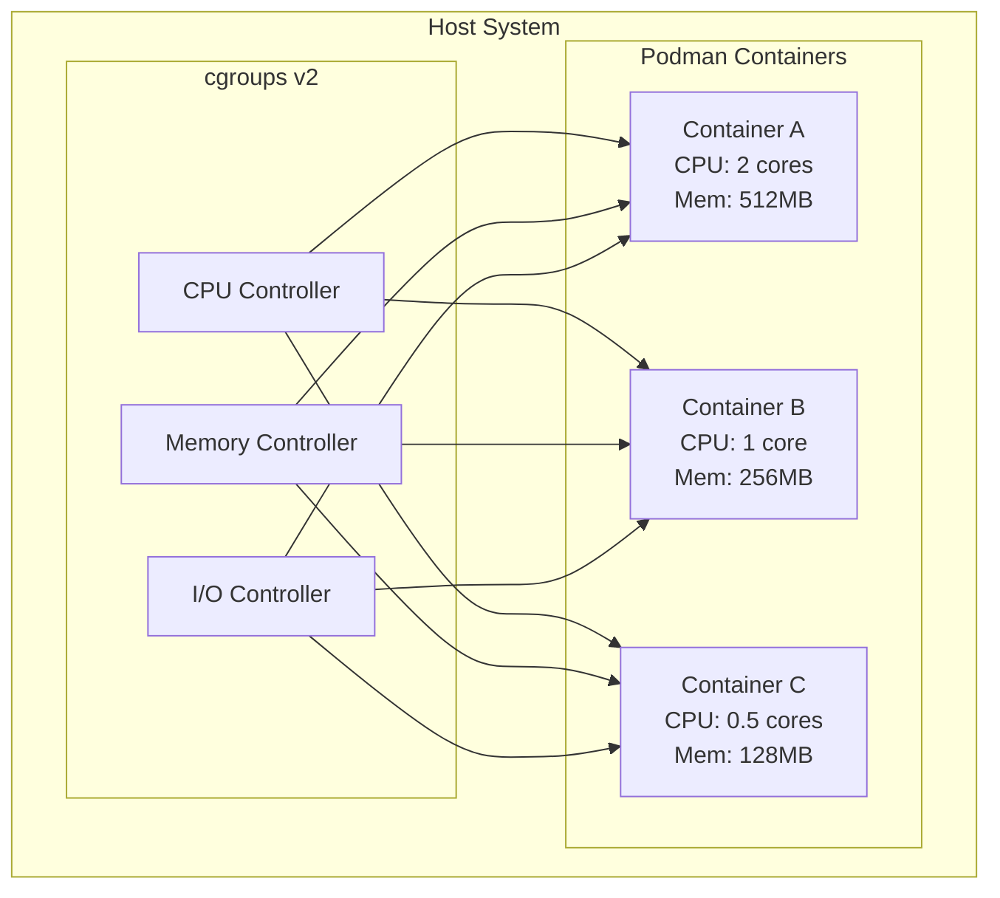
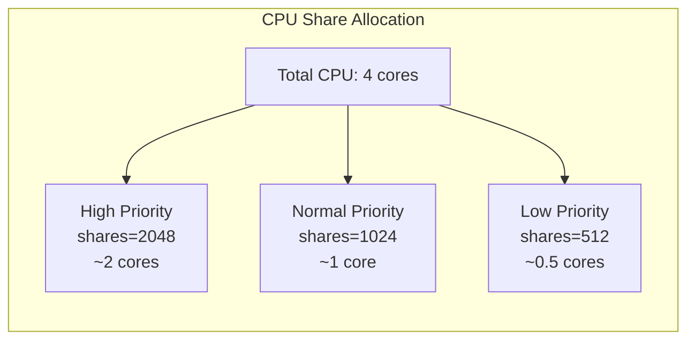
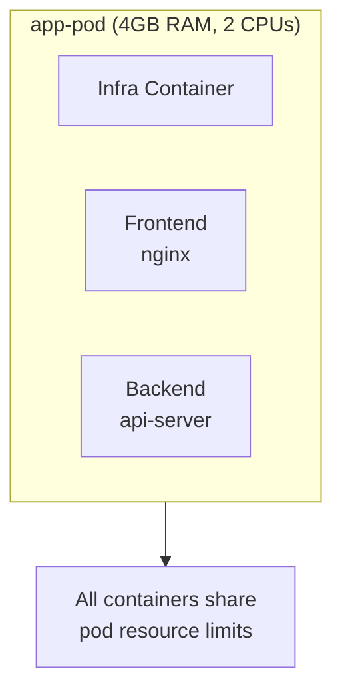

# How to Handle Podman Resource Limits

Author: [nawazdhandala](https://www.github.com/nawazdhandala)

Tags: Podman, Containers, Resource Management, DevOps, Linux, cgroups, Memory Limits, CPU Limits

Description: Learn how to configure and manage resource limits in Podman containers. Covers CPU, memory, I/O constraints, cgroups v2, and practical examples for production workloads.

---

> Running containers without resource limits is like giving every tenant in an apartment building unlimited access to electricity and water. One noisy neighbor can bring down the whole building. Podman resource limits prevent container sprawl from impacting your entire system.

Containers share host resources. Without limits, a single runaway process can starve other containers and crash your system.

---

## Overview



---

## Understanding cgroups v2

Podman uses Linux control groups (cgroups) to enforce resource limits. Modern distributions ship with cgroups v2, which provides unified resource management. Here is how to check your system:

Verify that cgroups v2 is enabled on your system before configuring resource limits:

```bash
# Check if cgroups v2 is enabled
# Output should show "cgroup2" if v2 is active
mount | grep cgroup2

# Verify Podman is using cgroups v2
podman info | grep cgroupVersion
```

---

## Memory Limits

### Basic Memory Constraints

Memory limits prevent containers from consuming all available RAM. When a container exceeds its memory limit, the kernel's OOM killer terminates it.

Set a hard memory limit that the container cannot exceed:

```bash
# Run a container with 512MB memory limit
# The container will be killed if it exceeds this limit
podman run -d \
    --name web-server \
    --memory 512m \
    nginx:latest
```

### Memory with Swap

Configure both memory and swap limits for more granular control over container memory usage:

```bash
# Set 512MB memory with 1GB total (memory + swap)
# The container can use 512MB RAM and 512MB swap
podman run -d \
    --name app-server \
    --memory 512m \
    --memory-swap 1g \
    myapp:latest

# Disable swap entirely for the container
# Recommended for latency-sensitive applications
podman run -d \
    --name realtime-app \
    --memory 1g \
    --memory-swap 1g \
    realtime-processor:latest
```

### Memory Reservation

Memory reservation sets a soft limit that the system tries to maintain but can exceed under pressure:

```bash
# Hard limit of 1GB, soft limit (reservation) of 512MB
# Container gets at least 512MB, can burst to 1GB if available
podman run -d \
    --name burst-app \
    --memory 1g \
    --memory-reservation 512m \
    burst-worker:latest
```

---

## CPU Limits

### CPU Shares

CPU shares determine relative CPU allocation between containers. Containers with higher shares get more CPU time when there is contention.



Assign relative CPU priority using shares (default is 1024):

```bash
# High priority container gets double the CPU share
# When CPU is contested, this container gets priority
podman run -d \
    --name high-priority \
    --cpu-shares 2048 \
    critical-service:latest

# Low priority container for background tasks
# Gets less CPU when system is busy
podman run -d \
    --name background-job \
    --cpu-shares 512 \
    batch-processor:latest
```

### CPU Quota

CPU quota provides hard limits on CPU usage regardless of available capacity:

```bash
# Limit container to 1.5 CPU cores
# The container cannot exceed this even if more CPU is available
podman run -d \
    --name limited-app \
    --cpus 1.5 \
    compute-worker:latest

# Alternative syntax using period and quota
# 150000 microseconds out of 100000 = 1.5 CPUs
podman run -d \
    --name limited-app-v2 \
    --cpu-period 100000 \
    --cpu-quota 150000 \
    compute-worker:latest
```

### CPU Pinning

Pin containers to specific CPU cores for consistent performance and cache locality:

```bash
# Pin container to CPUs 0 and 1
# Useful for latency-sensitive workloads
podman run -d \
    --name pinned-app \
    --cpuset-cpus 0,1 \
    low-latency-service:latest

# Pin to CPU range 0-3 (4 cores)
podman run -d \
    --name multi-core-app \
    --cpuset-cpus 0-3 \
    parallel-processor:latest
```

---

## I/O Limits

### Block I/O Weight

Control relative I/O priority between containers using block I/O weight:

```bash
# High I/O priority for database container (weight range: 10-1000)
# Default weight is 500
podman run -d \
    --name database \
    --blkio-weight 900 \
    postgres:latest

# Low I/O priority for batch jobs
podman run -d \
    --name batch-writer \
    --blkio-weight 100 \
    backup-service:latest
```

### Device-Specific Limits

Limit read/write bandwidth for specific block devices:

```bash
# Limit read speed to 10MB/s on device sda
# Prevents container from saturating disk I/O
podman run -d \
    --name io-limited \
    --device-read-bps /dev/sda:10mb \
    data-processor:latest

# Limit write speed to 5MB/s
podman run -d \
    --name write-limited \
    --device-write-bps /dev/sda:5mb \
    log-writer:latest

# Limit read operations to 1000 IOPS
podman run -d \
    --name iops-limited \
    --device-read-iops /dev/sda:1000 \
    random-reader:latest
```

---

## Process and File Limits

### Process Limits

Prevent fork bombs and runaway process creation by limiting the number of processes:

```bash
# Limit container to 100 processes maximum
# Protects against fork bombs and resource exhaustion
podman run -d \
    --name safe-container \
    --pids-limit 100 \
    untrusted-app:latest

# Unlimited processes (not recommended for production)
podman run -d \
    --name unlimited-procs \
    --pids-limit -1 \
    trusted-internal:latest
```

### File Descriptor Limits

Configure ulimits for file descriptors and other system resources:

```bash
# Set maximum open files to 65536
# Important for high-connection services
podman run -d \
    --name high-connections \
    --ulimit nofile=65536:65536 \
    load-balancer:latest

# Set multiple ulimits for comprehensive resource control
podman run -d \
    --name controlled-app \
    --ulimit nofile=65536:65536 \
    --ulimit nproc=4096:4096 \
    production-service:latest
```

---

## Combining Resource Limits

### Production Container Configuration

Apply multiple resource limits for a production-ready container:

```bash
# Full production configuration with all resource limits
# Each flag serves a specific purpose for reliability
podman run -d \
    --name production-api \
    --memory 2g \
    --memory-reservation 1g \
    --memory-swap 2g \
    --cpus 2.0 \
    --cpu-shares 1024 \
    --pids-limit 200 \
    --ulimit nofile=65536:65536 \
    --blkio-weight 500 \
    --restart unless-stopped \
    api-server:latest
```

### Resource Profile Script

Automate resource allocation with a reusable script for different workload types:

```bash
#!/bin/bash
# run-with-limits.sh
# Apply standard resource profiles based on workload type

set -euo pipefail

PROFILE="${1:-standard}"
IMAGE="${2:-}"
NAME="${3:-}"

if [[ -z "$IMAGE" ]] || [[ -z "$NAME" ]]; then
    echo "Usage: $0 <profile> <image> <name>"
    echo "Profiles: minimal, standard, performance, database"
    exit 1
fi

# Define resource profiles for different workload types
case "$PROFILE" in
    minimal)
        # For lightweight services and sidecars
        MEMORY="256m"
        CPUS="0.5"
        PIDS="50"
        ;;
    standard)
        # Default profile for most applications
        MEMORY="1g"
        CPUS="1.0"
        PIDS="100"
        ;;
    performance)
        # For CPU-intensive workloads
        MEMORY="4g"
        CPUS="4.0"
        PIDS="500"
        ;;
    database)
        # Optimized for database workloads
        MEMORY="8g"
        CPUS="2.0"
        PIDS="200"
        ;;
    *)
        echo "Unknown profile: $PROFILE"
        exit 1
        ;;
esac

# Run container with selected profile
podman run -d \
    --name "$NAME" \
    --memory "$MEMORY" \
    --cpus "$CPUS" \
    --pids-limit "$PIDS" \
    --ulimit nofile=65536:65536 \
    "$IMAGE"

echo "Started $NAME with $PROFILE profile"
echo "Memory: $MEMORY, CPUs: $CPUS, PIDs: $PIDS"
```

---

## Monitoring Resource Usage

### Real-Time Statistics

Monitor container resource consumption in real-time to validate your limits:

```bash
# View live resource statistics for all containers
# Shows CPU%, memory usage, network, and block I/O
podman stats

# Monitor a specific container
podman stats production-api

# Get stats in JSON format for scripting
podman stats --format json production-api
```

### Resource Inspection

Inspect configured resource limits on running containers:

```bash
# View all resource limits for a container
# Returns detailed cgroup configuration
podman inspect production-api --format '{{.HostConfig.Memory}}'

# Check multiple resource settings at once
podman inspect production-api --format '
Memory Limit: {{.HostConfig.Memory}}
CPU Shares: {{.HostConfig.CpuShares}}
CPU Quota: {{.HostConfig.CpuQuota}}
PID Limit: {{.HostConfig.PidsLimit}}'
```

---

## Rootless Container Limits

### Rootless Configuration

Running Podman rootless requires additional configuration for resource limits. User namespaces have specific constraints that differ from root mode.

Enable cgroup delegation for rootless users to allow resource limit enforcement:

```bash
# Create systemd user directory for cgroup delegation
mkdir -p ~/.config/systemd/user/

# Enable CPU, memory, and I/O controllers for the user
sudo mkdir -p /etc/systemd/system/user@.service.d/
sudo tee /etc/systemd/system/user@.service.d/delegate.conf << 'EOF'
[Service]
Delegate=cpu cpuset io memory pids
EOF

# Reload systemd to apply changes
sudo systemctl daemon-reload
```

### Rootless Memory Limits

Configure memory limits in rootless mode using the containers.conf file:

```bash
# Create user-specific containers configuration
mkdir -p ~/.config/containers/

# Set default memory limits for rootless containers
cat > ~/.config/containers/containers.conf << 'EOF'
[containers]
# Default memory limit for all containers
default_memory = "1g"

# Default CPU limit
default_cpus = 1.0

# Default process limit
pids_limit = 100
EOF
```

---

## Quadlet and Systemd Integration

### Systemd Unit with Resource Limits

Define resource limits in Quadlet files for systemd-managed containers:

```ini
# ~/.config/containers/systemd/webapp.container
[Unit]
Description=Web Application Container
After=network-online.target

[Container]
Image=webapp:latest
ContainerName=webapp

# Memory limits
Memory=2g
MemoryReservation=1g

# CPU limits
CPUQuota=150%

# Process limits
PidsLimit=200

# Additional runtime options
Ulimit=nofile=65536:65536

[Service]
Restart=always
TimeoutStartSec=120

[Install]
WantedBy=default.target
```

### Generate and Enable Service

Activate the Quadlet-defined container service with systemd:

```bash
# Reload systemd to detect new Quadlet files
systemctl --user daemon-reload

# Start the container service
systemctl --user start webapp.service

# Enable automatic startup
systemctl --user enable webapp.service

# Check container status
systemctl --user status webapp.service
podman stats webapp
```

---

## Pod-Level Resource Limits

### Creating Resource-Limited Pods

Apply resource limits at the pod level to constrain all containers within:

```bash
# Create a pod with shared resource limits
# All containers in the pod share these constraints
podman pod create \
    --name app-pod \
    --memory 4g \
    --cpus 2.0

# Add containers to the pod
# Containers inherit pod-level limits
podman run -d \
    --pod app-pod \
    --name frontend \
    nginx:latest

podman run -d \
    --pod app-pod \
    --name backend \
    api-server:latest
```



---

## Handling OOM Events

### OOM Killer Configuration

Configure how the kernel handles out-of-memory situations for your containers:

```bash
# Disable OOM killer for critical containers
# The container will hang instead of being killed
# Use with caution - can cause system instability
podman run -d \
    --name critical-service \
    --memory 2g \
    --oom-kill-disable \
    critical-app:latest

# Adjust OOM score for prioritization
# Lower scores are less likely to be killed (-1000 to 1000)
podman run -d \
    --name important-service \
    --memory 1g \
    --oom-score-adj -500 \
    important-app:latest
```

### Monitoring OOM Events

Detect and respond to out-of-memory events using container events:

```bash
#!/bin/bash
# monitor-oom.sh
# Monitor containers for OOM events and alert

# Listen for container events in real-time
podman events --filter event=oom --format json | while read -r event; do
    CONTAINER=$(echo "$event" | jq -r '.Actor.Attributes.name')
    TIME=$(echo "$event" | jq -r '.time')

    echo "OOM event detected!"
    echo "Container: $CONTAINER"
    echo "Time: $TIME"

    # Send alert (replace with your alerting mechanism)
    # curl -X POST https://alerts.example.com/oom \
    #     -d "container=$CONTAINER&time=$TIME"
done
```

---

## Resource Limit Troubleshooting

### Common Issues and Solutions

Diagnose resource limit problems using inspection and stats commands:

```bash
# Check if container was killed due to OOM
# Exit code 137 indicates OOM kill
podman inspect webapp --format '{{.State.ExitCode}}'

# View container resource limits vs actual usage
podman stats webapp --no-stream

# Check cgroup settings directly
# Replace <container-id> with actual ID
cat /sys/fs/cgroup/user.slice/user-$(id -u).slice/user@$(id -u).service/user.slice/libpod-<container-id>.scope/memory.max

# Debug cgroup v2 controller availability
cat /sys/fs/cgroup/cgroup.controllers
```

### Updating Limits on Running Containers

Modify resource limits on running containers without restart:

```bash
# Update memory limit on running container
podman update --memory 4g webapp

# Update CPU limit
podman update --cpus 2.0 webapp

# Update multiple limits at once
podman update \
    --memory 4g \
    --cpus 2.0 \
    --pids-limit 300 \
    webapp
```

---

## Best Practices

1. **Always set memory limits** - prevents single containers from consuming all RAM
2. **Use memory reservation** - allows bursting while guaranteeing baseline resources
3. **Set PID limits** - protects against fork bombs and runaway processes
4. **Monitor before setting limits** - understand actual usage patterns first
5. **Start conservative** - increase limits based on observed behavior
6. **Use profiles** - standardize resource allocation across environments
7. **Enable cgroup v2** - modern unified resource management

---

## Quick Reference

| Resource | Flag | Example |
|----------|------|---------|
| Memory limit | `--memory` | `--memory 512m` |
| Memory + swap | `--memory-swap` | `--memory-swap 1g` |
| CPU cores | `--cpus` | `--cpus 1.5` |
| CPU shares | `--cpu-shares` | `--cpu-shares 2048` |
| CPU pinning | `--cpuset-cpus` | `--cpuset-cpus 0,1` |
| Process limit | `--pids-limit` | `--pids-limit 100` |
| I/O weight | `--blkio-weight` | `--blkio-weight 500` |
| File descriptors | `--ulimit` | `--ulimit nofile=65536:65536` |

---

## Conclusion

Proper resource limits are essential for running stable container workloads. Podman provides comprehensive controls through cgroups v2:

- **Memory limits** prevent OOM conditions and container sprawl
- **CPU limits** ensure fair resource distribution
- **I/O limits** protect storage subsystems from saturation
- **Process limits** guard against fork bombs

Start with reasonable defaults, monitor actual usage, and adjust based on your application's behavior. Well-configured resource limits lead to more predictable and reliable containerized applications.

---

*Running containers in production? [OneUptime](https://oneuptime.com) provides comprehensive container monitoring with resource usage alerts and performance insights.*
