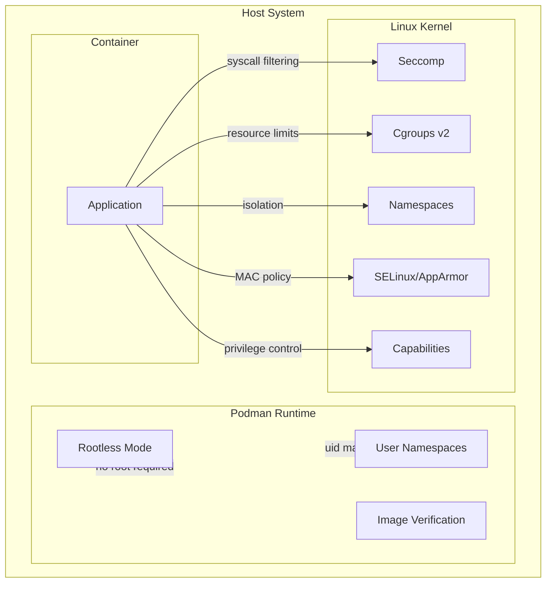
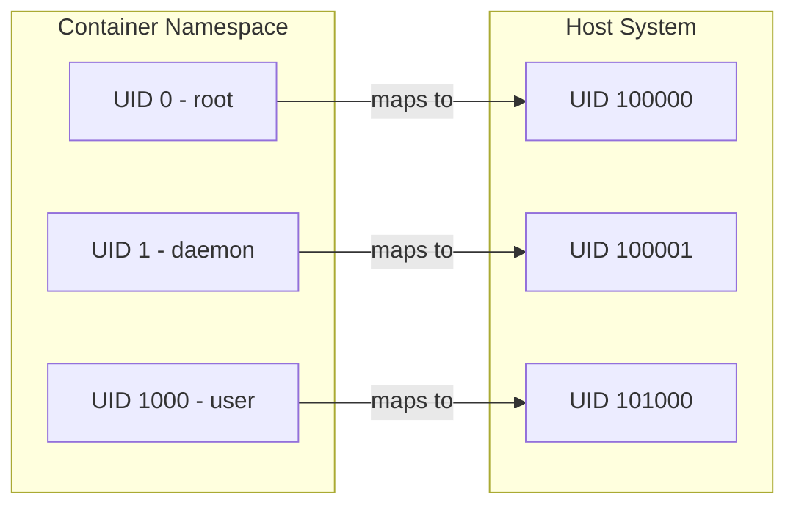
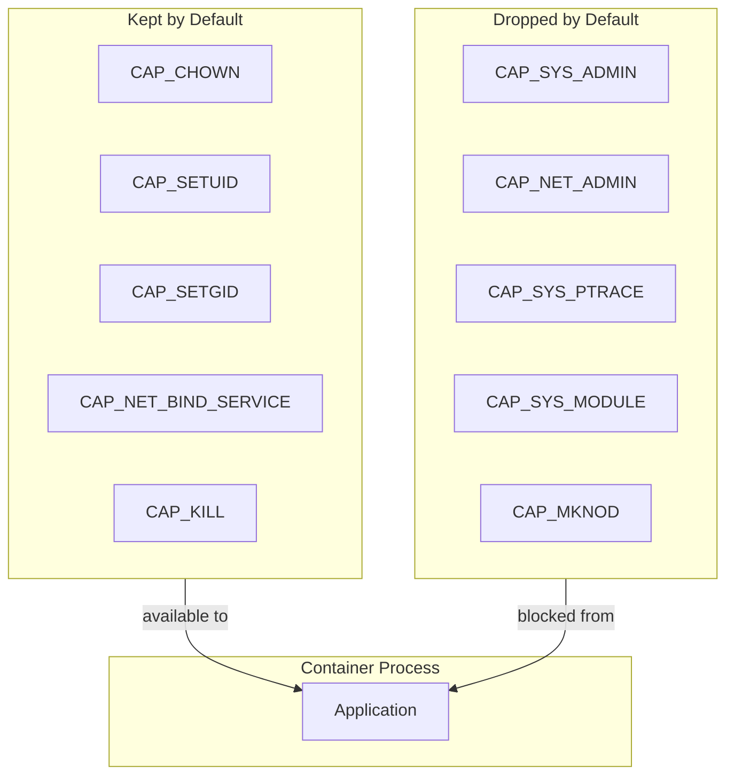
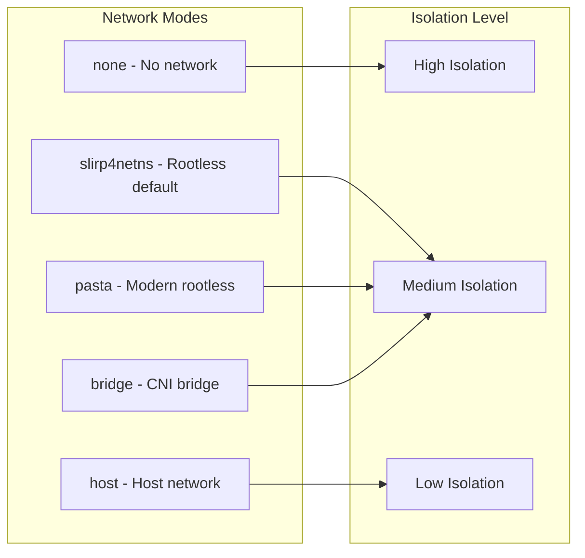

# How to Configure Podman Security

Author: [nawazdhandala](https://www.github.com/nawazdhandala)

Tags: Podman, Security, Containers, Rootless, SELinux, DevOps, Linux

Description: A comprehensive guide to securing Podman containers, covering rootless mode, user namespaces, SELinux policies, seccomp profiles, capability management, and network isolation for production environments.

---

Podman has become the go-to container runtime for security-conscious organizations. Unlike Docker, Podman runs containers without a daemon and supports rootless execution out of the box. However, default configurations may not satisfy strict security requirements. Proper hardening involves layering multiple security mechanisms to create defense in depth.

## Podman Security Architecture

Podman implements multiple security layers that work together to isolate containers from the host system. Understanding how these layers interact helps you make informed decisions about which controls to enable.

The following diagram shows how Podman security mechanisms create defense in depth:



Each layer addresses different attack vectors. Namespaces provide isolation, cgroups control resource usage, seccomp filters system calls, SELinux enforces mandatory access control, and capabilities restrict root privileges.

## Rootless Podman Setup

Running containers as a non-root user significantly reduces the attack surface. Even if an attacker escapes the container, they only gain access as an unprivileged user on the host.

Verify that your system supports rootless containers by checking the required kernel features:

```bash
# Check kernel version (should be 4.18+ for full rootless support)
uname -r

# Verify user namespaces are enabled
cat /proc/sys/user/max_user_namespaces
# Should return a number greater than 0

# Check if newuidmap and newgidmap are installed
which newuidmap newgidmap
```

Configure subordinate UID and GID ranges for your user. These ranges allow Podman to create containers with their own user mappings:

```bash
# Add subordinate ID ranges for your user
# Format: username:start_id:count
sudo usermod --add-subuids 100000-165535 $USER
sudo usermod --add-subgids 100000-165535 $USER

# Verify the configuration
cat /etc/subuid
cat /etc/subgid
```

Enable the required kernel parameters in production environments:

```bash
# Allow unprivileged user namespaces (if not enabled by default)
sudo sysctl -w user.max_user_namespaces=15000

# Make the setting persistent
echo "user.max_user_namespaces=15000" | sudo tee /etc/sysctl.d/99-podman.conf
sudo sysctl --system
```

Run your first rootless container to verify the setup works correctly:

```bash
# Run as your regular user (not root)
podman run --rm alpine id

# Output should show a non-root user inside the container
# uid=0(root) gid=0(root) - but this maps to your user on the host
```

## User Namespace Configuration

User namespaces map container UIDs to unprivileged UIDs on the host. When container root (UID 0) escapes, it becomes an unprivileged user (like UID 100000) on the host.

The following diagram illustrates UID mapping between container and host:



Configure custom UID mappings when you need specific mappings between container and host:

```bash
# Run container with explicit UID mapping
# Maps container UID 0 to host UID 100000
podman run --rm \
    --uidmap 0:100000:65536 \
    --gidmap 0:100000:65536 \
    alpine cat /proc/self/uid_map

# Use keep-id to preserve your UID inside the container
# Useful for development when mounting source code
podman run --rm \
    --userns=keep-id \
    -v $PWD:/workspace:Z \
    alpine id
```

Configure the default user namespace mode in containers.conf:

```toml
# ~/.config/containers/containers.conf

[containers]
# Use host user namespace for specific containers
userns = "auto"

# Set the default UID/GID size for auto mode
userns_size = 65536

# Specify the range of UIDs to use
# This should match your /etc/subuid entry
uidmap = "0:100000:65536"
gidmap = "0:100000:65536"
```

Verify your namespace configuration is working as expected:

```bash
# Check the UID mapping of a running container
podman run -d --name test-ns alpine sleep 3600

# Inspect the namespace configuration
podman inspect test-ns --format '{{.HostConfig.UsernsMode}}'
podman inspect test-ns --format '{{json .HostConfig.IDMappings}}'

# Check from host perspective
ps aux | grep "sleep 3600"
# The process should run as your user, not root

podman rm -f test-ns
```

## SELinux Container Policies

SELinux provides mandatory access control that restricts what containers can access, even if other security mechanisms fail. Podman automatically applies SELinux labels to containers.

Configure SELinux context labels when mounting volumes:

```bash
# The :Z option relabels the volume for exclusive container access
podman run --rm \
    -v /path/to/data:/data:Z \
    alpine ls /data

# The :z option allows the volume to be shared between containers
podman run --rm \
    -v /path/to/shared:/shared:z \
    alpine ls /shared

# Use :ro for read-only mounts with SELinux context
podman run --rm \
    -v /etc/passwd:/etc/passwd:ro,z \
    alpine cat /etc/passwd
```

Apply custom SELinux types when you need fine-grained control:

```bash
# Run container with specific SELinux type
podman run --rm \
    --security-opt label=type:container_runtime_t \
    alpine id

# Disable SELinux separation (not recommended for production)
podman run --rm \
    --security-opt label=disable \
    alpine id

# Apply Multi-Category Security (MCS) labels
podman run --rm \
    --security-opt label=level:s0:c100,c200 \
    alpine id
```

Create custom SELinux policy modules for specialized workloads. Save the following policy and compile it:

```bash
# container_custom.te - Custom SELinux policy for containers
# Allows containers to bind to privileged ports

module container_custom 1.0;

require {
    type container_t;
    type unreserved_port_t;
    class tcp_socket name_bind;
}

# Allow container processes to bind to ports below 1024
allow container_t unreserved_port_t:tcp_socket name_bind;
```

Compile and install the custom SELinux policy:

```bash
# Compile the policy module
checkmodule -M -m -o container_custom.mod container_custom.te
semodule_package -o container_custom.pp -m container_custom.mod

# Install the policy module
sudo semodule -i container_custom.pp

# Verify the module is loaded
sudo semodule -l | grep container_custom
```

## Seccomp Profile Configuration

Seccomp filters restrict which system calls containers can execute. Blocking dangerous syscalls prevents many container escape techniques.

The default Podman seccomp profile blocks approximately 50 system calls. View the default profile and understand what it restricts:

```bash
# Generate the default seccomp profile
podman info --format '{{json .Host.Security.DefaultSeccompProfile}}' | jq .

# Check seccomp status for a running container
podman run -d --name test-seccomp alpine sleep 3600
podman inspect test-seccomp --format '{{.HostConfig.SecurityOpt}}'
podman rm -f test-seccomp
```

Create a custom seccomp profile that restricts additional syscalls for high-security workloads:

```json
{
    "defaultAction": "SCMP_ACT_ERRNO",
    "defaultErrnoRet": 1,
    "archMap": [
        {
            "architecture": "SCMP_ARCH_X86_64",
            "subArchitectures": [
                "SCMP_ARCH_X86",
                "SCMP_ARCH_X32"
            ]
        },
        {
            "architecture": "SCMP_ARCH_AARCH64",
            "subArchitectures": [
                "SCMP_ARCH_ARM"
            ]
        }
    ],
    "syscalls": [
        {
            "names": [
                "accept",
                "accept4",
                "access",
                "arch_prctl",
                "bind",
                "brk",
                "capget",
                "capset",
                "chdir",
                "chmod",
                "chown",
                "clock_getres",
                "clock_gettime",
                "clone",
                "close",
                "connect",
                "dup",
                "dup2",
                "dup3",
                "epoll_create",
                "epoll_create1",
                "epoll_ctl",
                "epoll_wait",
                "epoll_pwait",
                "execve",
                "exit",
                "exit_group",
                "fchdir",
                "fchmod",
                "fchown",
                "fcntl",
                "fstat",
                "fstatfs",
                "futex",
                "getcwd",
                "getdents",
                "getdents64",
                "getegid",
                "geteuid",
                "getgid",
                "getpgrp",
                "getpid",
                "getppid",
                "getrlimit",
                "getsockname",
                "getsockopt",
                "gettid",
                "getuid",
                "ioctl",
                "listen",
                "lseek",
                "lstat",
                "madvise",
                "mkdir",
                "mmap",
                "mprotect",
                "munmap",
                "nanosleep",
                "open",
                "openat",
                "pipe",
                "pipe2",
                "poll",
                "prctl",
                "pread64",
                "prlimit64",
                "pwrite64",
                "read",
                "readlink",
                "recvfrom",
                "recvmsg",
                "rename",
                "rmdir",
                "rt_sigaction",
                "rt_sigprocmask",
                "rt_sigreturn",
                "sched_getaffinity",
                "sched_yield",
                "select",
                "sendmsg",
                "sendto",
                "set_robust_list",
                "set_tid_address",
                "setsockopt",
                "shutdown",
                "socket",
                "stat",
                "statfs",
                "symlink",
                "sysinfo",
                "tgkill",
                "umask",
                "uname",
                "unlink",
                "wait4",
                "write",
                "writev"
            ],
            "action": "SCMP_ACT_ALLOW"
        }
    ]
}
```

Apply the custom seccomp profile to containers:

```bash
# Save the profile to a file
cat > /tmp/restricted-seccomp.json << 'EOF'
{
    "defaultAction": "SCMP_ACT_ERRNO",
    "syscalls": [
        {
            "names": ["read", "write", "exit", "exit_group", "brk", "mmap", "munmap", "close", "fstat", "openat", "clock_gettime"],
            "action": "SCMP_ACT_ALLOW"
        }
    ]
}
EOF

# Run container with custom seccomp profile
podman run --rm \
    --security-opt seccomp=/tmp/restricted-seccomp.json \
    alpine echo "Running with restricted seccomp"

# Run without seccomp filtering (not recommended)
podman run --rm \
    --security-opt seccomp=unconfined \
    alpine id
```

## Linux Capabilities Management

Linux capabilities divide root privileges into discrete units. Dropping unnecessary capabilities limits the damage from container compromise.

The following diagram shows the default capabilities Podman grants to containers:



Drop all capabilities and add only what your application needs:

```bash
# Drop all capabilities, add only specific ones
podman run --rm \
    --cap-drop=all \
    --cap-add=NET_BIND_SERVICE \
    alpine cat /proc/self/status | grep Cap

# List available capabilities
podman run --rm alpine capsh --print

# Run a web server that needs to bind to port 80
podman run --rm \
    --cap-drop=all \
    --cap-add=NET_BIND_SERVICE \
    --cap-add=SETUID \
    --cap-add=SETGID \
    nginx:alpine
```

Configure default capability settings in containers.conf:

```toml
# ~/.config/containers/containers.conf

[containers]
# Drop these capabilities from all containers
default_capabilities = [
    "CHOWN",
    "DAC_OVERRIDE",
    "FOWNER",
    "FSETID",
    "KILL",
    "NET_BIND_SERVICE",
    "SETFCAP",
    "SETGID",
    "SETPCAP",
    "SETUID"
]

# You can also specify capabilities to always drop
# dropped_capabilities = ["SYS_ADMIN", "NET_ADMIN"]
```

Audit capability usage in running containers:

```bash
# Check capabilities of a running container
podman run -d --name cap-test alpine sleep 3600
podman top cap-test capeff

# Get detailed capability information
podman exec cap-test cat /proc/1/status | grep -E "Cap(Inh|Prm|Eff|Bnd|Amb)"

# Decode the capability bitmask
podman exec cap-test capsh --decode=00000000a80425fb

podman rm -f cap-test
```

## Network Security Configuration

Podman supports multiple networking modes with different security properties. Choosing the right mode depends on your isolation requirements.

The following diagram shows available network modes and their isolation levels:



Configure network isolation based on your security requirements:

```bash
# Complete network isolation
podman run --rm \
    --network=none \
    alpine ip addr

# Use slirp4netns for rootless networking (default)
podman run --rm \
    --network=slirp4netns:enable_ipv6=false,port_handler=rootlesskit \
    alpine wget -qO- ifconfig.me

# Use pasta for better performance in rootless mode
podman run --rm \
    --network=pasta \
    alpine wget -qO- ifconfig.me
```

Create isolated networks for multi-container applications:

```bash
# Create an internal network (no external access)
podman network create --internal secure-network

# Run containers on the internal network
podman run -d \
    --name db \
    --network=secure-network \
    postgres:alpine

podman run -d \
    --name app \
    --network=secure-network \
    myapp:latest

# Verify containers can communicate internally
podman exec app ping -c 2 db

# Verify no external access from internal network
podman exec app ping -c 2 8.8.8.8 || echo "External access blocked"

# Clean up
podman rm -f db app
podman network rm secure-network
```

Configure firewall rules for container traffic:

```bash
# Create network with specific subnet
podman network create \
    --subnet=10.89.0.0/24 \
    --gateway=10.89.0.1 \
    --ip-range=10.89.0.0/25 \
    secure-net

# Apply iptables rules to restrict container traffic
sudo iptables -I FORWARD -s 10.89.0.0/24 -d 10.0.0.0/8 -j DROP
sudo iptables -I FORWARD -s 10.89.0.0/24 -d 172.16.0.0/12 -j DROP
sudo iptables -I FORWARD -s 10.89.0.0/24 -d 192.168.0.0/16 -j DROP

# Allow only specific external destinations
sudo iptables -I FORWARD -s 10.89.0.0/24 -d 1.1.1.1 -j ACCEPT
```

## Read-Only Containers

Running containers with read-only root filesystems prevents malware from persisting or modifying system files.

Configure containers with read-only root filesystem and explicit writable locations:

```bash
# Run with read-only root filesystem
podman run --rm \
    --read-only \
    alpine touch /test.txt || echo "Write blocked"

# Allow specific writable directories using tmpfs
podman run --rm \
    --read-only \
    --tmpfs /tmp:rw,noexec,nosuid,size=64m \
    --tmpfs /var/run:rw,noexec,nosuid,size=64m \
    alpine sh -c "touch /tmp/test.txt && echo 'tmpfs write succeeded'"

# Configure for applications that need specific writable paths
podman run --rm \
    --read-only \
    --tmpfs /tmp \
    --tmpfs /var/cache/nginx \
    -v nginx-data:/var/log/nginx:Z \
    nginx:alpine nginx -t
```

Create a production-ready read-only container configuration:

```bash
# Run nginx with minimal write permissions
podman run -d \
    --name secure-nginx \
    --read-only \
    --tmpfs /tmp:rw,noexec,nosuid,size=10m \
    --tmpfs /var/cache/nginx:rw,noexec,nosuid,size=100m \
    --tmpfs /var/run:rw,noexec,nosuid,size=10m \
    -v /path/to/static:/usr/share/nginx/html:ro,Z \
    -p 8080:80 \
    nginx:alpine

# Verify read-only status
podman exec secure-nginx touch /etc/test || echo "Root filesystem is read-only"

podman rm -f secure-nginx
```

## Resource Limits and Cgroups

Resource limits prevent containers from exhausting host resources, whether through bugs or malicious activity.

Configure memory and CPU limits to prevent resource exhaustion:

```bash
# Set memory limit with swap disabled
podman run --rm \
    --memory=256m \
    --memory-swap=256m \
    alpine free -m

# Limit CPU usage
podman run --rm \
    --cpus=0.5 \
    --cpu-shares=512 \
    alpine cat /sys/fs/cgroup/cpu.max

# Limit number of processes
podman run --rm \
    --pids-limit=100 \
    alpine cat /sys/fs/cgroup/pids.max
```

Configure I/O limits to prevent disk exhaustion:

```bash
# Limit block I/O bandwidth
podman run --rm \
    --device-read-bps=/dev/sda:10mb \
    --device-write-bps=/dev/sda:10mb \
    alpine dd if=/dev/zero of=/tmp/test bs=1M count=100 2>&1

# Limit I/O operations per second
podman run --rm \
    --device-read-iops=/dev/sda:1000 \
    --device-write-iops=/dev/sda:1000 \
    alpine cat /sys/fs/cgroup/io.max
```

Set default resource limits in containers.conf:

```toml
# ~/.config/containers/containers.conf

[containers]
# Default memory limit for all containers
memory = 512m
memory_swap = 512m

# Default CPU limit
cpus = 1.0

# Default process limit
pids_limit = 1024

# Default ulimits
default_ulimits = [
    "nofile=1024:2048",
    "nproc=512:1024"
]
```

## Image Verification and Trust

Verify container images before running them to ensure they have not been tampered with.

Configure Podman to require signed images:

```bash
# Configure image signature verification
mkdir -p ~/.config/containers/registries.d

cat > ~/.config/containers/registries.d/default.yaml << 'EOF'
default-docker:
  sigstore: https://sigstore.example.com
docker:
  docker.io:
    sigstore: https://sigstore.docker.io
  quay.io:
    sigstore: https://quay.io/sigstore
EOF
```

Create a signature verification policy:

```json
{
    "default": [
        {
            "type": "reject"
        }
    ],
    "transports": {
        "docker": {
            "docker.io/library": [
                {
                    "type": "signedBy",
                    "keyType": "GPGKeys",
                    "keyPath": "/etc/pki/containers/docker-official.gpg"
                }
            ],
            "myregistry.io": [
                {
                    "type": "signedBy",
                    "keyType": "GPGKeys",
                    "keyPath": "/etc/pki/containers/mykey.gpg"
                }
            ],
            "": [
                {
                    "type": "insecureAcceptAnything"
                }
            ]
        },
        "atomic": {
            "": [
                {
                    "type": "reject"
                }
            ]
        }
    }
}
```

Save the policy and configure Podman to use it:

```bash
# Save policy to the correct location
sudo cp policy.json /etc/containers/policy.json

# Verify an image signature manually
skopeo inspect --raw docker://docker.io/library/alpine:latest | jq .

# Pull and verify a signed image
podman pull --signature-verify=true docker.io/library/alpine:latest

# Generate image signatures using GPG
gpg --generate-key
gpg --export --armor security@example.com > /etc/pki/containers/mykey.gpg
```

## Complete Security Hardening Example

Combine all security mechanisms for maximum protection:

```bash
#!/bin/bash
# secure-container.sh - Launch a security-hardened container

CONTAINER_NAME="secure-app"
IMAGE="myregistry.io/myapp:v1.2.3"

podman run -d \
    --name "$CONTAINER_NAME" \
    \
    # Rootless user namespace configuration
    --userns=auto \
    --uidmap=0:100000:65536 \
    --gidmap=0:100000:65536 \
    \
    # Drop all capabilities, add only required ones
    --cap-drop=all \
    --cap-add=NET_BIND_SERVICE \
    \
    # Apply seccomp profile
    --security-opt seccomp=/etc/containers/seccomp/restricted.json \
    \
    # SELinux configuration
    --security-opt label=type:container_runtime_t \
    --security-opt label=level:s0:c100,c200 \
    \
    # Read-only root filesystem
    --read-only \
    --tmpfs /tmp:rw,noexec,nosuid,size=64m \
    --tmpfs /var/run:rw,noexec,nosuid,size=64m \
    \
    # Resource limits
    --memory=512m \
    --memory-swap=512m \
    --cpus=1.0 \
    --pids-limit=256 \
    \
    # Network isolation
    --network=secure-network \
    --publish 127.0.0.1:8080:8080 \
    \
    # No new privileges
    --security-opt no-new-privileges:true \
    \
    # Health check
    --health-cmd="curl -f http://localhost:8080/health || exit 1" \
    --health-interval=30s \
    --health-retries=3 \
    \
    "$IMAGE"

# Verify security configuration
echo "Container security audit:"
podman inspect "$CONTAINER_NAME" --format '
Capabilities: {{.HostConfig.CapDrop}}
User Namespace: {{.HostConfig.UsernsMode}}
Read Only: {{.HostConfig.ReadonlyRootfs}}
Memory Limit: {{.HostConfig.Memory}}
Privileged: {{.HostConfig.Privileged}}
'
```

## Security Audit Script

Create an audit script to verify container security configurations:

```bash
#!/bin/bash
# audit-podman-security.sh - Audit running containers for security issues

echo "=== Podman Security Audit ==="
echo ""

for container in $(podman ps -q); do
    name=$(podman inspect $container --format '{{.Name}}')
    echo "Container: $name"
    echo "-------------------"

    # Check for privileged mode
    privileged=$(podman inspect $container --format '{{.HostConfig.Privileged}}')
    if [ "$privileged" == "true" ]; then
        echo "[CRITICAL] Running in privileged mode"
    else
        echo "[OK] Not privileged"
    fi

    # Check for root user
    user=$(podman inspect $container --format '{{.Config.User}}')
    if [ -z "$user" ] || [ "$user" == "root" ] || [ "$user" == "0" ]; then
        echo "[WARNING] Running as root user"
    else
        echo "[OK] Running as non-root user: $user"
    fi

    # Check for read-only root filesystem
    readonly_fs=$(podman inspect $container --format '{{.HostConfig.ReadonlyRootfs}}')
    if [ "$readonly_fs" == "true" ]; then
        echo "[OK] Read-only root filesystem"
    else
        echo "[WARNING] Writable root filesystem"
    fi

    # Check capabilities
    cap_drop=$(podman inspect $container --format '{{.HostConfig.CapDrop}}')
    if [[ "$cap_drop" == *"all"* ]] || [[ "$cap_drop" == *"ALL"* ]]; then
        echo "[OK] All capabilities dropped"
    else
        echo "[INFO] Capabilities dropped: $cap_drop"
    fi

    # Check for host network mode
    network=$(podman inspect $container --format '{{.HostConfig.NetworkMode}}')
    if [ "$network" == "host" ]; then
        echo "[WARNING] Using host network mode"
    else
        echo "[OK] Network mode: $network"
    fi

    # Check memory limits
    memory=$(podman inspect $container --format '{{.HostConfig.Memory}}')
    if [ "$memory" == "0" ]; then
        echo "[WARNING] No memory limit set"
    else
        echo "[OK] Memory limit: $((memory / 1024 / 1024))MB"
    fi

    echo ""
done
```

## Systemd Integration for Production

Generate and harden systemd units for production container deployments:

```bash
# Generate systemd unit file
podman generate systemd \
    --new \
    --name secure-app \
    --restart-policy=always \
    > ~/.config/systemd/user/container-secure-app.service

# Enable and start the service
systemctl --user daemon-reload
systemctl --user enable --now container-secure-app.service

# Check service status
systemctl --user status container-secure-app.service
```

Enhance the generated systemd unit with additional security directives:

```ini
# ~/.config/systemd/user/container-secure-app.service
[Unit]
Description=Secure Application Container
After=network-online.target
Wants=network-online.target

[Service]
Type=forking
Restart=always
RestartSec=5s
TimeoutStartSec=90s
TimeoutStopSec=90s

# Podman-specific settings
ExecStartPre=/usr/bin/podman rm -f secure-app 2>/dev/null || true
ExecStart=/usr/bin/podman run -d --name secure-app \
    --cap-drop=all \
    --read-only \
    --security-opt no-new-privileges:true \
    --memory=512m \
    --pids-limit=256 \
    myregistry.io/myapp:latest
ExecStop=/usr/bin/podman stop -t 30 secure-app
ExecStopPost=/usr/bin/podman rm -f secure-app

# Systemd security hardening
ProtectHome=true
ProtectSystem=strict
PrivateTmp=true
NoNewPrivileges=true

[Install]
WantedBy=default.target
```

---

Podman security requires a layered approach combining rootless execution, user namespaces, SELinux policies, seccomp filtering, capability restrictions, and network isolation. Start with rootless mode as your foundation, then progressively add restrictions based on your application requirements. Regular security audits using the provided scripts help maintain proper configurations as your deployments evolve. Always test security configurations in staging environments before applying them to production workloads.
