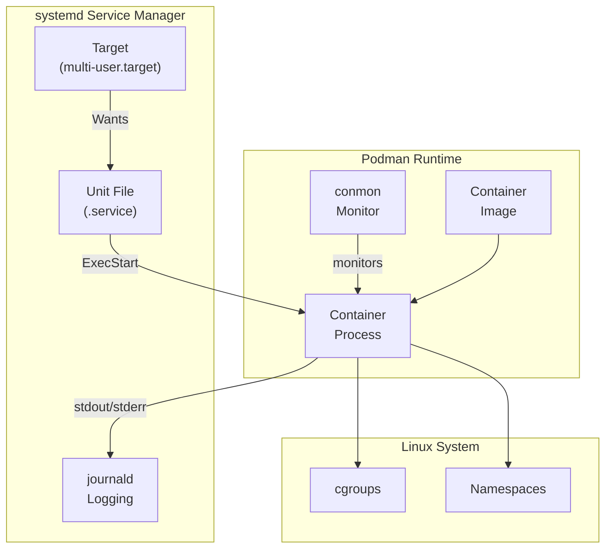
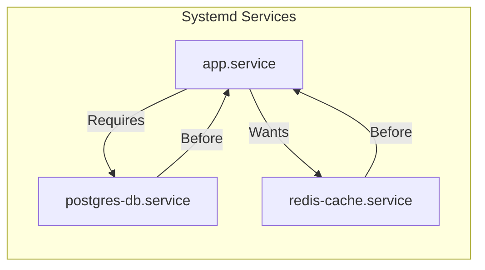
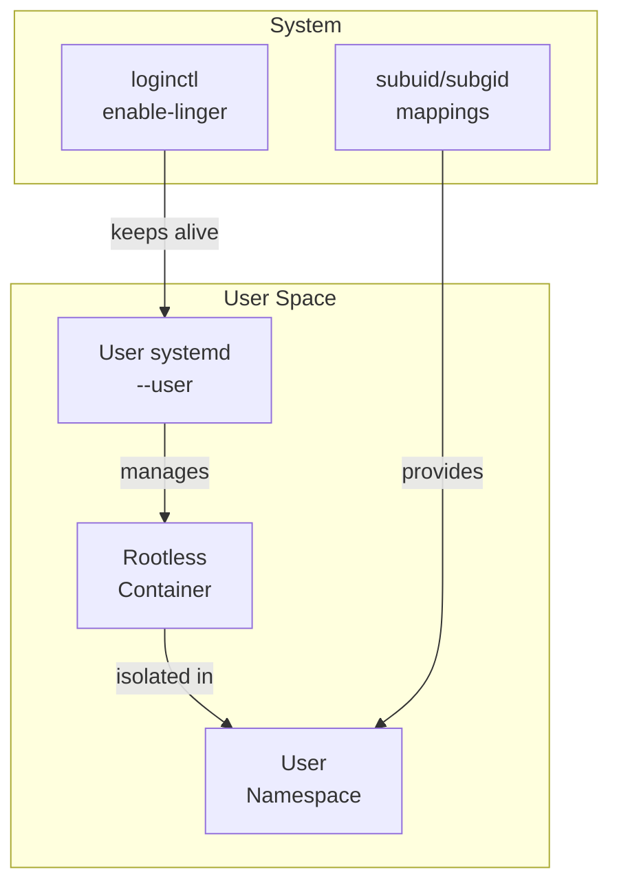

# How to Use Podman with Systemd

Author: [nawazdhandala](https://github.com/nawazdhandala)

Tags: Podman, Systemd, Containers, Linux, DevOps

Description: Learn how to integrate Podman containers with systemd for automatic startup, process supervision, health monitoring, and production-ready container management on Linux systems.

---

Running containers manually is fine for development, but production systems need containers that start automatically on boot, restart on failure, and integrate with your existing Linux service management. Podman and systemd work together naturally because Podman runs containers as regular processes without a daemon - exactly what systemd excels at managing.

Unlike Docker, Podman doesn't require a background daemon. Each container runs as a child process, making it a perfect fit for systemd's process supervision model. You can manage containers just like any other system service, with all the benefits of journald logging, socket activation, and dependency management.

## Understanding the Podman-Systemd Relationship

Here's how Podman containers integrate with systemd:



## Installing Podman

Before diving into systemd integration, make sure Podman is installed on your system.

For Fedora, RHEL, or CentOS:

```bash
# Install Podman on Fedora/RHEL/CentOS
sudo dnf install -y podman

# Verify the installation
podman --version
```

For Ubuntu or Debian:

```bash
# Install Podman on Ubuntu/Debian
sudo apt-get update
sudo apt-get install -y podman

# Verify the installation
podman --version
```

## Generating Systemd Unit Files with Podman

Podman can automatically generate systemd unit files from running containers. Start by creating a container, then let Podman generate the service file.

Create a sample nginx container first:

```bash
# Create and start a detached nginx container with a specific name
podman run -d --name web-server -p 8080:80 nginx:latest
```

Generate the systemd unit file from the running container:

```bash
# Generate a systemd service file for the container
podman generate systemd --name web-server --files --new

# The command creates container-web-server.service in the current directory
```

The `--new` flag is important - it tells the generated service to create a fresh container each time instead of reusing an existing one. Here's what the generated file looks like:

```ini
# container-web-server.service
# Auto-generated by Podman - customize as needed

[Unit]
Description=Podman container-web-server.service
Documentation=man:podman-generate-systemd(1)
Wants=network-online.target
After=network-online.target
RequiresMountsFor=%t/containers

[Service]
# Set environment variables for the container runtime
Environment=PODMAN_SYSTEMD_UNIT=%n
Restart=on-failure
TimeoutStopSec=70
ExecStartPre=/bin/rm -f %t/%n.ctr-id
ExecStart=/usr/bin/podman run \
    --cidfile=%t/%n.ctr-id \
    --cgroups=no-conmon \
    --rm \
    --sdnotify=conmon \
    -d \
    --replace \
    --name web-server \
    -p 8080:80 \
    nginx:latest
ExecStop=/usr/bin/podman stop --ignore --cidfile=%t/%n.ctr-id
ExecStopPost=/usr/bin/podman rm -f --ignore --cidfile=%t/%n.ctr-id
Type=notify
NotifyAccess=all

[Install]
WantedBy=default.target
```

## Installing the Service

Move the generated service file to the appropriate systemd directory and enable it.

For system-wide services (requires root):

```bash
# Move the service file to the systemd system directory
sudo mv container-web-server.service /etc/systemd/system/

# Reload systemd to recognize the new service
sudo systemctl daemon-reload

# Enable the service to start on boot
sudo systemctl enable container-web-server.service

# Start the service immediately
sudo systemctl start container-web-server.service

# Check the service status
sudo systemctl status container-web-server.service
```

For user-level services (rootless containers):

```bash
# Create the user systemd directory if it doesn't exist
mkdir -p ~/.config/systemd/user/

# Move the service file to the user systemd directory
mv container-web-server.service ~/.config/systemd/user/

# Reload the user systemd instance
systemctl --user daemon-reload

# Enable the service for user sessions
systemctl --user enable container-web-server.service

# Start the service
systemctl --user start container-web-server.service

# Enable lingering so services run even when logged out
loginctl enable-linger $USER
```

## Writing Custom Systemd Unit Files

Sometimes you need more control than auto-generated files provide. Here's a custom unit file with environment variables, health checks, and resource limits.

Create a custom service file for a PostgreSQL container:

```ini
# /etc/systemd/system/postgres-db.service
# Custom systemd unit file for PostgreSQL container

[Unit]
Description=PostgreSQL Database Container
Documentation=https://www.postgresql.org/docs/
After=network-online.target
Wants=network-online.target

[Service]
Type=notify
NotifyAccess=all

# Restart configuration
Restart=always
RestartSec=10
TimeoutStartSec=300
TimeoutStopSec=30

# Environment file for sensitive data like passwords
EnvironmentFile=/etc/sysconfig/postgres-db

# Clean up any existing container with the same name before starting
ExecStartPre=-/usr/bin/podman stop postgres-db
ExecStartPre=-/usr/bin/podman rm postgres-db
ExecStartPre=/usr/bin/podman pull docker.io/library/postgres:15

# Main container run command
ExecStart=/usr/bin/podman run \
    --name postgres-db \
    --rm \
    --sdnotify=conmon \
    --cgroups=no-conmon \
    -e POSTGRES_USER=${POSTGRES_USER} \
    -e POSTGRES_PASSWORD=${POSTGRES_PASSWORD} \
    -e POSTGRES_DB=${POSTGRES_DB} \
    -v postgres-data:/var/lib/postgresql/data:Z \
    -p 5432:5432 \
    --health-cmd="pg_isready -U ${POSTGRES_USER}" \
    --health-interval=30s \
    --health-timeout=10s \
    --health-retries=3 \
    docker.io/library/postgres:15

# Stop command with timeout
ExecStop=/usr/bin/podman stop -t 30 postgres-db

# Resource limits using systemd cgroups
MemoryMax=2G
CPUQuota=200%

[Install]
WantedBy=multi-user.target
```

Create the environment file for sensitive configuration:

```bash
# /etc/sysconfig/postgres-db
# Store sensitive environment variables here
# Set proper permissions: chmod 600 /etc/sysconfig/postgres-db

POSTGRES_USER=myapp
POSTGRES_PASSWORD=secretpassword123
POSTGRES_DB=myapp_production
```

## Managing Multiple Containers with Dependencies

When running multi-container applications, you need to manage startup order and dependencies. Here's how to create a complete application stack.



Create a Redis cache service:

```ini
# /etc/systemd/system/redis-cache.service
# Redis caching layer for the application stack

[Unit]
Description=Redis Cache Container
After=network-online.target
Wants=network-online.target

[Service]
Type=notify
NotifyAccess=all
Restart=always
RestartSec=5

ExecStartPre=-/usr/bin/podman stop redis-cache
ExecStartPre=-/usr/bin/podman rm redis-cache

ExecStart=/usr/bin/podman run \
    --name redis-cache \
    --rm \
    --sdnotify=conmon \
    --cgroups=no-conmon \
    -v redis-data:/data:Z \
    -p 6379:6379 \
    docker.io/library/redis:7 \
    redis-server --appendonly yes

ExecStop=/usr/bin/podman stop -t 10 redis-cache

MemoryMax=512M

[Install]
WantedBy=multi-user.target
```

Create the application service with dependencies:

```ini
# /etc/systemd/system/myapp.service
# Main application container with database and cache dependencies

[Unit]
Description=My Application Container
After=network-online.target postgres-db.service redis-cache.service
Requires=postgres-db.service
Wants=redis-cache.service

[Service]
Type=notify
NotifyAccess=all
Restart=always
RestartSec=10

EnvironmentFile=/etc/sysconfig/myapp

ExecStartPre=-/usr/bin/podman stop myapp
ExecStartPre=-/usr/bin/podman rm myapp

ExecStart=/usr/bin/podman run \
    --name myapp \
    --rm \
    --sdnotify=conmon \
    --cgroups=no-conmon \
    -e DATABASE_URL=${DATABASE_URL} \
    -e REDIS_URL=${REDIS_URL} \
    -e SECRET_KEY=${SECRET_KEY} \
    -p 3000:3000 \
    --health-cmd="curl -f http://localhost:3000/health || exit 1" \
    --health-interval=30s \
    myapp:latest

ExecStop=/usr/bin/podman stop -t 30 myapp

MemoryMax=1G
CPUQuota=100%

[Install]
WantedBy=multi-user.target
```

Enable and start all services in order:

```bash
# Reload systemd to pick up new service files
sudo systemctl daemon-reload

# Enable all services
sudo systemctl enable postgres-db.service redis-cache.service myapp.service

# Start the database first (dependencies handle the rest)
sudo systemctl start myapp.service

# Check status of all services
sudo systemctl status postgres-db.service redis-cache.service myapp.service
```

## Using Podman Quadlet for Declarative Container Management

Quadlet is the modern way to define Podman containers as systemd services. Instead of writing full unit files, you write simplified container definitions and systemd generates the services automatically.

Create a Quadlet container file:

```ini
# /etc/containers/systemd/nginx-web.container
# Quadlet container definition - systemd generates the service automatically

[Container]
# Container image to run
Image=docker.io/library/nginx:latest

# Container name (optional - defaults to filename)
ContainerName=nginx-web

# Port mappings
PublishPort=8080:80

# Volume mounts with SELinux relabeling
Volume=/srv/www:/usr/share/nginx/html:ro,Z
Volume=nginx-config:/etc/nginx/conf.d:ro,Z

# Environment variables
Environment=NGINX_WORKER_PROCESSES=auto

# Health check configuration
HealthCmd=curl -f http://localhost/ || exit 1
HealthInterval=30s
HealthTimeout=10s
HealthRetries=3

# Resource limits
PodmanArgs=--memory=512m --cpus=1

[Service]
# Restart behavior
Restart=always
RestartSec=5

# Timeout configurations
TimeoutStartSec=180

[Install]
# Start with the system
WantedBy=multi-user.target default.target
```

Generate and manage Quadlet services:

```bash
# Reload systemd to generate services from Quadlet files
sudo systemctl daemon-reload

# The service name is derived from the filename: nginx-web.service
sudo systemctl start nginx-web.service

# Check the generated service
sudo systemctl cat nginx-web.service

# View service status
sudo systemctl status nginx-web.service
```

## Monitoring Container Logs with Journald

Podman containers running under systemd automatically send logs to journald. You can query them using standard journalctl commands.

```bash
# View logs for a specific container service
sudo journalctl -u container-web-server.service

# Follow logs in real-time (like docker logs -f)
sudo journalctl -u container-web-server.service -f

# Show logs since boot
sudo journalctl -u container-web-server.service -b

# Show logs from the last hour
sudo journalctl -u container-web-server.service --since "1 hour ago"

# Show only error-level logs
sudo journalctl -u container-web-server.service -p err

# Export logs to JSON format for parsing
sudo journalctl -u container-web-server.service -o json --no-pager
```

## Health Checks and Automatic Recovery

Configure systemd to monitor container health and take action on failures.

```ini
# /etc/systemd/system/monitored-app.service
# Container service with health monitoring and automatic recovery

[Unit]
Description=Monitored Application Container
After=network-online.target

[Service]
Type=notify
NotifyAccess=all

# Aggressive restart on failure
Restart=always
RestartSec=5

# Limit restart attempts to prevent infinite loops
StartLimitIntervalSec=300
StartLimitBurst=5

# Watchdog configuration - container must send health signals
WatchdogSec=60

ExecStart=/usr/bin/podman run \
    --name monitored-app \
    --rm \
    --sdnotify=conmon \
    --cgroups=no-conmon \
    -p 8080:8080 \
    --health-cmd="curl -f http://localhost:8080/health" \
    --health-interval=15s \
    --health-timeout=5s \
    --health-retries=3 \
    --health-start-period=30s \
    myapp:latest

ExecStop=/usr/bin/podman stop -t 30 monitored-app

# On repeated failures, send notification (requires mail or notification setup)
ExecStopPost=/bin/bash -c 'if [ "$$SERVICE_RESULT" != "success" ]; then echo "Service failed" | systemd-cat -t monitored-app; fi'

[Install]
WantedBy=multi-user.target
```

## Rootless Container Services

Running containers without root privileges improves security. Here's how to set up rootless Podman services.



Set up rootless container prerequisites:

```bash
# Verify subuid and subgid are configured for your user
grep $USER /etc/subuid /etc/subgid

# If not configured, add mappings (run as root)
sudo usermod --add-subuids 100000-165535 --add-subgids 100000-165535 $USER

# Enable linger so user services run without login sessions
loginctl enable-linger $USER

# Verify linger is enabled
loginctl show-user $USER | grep Linger
```

Create a rootless container service:

```ini
# ~/.config/systemd/user/webapp.service
# Rootless container service running in user context

[Unit]
Description=Webapp Rootless Container
After=network-online.target

[Service]
Type=notify
NotifyAccess=all
Restart=always
RestartSec=10

# XDG_RUNTIME_DIR is set automatically in user sessions
ExecStartPre=-/usr/bin/podman stop webapp
ExecStartPre=-/usr/bin/podman rm webapp

ExecStart=/usr/bin/podman run \
    --name webapp \
    --rm \
    --sdnotify=conmon \
    --cgroups=no-conmon \
    -p 8080:8080 \
    -v webapp-data:/app/data:Z \
    webapp:latest

ExecStop=/usr/bin/podman stop -t 30 webapp

[Install]
WantedBy=default.target
```

Manage rootless services:

```bash
# Reload user systemd
systemctl --user daemon-reload

# Enable and start the service
systemctl --user enable webapp.service
systemctl --user start webapp.service

# Check status
systemctl --user status webapp.service

# View logs
journalctl --user -u webapp.service -f
```

## Updating Container Images

Automate container image updates with a systemd timer.

Create an update service:

```ini
# /etc/systemd/system/podman-update@.service
# Template service for updating container images

[Unit]
Description=Update container image for %i
After=network-online.target

[Service]
Type=oneshot
ExecStart=/usr/bin/podman pull $(podman inspect --format='{{.ImageName}}' %i)
ExecStartPost=/usr/bin/systemctl restart %i.service
```

Create a timer for automatic updates:

```ini
# /etc/systemd/system/podman-update@.timer
# Timer for scheduled container image updates

[Unit]
Description=Weekly update timer for %i container

[Timer]
# Run every Sunday at 3 AM
OnCalendar=Sun *-*-* 03:00:00
RandomizedDelaySec=1800
Persistent=true

[Install]
WantedBy=timers.target
```

Enable the timer for specific containers:

```bash
# Enable weekly updates for the web-server container
sudo systemctl enable --now podman-update@container-web-server.timer

# Check timer status
sudo systemctl list-timers --all | grep podman-update

# Manually trigger an update
sudo systemctl start podman-update@container-web-server.service
```

## Quick Reference

Here's a summary of common Podman-systemd commands:

| Task | Command |
|------|---------|
| Generate unit file | `podman generate systemd --name container --files --new` |
| Enable system service | `sudo systemctl enable container-name.service` |
| Enable user service | `systemctl --user enable container-name.service` |
| Start service | `sudo systemctl start container-name.service` |
| View logs | `journalctl -u container-name.service -f` |
| Check status | `systemctl status container-name.service` |
| Reload after changes | `sudo systemctl daemon-reload` |
| Enable linger | `loginctl enable-linger $USER` |

## Wrapping Up

Integrating Podman with systemd gives you production-grade container management without the complexity of container orchestrators. Containers start automatically, restart on failure, and integrate with existing Linux monitoring and logging infrastructure. For single-host deployments or edge computing scenarios, Podman plus systemd provides everything you need to run reliable containerized services.

The key advantage over Docker is simplicity - no daemon to manage, no special networking to configure, and your containers behave like regular Linux processes. Start with auto-generated unit files for quick wins, then customize as your requirements grow. For complex multi-container applications, consider Quadlet for a more declarative approach that keeps your configuration clean and maintainable.
