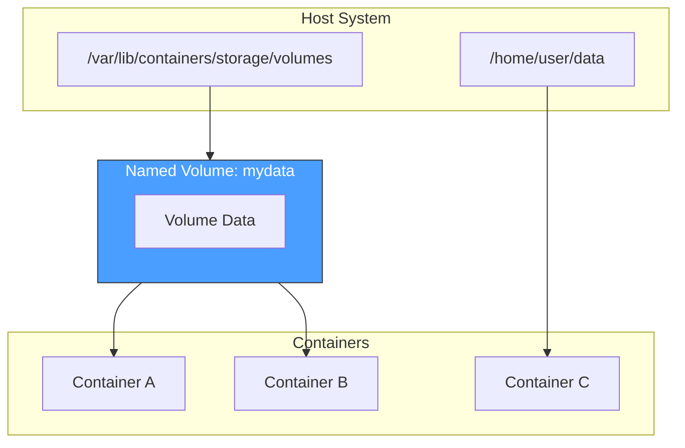
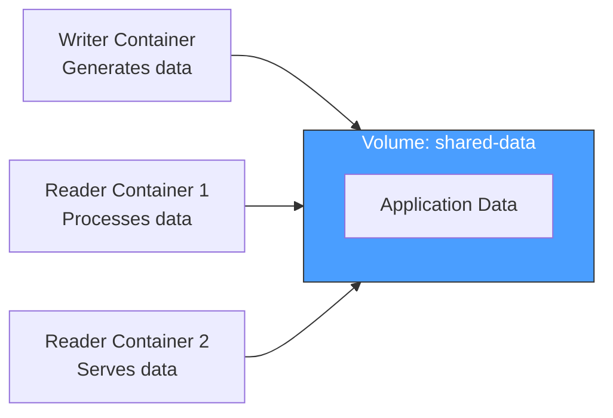

# How to Use Podman Volumes

Author: [nawazdhandala](https://www.github.com/nawazdhandala)

Tags: Podman, Volumes, Containers, DevOps, Storage, Linux, Data Persistence

Description: A practical guide to using Podman volumes for persistent container storage. Learn how to create, manage, mount, and share volumes across containers while keeping your data safe and portable.

---

Container storage disappears when containers stop running. Volumes solve that problem by providing persistent storage that survives container restarts, updates, and even complete rebuilds. Podman, the daemonless container engine, offers robust volume management that works seamlessly in rootless mode.

## Understanding Podman Volumes



Podman supports three primary storage mechanisms:

1. **Named Volumes** - Managed by Podman, stored in a dedicated location
2. **Bind Mounts** - Direct mapping from host filesystem paths
3. **tmpfs Mounts** - Memory-based temporary storage

Named volumes offer the best portability and are managed entirely by Podman. Bind mounts give you direct access to specific host directories. tmpfs mounts provide fast, ephemeral storage that vanishes when the container stops.

## Creating and Managing Volumes

### Create a Named Volume

Named volumes live in Podman's storage directory and persist independently of containers.

```bash
# Create a new named volume
podman volume create mydata

# Create a volume with custom options
podman volume create --opt device=tmpfs --opt type=tmpfs --opt o=size=100m tmpvol

# Create a volume with labels for organization
podman volume create --label project=webapp --label env=production webapp-data
```

### List Available Volumes

View all volumes on your system with filtering options.

```bash
# List all volumes
podman volume ls

# Filter volumes by label
podman volume ls --filter label=project=webapp

# Format output as JSON for scripting
podman volume ls --format json

# Show only volume names
podman volume ls --quiet
```

### Inspect Volume Details

Get detailed information about a specific volume.

```bash
# Inspect a volume to see its mount point and options
podman volume inspect mydata

# Get just the mount point path
podman volume inspect mydata --format '{{.Mountpoint}}'

# View all metadata including labels
podman volume inspect mydata --format '{{json .Labels}}'
```

### Remove Volumes

Clean up unused volumes to reclaim disk space.

```bash
# Remove a specific volume
podman volume rm mydata

# Remove multiple volumes at once
podman volume rm vol1 vol2 vol3

# Remove all unused volumes (not attached to any container)
podman volume prune

# Force removal without confirmation prompt
podman volume prune --force
```

## Mounting Volumes in Containers

### Basic Volume Mount

Attach a named volume to a container at a specific path.

```bash
# Run a container with a named volume mounted at /data
podman run -d --name myapp \
    -v mydata:/data \
    nginx:latest

# The volume is created automatically if it does not exist
podman run -d --name db \
    -v postgres-data:/var/lib/postgresql/data \
    postgres:15
```

### Read-Only Volumes

Mount volumes as read-only when containers should not modify the data.

```bash
# Mount volume as read-only using the :ro suffix
podman run -d --name web \
    -v config-data:/etc/nginx/conf.d:ro \
    nginx:latest

# Containers can read but cannot write to read-only volumes
podman run --rm \
    -v mydata:/data:ro \
    alpine sh -c "cat /data/config.txt"
```

### Bind Mounts

Map host directories directly into containers for development workflows.

```bash
# Mount current directory into the container
podman run -d --name devserver \
    -v $(pwd):/app:Z \
    node:20 npm start

# Mount a specific host path
podman run -d --name logs \
    -v /var/log/myapp:/logs:Z \
    alpine tail -f /logs/app.log

# Use absolute paths for predictable behavior
podman run --rm \
    -v /home/user/projects/webapp:/app:Z \
    python:3.11 python /app/main.py
```

### SELinux Labels

On systems with SELinux enabled, use labels to allow container access.

```bash
# :Z applies a private unshared label (container exclusive access)
podman run -d -v /host/path:/container/path:Z myimage

# :z applies a shared label (multiple containers can access)
podman run -d -v /host/path:/container/path:z myimage

# Verify SELinux context on the host
ls -laZ /host/path
```

## Sharing Volumes Between Containers

### Multiple Containers, Same Volume

Multiple containers can access the same named volume for data sharing.



Create a shared volume and attach it to multiple containers.

```bash
# Create a shared volume
podman volume create shared-data

# Writer container produces data
podman run -d --name writer \
    -v shared-data:/output \
    alpine sh -c "while true; do date >> /output/log.txt; sleep 5; done"

# Reader container consumes data
podman run -d --name reader \
    -v shared-data:/input:ro \
    alpine tail -f /input/log.txt

# Check that both containers see the same data
podman exec reader cat /input/log.txt
```

### Volumes with Podman Pods

Pods group containers that share network and storage namespaces.

```bash
# Create a pod with a shared volume
podman pod create --name webapp-pod

# Add a database container to the pod with a volume
podman run -d --pod webapp-pod --name db \
    -v db-data:/var/lib/postgresql/data \
    postgres:15

# Add an application container that connects to the database
podman run -d --pod webapp-pod --name app \
    -v app-uploads:/app/uploads \
    myapp:latest
```

## Backing Up and Restoring Volumes

### Export Volume Data

Back up volume contents to a tar archive for safekeeping.

```bash
# Create a backup of a volume using a temporary container
podman run --rm \
    -v mydata:/source:ro \
    -v $(pwd):/backup \
    alpine tar cvf /backup/mydata-backup.tar -C /source .

# Compress the backup to save space
podman run --rm \
    -v mydata:/source:ro \
    -v $(pwd):/backup \
    alpine tar czvf /backup/mydata-backup.tar.gz -C /source .

# Include a timestamp in the backup filename
podman run --rm \
    -v mydata:/source:ro \
    -v $(pwd):/backup \
    alpine sh -c "tar czvf /backup/mydata-$(date +%Y%m%d-%H%M%S).tar.gz -C /source ."
```

### Restore Volume Data

Restore a backup into a new or existing volume.

```bash
# Create a new volume for the restored data
podman volume create mydata-restored

# Extract the backup into the new volume
podman run --rm \
    -v mydata-restored:/target \
    -v $(pwd):/backup:ro \
    alpine tar xvf /backup/mydata-backup.tar -C /target

# Verify the restored data
podman run --rm \
    -v mydata-restored:/data:ro \
    alpine ls -la /data
```

### Automated Backup Script

A shell script automates regular volume backups with rotation.

```bash
#!/bin/bash
# backup-volumes.sh - Automated Podman volume backup script

BACKUP_DIR="/backups/podman-volumes"
RETENTION_DAYS=7
DATE=$(date +%Y%m%d-%H%M%S)

# Create backup directory if it does not exist
mkdir -p "$BACKUP_DIR"

# Get list of all volumes
VOLUMES=$(podman volume ls --quiet)

for VOLUME in $VOLUMES; do
    echo "Backing up volume: $VOLUME"

    # Create compressed backup
    podman run --rm \
        -v "$VOLUME":/source:ro \
        -v "$BACKUP_DIR":/backup \
        alpine tar czvf "/backup/${VOLUME}-${DATE}.tar.gz" -C /source .

    if [ $? -eq 0 ]; then
        echo "Successfully backed up $VOLUME"
    else
        echo "Failed to backup $VOLUME" >&2
    fi
done

# Remove backups older than retention period
find "$BACKUP_DIR" -name "*.tar.gz" -mtime +$RETENTION_DAYS -delete

echo "Backup complete. Old backups cleaned up."
```

## Volume Drivers and Remote Storage

### Local Volume Options

Configure local volumes with specific filesystem options.

```bash
# Create a volume with a size limit using tmpfs
podman volume create \
    --opt device=tmpfs \
    --opt type=tmpfs \
    --opt o=size=500m,uid=1000 \
    limited-tmpfs

# Create a volume backed by a specific device
podman volume create \
    --opt type=nfs \
    --opt o=addr=192.168.1.100,rw \
    --opt device=:/exports/data \
    nfs-data
```

### NFS Volumes

Mount remote NFS shares as Podman volumes for distributed storage.

```bash
# Create an NFS-backed volume
podman volume create \
    --driver local \
    --opt type=nfs \
    --opt o=addr=nfs-server.local,rw,nolock \
    --opt device=:/shared/data \
    nfs-volume

# Use the NFS volume in a container
podman run -d --name webapp \
    -v nfs-volume:/app/shared \
    myapp:latest
```

## Rootless Volume Considerations

### User Namespace Mapping

Rootless Podman maps container UIDs to unprivileged host UIDs.

```mermaid
flowchart LR
    subgraph Container["Container Namespace"]
        CUID0[root (UID 0)]
        CUID1000[app (UID 1000)]
    end

    subgraph Host["Host Namespace"]
        HUID100000[UID 100000]
        HUID101000[UID 101000]
    end

    CUID0 -->|maps to| HUID100000
    CUID1000 -->|maps to| HUID101000

    style Container fill:#4a9eff,stroke:#333,color:#fff
    style Host fill:#2d5aa0,stroke:#333,color:#fff
```

Check your user namespace configuration.

```bash
# View your subuid and subgid mappings
cat /etc/subuid
cat /etc/subgid

# Check the effective UID mapping for a container
podman unshare cat /proc/self/uid_map

# Run a command as if inside the user namespace
podman unshare id
```

### Permission Issues with Bind Mounts

Rootless mode requires careful handling of file permissions.

```bash
# Option 1: Use podman unshare to fix ownership
podman unshare chown -R 0:0 /path/to/data

# Option 2: Keep files owned by your user (UID 0 in container = your UID on host)
# Files created as root inside the container are owned by you on the host

# Option 3: Use the :U volume option to automatically chown
podman run -d \
    -v /host/path:/container/path:Z,U \
    myimage

# Verify the mapped ownership
ls -lan /host/path
```

### Storage Location for Rootless

Rootless Podman stores volumes in your home directory.

```bash
# Default rootless volume location
ls ~/.local/share/containers/storage/volumes/

# Check your storage configuration
podman info --format '{{.Store.GraphRoot}}'

# View volume storage details
podman system info | grep -A 5 "store"
```

## Database Volumes in Practice

### PostgreSQL with Persistent Storage

A complete example of running PostgreSQL with a persistent volume.

```bash
# Create a dedicated volume for PostgreSQL data
podman volume create postgres-data

# Run PostgreSQL with the data volume
podman run -d \
    --name postgres \
    -e POSTGRES_USER=appuser \
    -e POSTGRES_PASSWORD=secretpass \
    -e POSTGRES_DB=myapp \
    -v postgres-data:/var/lib/postgresql/data:Z \
    -p 5432:5432 \
    postgres:15

# Connect and create some data
podman exec -it postgres psql -U appuser -d myapp -c "
CREATE TABLE users (
    id SERIAL PRIMARY KEY,
    name VARCHAR(100),
    email VARCHAR(100)
);
INSERT INTO users (name, email) VALUES ('Alice', 'alice@example.com');
"

# Stop and remove the container
podman stop postgres && podman rm postgres

# Start a new container with the same volume - data persists
podman run -d \
    --name postgres-new \
    -e POSTGRES_USER=appuser \
    -e POSTGRES_PASSWORD=secretpass \
    -v postgres-data:/var/lib/postgresql/data:Z \
    -p 5432:5432 \
    postgres:15

# Verify data survived the container recreation
podman exec -it postgres-new psql -U appuser -d myapp -c "SELECT * FROM users;"
```

### MySQL with Custom Configuration

Run MySQL with separate volumes for data and configuration.

```bash
# Create volumes for data and configuration
podman volume create mysql-data
podman volume create mysql-config

# Prepare custom configuration
podman run --rm \
    -v mysql-config:/config \
    alpine sh -c "cat > /config/my.cnf << 'EOF'
[mysqld]
max_connections = 200
innodb_buffer_pool_size = 256M
slow_query_log = 1
slow_query_log_file = /var/log/mysql/slow.log
EOF"

# Run MySQL with both volumes
podman run -d \
    --name mysql \
    -e MYSQL_ROOT_PASSWORD=rootpass \
    -e MYSQL_DATABASE=appdb \
    -v mysql-data:/var/lib/mysql:Z \
    -v mysql-config:/etc/mysql/conf.d:ro,Z \
    -p 3306:3306 \
    mysql:8
```

## Volume Lifecycle Management

### Inspecting Volume Usage

Find out which containers use which volumes.

```bash
# List all containers with their volume mounts
podman ps -a --format "{{.Names}}: {{.Mounts}}"

# Check if a specific volume is in use
podman ps -a --filter volume=mydata

# Get detailed mount information for a container
podman inspect mycontainer --format '{{json .Mounts}}' | jq

# Find orphaned volumes (not attached to any container)
podman volume ls --filter dangling=true
```

### Cleaning Up Storage

Reclaim disk space by removing unused volumes and containers.

```bash
# Remove all stopped containers
podman container prune

# Remove all unused volumes
podman volume prune

# Remove everything unused (containers, images, volumes)
podman system prune --volumes

# Check disk usage before and after cleanup
podman system df
```

### Volume Migration Between Hosts

Move volume data from one machine to another.

```bash
# On the source host: export the volume
podman run --rm \
    -v mydata:/source:ro \
    -v $(pwd):/export \
    alpine tar czvf /export/volume-export.tar.gz -C /source .

# Transfer the archive to the target host
scp volume-export.tar.gz user@target-host:/tmp/

# On the target host: create and populate the volume
podman volume create mydata
podman run --rm \
    -v mydata:/target \
    -v /tmp:/import:ro \
    alpine tar xzvf /import/volume-export.tar.gz -C /target
```

## Troubleshooting Common Issues

### Permission Denied Errors

Permission issues often stem from SELinux or user namespace mapping.

```bash
# Check SELinux context
ls -laZ /path/to/mount

# Temporarily disable SELinux enforcement for testing
sudo setenforce 0

# Use the :Z or :z label option
podman run -v /host/path:/container/path:Z myimage

# For rootless, check if the path is accessible
podman unshare ls -la /path/to/mount
```

### Volume Not Found

Verify the volume exists and check for typos.

```bash
# List all volumes to confirm existence
podman volume ls

# Check if the volume was created in rootless vs root mode
podman volume ls              # rootless volumes
sudo podman volume ls         # root volumes

# Volumes are not shared between rootless and root modes
```

### Data Not Persisting

Ensure you mount to the correct path inside the container.

```bash
# Check the application's data directory in the image documentation
podman inspect myimage --format '{{json .Config.Volumes}}'

# Verify the mount is active inside the container
podman exec mycontainer mount | grep /data

# Check that writes go to the mounted volume, not an overlay
podman exec mycontainer df -h /data
```

---

Podman volumes provide flexible, persistent storage for containerized applications. Named volumes offer the simplest management experience, while bind mounts enable direct host filesystem access for development. For production workloads, combine proper backup strategies with volume labels to maintain organized, recoverable container storage. Whether running rootless on a development laptop or rootful in production, mastering volumes ensures your container data stays safe and accessible.
