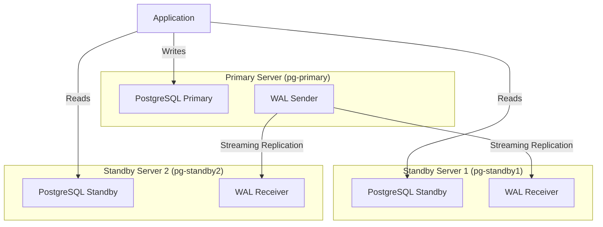
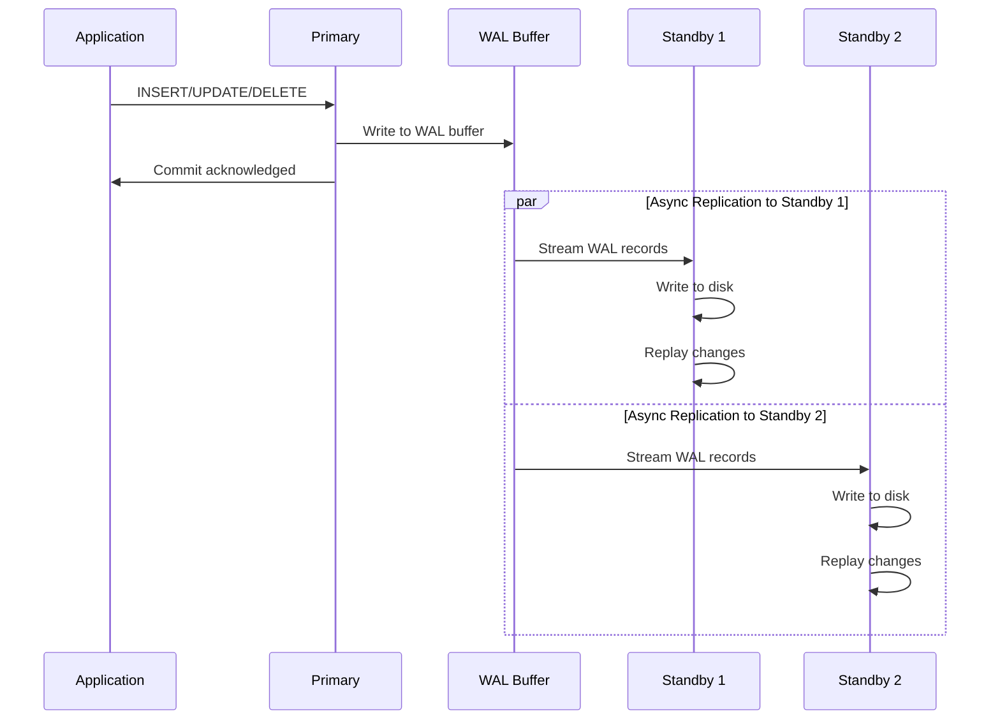
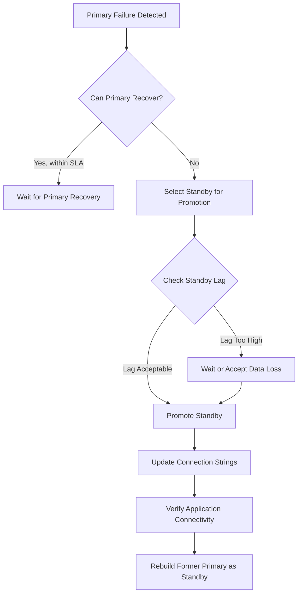

# How to Set Up PostgreSQL Cluster on Ubuntu

Author: [nawazdhandala](https://www.github.com/nawazdhandala)

Tags: PostgreSQL, Cluster, Ubuntu, High Availability, Database, Replication

Description: A comprehensive guide to setting up a PostgreSQL cluster on Ubuntu with streaming replication, covering primary and standby configuration, automatic failover considerations, monitoring, and production best practices.

---

Running a single PostgreSQL instance works until it does not. Hardware fails, networks partition, and maintenance windows turn into unplanned outages. A PostgreSQL cluster with streaming replication gives you a hot standby that can take over when the primary goes down, plus the ability to offload read traffic. This guide walks through setting up a production-ready PostgreSQL cluster on Ubuntu using native streaming replication.

## What You Will Build

By the end of this guide, you will have:

- A primary PostgreSQL server accepting writes
- One or more standby servers receiving real-time changes via streaming replication
- Replication slots to prevent WAL segment removal before standbys catch up
- Monitoring queries to verify replication health
- A foundation for adding automatic failover tools like Patroni or repmgr

## Architecture Overview



## Prerequisites

Before starting, ensure you have:

- Two or more Ubuntu 22.04 or 24.04 servers (can be VMs or bare metal)
- Root or sudo access on all servers
- Network connectivity between servers on port 5432
- At least 2GB RAM per server for testing (more for production)
- Hostnames configured or IP addresses noted

For this guide, we will use these example hosts:

| Role | Hostname | IP Address |
|------|----------|------------|
| Primary | pg-primary | 192.168.1.10 |
| Standby 1 | pg-standby1 | 192.168.1.11 |
| Standby 2 | pg-standby2 | 192.168.1.12 |

## Step 1: Install PostgreSQL on All Servers

PostgreSQL packages in Ubuntu's default repositories can be outdated. We will use the official PostgreSQL APT repository to get the latest stable version.

Run these commands on all servers (primary and standbys).

The following script adds the official PostgreSQL repository and installs PostgreSQL 16:

```bash
# Update package lists
sudo apt update

# Install required dependencies
sudo apt install -y wget gnupg2 lsb-release

# Add the PostgreSQL signing key
sudo sh -c 'echo "deb http://apt.postgresql.org/pub/repos/apt $(lsb_release -cs)-pgdg main" > /etc/apt/sources.list.d/pgdg.list'

# Import the repository key
wget --quiet -O - https://www.postgresql.org/media/keys/ACCC4CF8.asc | sudo apt-key add -

# Update package lists again to include PostgreSQL packages
sudo apt update

# Install PostgreSQL 16
sudo apt install -y postgresql-16
```

Verify the installation by checking the service status:

```bash
# Check that PostgreSQL is running
sudo systemctl status postgresql

# Verify the version
sudo -u postgres psql -c "SELECT version();"
```

## Step 2: Configure the Primary Server

The primary server handles all write operations and streams changes to standbys. We need to configure it to accept replication connections and enable WAL archiving.

### Configure PostgreSQL Settings

Edit the main configuration file to enable replication. The following changes configure WAL level, connection slots, and archiving:

```bash
# Open the PostgreSQL configuration file
sudo nano /etc/postgresql/16/main/postgresql.conf
```

Add or modify these settings in postgresql.conf:

```ini
# Connection Settings
# Listen on all interfaces (or specify your network interface)
listen_addresses = '*'

# Replication Settings
# wal_level must be replica or logical for streaming replication
wal_level = replica

# Maximum number of concurrent connections from standby servers
max_wal_senders = 10

# Number of replication slots to reserve
# Should be at least equal to the number of standbys
max_replication_slots = 10

# Keep enough WAL segments for standbys to catch up
# This is a safety net; replication slots handle this automatically
wal_keep_size = 1GB

# Enable WAL archiving for point-in-time recovery
archive_mode = on
archive_command = 'cp %p /var/lib/postgresql/16/archive/%f'

# Synchronous replication (optional, for zero data loss)
# Uncomment and set standby names if you need synchronous replication
# synchronous_standby_names = 'standby1,standby2'

# Hot standby allows read queries on standbys
hot_standby = on
```

### Configure Client Authentication

Edit pg_hba.conf to allow replication connections from standby servers. The replication user needs explicit permission to connect:

```bash
# Open the host-based authentication file
sudo nano /etc/postgresql/16/main/pg_hba.conf
```

Add these lines at the end of pg_hba.conf to allow replication from your standby servers:

```
# Allow replication connections from standby servers
# TYPE  DATABASE        USER            ADDRESS                 METHOD
host    replication     replicator      192.168.1.11/32         scram-sha-256
host    replication     replicator      192.168.1.12/32         scram-sha-256

# If you prefer to allow an entire subnet (less secure but more flexible)
# host    replication     replicator      192.168.1.0/24          scram-sha-256
```

### Create the Archive Directory

WAL archiving provides an additional safety layer. Create the archive directory with correct permissions:

```bash
# Create the WAL archive directory
sudo mkdir -p /var/lib/postgresql/16/archive

# Set ownership to postgres user
sudo chown postgres:postgres /var/lib/postgresql/16/archive

# Set appropriate permissions
sudo chmod 700 /var/lib/postgresql/16/archive
```

### Create the Replication User

The replication user needs the REPLICATION privilege. Create a dedicated user for this purpose:

```bash
# Connect to PostgreSQL as the postgres superuser
sudo -u postgres psql
```

Run these SQL commands to create the replication user and slots:

```sql
-- Create a dedicated user for replication
-- Use a strong password in production
CREATE USER replicator WITH REPLICATION ENCRYPTED PASSWORD 'your_secure_password_here';

-- Create replication slots for each standby
-- Slots prevent WAL removal until standbys have received the data
CREATE PUBLICATION my_publication FOR ALL TABLES;

-- Create physical replication slots (one per standby)
SELECT pg_create_physical_replication_slot('standby1_slot');
SELECT pg_create_physical_replication_slot('standby2_slot');

-- Verify the slots were created
SELECT slot_name, slot_type, active FROM pg_replication_slots;

-- Exit psql
\q
```

### Restart the Primary Server

Apply the configuration changes by restarting PostgreSQL:

```bash
# Restart PostgreSQL to apply changes
sudo systemctl restart postgresql

# Verify it started successfully
sudo systemctl status postgresql

# Check the logs for any errors
sudo tail -50 /var/log/postgresql/postgresql-16-main.log
```

## Step 3: Configure Standby Servers

Each standby server needs to be initialized from a base backup of the primary. This ensures the standby starts with an exact copy of the primary's data.

### Stop PostgreSQL and Clean Data Directory

Before taking a base backup, stop PostgreSQL and remove the default data directory on the standby:

```bash
# Stop PostgreSQL on the standby
sudo systemctl stop postgresql

# Remove the default data directory
# WARNING: This deletes all data in this cluster
sudo rm -rf /var/lib/postgresql/16/main/*
```

### Take a Base Backup from the Primary

The pg_basebackup utility creates a consistent copy of the primary server. Run this on the standby server:

```bash
# Take a base backup from the primary
# -h: primary hostname
# -U: replication user
# -D: destination directory
# -P: show progress
# -R: create standby.signal and configure recovery
# -S: use the replication slot
sudo -u postgres pg_basebackup \
    -h 192.168.1.10 \
    -U replicator \
    -D /var/lib/postgresql/16/main \
    -P \
    -R \
    -S standby1_slot
```

When prompted, enter the replication user's password.

For the second standby, use standby2_slot instead of standby1_slot.

### Verify the Standby Configuration

The pg_basebackup command with -R flag automatically creates the necessary configuration. Verify the standby.signal file exists and check postgresql.auto.conf:

```bash
# Verify standby.signal file exists (indicates this is a standby)
ls -la /var/lib/postgresql/16/main/standby.signal

# Check the auto-generated recovery configuration
sudo cat /var/lib/postgresql/16/main/postgresql.auto.conf
```

The postgresql.auto.conf should contain something like:

```ini
primary_conninfo = 'user=replicator password=your_secure_password_here channel_binding=prefer host=192.168.1.10 port=5432 sslmode=prefer sslcompression=0 sslcertmode=allow sslsni=1 ssl_min_protocol_version=TLSv1.2 gssencmode=prefer krbsrvname=postgres gssdelegation=0 target_session_attrs=any load_balance_hosts=disable'
primary_slot_name = 'standby1_slot'
```

### Configure Hot Standby

Ensure the standby can accept read-only queries by verifying hot_standby is enabled:

```bash
# Edit postgresql.conf if needed
sudo nano /etc/postgresql/16/main/postgresql.conf
```

Verify or add this setting:

```ini
# Allow read queries on this standby
hot_standby = on
```

### Start the Standby Server

Start PostgreSQL on the standby:

```bash
# Start PostgreSQL
sudo systemctl start postgresql

# Check the status
sudo systemctl status postgresql

# View the logs to verify replication started
sudo tail -100 /var/log/postgresql/postgresql-16-main.log
```

You should see log messages indicating the standby connected to the primary and started streaming.

## Step 4: Verify Replication Status

With both primary and standby running, verify that replication is working correctly.

### Check Replication on the Primary

Connect to the primary and query the replication status:

```bash
sudo -u postgres psql
```

Run these queries to check replication health:

```sql
-- View connected standbys and their replication status
SELECT
    client_addr,
    state,
    sent_lsn,
    write_lsn,
    flush_lsn,
    replay_lsn,
    sync_state
FROM pg_stat_replication;

-- Check replication slot status
SELECT
    slot_name,
    slot_type,
    active,
    restart_lsn,
    confirmed_flush_lsn
FROM pg_replication_slots;

-- Calculate replication lag in bytes
SELECT
    client_addr,
    pg_wal_lsn_diff(sent_lsn, replay_lsn) AS byte_lag
FROM pg_stat_replication;
```

### Check Replication on the Standby

Connect to the standby and verify it is receiving data:

```bash
sudo -u postgres psql
```

Run these queries on the standby:

```sql
-- Check if this server is in recovery mode (should return true)
SELECT pg_is_in_recovery();

-- View the last received and replayed WAL positions
SELECT
    pg_last_wal_receive_lsn() AS received,
    pg_last_wal_replay_lsn() AS replayed,
    pg_last_xact_replay_timestamp() AS last_transaction;

-- Calculate lag time (if any)
SELECT
    now() - pg_last_xact_replay_timestamp() AS replication_lag;
```

### Test Data Replication

Create some test data on the primary and verify it appears on the standby:

On the primary:

```sql
-- Create a test database and table
CREATE DATABASE test_replication;
\c test_replication

CREATE TABLE messages (
    id SERIAL PRIMARY KEY,
    content TEXT,
    created_at TIMESTAMP DEFAULT CURRENT_TIMESTAMP
);

INSERT INTO messages (content) VALUES ('Hello from primary!');
INSERT INTO messages (content) VALUES ('Replication test message');

SELECT * FROM messages;
```

On the standby (wait a second or two for replication):

```sql
-- Connect to the replicated database
\c test_replication

-- Query the replicated data
SELECT * FROM messages;
```

You should see the same data on both servers. Note that trying to INSERT on the standby will fail because it is read-only.

## Step 5: Replication Flow Visualization

Understanding how data flows through the cluster helps with troubleshooting and capacity planning.



## Step 6: Configure Synchronous Replication (Optional)

By default, streaming replication is asynchronous. The primary commits transactions without waiting for standbys to confirm receipt. This provides the best performance but allows potential data loss if the primary fails before standbys receive the latest changes.

For applications requiring zero data loss, configure synchronous replication.

### Enable Synchronous Replication on the Primary

Edit postgresql.conf on the primary:

```bash
sudo nano /etc/postgresql/16/main/postgresql.conf
```

Add or modify the synchronous_standby_names setting:

```ini
# Require at least one standby to confirm before commit returns
# FIRST 1: Wait for the first standby to respond
# standby1, standby2: Names of the standbys (from application_name)
synchronous_standby_names = 'FIRST 1 (standby1, standby2)'

# Alternative: ANY means any standby can satisfy the requirement
# synchronous_standby_names = 'ANY 1 (standby1, standby2)'

# For maximum safety, wait for all standbys
# synchronous_standby_names = 'FIRST 2 (standby1, standby2)'
```

### Set Application Names on Standbys

Each standby needs a unique application_name to be identified in synchronous_standby_names. Edit postgresql.auto.conf on each standby:

```bash
sudo nano /var/lib/postgresql/16/main/postgresql.auto.conf
```

Add application_name to the primary_conninfo on standby1:

```ini
primary_conninfo = 'user=replicator password=your_secure_password_here host=192.168.1.10 port=5432 application_name=standby1'
```

On standby2, use application_name=standby2.

### Restart All Servers

Restart the primary and standbys to apply changes:

```bash
# On primary
sudo systemctl restart postgresql

# On each standby
sudo systemctl restart postgresql
```

### Verify Synchronous Replication

Check the sync_state column in pg_stat_replication on the primary:

```sql
SELECT
    application_name,
    client_addr,
    state,
    sync_state,
    sync_priority
FROM pg_stat_replication;
```

The sync_state should show sync for the synchronous standby and async or potential for others.

## Step 7: Monitor Your Cluster

Production clusters need continuous monitoring. Here are essential queries and metrics to track.

### Create a Monitoring Script

Create a script to check cluster health. This script can be run via cron or integrated with your monitoring system:

```bash
#!/bin/bash
# PostgreSQL Cluster Health Check Script
# Save as /usr/local/bin/pg_cluster_check.sh

# Configuration
PGHOST="localhost"
PGUSER="postgres"
PGDATABASE="postgres"

echo "=== PostgreSQL Cluster Health Check ==="
echo "Timestamp: $(date)"
echo

# Check if this is primary or standby
IS_STANDBY=$(sudo -u postgres psql -tAc "SELECT pg_is_in_recovery();")
if [ "$IS_STANDBY" = "t" ]; then
    echo "Role: STANDBY"

    # Check replication lag
    LAG=$(sudo -u postgres psql -tAc "SELECT COALESCE(EXTRACT(EPOCH FROM (now() - pg_last_xact_replay_timestamp())), 0)::int;")
    echo "Replication Lag: ${LAG} seconds"

    # Check last received LSN
    sudo -u postgres psql -c "SELECT pg_last_wal_receive_lsn() AS received, pg_last_wal_replay_lsn() AS replayed;"
else
    echo "Role: PRIMARY"

    # Check connected standbys
    echo -e "\nConnected Standbys:"
    sudo -u postgres psql -c "SELECT application_name, client_addr, state, sync_state, sent_lsn, replay_lsn FROM pg_stat_replication;"

    # Check replication slots
    echo -e "\nReplication Slots:"
    sudo -u postgres psql -c "SELECT slot_name, active, restart_lsn FROM pg_replication_slots;"

    # Check for replication lag
    echo -e "\nReplication Lag (bytes):"
    sudo -u postgres psql -c "SELECT application_name, pg_wal_lsn_diff(sent_lsn, replay_lsn) AS lag_bytes FROM pg_stat_replication;"
fi

# Check disk space
echo -e "\nDisk Space:"
df -h /var/lib/postgresql

# Check WAL directory size
echo -e "\nWAL Directory Size:"
du -sh /var/lib/postgresql/16/main/pg_wal

echo -e "\n=== Health Check Complete ==="
```

Make the script executable:

```bash
sudo chmod +x /usr/local/bin/pg_cluster_check.sh
```

### Key Metrics to Monitor

Track these metrics in your monitoring system (such as OneUptime, Prometheus, or Grafana):

| Metric | Query | Alert Threshold |
|--------|-------|-----------------|
| Replication Lag (seconds) | `SELECT EXTRACT(EPOCH FROM (now() - pg_last_xact_replay_timestamp()))` | > 30 seconds |
| Replication Lag (bytes) | `SELECT pg_wal_lsn_diff(sent_lsn, replay_lsn) FROM pg_stat_replication` | > 100MB |
| Connected Standbys | `SELECT count(*) FROM pg_stat_replication` | < expected count |
| Slot Active Status | `SELECT count(*) FROM pg_replication_slots WHERE NOT active` | > 0 |
| WAL Directory Size | `du -s /var/lib/postgresql/16/main/pg_wal` | > 80% of allocated space |

## Step 8: Manual Failover Procedure

When the primary fails, you need to promote a standby to become the new primary. This section covers manual failover; for automated failover, consider tools like Patroni or repmgr.

### Failover Decision Tree



### Promote a Standby to Primary

On the standby you want to promote, run:

```bash
# Promote the standby to primary
sudo -u postgres pg_ctl promote -D /var/lib/postgresql/16/main

# Or use pg_promote() function
sudo -u postgres psql -c "SELECT pg_promote();"
```

Verify the promotion:

```sql
-- Should now return false (not in recovery)
SELECT pg_is_in_recovery();

-- Should be able to write data
CREATE TABLE promotion_test (id int);
INSERT INTO promotion_test VALUES (1);
DROP TABLE promotion_test;
```

### Update Application Connection Strings

After promotion, update your application's database connection to point to the new primary. Consider using:

- PgBouncer with DNS-based failover
- HAProxy for connection routing
- Application-level connection management

### Rebuild the Old Primary as a Standby

Once the old primary is available again, convert it to a standby:

```bash
# Stop PostgreSQL on the old primary
sudo systemctl stop postgresql

# Remove the old data directory
sudo rm -rf /var/lib/postgresql/16/main/*

# Take a base backup from the new primary
sudo -u postgres pg_basebackup \
    -h 192.168.1.11 \
    -U replicator \
    -D /var/lib/postgresql/16/main \
    -P \
    -R \
    -S standby1_slot

# Start as a standby
sudo systemctl start postgresql
```

## Step 9: Best Practices for Production

### Security Hardening

Secure your cluster with these practices:

```bash
# Use SSL for replication connections
# Generate certificates (simplified example)
sudo -u postgres openssl req -new -x509 -days 365 -nodes \
    -out /var/lib/postgresql/16/main/server.crt \
    -keyout /var/lib/postgresql/16/main/server.key \
    -subj "/CN=pg-primary"

sudo chmod 600 /var/lib/postgresql/16/main/server.key
sudo chown postgres:postgres /var/lib/postgresql/16/main/server.*
```

Add SSL settings to postgresql.conf:

```ini
# Enable SSL
ssl = on
ssl_cert_file = 'server.crt'
ssl_key_file = 'server.key'
```

Update pg_hba.conf to require SSL for replication:

```
hostssl replication replicator 192.168.1.0/24 scram-sha-256
```

### Performance Tuning

Configure these settings based on your hardware. These examples assume 16GB RAM and SSD storage:

```ini
# Memory settings
shared_buffers = 4GB
effective_cache_size = 12GB
work_mem = 64MB
maintenance_work_mem = 1GB

# WAL settings
wal_buffers = 64MB
checkpoint_completion_target = 0.9
max_wal_size = 4GB
min_wal_size = 1GB

# Replication tuning
wal_sender_timeout = 60s
wal_receiver_timeout = 60s
```

### Backup Strategy

Even with replication, you need regular backups. Replication protects against hardware failure but not against accidental data deletion or corruption.

Create a backup script:

```bash
#!/bin/bash
# Save as /usr/local/bin/pg_backup.sh

BACKUP_DIR="/var/backups/postgresql"
DATE=$(date +%Y%m%d_%H%M%S)
BACKUP_FILE="${BACKUP_DIR}/backup_${DATE}.sql.gz"

# Create backup directory if it does not exist
mkdir -p $BACKUP_DIR

# Take a full backup
sudo -u postgres pg_dumpall | gzip > $BACKUP_FILE

# Keep only last 7 days of backups
find $BACKUP_DIR -name "backup_*.sql.gz" -mtime +7 -delete

echo "Backup completed: $BACKUP_FILE"
```

Schedule with cron:

```bash
# Add to crontab
0 2 * * * /usr/local/bin/pg_backup.sh >> /var/log/pg_backup.log 2>&1
```

### Network Configuration

Configure your firewall to allow only necessary traffic:

```bash
# Allow PostgreSQL port only from trusted hosts
sudo ufw allow from 192.168.1.0/24 to any port 5432

# Enable the firewall
sudo ufw enable
```

## Troubleshooting Common Issues

### Standby Not Connecting

If the standby cannot connect to the primary:

```bash
# Check network connectivity
telnet 192.168.1.10 5432

# Verify pg_hba.conf allows the connection
# Check PostgreSQL logs
sudo tail -100 /var/log/postgresql/postgresql-16-main.log

# Verify replication user password
sudo -u postgres psql -h 192.168.1.10 -U replicator -d postgres
```

### Replication Lag Growing

If replication lag keeps increasing:

```sql
-- Check for long-running queries on standby
SELECT pid, now() - query_start AS duration, query
FROM pg_stat_activity
WHERE state = 'active' AND query_start < now() - interval '5 minutes';

-- Check for conflicts
SELECT * FROM pg_stat_database_conflicts;
```

Consider adjusting these settings:

```ini
# On standby, allow longer query times before cancellation
max_standby_streaming_delay = 300s

# Reduce conflict likelihood
hot_standby_feedback = on
```

### WAL Files Accumulating

If WAL files are not being removed:

```sql
-- Check for inactive replication slots
SELECT slot_name, active, restart_lsn
FROM pg_replication_slots
WHERE NOT active;

-- Drop unused slots
SELECT pg_drop_replication_slot('unused_slot_name');
```

## Automated Failover Considerations

Manual failover requires human intervention, which increases recovery time. For production environments with strict availability requirements, consider these automated failover solutions:

| Tool | Complexity | Features |
|------|------------|----------|
| Patroni | Medium | DCS-based consensus, REST API, integration with etcd/Consul/ZooKeeper |
| repmgr | Low | Witness servers, event notifications, simpler setup |
| Stolon | High | Kubernetes-native, proxy-based routing |
| pg_auto_failover | Low | Citus-developed, monitor-based failover |

These tools handle failure detection, standby selection, and promotion automatically, reducing mean time to recovery (MTTR) from minutes to seconds.

## Conclusion

You now have a working PostgreSQL cluster with streaming replication on Ubuntu. This setup provides:

- High availability through hot standbys
- Read scaling by directing queries to standbys
- Data durability through WAL archiving
- A foundation for automated failover

Remember these key points:

1. Test failover procedures regularly in a staging environment
2. Monitor replication lag and alert on anomalies
3. Maintain regular backups independent of replication
4. Keep PostgreSQL and Ubuntu updated with security patches
5. Document your runbooks for common failure scenarios

For mission-critical deployments, consider adding automated failover with tools like Patroni, which we cover in a separate guide. The combination of streaming replication and automated failover gives you enterprise-grade database availability without enterprise licensing costs.
