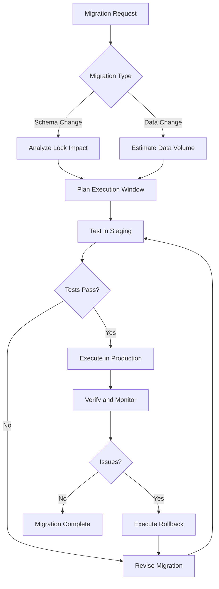
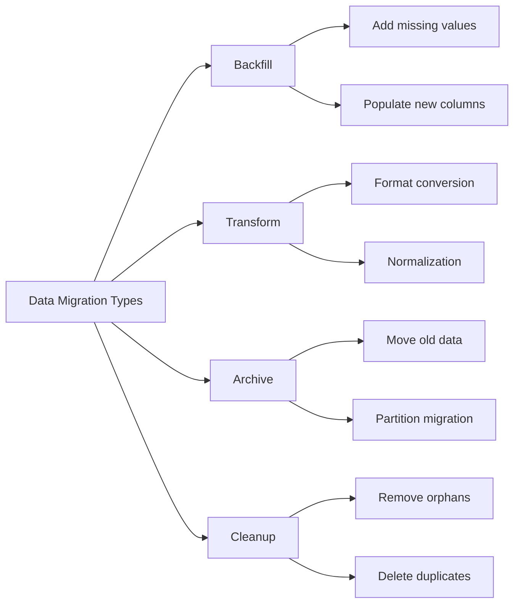
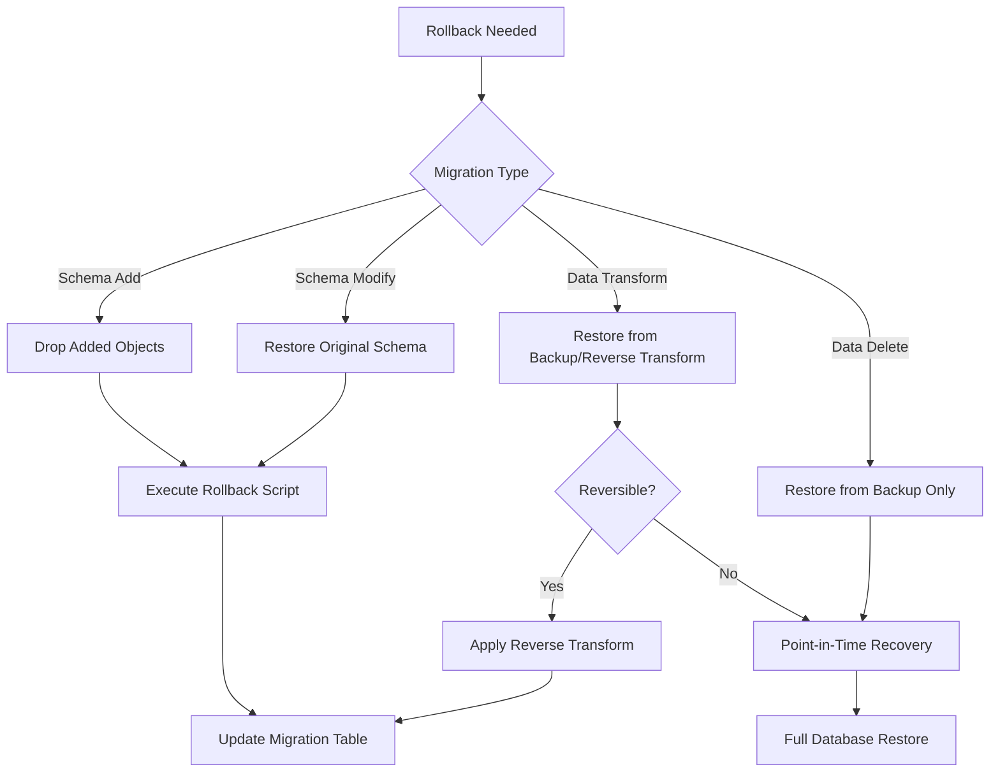

# How to Handle Database Migrations in PostgreSQL

Author: [nawazdhandala](https://github.com/nawazdhandala)

Tags: PostgreSQL, Migrations, Database, Schema

Description: A comprehensive guide to handling database migrations in PostgreSQL, covering migration strategies, data transformations, version control, rollback procedures, and production-safe techniques for evolving your database.

---

Database migrations are one of the most critical operations in application development. A poorly executed migration can lead to data loss, extended downtime, or corrupted state. This guide provides practical strategies for handling PostgreSQL migrations safely and efficiently, from simple schema changes to complex data transformations.

## Understanding Database Migrations

Database migrations encompass two distinct types of changes:

1. **Schema Migrations**: Structural changes to tables, columns, indexes, and constraints
2. **Data Migrations**: Transformations, backfills, and movements of actual data

Both require careful planning, but they present different challenges and risks.



## Setting Up a Migration Tracking System

Before running migrations, you need a system to track which migrations have been applied. This section shows how to build a lightweight tracking system using native PostgreSQL.

The following SQL creates a migration tracking table that stores metadata about each migration including when it was applied and a checksum to detect unauthorized changes.

```sql
-- Create a schema to organize migration-related objects
CREATE SCHEMA IF NOT EXISTS migrations;

-- Migration tracking table stores the history of all applied migrations
CREATE TABLE migrations.schema_migrations (
    id SERIAL PRIMARY KEY,
    version VARCHAR(14) NOT NULL UNIQUE,  -- Timestamp-based version like 20260202120000
    name VARCHAR(255) NOT NULL,            -- Human-readable migration name
    checksum VARCHAR(64) NOT NULL,         -- SHA256 hash of migration content
    applied_at TIMESTAMP WITH TIME ZONE DEFAULT NOW(),
    applied_by VARCHAR(100) DEFAULT current_user,
    execution_time_ms INTEGER,             -- Track how long migrations take
    rolled_back_at TIMESTAMP WITH TIME ZONE  -- NULL if not rolled back
);

-- Index for quick version lookups during migration runs
CREATE INDEX idx_migrations_version ON migrations.schema_migrations(version);

-- Index for finding active (non-rolled-back) migrations
CREATE INDEX idx_migrations_active ON migrations.schema_migrations(version)
    WHERE rolled_back_at IS NULL;
```

## Migration File Organization

Organize migrations in a structured directory that makes it easy to track changes and maintain order.

```
migrations/
    versions/
        20260202120000_create_users_table.sql
        20260202120100_add_email_verification.sql
        20260202120200_create_orders_table.sql
    rollbacks/
        20260202120000_create_users_table_rollback.sql
        20260202120100_add_email_verification_rollback.sql
        20260202120200_create_orders_table_rollback.sql
    data/
        20260202130000_backfill_user_status.sql
    functions/
        apply_migration.sql
        rollback_migration.sql
        get_pending_migrations.sql
```

## Creating Migration Helper Functions

These PostgreSQL functions automate migration tracking and provide safety checks before applying changes.

The apply_migration function wraps migration execution in a transaction and records metadata including execution time.

```sql
-- Function to apply a single migration with tracking
CREATE OR REPLACE FUNCTION migrations.apply_migration(
    p_version VARCHAR(14),
    p_name VARCHAR(255),
    p_checksum VARCHAR(64),
    p_sql TEXT
) RETURNS void AS $$
DECLARE
    v_start_time TIMESTAMP;
    v_execution_ms INTEGER;
BEGIN
    -- Check if migration was already applied
    IF EXISTS (
        SELECT 1 FROM migrations.schema_migrations
        WHERE version = p_version AND rolled_back_at IS NULL
    ) THEN
        RAISE NOTICE 'Migration % already applied, skipping', p_version;
        RETURN;
    END IF;

    -- Record start time
    v_start_time := clock_timestamp();

    -- Execute the migration SQL
    EXECUTE p_sql;

    -- Calculate execution time
    v_execution_ms := EXTRACT(MILLISECONDS FROM clock_timestamp() - v_start_time);

    -- Record the migration
    INSERT INTO migrations.schema_migrations (version, name, checksum, execution_time_ms)
    VALUES (p_version, p_name, p_checksum, v_execution_ms);

    RAISE NOTICE 'Applied migration % (%) in % ms', p_version, p_name, v_execution_ms;
END;
$$ LANGUAGE plpgsql;
```

The rollback function marks a migration as rolled back and executes the corresponding rollback SQL.

```sql
-- Function to rollback a migration
CREATE OR REPLACE FUNCTION migrations.rollback_migration(
    p_version VARCHAR(14),
    p_rollback_sql TEXT
) RETURNS void AS $$
BEGIN
    -- Verify migration exists and is not already rolled back
    IF NOT EXISTS (
        SELECT 1 FROM migrations.schema_migrations
        WHERE version = p_version AND rolled_back_at IS NULL
    ) THEN
        RAISE EXCEPTION 'Migration % not found or already rolled back', p_version;
    END IF;

    -- Execute rollback SQL
    EXECUTE p_rollback_sql;

    -- Mark as rolled back instead of deleting (audit trail)
    UPDATE migrations.schema_migrations
    SET rolled_back_at = NOW()
    WHERE version = p_version;

    RAISE NOTICE 'Rolled back migration %', p_version;
END;
$$ LANGUAGE plpgsql;
```

## Schema Migration Patterns

### Creating Tables Safely

When creating new tables, use IF NOT EXISTS and set up proper constraints from the start. This migration creates a users table with appropriate constraints and indexes.

```sql
-- Migration: 20260202120000_create_users_table.sql
-- Creates the core users table with proper constraints and indexes

BEGIN;

-- Create the table with all necessary columns
CREATE TABLE IF NOT EXISTS users (
    id BIGSERIAL PRIMARY KEY,
    email VARCHAR(255) NOT NULL,
    username VARCHAR(50) NOT NULL,
    password_hash VARCHAR(255) NOT NULL,
    status VARCHAR(20) NOT NULL DEFAULT 'pending',
    email_verified_at TIMESTAMP WITH TIME ZONE,
    created_at TIMESTAMP WITH TIME ZONE NOT NULL DEFAULT NOW(),
    updated_at TIMESTAMP WITH TIME ZONE NOT NULL DEFAULT NOW(),

    -- Inline constraint definitions
    CONSTRAINT users_email_unique UNIQUE (email),
    CONSTRAINT users_username_unique UNIQUE (username),
    CONSTRAINT users_status_check CHECK (status IN ('pending', 'active', 'suspended', 'deleted'))
);

-- Create indexes for common query patterns
-- Partial index for active users (most common query)
CREATE INDEX IF NOT EXISTS idx_users_active_email
    ON users(email) WHERE status = 'active';

-- Index for listing users by creation date
CREATE INDEX IF NOT EXISTS idx_users_created_at
    ON users(created_at DESC);

-- Add table comment for documentation
COMMENT ON TABLE users IS 'Core user accounts table';
COMMENT ON COLUMN users.status IS 'Account status: pending, active, suspended, or deleted';

COMMIT;
```

The corresponding rollback script safely removes the table.

```sql
-- Rollback: 20260202120000_create_users_table_rollback.sql
BEGIN;
DROP TABLE IF EXISTS users CASCADE;
COMMIT;
```

### Adding Columns Without Downtime

Adding columns can lock tables in older PostgreSQL versions. Modern PostgreSQL (11+) handles most cases efficiently, but you should still follow safe patterns.

This migration adds a new column with a default value, which is safe in PostgreSQL 11 and later.

```sql
-- Migration: 20260202120100_add_last_login_column.sql
-- Adds last_login tracking to users table

BEGIN;

-- PostgreSQL 11+ handles this without rewriting the table
-- The DEFAULT is stored in the catalog, not written to every row
ALTER TABLE users
    ADD COLUMN IF NOT EXISTS last_login_at TIMESTAMP WITH TIME ZONE;

-- Add an index for queries filtering by recent logins
CREATE INDEX CONCURRENTLY IF NOT EXISTS idx_users_last_login
    ON users(last_login_at DESC NULLS LAST);

COMMIT;
```

For older PostgreSQL versions or when you need more control, use a multi-step approach.

```sql
-- Safe column addition for older PostgreSQL versions
-- Step 1: Add nullable column (fast, no rewrite)
ALTER TABLE users ADD COLUMN last_login_at TIMESTAMP WITH TIME ZONE;

-- Step 2: Create index concurrently (non-blocking)
CREATE INDEX CONCURRENTLY idx_users_last_login
    ON users(last_login_at DESC NULLS LAST);

-- Step 3: Backfill in batches if needed (separate transaction)
-- Step 4: Add NOT NULL constraint if required (see section on constraints)
```

### Modifying Column Types

Changing column types often requires table rewrites. Here is a safe approach for changing a column type without extended locking.

```sql
-- Migration: 20260202120200_change_username_length.sql
-- Expands username column from VARCHAR(50) to VARCHAR(100)

BEGIN;

-- Expanding VARCHAR length is safe and instant in PostgreSQL
-- It only updates the catalog, no table rewrite needed
ALTER TABLE users
    ALTER COLUMN username TYPE VARCHAR(100);

COMMIT;
```

For type changes that require data conversion, use a column swap pattern.

```sql
-- Migration: 20260202120300_convert_status_to_enum.sql
-- Converts status from VARCHAR to ENUM type

BEGIN;

-- Step 1: Create the enum type
CREATE TYPE user_status AS ENUM ('pending', 'active', 'suspended', 'deleted');

-- Step 2: Add new column with the enum type
ALTER TABLE users ADD COLUMN status_new user_status;

-- Step 3: Copy data with conversion
UPDATE users SET status_new = status::user_status;

-- Step 4: Make the new column NOT NULL
ALTER TABLE users ALTER COLUMN status_new SET NOT NULL;

-- Step 5: Drop old column and rename new one
ALTER TABLE users DROP COLUMN status;
ALTER TABLE users RENAME COLUMN status_new TO status;

-- Step 6: Re-add the default
ALTER TABLE users ALTER COLUMN status SET DEFAULT 'pending';

COMMIT;
```

## Data Migration Strategies

Data migrations require different approaches than schema changes. They often involve large volumes of data and must be done in ways that minimize lock contention.



### Batch Processing for Large Tables

Never update millions of rows in a single transaction. Use batch processing to minimize lock time and allow concurrent operations.

This function processes data in configurable batches with progress reporting.

```sql
-- Function for batch updates on large tables
CREATE OR REPLACE FUNCTION migrations.batch_update(
    p_table_name TEXT,
    p_set_clause TEXT,
    p_where_clause TEXT,
    p_batch_size INTEGER DEFAULT 10000,
    p_sleep_ms INTEGER DEFAULT 100
) RETURNS INTEGER AS $$
DECLARE
    v_total_updated INTEGER := 0;
    v_batch_updated INTEGER;
    v_iteration INTEGER := 0;
BEGIN
    LOOP
        v_iteration := v_iteration + 1;

        -- Update a batch of rows
        EXECUTE format(
            'UPDATE %I SET %s WHERE ctid = ANY(
                SELECT ctid FROM %I WHERE %s LIMIT %s FOR UPDATE SKIP LOCKED
            )',
            p_table_name, p_set_clause,
            p_table_name, p_where_clause, p_batch_size
        );

        GET DIAGNOSTICS v_batch_updated = ROW_COUNT;
        v_total_updated := v_total_updated + v_batch_updated;

        -- Log progress every 10 iterations
        IF v_iteration % 10 = 0 THEN
            RAISE NOTICE 'Processed % rows so far...', v_total_updated;
        END IF;

        -- Exit when no more rows to update
        EXIT WHEN v_batch_updated = 0;

        -- Brief pause to reduce lock contention
        PERFORM pg_sleep(p_sleep_ms / 1000.0);
    END LOOP;

    RAISE NOTICE 'Completed: updated % total rows', v_total_updated;
    RETURN v_total_updated;
END;
$$ LANGUAGE plpgsql;
```

Example usage of the batch update function for a real data migration.

```sql
-- Example: Backfill a normalized email column in batches
SELECT migrations.batch_update(
    'users',                                    -- table name
    'email_normalized = LOWER(TRIM(email))',   -- SET clause
    'email_normalized IS NULL',                 -- WHERE clause
    5000,                                       -- batch size
    50                                          -- sleep between batches (ms)
);
```

### Using Temporary Tables for Complex Transformations

For complex data transformations, use temporary tables to prepare data before applying changes.

```sql
-- Migration: 20260202130000_normalize_addresses.sql
-- Splits combined address field into structured components

BEGIN;

-- Create temporary table with parsed address data
CREATE TEMP TABLE temp_parsed_addresses AS
SELECT
    id,
    -- Extract street address (everything before the first comma)
    TRIM(SPLIT_PART(address, ',', 1)) AS street,
    -- Extract city (second part)
    TRIM(SPLIT_PART(address, ',', 2)) AS city,
    -- Extract state and zip (third part, needs further parsing)
    TRIM(SPLIT_PART(SPLIT_PART(address, ',', 3), ' ', 1)) AS state,
    TRIM(SPLIT_PART(SPLIT_PART(address, ',', 3), ' ', 2)) AS zip_code
FROM users
WHERE address IS NOT NULL;

-- Add new columns for structured address data
ALTER TABLE users
    ADD COLUMN IF NOT EXISTS street VARCHAR(255),
    ADD COLUMN IF NOT EXISTS city VARCHAR(100),
    ADD COLUMN IF NOT EXISTS state VARCHAR(50),
    ADD COLUMN IF NOT EXISTS zip_code VARCHAR(20);

-- Update from temporary table using batch approach
UPDATE users u
SET
    street = t.street,
    city = t.city,
    state = t.state,
    zip_code = t.zip_code
FROM temp_parsed_addresses t
WHERE u.id = t.id;

-- Clean up
DROP TABLE temp_parsed_addresses;

COMMIT;
```

## Zero-Downtime Migration Techniques

Production migrations must not interrupt service. This section covers techniques for maintaining availability during migrations.

### Creating Indexes Concurrently

Standard index creation locks the table. Use CONCURRENTLY for production environments.

```sql
-- BAD: Blocks all writes until complete
CREATE INDEX idx_orders_customer ON orders(customer_id);

-- GOOD: Allows concurrent reads and writes
CREATE INDEX CONCURRENTLY idx_orders_customer ON orders(customer_id);
```

Important considerations for concurrent index creation.

```sql
-- Concurrent index creation tips:

-- 1. Cannot run inside a transaction block
-- This will fail:
BEGIN;
CREATE INDEX CONCURRENTLY idx_test ON users(email);  -- ERROR!
COMMIT;

-- 2. Check for invalid indexes after creation
SELECT indexrelid::regclass, indisvalid
FROM pg_index
WHERE NOT indisvalid;

-- 3. If index creation fails, clean up the invalid index
DROP INDEX CONCURRENTLY IF EXISTS idx_test;

-- 4. Retry the index creation
CREATE INDEX CONCURRENTLY idx_test ON users(email);
```

### Adding Constraints Without Blocking

Foreign keys and check constraints can be added in two phases to avoid long locks.

```sql
-- Migration: 20260202140000_add_orders_fk.sql
-- Adds foreign key constraint without blocking

-- Step 1: Add constraint as NOT VALID (instant, no table scan)
ALTER TABLE orders
    ADD CONSTRAINT fk_orders_customer
    FOREIGN KEY (customer_id) REFERENCES customers(id)
    NOT VALID;

-- Step 2: Validate existing data (allows concurrent operations)
-- This acquires a SHARE UPDATE EXCLUSIVE lock, allowing reads and writes
ALTER TABLE orders
    VALIDATE CONSTRAINT fk_orders_customer;
```

The same pattern works for check constraints.

```sql
-- Add check constraint without blocking
ALTER TABLE products
    ADD CONSTRAINT chk_positive_price
    CHECK (price > 0)
    NOT VALID;

-- Validate in separate transaction
ALTER TABLE products
    VALIDATE CONSTRAINT chk_positive_price;
```

### Adding NOT NULL Constraints Safely

Adding NOT NULL to an existing column requires scanning the entire table. Here is a safe approach.

```sql
-- Migration: 20260202150000_add_not_null_status.sql
-- Safely adds NOT NULL constraint to status column

-- Step 1: Add a check constraint as NOT VALID
ALTER TABLE users
    ADD CONSTRAINT chk_status_not_null
    CHECK (status IS NOT NULL)
    NOT VALID;

-- Step 2: Validate the constraint (allows concurrent operations)
ALTER TABLE users
    VALIDATE CONSTRAINT chk_status_not_null;

-- Step 3: Convert to NOT NULL (instant since PostgreSQL knows data is valid)
ALTER TABLE users
    ALTER COLUMN status SET NOT NULL;

-- Step 4: Drop the now-redundant check constraint
ALTER TABLE users
    DROP CONSTRAINT chk_status_not_null;
```

## Migration Rollback Strategies

Every migration should have a corresponding rollback plan. Different situations require different rollback approaches.



### Reversible Data Migrations

Design data migrations to be reversible when possible.

```sql
-- Migration: 20260202160000_encrypt_ssn.sql
-- Encrypts SSN data while preserving original for rollback

BEGIN;

-- Add column for encrypted data
ALTER TABLE employees ADD COLUMN ssn_encrypted BYTEA;

-- Store original in a backup column (for rollback capability)
ALTER TABLE employees ADD COLUMN ssn_backup VARCHAR(11);
UPDATE employees SET ssn_backup = ssn WHERE ssn IS NOT NULL;

-- Encrypt the data using pgcrypto
UPDATE employees
SET ssn_encrypted = pgp_sym_encrypt(ssn, current_setting('app.encryption_key'))
WHERE ssn IS NOT NULL;

-- Clear original column (do not drop yet)
UPDATE employees SET ssn = NULL;

COMMIT;
```

The corresponding rollback restores the original data.

```sql
-- Rollback: 20260202160000_encrypt_ssn_rollback.sql

BEGIN;

-- Restore original SSN from backup
UPDATE employees SET ssn = ssn_backup WHERE ssn_backup IS NOT NULL;

-- Drop the new columns
ALTER TABLE employees DROP COLUMN ssn_encrypted;
ALTER TABLE employees DROP COLUMN ssn_backup;

COMMIT;
```

### Point-in-Time Recovery Setup

For irreversible migrations, ensure you have point-in-time recovery configured.

```sql
-- Check current WAL settings for recovery capability
SELECT name, setting, unit
FROM pg_settings
WHERE name IN (
    'archive_mode',
    'archive_command',
    'wal_level',
    'max_wal_senders',
    'wal_keep_size'
);

-- Record the current WAL position before migration (useful for recovery)
SELECT pg_current_wal_lsn(), NOW() AS migration_start;
```

## Production Migration Workflow

A complete production migration workflow includes validation, execution, and verification phases.

### Pre-Migration Checklist

This function validates that a migration is safe to run by checking various conditions.

```sql
-- Function to validate migration safety
CREATE OR REPLACE FUNCTION migrations.pre_migration_check(
    p_version VARCHAR(14)
) RETURNS TABLE (
    check_name TEXT,
    status TEXT,
    details TEXT
) AS $$
BEGIN
    -- Check 1: Verify not already applied
    RETURN QUERY
    SELECT
        'Migration Status'::TEXT,
        CASE WHEN EXISTS (
            SELECT 1 FROM migrations.schema_migrations
            WHERE version = p_version AND rolled_back_at IS NULL
        ) THEN 'FAIL' ELSE 'PASS' END,
        'Migration should not already be applied'::TEXT;

    -- Check 2: Verify no active locks
    RETURN QUERY
    SELECT
        'Active Locks'::TEXT,
        CASE WHEN COUNT(*) > 10 THEN 'WARN' ELSE 'PASS' END,
        'Found ' || COUNT(*) || ' active locks'
    FROM pg_locks WHERE granted = false;

    -- Check 3: Check connection count
    RETURN QUERY
    SELECT
        'Connection Count'::TEXT,
        CASE WHEN COUNT(*) >
            (SELECT setting::int * 0.8 FROM pg_settings WHERE name = 'max_connections')
        THEN 'WARN' ELSE 'PASS' END,
        'Using ' || COUNT(*) || ' connections'
    FROM pg_stat_activity WHERE state != 'idle';

    -- Check 4: Check replication lag
    RETURN QUERY
    SELECT
        'Replication Lag'::TEXT,
        CASE WHEN EXISTS (
            SELECT 1 FROM pg_stat_replication
            WHERE replay_lag > interval '30 seconds'
        ) THEN 'WARN' ELSE 'PASS' END,
        'Replication should be caught up'::TEXT;

    -- Check 5: Disk space
    RETURN QUERY
    SELECT
        'Database Size'::TEXT,
        'INFO'::TEXT,
        pg_size_pretty(pg_database_size(current_database()));
END;
$$ LANGUAGE plpgsql;
```

### Migration Execution Script

This shell script provides a complete workflow for running migrations safely.

```bash
#!/bin/bash
# run_migration.sh - Safe migration execution script

set -e  # Exit on error

MIGRATION_VERSION=$1
MIGRATION_FILE=$2
ROLLBACK_FILE=$3
DB_URL=$DATABASE_URL

# Function to log with timestamp
log() {
    echo "[$(date '+%Y-%m-%d %H:%M:%S')] $1"
}

# Pre-flight checks
log "Running pre-migration checks..."
psql "$DB_URL" -c "SELECT * FROM migrations.pre_migration_check('$MIGRATION_VERSION');"

# Prompt for confirmation
read -p "Proceed with migration? (yes/no): " confirm
if [ "$confirm" != "yes" ]; then
    log "Migration cancelled"
    exit 1
fi

# Create backup point
log "Recording WAL position for potential recovery..."
BACKUP_POINT=$(psql "$DB_URL" -t -c "SELECT pg_current_wal_lsn();")
echo "$BACKUP_POINT" > "/tmp/migration_${MIGRATION_VERSION}_wal_position.txt"

# Calculate checksum
CHECKSUM=$(sha256sum "$MIGRATION_FILE" | cut -d' ' -f1)

# Execute migration
log "Applying migration $MIGRATION_VERSION..."
START_TIME=$(date +%s)

psql "$DB_URL" -v ON_ERROR_STOP=1 -f "$MIGRATION_FILE"

END_TIME=$(date +%s)
DURATION=$((END_TIME - START_TIME))

# Record migration
log "Recording migration in tracking table..."
psql "$DB_URL" -c "
    INSERT INTO migrations.schema_migrations (version, name, checksum, execution_time_ms)
    VALUES ('$MIGRATION_VERSION', '$(basename $MIGRATION_FILE)', '$CHECKSUM', ${DURATION}000);
"

log "Migration completed in ${DURATION} seconds"

# Post-migration verification
log "Running post-migration verification..."
psql "$DB_URL" -c "
    SELECT version, name, applied_at, execution_time_ms
    FROM migrations.schema_migrations
    WHERE version = '$MIGRATION_VERSION';
"
```

### Post-Migration Verification

After applying a migration, verify that everything is working correctly.

```sql
-- Verification queries to run after migration

-- Check table structure matches expectations
SELECT
    column_name,
    data_type,
    is_nullable,
    column_default
FROM information_schema.columns
WHERE table_name = 'users'
ORDER BY ordinal_position;

-- Verify indexes exist and are valid
SELECT
    indexname,
    indexdef,
    pg_relation_size(indexname::regclass) as index_size
FROM pg_indexes
WHERE tablename = 'users';

-- Check constraints are in place
SELECT
    conname,
    contype,
    pg_get_constraintdef(oid) as definition
FROM pg_constraint
WHERE conrelid = 'users'::regclass;

-- Verify row counts are reasonable
SELECT
    relname,
    n_live_tup as row_count,
    last_vacuum,
    last_analyze
FROM pg_stat_user_tables
WHERE relname = 'users';
```

## Handling Failed Migrations

When migrations fail, you need to understand what happened and how to recover.

### Identifying Partial Failures

This query helps identify incomplete migrations and their state.

```sql
-- Find migrations that may have partially applied
SELECT
    version,
    name,
    applied_at,
    execution_time_ms,
    CASE
        WHEN rolled_back_at IS NOT NULL THEN 'Rolled Back'
        ELSE 'Applied'
    END as status
FROM migrations.schema_migrations
ORDER BY applied_at DESC
LIMIT 10;

-- Check for any objects that might indicate partial migration
SELECT
    n.nspname as schema,
    c.relname as name,
    c.relkind as type,
    pg_size_pretty(pg_relation_size(c.oid)) as size
FROM pg_class c
JOIN pg_namespace n ON n.oid = c.relnamespace
WHERE c.relname LIKE '%_new' OR c.relname LIKE '%_old' OR c.relname LIKE '%_temp'
ORDER BY c.relname;
```

### Cleaning Up Failed Migrations

This function helps clean up after a failed migration.

```sql
-- Function to clean up after failed migration
CREATE OR REPLACE FUNCTION migrations.cleanup_failed_migration(
    p_version VARCHAR(14)
) RETURNS void AS $$
DECLARE
    v_migration RECORD;
BEGIN
    -- Get migration details
    SELECT * INTO v_migration
    FROM migrations.schema_migrations
    WHERE version = p_version;

    IF NOT FOUND THEN
        RAISE NOTICE 'No migration record found for version %', p_version;
        RETURN;
    END IF;

    -- Mark as rolled back if not already
    IF v_migration.rolled_back_at IS NULL THEN
        UPDATE migrations.schema_migrations
        SET rolled_back_at = NOW()
        WHERE version = p_version;

        RAISE NOTICE 'Marked migration % as rolled back', p_version;
    END IF;

    -- Log cleanup action
    RAISE NOTICE 'Migration % cleanup complete. Manual verification recommended.', p_version;
END;
$$ LANGUAGE plpgsql;
```

## Best Practices Summary

### Do

1. **Always test migrations in staging** before production
2. **Use transactions** for schema changes that can be atomic
3. **Create indexes concurrently** to avoid blocking
4. **Batch large data updates** to minimize lock time
5. **Keep rollback scripts** for every migration
6. **Monitor during migrations** using pg_stat_activity
7. **Document migrations** with clear comments

### Avoid

1. **Never run untested migrations** in production
2. **Avoid long-running transactions** that hold locks
3. **Do not mix schema and data changes** in one migration
4. **Never delete data** without a backup or recovery plan
5. **Avoid changing multiple tables** in complex ways atomically

### Migration Checklist

Use this checklist before every production migration.

```markdown
## Pre-Migration
- [ ] Migration tested in staging environment
- [ ] Rollback script prepared and tested
- [ ] Backup verified and recent
- [ ] Team notified of migration window
- [ ] Monitoring dashboards ready

## During Migration
- [ ] Lock monitoring active
- [ ] Application errors monitored
- [ ] Replication lag checked
- [ ] Progress logged

## Post-Migration
- [ ] Functionality verified
- [ ] Performance baseline compared
- [ ] Rollback script retained
- [ ] Migration documented
- [ ] Team notified of completion
```

## Monitoring Migrations

Use these queries to monitor migration progress and impact.

```sql
-- Monitor active queries during migration
SELECT
    pid,
    NOW() - pg_stat_activity.query_start AS duration,
    query,
    state,
    wait_event_type,
    wait_event
FROM pg_stat_activity
WHERE state != 'idle'
    AND query NOT LIKE '%pg_stat_activity%'
ORDER BY query_start;

-- Check for blocking locks
SELECT
    blocked_locks.pid AS blocked_pid,
    blocked_activity.usename AS blocked_user,
    blocking_locks.pid AS blocking_pid,
    blocking_activity.usename AS blocking_user,
    blocked_activity.query AS blocked_statement
FROM pg_catalog.pg_locks blocked_locks
JOIN pg_catalog.pg_stat_activity blocked_activity
    ON blocked_activity.pid = blocked_locks.pid
JOIN pg_catalog.pg_locks blocking_locks
    ON blocking_locks.locktype = blocked_locks.locktype
    AND blocking_locks.relation = blocked_locks.relation
    AND blocking_locks.pid != blocked_locks.pid
JOIN pg_catalog.pg_stat_activity blocking_activity
    ON blocking_activity.pid = blocking_locks.pid
WHERE NOT blocked_locks.granted;
```

## Conclusion

Database migrations in PostgreSQL require careful planning and execution. Key takeaways include:

1. **Track all migrations** in a version control system and database table
2. **Test thoroughly** before production deployment
3. **Use non-blocking techniques** like CONCURRENTLY and NOT VALID
4. **Batch large data changes** to minimize impact
5. **Always have a rollback plan** ready
6. **Monitor actively** during migration execution

By following these practices and using the patterns shown in this guide, you can evolve your PostgreSQL database safely while maintaining high availability and data integrity.
