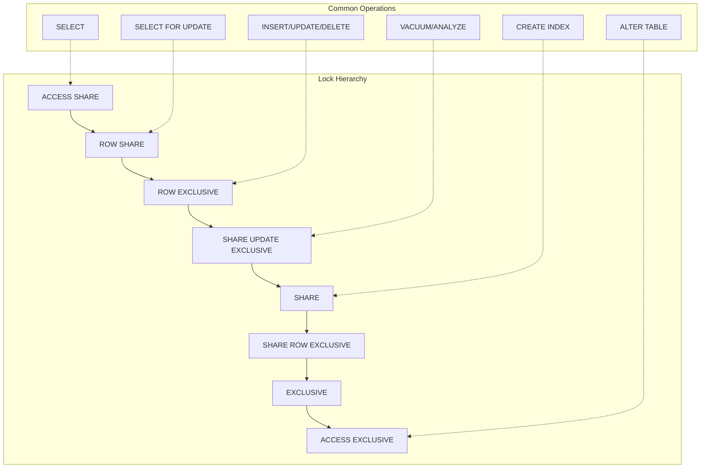
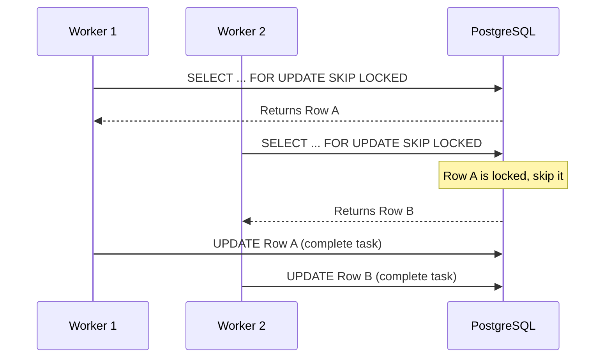
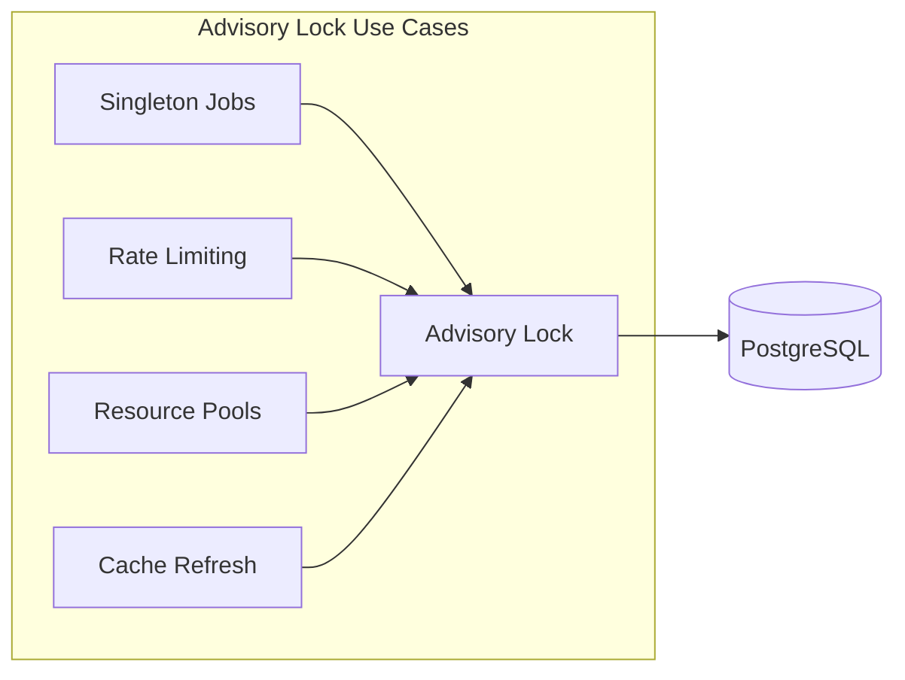
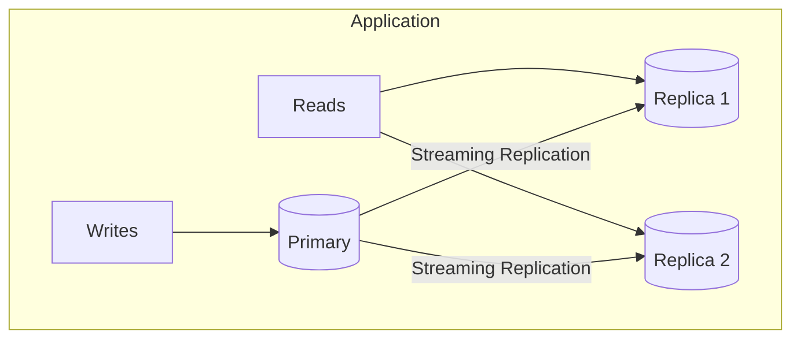

# How to Handle Lock Contention in PostgreSQL

Author: [nawazdhandala](https://www.github.com/nawazdhandala)

Tags: PostgreSQL, Locks, Performance, Database, Concurrency, Transactions

Description: A comprehensive guide to handling lock contention in PostgreSQL. Learn transaction design patterns, lock-free techniques, advisory locks, and architectural strategies to build high-concurrency applications without bottlenecks.

---

Lock contention occurs when multiple transactions compete for the same resources. While monitoring and troubleshooting are important, the real solution lies in designing systems that minimize contention from the start. This guide covers practical strategies to handle and prevent lock contention in PostgreSQL.

## Understanding Lock Types

Before handling contention, you need to understand what locks PostgreSQL uses and when.



### Lock Compatibility Matrix

Understanding which locks conflict helps you design better transactions.

| Lock Mode | AS | RS | RE | SUE | S | SRE | E | AE |
|-----------|----|----|----|----|---|-----|---|-----|
| ACCESS SHARE (AS) | Y | Y | Y | Y | Y | Y | Y | N |
| ROW SHARE (RS) | Y | Y | Y | Y | Y | Y | N | N |
| ROW EXCLUSIVE (RE) | Y | Y | Y | Y | N | N | N | N |
| SHARE UPDATE EXCLUSIVE (SUE) | Y | Y | Y | N | N | N | N | N |
| SHARE (S) | Y | Y | N | N | Y | N | N | N |
| SHARE ROW EXCLUSIVE (SRE) | Y | Y | N | N | N | N | N | N |
| EXCLUSIVE (E) | Y | N | N | N | N | N | N | N |
| ACCESS EXCLUSIVE (AE) | N | N | N | N | N | N | N | N |

## Strategy 1: Optimize Transaction Design

The most effective way to handle lock contention is to design transactions that minimize lock duration and scope.

### Keep Transactions Short

Long transactions hold locks longer, increasing contention probability.

The following query helps identify transactions that have been running too long and might be holding locks unnecessarily.

```sql
-- Find long-running transactions holding locks
SELECT
    pid,
    now() - xact_start AS transaction_duration,
    state,
    query,
    wait_event_type,
    wait_event
FROM pg_stat_activity
WHERE state != 'idle'
AND xact_start < now() - interval '30 seconds'
ORDER BY xact_start;
```

### Batch Large Operations

Instead of processing millions of rows in one transaction, break the work into smaller batches to release locks periodically.

This function processes records in configurable batches, committing after each batch to release locks and allow other transactions to proceed.

```sql
-- Instead of one massive UPDATE, batch it
CREATE OR REPLACE FUNCTION batch_update_status(
    p_batch_size INT DEFAULT 1000
) RETURNS INT AS $$
DECLARE
    v_updated INT := 0;
    v_batch INT;
BEGIN
    LOOP
        -- Process one batch at a time
        WITH batch AS (
            SELECT id FROM orders
            WHERE status = 'pending'
            AND processed_at IS NULL
            LIMIT p_batch_size
            FOR UPDATE SKIP LOCKED
        )
        UPDATE orders SET
            status = 'processing',
            processed_at = now()
        WHERE id IN (SELECT id FROM batch);

        GET DIAGNOSTICS v_batch = ROW_COUNT;
        v_updated := v_updated + v_batch;

        -- Exit when no more rows
        EXIT WHEN v_batch = 0;

        -- Commit between batches (in application code)
        -- This releases locks and allows other transactions
        COMMIT;
    END LOOP;

    RETURN v_updated;
END;
$$ LANGUAGE plpgsql;
```

### Access Tables in Consistent Order

Deadlocks occur when transactions acquire locks in different orders. Establish a convention and stick to it.

This example shows how two transactions accessing the same tables in different orders can cause a deadlock.

```sql
-- BAD: Inconsistent order causes deadlocks
-- Transaction 1: accounts -> transfers
-- Transaction 2: transfers -> accounts

-- GOOD: Always access in same order (alphabetical, by table OID, etc.)
-- Transaction 1: accounts -> transfers
-- Transaction 2: accounts -> transfers

-- Example: Transfer funds with consistent table order
CREATE OR REPLACE FUNCTION transfer_funds(
    p_from_account INT,
    p_to_account INT,
    p_amount DECIMAL
) RETURNS VOID AS $$
BEGIN
    -- Always lock accounts in ID order to prevent deadlocks
    IF p_from_account < p_to_account THEN
        PERFORM 1 FROM accounts WHERE id = p_from_account FOR UPDATE;
        PERFORM 1 FROM accounts WHERE id = p_to_account FOR UPDATE;
    ELSE
        PERFORM 1 FROM accounts WHERE id = p_to_account FOR UPDATE;
        PERFORM 1 FROM accounts WHERE id = p_from_account FOR UPDATE;
    END IF;

    -- Now safe to update
    UPDATE accounts SET balance = balance - p_amount WHERE id = p_from_account;
    UPDATE accounts SET balance = balance + p_amount WHERE id = p_to_account;

    INSERT INTO transfers (from_account, to_account, amount, created_at)
    VALUES (p_from_account, p_to_account, p_amount, now());
END;
$$ LANGUAGE plpgsql;
```

## Strategy 2: Use SKIP LOCKED for Queue Patterns

When implementing job queues or task processing, SKIP LOCKED prevents workers from blocking each other.



### Implementing a Lock-Free Job Queue

This pattern allows multiple workers to process jobs concurrently without blocking each other. The SKIP LOCKED clause tells PostgreSQL to skip any rows that are already locked by other transactions.

```sql
-- Create a jobs table with proper indexing
CREATE TABLE jobs (
    id BIGSERIAL PRIMARY KEY,
    queue_name VARCHAR(100) NOT NULL,
    payload JSONB NOT NULL,
    status VARCHAR(20) DEFAULT 'pending',
    attempts INT DEFAULT 0,
    max_attempts INT DEFAULT 3,
    scheduled_at TIMESTAMPTZ DEFAULT now(),
    started_at TIMESTAMPTZ,
    completed_at TIMESTAMPTZ,
    created_at TIMESTAMPTZ DEFAULT now()
);

-- Index for efficient job fetching
CREATE INDEX idx_jobs_pending ON jobs (queue_name, scheduled_at)
WHERE status = 'pending';

-- Worker function to claim and process jobs
CREATE OR REPLACE FUNCTION claim_job(p_queue_name VARCHAR)
RETURNS TABLE (
    job_id BIGINT,
    job_payload JSONB
) AS $$
BEGIN
    RETURN QUERY
    WITH claimed AS (
        SELECT id, payload
        FROM jobs
        WHERE queue_name = p_queue_name
        AND status = 'pending'
        AND scheduled_at <= now()
        AND attempts < max_attempts
        ORDER BY scheduled_at
        LIMIT 1
        FOR UPDATE SKIP LOCKED
    )
    UPDATE jobs j
    SET
        status = 'processing',
        started_at = now(),
        attempts = attempts + 1
    FROM claimed c
    WHERE j.id = c.id
    RETURNING j.id, j.payload;
END;
$$ LANGUAGE plpgsql;
```

### Using NOWAIT for Fail-Fast Patterns

When you need immediate feedback about lock availability, use NOWAIT. This is useful for user-facing operations where waiting would create a poor experience.

```sql
-- NOWAIT fails immediately if lock unavailable
-- Useful for user-facing operations where waiting is unacceptable
BEGIN;
SELECT * FROM inventory
WHERE product_id = 123
FOR UPDATE NOWAIT;
-- If another transaction holds the lock, raises:
-- ERROR: could not obtain lock on row in relation "inventory"
COMMIT;

-- Application code can catch this and retry or show user message
```

## Strategy 3: Advisory Locks for Application-Level Coordination

Advisory locks let you coordinate at the application level without locking actual table rows. They are perfect for scenarios where you need to serialize access to a logical resource that does not map directly to a database row.



### Session-Level Advisory Locks

Session locks are held until explicitly released or the session ends. Use these for long-running operations.

```sql
-- Session-level lock (held until released or session ends)
-- Good for: cron jobs, batch processes, maintenance tasks

-- Try to acquire lock (non-blocking)
SELECT pg_try_advisory_lock(hashtext('daily_report_generator'));
-- Returns true if acquired, false if already held

-- Or block until available
SELECT pg_advisory_lock(hashtext('daily_report_generator'));

-- Do your work here (only one session can hold this lock)

-- Release when done
SELECT pg_advisory_unlock(hashtext('daily_report_generator'));
```

### Transaction-Level Advisory Locks

Transaction locks automatically release when the transaction ends. Use these for operations that should be atomic with your transaction.

```sql
-- Transaction-level lock (auto-releases on commit/rollback)
-- Good for: ensuring single processor for specific operations

BEGIN;
-- Acquire lock for this specific user's cart checkout
SELECT pg_advisory_xact_lock(hashtext('checkout'), user_id);

-- Process checkout (guaranteed single processor per user)
UPDATE carts SET status = 'processing' WHERE user_id = user_id;
INSERT INTO orders (...) SELECT ... FROM cart_items WHERE user_id = user_id;
DELETE FROM cart_items WHERE user_id = user_id;

COMMIT;
-- Lock automatically released
```

### Distributed Lock Pattern

This pattern implements a distributed lock with timeout support, useful for coordinating across multiple application instances.

```sql
-- Create a lock management table for visibility
CREATE TABLE distributed_locks (
    lock_name VARCHAR(255) PRIMARY KEY,
    locked_by VARCHAR(255),
    locked_at TIMESTAMPTZ,
    expires_at TIMESTAMPTZ
);

-- Acquire lock with timeout
CREATE OR REPLACE FUNCTION acquire_distributed_lock(
    p_lock_name VARCHAR,
    p_locked_by VARCHAR,
    p_timeout_seconds INT DEFAULT 300
) RETURNS BOOLEAN AS $$
DECLARE
    v_lock_id BIGINT;
BEGIN
    v_lock_id := hashtext(p_lock_name);

    -- Try advisory lock first (fast path)
    IF NOT pg_try_advisory_lock(v_lock_id) THEN
        RETURN FALSE;
    END IF;

    -- Record lock for visibility/debugging
    INSERT INTO distributed_locks (lock_name, locked_by, locked_at, expires_at)
    VALUES (p_lock_name, p_locked_by, now(), now() + (p_timeout_seconds || ' seconds')::interval)
    ON CONFLICT (lock_name) DO UPDATE SET
        locked_by = p_locked_by,
        locked_at = now(),
        expires_at = now() + (p_timeout_seconds || ' seconds')::interval;

    RETURN TRUE;
END;
$$ LANGUAGE plpgsql;

-- Release lock
CREATE OR REPLACE FUNCTION release_distributed_lock(p_lock_name VARCHAR)
RETURNS VOID AS $$
BEGIN
    DELETE FROM distributed_locks WHERE lock_name = p_lock_name;
    PERFORM pg_advisory_unlock(hashtext(p_lock_name));
END;
$$ LANGUAGE plpgsql;
```

## Strategy 4: Reduce Lock Scope with Proper Indexing

Missing indexes force PostgreSQL to scan more rows, holding locks longer. Proper indexing dramatically reduces lock duration.

### Index Foreign Keys

Foreign key checks acquire locks. Without indexes, these checks scan entire tables.

```sql
-- BAD: Missing FK index causes full table scans during deletes
CREATE TABLE orders (
    id SERIAL PRIMARY KEY,
    customer_id INT REFERENCES customers(id)
);
-- DELETE FROM customers WHERE id = 1; scans entire orders table!

-- GOOD: Index the foreign key
CREATE INDEX idx_orders_customer_id ON orders(customer_id);
-- Now FK check is fast, lock held briefly
```

### Use Partial Indexes for Hot Data

Partial indexes reduce lock contention by limiting the index scope to only the rows that matter.

```sql
-- Full index on status (locks contend on all pending rows)
CREATE INDEX idx_jobs_status ON jobs(status);

-- Better: Partial index only on pending (smaller, faster, less contention)
CREATE INDEX idx_jobs_pending ON jobs(scheduled_at)
WHERE status = 'pending';

-- Queries automatically use partial index when predicate matches
SELECT * FROM jobs WHERE status = 'pending' ORDER BY scheduled_at LIMIT 10;
```

### BRIN Indexes for Time-Series Data

BRIN indexes are extremely small and reduce lock overhead for append-only time-series data.

```sql
-- For time-series data, BRIN indexes are tiny and fast
-- Much less lock overhead than B-tree
CREATE INDEX idx_events_created_brin ON events
USING BRIN(created_at) WITH (pages_per_range = 128);
```

## Strategy 5: Lock-Free Patterns with MVCC

PostgreSQL's Multi-Version Concurrency Control (MVCC) allows readers and writers to operate without blocking each other. Leverage this for lock-free reads.

### Optimistic Locking

Instead of locking rows during reads, use version numbers to detect concurrent modifications.

```sql
-- Add version column for optimistic locking
ALTER TABLE products ADD COLUMN version INT DEFAULT 1;

-- Read without locking
SELECT id, name, price, stock, version FROM products WHERE id = 123;
-- Application stores version = 5

-- Update only if version unchanged
UPDATE products
SET stock = stock - 1, version = version + 1
WHERE id = 123 AND version = 5;

-- Check if update succeeded
-- If 0 rows updated, another transaction modified the row - retry!
```

### Optimistic Locking in Application Code

This pattern shows how to implement retry logic for optimistic locking in your application.

```sql
-- Function with built-in retry logic
CREATE OR REPLACE FUNCTION update_product_stock_optimistic(
    p_product_id INT,
    p_quantity_change INT,
    p_max_retries INT DEFAULT 3
) RETURNS BOOLEAN AS $$
DECLARE
    v_current_version INT;
    v_updated INT;
    v_retry INT := 0;
BEGIN
    LOOP
        -- Read current version
        SELECT version INTO v_current_version
        FROM products WHERE id = p_product_id;

        -- Attempt update with version check
        UPDATE products
        SET
            stock = stock + p_quantity_change,
            version = version + 1,
            updated_at = now()
        WHERE id = p_product_id
        AND version = v_current_version
        AND stock + p_quantity_change >= 0;  -- Prevent negative stock

        GET DIAGNOSTICS v_updated = ROW_COUNT;

        IF v_updated > 0 THEN
            RETURN TRUE;  -- Success
        END IF;

        v_retry := v_retry + 1;
        IF v_retry >= p_max_retries THEN
            RETURN FALSE;  -- Give up after max retries
        END IF;

        -- Small delay before retry
        PERFORM pg_sleep(0.01 * v_retry);
    END LOOP;
END;
$$ LANGUAGE plpgsql;
```

### INSERT ... ON CONFLICT for Upserts

The upsert pattern avoids the need for SELECT + conditional INSERT/UPDATE, reducing lock contention.

```sql
-- Atomic upsert without explicit locking
INSERT INTO page_views (page_id, view_date, view_count)
VALUES (123, CURRENT_DATE, 1)
ON CONFLICT (page_id, view_date)
DO UPDATE SET view_count = page_views.view_count + 1;
```

## Strategy 6: Architectural Solutions

Sometimes the best way to handle lock contention is to change your architecture.

### Partitioning for Write-Heavy Tables

Table partitioning distributes locks across multiple physical tables, reducing contention.

```sql
-- Partition by date to spread locks across partitions
CREATE TABLE events (
    id BIGSERIAL,
    event_type VARCHAR(50),
    payload JSONB,
    created_at TIMESTAMPTZ DEFAULT now(),
    PRIMARY KEY (id, created_at)
) PARTITION BY RANGE (created_at);

-- Create monthly partitions
CREATE TABLE events_2026_01 PARTITION OF events
    FOR VALUES FROM ('2026-01-01') TO ('2026-02-01');

CREATE TABLE events_2026_02 PARTITION OF events
    FOR VALUES FROM ('2026-02-01') TO ('2026-03-01');

-- Inserts to different partitions don't contend
-- Maintenance (VACUUM, reindex) can target specific partitions
```

### Read Replicas for Read-Heavy Workloads

Offload read queries to replicas to reduce contention on the primary.



### Event Sourcing for High-Contention Domains

Instead of updating rows (which requires locks), append events. This eliminates update contention entirely.

```sql
-- Instead of updating account balance (lock contention)
-- Append transactions (no contention on inserts)

CREATE TABLE account_transactions (
    id BIGSERIAL PRIMARY KEY,
    account_id INT NOT NULL,
    amount DECIMAL(15,2) NOT NULL,
    transaction_type VARCHAR(20) NOT NULL,
    created_at TIMESTAMPTZ DEFAULT now()
);

-- Index for efficient balance calculation
CREATE INDEX idx_txn_account ON account_transactions(account_id, created_at);

-- Calculate balance from events (can be materialized for performance)
CREATE VIEW account_balances AS
SELECT
    account_id,
    SUM(CASE
        WHEN transaction_type = 'credit' THEN amount
        ELSE -amount
    END) as balance
FROM account_transactions
GROUP BY account_id;

-- Refresh materialized view periodically for fast reads
CREATE MATERIALIZED VIEW account_balances_mat AS
SELECT * FROM account_balances;

CREATE UNIQUE INDEX ON account_balances_mat(account_id);
```

## Strategy 7: Configure Lock Timeouts

Set appropriate timeouts to prevent transactions from waiting indefinitely.

### Session-Level Timeouts

Configure timeouts at the session level for different use cases.

```sql
-- Set lock wait timeout for this session
SET lock_timeout = '10s';

-- Set statement timeout (includes lock wait time)
SET statement_timeout = '30s';

-- For specific transaction only
BEGIN;
SET LOCAL lock_timeout = '5s';
SELECT * FROM orders WHERE id = 1 FOR UPDATE;
-- Raises error if lock not acquired within 5 seconds
COMMIT;
```

### Application Connection Pool Configuration

Configure timeouts in your connection pool settings to ensure consistent behavior across your application.

```sql
-- Set defaults in postgresql.conf
-- lock_timeout = '10s'
-- statement_timeout = '30s'
-- idle_in_transaction_session_timeout = '5min'

-- Or per-role
ALTER ROLE app_user SET lock_timeout = '10s';
ALTER ROLE batch_user SET lock_timeout = '5min';
ALTER ROLE admin_user SET lock_timeout = '0';  -- No timeout for admin
```

## Monitoring Lock Contention

Track lock wait times and contentions to identify issues before they become critical.

### Create Lock Metrics View

This view provides real-time visibility into lock wait situations.

```sql
-- View for monitoring lock waits
CREATE VIEW lock_contention_stats AS
SELECT
    blocked.pid AS blocked_pid,
    blocked.usename AS blocked_user,
    blocked.query AS blocked_query,
    blocked.wait_event_type,
    blocked.wait_event,
    now() - blocked.query_start AS wait_duration,
    blocking.pid AS blocking_pid,
    blocking.usename AS blocking_user,
    blocking.query AS blocking_query,
    blocking.state AS blocking_state
FROM pg_stat_activity blocked
JOIN pg_locks blocked_locks ON blocked.pid = blocked_locks.pid
JOIN pg_locks blocking_locks
    ON blocked_locks.locktype = blocking_locks.locktype
    AND blocked_locks.relation = blocking_locks.relation
    AND blocked_locks.pid != blocking_locks.pid
JOIN pg_stat_activity blocking ON blocking_locks.pid = blocking.pid
WHERE NOT blocked_locks.granted
AND blocking_locks.granted;
```

### Alert on Lock Contention

Set up alerts to catch lock contention before it impacts users.

```sql
-- Query for alerting system
SELECT
    COUNT(*) as blocked_queries,
    MAX(EXTRACT(EPOCH FROM (now() - query_start))) as max_wait_seconds
FROM pg_stat_activity
WHERE wait_event_type = 'Lock'
AND state = 'active';

-- Alert if: blocked_queries > 10 OR max_wait_seconds > 30
```

## Summary

Handling lock contention in PostgreSQL requires a multi-layered approach:

1. **Design transactions carefully** - Keep them short, batch large operations, maintain consistent table access order
2. **Use SKIP LOCKED** - Essential for queue patterns and job processing
3. **Leverage advisory locks** - For application-level coordination without row locks
4. **Index properly** - Especially foreign keys and hot query paths
5. **Use optimistic locking** - Let MVCC work for you, retry on conflicts
6. **Consider architectural changes** - Partitioning, read replicas, event sourcing
7. **Configure timeouts** - Prevent indefinite lock waits
8. **Monitor continuously** - Track lock waits and blocked queries

The best lock contention handling strategy is prevention through good design. But when contention does occur, having the right patterns in place ensures your application degrades gracefully instead of grinding to a halt.

---

**Struggling to monitor database performance in production?** [OneUptime](https://oneuptime.com) provides comprehensive database monitoring, including query performance tracking, lock contention alerts, and real-time dashboards. Set up alerts for long-running transactions and blocked queries before they impact your users. Start monitoring your PostgreSQL instances today with OneUptime's free tier.
