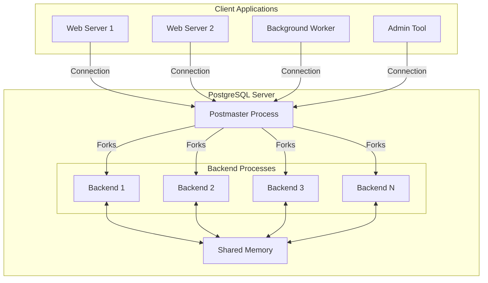
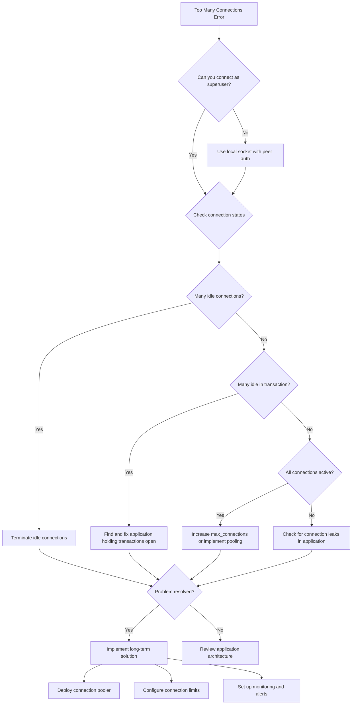
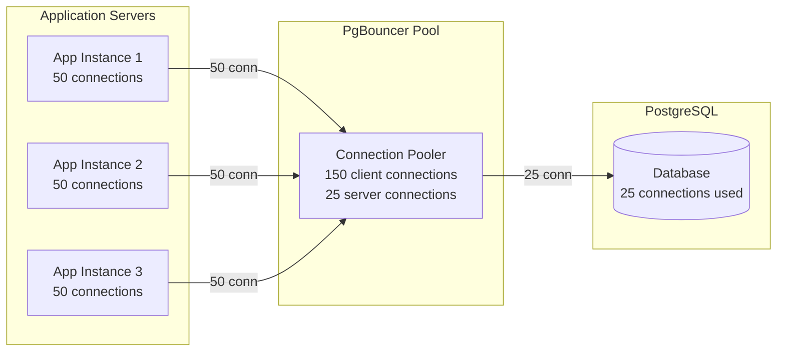
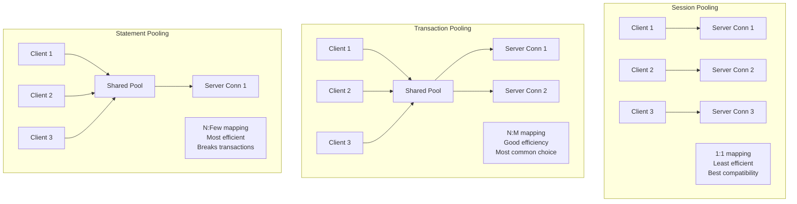
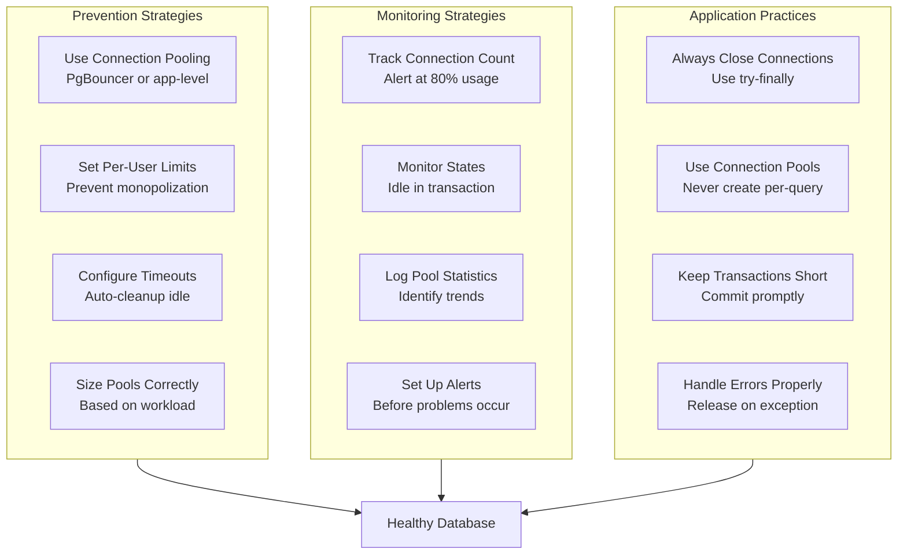

# How to Handle Too Many Connections in PostgreSQL

Author: [nawazdhandala](https://github.com/nawazdhandala)

Tags: PostgreSQL, Database, Connections, PgBouncer, Performance, Troubleshooting

Description: A complete guide to diagnosing, resolving, and preventing PostgreSQL 'too many connections' errors with connection pooling strategies, monitoring solutions, and production-ready configurations.

---

The dreaded "FATAL: too many connections for role" or "FATAL: sorry, too many clients already" error brings your PostgreSQL-backed application to a halt. This guide walks you through diagnosing the root cause, implementing immediate fixes, and building a long-term architecture that prevents connection exhaustion.

## Understanding PostgreSQL Connection Architecture

PostgreSQL uses a process-per-connection model. Each client connection spawns a dedicated backend process that handles all queries for that session. This architecture provides strong isolation but consumes significant resources per connection.



Each backend process typically consumes:

- 5-10 MB of private memory (varies with work_mem and query complexity)
- One slot in max_connections
- File descriptors for the connection socket
- Shared memory access for buffer pool and locks

When max_connections is reached, PostgreSQL refuses new connections, causing application errors.

## Diagnosing Connection Exhaustion

Before implementing fixes, understand why connections are exhausted. The following queries help identify the source of the problem.

### Check Current Connection Status

This query shows how many connections exist and how close you are to the limit.

```sql
-- View current connection count versus the maximum allowed
SELECT
    (SELECT count(*) FROM pg_stat_activity) AS current_connections,
    (SELECT setting::int FROM pg_settings WHERE name = 'max_connections') AS max_connections,
    (SELECT setting::int FROM pg_settings WHERE name = 'superuser_reserved_connections') AS reserved_for_superuser,
    (SELECT setting::int FROM pg_settings WHERE name = 'max_connections')
        - (SELECT setting::int FROM pg_settings WHERE name = 'superuser_reserved_connections')
        - (SELECT count(*) FROM pg_stat_activity) AS available_connections;
```

### Analyze Connections by State

Understanding connection states helps identify whether connections are actively working or sitting idle.

```sql
-- Group connections by their current state
SELECT
    state,
    count(*) AS connection_count,
    round(100.0 * count(*) / sum(count(*)) OVER (), 1) AS percentage
FROM pg_stat_activity
WHERE backend_type = 'client backend'
GROUP BY state
ORDER BY connection_count DESC;
```

Connection states include:

- **active**: Currently executing a query
- **idle**: Waiting for a new command from the client
- **idle in transaction**: Inside a transaction block but not executing
- **idle in transaction (aborted)**: Transaction failed, waiting for rollback

### Find Connection Hogs by User and Application

Identify which applications or users consume the most connections.

```sql
-- Show connections grouped by user and application
SELECT
    usename AS username,
    application_name,
    client_addr AS client_ip,
    count(*) AS connection_count,
    count(*) FILTER (WHERE state = 'idle') AS idle_connections,
    count(*) FILTER (WHERE state = 'active') AS active_connections,
    max(now() - backend_start) AS oldest_connection_age
FROM pg_stat_activity
WHERE backend_type = 'client backend'
GROUP BY usename, application_name, client_addr
ORDER BY connection_count DESC
LIMIT 20;
```

### Identify Long-Running and Stuck Connections

Find connections that may be stuck or running problematic queries.

```sql
-- Find connections that have been idle for extended periods
SELECT
    pid,
    usename,
    application_name,
    client_addr,
    state,
    now() - state_change AS time_in_state,
    now() - backend_start AS connection_age,
    wait_event_type,
    wait_event,
    left(query, 100) AS recent_query
FROM pg_stat_activity
WHERE backend_type = 'client backend'
    AND state != 'active'
    AND now() - state_change > interval '10 minutes'
ORDER BY time_in_state DESC;
```

### Detect Transactions Holding Locks

Idle transactions holding locks can block other queries and prevent connection reuse.

```sql
-- Find idle transactions that may be holding locks
SELECT
    a.pid,
    a.usename,
    a.application_name,
    a.state,
    now() - a.xact_start AS transaction_duration,
    a.wait_event_type,
    l.mode AS lock_mode,
    l.relation::regclass AS locked_table,
    left(a.query, 80) AS query_snippet
FROM pg_stat_activity a
LEFT JOIN pg_locks l ON a.pid = l.pid
WHERE a.state = 'idle in transaction'
    AND a.xact_start IS NOT NULL
ORDER BY transaction_duration DESC;
```

## Troubleshooting Decision Flow

Use this flowchart to systematically troubleshoot connection issues.



## Immediate Remediation Steps

When facing connection exhaustion, these steps provide immediate relief.

### Terminate Idle Connections

This safely terminates connections that have been idle for too long.

```sql
-- Terminate connections idle for more than 10 minutes
-- Excludes the current connection and superuser connections
SELECT pg_terminate_backend(pid)
FROM pg_stat_activity
WHERE state = 'idle'
    AND now() - state_change > interval '10 minutes'
    AND pid != pg_backend_pid()
    AND usename NOT IN ('postgres', 'replication_user');
```

### Cancel Long-Running Queries

For connections running excessively long queries, cancel the query without killing the connection.

```sql
-- Cancel queries running longer than 1 hour
SELECT pg_cancel_backend(pid)
FROM pg_stat_activity
WHERE state = 'active'
    AND now() - query_start > interval '1 hour'
    AND pid != pg_backend_pid();
```

### Terminate Specific Problematic Connections

When you identify a specific application or user causing issues, terminate their connections.

```sql
-- Terminate all connections from a specific application
SELECT pg_terminate_backend(pid)
FROM pg_stat_activity
WHERE application_name = 'problematic_app'
    AND pid != pg_backend_pid();

-- Terminate all connections from a specific IP address
SELECT pg_terminate_backend(pid)
FROM pg_stat_activity
WHERE client_addr = '10.0.0.100'
    AND pid != pg_backend_pid();
```

### Emergency: Increase max_connections

As a temporary measure, you can increase max_connections, but this requires a restart.

```sql
-- Check current setting
SHOW max_connections;

-- Increase the limit (requires restart to take effect)
ALTER SYSTEM SET max_connections = 300;
```

Apply the change with a restart.

```bash
# Check pending changes before restart
sudo -u postgres psql -c "SELECT name, setting, pending_restart FROM pg_settings WHERE pending_restart = true;"

# Restart PostgreSQL to apply changes
sudo systemctl restart postgresql
```

## Long-Term Solutions

### Configure Automatic Idle Connection Timeout

PostgreSQL 14 and later support automatic idle session timeout.

```sql
-- Automatically disconnect sessions idle for more than 30 minutes
ALTER SYSTEM SET idle_session_timeout = '30min';

-- Disconnect sessions idle in a transaction for more than 5 minutes
ALTER SYSTEM SET idle_in_transaction_session_timeout = '5min';

-- Apply changes without restart
SELECT pg_reload_conf();
```

For older PostgreSQL versions, create a scheduled job to clean up idle connections.

```sql
-- Create a function to clean up idle connections
CREATE OR REPLACE FUNCTION cleanup_idle_connections(idle_threshold interval)
RETURNS integer AS $$
DECLARE
    terminated_count integer;
BEGIN
    WITH terminated AS (
        SELECT pg_terminate_backend(pid)
        FROM pg_stat_activity
        WHERE state = 'idle'
            AND now() - state_change > idle_threshold
            AND pid != pg_backend_pid()
            AND usename != 'postgres'
    )
    SELECT count(*) INTO terminated_count FROM terminated;

    RETURN terminated_count;
END;
$$ LANGUAGE plpgsql;

-- Call the function (can be scheduled via cron or pg_cron)
SELECT cleanup_idle_connections(interval '30 minutes');
```

### Set Per-User Connection Limits

Prevent any single user from consuming all connections.

```sql
-- Create a role with a connection limit
CREATE ROLE web_app WITH LOGIN PASSWORD 'secure_password' CONNECTION LIMIT 50;

-- Modify an existing role to add a limit
ALTER ROLE analytics_user CONNECTION LIMIT 20;

-- View current limits for all roles
SELECT
    rolname,
    rolconnlimit,
    CASE
        WHEN rolconnlimit = -1 THEN 'unlimited'
        ELSE rolconnlimit::text
    END AS limit_description
FROM pg_roles
WHERE rolcanlogin = true
ORDER BY rolconnlimit DESC;
```

### Set Per-Database Connection Limits

Limit connections to specific databases.

```sql
-- Limit connections to the production database
ALTER DATABASE production CONNECTION LIMIT 150;

-- View database connection limits
SELECT
    datname,
    datconnlimit,
    (SELECT count(*) FROM pg_stat_activity WHERE datname = d.datname) AS current_connections
FROM pg_database d
WHERE datallowconn = true
ORDER BY current_connections DESC;
```

## Implementing Connection Pooling with PgBouncer

Connection pooling is the most effective long-term solution. PgBouncer multiplexes many client connections through a smaller number of PostgreSQL connections.



### Install and Configure PgBouncer

Install PgBouncer on your server.

```bash
# Ubuntu/Debian
sudo apt-get update
sudo apt-get install pgbouncer

# RHEL/CentOS/Fedora
sudo dnf install pgbouncer
```

Configure PgBouncer in /etc/pgbouncer/pgbouncer.ini.

```ini
; PgBouncer configuration file

[databases]
; Map logical database names to PostgreSQL connection strings
; Clients connect to PgBouncer using these names
myapp = host=127.0.0.1 port=5432 dbname=myapp
analytics = host=127.0.0.1 port=5432 dbname=analytics pool_size=10

; Wildcard: allow connection to any database with same name
* = host=127.0.0.1 port=5432

[pgbouncer]
; Network settings
listen_addr = 0.0.0.0
listen_port = 6432

; Authentication
auth_type = scram-sha-256
auth_file = /etc/pgbouncer/userlist.txt
auth_query = SELECT usename, passwd FROM pg_shadow WHERE usename=$1

; Pool mode determines how connections are shared
; transaction: connection returned to pool after each transaction (recommended)
; session: connection held for entire client session
; statement: connection returned after each statement (breaks multi-statement transactions)
pool_mode = transaction

; Pool size settings
; max_client_conn: maximum client connections PgBouncer accepts
max_client_conn = 1000

; default_pool_size: server connections per user/database pair
default_pool_size = 20

; min_pool_size: minimum server connections to keep open
min_pool_size = 5

; reserve_pool_size: extra connections for burst traffic
reserve_pool_size = 5

; reserve_pool_timeout: seconds before using reserve pool
reserve_pool_timeout = 3

; Timeout settings
; server_connect_timeout: how long to wait for server connection
server_connect_timeout = 5

; server_idle_timeout: close server connections idle this long
server_idle_timeout = 300

; client_idle_timeout: close client connections idle this long (0 = disabled)
client_idle_timeout = 0

; query_timeout: maximum time for a query (0 = disabled, use statement_timeout in PostgreSQL)
query_timeout = 0

; Logging
log_connections = 1
log_disconnections = 1
log_pooler_errors = 1
stats_period = 60

; Admin console
admin_users = pgbouncer_admin
stats_users = pgbouncer_stats
```

### Create Authentication File

Create the userlist.txt file with database credentials.

```bash
# Generate password hash for PgBouncer userlist
# For SCRAM-SHA-256 (PostgreSQL 10+), use the hash from pg_shadow
sudo -u postgres psql -t -c "SELECT concat('\"', usename, '\" \"', passwd, '\"') FROM pg_shadow WHERE usename = 'myapp_user';" | sudo tee -a /etc/pgbouncer/userlist.txt

# Or create a plain text entry (less secure, not recommended for production)
echo '"myapp_user" "md5$(echo -n "passwordmyapp_user" | md5sum | cut -d" " -f1)"' | sudo tee -a /etc/pgbouncer/userlist.txt
```

### Start and Enable PgBouncer

Start PgBouncer and configure it to start on boot.

```bash
# Start PgBouncer
sudo systemctl start pgbouncer

# Enable automatic startup
sudo systemctl enable pgbouncer

# Check status
sudo systemctl status pgbouncer

# View logs
sudo journalctl -u pgbouncer -f
```

### Monitor PgBouncer

Connect to the PgBouncer admin console to monitor pool health.

```bash
# Connect to admin console
psql -h 127.0.0.1 -p 6432 -U pgbouncer_admin pgbouncer
```

Run monitoring commands in the admin console.

```sql
-- Show all pools and their status
SHOW POOLS;

-- Show connected clients
SHOW CLIENTS;

-- Show server connections to PostgreSQL
SHOW SERVERS;

-- Show aggregate statistics
SHOW STATS;

-- Show detailed statistics per database
SHOW STATS_TOTALS;

-- Show current configuration
SHOW CONFIG;

-- Show database connection settings
SHOW DATABASES;
```

### Understanding PgBouncer Pool Modes

Choose the right pool mode for your application.



## Application-Level Connection Management

Proper connection handling in your application prevents leaks and improves efficiency.

### Python with psycopg2 and Connection Pooling

Configure connection pooling at the application level.

```python
import psycopg2
from psycopg2 import pool
from contextlib import contextmanager
import logging

# Configure logging
logging.basicConfig(level=logging.INFO)
logger = logging.getLogger(__name__)

class DatabasePool:
    """
    Manages a connection pool for PostgreSQL with proper
    resource management and error handling.
    """

    def __init__(self, dsn: str, min_conn: int = 2, max_conn: int = 10):
        """
        Initialize the connection pool.

        Args:
            dsn: PostgreSQL connection string
            min_conn: Minimum connections to keep in the pool
            max_conn: Maximum connections allowed in the pool
        """
        self._pool = pool.ThreadedConnectionPool(
            minconn=min_conn,
            maxconn=max_conn,
            dsn=dsn
        )
        logger.info(f"Connection pool initialized with {min_conn}-{max_conn} connections")

    @contextmanager
    def get_connection(self):
        """
        Get a connection from the pool with automatic cleanup.
        Uses a context manager to ensure connections are always returned.
        """
        conn = None
        try:
            conn = self._pool.getconn()
            yield conn
        except psycopg2.Error as e:
            logger.error(f"Database error: {e}")
            if conn:
                conn.rollback()
            raise
        finally:
            if conn:
                self._pool.putconn(conn)

    @contextmanager
    def get_cursor(self, commit: bool = True):
        """
        Get a cursor with automatic connection and transaction management.

        Args:
            commit: Whether to commit the transaction on success
        """
        with self.get_connection() as conn:
            cursor = conn.cursor()
            try:
                yield cursor
                if commit:
                    conn.commit()
            except Exception:
                conn.rollback()
                raise
            finally:
                cursor.close()

    def close(self):
        """Close all connections in the pool."""
        self._pool.closeall()
        logger.info("Connection pool closed")


# Usage example
def main():
    # Connect through PgBouncer for additional pooling
    dsn = "host=localhost port=6432 dbname=myapp user=myapp_user password=secret"

    db = DatabasePool(dsn, min_conn=2, max_conn=10)

    try:
        # Execute a query with automatic resource cleanup
        with db.get_cursor() as cursor:
            cursor.execute("SELECT id, name FROM users WHERE active = %s", (True,))
            users = cursor.fetchall()
            for user in users:
                print(f"User: {user[1]}")

    finally:
        db.close()


if __name__ == "__main__":
    main()
```

### Node.js with pg and Connection Pooling

Configure the pg library for proper connection pooling.

```javascript
const { Pool } = require('pg');

/**
 * Database connection pool configuration.
 * Connects through PgBouncer for additional pooling benefits.
 */
const pool = new Pool({
  host: 'localhost',
  port: 6432,  // PgBouncer port
  database: 'myapp',
  user: 'myapp_user',
  password: 'secret',

  // Pool configuration
  max: 20,                      // Maximum connections in the pool
  min: 2,                       // Minimum connections to maintain
  idleTimeoutMillis: 30000,     // Close idle connections after 30 seconds
  connectionTimeoutMillis: 5000, // Timeout when acquiring a connection
  maxUses: 7500,                // Close connection after this many queries
});

// Log pool events for monitoring
pool.on('connect', (client) => {
  console.log('New client connected to the pool');
});

pool.on('acquire', (client) => {
  console.log('Client acquired from pool');
});

pool.on('remove', (client) => {
  console.log('Client removed from pool');
});

pool.on('error', (err, client) => {
  console.error('Unexpected error on idle client', err);
});

/**
 * Execute a query with automatic connection management.
 * The connection is automatically returned to the pool.
 */
async function query(text, params) {
  const start = Date.now();
  try {
    const result = await pool.query(text, params);
    const duration = Date.now() - start;
    console.log('Query executed', { text: text.substring(0, 50), duration, rows: result.rowCount });
    return result;
  } catch (error) {
    console.error('Query error', { text: text.substring(0, 50), error: error.message });
    throw error;
  }
}

/**
 * Execute operations within a transaction.
 * Ensures proper commit/rollback handling.
 */
async function withTransaction(callback) {
  const client = await pool.connect();
  try {
    await client.query('BEGIN');
    const result = await callback(client);
    await client.query('COMMIT');
    return result;
  } catch (error) {
    await client.query('ROLLBACK');
    throw error;
  } finally {
    client.release();
  }
}

/**
 * Graceful shutdown handler.
 * Ensures all connections are properly closed.
 */
async function shutdown() {
  console.log('Shutting down database pool...');
  await pool.end();
  console.log('Database pool closed');
}

// Handle process termination
process.on('SIGTERM', shutdown);
process.on('SIGINT', shutdown);

// Export for use in application
module.exports = { pool, query, withTransaction, shutdown };
```

### Java with HikariCP Connection Pool

Configure HikariCP for optimal PostgreSQL connection pooling.

```java
import com.zaxxer.hikari.HikariConfig;
import com.zaxxer.hikari.HikariDataSource;
import java.sql.Connection;
import java.sql.PreparedStatement;
import java.sql.ResultSet;
import java.sql.SQLException;

/**
 * Database connection pool manager using HikariCP.
 * Configured to work with PgBouncer for additional pooling.
 */
public class DatabasePool {

    private final HikariDataSource dataSource;

    public DatabasePool() {
        HikariConfig config = new HikariConfig();

        // Connection settings (through PgBouncer)
        config.setJdbcUrl("jdbc:postgresql://localhost:6432/myapp");
        config.setUsername("myapp_user");
        config.setPassword("secret");

        // Pool size configuration
        // Keep this smaller when using PgBouncer
        config.setMaximumPoolSize(10);
        config.setMinimumIdle(2);

        // Connection timeout settings
        config.setConnectionTimeout(5000);      // 5 seconds to acquire connection
        config.setIdleTimeout(300000);          // 5 minutes idle before closing
        config.setMaxLifetime(1800000);         // 30 minutes max connection lifetime
        config.setKeepaliveTime(60000);         // 1 minute keepalive interval

        // Validation
        config.setConnectionTestQuery("SELECT 1");
        config.setValidationTimeout(3000);      // 3 seconds validation timeout

        // PostgreSQL-specific optimizations
        config.addDataSourceProperty("cachePrepStmts", "true");
        config.addDataSourceProperty("prepStmtCacheSize", "250");
        config.addDataSourceProperty("prepStmtCacheSqlLimit", "2048");
        config.addDataSourceProperty("useServerPrepStmts", "true");

        // Leak detection (logs warning if connection not returned within threshold)
        config.setLeakDetectionThreshold(60000); // 1 minute

        // Pool name for monitoring
        config.setPoolName("MyApp-Pool");

        this.dataSource = new HikariDataSource(config);
    }

    /**
     * Get a connection from the pool.
     * Always use try-with-resources to ensure proper cleanup.
     */
    public Connection getConnection() throws SQLException {
        return dataSource.getConnection();
    }

    /**
     * Execute a query and process results.
     * Demonstrates proper resource management with try-with-resources.
     */
    public void executeQuery(String sql, Object... params) throws SQLException {
        try (Connection conn = getConnection();
             PreparedStatement stmt = conn.prepareStatement(sql)) {

            // Set parameters
            for (int i = 0; i < params.length; i++) {
                stmt.setObject(i + 1, params[i]);
            }

            try (ResultSet rs = stmt.executeQuery()) {
                while (rs.next()) {
                    // Process results
                    System.out.println("Result: " + rs.getString(1));
                }
            }
        }
    }

    /**
     * Get pool statistics for monitoring.
     */
    public void logPoolStats() {
        System.out.println("Pool stats:");
        System.out.println("  Active connections: " + dataSource.getHikariPoolMXBean().getActiveConnections());
        System.out.println("  Idle connections: " + dataSource.getHikariPoolMXBean().getIdleConnections());
        System.out.println("  Total connections: " + dataSource.getHikariPoolMXBean().getTotalConnections());
        System.out.println("  Threads awaiting: " + dataSource.getHikariPoolMXBean().getThreadsAwaitingConnection());
    }

    /**
     * Shutdown the pool gracefully.
     */
    public void shutdown() {
        if (dataSource != null && !dataSource.isClosed()) {
            dataSource.close();
            System.out.println("Database pool closed");
        }
    }
}
```

## Monitoring and Alerting

Proactive monitoring prevents connection exhaustion before it impacts users.

### Create a Connection Monitoring View

Create a view for easy monitoring queries.

```sql
-- Create a comprehensive connection monitoring view
CREATE OR REPLACE VIEW v_connection_monitor AS
SELECT
    -- Current usage
    (SELECT count(*) FROM pg_stat_activity WHERE backend_type = 'client backend') AS current_connections,
    (SELECT setting::int FROM pg_settings WHERE name = 'max_connections') AS max_connections,
    (SELECT setting::int FROM pg_settings WHERE name = 'superuser_reserved_connections') AS reserved_connections,

    -- Available capacity
    (SELECT setting::int FROM pg_settings WHERE name = 'max_connections')
        - (SELECT setting::int FROM pg_settings WHERE name = 'superuser_reserved_connections')
        - (SELECT count(*) FROM pg_stat_activity WHERE backend_type = 'client backend') AS available_connections,

    -- Usage percentage
    round(100.0 * (SELECT count(*) FROM pg_stat_activity WHERE backend_type = 'client backend')
        / ((SELECT setting::int FROM pg_settings WHERE name = 'max_connections')
           - (SELECT setting::int FROM pg_settings WHERE name = 'superuser_reserved_connections')), 1) AS usage_percent,

    -- Connection state breakdown
    (SELECT count(*) FROM pg_stat_activity WHERE state = 'active') AS active_connections,
    (SELECT count(*) FROM pg_stat_activity WHERE state = 'idle') AS idle_connections,
    (SELECT count(*) FROM pg_stat_activity WHERE state = 'idle in transaction') AS idle_in_transaction,

    -- Timestamp
    now() AS checked_at;

-- Query the view
SELECT * FROM v_connection_monitor;
```

### Set Up Alerting Thresholds

Create a function that returns alert status based on connection usage.

```sql
-- Create function to check connection health with alert levels
CREATE OR REPLACE FUNCTION check_connection_health()
RETURNS TABLE (
    metric_name text,
    current_value numeric,
    threshold numeric,
    status text
) AS $$
BEGIN
    RETURN QUERY
    WITH metrics AS (
        SELECT
            count(*)::numeric AS current_conn,
            (SELECT setting::numeric FROM pg_settings WHERE name = 'max_connections')
                - (SELECT setting::numeric FROM pg_settings WHERE name = 'superuser_reserved_connections') AS effective_max
        FROM pg_stat_activity
        WHERE backend_type = 'client backend'
    )
    SELECT
        'connection_usage_percent'::text,
        round(100.0 * current_conn / effective_max, 1),
        80.0,
        CASE
            WHEN 100.0 * current_conn / effective_max >= 90 THEN 'CRITICAL'
            WHEN 100.0 * current_conn / effective_max >= 80 THEN 'WARNING'
            ELSE 'OK'
        END
    FROM metrics

    UNION ALL

    SELECT
        'idle_in_transaction_count'::text,
        (SELECT count(*)::numeric FROM pg_stat_activity WHERE state = 'idle in transaction'),
        10.0,
        CASE
            WHEN (SELECT count(*) FROM pg_stat_activity WHERE state = 'idle in transaction') >= 20 THEN 'CRITICAL'
            WHEN (SELECT count(*) FROM pg_stat_activity WHERE state = 'idle in transaction') >= 10 THEN 'WARNING'
            ELSE 'OK'
        END

    UNION ALL

    SELECT
        'long_running_queries'::text,
        (SELECT count(*)::numeric FROM pg_stat_activity
         WHERE state = 'active' AND now() - query_start > interval '5 minutes'),
        5.0,
        CASE
            WHEN (SELECT count(*) FROM pg_stat_activity
                  WHERE state = 'active' AND now() - query_start > interval '5 minutes') >= 10 THEN 'CRITICAL'
            WHEN (SELECT count(*) FROM pg_stat_activity
                  WHERE state = 'active' AND now() - query_start > interval '5 minutes') >= 5 THEN 'WARNING'
            ELSE 'OK'
        END;
END;
$$ LANGUAGE plpgsql;

-- Run the health check
SELECT * FROM check_connection_health();
```

### Prometheus Metrics Exporter Query

If using Prometheus with postgres_exporter, these metrics track connection health.

```yaml
# prometheus.yml - Add these custom queries to postgres_exporter

pg_connection_stats:
  query: |
    SELECT
      count(*) FILTER (WHERE state = 'active') AS active,
      count(*) FILTER (WHERE state = 'idle') AS idle,
      count(*) FILTER (WHERE state = 'idle in transaction') AS idle_in_transaction,
      count(*) AS total,
      (SELECT setting::float FROM pg_settings WHERE name = 'max_connections') AS max_connections
    FROM pg_stat_activity
    WHERE backend_type = 'client backend'
  metrics:
    - active:
        usage: "GAUGE"
        description: "Number of active connections"
    - idle:
        usage: "GAUGE"
        description: "Number of idle connections"
    - idle_in_transaction:
        usage: "GAUGE"
        description: "Number of idle in transaction connections"
    - total:
        usage: "GAUGE"
        description: "Total client connections"
    - max_connections:
        usage: "GAUGE"
        description: "Maximum allowed connections"
```

## Best Practices Summary

Follow these practices to prevent connection exhaustion.



### Key Recommendations

1. **Deploy PgBouncer**: Use transaction-mode pooling for most applications. This dramatically reduces the number of PostgreSQL connections needed.

2. **Set appropriate limits**: Configure max_connections based on available RAM (approximately 400 connections per GB as a starting point), and set per-user limits to prevent any single application from exhausting the pool.

3. **Configure timeouts**: Enable idle_session_timeout and idle_in_transaction_session_timeout to automatically clean up abandoned connections.

4. **Monitor proactively**: Set up alerts at 80% connection usage. By the time you hit 100%, it is too late to respond gracefully.

5. **Fix application leaks**: Audit your application code for connection leaks. Every connection acquisition must have a corresponding release in a finally block or equivalent.

6. **Keep transactions short**: Long-running transactions hold connections and can hold locks. Commit or rollback promptly.

7. **Size pools appropriately**: Application-level pools should be sized based on your actual concurrency needs, not theoretical maximums.

## Monitor Your PostgreSQL with OneUptime

Preventing connection exhaustion requires continuous monitoring and alerting. [OneUptime](https://oneuptime.com) provides comprehensive PostgreSQL monitoring that helps you stay ahead of connection issues before they impact your users.

With OneUptime, you can:

- Monitor connection counts and alert when approaching limits
- Track connection states and identify idle-in-transaction problems
- Set up custom alerts based on your specific thresholds
- Visualize connection trends over time to plan capacity
- Receive notifications through multiple channels when issues arise

Start monitoring your PostgreSQL infrastructure today and prevent connection exhaustion before it becomes a production incident.
