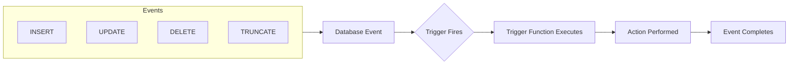
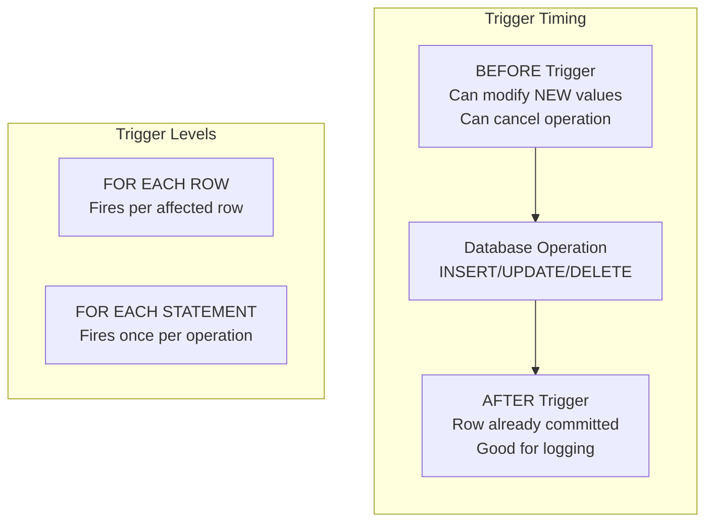
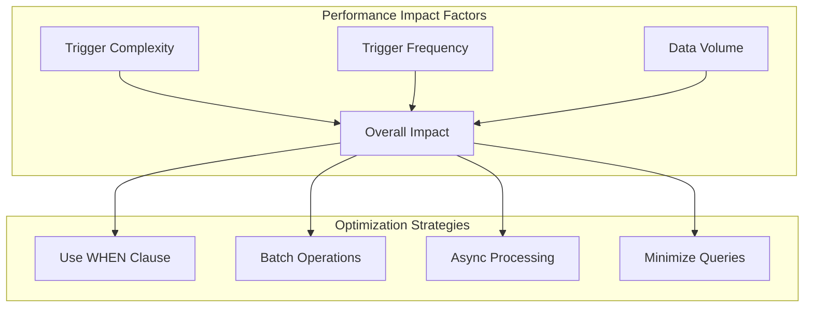

# How to Use PostgreSQL Triggers and Functions

Author: [nawazdhandala](https://www.github.com/nawazdhandala)

Tags: PostgreSQL, Triggers, Functions, Database, PL/pgSQL, Automation, Data Integrity

Description: Learn how to use PostgreSQL triggers and functions effectively with practical examples covering audit trails, data validation, automatic timestamps, cascading updates, and performance optimization strategies.

---

PostgreSQL triggers and functions are powerful tools that allow you to automate database operations, enforce business rules, and maintain data integrity without relying on application code. This guide walks you through practical use cases with well-commented examples that you can adapt to your own projects.

## What Are Triggers and Functions?

A **function** in PostgreSQL is a reusable block of code that performs a specific task. Functions can accept parameters, execute logic, and return values. A **trigger** is a database object that automatically executes a function in response to specific events on a table, such as INSERT, UPDATE, or DELETE operations.



### Why Use Triggers and Functions?

- **Data Integrity**: Enforce complex business rules at the database level
- **Automation**: Automatically update related records or compute values
- **Audit Logging**: Track all changes to sensitive data
- **Consistency**: Ensure rules apply regardless of how data is modified
- **Performance**: Reduce round trips between application and database

## Prerequisites

Before diving in, ensure you have:

- PostgreSQL 12 or higher installed
- Basic understanding of SQL syntax
- A database with appropriate permissions to create functions and triggers
- A PostgreSQL client (psql, pgAdmin, or DBeaver)

## Understanding PL/pgSQL Functions

PL/pgSQL is PostgreSQL's procedural language that extends SQL with programming constructs like variables, conditionals, and loops.

### Creating Your First Function

This function calculates the total price for an order including tax. It demonstrates basic function structure, variable declaration, and return values.

```sql
-- Create a function that calculates order total with tax
-- Parameters: order_id (the order to calculate)
-- Returns: The total price including tax as a NUMERIC value
CREATE OR REPLACE FUNCTION calculate_order_total(p_order_id INTEGER)
RETURNS NUMERIC AS $$
DECLARE
    -- Declare local variables with their types and default values
    v_subtotal NUMERIC := 0;
    v_tax_rate NUMERIC := 0.085;  -- 8.5% tax rate
    v_total NUMERIC := 0;
BEGIN
    -- Calculate the subtotal by summing all order items
    SELECT COALESCE(SUM(quantity * unit_price), 0)
    INTO v_subtotal
    FROM order_items
    WHERE order_id = p_order_id;

    -- Apply tax to get the final total
    v_total := v_subtotal * (1 + v_tax_rate);

    -- Return the calculated total, rounded to 2 decimal places
    RETURN ROUND(v_total, 2);
END;
$$ LANGUAGE plpgsql;
```

You can call this function directly in SQL queries:

```sql
-- Get the total for order 42
SELECT calculate_order_total(42);

-- Use in a query to get all orders with their totals
SELECT
    o.id,
    o.customer_id,
    o.order_date,
    calculate_order_total(o.id) AS total_with_tax
FROM orders o
WHERE o.order_date >= CURRENT_DATE - INTERVAL '30 days';
```

### Functions with Multiple Return Values

When you need to return multiple values, use OUT parameters. This function retrieves customer statistics in a single call.

```sql
-- Function returning multiple values using OUT parameters
-- This eliminates the need for multiple queries to get related statistics
CREATE OR REPLACE FUNCTION get_customer_statistics(
    p_customer_id INTEGER,
    OUT total_orders INTEGER,
    OUT total_spent NUMERIC,
    OUT average_order NUMERIC,
    OUT last_order_date TIMESTAMP
) AS $$
BEGIN
    -- Aggregate all statistics in a single query for efficiency
    SELECT
        COUNT(*)::INTEGER,
        COALESCE(SUM(total_amount), 0),
        COALESCE(AVG(total_amount), 0),
        MAX(order_date)
    INTO
        total_orders,
        total_spent,
        average_order,
        last_order_date
    FROM orders
    WHERE customer_id = p_customer_id;

    -- Round the average for cleaner output
    average_order := ROUND(average_order, 2);
END;
$$ LANGUAGE plpgsql;
```

Call the function and access individual fields:

```sql
-- Call the function and retrieve all statistics at once
SELECT * FROM get_customer_statistics(123);

-- Or destructure into individual columns
SELECT
    c.name,
    (get_customer_statistics(c.id)).*
FROM customers c
WHERE c.status = 'active';
```

### Functions Returning Tables

For complex queries that return multiple rows, create functions that return tables. This is useful for encapsulating business logic in reusable database objects.

```sql
-- Function that returns a table of products needing restock
-- Returns all products where current stock is below the reorder threshold
CREATE OR REPLACE FUNCTION get_products_needing_restock(p_warehouse_id INTEGER DEFAULT NULL)
RETURNS TABLE (
    product_id INTEGER,
    product_name VARCHAR(255),
    current_stock INTEGER,
    reorder_level INTEGER,
    suggested_order_quantity INTEGER
) AS $$
BEGIN
    RETURN QUERY
    SELECT
        p.id,
        p.name,
        COALESCE(i.quantity, 0)::INTEGER AS current_stock,
        p.reorder_level,
        -- Calculate how much to order: bring stock to 150% of reorder level
        GREATEST(0, (p.reorder_level * 1.5)::INTEGER - COALESCE(i.quantity, 0))::INTEGER
    FROM products p
    LEFT JOIN inventory i ON p.id = i.product_id
        AND (p_warehouse_id IS NULL OR i.warehouse_id = p_warehouse_id)
    WHERE COALESCE(i.quantity, 0) < p.reorder_level
    ORDER BY (p.reorder_level - COALESCE(i.quantity, 0)) DESC;
END;
$$ LANGUAGE plpgsql;
```

Use it like a regular table in queries:

```sql
-- Get all products needing restock across all warehouses
SELECT * FROM get_products_needing_restock();

-- Get products needing restock for a specific warehouse
SELECT * FROM get_products_needing_restock(5);

-- Join with other tables for more context
SELECT
    r.*,
    s.supplier_name,
    s.lead_time_days
FROM get_products_needing_restock() r
JOIN product_suppliers ps ON r.product_id = ps.product_id
JOIN suppliers s ON ps.supplier_id = s.id
WHERE ps.is_primary = true;
```

## Understanding Trigger Mechanics

Triggers execute automatically in response to database events. Understanding when and how they fire is crucial for effective use.



### Trigger Types Summary

| Timing | Use Case | Can Modify Data | Access to OLD/NEW |
|--------|----------|-----------------|-------------------|
| BEFORE INSERT | Validation, set defaults | Yes (NEW) | NEW only |
| BEFORE UPDATE | Validation, modify changes | Yes (NEW) | OLD and NEW |
| BEFORE DELETE | Prevent deletion, soft delete | No | OLD only |
| AFTER INSERT | Audit, notifications | No | NEW only |
| AFTER UPDATE | Audit, sync related tables | No | OLD and NEW |
| AFTER DELETE | Audit, cleanup | No | OLD only |

## Practical Trigger Examples

### Example 1: Automatic Timestamp Management

One of the most common uses for triggers is automatically managing created_at and updated_at timestamps. This ensures timestamps are always accurate regardless of how data is inserted or updated.

```sql
-- Create a reusable trigger function for timestamp management
-- This single function can be used by multiple tables
CREATE OR REPLACE FUNCTION manage_timestamps()
RETURNS TRIGGER AS $$
BEGIN
    -- For INSERT operations, set both created_at and updated_at
    IF TG_OP = 'INSERT' THEN
        -- Only set if not already provided (allows manual override)
        IF NEW.created_at IS NULL THEN
            NEW.created_at := CURRENT_TIMESTAMP;
        END IF;
        NEW.updated_at := CURRENT_TIMESTAMP;
        RETURN NEW;
    END IF;

    -- For UPDATE operations, only update the updated_at timestamp
    IF TG_OP = 'UPDATE' THEN
        -- Prevent tampering with created_at
        NEW.created_at := OLD.created_at;
        NEW.updated_at := CURRENT_TIMESTAMP;
        RETURN NEW;
    END IF;

    RETURN NEW;
END;
$$ LANGUAGE plpgsql;
```

Apply this trigger to any table that needs timestamp management:

```sql
-- Create the users table with timestamp columns
CREATE TABLE users (
    id SERIAL PRIMARY KEY,
    email VARCHAR(255) UNIQUE NOT NULL,
    name VARCHAR(255) NOT NULL,
    created_at TIMESTAMP,
    updated_at TIMESTAMP
);

-- Attach the timestamp trigger to the users table
-- BEFORE INSERT OR UPDATE ensures timestamps are set before data is written
CREATE TRIGGER users_timestamps
    BEFORE INSERT OR UPDATE ON users
    FOR EACH ROW
    EXECUTE FUNCTION manage_timestamps();

-- The trigger works automatically - no need to specify timestamps
INSERT INTO users (email, name) VALUES ('john@example.com', 'John Doe');

-- Check that timestamps were set
SELECT id, email, created_at, updated_at FROM users;
```

### Example 2: Comprehensive Audit Logging

Audit logging is critical for compliance, debugging, and security. This example creates a complete audit trail that captures who changed what, when, and the before/after values.

```sql
-- Create the audit log table to store all changes
CREATE TABLE audit_log (
    id BIGSERIAL PRIMARY KEY,
    table_name VARCHAR(100) NOT NULL,
    record_id TEXT NOT NULL,
    operation VARCHAR(10) NOT NULL,
    old_values JSONB,
    new_values JSONB,
    changed_fields TEXT[],
    changed_by VARCHAR(100),
    changed_at TIMESTAMP DEFAULT CURRENT_TIMESTAMP,
    client_ip INET,
    application_name VARCHAR(100)
);

-- Create indexes for common query patterns
CREATE INDEX idx_audit_log_table_record ON audit_log(table_name, record_id);
CREATE INDEX idx_audit_log_changed_at ON audit_log(changed_at);
CREATE INDEX idx_audit_log_changed_by ON audit_log(changed_by);

-- The audit trigger function captures all changes with full context
CREATE OR REPLACE FUNCTION audit_trigger_function()
RETURNS TRIGGER AS $$
DECLARE
    v_old_data JSONB;
    v_new_data JSONB;
    v_changed_fields TEXT[];
    v_record_id TEXT;
    v_key TEXT;
BEGIN
    -- Determine the record ID based on operation type
    IF TG_OP = 'DELETE' THEN
        v_record_id := OLD.id::TEXT;
        v_old_data := to_jsonb(OLD);
    ELSIF TG_OP = 'INSERT' THEN
        v_record_id := NEW.id::TEXT;
        v_new_data := to_jsonb(NEW);
    ELSE  -- UPDATE
        v_record_id := NEW.id::TEXT;
        v_old_data := to_jsonb(OLD);
        v_new_data := to_jsonb(NEW);

        -- Calculate which fields actually changed
        -- This helps with filtering and understanding what was modified
        FOR v_key IN SELECT jsonb_object_keys(v_new_data)
        LOOP
            IF v_old_data->v_key IS DISTINCT FROM v_new_data->v_key THEN
                v_changed_fields := array_append(v_changed_fields, v_key);
            END IF;
        END LOOP;
    END IF;

    -- Skip logging if nothing actually changed during an UPDATE
    IF TG_OP = 'UPDATE' AND v_changed_fields IS NULL THEN
        RETURN NEW;
    END IF;

    -- Insert the audit record with full context
    INSERT INTO audit_log (
        table_name,
        record_id,
        operation,
        old_values,
        new_values,
        changed_fields,
        changed_by,
        client_ip,
        application_name
    ) VALUES (
        TG_TABLE_NAME,
        v_record_id,
        TG_OP,
        v_old_data,
        v_new_data,
        v_changed_fields,
        -- Try to get the current user from session settings, fall back to database user
        COALESCE(current_setting('app.current_user', true), current_user),
        -- Get client IP if available
        inet_client_addr(),
        -- Get application name from connection
        current_setting('application_name', true)
    );

    -- Return appropriate value based on operation
    IF TG_OP = 'DELETE' THEN
        RETURN OLD;
    END IF;
    RETURN NEW;
END;
$$ LANGUAGE plpgsql;
```

Apply the audit trigger to sensitive tables:

```sql
-- Create a sample accounts table to audit
CREATE TABLE accounts (
    id SERIAL PRIMARY KEY,
    account_number VARCHAR(20) UNIQUE NOT NULL,
    owner_name VARCHAR(255) NOT NULL,
    balance NUMERIC(15,2) DEFAULT 0,
    status VARCHAR(20) DEFAULT 'active',
    created_at TIMESTAMP DEFAULT CURRENT_TIMESTAMP,
    updated_at TIMESTAMP
);

-- Attach the audit trigger - AFTER ensures the operation succeeded before logging
CREATE TRIGGER accounts_audit_trigger
    AFTER INSERT OR UPDATE OR DELETE ON accounts
    FOR EACH ROW
    EXECUTE FUNCTION audit_trigger_function();

-- Set the current user for audit purposes (typically done in your application)
SET app.current_user = 'admin@company.com';

-- Now all operations are automatically logged
INSERT INTO accounts (account_number, owner_name, balance)
VALUES ('ACC-001', 'Alice Smith', 10000.00);

UPDATE accounts SET balance = 15000.00 WHERE account_number = 'ACC-001';

-- Query the audit log to see the history
SELECT
    operation,
    old_values->>'balance' AS old_balance,
    new_values->>'balance' AS new_balance,
    changed_fields,
    changed_by,
    changed_at
FROM audit_log
WHERE table_name = 'accounts'
ORDER BY changed_at DESC;
```

### Example 3: Data Validation Triggers

While CHECK constraints handle simple validations, triggers can enforce complex business rules that span multiple columns or require lookups.

```sql
-- Validation trigger for order placement
-- Ensures orders meet business requirements before being saved
CREATE OR REPLACE FUNCTION validate_order()
RETURNS TRIGGER AS $$
DECLARE
    v_customer_status VARCHAR(20);
    v_credit_limit NUMERIC;
    v_current_balance NUMERIC;
BEGIN
    -- Rule 1: Verify customer exists and is active
    SELECT status, credit_limit
    INTO v_customer_status, v_credit_limit
    FROM customers
    WHERE id = NEW.customer_id;

    IF NOT FOUND THEN
        RAISE EXCEPTION 'Customer ID % does not exist', NEW.customer_id;
    END IF;

    IF v_customer_status != 'active' THEN
        RAISE EXCEPTION 'Cannot place order: Customer account is %', v_customer_status;
    END IF;

    -- Rule 2: Check credit limit for orders on credit terms
    IF NEW.payment_terms = 'credit' THEN
        -- Calculate current outstanding balance
        SELECT COALESCE(SUM(total_amount), 0)
        INTO v_current_balance
        FROM orders
        WHERE customer_id = NEW.customer_id
          AND payment_status = 'pending';

        IF (v_current_balance + NEW.total_amount) > v_credit_limit THEN
            RAISE EXCEPTION 'Order exceeds credit limit. Available: %, Requested: %',
                (v_credit_limit - v_current_balance), NEW.total_amount;
        END IF;
    END IF;

    -- Rule 3: Validate order date is not in the past
    IF NEW.order_date < CURRENT_DATE THEN
        RAISE EXCEPTION 'Order date cannot be in the past';
    END IF;

    -- Rule 4: Ensure minimum order amount
    IF NEW.total_amount < 10.00 THEN
        RAISE EXCEPTION 'Minimum order amount is $10.00';
    END IF;

    -- All validations passed, allow the insert/update
    RETURN NEW;
END;
$$ LANGUAGE plpgsql;

-- Attach to the orders table
CREATE TRIGGER validate_order_trigger
    BEFORE INSERT OR UPDATE ON orders
    FOR EACH ROW
    EXECUTE FUNCTION validate_order();
```

### Example 4: Maintaining Denormalized Data

Sometimes you need to store computed or aggregated values for performance. Triggers can keep these values in sync automatically.

```sql
-- Create tables for a product review system
CREATE TABLE products (
    id SERIAL PRIMARY KEY,
    name VARCHAR(255) NOT NULL,
    price NUMERIC(10,2),
    -- Denormalized fields for performance
    review_count INTEGER DEFAULT 0,
    average_rating NUMERIC(3,2) DEFAULT 0,
    last_review_at TIMESTAMP
);

CREATE TABLE product_reviews (
    id SERIAL PRIMARY KEY,
    product_id INTEGER REFERENCES products(id) ON DELETE CASCADE,
    user_id INTEGER NOT NULL,
    rating INTEGER CHECK (rating BETWEEN 1 AND 5),
    review_text TEXT,
    created_at TIMESTAMP DEFAULT CURRENT_TIMESTAMP
);

-- Trigger function to maintain product statistics
-- Updates are performed efficiently using incremental calculations
CREATE OR REPLACE FUNCTION update_product_review_stats()
RETURNS TRIGGER AS $$
DECLARE
    v_product_id INTEGER;
    v_new_count INTEGER;
    v_new_average NUMERIC;
BEGIN
    -- Determine which product to update
    IF TG_OP = 'DELETE' THEN
        v_product_id := OLD.product_id;
    ELSE
        v_product_id := NEW.product_id;
    END IF;

    -- Calculate new statistics
    -- Using a single aggregation query is more efficient than multiple queries
    SELECT
        COUNT(*),
        COALESCE(AVG(rating), 0)
    INTO v_new_count, v_new_average
    FROM product_reviews
    WHERE product_id = v_product_id;

    -- Update the product with new statistics
    UPDATE products
    SET
        review_count = v_new_count,
        average_rating = ROUND(v_new_average, 2),
        last_review_at = (
            SELECT MAX(created_at)
            FROM product_reviews
            WHERE product_id = v_product_id
        )
    WHERE id = v_product_id;

    -- Return appropriate value
    IF TG_OP = 'DELETE' THEN
        RETURN OLD;
    END IF;
    RETURN NEW;
END;
$$ LANGUAGE plpgsql;

-- Attach trigger for all review modifications
CREATE TRIGGER product_reviews_stats_trigger
    AFTER INSERT OR UPDATE OR DELETE ON product_reviews
    FOR EACH ROW
    EXECUTE FUNCTION update_product_review_stats();
```

Test the automatic statistics updates:

```sql
-- Insert a product
INSERT INTO products (name, price) VALUES ('Awesome Widget', 29.99);

-- Add some reviews
INSERT INTO product_reviews (product_id, user_id, rating, review_text)
VALUES
    (1, 101, 5, 'Excellent product!'),
    (1, 102, 4, 'Very good, minor issues'),
    (1, 103, 5, 'Best purchase ever');

-- The product stats are automatically updated
SELECT name, review_count, average_rating, last_review_at
FROM products WHERE id = 1;
-- Result: review_count = 3, average_rating = 4.67
```

### Example 5: Soft Delete Implementation

Instead of permanently deleting records, soft delete marks them as deleted while preserving the data for audit and recovery purposes.

```sql
-- Add soft delete columns to an existing table
ALTER TABLE users ADD COLUMN deleted_at TIMESTAMP;
ALTER TABLE users ADD COLUMN deleted_by VARCHAR(100);
ALTER TABLE users ADD COLUMN is_deleted BOOLEAN DEFAULT FALSE;

-- Create an index to efficiently filter out deleted records
CREATE INDEX idx_users_not_deleted ON users(id) WHERE NOT is_deleted;

-- Trigger function that intercepts DELETE and converts to soft delete
CREATE OR REPLACE FUNCTION soft_delete_user()
RETURNS TRIGGER AS $$
BEGIN
    -- Instead of deleting, update the record to mark as deleted
    UPDATE users
    SET
        is_deleted = TRUE,
        deleted_at = CURRENT_TIMESTAMP,
        deleted_by = COALESCE(current_setting('app.current_user', true), current_user)
    WHERE id = OLD.id;

    -- Return NULL to prevent the actual DELETE from happening
    RETURN NULL;
END;
$$ LANGUAGE plpgsql;

-- Attach the trigger - BEFORE DELETE allows us to intercept and prevent
CREATE TRIGGER users_soft_delete
    BEFORE DELETE ON users
    FOR EACH ROW
    EXECUTE FUNCTION soft_delete_user();

-- Create a view that shows only active users (convenience for queries)
CREATE VIEW active_users AS
SELECT * FROM users WHERE NOT is_deleted;
```

Usage example:

```sql
-- This DELETE is intercepted and converted to a soft delete
DELETE FROM users WHERE id = 5;

-- The record still exists but is marked as deleted
SELECT id, email, is_deleted, deleted_at FROM users WHERE id = 5;

-- Use the view for normal queries
SELECT * FROM active_users WHERE email LIKE '%@company.com';

-- Restore a soft-deleted user
UPDATE users SET is_deleted = FALSE, deleted_at = NULL, deleted_by = NULL
WHERE id = 5;
```

### Example 6: Cascading Updates with Notifications

Triggers can update related records and send notifications when important changes occur.

```sql
-- Create a notifications queue table for async processing
CREATE TABLE notification_queue (
    id SERIAL PRIMARY KEY,
    event_type VARCHAR(50) NOT NULL,
    payload JSONB NOT NULL,
    created_at TIMESTAMP DEFAULT CURRENT_TIMESTAMP,
    processed_at TIMESTAMP,
    status VARCHAR(20) DEFAULT 'pending'
);

-- Trigger function for order status changes
-- Handles cascading updates and queues notifications
CREATE OR REPLACE FUNCTION handle_order_status_change()
RETURNS TRIGGER AS $$
BEGIN
    -- Only proceed if status actually changed
    IF OLD.status = NEW.status THEN
        RETURN NEW;
    END IF;

    -- Handle specific status transitions
    CASE NEW.status
        WHEN 'confirmed' THEN
            -- Update inventory when order is confirmed
            UPDATE inventory i
            SET reserved_quantity = reserved_quantity + oi.quantity
            FROM order_items oi
            WHERE oi.order_id = NEW.id AND i.product_id = oi.product_id;

            -- Queue confirmation email
            INSERT INTO notification_queue (event_type, payload)
            VALUES ('order_confirmed', jsonb_build_object(
                'order_id', NEW.id,
                'customer_id', NEW.customer_id,
                'total', NEW.total_amount
            ));

        WHEN 'shipped' THEN
            -- Decrease actual inventory when shipped
            UPDATE inventory i
            SET
                quantity = quantity - oi.quantity,
                reserved_quantity = reserved_quantity - oi.quantity
            FROM order_items oi
            WHERE oi.order_id = NEW.id AND i.product_id = oi.product_id;

            -- Queue shipping notification
            INSERT INTO notification_queue (event_type, payload)
            VALUES ('order_shipped', jsonb_build_object(
                'order_id', NEW.id,
                'customer_id', NEW.customer_id,
                'tracking_number', NEW.tracking_number
            ));

        WHEN 'cancelled' THEN
            -- Release reserved inventory
            UPDATE inventory i
            SET reserved_quantity = reserved_quantity - oi.quantity
            FROM order_items oi
            WHERE oi.order_id = NEW.id AND i.product_id = oi.product_id;

            -- Process refund if already paid
            IF OLD.payment_status = 'paid' THEN
                INSERT INTO refund_requests (order_id, amount, status)
                VALUES (NEW.id, NEW.total_amount, 'pending');
            END IF;

            -- Queue cancellation notification
            INSERT INTO notification_queue (event_type, payload)
            VALUES ('order_cancelled', jsonb_build_object(
                'order_id', NEW.id,
                'customer_id', NEW.customer_id,
                'reason', NEW.cancellation_reason
            ));
    END CASE;

    -- Use PostgreSQL NOTIFY for real-time listeners
    PERFORM pg_notify('order_events', jsonb_build_object(
        'event', 'status_changed',
        'order_id', NEW.id,
        'old_status', OLD.status,
        'new_status', NEW.status
    )::text);

    RETURN NEW;
END;
$$ LANGUAGE plpgsql;

-- Attach the trigger
CREATE TRIGGER order_status_change_trigger
    AFTER UPDATE OF status ON orders
    FOR EACH ROW
    EXECUTE FUNCTION handle_order_status_change();
```

## Conditional Triggers

PostgreSQL allows you to add conditions to triggers using the WHEN clause, which can improve performance by avoiding unnecessary function calls.

```sql
-- Only fire the trigger when specific conditions are met
-- This is more efficient than checking inside the function
CREATE TRIGGER log_large_transactions
    AFTER INSERT ON transactions
    FOR EACH ROW
    WHEN (NEW.amount > 10000)  -- Only for transactions over $10,000
    EXECUTE FUNCTION log_suspicious_transaction();

-- Trigger that only fires when specific columns change
CREATE TRIGGER email_change_notification
    AFTER UPDATE OF email ON users
    FOR EACH ROW
    WHEN (OLD.email IS DISTINCT FROM NEW.email)
    EXECUTE FUNCTION notify_email_change();

-- Trigger with complex condition
CREATE TRIGGER vip_order_alert
    AFTER INSERT ON orders
    FOR EACH ROW
    WHEN (
        NEW.total_amount > 1000
        AND EXISTS (SELECT 1 FROM customers WHERE id = NEW.customer_id AND tier = 'vip')
    )
    EXECUTE FUNCTION alert_vip_order();
```

## Statement-Level Triggers

While row-level triggers fire for each affected row, statement-level triggers fire once per SQL statement. These are useful for batch operations and summary logging.

```sql
-- Statement-level trigger for batch import logging
CREATE OR REPLACE FUNCTION log_batch_import()
RETURNS TRIGGER AS $$
DECLARE
    v_row_count INTEGER;
BEGIN
    -- Get the count of affected rows from transition table
    IF TG_OP = 'INSERT' THEN
        SELECT COUNT(*) INTO v_row_count FROM new_rows;
    ELSIF TG_OP = 'DELETE' THEN
        SELECT COUNT(*) INTO v_row_count FROM old_rows;
    ELSE
        SELECT COUNT(*) INTO v_row_count FROM new_rows;
    END IF;

    -- Log the batch operation
    INSERT INTO batch_operation_log (
        table_name,
        operation,
        row_count,
        executed_by,
        executed_at
    ) VALUES (
        TG_TABLE_NAME,
        TG_OP,
        v_row_count,
        current_user,
        CURRENT_TIMESTAMP
    );

    RETURN NULL;
END;
$$ LANGUAGE plpgsql;

-- Create trigger with transition tables for accessing affected rows
CREATE TRIGGER products_batch_import_log
    AFTER INSERT ON products
    REFERENCING NEW TABLE AS new_rows
    FOR EACH STATEMENT
    EXECUTE FUNCTION log_batch_import();

-- Now bulk inserts are logged with a single entry
INSERT INTO products (name, price)
SELECT name, price FROM temp_import_products;
-- Only one log entry is created, regardless of how many rows were inserted
```

## Managing Triggers

### Viewing Existing Triggers

```sql
-- List all triggers on a specific table
SELECT
    tgname AS trigger_name,
    CASE tgenabled
        WHEN 'O' THEN 'enabled'
        WHEN 'D' THEN 'disabled'
        WHEN 'R' THEN 'replica'
        WHEN 'A' THEN 'always'
    END AS status,
    pg_get_triggerdef(oid) AS definition
FROM pg_trigger
WHERE tgrelid = 'orders'::regclass
  AND NOT tgisinternal;

-- Get detailed trigger information from information_schema
SELECT
    trigger_name,
    event_manipulation AS event,
    event_object_table AS table_name,
    action_timing AS timing,
    action_orientation AS level
FROM information_schema.triggers
WHERE trigger_schema = 'public'
ORDER BY event_object_table, trigger_name;
```

### Enabling and Disabling Triggers

```sql
-- Disable a specific trigger (useful for bulk data loads)
ALTER TABLE orders DISABLE TRIGGER order_status_change_trigger;

-- Perform bulk operations without trigger overhead
UPDATE orders SET status = 'archived' WHERE order_date < '2024-01-01';

-- Re-enable the trigger
ALTER TABLE orders ENABLE TRIGGER order_status_change_trigger;

-- Disable all triggers on a table
ALTER TABLE orders DISABLE TRIGGER ALL;

-- Enable all triggers
ALTER TABLE orders ENABLE TRIGGER ALL;

-- Disable only user triggers (keep system triggers active)
ALTER TABLE orders DISABLE TRIGGER USER;
```

### Dropping Triggers

```sql
-- Drop a specific trigger
DROP TRIGGER IF EXISTS order_status_change_trigger ON orders;

-- Drop the trigger function (only if no triggers reference it)
DROP FUNCTION IF EXISTS handle_order_status_change();
```

## Performance Considerations

Triggers add overhead to database operations. Here are strategies to minimize impact:



### Optimization Tips

```sql
-- 1. Use WHEN clause to filter at the trigger level
-- BAD: Checking condition inside function
CREATE TRIGGER inefficient_trigger
    AFTER UPDATE ON large_table
    FOR EACH ROW
    EXECUTE FUNCTION check_and_log();  -- Function checks if logging needed

-- GOOD: Filter at trigger level
CREATE TRIGGER efficient_trigger
    AFTER UPDATE ON large_table
    FOR EACH ROW
    WHEN (OLD.important_field IS DISTINCT FROM NEW.important_field)
    EXECUTE FUNCTION log_change();  -- Only called when needed

-- 2. Target specific columns instead of entire row
-- BAD: Fires on any column change
CREATE TRIGGER any_update
    AFTER UPDATE ON accounts
    FOR EACH ROW
    EXECUTE FUNCTION log_balance_change();

-- GOOD: Only fire when balance changes
CREATE TRIGGER balance_update
    AFTER UPDATE OF balance ON accounts
    FOR EACH ROW
    EXECUTE FUNCTION log_balance_change();

-- 3. Use statement-level triggers for batch operations
-- BAD: Row-level trigger fires 1000 times for 1000-row insert
-- GOOD: Statement-level trigger fires once

-- 4. Avoid expensive operations in triggers
-- Move heavy processing to async queues
CREATE OR REPLACE FUNCTION quick_trigger_function()
RETURNS TRIGGER AS $$
BEGIN
    -- Queue for async processing instead of doing work here
    INSERT INTO processing_queue (data) VALUES (to_jsonb(NEW));
    RETURN NEW;
END;
$$ LANGUAGE plpgsql;
```

### Monitoring Trigger Performance

```sql
-- Check trigger execution statistics (requires pg_stat_statements)
SELECT
    query,
    calls,
    total_exec_time,
    mean_exec_time
FROM pg_stat_statements
WHERE query LIKE '%trigger%'
ORDER BY total_exec_time DESC;

-- Monitor table bloat from frequent trigger updates
SELECT
    relname,
    n_live_tup,
    n_dead_tup,
    ROUND(n_dead_tup * 100.0 / NULLIF(n_live_tup + n_dead_tup, 0), 2) AS dead_ratio
FROM pg_stat_user_tables
WHERE n_dead_tup > 1000
ORDER BY dead_ratio DESC;
```

## Error Handling in Triggers

Proper error handling prevents triggers from silently failing or blocking operations unexpectedly.

```sql
-- Robust trigger function with error handling
CREATE OR REPLACE FUNCTION safe_audit_function()
RETURNS TRIGGER AS $$
DECLARE
    v_error_message TEXT;
    v_error_detail TEXT;
BEGIN
    -- Wrap operations in exception block
    BEGIN
        INSERT INTO audit_log (table_name, operation, record_id, new_data)
        VALUES (TG_TABLE_NAME, TG_OP, NEW.id::TEXT, to_jsonb(NEW));
    EXCEPTION WHEN OTHERS THEN
        -- Capture error details
        GET STACKED DIAGNOSTICS
            v_error_message = MESSAGE_TEXT,
            v_error_detail = PG_EXCEPTION_DETAIL;

        -- Log the error but don't fail the main operation
        INSERT INTO trigger_error_log (
            trigger_name,
            table_name,
            error_message,
            error_detail,
            record_data
        ) VALUES (
            TG_NAME,
            TG_TABLE_NAME,
            v_error_message,
            v_error_detail,
            to_jsonb(NEW)
        );

        -- Optionally raise a warning
        RAISE WARNING 'Audit logging failed: %', v_error_message;
    END;

    RETURN NEW;
END;
$$ LANGUAGE plpgsql;
```

## Best Practices Summary

1. **Keep triggers simple**: Complex business logic belongs in the application layer
2. **Use WHEN clauses**: Filter at the trigger level to avoid unnecessary function calls
3. **Target specific columns**: Only fire triggers when relevant columns change
4. **Document thoroughly**: Include comments explaining why the trigger exists
5. **Test extensively**: Triggers can have unexpected interactions
6. **Monitor performance**: Track execution time and frequency
7. **Handle errors gracefully**: Do not let auxiliary operations break main transactions
8. **Use consistent naming**: Follow a convention like `tablename_purpose_trigger`
9. **Prefer AFTER triggers**: Unless you need to modify data, AFTER triggers are safer
10. **Consider alternatives**: Sometimes constraints or generated columns are better fits

## Conclusion

PostgreSQL triggers and functions provide powerful capabilities for automating database operations, enforcing business rules, and maintaining data integrity. Key takeaways include:

- **Functions** encapsulate reusable logic that can be called from SQL or used by triggers
- **Triggers** automatically execute functions in response to database events
- **BEFORE triggers** can modify or validate data before it is written
- **AFTER triggers** are ideal for audit logging, notifications, and updating related records
- **Conditional triggers** with WHEN clauses improve performance by filtering at the trigger level
- **Statement-level triggers** are efficient for batch operations

When used judiciously, triggers reduce application complexity and ensure consistent behavior across all data access paths. However, they add hidden complexity and overhead, so always weigh the benefits against the costs for your specific use case.

Start with simple use cases like timestamp management and audit logging, then gradually adopt more complex patterns as you become comfortable with how triggers interact with your application and data model.
