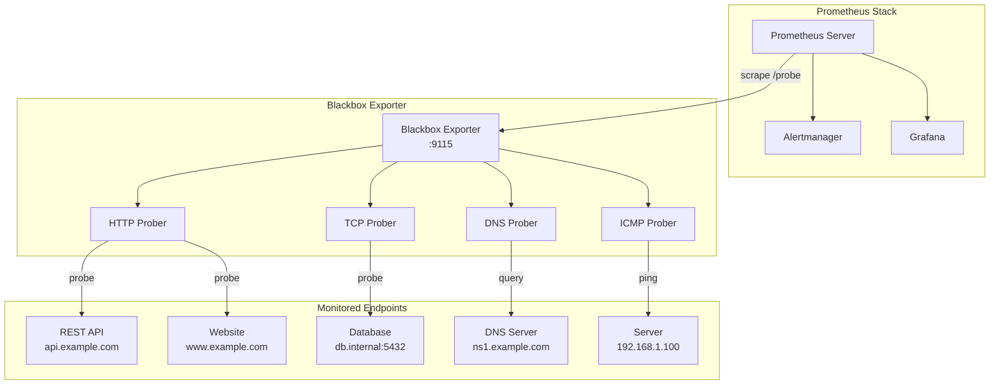
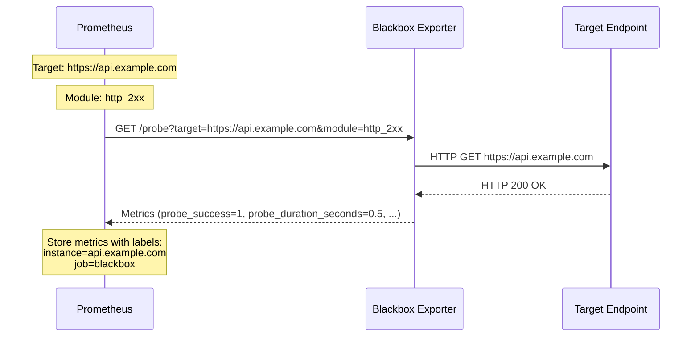
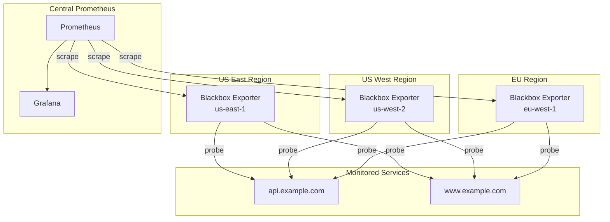

# How to Implement Prometheus Blackbox Exporter

Author: [nawazdhandala](https://www.github.com/nawazdhandala)

Tags: Prometheus, Blackbox Exporter, Monitoring, HTTP, TCP, DNS, ICMP, Probing, Observability, Alerting

Description: Learn how to implement Prometheus Blackbox Exporter to monitor endpoints via HTTP, TCP, DNS, and ICMP probes. Master external endpoint monitoring with practical configuration examples and alerting rules.

---

> Monitoring your services from the inside tells you what's happening. Monitoring from the outside tells you what your users experience. Blackbox Exporter bridges that gap by probing endpoints the same way external clients would.

External endpoint monitoring reveals problems that internal metrics miss entirely. When your database connection pool looks healthy but users can't reach your API, blackbox probing catches the issue. Prometheus Blackbox Exporter provides a standardized way to probe HTTP, TCP, DNS, and ICMP endpoints while exposing results as Prometheus metrics.

---

## What is Blackbox Exporter?

Blackbox Exporter is a Prometheus exporter that allows you to probe endpoints over HTTP, HTTPS, DNS, TCP, and ICMP. Unlike traditional exporters that instrument applications from within, Blackbox Exporter performs external probing to verify that services respond correctly from the network perspective.

### Architecture Overview

The following diagram illustrates how Blackbox Exporter fits into a Prometheus monitoring stack:



---

## Installation Methods

### Docker Installation

Running Blackbox Exporter in Docker provides the simplest deployment path. The following command starts the exporter with the default configuration:

```bash
# Pull and run the official Blackbox Exporter image
# Port 9115 is the default port for the exporter
docker run -d \
  --name blackbox-exporter \
  -p 9115:9115 \
  prom/blackbox-exporter:latest
```

### Docker Compose Deployment

For production environments, Docker Compose enables custom configuration mounting. Save your configuration as blackbox.yml and mount it into the container:

```yaml
# docker-compose.yml
# Deploy Blackbox Exporter with custom configuration
version: '3.8'

services:
  blackbox-exporter:
    image: prom/blackbox-exporter:latest
    container_name: blackbox-exporter
    # Restart automatically if the container crashes
    restart: unless-stopped
    ports:
      # Expose metrics endpoint on port 9115
      - "9115:9115"
    volumes:
      # Mount custom configuration file
      - ./blackbox.yml:/etc/blackbox_exporter/config.yml:ro
    command:
      # Specify the configuration file path
      - '--config.file=/etc/blackbox_exporter/config.yml'
      # Set log level for troubleshooting
      - '--log.level=info'
```

### Binary Installation

Installing from binary works well for bare-metal servers. Download the appropriate release for your architecture:

```bash
# Download the latest release (check GitHub for current version)
wget https://github.com/prometheus/blackbox_exporter/releases/download/v0.25.0/blackbox_exporter-0.25.0.linux-amd64.tar.gz

# Extract the archive
tar xvfz blackbox_exporter-0.25.0.linux-amd64.tar.gz

# Move binary to system path
sudo mv blackbox_exporter-0.25.0.linux-amd64/blackbox_exporter /usr/local/bin/

# Create configuration directory
sudo mkdir -p /etc/blackbox_exporter

# Copy default configuration
sudo mv blackbox_exporter-0.25.0.linux-amd64/blackbox.yml /etc/blackbox_exporter/
```

### Systemd Service Configuration

Creating a systemd service ensures Blackbox Exporter starts automatically and restarts on failure:

```ini
# /etc/systemd/system/blackbox_exporter.service
# Systemd unit file for Blackbox Exporter
[Unit]
Description=Prometheus Blackbox Exporter
Documentation=https://github.com/prometheus/blackbox_exporter
Wants=network-online.target
After=network-online.target

[Service]
# Run as dedicated user for security
User=blackbox_exporter
Group=blackbox_exporter
Type=simple
# Specify configuration file location
ExecStart=/usr/local/bin/blackbox_exporter \
    --config.file=/etc/blackbox_exporter/blackbox.yml \
    --web.listen-address=:9115
# Restart on failure with 5 second delay
Restart=on-failure
RestartSec=5

[Install]
WantedBy=multi-user.target
```

Enable and start the service:

```bash
# Create dedicated user for running the exporter
sudo useradd --no-create-home --shell /bin/false blackbox_exporter

# Reload systemd daemon to recognize new service
sudo systemctl daemon-reload

# Enable service to start on boot
sudo systemctl enable blackbox_exporter

# Start the service
sudo systemctl start blackbox_exporter

# Verify the service is running
sudo systemctl status blackbox_exporter
```

---

## Configuration Deep Dive

Blackbox Exporter uses modules to define different probing behaviors. Each module specifies a prober type and its settings.

### Basic Configuration Structure

The configuration file defines modules that Prometheus references when scraping targets:

```yaml
# /etc/blackbox_exporter/blackbox.yml
# Main configuration file for Blackbox Exporter
modules:
  # Each module defines a specific type of probe
  # Prometheus will reference these module names in scrape configs

  http_2xx:
    # Prober specifies the protocol to use
    prober: http
    # Timeout for the entire probe operation
    timeout: 5s
    http:
      # HTTP method to use
      method: GET
      # List of status codes considered successful
      valid_status_codes: [200, 201, 202, 204]
      # Follow redirects up to this many times
      follow_redirects: true
      # Fail if SSL certificate is invalid
      fail_if_ssl: false
      fail_if_not_ssl: false
```

### HTTP Probe Configuration

HTTP probes verify web endpoints respond correctly. Multiple options allow fine-grained control over what constitutes a successful probe:

```yaml
# blackbox.yml - HTTP probe configurations
modules:
  # Basic HTTP probe checking for 2xx response
  http_2xx:
    prober: http
    timeout: 10s
    http:
      method: GET
      valid_status_codes: []  # Empty means any 2xx is valid
      follow_redirects: true
      preferred_ip_protocol: ip4

  # HTTP probe with authentication
  http_basic_auth:
    prober: http
    timeout: 10s
    http:
      method: GET
      valid_status_codes: [200]
      # Basic authentication credentials
      basic_auth:
        username: "monitoring"
        password: "secret-password"

  # HTTP probe with bearer token
  http_bearer_token:
    prober: http
    timeout: 10s
    http:
      method: GET
      # Include bearer token in Authorization header
      bearer_token: "your-api-token-here"
      # Alternatively, load from file for security
      # bearer_token_file: /etc/blackbox_exporter/token

  # HTTP POST probe with body validation
  http_post_json:
    prober: http
    timeout: 15s
    http:
      method: POST
      # Set content type for JSON payload
      headers:
        Content-Type: application/json
        Accept: application/json
      # Request body for POST
      body: '{"action": "health_check"}'
      valid_status_codes: [200]
      # Fail if response body does not contain this regex
      fail_if_body_not_matches_regexp:
        - '"status":\s*"ok"'

  # HTTP probe validating response content
  http_content_check:
    prober: http
    timeout: 10s
    http:
      method: GET
      valid_status_codes: [200]
      # Fail if these patterns appear in response
      fail_if_body_matches_regexp:
        - "error"
        - "exception"
        - "maintenance mode"
      # Fail if these patterns are missing
      fail_if_body_not_matches_regexp:
        - "healthy"
```

### TLS and Certificate Monitoring

Monitoring SSL/TLS certificates prevents unexpected expirations from causing outages:

```yaml
# blackbox.yml - TLS certificate monitoring
modules:
  # HTTPS probe with certificate validation
  https_2xx:
    prober: http
    timeout: 10s
    http:
      method: GET
      valid_status_codes: [200]
      # Enforce HTTPS connection
      fail_if_not_ssl: true
      tls_config:
        # Reject invalid certificates
        insecure_skip_verify: false
        # Minimum TLS version required
        min_version: TLS12

  # HTTPS probe allowing self-signed certificates
  https_selfsigned:
    prober: http
    timeout: 10s
    http:
      method: GET
      valid_status_codes: [200]
      fail_if_not_ssl: true
      tls_config:
        # Skip certificate verification for internal services
        insecure_skip_verify: true

  # HTTPS with client certificate authentication
  https_mtls:
    prober: http
    timeout: 10s
    http:
      method: GET
      valid_status_codes: [200]
      tls_config:
        # Client certificate for mutual TLS
        cert_file: /etc/blackbox_exporter/client.crt
        key_file: /etc/blackbox_exporter/client.key
        # CA certificate to verify server
        ca_file: /etc/blackbox_exporter/ca.crt
```

### TCP Probe Configuration

TCP probes verify that services accept connections on specified ports:

```yaml
# blackbox.yml - TCP probe configurations
modules:
  # Basic TCP connection check
  tcp_connect:
    prober: tcp
    timeout: 5s
    tcp:
      # Use IPv4 by default
      preferred_ip_protocol: ip4
      # Fall back to IPv6 if IPv4 fails
      ip_protocol_fallback: true

  # TCP probe with TLS (for databases, message queues)
  tcp_tls:
    prober: tcp
    timeout: 10s
    tcp:
      tls: true
      tls_config:
        insecure_skip_verify: false
        min_version: TLS12

  # TCP probe expecting specific response
  tcp_banner:
    prober: tcp
    timeout: 5s
    tcp:
      # Send this string after connecting
      query_response:
        # Expect server banner matching regex
        - expect: "^220.*SMTP"
        # Send command
        - send: "QUIT\r\n"
        # Expect goodbye response
        - expect: "^221"

  # Redis health check
  redis_ping:
    prober: tcp
    timeout: 5s
    tcp:
      query_response:
        # Send PING command
        - send: "PING\r\n"
        # Expect PONG response
        - expect: "^\\+PONG"

  # MySQL connection check
  mysql_connect:
    prober: tcp
    timeout: 5s
    tcp:
      query_response:
        # MySQL sends version string on connect
        - expect: "^.{4}\x0a(5|8)\\."
```

### DNS Probe Configuration

DNS probes verify name resolution works correctly:

```yaml
# blackbox.yml - DNS probe configurations
modules:
  # Basic DNS query
  dns_lookup:
    prober: dns
    timeout: 5s
    dns:
      # Query type: A, AAAA, MX, TXT, etc.
      query_type: A
      # Name to query
      query_name: example.com
      # Use TCP instead of UDP (optional)
      transport_protocol: udp
      preferred_ip_protocol: ip4

  # DNS probe validating response
  dns_validate:
    prober: dns
    timeout: 5s
    dns:
      query_type: A
      query_name: api.example.com
      # Fail if answer does not contain these IPs
      validate_answer_rrs:
        fail_if_not_matches_regexp:
          - "10\\.0\\..*"

  # MX record check
  dns_mx:
    prober: dns
    timeout: 5s
    dns:
      query_type: MX
      query_name: example.com
      validate_answer_rrs:
        fail_if_not_matches_regexp:
          - "mail\\.example\\.com"

  # DNS-over-TLS probe
  dns_tls:
    prober: dns
    timeout: 5s
    dns:
      query_type: A
      query_name: example.com
      transport_protocol: tcp
      dns_over_tls: true
```

### ICMP Probe Configuration

ICMP probes (ping) verify basic network connectivity:

```yaml
# blackbox.yml - ICMP probe configurations
modules:
  # Basic ICMP ping
  icmp_ping:
    prober: icmp
    timeout: 5s
    icmp:
      preferred_ip_protocol: ip4
      ip_protocol_fallback: true

  # ICMP with custom packet size
  icmp_mtu:
    prober: icmp
    timeout: 5s
    icmp:
      preferred_ip_protocol: ip4
      # Test MTU by sending larger packets
      payload_size: 1472
      # Do not fragment
      dont_fragment: true

  # IPv6 ICMP probe
  icmp_ipv6:
    prober: icmp
    timeout: 5s
    icmp:
      preferred_ip_protocol: ip6
      ip_protocol_fallback: false
```

---

## Prometheus Configuration

Prometheus needs special configuration to use Blackbox Exporter. The relabeling mechanism passes targets to the exporter.

### Basic Scrape Configuration

Understanding the relabeling flow helps debug issues. The following diagram shows how labels transform:



Configure Prometheus to scrape through Blackbox Exporter:

```yaml
# prometheus.yml - Blackbox Exporter scrape configuration
global:
  scrape_interval: 15s
  evaluation_interval: 15s

scrape_configs:
  # Monitor HTTP endpoints
  - job_name: 'blackbox-http'
    # Interval for probing endpoints
    scrape_interval: 30s
    # Timeout must be less than scrape_interval
    scrape_timeout: 25s
    # Path to metrics endpoint on Blackbox Exporter
    metrics_path: /probe
    params:
      # Module to use from blackbox.yml
      module: [http_2xx]
    static_configs:
      # List of targets to probe
      - targets:
          - https://api.example.com/health
          - https://www.example.com
          - https://dashboard.example.com/status
    relabel_configs:
      # Store the original target URL
      - source_labels: [__address__]
        target_label: __param_target
      # Add target as label for identification
      - source_labels: [__param_target]
        target_label: instance
      # Replace address with Blackbox Exporter address
      - target_label: __address__
        replacement: blackbox-exporter:9115

  # Monitor TCP services
  - job_name: 'blackbox-tcp'
    scrape_interval: 30s
    scrape_timeout: 15s
    metrics_path: /probe
    params:
      module: [tcp_connect]
    static_configs:
      - targets:
          # Format: host:port
          - db.internal:5432
          - redis.internal:6379
          - rabbitmq.internal:5672
    relabel_configs:
      - source_labels: [__address__]
        target_label: __param_target
      - source_labels: [__param_target]
        target_label: instance
      - target_label: __address__
        replacement: blackbox-exporter:9115

  # Monitor DNS servers
  - job_name: 'blackbox-dns'
    scrape_interval: 60s
    scrape_timeout: 30s
    metrics_path: /probe
    params:
      module: [dns_lookup]
    static_configs:
      - targets:
          - 8.8.8.8
          - 1.1.1.1
          - ns1.example.com
    relabel_configs:
      - source_labels: [__address__]
        target_label: __param_target
      - source_labels: [__param_target]
        target_label: instance
      - target_label: __address__
        replacement: blackbox-exporter:9115

  # ICMP ping monitoring
  - job_name: 'blackbox-icmp'
    scrape_interval: 30s
    scrape_timeout: 15s
    metrics_path: /probe
    params:
      module: [icmp_ping]
    static_configs:
      - targets:
          - 192.168.1.1
          - gateway.example.com
          - server1.example.com
    relabel_configs:
      - source_labels: [__address__]
        target_label: __param_target
      - source_labels: [__param_target]
        target_label: instance
      - target_label: __address__
        replacement: blackbox-exporter:9115
```

### Dynamic Target Discovery

For dynamic environments, use service discovery instead of static targets:

```yaml
# prometheus.yml - Using file-based service discovery
scrape_configs:
  - job_name: 'blackbox-http-sd'
    scrape_interval: 30s
    metrics_path: /probe
    params:
      module: [http_2xx]
    # File-based service discovery
    file_sd_configs:
      - files:
          - /etc/prometheus/targets/http_targets.yml
        # Reload targets every 5 minutes
        refresh_interval: 5m
    relabel_configs:
      - source_labels: [__address__]
        target_label: __param_target
      - source_labels: [__param_target]
        target_label: instance
      - target_label: __address__
        replacement: blackbox-exporter:9115
```

Create the targets file:

```yaml
# /etc/prometheus/targets/http_targets.yml
# Dynamic target list for HTTP probing
- targets:
    - https://api.example.com/health
    - https://www.example.com
  labels:
    environment: production
    team: platform

- targets:
    - https://staging-api.example.com/health
  labels:
    environment: staging
    team: platform
```

---

## Key Metrics Explained

Blackbox Exporter produces several metrics for each probe. Understanding these metrics enables effective alerting and dashboards.

### Probe Success and Duration

The most fundamental metrics indicate whether probes succeed and how long they take:

| Metric | Type | Description |
|--------|------|-------------|
| `probe_success` | Gauge | 1 if probe succeeded, 0 if failed |
| `probe_duration_seconds` | Gauge | Total time for probe to complete |
| `probe_dns_lookup_time_seconds` | Gauge | Time spent on DNS resolution |

### HTTP-Specific Metrics

HTTP probes expose additional timing and status information:

| Metric | Type | Description |
|--------|------|-------------|
| `probe_http_status_code` | Gauge | HTTP response status code |
| `probe_http_content_length` | Gauge | Response body length in bytes |
| `probe_http_redirects` | Gauge | Number of redirects followed |
| `probe_http_ssl` | Gauge | 1 if connection used SSL |
| `probe_http_version` | Gauge | HTTP version (1 for HTTP/1.1, 2 for HTTP/2) |
| `probe_http_duration_seconds` | Gauge | Duration by phase (resolve, connect, tls, transfer) |

### SSL Certificate Metrics

Certificate expiration monitoring prevents outages:

| Metric | Type | Description |
|--------|------|-------------|
| `probe_ssl_earliest_cert_expiry` | Gauge | Unix timestamp of certificate expiration |
| `probe_ssl_last_chain_info` | Gauge | Information about certificate chain |
| `probe_tls_version_info` | Gauge | TLS version used |

### DNS-Specific Metrics

DNS probes provide resolution timing and response details:

| Metric | Type | Description |
|--------|------|-------------|
| `probe_dns_lookup_time_seconds` | Gauge | Time to resolve DNS query |
| `probe_dns_answer_rrs` | Gauge | Number of resource records in answer |
| `probe_dns_authority_rrs` | Gauge | Number of authority records |
| `probe_dns_additional_rrs` | Gauge | Number of additional records |

### ICMP-Specific Metrics

ICMP probes expose packet timing:

| Metric | Type | Description |
|--------|------|-------------|
| `probe_icmp_duration_seconds` | Gauge | Round-trip time for ICMP packet |
| `probe_icmp_reply_hop_limit` | Gauge | TTL value in reply |

---

## Alerting Rules

Effective alerting catches problems before users notice them. The following rules provide a starting point:

```yaml
# prometheus_rules.yml - Alerting rules for Blackbox Exporter
groups:
  - name: blackbox
    rules:
      # Alert when any endpoint is down
      - alert: EndpointDown
        # Probe failed in last 2 checks
        expr: probe_success == 0
        for: 2m
        labels:
          severity: critical
        annotations:
          summary: "Endpoint {{ $labels.instance }} is down"
          description: "Probe failed for {{ $labels.instance }} in job {{ $labels.job }}"

      # Alert on slow response times
      - alert: EndpointSlowResponse
        expr: probe_duration_seconds > 2
        for: 5m
        labels:
          severity: warning
        annotations:
          summary: "Slow response from {{ $labels.instance }}"
          description: "Response time is {{ $value | humanizeDuration }} for {{ $labels.instance }}"

      # Alert on SSL certificate expiring soon
      - alert: SSLCertificateExpiringSoon
        # Certificate expires in less than 30 days
        expr: (probe_ssl_earliest_cert_expiry - time()) / 86400 < 30
        for: 1h
        labels:
          severity: warning
        annotations:
          summary: "SSL certificate expiring soon for {{ $labels.instance }}"
          description: "Certificate expires in {{ $value | humanize }} days"

      # Alert on SSL certificate about to expire
      - alert: SSLCertificateExpiringCritical
        # Certificate expires in less than 7 days
        expr: (probe_ssl_earliest_cert_expiry - time()) / 86400 < 7
        for: 1h
        labels:
          severity: critical
        annotations:
          summary: "SSL certificate critically expiring for {{ $labels.instance }}"
          description: "Certificate expires in {{ $value | humanize }} days"

      # Alert if SSL is expected but not present
      - alert: SSLNotEnabled
        expr: probe_http_ssl == 0
        for: 5m
        labels:
          severity: warning
        annotations:
          summary: "SSL not enabled for {{ $labels.instance }}"
          description: "Endpoint {{ $labels.instance }} is not using SSL"

      # Alert on HTTP errors
      - alert: HTTPStatusError
        expr: probe_http_status_code >= 400
        for: 2m
        labels:
          severity: warning
        annotations:
          summary: "HTTP error {{ $value }} for {{ $labels.instance }}"
          description: "HTTP status code {{ $value }} returned by {{ $labels.instance }}"

      # Alert if DNS resolution is slow
      - alert: DNSResolutionSlow
        expr: probe_dns_lookup_time_seconds > 1
        for: 5m
        labels:
          severity: warning
        annotations:
          summary: "Slow DNS resolution for {{ $labels.instance }}"
          description: "DNS lookup took {{ $value | humanizeDuration }}"

      # Alert if probe timeout occurs frequently
      - alert: ProbeTimeout
        expr: probe_duration_seconds >= 10
        for: 5m
        labels:
          severity: warning
        annotations:
          summary: "Probe timeout for {{ $labels.instance }}"
          description: "Probe is timing out after {{ $value | humanizeDuration }}"
```

---

## Grafana Dashboard

Visualizing probe data helps identify trends and anomalies. The following queries work in Grafana dashboards:

### Uptime Panel

Calculate uptime percentage over time:

```promql
# Uptime percentage over the last 24 hours
avg_over_time(probe_success{job="blackbox-http"}[24h]) * 100
```

### Response Time Panel

Track response time percentiles:

```promql
# 95th percentile response time
histogram_quantile(0.95,
  sum(rate(probe_duration_seconds_bucket[5m])) by (le, instance)
)

# Average response time by endpoint
avg by (instance) (probe_duration_seconds)
```

### SSL Certificate Expiry Table

Display certificate expiration dates:

```promql
# Days until certificate expires
(probe_ssl_earliest_cert_expiry - time()) / 86400
```

### Probe Status Heatmap

Show probe success over time:

```promql
# Probe success/failure over time
probe_success{job="blackbox-http"}
```

---

## Advanced Configuration

### Probe Chaining

Chain multiple probes to test complex workflows:

```yaml
# prometheus.yml - Testing a multi-step workflow
scrape_configs:
  # Step 1: Check authentication endpoint
  - job_name: 'blackbox-auth'
    scrape_interval: 60s
    metrics_path: /probe
    params:
      module: [http_post_auth]
    static_configs:
      - targets:
          - https://api.example.com/auth/login
    relabel_configs:
      - source_labels: [__address__]
        target_label: __param_target
      - source_labels: [__param_target]
        target_label: instance
      - source_labels: []
        target_label: step
        replacement: auth
      - target_label: __address__
        replacement: blackbox-exporter:9115

  # Step 2: Check API endpoint
  - job_name: 'blackbox-api'
    scrape_interval: 60s
    metrics_path: /probe
    params:
      module: [http_bearer_token]
    static_configs:
      - targets:
          - https://api.example.com/v1/users
    relabel_configs:
      - source_labels: [__address__]
        target_label: __param_target
      - source_labels: [__param_target]
        target_label: instance
      - source_labels: []
        target_label: step
        replacement: api
      - target_label: __address__
        replacement: blackbox-exporter:9115
```

### Multi-Location Probing

Deploy Blackbox Exporters in multiple locations to detect regional issues:



Configure Prometheus to distinguish between regions:

```yaml
# prometheus.yml - Multi-region probing
scrape_configs:
  - job_name: 'blackbox-http-us-east'
    scrape_interval: 30s
    metrics_path: /probe
    params:
      module: [http_2xx]
    static_configs:
      - targets:
          - https://api.example.com/health
        labels:
          region: us-east-1
    relabel_configs:
      - source_labels: [__address__]
        target_label: __param_target
      - source_labels: [__param_target]
        target_label: instance
      - target_label: __address__
        replacement: blackbox-us-east.internal:9115

  - job_name: 'blackbox-http-us-west'
    scrape_interval: 30s
    metrics_path: /probe
    params:
      module: [http_2xx]
    static_configs:
      - targets:
          - https://api.example.com/health
        labels:
          region: us-west-2
    relabel_configs:
      - source_labels: [__address__]
        target_label: __param_target
      - source_labels: [__param_target]
        target_label: instance
      - target_label: __address__
        replacement: blackbox-us-west.internal:9115
```

---

## Troubleshooting

### Debug Mode

Enable debug logging to diagnose probe failures:

```bash
# Start with debug logging
blackbox_exporter --config.file=/etc/blackbox_exporter/blackbox.yml --log.level=debug
```

### Manual Probe Testing

Test probes directly via curl to isolate issues:

```bash
# Test HTTP probe manually
curl -s "http://localhost:9115/probe?target=https://example.com&module=http_2xx" | grep probe_

# Output shows all probe metrics
# probe_success 1
# probe_duration_seconds 0.234567
# probe_http_status_code 200
```

### Common Issues and Solutions

**Probe always fails with timeout:**

```yaml
# Increase timeout in module configuration
modules:
  http_slow:
    prober: http
    # Increase from default 5s
    timeout: 30s
    http:
      method: GET
```

**SSL verification fails for internal services:**

```yaml
# Skip SSL verification for internal endpoints
modules:
  http_internal:
    prober: http
    timeout: 10s
    http:
      method: GET
      tls_config:
        insecure_skip_verify: true
```

**ICMP probes require root privileges:**

```bash
# Option 1: Run as root (not recommended)
sudo blackbox_exporter --config.file=/etc/blackbox_exporter/blackbox.yml

# Option 2: Grant capabilities (recommended)
sudo setcap cap_net_raw+ep /usr/local/bin/blackbox_exporter
```

**DNS probe fails to resolve:**

```yaml
# Verify DNS module configuration
modules:
  dns_test:
    prober: dns
    timeout: 5s
    dns:
      query_name: example.com
      query_type: A
      # Explicitly set transport protocol
      transport_protocol: udp
      preferred_ip_protocol: ip4
```

---

## Integration with OneUptime

OneUptime integrates with Prometheus and Blackbox Exporter for comprehensive endpoint monitoring. By connecting your Prometheus instance to OneUptime, you gain:

- Unified dashboards showing probe results alongside application metrics
- Advanced alerting with escalation policies and on-call scheduling
- Historical data analysis for SLA reporting
- Automatic incident creation when probes fail

Configure your Prometheus remote write to send Blackbox Exporter metrics to OneUptime for centralized observability.

---

## Conclusion

Prometheus Blackbox Exporter provides essential external monitoring capabilities that complement internal application metrics. By probing HTTP endpoints, TCP services, DNS servers, and network connectivity, you catch issues that internal instrumentation misses.

Key takeaways:

- Blackbox probing tests services from the user's perspective
- HTTP probes validate both connectivity and response content
- SSL certificate monitoring prevents unexpected expirations
- Multi-location probing detects regional outages
- Proper alerting rules turn probe data into actionable notifications

Start with basic HTTP endpoint monitoring, then expand to cover TCP services, DNS resolution, and network connectivity. The combination of internal metrics and external probing provides complete visibility into your system's health.

---

*Need centralized monitoring for your Prometheus data? [OneUptime](https://oneuptime.com) provides unified observability with dashboards, alerting, and incident management. Connect your Blackbox Exporter metrics for complete endpoint monitoring.*

**Related Reading:**
- [How to Add Custom Metrics to Python Applications with Prometheus](https://oneuptime.com/blog/post/2025-01-06-python-custom-metrics-prometheus/view)
- [What are Metrics in OpenTelemetry](https://oneuptime.com/blog/post/2025-08-26-what-are-metrics-in-opentelemetry/view)
